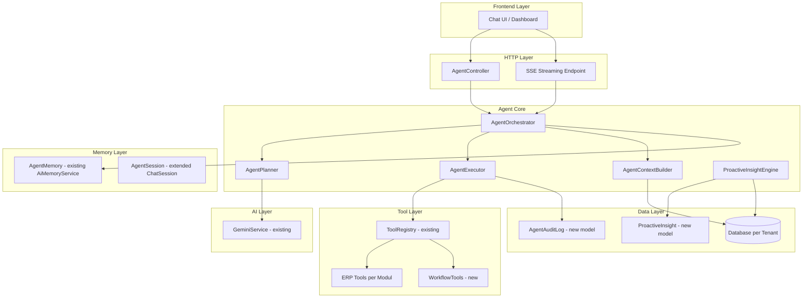
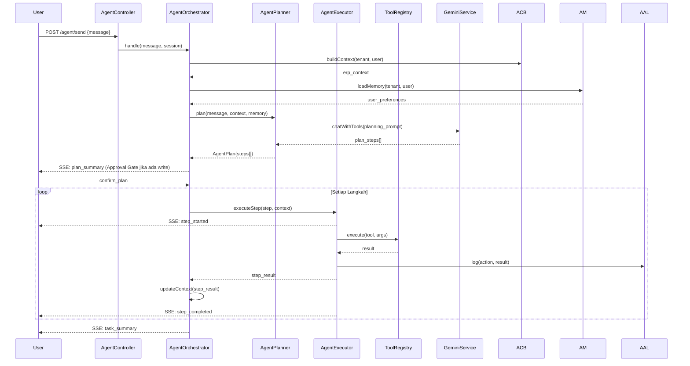
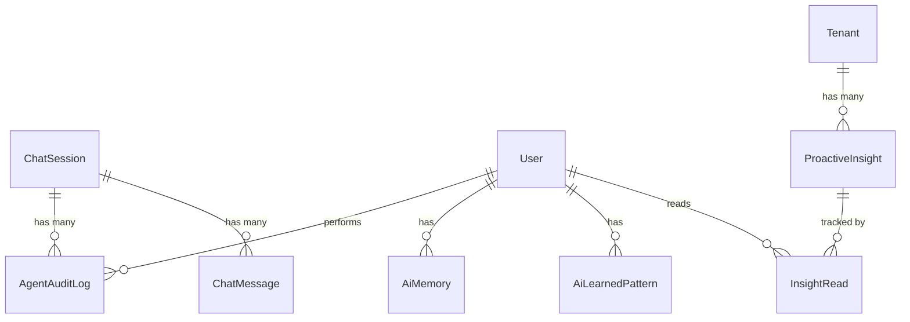

# Design Document: ERP AI Agent

## Overview

ERP AI Agent adalah evolusi dari AI Chat yang sudah ada pada Qalcuity ERP menjadi agen cerdas yang mampu mengeksekusi task multi-langkah secara otonom, menganalisis data lintas modul, memberikan rekomendasi proaktif, dan mempertahankan memori jangka panjang per tenant/user.

Sistem ini dibangun di atas infrastruktur yang sudah ada — `GeminiService`, `ToolRegistry`, `ChatController`, `AiMemoryService`, dan ERP Tools per modul — dengan menambahkan lapisan orkestrasi baru: `AgentPlanner`, `AgentExecutor`, `AgentContextBuilder`, dan `ProactiveInsightEngine`.

### Prinsip Desain

- **Evolusi, bukan revolusi**: Memaksimalkan reuse infrastruktur yang ada, hanya menambahkan lapisan baru di atasnya.
- **Tenant-first isolation**: Setiap operasi selalu di-scope ke `tenant_id` yang terverifikasi.
- **Human-in-the-loop**: Operasi write selalu memerlukan konfirmasi eksplisit dari user (Approval Gate).
- **Auditability**: Setiap aksi agent dicatat lengkap di `AgentAuditLog`.
- **Graceful degradation**: Jika modul tidak aktif atau data tidak tersedia, agent tetap memberikan respons parsial yang informatif.

---

## Architecture

Arsitektur ERP AI Agent menggunakan pola **Orchestrator-Executor** dengan lapisan memori dan konteks yang persisten.



### Alur Eksekusi Multi-Langkah



---

## Components and Interfaces

### 1. AgentOrchestrator

Komponen utama yang mengorkestrasi seluruh alur eksekusi agent. Menggantikan logika di `ChatController` untuk request yang memerlukan multi-step planning.

```php
namespace App\Services\Agent;

class AgentOrchestrator
{
    public function __construct(
        private AgentPlanner $planner,
        private AgentExecutor $executor,
        private AgentContextBuilder $contextBuilder,
        private AiMemoryService $memory,
        private GeminiService $gemini,
    ) {}

    /**
     * Handle pesan user dan orkestrasi eksekusi.
     * Mengembalikan Generator untuk SSE streaming.
     */
    public function handle(
        string $message,
        User $user,
        AgentSession $session,
        bool $confirmed = false,
    ): \Generator {}

    /**
     * Batalkan eksekusi yang sedang berjalan untuk session tertentu.
     */
    public function cancel(AgentSession $session): void {}
}
```

### 2. AgentPlanner

Memecah instruksi kompleks menjadi rencana langkah-langkah yang dapat dieksekusi.

```php
namespace App\Services\Agent;

class AgentPlanner
{
    /**
     * Buat rencana eksekusi dari instruksi user.
     * Menggunakan GeminiService dengan planning prompt khusus.
     *
     * @return AgentPlan dengan maksimal 10 langkah
     */
    public function plan(
        string $instruction,
        ErpContext $context,
        array $availableTools,
        string $language = 'id',
    ): AgentPlan {}

    /**
     * Deteksi apakah instruksi memerlukan multi-step planning
     * atau bisa langsung dijawab sebagai single-turn.
     */
    public function requiresPlanning(string $instruction): bool {}
}
```

**AgentPlan DTO:**

```php
namespace App\DTOs\Agent;

class AgentPlan
{
    public function __construct(
        public readonly string $goal,
        public readonly array $steps,      // AgentStep[]
        public readonly string $summary,
        public readonly bool $hasWriteOps,
        public readonly string $language,
    ) {}
}

class AgentStep
{
    public function __construct(
        public readonly int $order,
        public readonly string $name,
        public readonly string $toolName,
        public readonly array $args,
        public readonly bool $isWriteOp,
        public readonly ?string $dependsOnStep = null,
    ) {}
}
```

### 3. AgentExecutor

Mengeksekusi setiap langkah dalam plan, mengelola context propagation antar langkah.

```php
namespace App\Services\Agent;

class AgentExecutor
{
    /**
     * Eksekusi satu langkah dari plan.
     * Mengembalikan hasil eksekusi dan context yang diperbarui.
     */
    public function executeStep(
        AgentStep $step,
        ExecutionContext $context,
        ToolRegistry $registry,
    ): StepResult {}

    /**
     * Resolve args langkah dengan mengganti placeholder
     * dari output langkah sebelumnya.
     * Contoh: {{step_1.product_id}} -> actual value
     */
    public function resolveArgs(array $args, ExecutionContext $context): array {}

    /**
     * Cek apakah aksi dapat di-undo dalam window 5 menit.
     */
    public function canUndo(AgentAuditLog $log): bool {}

    /**
     * Undo aksi write yang dieksekusi dalam 5 menit terakhir.
     */
    public function undo(AgentAuditLog $log, ToolRegistry $registry): UndoResult {}
}
```

### 4. AgentContextBuilder

Membangun ERP_Context dari data tenant saat ini.

```php
namespace App\Services\Agent;

class AgentContextBuilder
{
    /**
     * Bangun ERP_Context lengkap untuk tenant.
     * Harus selesai dalam < 3 detik.
     * Menggunakan parallel queries untuk efisiensi.
     */
    public function build(int $tenantId, array $activeModules): ErpContext {}

    /**
     * Refresh bagian tertentu dari ERP_Context
     * tanpa rebuild penuh (untuk update incremental).
     */
    public function refresh(ErpContext $context, string $module): ErpContext {}
}
```

**ErpContext DTO:**

```php
namespace App\DTOs\Agent;

class ErpContext
{
    public function __construct(
        public readonly int $tenantId,
        public readonly array $kpiSummary,       // revenue, critical_stock, overdue_ar, active_employees
        public readonly array $activeModules,
        public readonly ?string $accountingPeriod,
        public readonly array $industrySkills,
        public readonly \Carbon\Carbon $builtAt,
    ) {}

    public function toSystemPrompt(): string {}
    public function isStale(int $maxAgeSeconds = 300): bool {}
}
```

### 5. ProactiveInsightEngine

Menganalisis kondisi bisnis secara terjadwal dan menghasilkan Proactive_Insight.

```php
namespace App\Services\Agent;

class ProactiveInsightEngine
{
    /**
     * Analisis kondisi bisnis tenant dan generate insights.
     * Dipanggil oleh scheduled job setiap 6 jam.
     */
    public function analyze(int $tenantId): array {} // ProactiveInsight[]

    /**
     * Ambil insights yang belum dibaca untuk user tertentu.
     */
    public function getPendingInsights(int $tenantId, int $userId): array {}

    /**
     * Tandai insight sebagai dismissed/handled.
     * Suppress insight serupa selama 24 jam.
     */
    public function dismiss(ProactiveInsight $insight, string $reason): void {}
}
```

### 6. SkillRouter

Mendeteksi domain bisnis dari pesan user dan mengaktifkan Skill yang relevan.

```php
namespace App\Services\Agent;

class SkillRouter
{
    /**
     * Deteksi skill yang relevan berdasarkan intent pesan.
     * Mengembalikan array skill names yang aktif.
     */
    public function detectSkills(string $message, array $activeModules): array {}

    /**
     * Bangun system prompt tambahan untuk skill tertentu.
     */
    public function buildSkillPrompt(array $skills, ErpContext $context): string {}
}
```

### 7. AgentController (HTTP Layer)

Menggantikan/memperluas `ChatController` untuk request agent.

```php
namespace App\Http\Controllers;

class AgentController extends Controller
{
    /** POST /agent/send - Kirim pesan ke agent (non-streaming) */
    public function send(Request $request): JsonResponse {}

    /** POST /agent/stream - Kirim pesan ke agent (SSE streaming) */
    public function stream(Request $request): StreamedResponse {}

    /** POST /agent/confirm - Konfirmasi plan sebelum eksekusi */
    public function confirm(Request $request): JsonResponse {}

    /** POST /agent/cancel - Batalkan eksekusi yang sedang berjalan */
    public function cancel(Request $request): JsonResponse {}

    /** POST /agent/undo - Undo aksi write terakhir */
    public function undo(Request $request): JsonResponse {}

    /** GET /agent/insights - Ambil proactive insights */
    public function insights(Request $request): JsonResponse {}

    /** POST /agent/insights/{id}/dismiss - Dismiss insight */
    public function dismissInsight(Request $request, int $id): JsonResponse {}

    /** GET /agent/memory - Lihat data memori user */
    public function memory(Request $request): JsonResponse {}

    /** DELETE /agent/memory - Hapus data memori user */
    public function clearMemory(Request $request): JsonResponse {}
}
```

---

## Data Models

### AgentAuditLog (Model Baru)

```php
// Migration: create_agent_audit_logs_table
Schema::create('agent_audit_logs', function (Blueprint $table) {
    $table->id();
    $table->unsignedBigInteger('tenant_id')->index();
    $table->unsignedBigInteger('user_id')->index();
    $table->unsignedBigInteger('session_id')->nullable()->index();
    $table->string('action_name');           // nama tool yang dieksekusi
    $table->string('action_type');           // read | write
    $table->json('parameters');              // args yang digunakan
    $table->json('result');                  // hasil eksekusi
    $table->string('status');                // success | failed | undone
    $table->text('error_message')->nullable();
    $table->boolean('is_undoable')->default(false);
    $table->timestamp('undoable_until')->nullable();
    $table->timestamps();
    // Tidak ada softDeletes - audit log tidak boleh dihapus
});
```

### ProactiveInsight (Model Baru)

```php
// Migration: create_proactive_insights_table
Schema::create('proactive_insights', function (Blueprint $table) {
    $table->id();
    $table->unsignedBigInteger('tenant_id')->index();
    $table->string('condition_type');        // low_stock | overdue_ar | budget_exceeded | contract_expiry | unpaid_invoice
    $table->string('urgency');               // low | medium | high | critical
    $table->string('title');
    $table->text('description');
    $table->text('business_impact');
    $table->json('recommendations');         // array of actionable recommendations
    $table->json('condition_data');          // data kondisi yang memicu insight
    $table->string('condition_hash');        // hash untuk dedup dalam 24 jam
    $table->timestamp('suppressed_until')->nullable();
    $table->timestamps();
});

// Migration: create_insight_reads_table (pivot untuk tracking per-user)
Schema::create('insight_reads', function (Blueprint $table) {
    $table->id();
    $table->unsignedBigInteger('insight_id')->index();
    $table->unsignedBigInteger('user_id')->index();
    $table->string('status');                // read | dismissed | handled
    $table->timestamp('read_at')->nullable();
    $table->timestamps();
});
```

### AgentSession (Ekstensi ChatSession)

`ChatSession` yang sudah ada diperluas dengan kolom tambahan melalui migration:

```php
// Migration: add_agent_columns_to_chat_sessions_table
Schema::table('chat_sessions', function (Blueprint $table) {
    $table->string('session_type')->default('chat');  // chat | agent
    $table->json('active_plan')->nullable();           // AgentPlan yang sedang berjalan
    $table->string('execution_status')->nullable();    // planning | awaiting_approval | executing | completed | cancelled
    $table->json('erp_context_snapshot')->nullable();  // snapshot ERP_Context saat session dimulai
    $table->boolean('is_cancelled')->default(false);
});
```

### Relasi Model



---

## Correctness Properties

*A property is a characteristic or behavior that should hold true across all valid executions of a system — essentially, a formal statement about what the system should do. Properties serve as the bridge between human-readable specifications and machine-verifiable correctness guarantees.*

### Property 1: Plan Step Count Invariant

*For any* instruksi user yang memerlukan multi-step planning, `AgentPlanner::plan()` SHALL menghasilkan `AgentPlan` dengan jumlah langkah antara 1 dan 10 (inklusif), dan setiap langkah memiliki struktur yang valid (order, name, toolName, args).

**Validates: Requirements 1.1**

### Property 2: Step Output Propagation

*For any* `AgentPlan` dengan N langkah di mana langkah ke-i menghasilkan output, `AgentExecutor` SHALL menyertakan output langkah ke-i dalam `ExecutionContext` yang tersedia untuk langkah ke-(i+1) hingga ke-N.

**Validates: Requirements 1.3**

### Property 3: Fail-Fast Execution

*For any* `AgentPlan` di mana langkah ke-k gagal (k < N), `AgentExecutor` SHALL menghentikan eksekusi setelah langkah ke-k, tidak mengeksekusi langkah ke-(k+1) hingga ke-N, dan mencatat kegagalan di `AgentAuditLog`.

**Validates: Requirements 1.4**

### Property 4: Write Operation Approval Gate

*For any* `AgentPlan` yang mengandung langkah dengan `isWriteOp = true`, `AgentOrchestrator` SHALL menampilkan Approval Gate dan tidak mengeksekusi langkah write tersebut tanpa konfirmasi eksplisit dari user.

**Validates: Requirements 1.5**

### Property 5: ERP Context Completeness

*For any* konfigurasi tenant yang valid (dengan kombinasi modul aktif yang berbeda-beda), `AgentContextBuilder::build()` SHALL menghasilkan `ErpContext` yang selalu mengandung field: `tenantId`, `kpiSummary`, `activeModules`, dan `builtAt`.

**Validates: Requirements 2.1**

### Property 6: Tenant Context Isolation

*For any* dua tenant yang berbeda (tenant_A dan tenant_B), `ErpContext` yang dibangun untuk tenant_A SHALL tidak mengandung data apapun yang berasal dari tenant_B, dan sebaliknya.

**Validates: Requirements 2.5, 9.1**

### Property 7: Partial Cross-Module Results

*For any* Cross_Module_Query yang melibatkan kombinasi modul di mana sebagian modul tidak aktif untuk tenant tersebut, `AgentExecutor` SHALL mengembalikan hasil parsial dari modul yang aktif beserta daftar modul yang tidak tersedia — tidak pernah mengembalikan error total.

**Validates: Requirements 3.5**

### Property 8: Proactive Insight Condition Trigger

*For any* kondisi bisnis tenant yang memenuhi salah satu trigger (stok di bawah reorder point, piutang jatuh tempo > 7 hari, anggaran > 90%, kontrak karyawan berakhir dalam 30 hari, invoice belum dibayar melebihi threshold), `ProactiveInsightEngine::analyze()` SHALL menghasilkan minimal satu `ProactiveInsight` untuk kondisi tersebut.

**Validates: Requirements 4.2**

### Property 9: Proactive Insight Structure Completeness

*For any* `ProactiveInsight` yang dihasilkan oleh `ProactiveInsightEngine`, insight tersebut SHALL selalu mengandung: `title`, `description` (deskripsi kondisi), `business_impact` (dampak bisnis), dan `recommendations` (array dengan minimal satu elemen).

**Validates: Requirements 4.3**

### Property 10: Insight Suppression After Dismiss

*For any* `ProactiveInsight` yang telah di-dismiss oleh user, `ProactiveInsightEngine::getPendingInsights()` SHALL tidak mengembalikan insight dengan `condition_hash` yang sama dalam window 24 jam setelah dismissal.

**Validates: Requirements 4.5**

### Property 11: Memory Isolation Per Tenant-User

*For any* kombinasi (tenant_id_A, user_id_A) dan (tenant_id_B, user_id_B) di mana keduanya berbeda, `AiMemoryService::getPreferences(tenant_id_A, user_id_A)` SHALL tidak pernah mengembalikan data yang berasal dari kombinasi (tenant_id_B, user_id_B).

**Validates: Requirements 5.4**

### Property 12: Memory Confidence Decay

*For any* `AiMemory` record dengan `last_seen_at` lebih dari 90 hari yang lalu, `AiMemoryService::pruneStaleMemories()` SHALL menurunkan `confidence_score` sebesar 50%, dan menghapus record dengan `confidence_score` hasil penurunan di bawah 0.1.

**Validates: Requirements 5.5**

### Property 13: Audit Log Completeness

*For any* operasi write yang berhasil dieksekusi oleh `AgentExecutor`, `AgentAuditLog` yang dibuat SHALL selalu mengandung semua field berikut dengan nilai non-null: `user_id`, `tenant_id`, `action_name`, `parameters`, `result`, `status`, dan `created_at`.

**Validates: Requirements 6.3**

### Property 14: Permission Enforcement

*For any* kombinasi (user, aksi ERP) di mana user tidak memiliki permission untuk aksi tersebut berdasarkan role yang ditetapkan, `AgentExecutor` SHALL menolak eksekusi dan mengembalikan pesan error yang menyebutkan permission yang diperlukan — tidak pernah mengeksekusi aksi tersebut.

**Validates: Requirements 6.5**

### Property 15: Destructive Action Rejection

*For any* instruksi yang mengandung operasi destruktif (bulk delete, modifikasi data historis yang sudah dikunci periode akuntansi), `AgentOrchestrator` SHALL menolak eksekusi dan mengembalikan penjelasan alasan penolakan — tidak pernah mengeksekusi operasi tersebut.

**Validates: Requirements 9.3**

---

## Error Handling

### Strategi Error per Komponen

| Komponen | Jenis Error | Penanganan |
|---|---|---|
| `AgentPlanner` | Gagal generate plan dari Gemini | Retry 1x, fallback ke single-turn response |
| `AgentPlanner` | Instruksi ambigu | Minta klarifikasi ke user |
| `AgentExecutor` | Tool execution gagal | Hentikan plan, log ke `AgentAuditLog`, informasikan user |
| `AgentExecutor` | Timeout tool (> 10 detik) | Anggap gagal, lanjutkan error handling |
| `AgentContextBuilder` | Query KPI timeout (> 3 detik) | Gunakan partial context, tandai field yang tidak tersedia |
| `AgentContextBuilder` | Modul tidak aktif | Skip modul tersebut, catat di `activeModules` sebagai inactive |
| `ProactiveInsightEngine` | Gagal analisis kondisi | Log error, skip kondisi tersebut, lanjutkan kondisi lain |
| `GeminiService` | Rate limit / quota exceeded | Kembalikan error informatif ke user dengan sisa quota |
| `ToolRegistry` | Permission denied | Kembalikan pesan permission yang diperlukan |

### Error Response Format

Semua error dari AgentController dikembalikan dalam format konsisten:

```json
{
  "error": true,
  "code": "PLAN_EXECUTION_FAILED",
  "message": "Eksekusi gagal pada langkah 2: Stok tidak mencukupi untuk penyesuaian.",
  "completed_steps": [
    {"step": 1, "name": "Cek stok produk", "status": "success"}
  ],
  "failed_step": {"step": 2, "name": "Sesuaikan stok", "status": "failed"},
  "session_id": 123
}
```

### Cancellation Handling

Ketika user membatalkan eksekusi:
1. `AgentOrchestrator` memeriksa flag `is_cancelled` pada `AgentSession` sebelum setiap langkah.
2. Langkah yang sedang berjalan diselesaikan (tidak di-interrupt di tengah jalan).
3. Langkah berikutnya tidak dieksekusi.
4. Status session diperbarui ke `cancelled`.
5. Ringkasan langkah yang sudah selesai dikembalikan ke user.

---

## Testing Strategy

### Pendekatan Dual Testing

Fitur ini menggunakan kombinasi **unit tests** (untuk contoh spesifik dan edge cases) dan **property-based tests** (untuk memverifikasi properti universal di atas berbagai input).

Library PBT yang digunakan: **[eris/eris](https://github.com/giorgiosironi/eris)** (PHP property-based testing library).

### Unit Tests

Fokus pada:
- Alur happy path untuk setiap komponen (AgentPlanner, AgentExecutor, AgentContextBuilder)
- Edge cases: instruksi kosong, plan dengan 1 langkah, plan dengan tepat 10 langkah
- Error scenarios: tool gagal, timeout, permission denied
- Integrasi antar komponen (AgentOrchestrator end-to-end dengan mock GeminiService)

### Property-Based Tests

Setiap property di atas diimplementasikan sebagai satu property-based test dengan minimum **100 iterasi**. Setiap test diberi tag referensi ke property dalam dokumen ini.

Format tag: `Feature: erp-ai-agent, Property {N}: {property_text}`

Contoh implementasi:

```php
// Feature: erp-ai-agent, Property 1: Plan Step Count Invariant
public function testPlanStepCountInvariant(): void
{
    $this->forAll(
        Generator\elements(...$this->complexInstructions()),
    )->then(function (string $instruction) {
        $plan = $this->planner->plan($instruction, $this->mockContext(), $this->mockTools());
        $this->assertGreaterThanOrEqual(1, count($plan->steps));
        $this->assertLessThanOrEqual(10, count($plan->steps));
        foreach ($plan->steps as $step) {
            $this->assertNotEmpty($step->name);
            $this->assertNotEmpty($step->toolName);
        }
    });
}
```

```php
// Feature: erp-ai-agent, Property 6: Tenant Context Isolation
public function testTenantContextIsolation(): void
{
    $this->forAll(
        Generator\choose(1, 9999),  // tenant_id_A
        Generator\choose(10000, 19999),  // tenant_id_B (selalu berbeda)
    )->then(function (int $tenantA, int $tenantB) {
        $contextA = $this->builder->build($tenantA, []);
        $contextB = $this->builder->build($tenantB, []);
        $this->assertEquals($tenantA, $contextA->tenantId);
        $this->assertEquals($tenantB, $contextB->tenantId);
        // Verifikasi tidak ada data cross-tenant
        $this->assertStringNotContainsString((string)$tenantB, json_encode($contextA->kpiSummary));
        $this->assertStringNotContainsString((string)$tenantA, json_encode($contextB->kpiSummary));
    });
}
```

### Integration Tests

Untuk requirements yang tidak cocok untuk PBT (performance, scheduled jobs, streaming):
- **ERP_Context build time**: Verifikasi < 3 detik dengan data tenant nyata
- **Cross-module query time**: Verifikasi < 5 detik untuk 3 modul
- **Scheduled insight generation**: Verifikasi job berjalan dan menghasilkan insights
- **SSE streaming**: Verifikasi setiap langkah menghasilkan status update event
- **Workflow trigger**: Verifikasi integrasi dengan Automation Builder

### Test Coverage Target

| Komponen | Unit | Property | Integration |
|---|---|---|---|
| AgentPlanner | ✅ | ✅ (P1, P2) | - |
| AgentExecutor | ✅ | ✅ (P3, P4, P13, P14, P15) | - |
| AgentContextBuilder | ✅ | ✅ (P5, P6) | ✅ (timing) |
| ProactiveInsightEngine | ✅ | ✅ (P8, P9, P10) | ✅ (scheduler) |
| AiMemoryService | ✅ | ✅ (P11, P12) | - |
| AgentController | ✅ | - | ✅ (SSE, E2E) |
| Cross-Module Query | ✅ | ✅ (P7) | ✅ (timing) |
