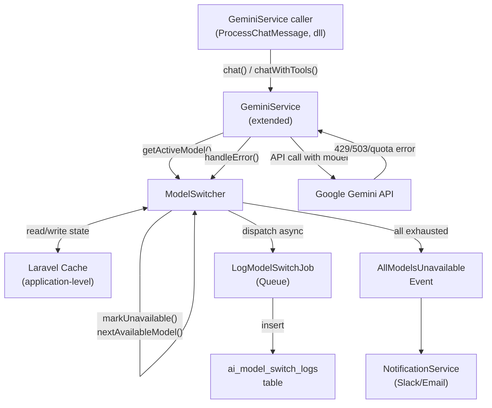

# Design Document: Gemini AI Model Auto-Switching

## Overview

Fitur ini memperluas `GeminiService` yang sudah ada dengan menambahkan lapisan `ModelSwitcher` yang mengelola persistent state perpindahan model Gemini. Ketika model aktif mengalami rate limit atau quota habis, sistem secara otomatis berpindah ke model berikutnya dalam fallback chain, menyimpan state tersebut di cache aplikasi, dan melakukan recovery otomatis ke primary model ketika cooldown berakhir.

Desain ini bersifat non-invasif terhadap kode yang sudah ada — `GeminiService` diperluas dengan menginjeksi `ModelSwitcher` sebagai dependency, sehingga semua caller yang sudah ada (seperti `ProcessChatMessage`) tidak perlu diubah.

**Prinsip desain utama:**
- State model dikelola di level aplikasi (bukan per-tenant), karena semua tenant berbagi satu Gemini API key
- Logging switch event dilakukan async via Laravel Queue agar tidak menambah latency
- Recovery ke primary model terjadi secara otomatis pada request berikutnya setelah cooldown berakhir
- Interface pengguna tetap sama — tidak ada perubahan format respons yang breaking

---

## Architecture



**Alur request normal:**
1. Caller memanggil `GeminiService::chat()` atau `chatWithTools()`
2. `GeminiService` bertanya ke `ModelSwitcher::getActiveModel()` untuk mendapat model yang harus digunakan
3. API call dilakukan ke Gemini menggunakan model tersebut
4. Jika sukses, respons dikembalikan ke caller
5. Jika error (429/503/quota), `GeminiService` memanggil `ModelSwitcher::handleFailure()`, kemudian retry dengan model berikutnya

**Alur recovery:**
1. Pada setiap request, `ModelSwitcher::getActiveModel()` mengecek apakah primary model sudah melewati cooldown-nya
2. Jika ya, primary model dicoba terlebih dahulu
3. Jika primary model sukses, state direset ke primary dan switch event "recovery" di-log

---

## Components and Interfaces

### ModelSwitcher (New Service)

```php
namespace App\Services\AI;

class ModelSwitcher
{
    // Cache key prefix — application level, bukan per-tenant
    const CACHE_PREFIX = 'gemini_switcher:';
    const ACTIVE_MODEL_KEY = 'gemini_switcher:active_model';
    const UNAVAILABLE_PREFIX = 'gemini_switcher:unavailable:';
    const SWITCH_COUNT_KEY = 'gemini_switcher:switch_count:';

    /**
     * Kembalikan model yang sedang aktif.
     * Jika primary sudah lewat cooldown-nya, kembalikan primary (untuk dicoba).
     */
    public function getActiveModel(): string;

    /**
     * Tandai sebuah model sebagai tidak tersedia dan set cooldown.
     *
     * @param string $model  Nama model
     * @param string $reason 'rate_limit' | 'quota_exceeded' | 'service_unavailable'
     */
    public function markUnavailable(string $model, string $reason): void;

    /**
     * Kembalikan model berikutnya yang tersedia dalam fallback chain.
     * Melempar AllModelsUnavailableException jika semua exhausted.
     */
    public function nextAvailableModel(string $failedModel): string;

    /**
     * Tandai model sebagai aktif (digunakan setelah sukses).
     */
    public function setActiveModel(string $model): void;

    /**
     * Kembalikan status availability semua model dalam fallback chain.
     * Format: [['model' => '...', 'available' => bool, 'reason' => '...', 'recovers_at' => Carbon|null], ...]
     */
    public function getModelAvailability(): array;

    /**
     * Reset semua cooldown (untuk Force Reset oleh admin).
     */
    public function resetAll(): void;

    /**
     * Kembalikan fallback chain berdasarkan SystemSetting,
     * dengan fallback ke config('gemini.fallback_models').
     */
    public function getFallbackChain(): array;
}
```

### GeminiService (Extended)

`GeminiService` yang sudah ada di-extend dengan menambahkan:

```php
// Constructor menerima ModelSwitcher via dependency injection
public function __construct(ModelSwitcher $switcher)

// Internal method untuk menjalankan API call dengan auto-switching
private function callWithFallback(callable $apiCall): array

// Internal method: menangani error dari Gemini API
private function classifyError(\Throwable $e): ?string  // returns 'rate_limit'|'quota_exceeded'|'service_unavailable'|null
```

Semua public method yang sudah ada (`chat()`, `chatWithTools()`, `sendFunctionResults()`) akan memanggil `callWithFallback()` secara internal — tidak ada perubahan signature.

### AiModelSwitchLog (New Model)

```php
namespace App\Models;

class AiModelSwitchLog extends Model
{
    protected $fillable = [
        'from_model', 'to_model', 'reason',
        'error_message', 'request_context',
        'triggered_by_tenant_id', 'switched_at',
    ];

    // Scope untuk query monitoring dashboard
    public function scopeRecent($query, int $days = 7);
    public function scopeByReason($query, string $reason);
}
```

### LogModelSwitchJob (New Job)

```php
namespace App\Jobs;

class LogModelSwitchJob implements ShouldQueue
{
    public function __construct(
        public readonly string $fromModel,
        public readonly string $toModel,
        public readonly string $reason,
        public readonly ?string $errorMessage,
        public readonly ?string $requestContext,
        public readonly ?int $triggeredByTenantId,
    ) {}

    public function handle(): void; // Insert ke ai_model_switch_logs
}
```

### AllModelsUnavailableException (New Exception)

```php
namespace App\Exceptions;

class AllModelsUnavailableException extends \RuntimeException
{
    public function __construct()
    {
        parent::__construct(
            'Layanan AI sedang mengalami gangguan. Silakan coba beberapa saat lagi.',
            503
        );
    }
}
```

### AllModelsUnavailable (New Event)

```php
namespace App\Events;

class AllModelsUnavailable
{
    use Dispatchable, SerializesModels;

    public function __construct(
        public readonly array $unavailableModels,
        public readonly ?int $triggeredByTenantId = null,
    ) {}
}
```

### AiModelStatusPage (New Filament Page)

Filament custom page di SuperAdmin panel yang menampilkan:
- Status model aktif saat ini
- Tabel availability semua model dalam fallback chain
- Paginated log dari `AiModelSwitchLog`
- Tombol "Force Reset" yang memanggil `ModelSwitcher::resetAll()`

### PruneModelSwitchLogs (New Command)

```php
namespace App\Console\Commands;

class PruneModelSwitchLogs extends Command
{
    protected $signature = 'ai:prune-switch-logs';

    public function handle(): void; // Delete records lebih tua dari retention period
}
```

---

## Data Models

### Tabel: `ai_model_switch_logs`

```sql
CREATE TABLE ai_model_switch_logs (
    id                      BIGINT UNSIGNED AUTO_INCREMENT PRIMARY KEY,
    from_model              VARCHAR(100) NOT NULL,
    to_model                VARCHAR(100) NOT NULL,
    reason                  ENUM('rate_limit','quota_exceeded','service_unavailable','recovery') NOT NULL,
    error_message           TEXT NULL,
    request_context         VARCHAR(255) NULL,  -- module/route name, no PII
    triggered_by_tenant_id  INT UNSIGNED NULL,
    switched_at             TIMESTAMP NOT NULL DEFAULT CURRENT_TIMESTAMP,
    created_at              TIMESTAMP NULL,
    updated_at              TIMESTAMP NULL,
    INDEX idx_switched_at   (switched_at),
    INDEX idx_reason        (reason),
    INDEX idx_tenant        (triggered_by_tenant_id)
);
```

### Cache Keys

| Key | Value | TTL |
|-----|-------|-----|
| `gemini_switcher:active_model` | `string` — nama model aktif | Persisten (tidak expire) |
| `gemini_switcher:unavailable:{model}` | `array` — `{reason, marked_at, expires_at}` | Cooldown duration (60s/3600s) |
| `gemini_switcher:switch_count:{hour}` | `int` — jumlah switch dalam 1 jam | 3600s |

### SystemSetting Keys

| Key | Type | Default | Keterangan |
|-----|------|---------|------------|
| `gemini_fallback_models` | JSON array | dari config | Ordered fallback chain |
| `gemini_rate_limit_cooldown` | integer (seconds) | 60 | Cooldown untuk rate limit |
| `gemini_quota_cooldown` | integer (seconds) | 3600 | Cooldown untuk quota exceeded |
| `gemini_log_retention_days` | integer | 30 | Retensi log switch event |
| `gemini_recovery_check_interval` | integer (seconds) | 300 | Interval probe recovery (opsional) |

---

## Correctness Properties

*A property is a characteristic or behavior that should hold true across all valid executions of a system — essentially, a formal statement about what the system should do. Properties serve as the bridge between human-readable specifications and machine-verifiable correctness guarantees.*

### Property 1: Active model persistence

*For any* Switch_Event, calling `getActiveModel()` immediately afterward must return the newly switched model — not the model that failed. This holds for any arbitrary sequence of switches.

**Validates: Requirements 1.1, 1.2**

---

### Property 2: Fallback chain respects order and skips cooldowns

*For any* fallback chain and any subset of models currently in cooldown, `nextAvailableModel()` must return the first model in chain order that is NOT in the unavailable set. If all models are simultaneously in cooldown, it must throw `AllModelsUnavailableException`.

**Validates: Requirements 2.1, 2.2, 2.3, 2.4, 2.5, 2.7**

---

### Property 3: Cooldown duration invariant

*For any* model marked unavailable via `markUnavailable()`, the model must be reported as unavailable for the entire configured cooldown window (`gemini_rate_limit_cooldown` for rate_limit, `gemini_quota_cooldown` for quota_exceeded), and then automatically become available again once the window passes. `getModelAvailability()` must always include the reason and estimated recovery time for each unavailable model.

**Validates: Requirements 3.1, 3.2, 3.3, 3.4, 3.5**

---

### Property 4: Recovery round-trip to primary model

*For any* state where the primary model was switched away from due to an error, after its cooldown period expires, `getActiveModel()` must return the primary model on the next call (for retry). If the primary model responds successfully, `getActiveModel()` must continue returning the primary model — i.e., the active model state is restored to its original value.

**Validates: Requirements 4.1, 4.2**

---

### Property 5: Switch log completeness

*For any* Switch_Event that is triggered, after the queued `LogModelSwitchJob` is processed, the `ai_model_switch_logs` table must contain exactly one new record with non-null `from_model`, `to_model`, `reason`, and `switched_at` fields matching the event.

**Validates: Requirements 5.1, 5.3**

---

### Property 6: Response format invariance after fallback

*For any* successful API call that involved one or more fallback switches, the response array returned by `GeminiService` must contain all the same required keys as a response from a non-switched call, plus a `model` key indicating the model that was ultimately used.

**Validates: Requirements 6.1, 6.2, 6.3**

---

### Property 7: AllModelsUnavailable event and user-friendly error

*For any* request where all models in the fallback chain are simultaneously in cooldown at the time of the call, the `AllModelsUnavailable` event must be dispatched, and the response returned to the caller must be the user-friendly Indonesian error message "Layanan AI sedang mengalami gangguan. Silakan coba beberapa saat lagi." — never a raw API error.

**Validates: Requirements 2.5, 6.4, 10.1**

---

### Property 8: Switch frequency warning threshold

*For any* sequence of switch events, if the switch counter for the current hour reaches or exceeds 10, a Laravel warning must be logged. The counter must increment monotonically within the 60-minute window and be checked on every switch event.

**Validates: Requirements 10.3**

---

### Property 9: SystemSetting precedence and cache invalidation

*For any* value stored in `SystemSetting` under `gemini_fallback_models`, subsequent calls to `ModelSwitcher::getFallbackChain()` must return that value rather than the value from `config('gemini.fallback_models')`. Furthermore, saving a new chain must invalidate the current model availability cache so stale state is not carried over.

**Validates: Requirements 8.1, 8.3, 8.5**

---

### Property 10: Tenant ID recorded in switch log

*For any* Switch_Event triggered by a request that carries a tenant context, the corresponding `ai_model_switch_logs` record must contain the correct `triggered_by_tenant_id`. For requests without tenant context (e.g., system-level calls), the field may be null.

**Validates: Requirements 9.3**

---

## Error Handling

### Error Classification

`GeminiService` akan mengklasifikasikan exception dari Gemini SDK ke dalam tiga kategori yang memicu fallback:

| Kondisi | Klasifikasi | Cooldown |
|---------|-------------|----------|
| HTTP 429 | `rate_limit` | 60s (configurable) |
| Pesan error mengandung "quota" / "RESOURCE_EXHAUSTED" | `quota_exceeded` | 3600s (configurable) |
| HTTP 503 | `service_unavailable` | 60s |
| Error lain (network timeout, dll) | Tidak memicu fallback — langsung throw | - |

### Cascading Error Flow

```
Request masuk
│
├─ getActiveModel() → model_A
│
├─ API call ke model_A
│   ├─ Sukses → return response
│   └─ Error (rate_limit/quota/503)
│       ├─ markUnavailable(model_A, reason)
│       ├─ dispatch LogModelSwitchJob (async)
│       └─ nextAvailableModel(model_A) → model_B
│           ├─ model_B available → retry dengan model_B
│           │   ├─ Sukses → setActiveModel(model_B), return response
│           │   └─ Error → repeat cascade untuk model_B
│           └─ Semua exhausted
│               ├─ dispatch AllModelsUnavailable event
│               └─ throw AllModelsUnavailableException
│
└─ GeminiService catch AllModelsUnavailableException
    └─ return ['text' => 'Layanan AI sedang mengalami gangguan...', 'error' => true]
```

### Cache Unavailability Fallback

Jika `Cache::get()` melempar exception, `ModelSwitcher` akan:
1. Log warning ke Laravel Log
2. Fall back ke in-memory array `$this->inMemoryState` untuk sisa request cycle saat ini
3. Tidak melempar exception ke caller

---

## Testing Strategy

### Unit Tests

Target: logika inti `ModelSwitcher` yang tidak memerlukan cache nyata.

- `ModelSwitcher` dengan mock Cache facade
- Verifikasi `nextAvailableModel()` mengembalikan model yang benar saat beberapa model di-mock sebagai unavailable
- Verifikasi `classifyError()` di `GeminiService` mengklasifikasikan error dengan benar berdasarkan HTTP code dan pesan
- Verifikasi `AiModelSwitchLog` scopes mengembalikan data yang benar

### Property-Based Tests

Library: **PestPHP + Faker** (tersedia di Laravel) untuk generate input acak. Jika tersedia, gunakan **LazyCollection** dengan seed tertentu untuk reproducibility.

Minimum 100 iterasi per test. Setiap property test harus diberi tag komentar:
`// Feature: gemini-model-auto-switching, Property {N}: {property_text}`

**Property tests yang harus diimplementasi:**

| Property | Test Pattern |
|----------|-------------|
| P1: Active model persistence | Generate random model name, set sebagai active, cek getActiveModel() mengembalikan model itu |
| P2: Fallback skips unavailable | Generate random subset unavailable, cek nextAvailableModel() selalu return model yang available |
| P3: Cooldown duration | Mock waktu, mark unavailable, cek bahwa model available kembali tepat setelah TTL |
| P4: Recovery round-trip | Mark primary unavailable, tunggu TTL, cek getActiveModel() kembali ke primary |
| P6: Response format invariance | Generate random response, cek required keys selalu ada setelah fallback |
| P7: AllModelsUnavailable dispatch | Mark semua model unavailable, trigger request, cek event di-dispatch dan user message benar |
| P8: Switch count threshold | Generate random number of switches > 10, cek warning di-log |
| P9: SystemSetting chain update | Update SystemSetting, cek getFallbackChain() dan cache invalidation |

### Integration Tests

- Test `GeminiService::callWithFallback()` dengan mock Gemini client yang mensimulasikan 429 pada model pertama, sukses pada model kedua
- Test bahwa `LogModelSwitchJob` berhasil insert ke database
- Test bahwa `AllModelsUnavailable` listener mengirim notifikasi
