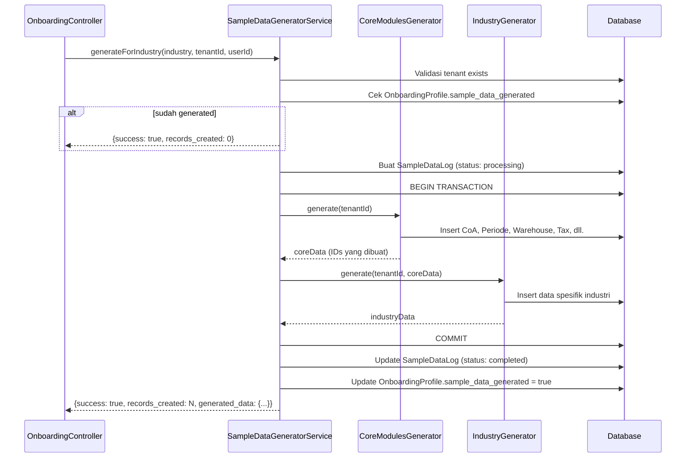

# Design Document: Onboarding Demo Data

## Overview

Fitur ini memperluas `SampleDataGeneratorService` yang sudah ada agar menghasilkan demo data yang komprehensif dan realistis per industri selama proses onboarding tenant baru. Saat ini service hanya menghasilkan data minimal (beberapa produk dan pelanggan), sehingga halaman "Load Sample Data" menampilkan pesan "No templates available for your industry yet."

Solusinya adalah refactor `SampleDataGeneratorService` menjadi arsitektur berbasis strategy pattern, di mana setiap industri memiliki generator class tersendiri yang mewarisi base class. Generator ini akan menghasilkan data lengkap untuk semua modul ERP yang relevan — akuntansi, HRM, inventory, penjualan, pembelian, dan modul industri spesifik.

Industri yang didukung: `retail`, `restaurant`, `hotel`, `construction`, `agriculture`, `manufacturing`, `services`, `healthcare`.

---

## Architecture

### Strategy Pattern untuk Industry Generators

```
SampleDataGeneratorService (Orchestrator)
├── generateForIndustry($industry, $tenantId, $userId)
│   ├── Validasi tenant
│   ├── Cek idempotency (sample_data_generated flag)
│   ├── Buat Demo_Log (status: processing)
│   ├── CoreModulesGenerator::generate($tenantId)
│   ├── IndustryGenerator::generate($tenantId, $coreData)
│   └── Update Demo_Log + OnboardingProfile
│
├── CoreModulesGenerator
│   └── CoA → Periode → Warehouse → Tax → CostCenter → Produk → Pelanggan → Supplier → Karyawan
│
└── Industry Generators (masing-masing extends BaseIndustryGenerator)
    ├── RetailGenerator
    ├── RestaurantGenerator
    ├── HotelGenerator
    ├── ConstructionGenerator
    ├── AgricultureGenerator
    ├── ManufacturingGenerator
    ├── ServicesGenerator
    └── HealthcareGenerator
```

### Alur Eksekusi



---

## Components and Interfaces

### 1. SampleDataGeneratorService (Refactored)

File: `app/Services/SampleDataGeneratorService.php`

Tanggung jawab:
- Orchestrate seluruh proses generasi
- Validasi tenant dan idempotency check
- Manage Demo_Log lifecycle
- Wrap eksekusi dalam database transaction
- Resolve industry generator yang tepat

```php
class SampleDataGeneratorService
{
    public function generateForIndustry(string $industry, int $tenantId, int $userId): array;
    public function getTemplates(string $industry): array;

    private function resolveGenerator(string $industry): BaseIndustryGenerator;
    private function validateTenant(int $tenantId): void;
    private function isAlreadyGenerated(int $tenantId, int $userId): bool;
}
```

### 2. CoreModulesGenerator

File: `app/Services/DemoData/CoreModulesGenerator.php`

Menghasilkan data dasar yang dibutuhkan semua industri, dalam urutan yang memenuhi dependensi foreign key.

```php
class CoreModulesGenerator
{
    public function generate(int $tenantId): CoreDataContext;

    private function seedCoA(int $tenantId): array;           // returns coaMap
    private function seedAccountingPeriod(int $tenantId): int; // returns periodId
    private function seedWarehouse(int $tenantId): int;        // returns warehouseId
    private function seedTaxRates(int $tenantId): void;
    private function seedCostCenters(int $tenantId): void;
    private function seedProducts(int $tenantId, int $warehouseId): array; // returns productIds
    private function seedCustomers(int $tenantId): array;      // returns customerIds
    private function seedSuppliers(int $tenantId): array;      // returns supplierIds
    private function seedEmployees(int $tenantId): array;      // returns employeeIds
}
```

### 3. CoreDataContext (Value Object)

File: `app/Services/DemoData/CoreDataContext.php`

Membawa semua ID yang dihasilkan CoreModulesGenerator untuk digunakan oleh IndustryGenerator.

```php
class CoreDataContext
{
    public int $tenantId;
    public int $warehouseId;
    public int $periodId;
    public array $coaMap;        // ['1101' => id, ...]
    public array $productIds;
    public array $customerIds;
    public array $supplierIds;
    public array $employeeIds;
    public int $recordsCreated;
}
```

### 4. BaseIndustryGenerator

File: `app/Services/DemoData/BaseIndustryGenerator.php`

Abstract base class untuk semua industry generator.

```php
abstract class BaseIndustryGenerator
{
    abstract public function generate(CoreDataContext $ctx): array;
    abstract public function getIndustryName(): string;

    protected function bulkInsert(string $table, array $rows): int; // returns count
    protected function logWarning(string $message, array $context): void;
}
```

### 5. Industry Generators

Setiap generator berada di `app/Services/DemoData/Generators/`:

| File | Industri | Modul Tambahan |
|------|----------|----------------|
| `RetailGenerator.php` | retail | POS transactions, loyalty program, price list |
| `RestaurantGenerator.php` | restaurant | Menu items, tables, F&B orders |
| `HotelGenerator.php` | hotel | Room types, rooms, reservations, guests, housekeeping |
| `ConstructionGenerator.php` | construction | Projects, RAB, purchase orders |
| `AgricultureGenerator.php` | agriculture | Farm plots, crop cycles, harvest logs |
| `ManufacturingGenerator.php` | manufacturing | BOM, work orders, quality control |
| `ServicesGenerator.php` | services | Projects, timesheets, invoices, CRM leads |
| `HealthcareGenerator.php` | healthcare | Patients, doctors, appointments, medical records |

---

## Data Models

### SampleDataTemplate (existing, tidak berubah)

```
sample_data_templates
├── id
├── industry          (string) — retail, restaurant, hotel, dll.
├── template_name     (string)
├── description       (text)
├── modules_included  (json array)
├── data_config       (json) — konfigurasi jumlah record
├── is_active         (boolean)
├── usage_count       (integer)
└── timestamps
```

### SampleDataLog (existing, tidak berubah)

```
sample_data_logs
├── id
├── tenant_id         (FK → tenants)
├── user_id           (FK → users)
├── template_id       (FK → sample_data_templates, nullable)
├── status            (enum: processing, completed, failed)
├── generated_data    (json) — breakdown per modul
├── records_created   (integer)
├── error_message     (text, nullable)
├── started_at        (datetime)
├── completed_at      (datetime, nullable)
└── timestamps
```

### OnboardingProfile (existing, field yang relevan)

```
onboarding_profiles
├── tenant_id
├── user_id
├── industry          (string)
├── sample_data_generated (boolean) — flag idempotency
└── ...
```

### Data yang Dibuat per Industri

**Core Modules (semua industri):**
- Chart of Accounts: ~35 akun (asset, liability, equity, revenue, expense)
- Accounting Periods: 4 periode (2 closed, 2 open)
- Warehouse: 1-2 gudang
- Tax Rates: 4 jenis pajak (PPN, PPh 21, PPh 23, PPh Final)
- Cost Centers: 6 departemen
- Products: 10-20 produk dengan stok awal
- Customers: 5-10 pelanggan
- Suppliers: 4 supplier
- Employees: 5 karyawan dengan role berbeda

**Industry-specific minimums:**

| Industri | Entitas Tambahan |
|----------|-----------------|
| Manufacturing | 5 raw material, 3 finished good, 2 BOM, 3 work order, 2 QC |
| Retail | 20 produk, 10 pelanggan, 10 transaksi, 1 loyalty program, 1 price list |
| Restaurant | 15 menu item, 8 meja, 10 order, inventory bahan baku |
| Hotel | 3 tipe kamar, 15 kamar, 10 reservasi, 10 tamu, housekeeping tasks |
| Healthcare | 10 pasien, 3 dokter, 10 appointment, 5 rekam medis |
| Services | 10 klien, 5 proyek, 10 timesheet, 5 invoice, CRM leads |
| Agriculture | 3 farm plot, 3 crop cycle, 2 harvest log, inventory pupuk |
| Construction | 3 proyek, 1 RAB/proyek, 20 material, 5 PO, 5 karyawan |

---

## Correctness Properties

*A property is a characteristic or behavior that should hold true across all valid executions of a system — essentially, a formal statement about what the system should do. Properties serve as the bridge between human-readable specifications and machine-verifiable correctness guarantees.*

### Property 1: Template tersedia untuk semua industri valid

*For any* industri dalam daftar yang didukung (`retail`, `restaurant`, `hotel`, `construction`, `agriculture`, `manufacturing`, `services`, `healthcare`), memanggil `getTemplates($industry)` harus mengembalikan array non-kosong berisi minimal satu template aktif.

**Validates: Requirements 1.1, 1.2**

---

### Property 2: Template tidak tersedia untuk industri tidak valid

*For any* string yang bukan salah satu dari 8 industri yang didukung, memanggil `getTemplates($industry)` harus mengembalikan array kosong.

**Validates: Requirements 1.3**

---

### Property 3: Template memiliki semua field yang diperlukan

*For any* template yang dikembalikan oleh `getTemplates()`, template tersebut harus memiliki semua field wajib: `industry`, `template_name`, `description`, `modules_included` (array), `data_config` (array), dan `is_active`.

**Validates: Requirements 1.4**

---

### Property 4: Core data completeness setelah generate

*For any* industri yang valid dan tenant yang valid, setelah `generateForIndustry()` berhasil, database harus mengandung untuk tenant tersebut: minimal 1 warehouse aktif, minimal 5 CoA yang mencakup semua tipe (asset, liability, equity, revenue, expense), minimal 1 periode akuntansi dengan status `open`, minimal 3 karyawan, minimal 3 pelanggan aktif, minimal 2 supplier aktif, dan minimal 5 produk aktif dengan stok > 0.

**Validates: Requirements 2.2, 2.3, 2.4, 2.5, 2.6, 2.7, 2.8**

---

### Property 5: Semua record memiliki tenant_id yang benar

*For any* tenant ID yang valid, semua record yang dibuat oleh `generateForIndustry($industry, $tenantId, $userId)` harus memiliki `tenant_id` yang sama dengan `$tenantId` yang diberikan.

**Validates: Requirements 11.1**

---

### Property 6: Isolasi data antar tenant

*For any* dua tenant ID yang berbeda, data yang di-generate untuk tenant A tidak boleh muncul dalam query data tenant B (tidak ada cross-contamination `tenant_id`).

**Validates: Requirements 11.2**

---

### Property 7: Idempotency — tidak ada duplikasi data

*For any* industri dan tenant yang valid, memanggil `generateForIndustry()` dua kali berturut-turut harus menghasilkan jumlah record yang sama seperti satu kali pemanggilan (tidak ada record duplikat yang dibuat pada pemanggilan kedua).

**Validates: Requirements 12.1, 12.3**

---

### Property 8: Demo_Log mencerminkan hasil generate

*For any* pemanggilan `generateForIndustry()` yang berhasil, Demo_Log yang terkait harus memiliki `status = 'completed'`, `records_created > 0`, dan `completed_at` yang terisi.

**Validates: Requirements 13.2**

---

### Property 9: OnboardingProfile diperbarui setelah generate berhasil

*For any* tenant dan user yang valid, setelah `generateForIndustry()` berhasil, `OnboardingProfile.sample_data_generated` untuk tenant dan user tersebut harus bernilai `true`.

**Validates: Requirements 13.4**

---

### Property 10: Response JSON memiliki struktur yang benar

*For any* pemanggilan `generateForIndustry()`, response yang dikembalikan harus selalu berupa array dengan field `success` (boolean), dan jika `success = true` harus ada `records_created` (integer) dan `generated_data` (array); jika `success = false` harus ada `error` (string).

**Validates: Requirements 13.5**

---

### Property 11: Industry data completeness per industri

*For any* industri yang valid, setelah `generateForIndustry()` berhasil, database harus mengandung minimal jumlah record spesifik industri sesuai requirements (manufacturing: 2 BOM + 3 work order; retail: 10 transaksi; hotel: 3 tipe kamar + 10 reservasi; dst.).

**Validates: Requirements 3.1–3.7, 4.1–4.6, 5.1–5.5, 6.1–6.5, 7.1–7.5, 8.1–8.5, 9.1–9.5, 10.1–10.5**

---

## Error Handling

### Strategi Error Handling

Terdapat dua level error:

**1. Fatal Error (Core_Modules gagal)**
- Trigger: Exception yang tidak tertangani saat generate CoA, warehouse, atau entitas core lainnya
- Behavior: Rollback seluruh transaction, update Demo_Log ke `failed`, kembalikan `{success: false, error: "..."}`
- Tidak ada data parsial yang tersisa di database

**2. Non-Fatal Error (Industry_Modules gagal)**
- Trigger: Exception saat generate data spesifik industri (misalnya model tidak ditemukan)
- Behavior: Log warning dengan konteks (tenant_id, modul, pesan error), lanjutkan ke modul berikutnya
- Response tetap `success: true` dengan informasi modul yang gagal di `generated_data.failed_modules`

### Contoh Response Partial Failure

```json
{
  "success": true,
  "records_created": 87,
  "generated_data": {
    "core": { "products": 10, "customers": 5, "suppliers": 4 },
    "industry": { "bom": 2, "work_orders": 3 },
    "failed_modules": ["quality_control"]
  }
}
```

### Validasi Input

| Kondisi | Behavior |
|---------|----------|
| `tenant_id` tidak ada di DB | Throw exception, return `{success: false}` |
| `industry` tidak dikenal | Fallback ke `GenericGenerator` (sama dengan retail) |
| `sample_data_generated = true` | Return `{success: true, records_created: 0}` tanpa generate |

---

## Testing Strategy

### Dual Testing Approach

Fitur ini menggunakan dua pendekatan testing yang saling melengkapi:

**Unit Tests** — untuk kasus spesifik, edge case, dan error conditions:
- Verifikasi bahwa tenant tidak valid mengembalikan error
- Verifikasi bahwa pemanggilan kedua tidak membuat record baru (idempotency)
- Verifikasi bahwa kegagalan satu modul tidak menghentikan modul lain
- Verifikasi rollback saat Core_Modules gagal total
- Verifikasi struktur response JSON

**Property-Based Tests** — untuk memverifikasi properti universal:
- Menggunakan library [eris/eris](https://github.com/giorgiosironi/eris) untuk PHP
- Minimum 100 iterasi per property test
- Setiap test harus mereference property dari design document

### Property-Based Test Configuration

Library: `eris/eris` (PHP property-based testing)

Tag format untuk setiap test:
```
Feature: onboarding-demo-data, Property {N}: {property_text}
```

Setiap correctness property di atas harus diimplementasikan oleh **satu** property-based test.

### Contoh Property Test

```php
// Feature: onboarding-demo-data, Property 1: Template tersedia untuk semua industri valid
public function test_templates_available_for_all_supported_industries(): void
{
    $this->forAll(
        Generator\elements('retail', 'restaurant', 'hotel', 'construction',
                           'agriculture', 'manufacturing', 'services', 'healthcare')
    )->then(function (string $industry) {
        $service = app(SampleDataGeneratorService::class);
        $templates = $service->getTemplates($industry);
        $this->assertNotEmpty($templates,
            "getTemplates('$industry') returned empty array");
    });
}
```

```php
// Feature: onboarding-demo-data, Property 7: Idempotency
public function test_generate_twice_does_not_duplicate_records(): void
{
    $this->forAll(
        Generator\elements('retail', 'manufacturing', 'hotel')
    )->then(function (string $industry) {
        $tenant = Tenant::factory()->create();
        $user = User::factory()->create(['tenant_id' => $tenant->id]);
        $service = app(SampleDataGeneratorService::class);

        $service->generateForIndustry($industry, $tenant->id, $user->id);
        $countAfterFirst = Product::where('tenant_id', $tenant->id)->count();

        // Reset flag untuk simulasi pemanggilan kedua
        OnboardingProfile::where('tenant_id', $tenant->id)->update(['sample_data_generated' => false]);
        $service->generateForIndustry($industry, $tenant->id, $user->id);
        $countAfterSecond = Product::where('tenant_id', $tenant->id)->count();

        $this->assertEquals($countAfterFirst, $countAfterSecond);
    });
}
```

### Unit Test Coverage

| Test | Requirement |
|------|-------------|
| `test_invalid_tenant_returns_error` | 11.3 |
| `test_module_failure_continues_generation` | 2.9, 15.1 |
| `test_core_failure_triggers_rollback` | 11.4, 15.3 |
| `test_partial_failure_returns_success_with_failed_modules` | 15.2 |
| `test_demo_log_created_on_start` | 13.1 |
| `test_demo_log_failed_on_exception` | 13.3 |
| `test_performance_under_60_seconds` | 14.1 |
| `test_sample_data_page_shows_templates` | 1.5 |
