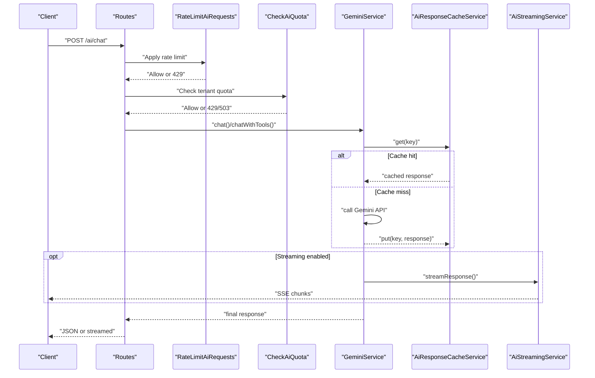
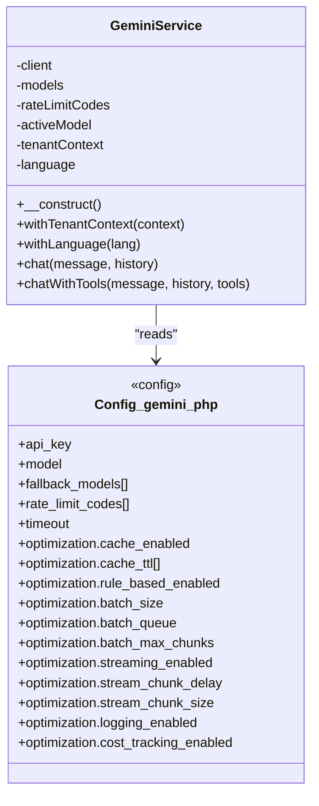
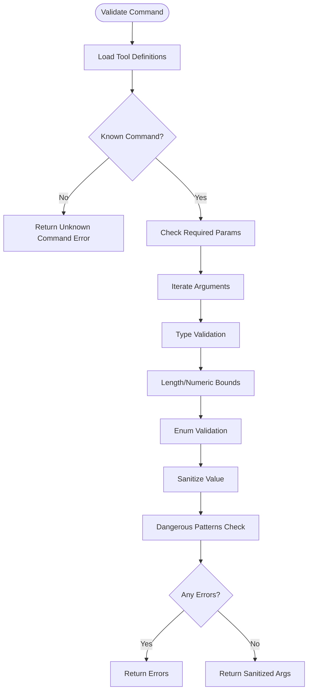
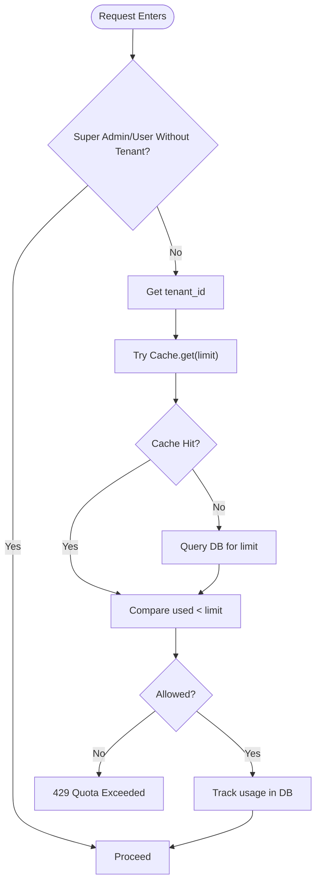
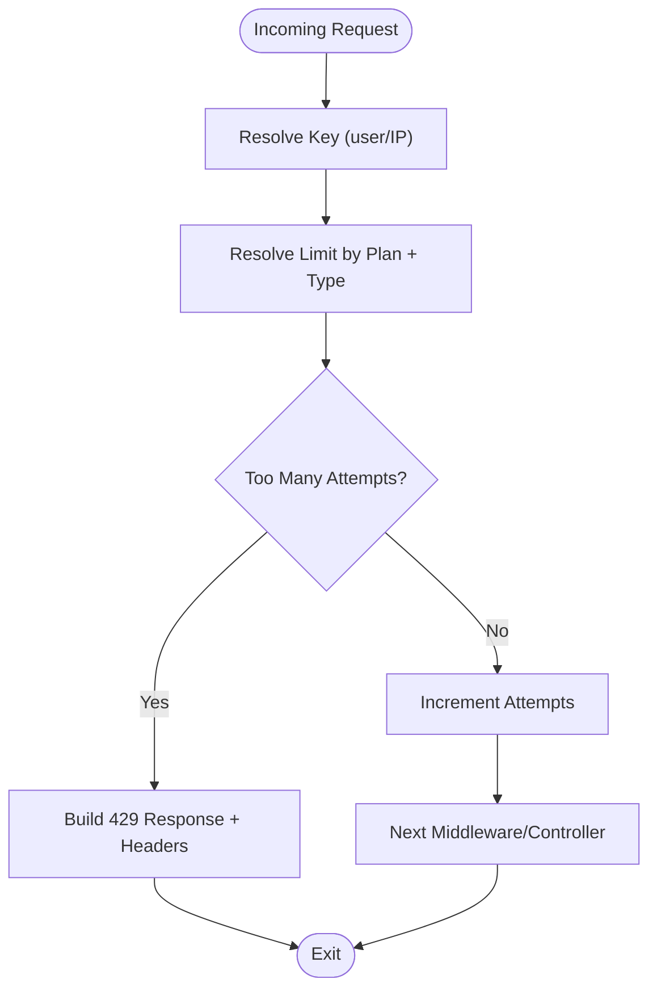
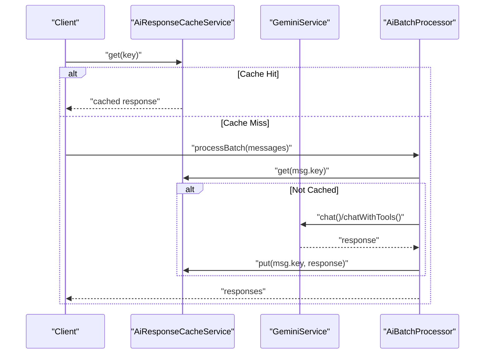
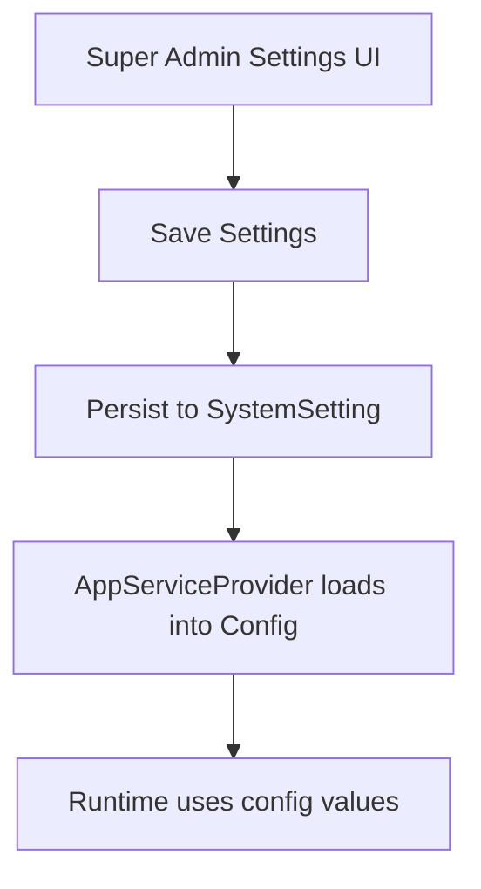
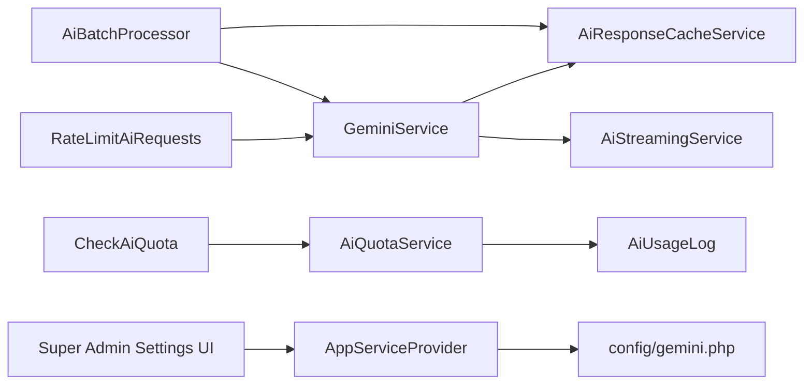

# AI Configuration & Management

<cite>
**Referenced Files in This Document**
- [config/gemini.php](file://config/gemini.php)
- [app/Services/GeminiService.php](file://app/Services/GeminiService.php)
- [app/Services/AiCommandValidator.php](file://app/Services/AiCommandValidator.php)
- [app/Services/AiQuotaService.php](file://app/Services/AiQuotaService.php)
- [app/Http/Middleware/CheckAiQuota.php](file://app/Http/Middleware/CheckAiQuota.php)
- [app/Http/Middleware/RateLimitAiRequests.php](file://app/Http/Middleware/RateLimitAiRequests.php)
- [app/Services/AiBatchProcessor.php](file://app/Services/AiBatchProcessor.php)
- [app/Services/AiResponseCacheService.php](file://app/Services/AiResponseCacheService.php)
- [app/Services/AiStreamingService.php](file://app/Services/AiStreamingService.php)
- [app/Models/AiUsageLog.php](file://app/Models/AiUsageLog.php)
- [resources/views/super-admin/settings/index.blade.php](file://resources/views/super-admin/settings/index.blade.php)
- [app/Providers/AppServiceProvider.php](file://app/Providers/AppServiceProvider.php)
- [routes/api.php](file://routes/api.php)
- [app/Jobs/GenerateAiAdvisorRecommendations.php](file://app/Jobs/GenerateAiAdvisorRecommendations.php)
</cite>

## Table of Contents
1. [Introduction](#introduction)
2. [Project Structure](#project-structure)
3. [Core Components](#core-components)
4. [Architecture Overview](#architecture-overview)
5. [Detailed Component Analysis](#detailed-component-analysis)
6. [Dependency Analysis](#dependency-analysis)
7. [Performance Considerations](#performance-considerations)
8. [Troubleshooting Guide](#troubleshooting-guide)
9. [Conclusion](#conclusion)
10. [Appendices](#appendices)

## Introduction
This document explains how AI is configured and managed in Qalcuity ERP with a focus on the Gemini AI platform integration. It covers API key management, quota enforcement, command validation, request rate limiting, usage tracking, configuration options, environment-specific settings, security considerations, setup instructions, monitoring dashboards, logging, performance metrics, and troubleshooting.

## Project Structure
The AI configuration and management system spans configuration files, service classes, middleware, models, and UI settings pages. Key areas:
- Configuration: centralized Gemini settings and optimization toggles
- Services: Gemini client wrapper, command validation, quotas, caching, streaming, batching
- Middleware: quota enforcement and rate limiting
- Models: usage logging
- UI: super admin settings for Gemini credentials and AI tuning
- Jobs: background AI advisor generation

```mermaid
graph TB
subgraph "Configuration"
CFG["config/gemini.php"]
APPSP["app/Providers/AppServiceProvider.php"]
end
subgraph "HTTP Layer"
MW1["CheckAiQuota"]
MW2["RateLimitAiRequests"]
ROUTES["routes/api.php"]
end
subgraph "AI Services"
GS["GeminiService"]
AV["AiCommandValidator"]
AQ["AiQuotaService"]
AC["AiResponseCacheService"]
AS["AiStreamingService"]
AB["AiBatchProcessor"]
end
subgraph "Data"
AUL["AiUsageLog"]
end
subgraph "UI"
UI["Super Admin Settings Blade"]
end
subgraph "Background Jobs"
JOB["GenerateAiAdvisorRecommendations"]
end
UI --> CFG
APPSP --> CFG
ROUTES --> MW1
ROUTES --> MW2
MW1 --> AQ
MW2 --> GS
GS --> AC
GS --> AS
GS --> AB
AQ --> AUL
AB --> GS
JOB --> GS
```

**Diagram sources**
- [config/gemini.php:1-51](file://config/gemini.php#L1-L51)
- [app/Providers/AppServiceProvider.php:82-103](file://app/Providers/AppServiceProvider.php#L82-L103)
- [routes/api.php:28-50](file://routes/api.php#L28-L50)
- [app/Http/Middleware/CheckAiQuota.php:16-76](file://app/Http/Middleware/CheckAiQuota.php#L16-L76)
- [app/Http/Middleware/RateLimitAiRequests.php:17-234](file://app/Http/Middleware/RateLimitAiRequests.php#L17-L234)
- [app/Services/GeminiService.php:19-120](file://app/Services/GeminiService.php#L19-L120)
- [app/Services/AiCommandValidator.php:13-379](file://app/Services/AiCommandValidator.php#L13-L379)
- [app/Services/AiQuotaService.php:25-241](file://app/Services/AiQuotaService.php#L25-L241)
- [app/Services/AiResponseCacheService.php:8-250](file://app/Services/AiResponseCacheService.php#L8-L250)
- [app/Services/AiStreamingService.php:21-332](file://app/Services/AiStreamingService.php#L21-L332)
- [app/Services/AiBatchProcessor.php:13-191](file://app/Services/AiBatchProcessor.php#L13-L191)
- [app/Models/AiUsageLog.php:10-49](file://app/Models/AiUsageLog.php#L10-L49)
- [resources/views/super-admin/settings/index.blade.php:87-207](file://resources/views/super-admin/settings/index.blade.php#L87-L207)
- [app/Jobs/GenerateAiAdvisorRecommendations.php:14-41](file://app/Jobs/GenerateAiAdvisorRecommendations.php#L14-L41)

**Section sources**
- [config/gemini.php:1-51](file://config/gemini.php#L1-L51)
- [app/Providers/AppServiceProvider.php:82-103](file://app/Providers/AppServiceProvider.php#L82-L103)
- [routes/api.php:28-50](file://routes/api.php#L28-L50)

## Core Components
- Gemini configuration and optimization settings
- Gemini client wrapper with system prompts and fallback models
- Command validation and sanitization
- Quota enforcement and usage tracking
- Rate limiting by plan tier and request type
- Response caching and streaming
- Batch processing for throughput optimization
- Super admin UI for credentials and tuning
- Background jobs for periodic AI insights

**Section sources**
- [config/gemini.php:1-51](file://config/gemini.php#L1-L51)
- [app/Services/GeminiService.php:19-120](file://app/Services/GeminiService.php#L19-L120)
- [app/Services/AiCommandValidator.php:13-379](file://app/Services/AiCommandValidator.php#L13-L379)
- [app/Services/AiQuotaService.php:25-241](file://app/Services/AiQuotaService.php#L25-L241)
- [app/Http/Middleware/RateLimitAiRequests.php:17-234](file://app/Http/Middleware/RateLimitAiRequests.php#L17-L234)
- [app/Services/AiResponseCacheService.php:8-250](file://app/Services/AiResponseCacheService.php#L8-L250)
- [app/Services/AiStreamingService.php:21-332](file://app/Services/AiStreamingService.php#L21-L332)
- [app/Services/AiBatchProcessor.php:13-191](file://app/Services/AiBatchProcessor.php#L13-L191)
- [resources/views/super-admin/settings/index.blade.php:87-207](file://resources/views/super-admin/settings/index.blade.php#L87-L207)
- [app/Jobs/GenerateAiAdvisorRecommendations.php:14-41](file://app/Jobs/GenerateAiAdvisorRecommendations.php#L14-L41)

## Architecture Overview
The AI subsystem integrates configuration-driven behavior with runtime services and middleware. Requests pass through rate limiting and quota checks, then leverage the Gemini client with optional caching, streaming, and batching.



**Diagram sources**
- [routes/api.php:28-50](file://routes/api.php#L28-L50)
- [app/Http/Middleware/RateLimitAiRequests.php:17-234](file://app/Http/Middleware/RateLimitAiRequests.php#L17-L234)
- [app/Http/Middleware/CheckAiQuota.php:16-76](file://app/Http/Middleware/CheckAiQuota.php#L16-L76)
- [app/Services/GeminiService.php:754-800](file://app/Services/GeminiService.php#L754-L800)
- [app/Services/AiResponseCacheService.php:69-118](file://app/Services/AiResponseCacheService.php#L69-L118)
- [app/Services/AiStreamingService.php:39-184](file://app/Services/AiStreamingService.php#L39-L184)

## Detailed Component Analysis

### Gemini Configuration and Platform Integration
- Centralized settings include API key, model selection, fallback models, rate-limit error codes, timeouts, and optimization toggles (caching, rule-based, batch, streaming, logging, cost tracking).
- System settings loaded from DB override .env values for Super Admin-managed configuration.
- API key validation occurs early in the client lifecycle; missing or invalid keys cause immediate errors.



**Diagram sources**
- [app/Services/GeminiService.php:19-120](file://app/Services/GeminiService.php#L19-L120)
- [config/gemini.php:1-51](file://config/gemini.php#L1-L51)

**Section sources**
- [config/gemini.php:1-51](file://config/gemini.php#L1-L51)
- [app/Services/GeminiService.php:28-57](file://app/Services/GeminiService.php#L28-L57)
- [app/Providers/AppServiceProvider.php:82-103](file://app/Providers/AppServiceProvider.php#L82-L103)

### AI Command Validation System
- Enforces allowlisted commands and parameter schemas.
- Applies type validation, length bounds, numeric ranges, enums, and array depth limits.
- Sanitizes inputs and blocks dangerous patterns (scripts, protocols, SQL injection, directory traversal).
- Supports recursive array scanning and logs warnings for blocked content.



**Diagram sources**
- [app/Services/AiCommandValidator.php:62-117](file://app/Services/AiCommandValidator.php#L62-L117)
- [app/Services/AiCommandValidator.php:122-182](file://app/Services/AiCommandValidator.php#L122-L182)
- [app/Services/AiCommandValidator.php:272-329](file://app/Services/AiCommandValidator.php#L272-L329)

**Section sources**
- [app/Services/AiCommandValidator.php:13-379](file://app/Services/AiCommandValidator.php#L13-L379)

### Quota Enforcement and Usage Tracking
- Per-tenant monthly message quotas with plan tiers (trial, basic, pro, enterprise).
- Uses cache with TTL to minimize DB reads; includes fail-safe fallbacks if cache is unavailable.
- Tracks usage per tenant-month and exposes status with percent used and warning thresholds.
- Middleware denies requests when quotas are exceeded; returns JSON for AJAX or redirects with errors otherwise.



**Diagram sources**
- [app/Http/Middleware/CheckAiQuota.php:22-74](file://app/Http/Middleware/CheckAiQuota.php#L22-L74)
- [app/Services/AiQuotaService.php:36-84](file://app/Services/AiQuotaService.php#L36-L84)
- [app/Models/AiUsageLog.php:21-47](file://app/Models/AiUsageLog.php#L21-L47)

**Section sources**
- [app/Http/Middleware/CheckAiQuota.php:16-76](file://app/Http/Middleware/CheckAiQuota.php#L16-L76)
- [app/Services/AiQuotaService.php:25-241](file://app/Services/AiQuotaService.php#L25-L241)
- [app/Models/AiUsageLog.php:10-49](file://app/Models/AiUsageLog.php#L10-L49)

### Request Rate Limiting
- Tenant plan-based multipliers scale limits per request type (chat, analysis, generation).
- Supports user-based or IP-based limiting with per-minute caps.
- Adds rate limit headers and logs violations for monitoring.
- Provides upgrade hints based on plan tier.



**Diagram sources**
- [app/Http/Middleware/RateLimitAiRequests.php:22-40](file://app/Http/Middleware/RateLimitAiRequests.php#L22-L40)
- [app/Http/Middleware/RateLimitAiRequests.php:61-82](file://app/Http/Middleware/RateLimitAiRequests.php#L61-L82)
- [app/Http/Middleware/RateLimitAiRequests.php:186-211](file://app/Http/Middleware/RateLimitAiRequests.php#L186-L211)

**Section sources**
- [app/Http/Middleware/RateLimitAiRequests.php:17-234](file://app/Http/Middleware/RateLimitAiRequests.php#L17-L234)

### Response Caching and Streaming
- Caches AI responses keyed by tenant, user, session, and normalized message.
- TTL varies by response content (short, default, long).
- Streaming service emits Server-Sent Events for responsive UX with robust error handling and partial recovery.
- Batch processor reduces API overhead by combining multiple requests and leveraging cache.



**Diagram sources**
- [app/Services/AiResponseCacheService.php:35-118](file://app/Services/AiResponseCacheService.php#L35-L118)
- [app/Services/AiBatchProcessor.php:37-97](file://app/Services/AiBatchProcessor.php#L37-L97)
- [app/Services/AiStreamingService.php:39-184](file://app/Services/AiStreamingService.php#L39-L184)

**Section sources**
- [app/Services/AiResponseCacheService.php:8-250](file://app/Services/AiResponseCacheService.php#L8-L250)
- [app/Services/AiStreamingService.php:21-332](file://app/Services/AiStreamingService.php#L21-L332)
- [app/Services/AiBatchProcessor.php:13-191](file://app/Services/AiBatchProcessor.php#L13-L191)

### Super Admin Settings and Environment-Specific Configuration
- Super Admin UI allows setting Gemini API key, model, timeout, and cache TTLs.
- System settings provider loads DB-stored values into config, overriding .env.
- Environment variables support toggling optimization features and queue names.



**Diagram sources**
- [resources/views/super-admin/settings/index.blade.php:87-207](file://resources/views/super-admin/settings/index.blade.php#L87-L207)
- [app/Providers/AppServiceProvider.php:82-103](file://app/Providers/AppServiceProvider.php#L82-L103)

**Section sources**
- [resources/views/super-admin/settings/index.blade.php:87-207](file://resources/views/super-admin/settings/index.blade.php#L87-L207)
- [app/Providers/AppServiceProvider.php:82-103](file://app/Providers/AppServiceProvider.php#L82-L103)
- [config/gemini.php:24-49](file://config/gemini.php#L24-L49)

### Background AI Insights Generation
- Generates periodic AI advisor recommendations for paying tenants with sufficient data.
- Dispatched on a dedicated queue with retries and timeouts.

**Section sources**
- [app/Jobs/GenerateAiAdvisorRecommendations.php:14-41](file://app/Jobs/GenerateAiAdvisorRecommendations.php#L14-L41)

## Dependency Analysis
- Middleware depends on quota service and tenant context.
- Gemini service depends on configuration and optionally cache/streaming.
- Batch processor composes Gemini and cache services.
- Usage tracking persists to AiUsageLog.
- UI settings integrate with system settings provider.



**Diagram sources**
- [app/Http/Middleware/RateLimitAiRequests.php:17-234](file://app/Http/Middleware/RateLimitAiRequests.php#L17-L234)
- [app/Http/Middleware/CheckAiQuota.php:16-76](file://app/Http/Middleware/CheckAiQuota.php#L16-L76)
- [app/Services/AiQuotaService.php:25-241](file://app/Services/AiQuotaService.php#L25-L241)
- [app/Models/AiUsageLog.php:10-49](file://app/Models/AiUsageLog.php#L10-L49)
- [app/Services/GeminiService.php:19-120](file://app/Services/GeminiService.php#L19-L120)
- [app/Services/AiResponseCacheService.php:8-250](file://app/Services/AiResponseCacheService.php#L8-L250)
- [app/Services/AiStreamingService.php:21-332](file://app/Services/AiStreamingService.php#L21-L332)
- [app/Services/AiBatchProcessor.php:13-191](file://app/Services/AiBatchProcessor.php#L13-L191)
- [resources/views/super-admin/settings/index.blade.php:87-207](file://resources/views/super-admin/settings/index.blade.php#L87-L207)
- [app/Providers/AppServiceProvider.php:82-103](file://app/Providers/AppServiceProvider.php#L82-L103)
- [config/gemini.php:1-51](file://config/gemini.php#L1-L51)

**Section sources**
- [app/Http/Middleware/CheckAiQuota.php:16-76](file://app/Http/Middleware/CheckAiQuota.php#L16-L76)
- [app/Services/AiQuotaService.php:25-241](file://app/Services/AiQuotaService.php#L25-L241)
- [app/Services/GeminiService.php:19-120](file://app/Services/GeminiService.php#L19-L120)
- [app/Services/AiBatchProcessor.php:13-191](file://app/Services/AiBatchProcessor.php#L13-L191)
- [app/Services/AiResponseCacheService.php:8-250](file://app/Services/AiResponseCacheService.php#L8-L250)
- [app/Services/AiStreamingService.php:21-332](file://app/Services/AiStreamingService.php#L21-L332)
- [app/Models/AiUsageLog.php:10-49](file://app/Models/AiUsageLog.php#L10-L49)
- [resources/views/super-admin/settings/index.blade.php:87-207](file://resources/views/super-admin/settings/index.blade.php#L87-L207)
- [app/Providers/AppServiceProvider.php:82-103](file://app/Providers/AppServiceProvider.php#L82-L103)
- [config/gemini.php:1-51](file://config/gemini.php#L1-L51)

## Performance Considerations
- Caching: enable and tune TTLs for short, default, and long-lived responses to balance freshness and cost.
- Streaming: improves perceived latency and UX; ensure server buffers are disabled for SSE.
- Batching: combine multiple requests to reduce API calls; chunk large batches to avoid timeouts.
- Rate limiting: adjust plan multipliers and request-type limits to match workload patterns.
- Quota caching: 30-second cache for used counts minimizes DB pressure; monitor fallbacks if cache is unavailable.

[No sources needed since this section provides general guidance]

## Troubleshooting Guide
Common issues and resolutions:
- API key errors: verify key presence and validity; the client throws explicit errors if missing or invalid.
- Quota exceeded: review tenant plan and monthly usage; middleware returns structured JSON for AJAX.
- Rate limit exceeded: inspect plan multiplier and request type; check logs for violation details.
- Streaming failures: detect client disconnects and send partial recovery events; ensure SSE headers are set.
- Cache failures: watch for cache exceptions and rely on DB fallbacks; consider cache driver health.
- Background jobs: confirm queue name and retry policy for AI advisor jobs.

**Section sources**
- [app/Services/GeminiService.php:32-46](file://app/Services/GeminiService.php#L32-L46)
- [app/Http/Middleware/CheckAiQuota.php:34-50](file://app/Http/Middleware/CheckAiQuota.php#L34-L50)
- [app/Http/Middleware/RateLimitAiRequests.php:186-211](file://app/Http/Middleware/RateLimitAiRequests.php#L186-L211)
- [app/Services/AiStreamingService.php:52-175](file://app/Services/AiStreamingService.php#L52-L175)
- [app/Services/AiResponseCacheService.php:75-117](file://app/Services/AiResponseCacheService.php#L75-L117)
- [app/Jobs/GenerateAiAdvisorRecommendations.php:18-26](file://app/Jobs/GenerateAiAdvisorRecommendations.php#L18-L26)

## Conclusion
Qalcuity ERP’s AI subsystem combines configurable Gemini integration with robust middleware for quotas and rate limiting, along with caching, streaming, and batching for performance. Super Admin controls drive environment-specific settings, while usage tracking and logging provide observability. The design emphasizes safety (fail-safes), scalability (caching and batching), and user experience (streaming).

[No sources needed since this section summarizes without analyzing specific files]

## Appendices

### Setup Instructions: AI Platform Credentials
- Obtain a Gemini API key from the platform console.
- Configure the key via Super Admin settings UI or ensure it is present in the environment.
- Select model, set timeout, and choose cache TTLs appropriate for your workload.
- Save configuration; the system loads values into runtime config.

**Section sources**
- [resources/views/super-admin/settings/index.blade.php:87-159](file://resources/views/super-admin/settings/index.blade.php#L87-L159)
- [app/Providers/AppServiceProvider.php:82-103](file://app/Providers/AppServiceProvider.php#L82-L103)
- [config/gemini.php:1-51](file://config/gemini.php#L1-L51)

### Quota Allocation Per Tenant
- Quotas are derived from tenant subscription plans.
- Monthly usage is tracked and cached; middleware enforces limits.
- For enterprise tenants, quotas are effectively unlimited.

**Section sources**
- [app/Services/AiQuotaService.php:10-24](file://app/Services/AiQuotaService.php#L10-L24)
- [app/Services/AiQuotaService.php:116-137](file://app/Services/AiQuotaService.php#L116-L137)
- [app/Models/AiUsageLog.php:21-47](file://app/Models/AiUsageLog.php#L21-L47)

### Monitoring Dashboard Configuration
- Enable AI optimization logging and cost tracking in configuration.
- Use SSE streaming for real-time feedback in supported clients.
- Monitor rate limit violations and quota status via logs and middleware responses.

**Section sources**
- [config/gemini.php:46-49](file://config/gemini.php#L46-L49)
- [app/Services/AiStreamingService.php:39-184](file://app/Services/AiStreamingService.php#L39-L184)
- [app/Http/Middleware/RateLimitAiRequests.php:186-211](file://app/Http/Middleware/RateLimitAiRequests.php#L186-L211)

### AI Usage Logging and Metrics
- Usage logs record message counts and token counts per tenant-month.
- Quota service aggregates totals and exposes status with percent used and warnings.
- Streaming and caching services log hits/misses and errors for diagnostics.

**Section sources**
- [app/Models/AiUsageLog.php:21-47](file://app/Models/AiUsageLog.php#L21-L47)
- [app/Services/AiQuotaService.php:144-178](file://app/Services/AiQuotaService.php#L144-L178)
- [app/Services/AiResponseCacheService.php:75-117](file://app/Services/AiResponseCacheService.php#L75-L117)