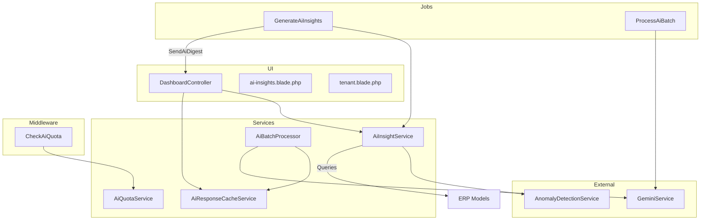
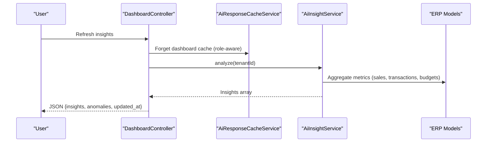
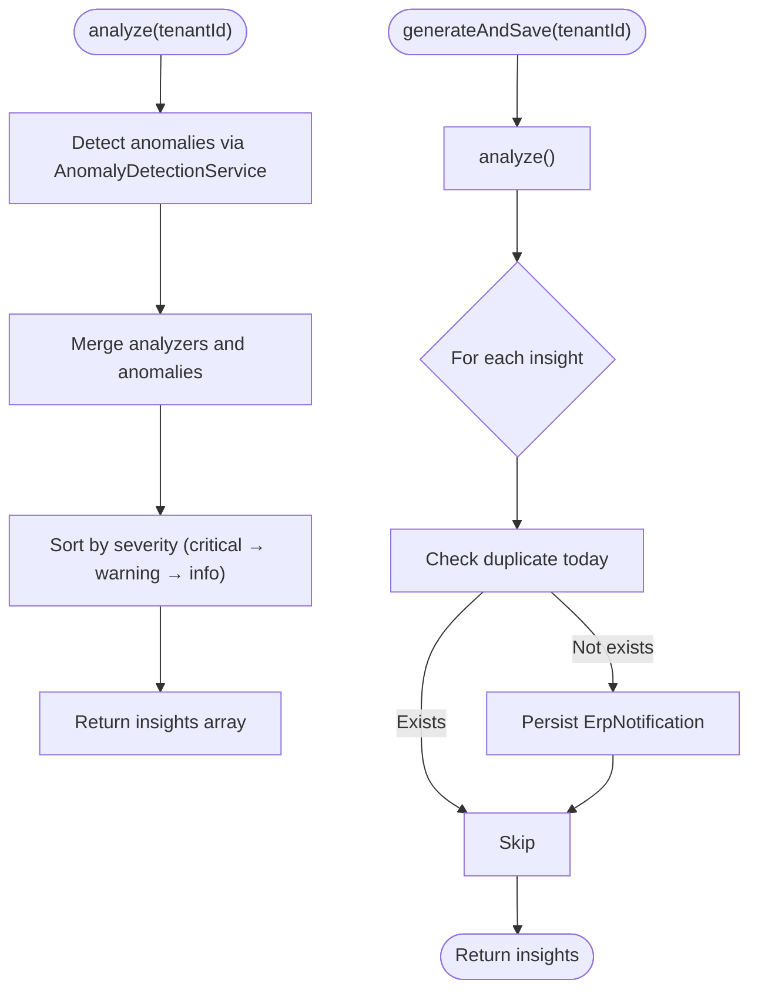
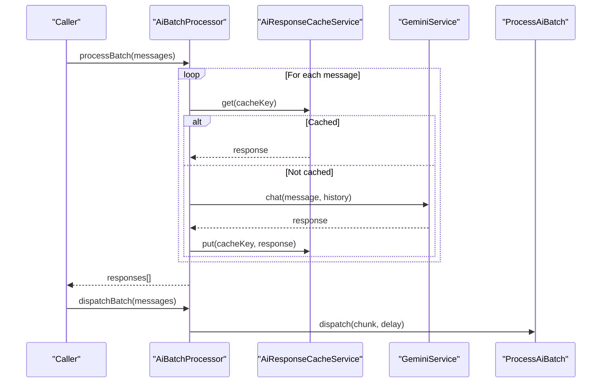
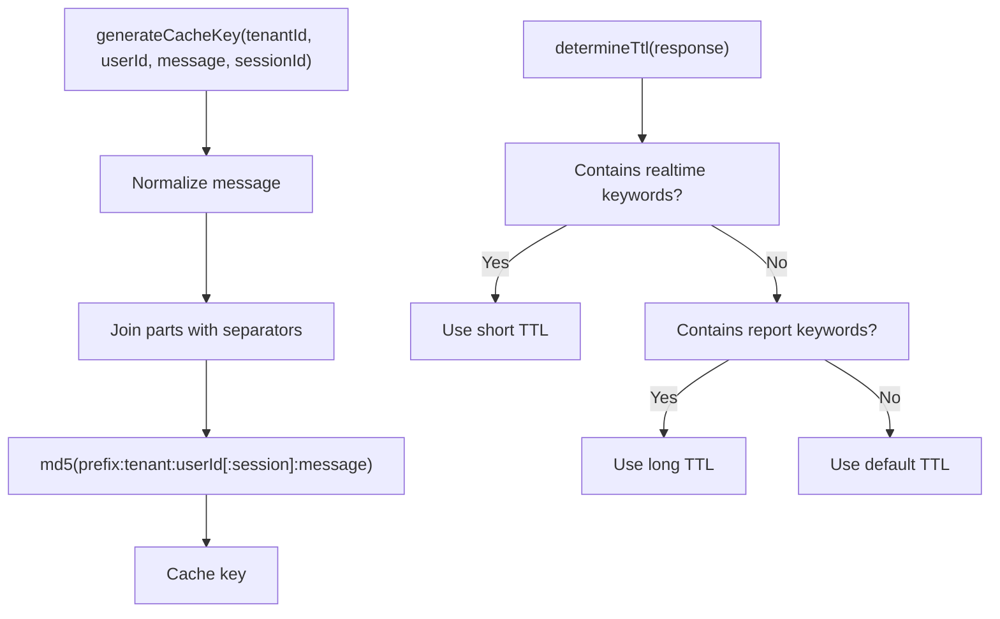
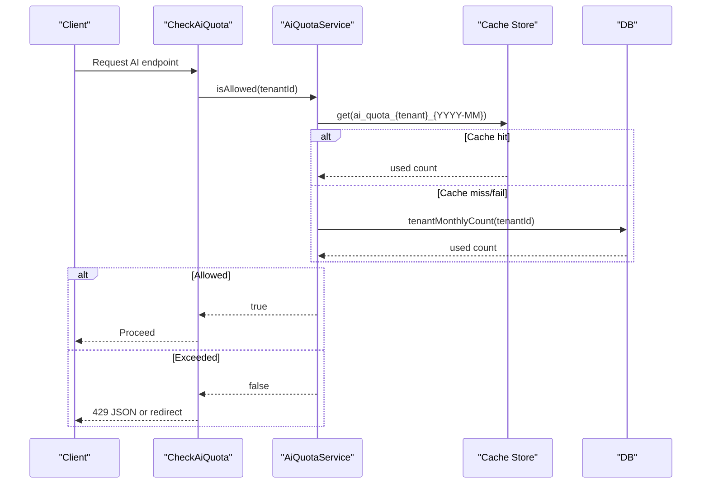
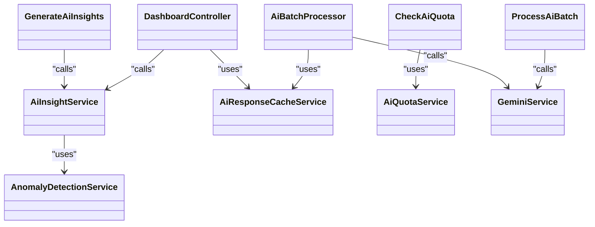

# AI Insights Engine

<cite>
**Referenced Files in This Document**
- [AiInsightService.php](file://app/Services/AiInsightService.php)
- [GenerateAiInsights.php](file://app/Jobs/GenerateAiInsights.php)
- [GenerateInsightsCommand.php](file://app/Console/Commands/GenerateInsightsCommand.php)
- [DashboardController.php](file://app/Http/Controllers/DashboardController.php)
- [ai-insights.blade.php](file://resources/views/dashboard/widgets/ai-insights.blade.php)
- [tenant.blade.php](file://resources/views/dashboard/tenant.blade.php)
- [AiBatchProcessor.php](file://app/Services/AiBatchProcessor.php)
- [ProcessAiBatch.php](file://app/Jobs/ProcessAiBatch.php)
- [AiResponseCacheService.php](file://app/Services/AiResponseCacheService.php)
- [AiQuotaService.php](file://app/Services/AiQuotaService.php)
- [CheckAiQuota.php](file://app/Http/Middleware/CheckAiQuota.php)
- [AnomalyDetectionService.php](file://app/Services/AnomalyDetectionService.php)
</cite>

## Table of Contents
1. [Introduction](#introduction)
2. [Project Structure](#project-structure)
3. [Core Components](#core-components)
4. [Architecture Overview](#architecture-overview)
5. [Detailed Component Analysis](#detailed-component-analysis)
6. [Dependency Analysis](#dependency-analysis)
7. [Performance Considerations](#performance-considerations)
8. [Troubleshooting Guide](#troubleshooting-guide)
9. [Conclusion](#conclusion)
10. [Appendices](#appendices)

## Introduction
This document describes the AI Insights Engine powering Qalcuity ERP. It covers automated insights generation, batch processing, response caching, concurrency handling, and quota enforcement. The engine transforms business data into actionable insights, supports real-time analytics, and integrates with multiple ERP modules. It also documents configuration options for insight generation frequency, cache expiration policies, batch processing limits, and AI quota management.

## Project Structure
The AI Insights Engine spans services, jobs, middleware, and UI components:
- Insight generation and analysis live in a dedicated service.
- Scheduled and on-demand generation is orchestrated via jobs and console commands.
- Real-time dashboards consume insights with caching and role-aware cache keys.
- Batch processing optimizes multiple AI requests and caches responses.
- Quota enforcement ensures fair usage across tenants.

**Diagram sources**
- [DashboardController.php:269-298](file://app/Http/Controllers/DashboardController.php#L269-L298)
- [ai-insights.blade.php:1-64](file://resources/views/dashboard/widgets/ai-insights.blade.php#L1-L64)
- [tenant.blade.php:915-989](file://resources/views/dashboard/tenant.blade.php#L915-L989)
- [GenerateAiInsights.php:1-47](file://app/Jobs/GenerateAiInsights.php#L1-L47)
- [ProcessAiBatch.php:1-76](file://app/Jobs/ProcessAiBatch.php#L1-L76)
- [AiInsightService.php:1-1330](file://app/Services/AiInsightService.php#L1-L1330)
- [AiBatchProcessor.php:1-191](file://app/Services/AiBatchProcessor.php#L1-L191)
- [AiResponseCacheService.php:1-250](file://app/Services/AiResponseCacheService.php#L1-L250)
- [AiQuotaService.php:1-241](file://app/Services/AiQuotaService.php#L1-L241)
- [CheckAiQuota.php:1-76](file://app/Http/Middleware/CheckAiQuota.php#L1-L76)

**Section sources**
- [AiInsightService.php:1-1330](file://app/Services/AiInsightService.php#L1-L1330)
- [GenerateAiInsights.php:1-47](file://app/Jobs/GenerateAiInsights.php#L1-L47)
- [GenerateInsightsCommand.php:1-69](file://app/Console/Commands/GenerateInsightsCommand.php#L1-L69)
- [DashboardController.php:269-298](file://app/Http/Controllers/DashboardController.php#L269-L298)
- [ai-insights.blade.php:1-64](file://resources/views/dashboard/widgets/ai-insights.blade.php#L1-L64)
- [tenant.blade.php:915-989](file://resources/views/dashboard/tenant.blade.php#L915-L989)
- [AiBatchProcessor.php:1-191](file://app/Services/AiBatchProcessor.php#L1-L191)
- [ProcessAiBatch.php:1-76](file://app/Jobs/ProcessAiBatch.php#L1-L76)
- [AiResponseCacheService.php:1-250](file://app/Services/AiResponseCacheService.php#L1-L250)
- [AiQuotaService.php:1-241](file://app/Services/AiQuotaService.php#L1-L241)
- [CheckAiQuota.php:1-76](file://app/Http/Middleware/CheckAiQuota.php#L1-L76)

## Core Components
- AiInsightService: Orchestrates insight generation by aggregating multiple analyzers, converting anomalies to insights, sorting by severity, and persisting notifications.
- GenerateAiInsights: Queue job that runs per-tenant insight generation and triggers digest emails when needed.
- GenerateInsightsCommand: CLI interface to generate insights synchronously or asynchronously for all or selected tenants.
- DashboardController: On-demand insight refresh with role-aware cache busting and anomaly retrieval.
- AiBatchProcessor: Batch processing for multiple AI chat requests with intelligent caching and chunking.
- ProcessAiBatch: Queue job to process batch chunks sequentially.
- AiResponseCacheService: Centralized caching for AI responses with TTL selection based on content type and normalization.
- AiQuotaService + CheckAiQuota: Enforce tenant AI usage quotas with cache-backed counters and safe fallbacks.
- AnomalyDetectionService: Provides anomaly detection used as a base for AI insights.

**Section sources**
- [AiInsightService.php:25-117](file://app/Services/AiInsightService.php#L25-L117)
- [GenerateAiInsights.php:14-46](file://app/Jobs/GenerateAiInsights.php#L14-L46)
- [GenerateInsightsCommand.php:22-67](file://app/Console/Commands/GenerateInsightsCommand.php#L22-L67)
- [DashboardController.php:269-298](file://app/Http/Controllers/DashboardController.php#L269-L298)
- [AiBatchProcessor.php:13-97](file://app/Services/AiBatchProcessor.php#L13-L97)
- [ProcessAiBatch.php:13-75](file://app/Jobs/ProcessAiBatch.php#L13-L75)
- [AiResponseCacheService.php:8-250](file://app/Services/AiResponseCacheService.php#L8-L250)
- [AiQuotaService.php:25-178](file://app/Services/AiQuotaService.php#L25-L178)
- [CheckAiQuota.php:16-75](file://app/Http/Middleware/CheckAiQuota.php#L16-L75)
- [AnomalyDetectionService.php](file://app/Services/AnomalyDetectionService.php)

## Architecture Overview
The engine follows a layered architecture:
- Presentation: Blade widgets and controller actions render insights and anomalies.
- Application: Jobs and commands orchestrate generation and batch processing.
- Domain: AiInsightService encapsulates insight logic and integrates with anomaly detection.
- Infrastructure: Caching, quota enforcement, and external AI service integration.

**Diagram sources**
- [DashboardController.php:269-298](file://app/Http/Controllers/DashboardController.php#L269-L298)
- [AiResponseCacheService.php:123-131](file://app/Services/AiResponseCacheService.php#L123-L131)
- [AiInsightService.php:38-75](file://app/Services/AiInsightService.php#L38-L75)

## Detailed Component Analysis

### Automated Insights Generation
AiInsightService performs:
- Aggregation of multiple analyzers (revenue trends, stock depletion, expense anomalies, receivables, credit limits, currency staleness, sales velocity, top products, cash flow prediction, budget variance, payroll cost, GL insights).
- Conversion of anomaly detections into standardized insights.
- Severity ordering and deduplication by type per day.
- Persistence of insights as in-app notifications for admins/managers.

**Diagram sources**
- [AiInsightService.php:38-117](file://app/Services/AiInsightService.php#L38-L117)
- [AnomalyDetectionService.php](file://app/Services/AnomalyDetectionService.php)

**Section sources**
- [AiInsightService.php:38-117](file://app/Services/AiInsightService.php#L38-L117)

### Batch Processing Capabilities
AiBatchProcessor:
- Validates and splits large batches into chunks up to a maximum size.
- Checks cache per message; executes only uncached requests via GeminiService.
- Caches responses with TTL determined by content keywords.
- Dispatches ProcessAiBatch jobs with staggered delays to avoid overload.

**Diagram sources**
- [AiBatchProcessor.php:37-97](file://app/Services/AiBatchProcessor.php#L37-L97)
- [AiBatchProcessor.php:162-178](file://app/Services/AiBatchProcessor.php#L162-L178)
- [ProcessAiBatch.php:27-75](file://app/Jobs/ProcessAiBatch.php#L27-L75)
- [AiResponseCacheService.php:69-118](file://app/Services/AiResponseCacheService.php#L69-L118)

**Section sources**
- [AiBatchProcessor.php:13-191](file://app/Services/AiBatchProcessor.php#L13-L191)
- [ProcessAiBatch.php:13-76](file://app/Jobs/ProcessAiBatch.php#L13-L76)
- [AiResponseCacheService.php:154-200](file://app/Services/AiResponseCacheService.php#L154-L200)

### Response Caching Mechanisms
AiResponseCacheService:
- Generates cache keys using normalized message, tenant, user, optional session.
- Supports configurable TTLs (short, default, long) inferred from response content.
- Provides helpers to check, get, put, forget, and flush tenant-specific cache.
- Logs cache hits/misses conditionally.

**Diagram sources**
- [AiResponseCacheService.php:35-45](file://app/Services/AiResponseCacheService.php#L35-L45)
- [AiResponseCacheService.php:157-200](file://app/Services/AiResponseCacheService.php#L157-L200)

**Section sources**
- [AiResponseCacheService.php:8-250](file://app/Services/AiResponseCacheService.php#L8-L250)

### Concurrent AI Requests and Quota Management
Concurrency:
- GenerateAiInsights and ProcessAiBatch jobs run concurrently via queues.
- AiBatchProcessor splits work into chunks and staggers dispatch to prevent overload.

Quota enforcement:
- CheckAiQuota middleware checks usage against AiQuotaService.
- AiQuotaService caches monthly usage and plan limits with safe fallbacks if cache is down.
- Track usage after successful AI calls and bust cache to keep counters fresh.

**Diagram sources**
- [CheckAiQuota.php:22-74](file://app/Http/Middleware/CheckAiQuota.php#L22-L74)
- [AiQuotaService.php:36-108](file://app/Services/AiQuotaService.php#L36-L108)

**Section sources**
- [CheckAiQuota.php:16-76](file://app/Http/Middleware/CheckAiQuota.php#L16-L76)
- [AiQuotaService.php:25-178](file://app/Services/AiQuotaService.php#L25-L178)

### Insight Categorization and Data Aggregation Patterns
Insights are categorized by severity and type, derived from domain analyzers:
- Revenue trend and monthly revenue: compares periods, highlights significant changes and probable causes.
- Stock depletion: estimates days left based on recent sales velocity.
- Expense anomaly: detects spikes vs historical averages.
- Receivables overdue: counts and sums overdue amounts.
- Credit limits: monitors customer utilization thresholds.
- Currency staleness: flags outdated exchange rates.
- Sales velocity and top products: identifies stalled SKUs and best performers.
- Cash flow prediction: projects 30-day cash position using AR/AP and GL balances.
- Budget variance: compares realized vs allocated budgets.
- Payroll cost: compares periods and computes ratio to revenue.
- GL insights: validates activity, detects negative cash balances, expense spikes, and high AR ratios.

These analyzers query ERP models (sales orders, transactions, journals, payrolls, budgets, invoices, payables, chart of accounts, product stocks, customers) and return structured insights with severity, title, body, data payload, and suggested actions.

**Section sources**
- [AiInsightService.php:124-1330](file://app/Services/AiInsightService.php#L124-L1330)

### Real-Time Analytics Processing
Real-time analytics are supported by:
- Role-aware cache keys in the dashboard to segment insights per user role.
- Short TTL for responses containing “real-time” keywords to ensure freshness.
- Immediate cache busting on refresh to regenerate insights.

**Section sources**
- [DashboardController.php:269-298](file://app/Http/Controllers/DashboardController.php#L269-L298)
- [AiResponseCacheService.php:157-200](file://app/Services/AiResponseCacheService.php#L157-L200)

### Configuration Options
- Insight generation frequency:
  - Daily: via GenerateAiInsights job dispatched by scheduler.
  - Weekly: via GenerateAiInsights with weekly period.
  - Manual: GenerateInsightsCommand supports sync/async modes and per-tenant execution.
- Cache expiration policies:
  - Short TTL for real-time data.
  - Long TTL for periodic reports.
  - Default TTL otherwise.
  - Configurable via gemini optimization settings.
- Batch processing limits:
  - Max batch size enforced to prevent timeouts.
  - Automatic chunking and staggered dispatch for large batches.
- AI quota management:
  - Plan-based limits (trial, basic, pro, enterprise).
  - Monthly counters cached with short TTL.
  - Safe fallbacks if cache or DB is unavailable.

**Section sources**
- [GenerateAiInsights.php:21-24](file://app/Jobs/GenerateAiInsights.php#L21-L24)
- [GenerateInsightsCommand.php:24-27](file://app/Console/Commands/GenerateInsightsCommand.php#L24-L27)
- [AiResponseCacheService.php:16-28](file://app/Services/AiResponseCacheService.php#L16-L28)
- [AiBatchProcessor.php:21-47](file://app/Services/AiBatchProcessor.php#L21-L47)
- [AiQuotaService.php:27-137](file://app/Services/AiQuotaService.php#L27-L137)

### Integration with Business Modules
The engine integrates with:
- Sales orders and invoices for revenue and receivables.
- Transactions and journals for expenses and cash flow.
- Payroll runs for payroll cost analysis.
- Budgets for variance reporting.
- Chart of accounts for GL-based insights.
- Product stocks and warehouses for inventory warnings.
- Customers for credit limit monitoring.
- Currency rates via CurrencyService for staleness alerts.

**Section sources**
- [AiInsightService.php:5-17](file://app/Services/AiInsightService.php#L5-L17)
- [AiInsightService.php:875-1327](file://app/Services/AiInsightService.php#L875-L1327)

## Dependency Analysis
Key dependencies and relationships:
- AiInsightService depends on AnomalyDetectionService and multiple ERP models.
- GenerateAiInsights depends on AiInsightService and triggers digest emails.
- DashboardController depends on AiInsightService and AiResponseCacheService.
- AiBatchProcessor depends on GeminiService and AiResponseCacheService.
- CheckAiQuota depends on AiQuotaService.
- AiResponseCacheService depends on Cache facade and gemini config.
- AiQuotaService depends on Cache facade and AiUsageLog model.

**Diagram sources**
- [AiInsightService.php:27-30](file://app/Services/AiInsightService.php#L27-L30)
- [GenerateAiInsights.php:26-33](file://app/Jobs/GenerateAiInsights.php#L26-L33)
- [DashboardController.php:279-281](file://app/Http/Controllers/DashboardController.php#L279-L281)
- [AiBatchProcessor.php:23-29](file://app/Services/AiBatchProcessor.php#L23-L29)
- [ProcessAiBatch.php:27-49](file://app/Jobs/ProcessAiBatch.php#L27-L49)
- [AiResponseCacheService.php:5-8](file://app/Services/AiResponseCacheService.php#L5-L8)
- [AiQuotaService.php:5-8](file://app/Services/AiQuotaService.php#L5-L8)
- [CheckAiQuota.php:18-20](file://app/Http/Middleware/CheckAiQuota.php#L18-L20)

**Section sources**
- [AiInsightService.php:1-1330](file://app/Services/AiInsightService.php#L1-L1330)
- [GenerateAiInsights.php:1-47](file://app/Jobs/GenerateAiInsights.php#L1-L47)
- [DashboardController.php:269-298](file://app/Http/Controllers/DashboardController.php#L269-L298)
- [AiBatchProcessor.php:1-191](file://app/Services/AiBatchProcessor.php#L1-L191)
- [ProcessAiBatch.php:1-76](file://app/Jobs/ProcessAiBatch.php#L1-L76)
- [AiResponseCacheService.php:1-250](file://app/Services/AiResponseCacheService.php#L1-L250)
- [AiQuotaService.php:1-241](file://app/Services/AiQuotaService.php#L1-L241)
- [CheckAiQuota.php:1-76](file://app/Http/Middleware/CheckAiQuota.php#L1-L76)

## Performance Considerations
- Caching: Use AiResponseCacheService to minimize repeated computations and API calls. Short TTL for real-time data ensures freshness.
- Batching: AiBatchProcessor reduces API overhead by batching and caching responses.
- Concurrency: Jobs spread across queues with staggered dispatch prevent overload.
- Quota caching: AiQuotaService caches monthly usage and plan limits to reduce DB load.
- UI refresh: Role-aware cache keys and immediate busting improve perceived performance.

[No sources needed since this section provides general guidance]

## Troubleshooting Guide
Common issues and resolutions:
- Cache disabled or failing: AiResponseCacheService isEnabled checks configuration; fallback returns null. Verify cache driver and config.
- Quota exceeded: CheckAiQuota returns 429 for AJAX or redirects with error; inspect AiQuotaService status and limits.
- Cache busting failures: AiQuotaService attempts to bust cache after tracking; logs warnings if cache is down.
- Batch processing errors: ProcessAiBatch continues on individual message failures; review logs for chunk indices.
- Dashboard refresh not updating: Ensure cache prefix includes role; verify cache forget and remember logic.

**Section sources**
- [AiResponseCacheService.php:50-53](file://app/Services/AiResponseCacheService.php#L50-L53)
- [AiResponseCacheService.php:86-89](file://app/Services/AiResponseCacheService.php#L86-L89)
- [CheckAiQuota.php:34-50](file://app/Http/Middleware/CheckAiQuota.php#L34-L50)
- [AiQuotaService.php:67-74](file://app/Services/AiQuotaService.php#L67-L74)
- [ProcessAiBatch.php:59-68](file://app/Jobs/ProcessAiBatch.php#L59-L68)
- [DashboardController.php:274-281](file://app/Http/Controllers/DashboardController.php#L274-L281)

## Conclusion
The AI Insights Engine provides a robust, scalable foundation for automated business insights in Qalcuity ERP. It combines domain-driven analyzers, anomaly detection, caching, batching, and quota enforcement to deliver timely, actionable intelligence while maintaining performance and fairness across tenants.

[No sources needed since this section summarizes without analyzing specific files]

## Appendices

### UI Integration Notes
- Dashboard widget renders insights and anomalies with severity badges and action links.
- On-demand refresh busts cache and regenerates insights for the current user’s role.

**Section sources**
- [ai-insights.blade.php:1-64](file://resources/views/dashboard/widgets/ai-insights.blade.php#L1-L64)
- [tenant.blade.php:915-989](file://resources/views/dashboard/tenant.blade.php#L915-L989)