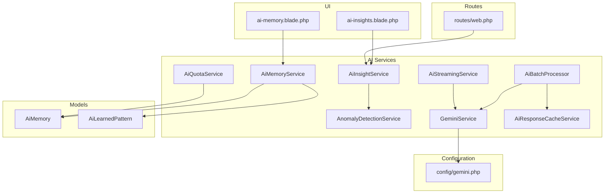
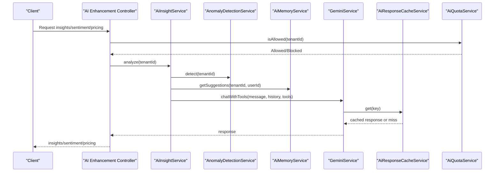
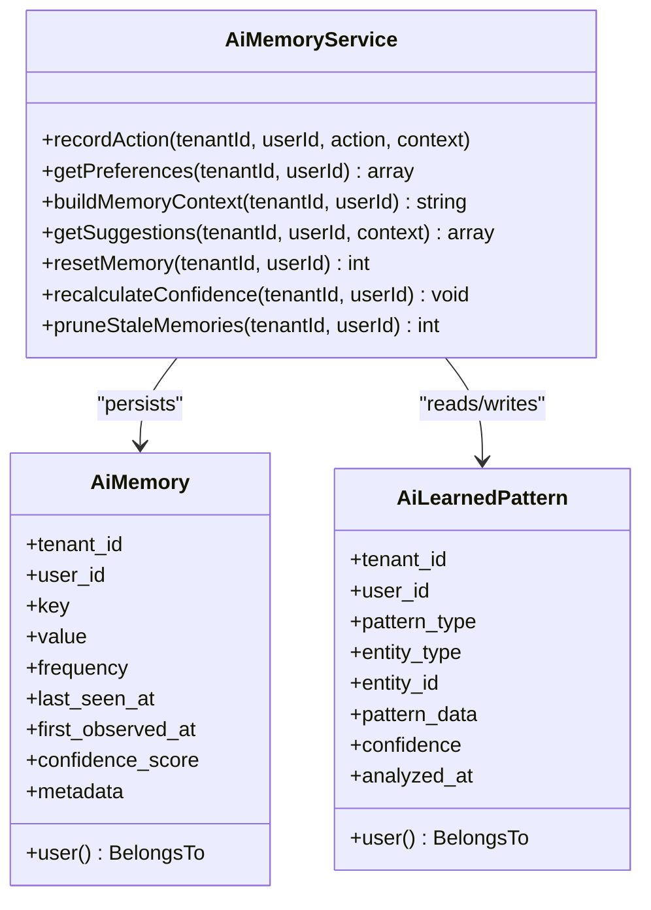
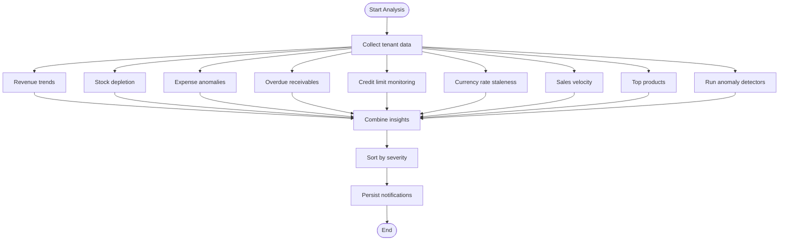
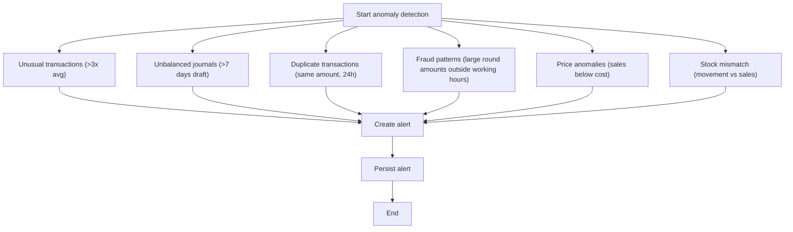
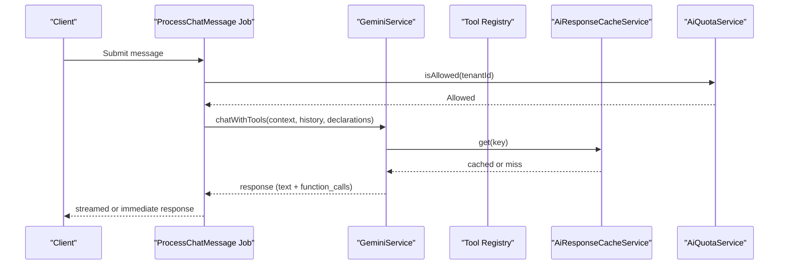
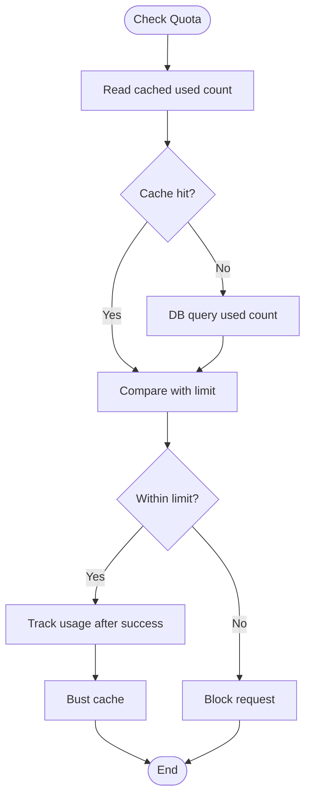
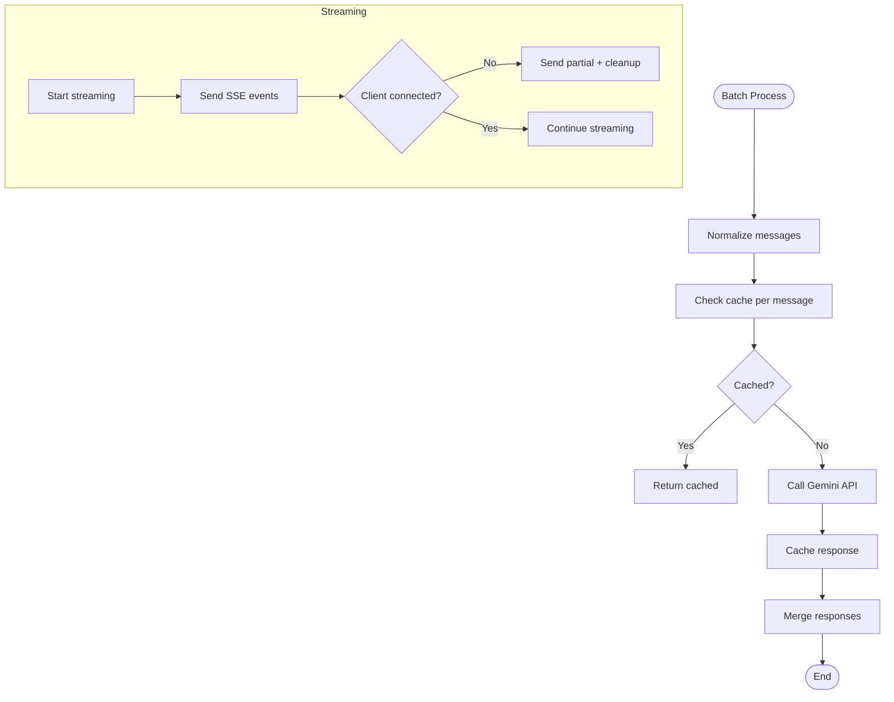
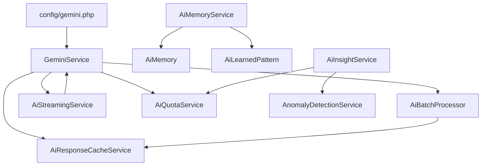

# AI Integration & Machine Learning

<cite>
**Referenced Files in This Document**
- [AiMemoryService.php](file://app/Services/AiMemoryService.php)
- [AiInsightService.php](file://app/Services/AiInsightService.php)
- [AnomalyDetectionService.php](file://app/Services/AnomalyDetectionService.php)
- [GeminiService.php](file://app/Services/GeminiService.php)
- [AiBatchProcessor.php](file://app/Services/AiBatchProcessor.php)
- [AiQuotaService.php](file://app/Services/AiQuotaService.php)
- [AiResponseCacheService.php](file://app/Services/AiResponseCacheService.php)
- [AiStreamingService.php](file://app/Services/AiStreamingService.php)
- [AiMemory.php](file://app/Models/AiMemory.php)
- [AiLearnedPattern.php](file://app/Models/AiLearnedPattern.php)
- [gemini.php](file://config/gemini.php)
- [ProcessChatMessage.php](file://app/Jobs/ProcessChatMessage.php)
- [ai-memory.blade.php](file://resources/views/settings/ai-memory.blade.php)
- [ai-insights.blade.php](file://resources/views/dashboard/widgets/ai-insights.blade.php)
- [web.php](file://routes/web.php)
- [ai-enhancement-tables.php](file://database/migrations/2026_04_06_100000_create_ai_enhancement_tables.php)
</cite>

## Table of Contents
1. [Introduction](#introduction)
2. [Project Structure](#project-structure)
3. [Core Components](#core-components)
4. [Architecture Overview](#architecture-overview)
5. [Detailed Component Analysis](#detailed-component-analysis)
6. [Dependency Analysis](#dependency-analysis)
7. [Performance Considerations](#performance-considerations)
8. [Troubleshooting Guide](#troubleshooting-guide)
9. [Conclusion](#conclusion)

## Introduction
This document explains Qalcuity ERP's AI-powered features and machine learning capabilities. It covers the AI memory system, automated insights generation, anomaly detection, predictive analytics, and AI-driven recommendations. It also documents the integration with the Gemini AI platform, configuration options for AI services, quota management, response caching, and performance optimization strategies. The goal is to help both technical and non-technical users understand how AI enhances ERP operations and how to configure and operate these features effectively.

## Project Structure
Qalcuity ERP organizes AI capabilities across services, models, configuration, and UI components:
- Services: Core AI logic (memory, insights, anomaly detection, Gemini integration, batching, quotas, caching, streaming)
- Models: AI memory persistence (AiMemory, AiLearnedPattern)
- Configuration: Gemini settings and optimization flags
- UI: Settings pages for AI memory and dashboard widgets for AI insights
- Routes: AI enhancement endpoints for sentiment analysis and pricing

**Diagram sources**
- [AiMemoryService.php:1-427](file://app/Services/AiMemoryService.php#L1-L427)
- [AiInsightService.php:1-1330](file://app/Services/AiInsightService.php#L1-L1330)
- [AnomalyDetectionService.php:1-287](file://app/Services/AnomalyDetectionService.php#L1-L287)
- [GeminiService.php:1-1257](file://app/Services/GeminiService.php#L1-L1257)
- [AiBatchProcessor.php:1-191](file://app/Services/AiBatchProcessor.php#L1-L191)
- [AiQuotaService.php:1-241](file://app/Services/AiQuotaService.php#L1-L241)
- [AiResponseCacheService.php:1-250](file://app/Services/AiResponseCacheService.php#L1-L250)
- [AiStreamingService.php:1-332](file://app/Services/AiStreamingService.php#L1-L332)
- [AiMemory.php:1-38](file://app/Models/AiMemory.php#L1-L38)
- [AiLearnedPattern.php:1-35](file://app/Models/AiLearnedPattern.php#L1-L35)
- [gemini.php:1-51](file://config/gemini.php#L1-L51)
- [ai-memory.blade.php:1-400](file://resources/views/settings/ai-memory.blade.php#L1-L400)
- [ai-insights.blade.php:1-100](file://resources/views/dashboard/widgets/ai-insights.blade.php#L1-L100)
- [web.php:2553-2569](file://routes/web.php#L2553-L2569)

**Section sources**
- [AiMemoryService.php:1-427](file://app/Services/AiMemoryService.php#L1-L427)
- [AiInsightService.php:1-1330](file://app/Services/AiInsightService.php#L1-L1330)
- [AnomalyDetectionService.php:1-287](file://app/Services/AnomalyDetectionService.php#L1-L287)
- [GeminiService.php:1-1257](file://app/Services/GeminiService.php#L1-L1257)
- [AiBatchProcessor.php:1-191](file://app/Services/AiBatchProcessor.php#L1-L191)
- [AiQuotaService.php:1-241](file://app/Services/AiQuotaService.php#L1-L241)
- [AiResponseCacheService.php:1-250](file://app/Services/AiResponseCacheService.php#L1-L250)
- [AiStreamingService.php:1-332](file://app/Services/AiStreamingService.php#L1-L332)
- [AiMemory.php:1-38](file://app/Models/AiMemory.php#L1-L38)
- [AiLearnedPattern.php:1-35](file://app/Models/AiLearnedPattern.php#L1-L35)
- [gemini.php:1-51](file://config/gemini.php#L1-L51)
- [ai-memory.blade.php:1-400](file://resources/views/settings/ai-memory.blade.php#L1-L400)
- [ai-insights.blade.php:1-100](file://resources/views/dashboard/widgets/ai-insights.blade.php#L1-L100)
- [web.php:2553-2569](file://routes/web.php#L2553-L2569)

## Core Components
- AI Memory System: Records user preferences and learned patterns, builds contextual prompts, and generates suggestions.
- AI Insight Engine: Proactively analyzes business data to surface anomalies, trends, and recommendations.
- Anomaly Detection: Identifies unusual transactions, imbalances, duplicates, fraud patterns, pricing anomalies, and stock mismatches.
- Gemini AI Integration: Provides system prompts, function calling, fallback models, and streaming responses.
- AI Quota Management: Enforces monthly message limits per tenant plan with caching and fail-safe mechanisms.
- Response Caching: Intelligent caching with TTL policies for static vs dynamic queries.
- Batch Processing: Efficiently handles multiple AI requests with chunking and async dispatch.
- Streaming Responses: Smooth, real-time chat experiences with client disconnect detection and recovery.

**Section sources**
- [AiMemoryService.php:1-427](file://app/Services/AiMemoryService.php#L1-L427)
- [AiInsightService.php:1-1330](file://app/Services/AiInsightService.php#L1-L1330)
- [AnomalyDetectionService.php:1-287](file://app/Services/AnomalyDetectionService.php#L1-L287)
- [GeminiService.php:1-1257](file://app/Services/GeminiService.php#L1-L1257)
- [AiQuotaService.php:1-241](file://app/Services/AiQuotaService.php#L1-L241)
- [AiResponseCacheService.php:1-250](file://app/Services/AiResponseCacheService.php#L1-L250)
- [AiBatchProcessor.php:1-191](file://app/Services/AiBatchProcessor.php#L1-L191)
- [AiStreamingService.php:1-332](file://app/Services/AiStreamingService.php#L1-L332)

## Architecture Overview
The AI architecture integrates tightly with the ERP domain:
- Controllers orchestrate AI enhancements (sentiment analysis, pricing).
- Services encapsulate AI logic and integrations.
- Models persist AI memory and learned patterns.
- Configuration drives Gemini behavior and optimization.
- UI surfaces insights and memory settings.
- Jobs handle background AI tasks (insights, recommendations, batch processing).

**Diagram sources**
- [AiInsightService.php:1-1330](file://app/Services/AiInsightService.php#L1-L1330)
- [AnomalyDetectionService.php:1-287](file://app/Services/AnomalyDetectionService.php#L1-L287)
- [AiMemoryService.php:1-427](file://app/Services/AiMemoryService.php#L1-L427)
- [GeminiService.php:1-1257](file://app/Services/GeminiService.php#L1-L1257)
- [AiResponseCacheService.php:1-250](file://app/Services/AiResponseCacheService.php#L1-L250)
- [AiQuotaService.php:1-241](file://app/Services/AiQuotaService.php#L1-L241)
- [web.php:2553-2569](file://routes/web.php#L2553-L2569)

## Detailed Component Analysis

### AI Memory System
The AI memory system learns from user actions and stores preferences and patterns to personalize AI interactions and automate workflows.

Key behaviors:
- Preference tracking across 12+ keys (payment methods, warehouses, suppliers, discounts, etc.)
- Confidence scoring based on frequency and recency
- Structured memory context injection into Gemini prompts
- Pattern-based suggestions for improved UX

**Diagram sources**
- [AiMemoryService.php:1-427](file://app/Services/AiMemoryService.php#L1-L427)
- [AiMemory.php:1-38](file://app/Models/AiMemory.php#L1-L38)
- [AiLearnedPattern.php:1-35](file://app/Models/AiLearnedPattern.php#L1-L35)

**Section sources**
- [AiMemoryService.php:1-427](file://app/Services/AiMemoryService.php#L1-L427)
- [AiMemory.php:1-38](file://app/Models/AiMemory.php#L1-L38)
- [AiLearnedPattern.php:1-35](file://app/Models/AiLearnedPattern.php#L1-L35)
- [ai-memory.blade.php:1-400](file://resources/views/settings/ai-memory.blade.php#L1-L400)

### Automated Insights Generation
The AI insight engine continuously analyzes business metrics to surface actionable intelligence and anomalies.

**Diagram sources**
- [AiInsightService.php:1-1330](file://app/Services/AiInsightService.php#L1-L1330)
- [AnomalyDetectionService.php:1-287](file://app/Services/AnomalyDetectionService.php#L1-L287)

**Section sources**
- [AiInsightService.php:1-1330](file://app/Services/AiInsightService.php#L1-L1330)
- [ai-insights.blade.php:1-100](file://resources/views/dashboard/widgets/ai-insights.blade.php#L1-L100)

### Anomaly Detection
Automatically detects suspicious or inconsistent activities across financial and inventory domains.

**Diagram sources**
- [AnomalyDetectionService.php:1-287](file://app/Services/AnomalyDetectionService.php#L1-L287)

**Section sources**
- [AnomalyDetectionService.php:1-287](file://app/Services/AnomalyDetectionService.php#L1-L287)

### Gemini AI Integration
GeminiService provides the foundation for AI chat, function calling, fallback models, and streaming.

**Diagram sources**
- [ProcessChatMessage.php:1-200](file://app/Jobs/ProcessChatMessage.php#L1-L200)
- [GeminiService.php:1-1257](file://app/Services/GeminiService.php#L1-L1257)
- [AiResponseCacheService.php:1-250](file://app/Services/AiResponseCacheService.php#L1-L250)
- [AiQuotaService.php:1-241](file://app/Services/AiQuotaService.php#L1-L241)

**Section sources**
- [GeminiService.php:1-1257](file://app/Services/GeminiService.php#L1-L1257)
- [ProcessChatMessage.php:1-200](file://app/Jobs/ProcessChatMessage.php#L1-L200)

### AI Quota Management
Enforces monthly message limits per tenant plan with caching and fail-safe fallbacks.

**Diagram sources**
- [AiQuotaService.php:1-241](file://app/Services/AiQuotaService.php#L1-L241)

**Section sources**
- [AiQuotaService.php:1-241](file://app/Services/AiQuotaService.php#L1-L241)

### Response Caching and Batch Processing
Caching reduces latency and API costs; batching optimizes throughput for multiple requests.

**Diagram sources**
- [AiBatchProcessor.php:1-191](file://app/Services/AiBatchProcessor.php#L1-L191)
- [AiResponseCacheService.php:1-250](file://app/Services/AiResponseCacheService.php#L1-L250)
- [AiStreamingService.php:1-332](file://app/Services/AiStreamingService.php#L1-L332)

**Section sources**
- [AiBatchProcessor.php:1-191](file://app/Services/AiBatchProcessor.php#L1-L191)
- [AiResponseCacheService.php:1-250](file://app/Services/AiResponseCacheService.php#L1-L250)
- [AiStreamingService.php:1-332](file://app/Services/AiStreamingService.php#L1-L332)

### AI-Driven Features and Workflows
- Anomaly Detection: Unusual transactions, journal imbalances, duplicates, fraud patterns, pricing anomalies, stock mismatches.
- Predictive Analytics: Sales forecasting, inventory demand, churn risk (via dashboard widgets and analytics routes).
- Intelligent Recommendations: AI Financial Advisor recommendations and contextual suggestions from memory.
- Automated Insights: Proactive dashboards and notifications for anomalies and trends.
- Workflow Automation: Function calling enables AI to execute actions (create/update records) based on user intent.

**Section sources**
- [AnomalyDetectionService.php:1-287](file://app/Services/AnomalyDetectionService.php#L1-L287)
- [AiInsightService.php:1-1330](file://app/Services/AiInsightService.php#L1-L1330)
- [web.php:2553-2569](file://routes/web.php#L2553-L2569)
- [ai-insights.blade.php:1-100](file://resources/views/dashboard/widgets/ai-insights.blade.php#L1-L100)

## Dependency Analysis
AI services depend on configuration, models, and each other to deliver cohesive functionality.

**Diagram sources**
- [gemini.php:1-51](file://config/gemini.php#L1-L51)
- [GeminiService.php:1-1257](file://app/Services/GeminiService.php#L1-L1257)
- [AiBatchProcessor.php:1-191](file://app/Services/AiBatchProcessor.php#L1-L191)
- [AiResponseCacheService.php:1-250](file://app/Services/AiResponseCacheService.php#L1-L250)
- [AiStreamingService.php:1-332](file://app/Services/AiStreamingService.php#L1-L332)
- [AiQuotaService.php:1-241](file://app/Services/AiQuotaService.php#L1-L241)
- [AiMemoryService.php:1-427](file://app/Services/AiMemoryService.php#L1-L427)
- [AiInsightService.php:1-1330](file://app/Services/AiInsightService.php#L1-L1330)
- [AnomalyDetectionService.php:1-287](file://app/Services/AnomalyDetectionService.php#L1-L287)
- [AiMemory.php:1-38](file://app/Models/AiMemory.php#L1-L38)
- [AiLearnedPattern.php:1-35](file://app/Models/AiLearnedPattern.php#L1-L35)

**Section sources**
- [gemini.php:1-51](file://config/gemini.php#L1-L51)
- [AiMemoryService.php:1-427](file://app/Services/AiMemoryService.php#L1-L427)
- [AiInsightService.php:1-1330](file://app/Services/AiInsightService.php#L1-L1330)
- [AnomalyDetectionService.php:1-287](file://app/Services/AnomalyDetectionService.php#L1-L287)
- [GeminiService.php:1-1257](file://app/Services/GeminiService.php#L1-L1257)
- [AiBatchProcessor.php:1-191](file://app/Services/AiBatchProcessor.php#L1-L191)
- [AiQuotaService.php:1-241](file://app/Services/AiQuotaService.php#L1-L241)
- [AiResponseCacheService.php:1-250](file://app/Services/AiResponseCacheService.php#L1-L250)
- [AiStreamingService.php:1-332](file://app/Services/AiStreamingService.php#L1-L332)
- [AiMemory.php:1-38](file://app/Models/AiMemory.php#L1-L38)
- [AiLearnedPattern.php:1-35](file://app/Models/AiLearnedPattern.php#L1-L35)

## Performance Considerations
- Caching: Configurable TTLs for short, default, and long-lived responses; cache normalization improves hit rates.
- Batching: Limits batch size, splits large batches, and dispatches chunks asynchronously to avoid timeouts.
- Streaming: SSE-based streaming with chunked delivery and graceful degradation on client disconnect.
- Quota Enforcement: Cached monthly usage with fail-safe fallbacks to prevent abuse and maintain reliability.
- Optimization Flags: Enable/disable rule-based responses, streaming, logging, and cost tracking via configuration.

[No sources needed since this section provides general guidance]

## Troubleshooting Guide
Common issues and resolutions:
- Missing or invalid Gemini API key: GeminiService validates the key and throws descriptive errors; configure via admin settings or environment variables.
- Cache failures: AiQuotaService and AiResponseCacheService include fallbacks to DB or disabled cache modes; monitor logs for warnings.
- Streaming interruptions: AiStreamingService detects client disconnects and sends partial completion events; verify server headers and client SSE support.
- Batch processing timeouts: AiBatchProcessor splits oversized batches and staggers job dispatch; adjust chunk sizes and queues as needed.
- Anomaly detection noise: Adjust thresholds and filters in AnomalyDetectionService; review generated alerts and mark duplicates avoided.

**Section sources**
- [GeminiService.php:1-1257](file://app/Services/GeminiService.php#L1-L1257)
- [AiQuotaService.php:1-241](file://app/Services/AiQuotaService.php#L1-L241)
- [AiResponseCacheService.php:1-250](file://app/Services/AiResponseCacheService.php#L1-L250)
- [AiStreamingService.php:1-332](file://app/Services/AiStreamingService.php#L1-L332)
- [AiBatchProcessor.php:1-191](file://app/Services/AiBatchProcessor.php#L1-L191)
- [AnomalyDetectionService.php:1-287](file://app/Services/AnomalyDetectionService.php#L1-L287)

## Conclusion
Qalcuity ERP’s AI integration combines a robust memory system, proactive insights, anomaly detection, and Gemini-powered chat with function calling. The system emphasizes performance through caching, batching, streaming, and quota management, while maintaining reliability via fail-safes and comprehensive logging. Administrators can configure AI behavior and quotas, and users benefit from personalized recommendations, automated insights, and streamlined workflows.