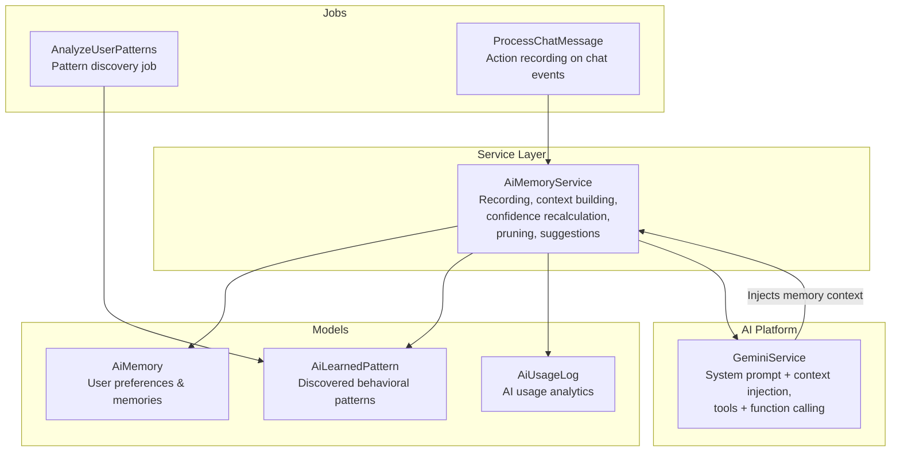
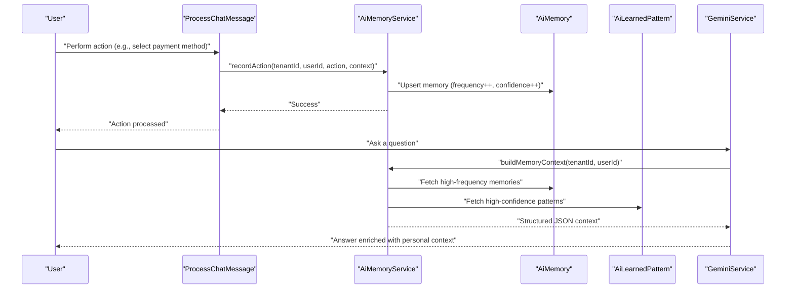
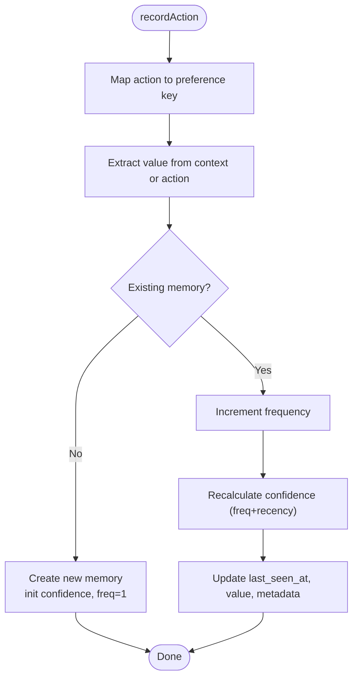
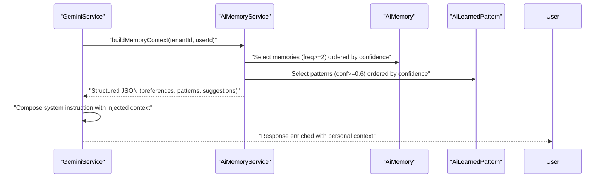
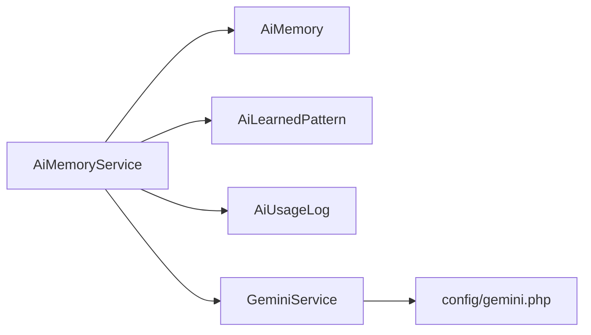

# AI Memory System

<cite>
**Referenced Files in This Document**
- [AiMemory.php](file://app/Models/AiMemory.php)
- [AiLearnedPattern.php](file://app/Models/AiLearnedPattern.php)
- [AiUsageLog.php](file://app/Models/AiUsageLog.php)
- [AiMemoryService.php](file://app/Services/AiMemoryService.php)
- [GeminiService.php](file://app/Services/GeminiService.php)
- [AnalyzeUserPatterns.php](file://app/Jobs/AnalyzeUserPatterns.php)
- [ProcessChatMessage.php](file://app/Jobs/ProcessChatMessage.php)
- [config/gemini.php](file://config/gemini.php)
</cite>

## Table of Contents
1. [Introduction](#introduction)
2. [Project Structure](#project-structure)
3. [Core Components](#core-components)
4. [Architecture Overview](#architecture-overview)
5. [Detailed Component Analysis](#detailed-component-analysis)
6. [Dependency Analysis](#dependency-analysis)
7. [Performance Considerations](#performance-considerations)
8. [Troubleshooting Guide](#troubleshooting-guide)
9. [Conclusion](#conclusion)

## Introduction
This document describes the AI Memory System powering Qalcuity ERP's intelligent personalization. It explains how user actions are recorded, transformed into persistent preferences, and leveraged to build contextual memory profiles. The system computes confidence scores, prunes stale memories, and generates structured suggestions. It also details how these memories are injected into the Gemini AI platform to enhance conversational and analytical capabilities with personalized context.

## Project Structure
The AI Memory System spans three primary areas:
- Data models for storing user memories, learned patterns, and usage analytics
- A service layer that records actions, builds context, and manages memory lifecycle
- Integration with the Gemini AI platform for context-aware responses

**Diagram sources**
- [AiMemory.php:10-37](file://app/Models/AiMemory.php#L10-L37)
- [AiLearnedPattern.php:10-34](file://app/Models/AiLearnedPattern.php#L10-L34)
- [AiUsageLog.php:10-48](file://app/Models/AiUsageLog.php#L10-L48)
- [AiMemoryService.php:12-426](file://app/Services/AiMemoryService.php#L12-L426)
- [GeminiService.php:19-1256](file://app/Services/GeminiService.php#L19-L1256)
- [AnalyzeUserPatterns.php](file://app/Jobs/AnalyzeUserPatterns.php)
- [ProcessChatMessage.php](file://app/Jobs/ProcessChatMessage.php)

**Section sources**
- [AiMemory.php:10-37](file://app/Models/AiMemory.php#L10-L37)
- [AiLearnedPattern.php:10-34](file://app/Models/AiLearnedPattern.php#L10-L34)
- [AiUsageLog.php:10-48](file://app/Models/AiUsageLog.php#L10-L48)
- [AiMemoryService.php:12-426](file://app/Services/AiMemoryService.php#L12-L426)
- [GeminiService.php:19-1256](file://app/Services/GeminiService.php#L19-L1256)
- [AnalyzeUserPatterns.php](file://app/Jobs/AnalyzeUserPatterns.php)
- [ProcessChatMessage.php](file://app/Jobs/ProcessChatMessage.php)

## Core Components
- AiMemory: Stores per-user, per-tenant preference keys with values, frequencies, timestamps, confidence scores, and optional metadata.
- AiLearnedPattern: Captures discovered behavioral patterns (e.g., frequent entities) with confidence and entity references.
- AiUsageLog: Tracks monthly AI usage metrics per tenant/user for quota and analytics.
- AiMemoryService: Central orchestrator for recording user actions, building memory context, generating suggestions, recalculating confidence, and pruning stale memories.
- GeminiService: Provides the Gemini AI integration, including system instruction composition, tool/function calling, and memory context injection.

**Section sources**
- [AiMemory.php:10-37](file://app/Models/AiMemory.php#L10-L37)
- [AiLearnedPattern.php:10-34](file://app/Models/AiLearnedPattern.php#L10-L34)
- [AiUsageLog.php:10-48](file://app/Services/AiUsageLog.php#L10-L48)
- [AiMemoryService.php:12-426](file://app/Services/AiMemoryService.php#L12-L426)
- [GeminiService.php:19-1256](file://app/Services/GeminiService.php#L19-L1256)

## Architecture Overview
The AI Memory System integrates with the chat flow and background jobs to continuously learn from user interactions and feed personalized context to Gemini.

**Diagram sources**
- [ProcessChatMessage.php](file://app/Jobs/ProcessChatMessage.php)
- [AiMemoryService.php:36-156](file://app/Services/AiMemoryService.php#L36-L156)
- [AiMemory.php:10-37](file://app/Models/AiMemory.php#L10-L37)
- [AiLearnedPattern.php:10-34](file://app/Models/AiLearnedPattern.php#L10-L34)
- [GeminiService.php:98-104](file://app/Services/GeminiService.php#L98-L104)

## Detailed Component Analysis

### AiMemory Model
- Purpose: Persist user preference memories scoped to tenant and user.
- Key attributes:
  - key: preference identifier (mapped from actions)
  - value: scalar or array value (e.g., name/id)
  - frequency: number of observations
  - last_seen_at, first_observed_at: temporal tracking
  - confidence_score: normalized score derived from frequency and recency
  - metadata: contextual notes (e.g., last associated entity)
- Casting ensures arrays and dates are handled consistently.

**Section sources**
- [AiMemory.php:10-37](file://app/Models/AiMemory.php#L10-L37)

### AiLearnedPattern Model
- Purpose: Store discovered behavioral patterns with confidence.
- Fields include pattern_type, entity_type, entity_id, pattern_data, and analyzed_at.
- Used alongside memories to enrich context with inferred preferences.

**Section sources**
- [AiLearnedPattern.php:10-34](file://app/Models/AiLearnedPattern.php#L10-L34)

### AiUsageLog Model
- Purpose: Track monthly AI usage per tenant/user for monitoring and quotas.
- Provides helpers to increment counters and compute totals.

**Section sources**
- [AiUsageLog.php:10-48](file://app/Models/AiUsageLog.php#L10-L48)

### AiMemoryService
- Preference Keys: Maintains a curated list of preference keys covering:
  - Payment methods, default warehouse, frequent customers/products/suppliers
  - Skipped steps, preferred currency, default cost center, preferred report period
  - Typical order quantity, preferred discount, preferred payment terms
  - Preferred delivery address, tax preference
- Recording Actions:
  - Maps natural-language actions to preference keys
  - Extracts values from context or falls back to the action itself
  - Upserts memory with frequency increments and confidence updates
- Confidence Scoring:
  - Initial confidence set for new memories
  - Recalculation considers frequency and recency (days since last seen)
- Context Building:
  - Builds a structured JSON containing user preferences, learned patterns, and contextual suggestions
  - Limits and filters to meaningful signals (min frequency, min confidence)
- Suggestions:
  - Generates human-readable suggestions based on preferences and patterns
- Pruning:
  - Removes stale memories below a confidence threshold and older than a retention window

**Diagram sources**
- [AiMemoryService.php:36-77](file://app/Services/AiMemoryService.php#L36-L77)
- [AiMemoryService.php:268-280](file://app/Services/AiMemoryService.php#L268-L280)

**Section sources**
- [AiMemoryService.php:14-31](file://app/Services/AiMemoryService.php#L14-L31)
- [AiMemoryService.php:36-77](file://app/Services/AiMemoryService.php#L36-L77)
- [AiMemoryService.php:268-280](file://app/Services/AiMemoryService.php#L268-L280)
- [AiMemoryService.php:107-156](file://app/Services/AiMemoryService.php#L107-L156)
- [AiMemoryService.php:162-253](file://app/Services/AiMemoryService.php#L162-L253)
- [AiMemoryService.php:285-294](file://app/Services/AiMemoryService.php#L285-L294)

### GeminiService Integration
- System Instruction: Composes a comprehensive system prompt with business context, capabilities, tooling, and language instructions.
- Context Injection: Accepts a tenant/business context string and injects it into the system instruction.
- Tools and Function Calling: Defines tool declarations and handles function call/results exchange with Gemini.
- Error Handling: Robust detection of API key errors, rate limits, and quota exhaustion with user-friendly messages.

**Diagram sources**
- [GeminiService.php:98-104](file://app/Services/GeminiService.php#L98-L104)
- [AiMemoryService.php:107-156](file://app/Services/AiMemoryService.php#L107-L156)

**Section sources**
- [GeminiService.php:59-104](file://app/Services/GeminiService.php#L59-L104)
- [GeminiService.php:754-813](file://app/Services/GeminiService.php#L754-L813)
- [GeminiService.php:819-865](file://app/Services/GeminiService.php#L819-L865)
- [AiMemoryService.php:107-156](file://app/Services/AiMemoryService.php#L107-L156)

### Background Pattern Discovery
- AnalyzeUserPatterns job: Processes historical data to discover frequent entities and behavioral patterns, writing them into AiLearnedPattern.
- These patterns augment memory context to improve suggestions and personalization.

**Section sources**
- [AnalyzeUserPatterns.php](file://app/Jobs/AnalyzeUserPatterns.php)

### Practical Examples

- Memory Recording
  - Scenario: User selects a payment method during checkout.
  - Action: AiMemoryService::recordAction(...) is called with action hint and context containing the selected method.
  - Outcome: A new memory is created or updated with incremented frequency and recalculated confidence.

- Preference Retrieval
  - Scenario: Requesting user preferences for a tenant/user.
  - Call: AiMemoryService::getPreferences(...)
  - Outcome: Returns a keyed map of preferences, ensuring all tracked keys are represented.

- Context Building for AI Prompts
  - Scenario: User asks a question in chat.
  - Call: AiMemoryService::buildMemoryContext(...) produces a structured JSON.
  - Integration: GeminiService::withTenantContext(...) injects this JSON into the system prompt.

- Suggestion Generation
  - Scenario: Generating contextual suggestions from preferences and patterns.
  - Call: AiMemoryService::getSuggestions(...)
  - Outcome: Human-readable suggestions tailored to user behavior.

- Memory Pruning
  - Scenario: Cleaning up stale memories.
  - Call: AiMemoryService::pruneStaleMemories(...)
  - Outcome: Removes low-confidence, outdated memories to maintain signal quality.

**Section sources**
- [AiMemoryService.php:36-77](file://app/Services/AiMemoryService.php#L36-L77)
- [AiMemoryService.php:83-101](file://app/Services/AiMemoryService.php#L83-L101)
- [AiMemoryService.php:107-156](file://app/Services/AiMemoryService.php#L107-L156)
- [AiMemoryService.php:162-253](file://app/Services/AiMemoryService.php#L162-L253)
- [AiMemoryService.php:285-294](file://app/Services/AiMemoryService.php#L285-L294)

## Dependency Analysis
- AiMemoryService depends on:
  - AiMemory and AiLearnedPattern for persistence
  - AiUsageLog for usage analytics
  - GeminiService for context injection and AI responses
- GeminiService depends on:
  - Configuration for API key, models, and fallbacks
  - External Gemini SDK for model interactions

**Diagram sources**
- [AiMemoryService.php:5-6](file://app/Services/AiMemoryService.php#L5-L6)
- [GeminiService.php:28-56](file://app/Services/GeminiService.php#L28-L56)
- [config/gemini.php](file://config/gemini.php)

**Section sources**
- [AiMemoryService.php:5-6](file://app/Services/AiMemoryService.php#L5-L6)
- [GeminiService.php:28-56](file://app/Services/GeminiService.php#L28-L56)
- [config/gemini.php](file://config/gemini.php)

## Performance Considerations
- Indexing: Ensure tenant_id, user_id, key, frequency, confidence_score, and timestamps are indexed for efficient queries.
- Limiting Context: The context builder limits results (e.g., top memories by confidence) to keep prompts concise.
- Confidence Recalculation: Batch recalculation balances frequency and recency to avoid costly per-request computations.
- Pruning: Regular pruning prevents memory bloat and maintains high-quality signals.

## Troubleshooting Guide
- Missing or invalid Gemini API key:
  - Symptom: Immediate failure with an authentication error.
  - Resolution: Verify GEMINI_API_KEY configuration and ensure billing is enabled if applicable.

- Rate limit or quota exceeded:
  - Symptom: Temporary unavailability or quota-related errors.
  - Resolution: Retry after cooldown or upgrade billing; GeminiService attempts fallback models automatically.

- Empty or insufficient context:
  - Symptom: Minimal personalization in responses.
  - Resolution: Ensure sufficient user actions have been recorded and that preferences meet minimum frequency thresholds.

- Stale preferences:
  - Symptom: Outdated suggestions.
  - Resolution: Trigger memory recalculation and pruning to refresh confidence scores.

**Section sources**
- [GeminiService.php:32-46](file://app/Services/GeminiService.php#L32-L46)
- [GeminiService.php:1021-1056](file://app/Services/GeminiService.php#L1021-L1056)
- [AiMemoryService.php:268-280](file://app/Services/AiMemoryService.php#L268-L280)
- [AiMemoryService.php:285-294](file://app/Services/AiMemoryService.php#L285-L294)

## Conclusion
The AI Memory System provides a robust foundation for personalization in Qalcuity ERP. By capturing user actions, persisting preferences, discovering behavioral patterns, and injecting context into Gemini, it enables intelligent, adaptive assistance. The system’s confidence scoring, pruning strategies, and structured context building ensure that personalization remains accurate, timely, and valuable.