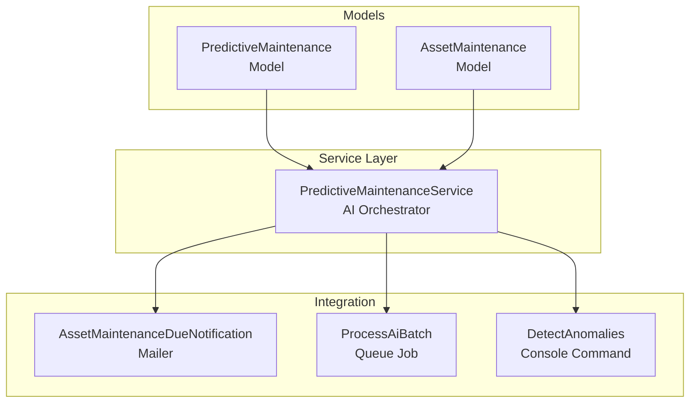
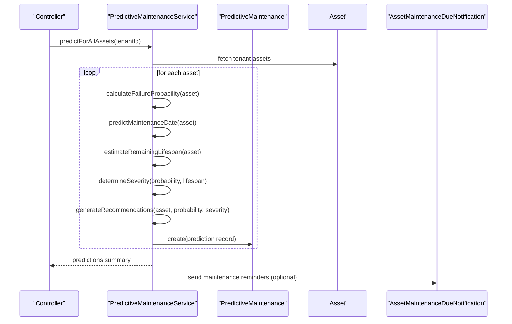
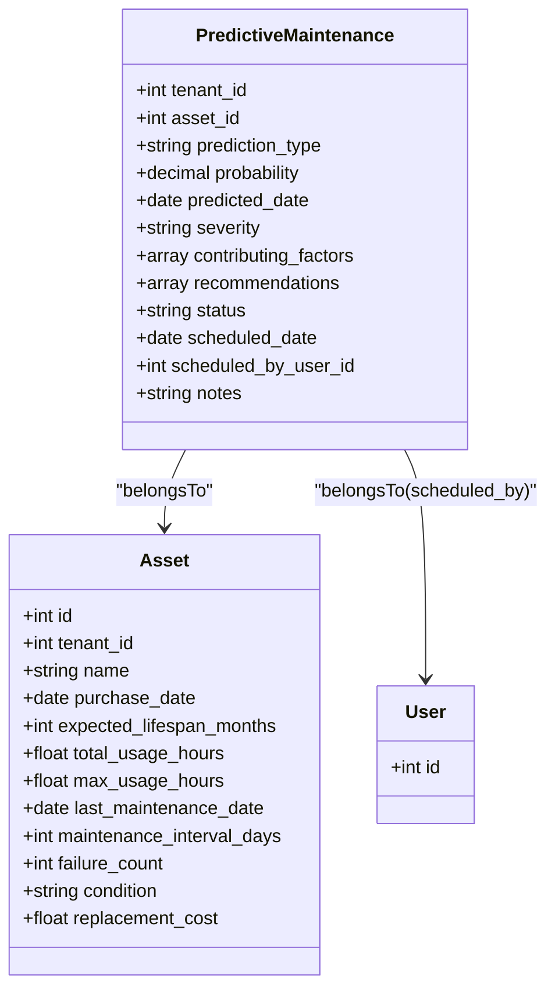
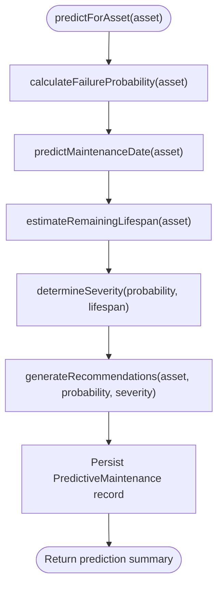
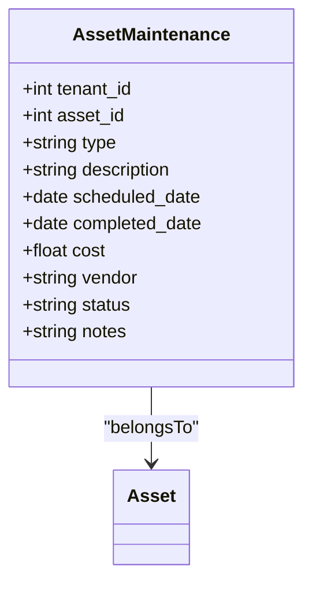
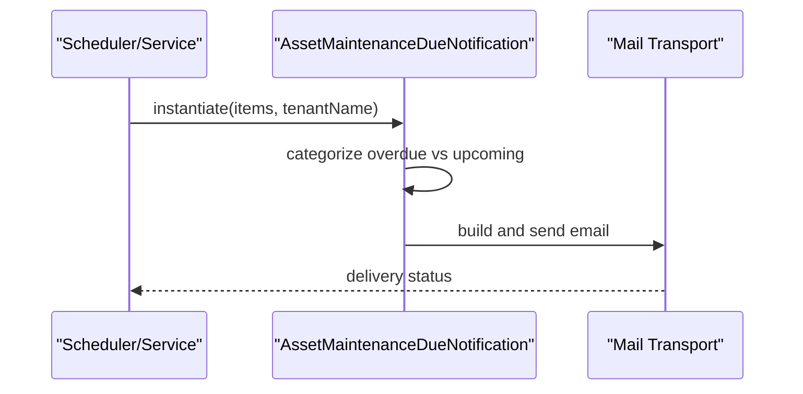
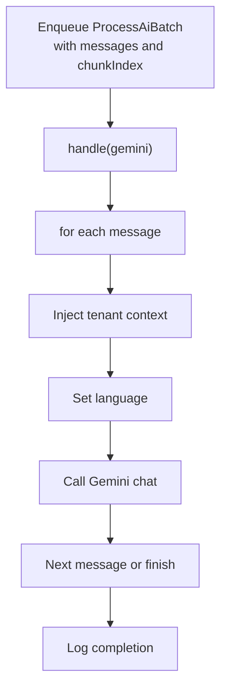
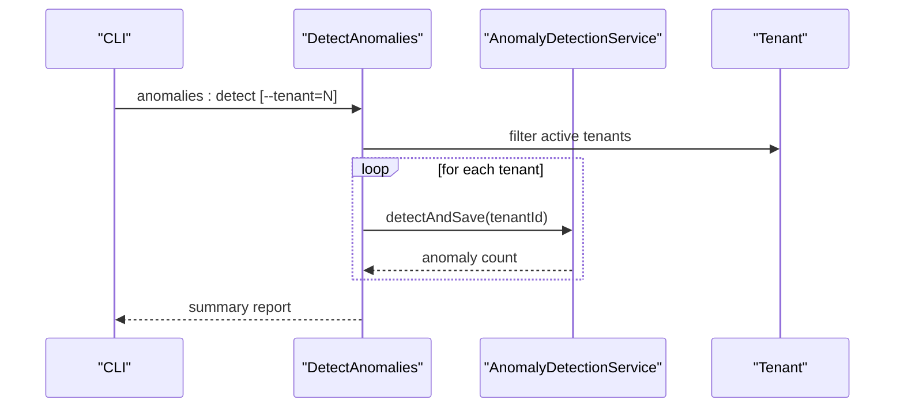
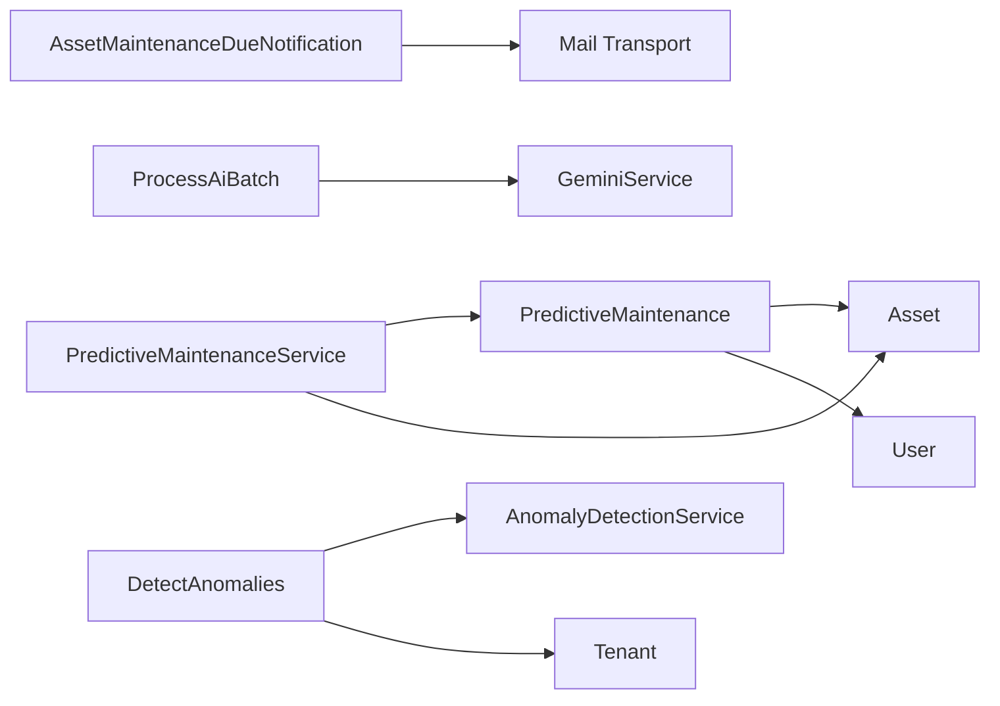

# Predictive Maintenance AI

<cite>
**Referenced Files in This Document**
- [PredictiveMaintenance.php](file://app/Models/PredictiveMaintenance.php)
- [PredictiveMaintenanceService.php](file://app/Services/AI/PredictiveMaintenanceService.php)
- [AssetMaintenance.php](file://app/Models/AssetMaintenance.php)
- [AssetMaintenanceDueNotification.php](file://app/Notifications/AssetMaintenanceDueNotification.php)
- [ProcessAiBatch.php](file://app/Jobs/ProcessAiBatch.php)
- [DetectAnomalies.php](file://app/Console/Commands/DetectAnomalies.php)
</cite>

## Table of Contents
1. [Introduction](#introduction)
2. [Project Structure](#project-structure)
3. [Core Components](#core-components)
4. [Architecture Overview](#architecture-overview)
5. [Detailed Component Analysis](#detailed-component-analysis)
6. [Dependency Analysis](#dependency-analysis)
7. [Performance Considerations](#performance-considerations)
8. [Troubleshooting Guide](#troubleshooting-guide)
9. [Conclusion](#conclusion)

## Introduction
This document describes Qalcuity ERP's Predictive Maintenance AI system. It explains how the system predicts equipment failure, schedules maintenance, forecasts asset lifecycles, integrates with IoT sensors and historical maintenance data, and generates actionable recommendations. It also covers configuration options, automated work order creation, and batch processing for maintenance predictions.

## Project Structure
The Predictive Maintenance AI system spans models, services, notifications, jobs, and console commands:

- Models define data structures for predictions and maintenance records
- Service encapsulates the AI/ML-inspired algorithms and orchestration
- Notifications deliver maintenance reminders
- Jobs enable batch processing of AI tasks
- Console commands coordinate anomaly detection and tenant-wide processing

**Diagram sources**
- [PredictiveMaintenance.php:10-49](file://app/Models/PredictiveMaintenance.php#L10-L49)
- [AssetMaintenance.php:9-20](file://app/Models/AssetMaintenance.php#L9-L20)
- [PredictiveMaintenanceService.php:9-355](file://app/Services/AI/PredictiveMaintenanceService.php#L9-L355)
- [AssetMaintenanceDueNotification.php:10-58](file://app/Notifications/AssetMaintenanceDueNotification.php#L10-L58)
- [ProcessAiBatch.php:13-76](file://app/Jobs/ProcessAiBatch.php#L13-L76)
- [DetectAnomalies.php:9-42](file://app/Console/Commands/DetectAnomalies.php#L9-L42)

**Section sources**
- [PredictiveMaintenance.php:10-49](file://app/Models/PredictiveMaintenance.php#L10-L49)
- [PredictiveMaintenanceService.php:9-355](file://app/Services/AI/PredictiveMaintenanceService.php#L9-L355)
- [AssetMaintenance.php:9-20](file://app/Models/AssetMaintenance.php#L9-L20)
- [AssetMaintenanceDueNotification.php:10-58](file://app/Notifications/AssetMaintenanceDueNotification.php#L10-L58)
- [ProcessAiBatch.php:13-76](file://app/Jobs/ProcessAiBatch.php#L13-L76)
- [DetectAnomalies.php:9-42](file://app/Console/Commands/DetectAnomalies.php#L9-L42)

## Core Components
- PredictiveMaintenance model: Stores prediction outcomes, probabilities, severity, recommendations, and scheduling metadata
- PredictiveMaintenanceService: Implements failure probability calculation, maintenance due date prediction, remaining lifespan estimation, severity determination, recommendation generation, and lifecycle status updates
- AssetMaintenance model: Tracks planned/completed maintenance activities linked to assets
- AssetMaintenanceDueNotification: Generates email notifications for upcoming or overdue maintenance items
- ProcessAiBatch: Batch-processing job for AI tasks (supports tenant context and language)
- DetectAnomalies: Console command to detect anomalies across tenants

Key capabilities:
- Failure probability calculation using asset age, usage, maintenance history, and failure counts
- Predictive maintenance due dates based on configured intervals
- Remaining lifespan estimation adjusted by asset condition
- Severity classification and tailored recommendations
- Status tracking (pending, scheduled, completed, dismissed)
- Maintenance statistics aggregation

**Section sources**
- [PredictiveMaintenance.php:14-35](file://app/Models/PredictiveMaintenance.php#L14-L35)
- [PredictiveMaintenanceService.php:14-83](file://app/Services/AI/PredictiveMaintenanceService.php#L14-L83)
- [PredictiveMaintenanceService.php:88-114](file://app/Services/AI/PredictiveMaintenanceService.php#L88-L114)
- [PredictiveMaintenanceService.php:119-135](file://app/Services/AI/PredictiveMaintenanceService.php#L119-L135)
- [PredictiveMaintenanceService.php:140-158](file://app/Services/AI/PredictiveMaintenanceService.php#L140-L158)
- [PredictiveMaintenanceService.php:163-174](file://app/Services/AI/PredictiveMaintenanceService.php#L163-L174)
- [PredictiveMaintenanceService.php:179-216](file://app/Services/AI/PredictiveMaintenanceService.php#L179-L216)
- [AssetMaintenance.php:12-17](file://app/Models/AssetMaintenance.php#L12-L17)
- [AssetMaintenanceDueNotification.php:17-20](file://app/Notifications/AssetMaintenanceDueNotification.php#L17-L20)
- [ProcessAiBatch.php:20-25](file://app/Jobs/ProcessAiBatch.php#L20-L25)
- [DetectAnomalies.php:11-12](file://app/Console/Commands/DetectAnomalies.php#L11-L12)

## Architecture Overview
The system follows a service-driven architecture:
- Controllers (not shown here) trigger prediction workflows
- PredictiveMaintenanceService orchestrates ML-inspired computations
- Models persist predictions and maintenance records
- Notifications and jobs integrate with external systems and queues
- Console commands support tenant-wide maintenance and anomaly detection

**Diagram sources**
- [PredictiveMaintenanceService.php:14-32](file://app/Services/AI/PredictiveMaintenanceService.php#L14-L32)
- [PredictiveMaintenanceService.php:37-83](file://app/Services/AI/PredictiveMaintenanceService.php#L37-L83)
- [PredictiveMaintenance.php:56-66](file://app/Models/PredictiveMaintenance.php#L56-L66)

## Detailed Component Analysis

### PredictiveMaintenance Model
Represents a single prediction with:
- Core attributes: tenant, asset, prediction type, probability, predicted date, severity, contributing factors, recommendations, status, scheduled date, scheduled by user, notes
- Casts for numeric/date fields
- Relationships to Tenant, Asset, and User (scheduler)

**Diagram sources**
- [PredictiveMaintenance.php:14-48](file://app/Models/PredictiveMaintenance.php#L14-L48)

**Section sources**
- [PredictiveMaintenance.php:14-35](file://app/Models/PredictiveMaintenance.php#L14-L35)
- [PredictiveMaintenance.php:41-48](file://app/Models/PredictiveMaintenance.php#L41-L48)

### PredictiveMaintenanceService
Core AI/ML service implementing:
- Batch prediction for all tenant assets
- Individual asset prediction pipeline
- Failure probability calculation combining age, usage, maintenance history, and failure counts
- Maintenance due date prediction using configured intervals
- Remaining lifespan estimation adjusted by condition
- Severity classification based on probability and lifespan
- Recommendation generation tailored to severity and probability
- Prediction lifecycle management: schedule, mark completed, dismiss
- Statistics aggregation by severity and status

**Diagram sources**
- [PredictiveMaintenanceService.php:37-83](file://app/Services/AI/PredictiveMaintenanceService.php#L37-L83)
- [PredictiveMaintenanceService.php:88-114](file://app/Services/AI/PredictiveMaintenanceService.php#L88-L114)
- [PredictiveMaintenanceService.php:119-135](file://app/Services/AI/PredictiveMaintenanceService.php#L119-L135)
- [PredictiveMaintenanceService.php:140-158](file://app/Services/AI/PredictiveMaintenanceService.php#L140-L158)
- [PredictiveMaintenanceService.php:163-174](file://app/Services/AI/PredictiveMaintenanceService.php#L163-L174)
- [PredictiveMaintenanceService.php:179-216](file://app/Services/AI/PredictiveMaintenanceService.php#L179-L216)

**Section sources**
- [PredictiveMaintenanceService.php:14-32](file://app/Services/AI/PredictiveMaintenanceService.php#L14-L32)
- [PredictiveMaintenanceService.php:37-83](file://app/Services/AI/PredictiveMaintenanceService.php#L37-L83)
- [PredictiveMaintenanceService.php:88-114](file://app/Services/AI/PredictiveMaintenanceService.php#L88-L114)
- [PredictiveMaintenanceService.php:119-135](file://app/Services/AI/PredictiveMaintenanceService.php#L119-L135)
- [PredictiveMaintenanceService.php:140-158](file://app/Services/AI/PredictiveMaintenanceService.php#L140-L158)
- [PredictiveMaintenanceService.php:163-174](file://app/Services/AI/PredictiveMaintenanceService.php#L163-L174)
- [PredictiveMaintenanceService.php:179-216](file://app/Services/AI/PredictiveMaintenanceService.php#L179-L216)
- [PredictiveMaintenanceService.php:235-250](file://app/Services/AI/PredictiveMaintenanceService.php#L235-L250)
- [PredictiveMaintenanceService.php:255-277](file://app/Services/AI/PredictiveMaintenanceService.php#L255-L277)
- [PredictiveMaintenanceService.php:282-295](file://app/Services/AI/PredictiveMaintenanceService.php#L282-L295)
- [PredictiveMaintenanceService.php:300-334](file://app/Services/AI/PredictiveMaintenanceService.php#L300-L334)
- [PredictiveMaintenanceService.php:339-353](file://app/Services/AI/PredictiveMaintenanceService.php#L339-L353)

### AssetMaintenance Model
Tracks planned and completed maintenance activities:
- Fields include tenant, asset, type, description, scheduled/completion dates, cost, vendor, status, notes
- Relationship to Asset

**Diagram sources**
- [AssetMaintenance.php:12-19](file://app/Models/AssetMaintenance.php#L12-L19)

**Section sources**
- [AssetMaintenance.php:12-17](file://app/Models/AssetMaintenance.php#L12-L17)
- [AssetMaintenance.php:19](file://app/Models/AssetMaintenance.php#L19)

### AssetMaintenanceDueNotification
Email notification for upcoming and overdue maintenance items:
- Accepts a list of items with asset name, type, scheduled date, and days until due
- Separates overdue vs upcoming items
- Provides action link to maintenance page

**Diagram sources**
- [AssetMaintenanceDueNotification.php:17-20](file://app/Notifications/AssetMaintenanceDueNotification.php#L17-L20)
- [AssetMaintenanceDueNotification.php:27-56](file://app/Notifications/AssetMaintenanceDueNotification.php#L27-L56)

**Section sources**
- [AssetMaintenanceDueNotification.php:17-20](file://app/Notifications/AssetMaintenanceDueNotification.php#L17-L20)
- [AssetMaintenanceDueNotification.php:27-56](file://app/Notifications/AssetMaintenanceDueNotification.php#L27-L56)

### ProcessAiBatch Job
Batch processing job supporting:
- Chunked processing of AI messages
- Tenant context injection
- Language selection
- Robust error handling per message

**Diagram sources**
- [ProcessAiBatch.php:20-25](file://app/Jobs/ProcessAiBatch.php#L20-L25)
- [ProcessAiBatch.php:27-74](file://app/Jobs/ProcessAiBatch.php#L27-L74)

**Section sources**
- [ProcessAiBatch.php:20-25](file://app/Jobs/ProcessAiBatch.php#L20-L25)
- [ProcessAiBatch.php:27-74](file://app/Jobs/ProcessAiBatch.php#L27-L74)

### DetectAnomalies Command
Console command to detect anomalies across tenants:
- Supports filtering by specific tenant
- Iterates active tenants
- Calls anomaly detection service and aggregates results

**Diagram sources**
- [DetectAnomalies.php:11-12](file://app/Console/Commands/DetectAnomalies.php#L11-L12)
- [DetectAnomalies.php:14-40](file://app/Console/Commands/DetectAnomalies.php#L14-L40)

**Section sources**
- [DetectAnomalies.php:11-12](file://app/Console/Commands/DetectAnomalies.php#L11-L12)
- [DetectAnomalies.php:14-40](file://app/Console/Commands/DetectAnomalies.php#L14-L40)

## Dependency Analysis
- PredictiveMaintenanceService depends on:
  - PredictiveMaintenance model for persistence
  - Asset model for input data
  - Logging for error handling
- PredictiveMaintenance model depends on:
  - Asset and User for relationships
- AssetMaintenanceDueNotification depends on:
  - Mail transport for delivery
- ProcessAiBatch depends on:
  - GeminiService for AI chat
  - Logging for observability
- DetectAnomalies depends on:
  - AnomalyDetectionService
  - Tenant model for iteration

**Diagram sources**
- [PredictiveMaintenanceService.php:5-6](file://app/Services/AI/PredictiveMaintenanceService.php#L5-L6)
- [PredictiveMaintenance.php:37-48](file://app/Models/PredictiveMaintenance.php#L37-L48)
- [AssetMaintenanceDueNotification.php:10](file://app/Notifications/AssetMaintenanceDueNotification.php#L10)
- [ProcessAiBatch.php:5](file://app/Jobs/ProcessAiBatch.php#L5)
- [DetectAnomalies.php:6](file://app/Console/Commands/DetectAnomalies.php#L6)

**Section sources**
- [PredictiveMaintenanceService.php:5-6](file://app/Services/AI/PredictiveMaintenanceService.php#L5-L6)
- [PredictiveMaintenance.php:37-48](file://app/Models/PredictiveMaintenance.php#L37-L48)
- [AssetMaintenanceDueNotification.php:10](file://app/Notifications/AssetMaintenanceDueNotification.php#L10)
- [ProcessAiBatch.php:5](file://app/Jobs/ProcessAiBatch.php#L5)
- [DetectAnomalies.php:6](file://app/Console/Commands/DetectAnomalies.php#L6)

## Performance Considerations
- Batch processing: Use predictForAllAssets to process multiple assets efficiently
- Queueing: Offload heavy AI tasks to ProcessAiBatch with appropriate queue configuration
- Caching: Consider caching frequently accessed asset metrics to reduce repeated computation
- Indexing: Ensure database indexes on tenant_id, asset_id, and status fields for fast queries
- Concurrency: Tune queue workers and retry policies for reliable batch processing

## Troubleshooting Guide
Common issues and resolutions:
- Prediction errors: Review logs for specific asset IDs and error messages; the service catches exceptions and logs them during prediction
- Missing maintenance history: Ensure asset records include last_maintenance_date and maintenance_interval_days
- Incorrect severity: Verify probability thresholds and remaining lifespan assumptions
- Notification delivery: Confirm mail transport configuration and recipient preferences
- Batch job failures: Inspect chunk-level errors and adjust retry attempts and timeouts

**Section sources**
- [PredictiveMaintenanceService.php:79-82](file://app/Services/AI/PredictiveMaintenanceService.php#L79-L82)
- [ProcessAiBatch.php:59-68](file://app/Jobs/ProcessAiBatch.php#L59-L68)

## Conclusion
Qalcuity ERP’s Predictive Maintenance AI system combines ML-inspired algorithms with robust data models and operational workflows. It enables accurate failure probability estimation, maintenance scheduling, and lifecycle forecasting while integrating with notifications, batch processing, and anomaly detection. The modular design supports tenant isolation, scalable processing, and extensibility for future enhancements.