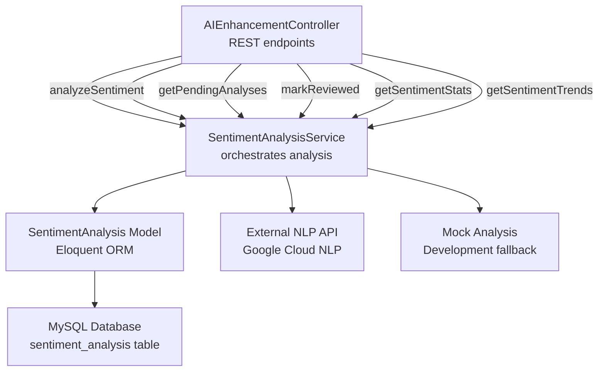
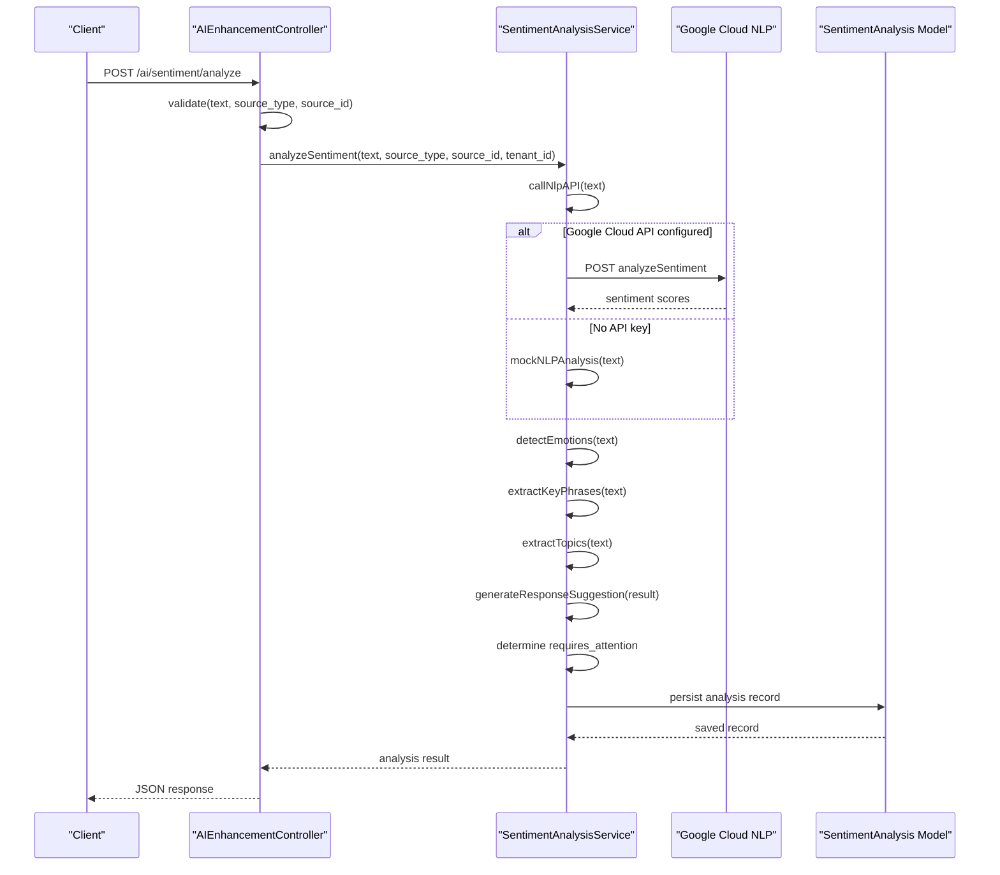
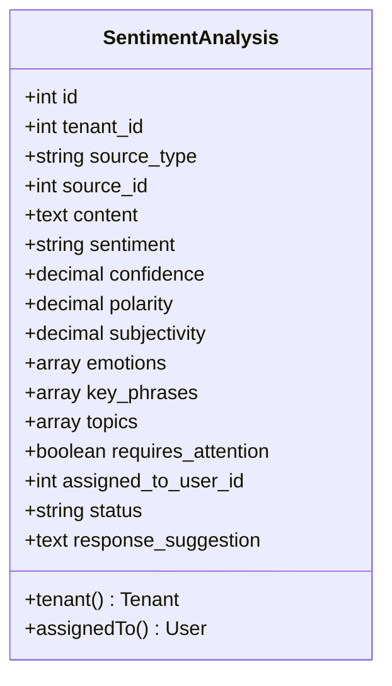
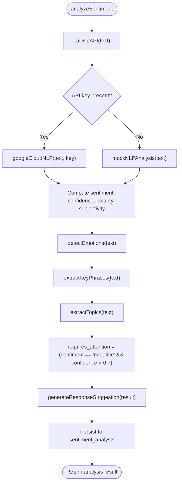
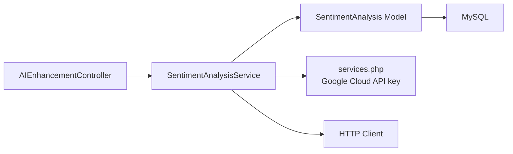

# Sentiment Analysis Service

<cite>
**Referenced Files in This Document**
- [SentimentAnalysis.php](file://app/Models/SentimentAnalysis.php)
- [SentimentAnalysisService.php](file://app/Services/AI/SentimentAnalysisService.php)
- [AIEnhancementController.php](file://app/Http/Controllers/AI/AIEnhancementController.php)
- [2026_04_06_100000_create_ai_enhancement_tables.php](file://database/migrations/2026_04_06_100000_create_ai_enhancement_tables.php)
- [services.php](file://config/services.php)
</cite>

## Table of Contents
1. [Introduction](#introduction)
2. [Project Structure](#project-structure)
3. [Core Components](#core-components)
4. [Architecture Overview](#architecture-overview)
5. [Detailed Component Analysis](#detailed-component-analysis)
6. [Dependency Analysis](#dependency-analysis)
7. [Performance Considerations](#performance-considerations)
8. [Troubleshooting Guide](#troubleshooting-guide)
9. [Conclusion](#conclusion)

## Introduction
This document describes the Sentiment Analysis Service within Qalcuity ERP. It explains how the system performs natural language processing to analyze customer feedback, review sentiment, and communication tone. It covers integration with external NLP APIs (Google Cloud Natural Language), internal mock analysis for development, real-time analysis workflows, supported analysis scopes, sentiment scoring, and trend reporting. It also documents configuration options, thresholds, categories, response suggestions, data storage, historical trend analysis, and CRM integration points.

## Project Structure
The Sentiment Analysis Service is composed of:
- A model representing sentiment analysis records
- A service that orchestrates NLP API calls, scoring, and persistence
- A controller that exposes REST endpoints for sentiment analysis operations
- A database migration that defines the sentiment_analysis table schema
- Configuration for external NLP service credentials

**Diagram sources**
- [AIEnhancementController.php:269-322](file://app/Http/Controllers/AI/AIEnhancementController.php#L269-L322)
- [SentimentAnalysisService.php:14-61](file://app/Services/AI/SentimentAnalysisService.php#L14-L61)
- [SentimentAnalysis.php:10-50](file://app/Models/SentimentAnalysis.php#L10-L50)
- [2026_04_06_100000_create_ai_enhancement_tables.php:119-143](file://database/migrations/2026_04_06_100000_create_ai_enhancement_tables.php#L119-L143)

**Section sources**
- [AIEnhancementController.php:269-322](file://app/Http/Controllers/AI/AIEnhancementController.php#L269-L322)
- [SentimentAnalysisService.php:14-61](file://app/Services/AI/SentimentAnalysisService.php#L14-L61)
- [SentimentAnalysis.php:10-50](file://app/Models/SentimentAnalysis.php#L10-L50)
- [2026_04_06_100000_create_ai_enhancement_tables.php:119-143](file://database/migrations/2026_04_06_100000_create_ai_enhancement_tables.php#L119-L143)

## Core Components
- SentimentAnalysis model: Defines fillable attributes, casts, and relationships to tenant and user.
- SentimentAnalysisService: Implements sentiment analysis pipeline, NLP API integration, scoring, and persistence.
- AIEnhancementController: Exposes REST endpoints for analysis, pending items, stats, and trends.
- Database migration: Creates the sentiment_analysis table with appropriate indexes and JSON fields.

Key capabilities:
- Real-time sentiment scoring with polarity, subjectivity, confidence
- Emotion detection, key phrase extraction, and topic classification placeholders
- Requires attention flagging for negative sentiments above a threshold
- Automated response suggestions
- Historical trend analysis and statistics aggregation

**Section sources**
- [SentimentAnalysis.php:14-49](file://app/Models/SentimentAnalysis.php#L14-L49)
- [SentimentAnalysisService.php:14-61](file://app/Services/AI/SentimentAnalysisService.php#L14-L61)
- [AIEnhancementController.php:269-322](file://app/Http/Controllers/AI/AIEnhancementController.php#L269-L322)
- [2026_04_06_100000_create_ai_enhancement_tables.php:119-143](file://database/migrations/2026_04_06_100000_create_ai_enhancement_tables.php#L119-L143)

## Architecture Overview
The service follows a layered architecture:
- Presentation: Controller validates requests and delegates to the service
- Application: Service orchestrates NLP API calls, scoring, and persistence
- Persistence: Model maps to sentiment_analysis table with tenant scoping and indexing

**Diagram sources**
- [AIEnhancementController.php:269-285](file://app/Http/Controllers/AI/AIEnhancementController.php#L269-L285)
- [SentimentAnalysisService.php:66-110](file://app/Services/AI/SentimentAnalysisService.php#L66-L110)
- [SentimentAnalysisService.php:115-158](file://app/Services/AI/SentimentAnalysisService.php#L115-L158)
- [SentimentAnalysisService.php:163-187](file://app/Services/AI/SentimentAnalysisService.php#L163-L187)
- [SentimentAnalysisService.php:192-219](file://app/Services/AI/SentimentAnalysisService.php#L192-L219)
- [SentimentAnalysisService.php:224-233](file://app/Services/AI/SentimentAnalysisService.php#L224-L233)
- [SentimentAnalysis.php:27-41](file://app/Models/SentimentAnalysis.php#L27-L41)

## Detailed Component Analysis

### Model: SentimentAnalysis
Responsibilities:
- Define fillable fields for tenant-scoped sentiment records
- Cast numeric fields (confidence, polarity, subjectivity) and arrays (emotions, key_phrases, topics)
- Provide relationships to Tenant and User for assignment tracking

**Diagram sources**
- [SentimentAnalysis.php:14-49](file://app/Models/SentimentAnalysis.php#L14-L49)

**Section sources**
- [SentimentAnalysis.php:14-49](file://app/Models/SentimentAnalysis.php#L14-L49)
- [2026_04_06_100000_create_ai_enhancement_tables.php:119-143](file://database/migrations/2026_04_06_100000_create_ai_enhancement_tables.php#L119-L143)

### Service: SentimentAnalysisService
Responsibilities:
- Accept raw text and metadata, call NLP API or mock analyzer
- Compute requires_attention flag based on sentiment and confidence
- Generate suggested response text
- Persist analysis and return structured results
- Provide queries for pending items, stats, and trends

Processing logic highlights:
- NLP API selection: attempts Google Cloud Natural Language if configured; otherwise uses mock analyzer
- Scoring: derives sentiment category, confidence, polarity, subjectivity
- Emotions, key phrases, topics: detected via simple keyword-based logic (placeholders for advanced NLP)
- Thresholds: negative sentiment flagged when sentiment equals "negative" AND confidence exceeds 0.7
- Response suggestions: localized suggestions generated based on sentiment category

**Diagram sources**
- [SentimentAnalysisService.php:14-61](file://app/Services/AI/SentimentAnalysisService.php#L14-L61)
- [SentimentAnalysisService.php:66-110](file://app/Services/AI/SentimentAnalysisService.php#L66-L110)
- [SentimentAnalysisService.php:115-158](file://app/Services/AI/SentimentAnalysisService.php#L115-L158)
- [SentimentAnalysisService.php:163-187](file://app/Services/AI/SentimentAnalysisService.php#L163-L187)
- [SentimentAnalysisService.php:192-219](file://app/Services/AI/SentimentAnalysisService.php#L192-L219)
- [SentimentAnalysisService.php:224-233](file://app/Services/AI/SentimentAnalysisService.php#L224-L233)
- [SentimentAnalysis.php:27-41](file://app/Models/SentimentAnalysis.php#L27-L41)

**Section sources**
- [SentimentAnalysisService.php:14-61](file://app/Services/AI/SentimentAnalysisService.php#L14-L61)
- [SentimentAnalysisService.php:66-110](file://app/Services/AI/SentimentAnalysisService.php#L66-L110)
- [SentimentAnalysisService.php:115-158](file://app/Services/AI/SentimentAnalysisService.php#L115-L158)
- [SentimentAnalysisService.php:163-187](file://app/Services/AI/SentimentAnalysisService.php#L163-L187)
- [SentimentAnalysisService.php:192-219](file://app/Services/AI/SentimentAnalysisService.php#L192-L219)
- [SentimentAnalysisService.php:224-233](file://app/Services/AI/SentimentAnalysisService.php#L224-L233)

### Controller: AIEnhancementController
Endpoints:
- POST /ai/sentiment/analyze: Analyze sentiment from text input
- GET /ai/sentiment/pending: Retrieve pending analyses requiring attention
- PATCH /ai/sentiment/:id/reviewed: Mark analysis as reviewed and assign to user
- GET /ai/sentiment/stats: Get sentiment statistics for a date range
- GET /ai/sentiment/trends: Get sentiment trends over configurable periods

Validation and pagination:
- Validates input fields and restricts source_type to predefined values
- Limits pending analyses retrieval

**Section sources**
- [AIEnhancementController.php:269-322](file://app/Http/Controllers/AI/AIEnhancementController.php#L269-L322)

### Database Migration: sentiment_analysis table
Schema:
- Primary key, tenant foreign key, source metadata (type, id)
- Content text, sentiment label, confidence, polarity, subjectivity
- JSON fields for emotions, key_phrases, topics
- Flags: requires_attention, status, response_suggestion
- Indexes on tenant_id with sentiment and requires_attention for performance

**Section sources**
- [2026_04_06_100000_create_ai_enhancement_tables.php:119-143](file://database/migrations/2026_04_06_100000_create_ai_enhancement_tables.php#L119-L143)

## Dependency Analysis
External integrations:
- Google Cloud Natural Language API: Used when a cloud API key is configured
- Localized development fallback: Keyword-based mock analyzer

Internal dependencies:
- Controller depends on SentimentAnalysisService
- Service persists via SentimentAnalysis model
- Model belongs to Tenant and optionally to User for assignment

**Diagram sources**
- [AIEnhancementController.php:269-322](file://app/Http/Controllers/AI/AIEnhancementController.php#L269-L322)
- [SentimentAnalysisService.php:66-110](file://app/Services/AI/SentimentAnalysisService.php#L66-L110)
- [services.php:63-67](file://config/services.php#L63-L67)
- [SentimentAnalysis.php:42-49](file://app/Models/SentimentAnalysis.php#L42-L49)

**Section sources**
- [services.php:63-67](file://config/services.php#L63-L67)
- [SentimentAnalysisService.php:66-110](file://app/Services/AI/SentimentAnalysisService.php#L66-L110)
- [AIEnhancementController.php:269-322](file://app/Http/Controllers/AI/AIEnhancementController.php#L269-L322)

## Performance Considerations
- Indexing: The migration creates indexes on tenant_id with sentiment and requires_attention, and on created_at to accelerate filtering and sorting for stats and trends.
- Threshold tuning: The requires_attention threshold (confidence > 0.7) can be adjusted in the service to balance sensitivity and false positives.
- API cost: Using Google Cloud NLP incurs costs; ensure proper credential management and consider rate limits.
- Data volume: For high-volume scenarios, consider batching analysis requests and offloading to queues.

[No sources needed since this section provides general guidance]

## Troubleshooting Guide
Common issues and resolutions:
- Missing Google Cloud API key: The service falls back to a mock analyzer. Verify the configuration key exists and is set properly to enable real NLP.
- Unexpected sentiment categories: Review the scoring thresholds and keyword lists used in the mock analyzer; adjust logic to improve accuracy.
- Empty or low-quality results: Confirm input text quality and length; ensure source_type is one of the accepted values.
- Missing assignments: The requires_attention flag does not auto-assign; use the markReviewed endpoint to assign and update status.

Operational checks:
- Validate controller request payloads and source_type values
- Inspect service logs for NLP API failures
- Confirm database connectivity and indexes for performance

**Section sources**
- [SentimentAnalysisService.php:53-60](file://app/Services/AI/SentimentAnalysisService.php#L53-L60)
- [AIEnhancementController.php:271-275](file://app/Http/Controllers/AI/AIEnhancementController.php#L271-L275)

## Conclusion
Qalcuity ERP’s Sentiment Analysis Service provides a robust foundation for real-time customer sentiment processing. It integrates with Google Cloud Natural Language when available and offers a development-friendly mock analyzer. The service captures sentiment, confidence, polarity, subjectivity, emotions, key phrases, and topics, persists them per tenant, and supports actionable insights via requires_attention flags, suggested responses, and trend analytics. With proper configuration and threshold tuning, it can power CRM-driven actions and continuous improvement workflows.