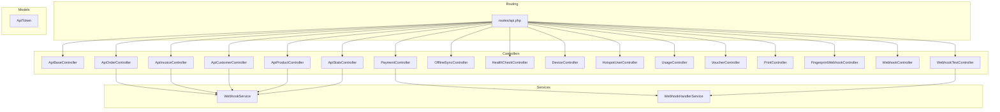
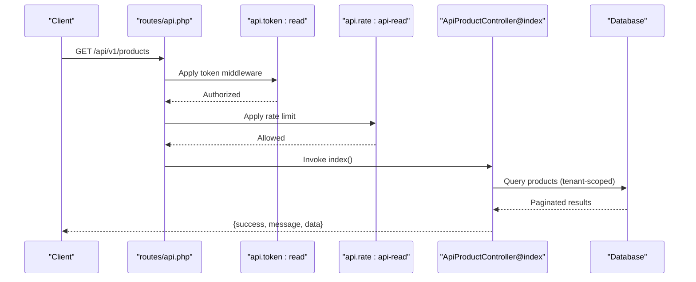
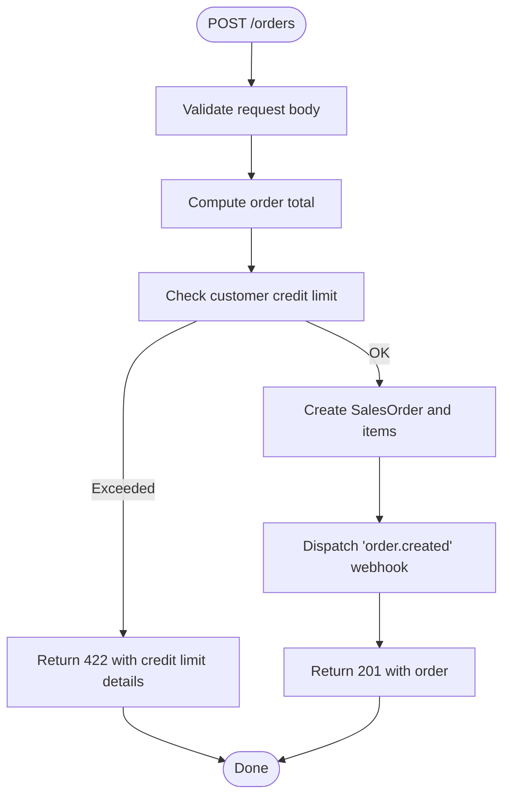
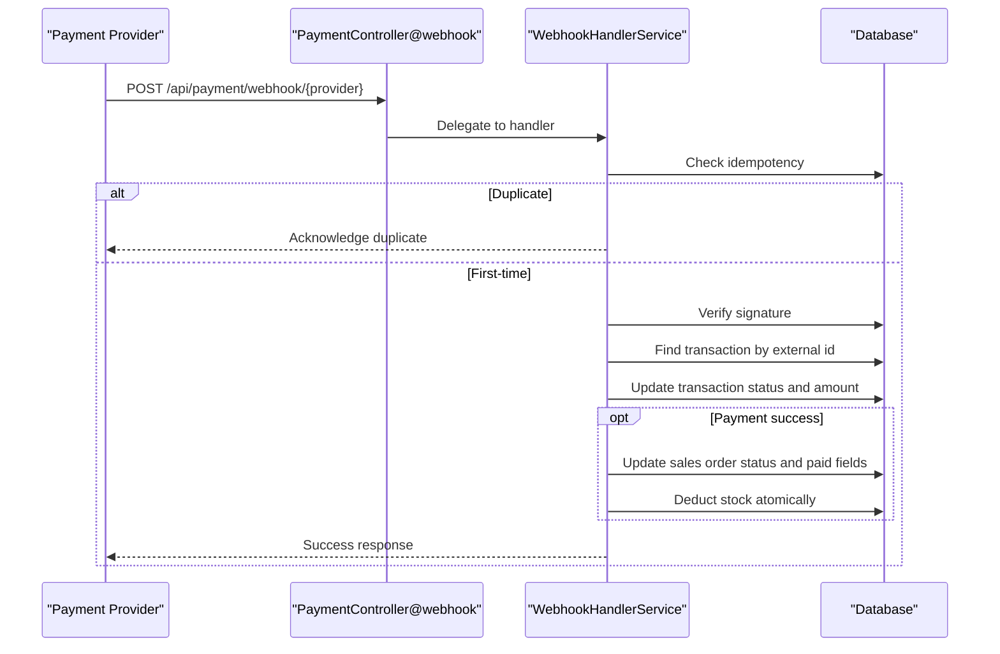
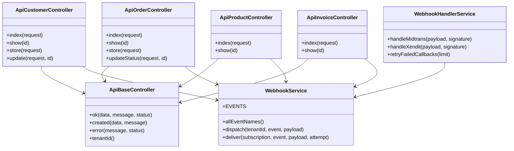

# API Documentation

<cite>
**Referenced Files in This Document**
- [routes/api.php](file://routes/api.php)
- [ApiBaseController.php](file://app/Http/Controllers/Api/ApiBaseController.php)
- [ApiCustomerController.php](file://app/Http/Controllers/Api/ApiCustomerController.php)
- [ApiProductController.php](file://app/Http/Controllers/Api/ApiProductController.php)
- [ApiOrderController.php](file://app/Http/Controllers/Api/ApiOrderController.php)
- [ApiInvoiceController.php](file://app/Http/Controllers/Api/ApiInvoiceController.php)
- [ApiStatsController.php](file://app/Http/Controllers/Api/ApiStatsController.php)
- [ApiToken.php](file://app/Models/ApiToken.php)
- [WebhookHandlerService.php](file://app/Services/WebhookHandlerService.php)
- [WebhookService.php](file://app/Services/WebhookService.php)
- [PaymentController.php](file://app/Http/Controllers/PaymentController.php)
- [OfflineSyncController.php](file://app/Http/Controllers/OfflineSyncController.php)
- [HealthCheckController.php](file://app/Http/Controllers/HealthCheckController.php)
- [FingerprintWebhookController.php](file://app/Http/Controllers/Api/FingerprintWebhookController.php)
- [WebhookController.php](file://app/Http/Controllers/Api/Telecom/WebhookController.php)
- [DeviceController.php](file://app/Http/Controllers/Api/Telecom/DeviceController.php)
- [HotspotUserController.php](file://app/Http/Controllers/Api/Telecom/HotspotUserController.php)
- [UsageController.php](file://app/Http/Controllers/Api/Telecom/UsageController.php)
- [VoucherController.php](file://app/Http/Controllers/Api/Telecom/VoucherController.php)
- [PrintController.php](file://app/Http/Controllers/Pos/PrintController.php)
- [WebhookTestController.php](file://app/Http/Controllers/Api/WebhookTestController.php)
</cite>

## Table of Contents
1. [Introduction](#introduction)
2. [Project Structure](#project-structure)
3. [Core Components](#core-components)
4. [Architecture Overview](#architecture-overview)
5. [Detailed Component Analysis](#detailed-component-analysis)
6. [Dependency Analysis](#dependency-analysis)
7. [Performance Considerations](#performance-considerations)
8. [Troubleshooting Guide](#troubleshooting-guide)
9. [Conclusion](#conclusion)
10. [Appendices](#appendices)

## Introduction
This document describes the RESTful API provided by Qalcuity ERP. It covers authentication, request/response schemas, error handling, rate limiting, pagination, filtering, and webhook integration. Major API groups include customer management, product catalog, sales orders, invoices, statistics, payments, offline sync, telecom module, and POS printing. The API follows a versioned base path and enforces tenant isolation via request-scoped tenant identifiers.

## Project Structure
The API surface is primarily defined in the routes file and implemented by controller classes under the Api namespace. Shared response helpers are centralized in a base controller. Tenant-scoped models and webhook services support cross-module integrations.

**Diagram sources**
- [routes/api.php:1-165](file://routes/api.php#L1-L165)
- [ApiBaseController.php:1-30](file://app/Http/Controllers/Api/ApiBaseController.php#L1-L30)
- [ApiCustomerController.php:1-57](file://app/Http/Controllers/Api/ApiCustomerController.php#L1-L57)
- [ApiProductController.php:1-30](file://app/Http/Controllers/Api/ApiProductController.php#L1-L30)
- [ApiOrderController.php:1-217](file://app/Http/Controllers/Api/ApiOrderController.php#L1-L217)
- [ApiInvoiceController.php:1-32](file://app/Http/Controllers/Api/ApiInvoiceController.php#L1-L32)
- [ApiStatsController.php](file://app/Http/Controllers/Api/ApiStatsController.php)
- [PaymentController.php](file://app/Http/Controllers/PaymentController.php)
- [OfflineSyncController.php](file://app/Http/Controllers/OfflineSyncController.php)
- [HealthCheckController.php](file://app/Http/Controllers/HealthCheckController.php)
- [DeviceController.php](file://app/Http/Controllers/Api/Telecom/DeviceController.php)
- [HotspotUserController.php](file://app/Http/Controllers/Api/Telecom/HotspotUserController.php)
- [UsageController.php](file://app/Http/Controllers/Api/Telecom/UsageController.php)
- [VoucherController.php](file://app/Http/Controllers/Api/Telecom/VoucherController.php)
- [PrintController.php](file://app/Http/Controllers/Pos/PrintController.php)
- [FingerprintWebhookController.php](file://app/Http/Controllers/Api/FingerprintWebhookController.php)
- [WebhookController.php](file://app/Http/Controllers/Api/Telecom/WebhookController.php)
- [WebhookTestController.php](file://app/Http/Controllers/Api/WebhookTestController.php)
- [WebhookService.php:1-189](file://app/Services/WebhookService.php#L1-L189)
- [WebhookHandlerService.php:1-442](file://app/Services/WebhookHandlerService.php#L1-L442)
- [ApiToken.php:1-67](file://app/Models/ApiToken.php#L1-L67)

**Section sources**
- [routes/api.php:1-165](file://routes/api.php#L1-L165)

## Core Components
- Authentication and Authorization
  - API tokens: Tenant-scoped tokens with abilities and expiration. Tokens are validated centrally and checked for ability scopes.
  - Sanctum-authenticated endpoints: Used for telecom, POS print, payment configuration, and offline sync.
  - Header scheme: Bearer token or X-API-Token header for token-based authentication.
- Response Standardization
  - All endpoints return a consistent envelope with success flag, message, and data payload.
  - Helpers provide standardized 200 OK, 201 Created, and error responses.
- Tenant Isolation
  - Controllers read the tenant identifier from the request context and scope queries accordingly.
- Rate Limiting
  - Middleware groups enforce per-plan limits for read/write operations and webhook inbound traffic.

**Section sources**
- [ApiBaseController.php:1-30](file://app/Http/Controllers/Api/ApiBaseController.php#L1-L30)
- [ApiToken.php:1-67](file://app/Models/ApiToken.php#L1-L67)
- [routes/api.php:20-50](file://routes/api.php#L20-L50)

## Architecture Overview
The API is organized into versioned routes with distinct middleware policies for read-only, write, and webhook endpoints. Controllers encapsulate business logic and coordinate with services for outbound webhooks and inbound payment callbacks. Tenant scoping ensures multi-tenancy isolation.

**Diagram sources**
- [routes/api.php:28-41](file://routes/api.php#L28-L41)
- [ApiProductController.php:1-30](file://app/Http/Controllers/Api/ApiProductController.php#L1-L30)

## Detailed Component Analysis

### Authentication and Authorization
- API Tokens
  - Token model stores tenant association, abilities, expiration, and activity timestamps.
  - Validation checks active state and expiration; ability checks support wildcard.
- Sanctum-Protected Endpoints
  - Telecom, POS print, payment configuration, and offline sync require Sanctum authentication.
- Request Headers
  - Accepts Bearer token or X-API-Token header for token-based requests.

**Section sources**
- [ApiToken.php:1-67](file://app/Models/ApiToken.php#L1-L67)
- [routes/api.php:64-104](file://routes/api.php#L64-L104)

### API Versioning and Base Path
- Base URL: /api/v1
- Versioning strategy: Single version path with clear separation for future evolution.

**Section sources**
- [routes/api.php:20-26](file://routes/api.php#L20-L26)

### Pagination and Filtering
- Pagination
  - Default page size is 50 items per page for list endpoints.
- Filtering
  - Customers: search by name substring.
  - Orders: filter by status, date range (from/to).
  - Invoices: filter by status and overdue flag.

**Section sources**
- [ApiCustomerController.php:10-17](file://app/Http/Controllers/Api/ApiCustomerController.php#L10-L17)
- [ApiOrderController.php:68-79](file://app/Http/Controllers/Api/ApiOrderController.php#L68-L79)
- [ApiInvoiceController.php:11-21](file://app/Http/Controllers/Api/ApiInvoiceController.php#L11-L21)

### Customer Management
- Endpoints
  - GET /api/v1/customers
  - GET /api/v1/customers/{id}
  - POST /api/v1/customers
  - PUT /api/v1/customers/{id}
- Request Schema (POST/PUT)
  - name: required, string
  - email: optional, email
  - phone: optional, string
  - address: optional, string
- Response Schema
  - Envelope with success, message, data containing customer object.
- Notes
  - Tenant-scoped queries and creation.

**Section sources**
- [routes/api.php:39-49](file://routes/api.php#L39-L49)
- [ApiCustomerController.php:1-57](file://app/Http/Controllers/Api/ApiCustomerController.php#L1-L57)

### Product Catalog
- Endpoints
  - GET /api/v1/products
  - GET /api/v1/products/{id}
- Response Schema
  - Envelope with success, message, data containing product with nested stocks and warehouse relations.

**Section sources**
- [routes/api.php:33-34](file://routes/api.php#L33-L34)
- [ApiProductController.php:1-30](file://app/Http/Controllers/Api/ApiProductController.php#L1-L30)

### Sales Orders
- Endpoints
  - GET /api/v1/orders
  - GET /api/v1/orders/{id}
  - POST /api/v1/orders
  - PATCH /api/v1/orders/{id}/status
- Request Schema (POST)
  - customer_id: optional integer
  - date: required date
  - notes: optional string
  - items: required array, min 1
    - product_id: required integer
    - quantity: required numeric >= 0.01
    - price: required numeric >= 0
- Status Transitions
  - Valid transitions enforced server-side; terminal states disallow further transitions.
  - Additional constraints prevent cancellation of orders with active invoices or already delivered orders.
- Credit Limit Validation
  - Before creation, order total is computed and customer’s available credit is checked; creation fails with structured error if exceeded.
- Response Schema
  - Envelope with success, message, data containing order; created returns 201.
- Webhooks
  - On creation: order.created
  - On status change: order.status_changed

**Diagram sources**
- [ApiOrderController.php:90-148](file://app/Http/Controllers/Api/ApiOrderController.php#L90-L148)

**Section sources**
- [routes/api.php:35-49](file://routes/api.php#L35-L49)
- [ApiOrderController.php:1-217](file://app/Http/Controllers/Api/ApiOrderController.php#L1-L217)

### Invoices
- Endpoints
  - GET /api/v1/invoices
  - GET /api/v1/invoices/{id}
- Filtering
  - status: exact match
  - overdue: boolean flag to select past-due unpaid/partial invoices
- Response Schema
  - Envelope with success, message, data containing invoice with customer and installments.

**Section sources**
- [routes/api.php:37-38](file://routes/api.php#L37-L38)
- [ApiInvoiceController.php:1-32](file://app/Http/Controllers/Api/ApiInvoiceController.php#L1-L32)

### Statistics
- Endpoint
  - GET /api/v1/stats
- Response Schema
  - Envelope with success, message, data containing summary metrics.

**Section sources**
- [routes/api.php](file://routes/api.php#L32)
- [ApiStatsController.php](file://app/Http/Controllers/Api/ApiStatsController.php)

### Payments
- Public Webhooks (no auth; verified by provider signatures)
  - POST /api/payment/webhook/{provider}
- Authenticated Endpoints (Sanctum)
  - POST /api/payment/qris/{order}
  - GET /api/payment/status
  - GET /api/payment/transaction/{transactionNumber}
  - GET /api/payment/history
  - GET /api/payment/gateways
  - POST /api/payment/gateways
  - POST /api/payment/gateways/test
  - POST /api/payment/gateways/{gateway}/toggle
  - DELETE /api/payment/gateways/{gateway}
  - POST /api/payment/webhook-test/midtrans
  - POST /api/payment/webhook-test/xendit
  - GET /api/payment/webhook-test/history
  - POST /api/payment/webhook-test/retry-failed
  - GET /api/payment/webhook-test/stats
- Webhook Processing
  - Idempotency checks, signature verification, payload extraction, transaction updates, and optional stock deduction on successful payment.
  - Supports retries for failed callbacks.

**Diagram sources**
- [routes/api.php:107-134](file://routes/api.php#L107-L134)
- [PaymentController.php](file://app/Http/Controllers/PaymentController.php)
- [WebhookHandlerService.php:1-442](file://app/Services/WebhookHandlerService.php#L1-L442)

**Section sources**
- [routes/api.php:107-134](file://routes/api.php#L107-L134)
- [WebhookHandlerService.php:1-442](file://app/Services/WebhookHandlerService.php#L1-L442)

### Offline Sync
- Endpoints (Sanctum + rate limit)
  - GET /api/offline/status
  - POST /api/offline/sync
  - DELETE /api/offline/failed
  - GET /api/offline/cache/{key}
  - POST /api/offline/cache/{key}
  - GET /api/offline/conflicts
  - POST /api/offline/conflicts/{id}/resolve
  - POST /api/offline/conflicts/auto-resolve
- CSRF Token Endpoint
  - GET /api/csrf-token

**Section sources**
- [routes/api.php:136-156](file://routes/api.php#L136-L156)
- [OfflineSyncController.php](file://app/Http/Controllers/OfflineSyncController.php)

### Telecom Module
- Endpoints (Sanctum + rate limit)
  - Devices: list/create/status
  - Hotspot Users: create/stats/suspend/reactivate
  - Usage: list/record
  - Vouchers: generate/redeem/stats
- Webhooks (no auth; verified by signature)
  - router-usage
  - device-alert

**Section sources**
- [routes/api.php:63-91](file://routes/api.php#L63-L91)
- [DeviceController.php](file://app/Http/Controllers/Api/Telecom/DeviceController.php)
- [HotspotUserController.php](file://app/Http/Controllers/Api/Telecom/HotspotUserController.php)
- [UsageController.php](file://app/Http/Controllers/Api/Telecom/UsageController.php)
- [VoucherController.php](file://app/Http/Controllers/Api/Telecom/VoucherController.php)
- [WebhookController.php](file://app/Http/Controllers/Api/Telecom/WebhookController.php)

### POS Printing
- Endpoints (Sanctum)
  - POST /api/pos/print/receipt/{order}
  - POST /api/pos/print/kitchen/{order}
  - POST /api/pos/print/barcode
  - POST /api/pos/print/test
  - GET /api/pos/print/queue
  - POST /api/pos/print/queue/{job}/retry
  - POST /api/pos/print/queue/{job}/cancel
  - GET /api/pos/print/settings
  - POST /api/pos/print/settings

**Section sources**
- [routes/api.php:93-104](file://routes/api.php#L93-L104)
- [PrintController.php](file://app/Http/Controllers/Pos/PrintController.php)

### Webhook Integration
- Outbound Webhooks
  - Events grouped by module (Sales, Invoice, Customer, Product, Inventory, Purchasing, Payment, HRM, Project, Telecom, System).
  - Dispatched asynchronously via queue jobs.
  - Delivery headers include event name, attempt, timestamp, nonce, and optional signature.
- Inbound Webhooks
  - Verified by provider signatures and idempotency checks.
  - Supported providers: Midtrans, Xendit.
  - Optional retry mechanism for failed callbacks.

**Section sources**
- [WebhookService.php:1-189](file://app/Services/WebhookService.php#L1-L189)
- [WebhookHandlerService.php:1-442](file://app/Services/WebhookHandlerService.php#L1-L442)
- [routes/api.php:52-61](file://routes/api.php#L52-L61)
- [routes/api.php:87-91](file://routes/api.php#L87-L91)
- [WebhookTestController.php](file://app/Http/Controllers/Api/WebhookTestController.php)

### Health Checks
- Endpoints (public)
  - GET /api/health/
  - GET /api/health/detailed
  - GET /api/health/ready
  - GET /api/health/live

**Section sources**
- [routes/api.php:158-164](file://routes/api.php#L158-L164)
- [HealthCheckController.php](file://app/Http/Controllers/HealthCheckController.php)

## Dependency Analysis
- Controllers depend on:
  - Tenant-scoped models and repositories via request context.
  - WebhookService for outbound events.
  - Database transactions for write operations.
- Services:
  - WebhookService orchestrates event dispatch and delivery.
  - WebhookHandlerService processes inbound payment webhooks with idempotency and signature verification.
- Routes define middleware policies for rate limiting and authentication.

**Diagram sources**
- [ApiBaseController.php:1-30](file://app/Http/Controllers/Api/ApiBaseController.php#L1-L30)
- [ApiCustomerController.php:1-57](file://app/Http/Controllers/Api/ApiCustomerController.php#L1-L57)
- [ApiProductController.php:1-30](file://app/Http/Controllers/Api/ApiProductController.php#L1-L30)
- [ApiOrderController.php:1-217](file://app/Http/Controllers/Api/ApiOrderController.php#L1-L217)
- [ApiInvoiceController.php:1-32](file://app/Http/Controllers/Api/ApiInvoiceController.php#L1-L32)
- [WebhookService.php:1-189](file://app/Services/WebhookService.php#L1-L189)
- [WebhookHandlerService.php:1-442](file://app/Services/WebhookHandlerService.php#L1-L442)

**Section sources**
- [ApiBaseController.php:1-30](file://app/Http/Controllers/Api/ApiBaseController.php#L1-L30)
- [ApiOrderController.php:1-217](file://app/Http/Controllers/Api/ApiOrderController.php#L1-L217)
- [ApiInvoiceController.php:1-32](file://app/Http/Controllers/Api/ApiInvoiceController.php#L1-L32)
- [WebhookService.php:1-189](file://app/Services/WebhookService.php#L1-L189)
- [WebhookHandlerService.php:1-442](file://app/Services/WebhookHandlerService.php#L1-L442)

## Performance Considerations
- Pagination defaults to 50 items per page; clients should page through large lists.
- Filtering reduces dataset size server-side for orders and invoices.
- Webhook delivery uses asynchronous job dispatch; outbound deliveries include timeouts for reliability.
- Idempotency and signature verification prevent redundant processing and tampering.

[No sources needed since this section provides general guidance]

## Troubleshooting Guide
- Authentication Failures
  - Ensure Bearer token or X-API-Token header is present and valid.
  - Confirm token abilities and expiration.
- Rate Limiting
  - Read endpoints: 60 req/min base (scaled by plan).
  - Write endpoints: 20 req/min base (scaled by plan).
  - Webhook inbound: dedicated rate limit group.
- Webhook Issues
  - Verify provider signatures and secrets.
  - Use webhook test endpoints to simulate provider callbacks and inspect stats/history.
  - Retry failed callbacks via the test endpoint.
- Offline Sync
  - Use conflict resolution endpoints to manage synchronization conflicts.
  - Obtain a fresh CSRF token when needed for offline flows.

**Section sources**
- [routes/api.php:30-61](file://routes/api.php#L30-L61)
- [ApiToken.php:1-67](file://app/Models/ApiToken.php#L1-L67)
- [WebhookTestController.php](file://app/Http/Controllers/Api/WebhookTestController.php)
- [OfflineSyncController.php](file://app/Http/Controllers/OfflineSyncController.php)

## Conclusion
Qalcuity ERP’s API provides a robust, tenant-scoped, and webhook-enabled interface for managing customers, products, sales orders, invoices, payments, telecom services, and POS printing. It enforces strong authentication and rate limiting, offers standardized responses, and supports reliable integrations through outbound and inbound webhook mechanisms.

[No sources needed since this section summarizes without analyzing specific files]

## Appendices

### API Groups and Endpoints Summary
- Customer Management
  - GET /api/v1/customers
  - GET /api/v1/customers/{id}
  - POST /api/v1/customers
  - PUT /api/v1/customers/{id}
- Product Catalog
  - GET /api/v1/products
  - GET /api/v1/products/{id}
- Sales Orders
  - GET /api/v1/orders
  - GET /api/v1/orders/{id}
  - POST /api/v1/orders
  - PATCH /api/v1/orders/{id}/status
- Invoices
  - GET /api/v1/invoices
  - GET /api/v1/invoices/{id}
- Statistics
  - GET /api/v1/stats
- Payments
  - POST /api/payment/webhook/{provider}
  - POST /api/payment/qris/{order}
  - GET /api/payment/status
  - GET /api/payment/transaction/{transactionNumber}
  - GET /api/payment/history
  - GET /api/payment/gateways
  - POST /api/payment/gateways
  - POST /api/payment/gateways/test
  - POST /api/payment/gateways/{gateway}/toggle
  - DELETE /api/payment/gateways/{gateway}
  - POST /api/payment/webhook-test/midtrans
  - POST /api/payment/webhook-test/xendit
  - GET /api/payment/webhook-test/history
  - POST /api/payment/webhook-test/retry-failed
  - GET /api/payment/webhook-test/stats
- Offline Sync
  - GET /api/offline/status
  - POST /api/offline/sync
  - DELETE /api/offline/failed
  - GET /api/offline/cache/{key}
  - POST /api/offline/cache/{key}
  - GET /api/offline/conflicts
  - POST /api/offline/conflicts/{id}/resolve
  - POST /api/offline/conflicts/auto-resolve
  - GET /api/csrf-token
- Telecom
  - GET /api/telecom/devices
  - POST /api/telecom/devices
  - GET /api/telecom/devices/{device}/status
  - POST /api/telecom/hotspot/users
  - GET /api/telecom/hotspot/users/{user}/stats
  - POST /api/telecom/hotspot/users/{user}/suspend
  - POST /api/telecom/hotspot/users/{user}/reactivate
  - GET /api/telecom/usage/{customerId}
  - POST /api/telecom/usage/record
  - POST /api/telecom/vouchers/generate
  - POST /api/telecom/vouchers/redeem
  - GET /api/telecom/vouchers/stats
  - POST /api/telecom/webhook/router-usage
  - POST /api/telecom/webhook/device-alert
- POS Printing
  - POST /api/pos/print/receipt/{order}
  - POST /api/pos/print/kitchen/{order}
  - POST /api/pos/print/barcode
  - POST /api/pos/print/test
  - GET /api/pos/print/queue
  - POST /api/pos/print/queue/{job}/retry
  - POST /api/pos/print/queue/{job}/cancel
  - GET /api/pos/print/settings
  - POST /api/pos/print/settings
- Webhooks (Marketplace)
  - POST /api/webhooks/shopee
  - POST /api/webhooks/tokopedia
  - POST /api/webhooks/lazada
  - POST /api/webhooks/fingerprint/attendance
  - POST /api/webhooks/fingerprint/heartbeat
  - GET /api/webhooks/fingerprint/pending-registrations

**Section sources**
- [routes/api.php:1-165](file://routes/api.php#L1-L165)