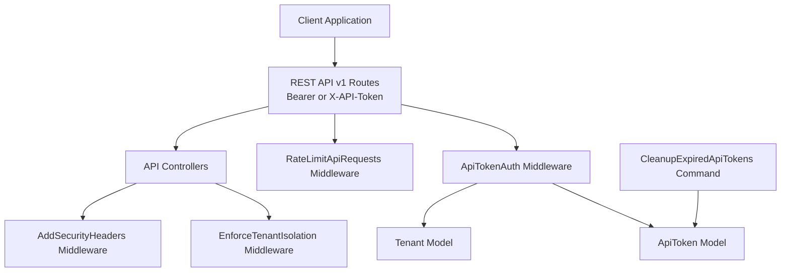
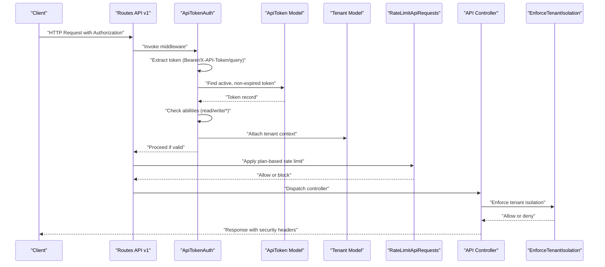
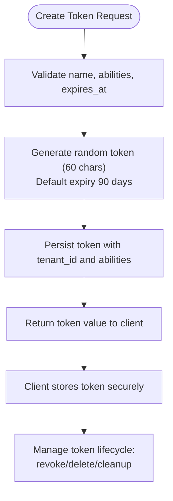
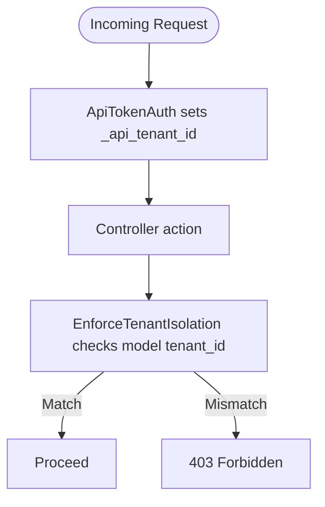
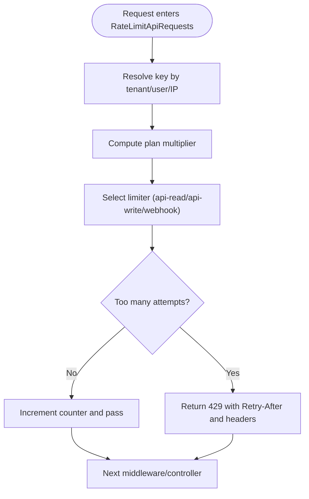
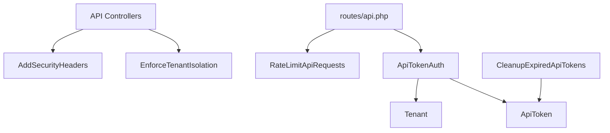

# Authentication API

<cite>
**Referenced Files in This Document**
- [routes/api.php](file://routes/api.php)
- [app/Http/Middleware/ApiTokenAuth.php](file://app/Http/Middleware/ApiTokenAuth.php)
- [app/Http/Middleware/RateLimitApiRequests.php](file://app/Http/Middleware/RateLimitApiRequests.php)
- [app/Http/Middleware/AddSecurityHeaders.php](file://app/Http/Middleware/AddSecurityHeaders.php)
- [app/Http/Middleware/EnforceTenantIsolation.php](file://app/Http/Middleware/EnforceTenantIsolation.php)
- [app/Models/ApiToken.php](file://app/Models/ApiToken.php)
- [app/Models/Tenant.php](file://app/Models/Tenant.php)
- [app/Console/Commands/CleanupExpiredApiTokens.php](file://app/Console/Commands/CleanupExpiredApiTokens.php)
- [app/Http/Controllers/Auth/AuthenticatedSessionController.php](file://app/Http/Controllers/Auth/AuthenticatedSessionController.php)
- [app/Http/Controllers/ApiSettingsController.php](file://app/Http/Controllers/ApiSettingsController.php)
- [app/Http/Controllers/Api/ApiStatsController.php](file://app/Http/Controllers/Api/ApiStatsController.php)
- [app/Http/Controllers/Api/ApiProductController.php](file://app/Http/Controllers/Api/ApiProductController.php)
- [app/Http/Controllers/Api/ApiOrderController.php](file://app/Http/Controllers/Api/ApiOrderController.php)
- [app/Http/Controllers/Api/ApiInvoiceController.php](file://app/Http/Controllers/Api/ApiInvoiceController.php)
</cite>

## Table of Contents
1. [Introduction](#introduction)
2. [Project Structure](#project-structure)
3. [Core Components](#core-components)
4. [Architecture Overview](#architecture-overview)
5. [Detailed Component Analysis](#detailed-component-analysis)
6. [Dependency Analysis](#dependency-analysis)
7. [Performance Considerations](#performance-considerations)
8. [Troubleshooting Guide](#troubleshooting-guide)
9. [Conclusion](#conclusion)

## Introduction
This document provides comprehensive API documentation for Qalcuity ERP’s authentication system focused on:
- Bearer token authentication and API token usage
- API token creation, management, and lifecycle
- Tenant isolation and multi-tenant scoping
- Authentication middleware, token validation, and rate limiting per token
- Security headers applied to API responses
- Examples for obtaining tokens, refreshing tokens, and handling authentication failures
- Differences between read-only and write-enabled API tokens
- Tenant scoping behavior in multi-tenant environments

## Project Structure
The authentication and API token system spans routing, middleware, models, controllers, and scheduled maintenance commands. The API surface is defined under the REST API v1 routes with explicit middleware for token-based authentication and rate limiting.

**Diagram sources**
- [routes/api.php:28-50](file://routes/api.php#L28-L50)
- [app/Http/Middleware/ApiTokenAuth.php:10-71](file://app/Http/Middleware/ApiTokenAuth.php#L10-L71)
- [app/Http/Middleware/RateLimitApiRequests.php:22-161](file://app/Http/Middleware/RateLimitApiRequests.php#L22-L161)
- [app/Http/Middleware/EnforceTenantIsolation.php:19-226](file://app/Http/Middleware/EnforceTenantIsolation.php#L19-L226)
- [app/Http/Middleware/AddSecurityHeaders.php:14-79](file://app/Http/Middleware/AddSecurityHeaders.php#L14-L79)
- [app/Models/ApiToken.php:11-67](file://app/Models/ApiToken.php#L11-L67)
- [app/Models/Tenant.php:10-223](file://app/Models/Tenant.php#L10-L223)
- [app/Console/Commands/CleanupExpiredApiTokens.php:9-123](file://app/Console/Commands/CleanupExpiredApiTokens.php#L9-L123)

**Section sources**
- [routes/api.php:20-50](file://routes/api.php#L20-L50)

## Core Components
- Authentication via bearer token or X-API-Token header
- Token validation checks active status, expiration, and ability permissions
- Tenant-scoped token usage and enforcement
- Plan-based rate limiting keyed by tenant
- Security headers for XSS and clickjacking protection
- Token lifecycle management (creation, revocation, deletion, cleanup)

**Section sources**
- [app/Http/Middleware/ApiTokenAuth.php:10-71](file://app/Http/Middleware/ApiTokenAuth.php#L10-L71)
- [app/Models/ApiToken.php:11-67](file://app/Models/ApiToken.php#L11-L67)
- [app/Http/Middleware/RateLimitApiRequests.php:22-161](file://app/Http/Middleware/RateLimitApiRequests.php#L22-L161)
- [app/Http/Middleware/AddSecurityHeaders.php:14-79](file://app/Http/Middleware/AddSecurityHeaders.php#L14-L79)
- [app/Console/Commands/CleanupExpiredApiTokens.php:9-123](file://app/Console/Commands/CleanupExpiredApiTokens.php#L9-L123)

## Architecture Overview
The authentication flow integrates token extraction, validation, permission checks, tenant scoping, and rate limiting. Controllers enforce tenant isolation and apply security headers.

**Diagram sources**
- [routes/api.php:28-50](file://routes/api.php#L28-L50)
- [app/Http/Middleware/ApiTokenAuth.php:10-71](file://app/Http/Middleware/ApiTokenAuth.php#L10-L71)
- [app/Http/Middleware/RateLimitApiRequests.php:22-161](file://app/Http/Middleware/RateLimitApiRequests.php#L22-L161)
- [app/Http/Middleware/EnforceTenantIsolation.php:19-226](file://app/Http/Middleware/EnforceTenantIsolation.php#L19-L226)
- [app/Http/Middleware/AddSecurityHeaders.php:14-79](file://app/Http/Middleware/AddSecurityHeaders.php#L14-L79)

## Detailed Component Analysis

### Authentication Endpoints and Token Usage
- Base URL: /api/v1
- Supported authentication methods:
  - Bearer token in Authorization header
  - X-API-Token header
  - api_token query parameter
- Token abilities:
  - read: access read-only endpoints
  - write: access write endpoints
  - *: wildcard for all abilities

Endpoints grouped by permission:
- Read-only endpoints (rate-limited per tenant, scaled by plan):
  - GET /api/v1/products
  - GET /api/v1/products/{id}
  - GET /api/v1/orders
  - GET /api/v1/orders/{id}
  - GET /api/v1/invoices
  - GET /api/v1/invoices/{id}
  - GET /api/v1/customers
  - GET /api/v1/customers/{id}
  - GET /api/v1/stats
- Write endpoints (rate-limited per tenant, scaled by plan):
  - POST /api/v1/orders
  - PATCH /api/v1/orders/{id}/status
  - POST /api/v1/customers
  - PUT /api/v1/customers/{id}

Examples:
- Obtain a token:
  - Use the API token creation endpoint to generate a token scoped to your tenant with desired abilities and optional expiry.
- Refresh a token:
  - Tokens are long-lived by default but can be revoked or deleted and regenerated as needed.
- Handle authentication failures:
  - Missing token: 401 Unauthorized
  - Invalid/expired token: 401 Unauthorized with error code TOKEN_EXPIRED_OR_INVALID
  - Insufficient permissions: 403 Forbidden with error code INSUFFICIENT_PERMISSIONS

**Section sources**
- [routes/api.php:28-50](file://routes/api.php#L28-L50)
- [app/Http/Middleware/ApiTokenAuth.php:10-71](file://app/Http/Middleware/ApiTokenAuth.php#L10-L71)
- [app/Models/ApiToken.php:36-67](file://app/Models/ApiToken.php#L36-L67)

### API Token Creation and Management
- Creation:
  - Generates a random 60-character token
  - Default expiry: 90 days if not specified
  - Abilities default to read-only
- Management:
  - Revoke: set is_active=false
  - Delete: remove from database
  - Cleanup: scheduled command removes expired and inactive tokens older than cutoff threshold

**Diagram sources**
- [app/Models/ApiToken.php:36-51](file://app/Models/ApiToken.php#L36-L51)
- [app/Http/Controllers/ApiSettingsController.php:38-50](file://app/Http/Controllers/ApiSettingsController.php#L38-L50)
- [app/Console/Commands/CleanupExpiredApiTokens.php:30-121](file://app/Console/Commands/CleanupExpiredApiTokens.php#L30-L121)

**Section sources**
- [app/Models/ApiToken.php:36-51](file://app/Models/ApiToken.php#L36-L51)
- [app/Http/Controllers/ApiSettingsController.php:38-64](file://app/Http/Controllers/ApiSettingsController.php#L38-L64)
- [app/Console/Commands/CleanupExpiredApiTokens.php:30-121](file://app/Console/Commands/CleanupExpiredApiTokens.php#L30-L121)

### Tenant Isolation Mechanisms
- Token-based tenant scoping:
  - ApiTokenAuth attaches tenant context to the request after successful validation
- Controller-level enforcement:
  - EnforceTenantIsolation validates route model bindings and blocks access if tenant_id mismatches
- Super admin bypass with audit logging for compliance

**Diagram sources**
- [app/Http/Middleware/ApiTokenAuth.php:61-67](file://app/Http/Middleware/ApiTokenAuth.php#L61-L67)
- [app/Http/Middleware/EnforceTenantIsolation.php:143-156](file://app/Http/Middleware/EnforceTenantIsolation.php#L143-L156)

**Section sources**
- [app/Http/Middleware/ApiTokenAuth.php:61-67](file://app/Http/Middleware/ApiTokenAuth.php#L61-L67)
- [app/Http/Middleware/EnforceTenantIsolation.php:28-159](file://app/Http/Middleware/EnforceTenantIsolation.php#L28-L159)

### Rate Limiting Per Token and Plan Scaling
- Keys:
  - For API tokens: rl:{limiterName}:tenant:{tenant_id}
  - For authenticated users: rl:{limiterName}:user:{user_id}
  - For unauthenticated: rl:{limiterName}:ip:{ip}
- Limits:
  - api-read: 60 per minute × plan multiplier
  - api-write: 20 per minute × plan multiplier
  - webhook-inbound: 30 per minute
- Plan multipliers:
  - starter: 1.0
  - basic: 1.5
  - business: 2.0
  - professional: 3.0
  - pro: 3.0
  - enterprise: 10.0
  - default/trial: 0.5

**Diagram sources**
- [app/Http/Middleware/RateLimitApiRequests.php:24-161](file://app/Http/Middleware/RateLimitApiRequests.php#L24-L161)

**Section sources**
- [app/Http/Middleware/RateLimitApiRequests.php:24-161](file://app/Http/Middleware/RateLimitApiRequests.php#L24-L161)

### Security Headers
- Applied to API responses:
  - X-Frame-Options: SAMEORIGIN
  - X-Content-Type-Options: nosniff
  - X-XSS-Protection: 1; mode=block
  - Referrer-Policy: strict-origin-when-cross-origin
  - Content-Security-Policy: restrictive policy with development allowances
  - Permissions-Policy: restricts geolocation, microphone, camera, payment

**Section sources**
- [app/Http/Middleware/AddSecurityHeaders.php:14-79](file://app/Http/Middleware/AddSecurityHeaders.php#L14-L79)

### Example Workflows

#### Obtaining a Token
- Use the API token creation endpoint to generate a token for your tenant with desired abilities and optional expiry.
- The endpoint validates inputs and persists the token; the generated token value is returned for secure client-side storage.

**Section sources**
- [app/Http/Controllers/ApiSettingsController.php:38-50](file://app/Http/Controllers/ApiSettingsController.php#L38-L50)
- [app/Models/ApiToken.php:36-51](file://app/Models/ApiToken.php#L36-L51)

#### Refreshing a Token
- Tokens are long-lived by default. To refresh, revoke the current token and create a new one with updated abilities or expiry.

**Section sources**
- [app/Models/ApiToken.php:53-60](file://app/Models/ApiToken.php#L53-L60)
- [app/Http/Controllers/ApiSettingsController.php:52-64](file://app/Http/Controllers/ApiSettingsController.php#L52-L64)

#### Handling Authentication Failures
- Missing token: 401 Unauthorized
- Invalid/expired token: 401 Unauthorized with error code TOKEN_EXPIRED_OR_INVALID
- Insufficient permissions: 403 Forbidden with error code INSUFFICIENT_PERMISSIONS

**Section sources**
- [app/Http/Middleware/ApiTokenAuth.php:18-59](file://app/Http/Middleware/ApiTokenAuth.php#L18-L59)

### Difference Between Read-Only and Write-Enabled Tokens
- Read-only token:
  - Abilities include read
  - Grants access to read-only endpoints
- Write-enabled token:
  - Abilities include write
  - Grants access to write endpoints

**Section sources**
- [routes/api.php:30-49](file://routes/api.php#L30-L49)
- [app/Models/ApiToken.php:62-65](file://app/Models/ApiToken.php#L62-L65)

### Tenant Scoping in Multi-Tenant Environments
- Token validation attaches tenant context to the request
- Controllers enforce tenant isolation on model-bound parameters
- Super admin bypass is logged for compliance

**Section sources**
- [app/Http/Middleware/ApiTokenAuth.php:61-67](file://app/Http/Middleware/ApiTokenAuth.php#L61-L67)
- [app/Http/Middleware/EnforceTenantIsolation.php:28-159](file://app/Http/Middleware/EnforceTenantIsolation.php#L28-L159)

## Dependency Analysis

**Diagram sources**
- [routes/api.php:28-50](file://routes/api.php#L28-L50)
- [app/Http/Middleware/ApiTokenAuth.php:10-71](file://app/Http/Middleware/ApiTokenAuth.php#L10-L71)
- [app/Http/Middleware/RateLimitApiRequests.php:22-161](file://app/Http/Middleware/RateLimitApiRequests.php#L22-L161)
- [app/Http/Middleware/EnforceTenantIsolation.php:19-226](file://app/Http/Middleware/EnforceTenantIsolation.php#L19-L226)
- [app/Http/Middleware/AddSecurityHeaders.php:14-79](file://app/Http/Middleware/AddSecurityHeaders.php#L14-L79)
- [app/Models/ApiToken.php:11-67](file://app/Models/ApiToken.php#L11-L67)
- [app/Models/Tenant.php:10-223](file://app/Models/Tenant.php#L10-L223)
- [app/Console/Commands/CleanupExpiredApiTokens.php:9-123](file://app/Console/Commands/CleanupExpiredApiTokens.php#L9-L123)

**Section sources**
- [routes/api.php:28-50](file://routes/api.php#L28-L50)
- [app/Http/Middleware/ApiTokenAuth.php:10-71](file://app/Http/Middleware/ApiTokenAuth.php#L10-L71)
- [app/Http/Middleware/RateLimitApiRequests.php:22-161](file://app/Http/Middleware/RateLimitApiRequests.php#L22-L161)
- [app/Http/Middleware/EnforceTenantIsolation.php:19-226](file://app/Http/Middleware/EnforceTenantIsolation.php#L19-L226)
- [app/Http/Middleware/AddSecurityHeaders.php:14-79](file://app/Http/Middleware/AddSecurityHeaders.php#L14-L79)
- [app/Models/ApiToken.php:11-67](file://app/Models/ApiToken.php#L11-L67)
- [app/Models/Tenant.php:10-223](file://app/Models/Tenant.php#L10-L223)
- [app/Console/Commands/CleanupExpiredApiTokens.php:9-123](file://app/Console/Commands/CleanupExpiredApiTokens.php#L9-L123)

## Performance Considerations
- Token lookup is filtered by active status and non-expired conditions to avoid loading invalid tokens into memory.
- Rate limiting is tenant-aware and scales with plan multipliers to balance fairness and throughput.
- Controllers apply tenant isolation checks on model-bound parameters to prevent cross-tenant queries.

[No sources needed since this section provides general guidance]

## Troubleshooting Guide
- 401 Unauthorized:
  - Ensure Authorization header uses Bearer token or X-API-Token header is present.
  - Verify token is active and not expired.
- 403 Forbidden:
  - Confirm token has required ability (read/write/*).
- 429 Too Many Requests:
  - Respect Retry-After and reduce request frequency.
  - Upgrade plan to increase multipliers for higher limits.
- Token lifecycle:
  - Use revoke to disable a token without deleting it.
  - Use cleanup command to remove expired and inactive tokens.

**Section sources**
- [app/Http/Middleware/ApiTokenAuth.php:18-59](file://app/Http/Middleware/ApiTokenAuth.php#L18-L59)
- [app/Http/Middleware/RateLimitApiRequests.php:132-159](file://app/Http/Middleware/RateLimitApiRequests.php#L132-L159)
- [app/Console/Commands/CleanupExpiredApiTokens.php:30-121](file://app/Console/Commands/CleanupExpiredApiTokens.php#L30-L121)

## Conclusion
Qalcuity ERP’s authentication API provides robust, tenant-scoped token-based access with granular permission controls, plan-based rate limiting, and strong security headers. By leveraging read-only and write-enabled tokens, clients can safely integrate with the system while maintaining strict tenant isolation and operational security.