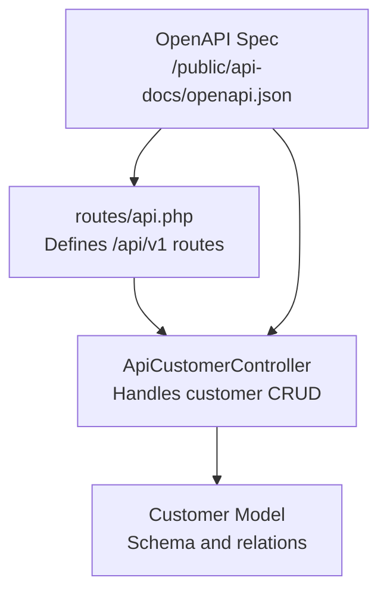
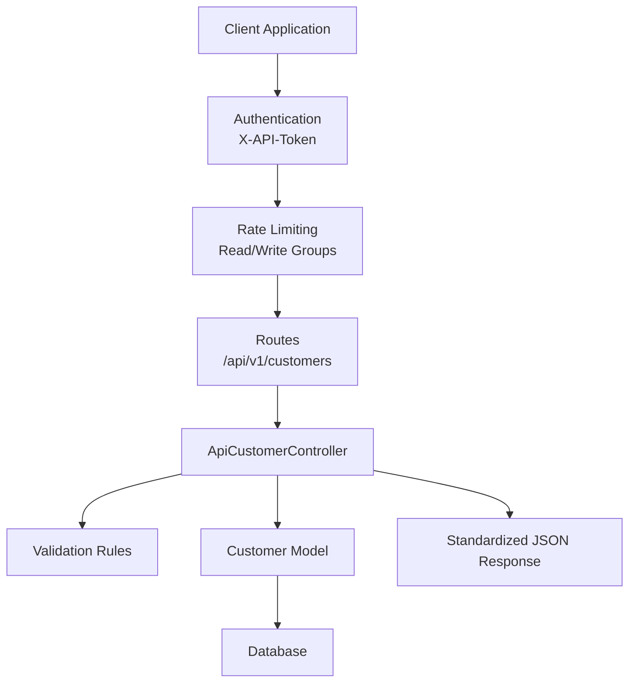
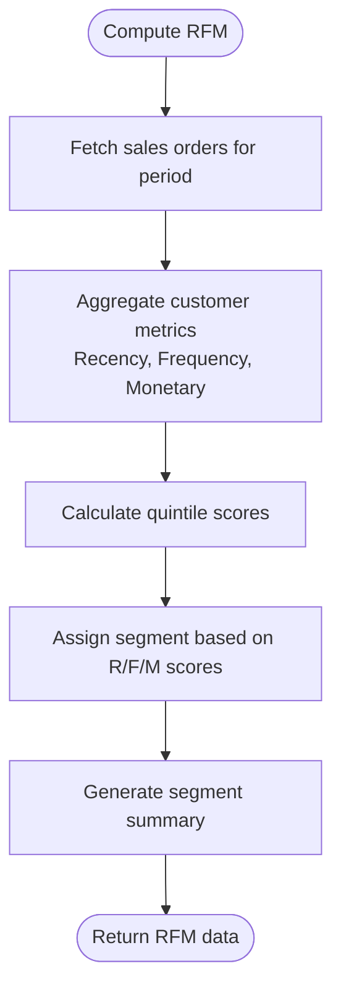
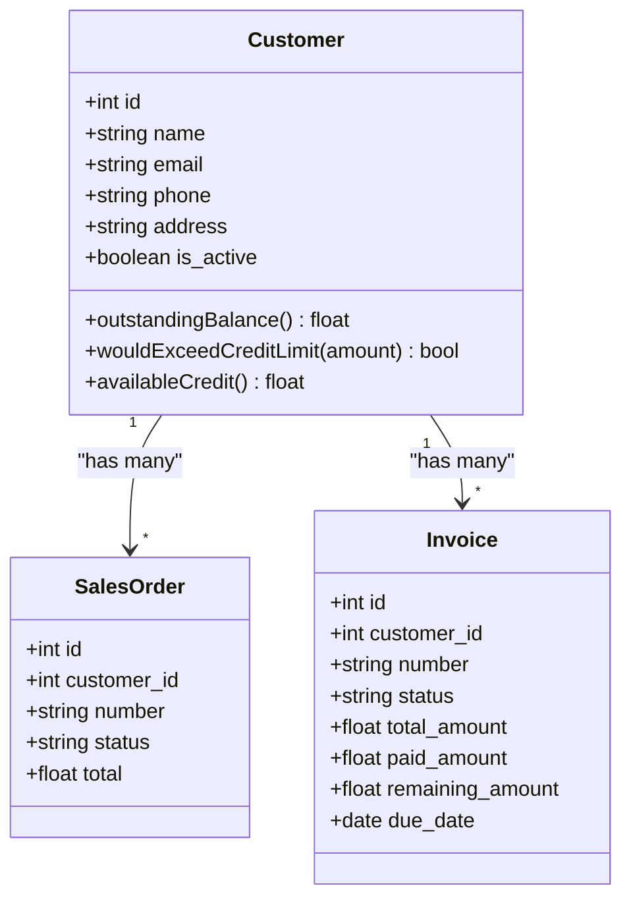
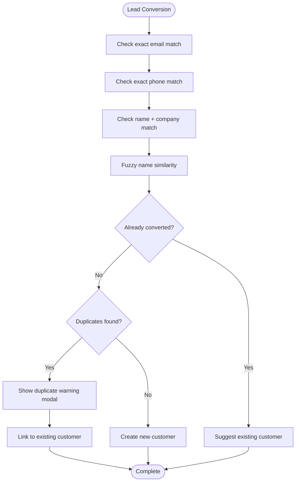
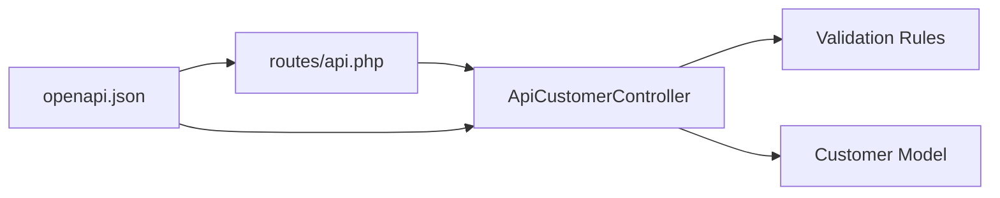

# Customer Management API

<cite>
**Referenced Files in This Document**
- [routes/api.php](file://routes/api.php)
- [app/Http/Controllers/Api/ApiCustomerController.php](file://app/Http/Controllers/Api/ApiCustomerController.php)
- [app/Models/Customer.php](file://app/Models/Customer.php)
- [public/api-docs/openapi.json](file://public/api-docs/openapi.json)
- [app/Services/ERP/SalesTools.php](file://app/Services/ERP/SalesTools.php)
- [app/Services/LeadConversionService.php](file://app/Services/LeadConversionService.php)
- [app/Services/AdvancedAnalyticsService.php](file://app/Services/AdvancedAnalyticsService.php)
- [resources/views/analytics/customer-segmentation.blade.php](file://resources/views/analytics/customer-segmentation.blade.php)
</cite>

## Table of Contents
1. [Introduction](#introduction)
2. [Project Structure](#project-structure)
3. [Core Components](#core-components)
4. [Architecture Overview](#architecture-overview)
5. [Detailed Component Analysis](#detailed-component-analysis)
6. [Dependency Analysis](#dependency-analysis)
7. [Performance Considerations](#performance-considerations)
8. [Troubleshooting Guide](#troubleshooting-guide)
9. [Conclusion](#conclusion)

## Introduction
This document provides comprehensive API documentation for customer management endpoints in the system. It covers CRUD operations for customers, including listing, creating, updating, and retrieving customer details. It also documents customer data validation, address management, contact information, customer segmentation, search and filtering capabilities, error handling for duplicate customers, and integration patterns with sales orders and invoicing.

## Project Structure
The customer management API is exposed under the `/api/v1` base path with dedicated endpoints for customers. The routing groups separate read-only and write operations with distinct rate limits. The API controller handles requests and responses, while the Customer model defines the data schema and relationships.

**Diagram sources**
- [routes/api.php:28-50](file://routes/api.php#L28-L50)
- [app/Http/Controllers/Api/ApiCustomerController.php:8-57](file://app/Http/Controllers/Api/ApiCustomerController.php#L8-L57)
- [app/Models/Customer.php:14-91](file://app/Models/Customer.php#L14-L91)
- [public/api-docs/openapi.json:12-32](file://public/api-docs/openapi.json#L12-L32)

**Section sources**
- [routes/api.php:28-50](file://routes/api.php#L28-L50)
- [public/api-docs/openapi.json:12-32](file://public/api-docs/openapi.json#L12-L32)

## Core Components
- API Routes: Define GET /customers, GET /customers/{id}, POST /customers, and PUT /customers/{id}.
- API Controller: Implements index, show, store, and update with tenant scoping and validation.
- Customer Model: Defines fillable attributes, casts, and relationships to sales orders, invoices, quotations, balances, and price lists.
- OpenAPI Specification: Documents request/response schemas, parameters, and security scheme.

**Section sources**
- [routes/api.php:39-49](file://routes/api.php#L39-L49)
- [app/Http/Controllers/Api/ApiCustomerController.php:10-55](file://app/Http/Controllers/Api/ApiCustomerController.php#L10-L55)
- [app/Models/Customer.php:19-67](file://app/Models/Customer.php#L19-L67)
- [public/api-docs/openapi.json:267-402](file://public/api-docs/openapi.json#L267-L402)

## Architecture Overview
The customer API follows a layered architecture:
- Routing layer: Declares endpoints and applies middleware for authentication and rate limiting.
- Controller layer: Validates input, scopes queries by tenant, and returns standardized responses.
- Model layer: Encapsulates data schema, casting, and related entities.
- Documentation layer: OpenAPI specification describes schemas and examples.

**Diagram sources**
- [routes/api.php:28-50](file://routes/api.php#L28-L50)
- [app/Http/Controllers/Api/ApiCustomerController.php:25-55](file://app/Http/Controllers/Api/ApiCustomerController.php#L25-L55)
- [public/api-docs/openapi.json:18-32](file://public/api-docs/openapi.json#L18-L32)

## Detailed Component Analysis

### API Endpoints

#### List Customers
- Method: GET
- Path: /api/v1/customers
- Query Parameters:
  - search: String to filter by name
- Response: Paginated collection of customers
- Security: X-API-Token required
- Notes: Pagination limit differs between API controller and OpenAPI spec; API controller paginates 50 per page.

**Section sources**
- [routes/api.php:39](file://routes/api.php#L39)
- [app/Http/Controllers/Api/ApiCustomerController.php:10-17](file://app/Http/Controllers/Api/ApiCustomerController.php#L10-L17)
- [public/api-docs/openapi.json:267-288](file://public/api-docs/openapi.json#L267-L288)

#### Get Customer Detail
- Method: GET
- Path: /api/v1/customers/{id}
- Path Parameter: id (integer)
- Response: Single customer object
- Security: X-API-Token required

**Section sources**
- [routes/api.php:40](file://routes/api.php#L40)
- [app/Http/Controllers/Api/ApiCustomerController.php:19-23](file://app/Http/Controllers/Api/ApiCustomerController.php#L19-L23)
- [public/api-docs/openapi.json:336-357](file://public/api-docs/openapi.json#L336-L357)

#### Create Customer
- Method: POST
- Path: /api/v1/customers
- Request Body: name (required), email (optional), phone (optional), address (optional)
- Response: Created customer object
- Security: X-API-Token required
- Validation Rules:
  - name: required, string, max 255
  - email: nullable, email, max 255
  - phone: nullable, string, max 50
  - address: nullable, string

**Section sources**
- [routes/api.php:47](file://routes/api.php#L47)
- [app/Http/Controllers/Api/ApiCustomerController.php:25-40](file://app/Http/Controllers/Api/ApiCustomerController.php#L25-L40)
- [public/api-docs/openapi.json:289-334](file://public/api-docs/openapi.json#L289-L334)

#### Update Customer
- Method: PUT
- Path: /api/v1/customers/{id}
- Path Parameter: id (integer)
- Request Body: name (optional), email (optional), phone (optional), address (optional)
- Response: Updated customer object
- Security: X-API-Token required
- Validation Rules:
  - name: sometimes, string, max 255
  - email: nullable, email, max 255
  - phone: nullable, string, max 50
  - address: nullable, string

**Section sources**
- [routes/api.php:48](file://routes/api.php#L48)
- [app/Http/Controllers/Api/ApiCustomerController.php:42-55](file://app/Http/Controllers/Api/ApiCustomerController.php#L42-L55)
- [public/api-docs/openapi.json:358-401](file://public/api-docs/openapi.json#L358-L401)

### Data Validation and Schema

#### Request Validation (Create)
- name: required, string, max 255
- email: nullable, email, max 255
- phone: nullable, string, max 50
- address: nullable, string

#### Request Validation (Update)
- name: sometimes, string, max 255
- email: nullable, email, max 255
- phone: nullable, string, max 50
- address: nullable, string

#### Response Schema (Customer)
- id: integer
- name: string
- email: string (nullable)
- phone: string (nullable)
- address: string (nullable)
- is_active: boolean

**Section sources**
- [app/Http/Controllers/Api/ApiCustomerController.php:27-51](file://app/Http/Controllers/Api/ApiCustomerController.php#L27-L51)
- [public/api-docs/openapi.json:63-87](file://public/api-docs/openapi.json#L63-L87)

### Address Management and Contact Information
- Address field is supported for storage and retrieval.
- Contact information includes email and phone fields.
- Additional fields in the model include company, npwp, and credit_limit.

**Section sources**
- [app/Models/Customer.php:19-34](file://app/Models/Customer.php#L19-L34)
- [app/Http/Controllers/Api/ApiCustomerController.php:27-51](file://app/Http/Controllers/Api/ApiCustomerController.php#L27-L51)

### Customer Search and Filtering
- Search endpoint supports a search parameter to filter by name.
- Additional filtering by status can be applied client-side after retrieval (e.g., active/inactive).

**Section sources**
- [app/Http/Controllers/Api/ApiCustomerController.php:12-14](file://app/Http/Controllers/Api/ApiCustomerController.php#L12-L14)
- [public/api-docs/openapi.json:273-282](file://public/api-docs/openapi.json#L273-L282)

### Customer Segmentation
- Segmentation is performed using RFM analysis based on purchase history.
- The service computes recency, frequency, and monetary metrics and assigns segments.

**Diagram sources**
- [app/Services/AdvancedAnalyticsService.php:74-129](file://app/Services/AdvancedAnalyticsService.php#L74-L129)
- [resources/views/analytics/customer-segmentation.blade.php:24-65](file://resources/views/analytics/customer-segmentation.blade.php#L24-L65)

**Section sources**
- [app/Services/AdvancedAnalyticsService.php:74-129](file://app/Services/AdvancedAnalyticsService.php#L74-L129)
- [resources/views/analytics/customer-segmentation.blade.php:24-65](file://resources/views/analytics/customer-segmentation.blade.php#L24-L65)

### Handling Customer Hierarchies
- The model defines relationships to quotations, sales orders, invoices, customer balance, and price lists.
- These relationships enable hierarchical data access and integration with sales and invoicing workflows.

**Section sources**
- [app/Models/Customer.php:40-67](file://app/Models/Customer.php#L40-L67)

### Integration Patterns with Sales Orders and Invoicing
- Customer is a parent entity for sales orders and invoices.
- Outstanding balance and credit limit checks are available on the customer model to prevent over-credit scenarios.

**Diagram sources**
- [app/Models/Customer.php:44-89](file://app/Models/Customer.php#L44-L89)

**Section sources**
- [app/Models/Customer.php:44-89](file://app/Models/Customer.php#L44-L89)

### Duplicate Customer Handling
- A service prevents duplicate customer creation during lead conversion by checking email, phone, name+company combinations, and fuzzy name similarity.
- The service returns suggestions to link to existing customers or force create a new one.

**Diagram sources**
- [app/Services/LeadConversionService.php:29-157](file://app/Services/LeadConversionService.php#L29-L157)

**Section sources**
- [app/Services/LeadConversionService.php:29-157](file://app/Services/LeadConversionService.php#L29-L157)

### Standardized Response Envelope
- All API responses follow a standard envelope with success, message, and data fields.

**Section sources**
- [public/api-docs/openapi.json:180-191](file://public/api-docs/openapi.json#L180-L191)

## Dependency Analysis
The customer API controller depends on the Customer model and Laravel’s request validation. The OpenAPI specification provides a contract for clients and ensures consistent documentation.

**Diagram sources**
- [routes/api.php:28-50](file://routes/api.php#L28-L50)
- [app/Http/Controllers/Api/ApiCustomerController.php:25-55](file://app/Http/Controllers/Api/ApiCustomerController.php#L25-L55)
- [app/Models/Customer.php:19-34](file://app/Models/Customer.php#L19-L34)
- [public/api-docs/openapi.json:18-32](file://public/api-docs/openapi.json#L18-L32)

**Section sources**
- [routes/api.php:28-50](file://routes/api.php#L28-L50)
- [app/Http/Controllers/Api/ApiCustomerController.php:25-55](file://app/Http/Controllers/Api/ApiCustomerController.php#L25-L55)
- [app/Models/Customer.php:19-34](file://app/Models/Customer.php#L19-L34)
- [public/api-docs/openapi.json:18-32](file://public/api-docs/openapi.json#L18-L32)

## Performance Considerations
- Pagination: The API controller paginates 50 items per page; consider tuning for large datasets.
- Tenant Scoping: Queries are scoped by tenant_id to ensure data isolation.
- Indexing: Ensure appropriate database indexes on tenant_id, name, email, and phone for efficient filtering and searching.

## Troubleshooting Guide
- Authentication: Ensure X-API-Token is provided in the header.
- Validation Errors: Verify request body conforms to validation rules (required fields, formats).
- Duplicate Creation: When programmatically creating customers, consider using the SalesTools service to avoid duplicates.
- Credit Limit Checks: Use customer.availableCredit() and customer.wouldExceedCreditLimit() to prevent over-credit scenarios.

**Section sources**
- [public/api-docs/openapi.json:18-32](file://public/api-docs/openapi.json#L18-L32)
- [app/Http/Controllers/Api/ApiCustomerController.php:27-51](file://app/Http/Controllers/Api/ApiCustomerController.php#L27-L51)
- [app/Services/ERP/SalesTools.php:504-530](file://app/Services/ERP/SalesTools.php#L504-L530)
- [app/Models/Customer.php:78-89](file://app/Models/Customer.php#L78-L89)

## Conclusion
The customer management API provides robust CRUD operations with tenant scoping, validation, and integration with sales and invoicing. The OpenAPI specification ensures consistent documentation, while services handle duplicate prevention and customer segmentation. Proper use of validation, pagination, and credit limit checks will help maintain data integrity and performance.