# Invoices & Payments API

<cite>
**Referenced Files in This Document**
- [ApiInvoiceController.php](file://app/Http/Controllers/Api/ApiInvoiceController.php)
- [InvoiceController.php](file://app/Http/Controllers/InvoiceController.php)
- [PaymentController.php](file://app/Http/Controllers/PaymentController.php)
- [BulkPaymentController.php](file://app/Http/Controllers/BulkPaymentController.php)
- [DownPaymentController.php](file://app/Http/Controllers/DownPaymentController.php)
- [PaymentGatewayController.php](file://app/Http/Controllers/PaymentGatewayController.php)
- [ReceivablesController.php](file://app/Http/Controllers/ReceivablesController.php)
- [Invoice.php](file://app/Models/Invoice.php)
- [Payment.php](file://app/Models/Payment.php)
- [InvoiceInstallment.php](file://app/Models/InvoiceInstallment.php)
- [ProjectInvoice.php](file://app/Models/ProjectInvoice.php)
- [SubscriptionInvoice.php](file://app/Models/SubscriptionInvoice.php)
- [DownPayment.php](file://app/Models/DownPayment.php)
- [DownPaymentApplication.php](file://app/Models/DownPaymentApplication.php)
- [PaymentGateway.php](file://app/Models/PaymentGateway.php)
- [TenantPaymentGateway.php](file://app/Models/TenantPaymentGateway.php)
- [InvoicePaymentService.php](file://app/Services/InvoicePaymentService.php)
- [GlPostingService.php](file://app/Services/GlPostingService.php)
- [TransactionStateMachine.php](file://app/Services/TransactionStateMachine.php)
- [DocumentNumberService.php](file://app/Services/DocumentNumberService.php)
- [TaxService.php](file://app/Services/TaxService.php)
- [CurrencyService.php](file://app/Services/CurrencyService.php)
- [TransactionSagaService.php](file://app/Services/TransactionSagaService.php)
- [InvoiceOverdueNotification.php](file://app/Notifications/InvoiceOverdueNotification.php)
- [InvoiceSentNotification.php](file://app/Notifications/InvoiceSentNotification.php)
- [GenerateTelecomInvoicesJob.php](file://app/Jobs/GenerateTelecomInvoicesJob.php)
- [NotifyOverdueInvoices.php](file://app/Jobs/NotifyOverdueInvoices.php)
</cite>

## Table of Contents
1. [Introduction](#introduction)
2. [Project Structure](#project-structure)
3. [Core Components](#core-components)
4. [Architecture Overview](#architecture-overview)
5. [Detailed Component Analysis](#detailed-component-analysis)
6. [Dependency Analysis](#dependency-analysis)
7. [Performance Considerations](#performance-considerations)
8. [Troubleshooting Guide](#troubleshooting-guide)
9. [Conclusion](#conclusion)

## Introduction
This document provides comprehensive API documentation for invoice and payment processing within the qalcuityERP system. It covers invoice generation, payment application, payment status tracking, invoice templates, payment terms, discount handling, and credit memo processing. It also includes examples for automated invoice creation, payment reconciliation, and integration with accounting systems, along with invoice lifecycle management and payment gateway integration patterns.

## Project Structure
The invoice and payment processing functionality spans controllers, models, services, jobs, and notifications. Key areas include:
- API controllers for invoice retrieval
- Domain controllers for invoice lifecycle and payment recording
- Models representing invoices, payments, and related entities
- Services for payment processing, GL posting, numbering, taxation, and currency conversion
- Jobs for automation (e.g., telecom invoice generation)
- Notifications for overdue and sent invoices

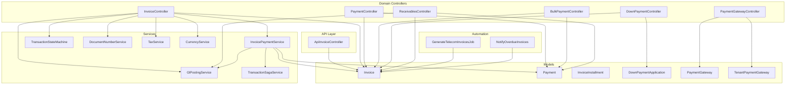

**Diagram sources**
- [ApiInvoiceController.php:1-32](file://app/Http/Controllers/Api/ApiInvoiceController.php#L1-L32)
- [InvoiceController.php:1-322](file://app/Http/Controllers/InvoiceController.php#L1-L322)
- [PaymentController.php](file://app/Http/Controllers/PaymentController.php)
- [BulkPaymentController.php](file://app/Http/Controllers/BulkPaymentController.php)
- [DownPaymentController.php](file://app/Http/Controllers/DownPaymentController.php)
- [PaymentGatewayController.php](file://app/Http/Controllers/PaymentGatewayController.php)
- [ReceivablesController.php](file://app/Http/Controllers/ReceivablesController.php)
- [Invoice.php:1-183](file://app/Models/Invoice.php#L1-L183)
- [Payment.php:1-49](file://app/Models/Payment.php#L1-L49)
- [InvoiceInstallment.php](file://app/Models/InvoiceInstallment.php)
- [DownPaymentApplication.php](file://app/Models/DownPaymentApplication.php)
- [PaymentGateway.php](file://app/Models/PaymentGateway.php)
- [TenantPaymentGateway.php](file://app/Models/TenantPaymentGateway.php)
- [InvoicePaymentService.php:1-286](file://app/Services/InvoicePaymentService.php#L1-L286)
- [GlPostingService.php](file://app/Services/GlPostingService.php)
- [TransactionStateMachine.php](file://app/Services/TransactionStateMachine.php)
- [DocumentNumberService.php](file://app/Services/DocumentNumberService.php)
- [TaxService.php](file://app/Services/TaxService.php)
- [CurrencyService.php](file://app/Services/CurrencyService.php)
- [TransactionSagaService.php](file://app/Services/TransactionSagaService.php)
- [GenerateTelecomInvoicesJob.php](file://app/Jobs/GenerateTelecomInvoicesJob.php)
- [NotifyOverdueInvoices.php](file://app/Jobs/NotifyOverdueInvoices.php)

**Section sources**
- [ApiInvoiceController.php:1-32](file://app/Http/Controllers/Api/ApiInvoiceController.php#L1-L32)
- [InvoiceController.php:1-322](file://app/Http/Controllers/InvoiceController.php#L1-L322)
- [Invoice.php:1-183](file://app/Models/Invoice.php#L1-L183)
- [Payment.php:1-49](file://app/Models/Payment.php#L1-L49)
- [InvoicePaymentService.php:1-286](file://app/Services/InvoicePaymentService.php#L1-L286)

## Core Components
- Invoice model: central entity with payment tracking, aging buckets, and lifecycle states
- Payment model: polymorphic relationship supporting payments against invoices and other payables
- InvoicePaymentService: atomic payment processing with GL posting and notifications
- Controllers: API endpoints for listing and retrieving invoices; domain controllers for creation, posting, cancellation, voiding, PDF/email delivery, and payment recording
- Services: GL posting, numbering, taxation, currency conversion, state machine transitions, and saga orchestration for bulk operations
- Jobs: automation for recurring invoice generation and overdue notifications
- Notifications: automated alerts for overdue and sent invoices

**Section sources**
- [Invoice.php:1-183](file://app/Models/Invoice.php#L1-L183)
- [Payment.php:1-49](file://app/Models/Payment.php#L1-L49)
- [InvoicePaymentService.php:1-286](file://app/Services/InvoicePaymentService.php#L1-L286)
- [InvoiceController.php:1-322](file://app/Http/Controllers/InvoiceController.php#L1-L322)
- [ApiInvoiceController.php:1-32](file://app/Http/Controllers/Api/ApiInvoiceController.php#L1-L32)

## Architecture Overview
The system follows a layered architecture:
- Presentation: API and domain controllers expose endpoints and UI flows
- Application: services coordinate business logic, transactions, and integrations
- Domain: models encapsulate data and invariants
- Infrastructure: GL posting, notifications, jobs, and external integrations

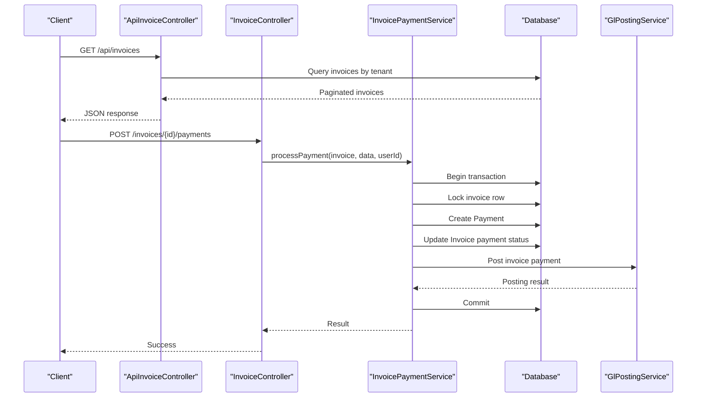

**Diagram sources**
- [ApiInvoiceController.php:1-32](file://app/Http/Controllers/Api/ApiInvoiceController.php#L1-L32)
- [InvoiceController.php:173-218](file://app/Http/Controllers/InvoiceController.php#L173-L218)
- [InvoicePaymentService.php:37-185](file://app/Services/InvoicePaymentService.php#L37-L185)
- [GlPostingService.php](file://app/Services/GlPostingService.php)

## Detailed Component Analysis

### Invoice Management API
- Purpose: Retrieve invoices filtered by tenant, status, and overdue criteria
- Endpoints:
  - GET /api/invoices: List invoices with pagination and filtering
  - GET /api/invoices/{id}: Retrieve invoice details including customer and installments

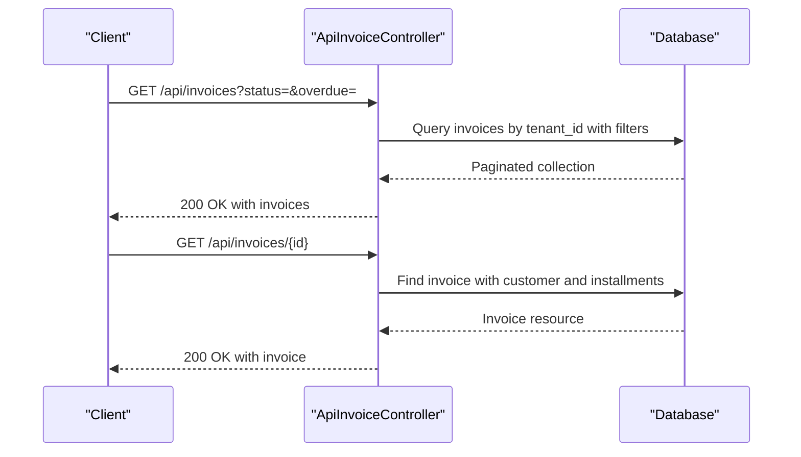

**Diagram sources**
- [ApiInvoiceController.php:11-30](file://app/Http/Controllers/Api/ApiInvoiceController.php#L11-L30)

**Section sources**
- [ApiInvoiceController.php:1-32](file://app/Http/Controllers/Api/ApiInvoiceController.php#L1-L32)

### Invoice Lifecycle Management
- Creation: Validates inputs, calculates taxes and totals, generates sequential invoice numbers, posts to GL (for standalone invoices), records activity logs, and fires webhooks
- Posting: Transitions invoice to posted state and ensures GL posting if not already performed
- Cancellation/Void: Records reasons and transitions state via state machine
- PDF/Email: Generates PDF and emails customer with attachment

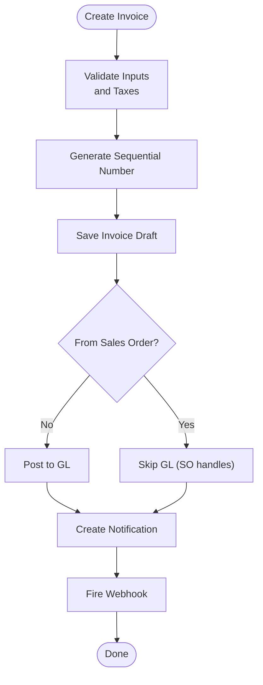

**Diagram sources**
- [InvoiceController.php:79-164](file://app/Http/Controllers/InvoiceController.php#L79-L164)
- [DocumentNumberService.php](file://app/Services/DocumentNumberService.php)
- [GlPostingService.php](file://app/Services/GlPostingService.php)
- [TaxService.php](file://app/Services/TaxService.php)
- [CurrencyService.php](file://app/Services/CurrencyService.php)

**Section sources**
- [InvoiceController.php:79-164](file://app/Http/Controllers/InvoiceController.php#L79-L164)
- [Invoice.php:162-175](file://app/Models/Invoice.php#L162-L175)

### Payment Application and Status Tracking
- Single Payment: Atomic processing with row-level locking, payment creation, invoice status recalculation, GL posting, activity logging, and notifications
- Bulk Payments: Saga-based orchestration across multiple invoices with GL posting per payment
- Payment Methods: Supports cash, transfer, QRIS, and other methods
- Status Updates: Automatic updates to paid, partial, or paid status based on cumulative payments

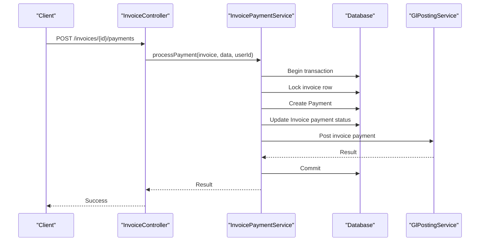

**Diagram sources**
- [InvoiceController.php:173-218](file://app/Http/Controllers/InvoiceController.php#L173-L218)
- [InvoicePaymentService.php:37-185](file://app/Services/InvoicePaymentService.php#L37-L185)
- [GlPostingService.php](file://app/Services/GlPostingService.php)

**Section sources**
- [InvoicePaymentService.php:37-185](file://app/Services/InvoicePaymentService.php#L37-L185)
- [Invoice.php:162-175](file://app/Models/Invoice.php#L162-L175)

### Bulk Payment Processing
- Validates each invoice's remaining balance
- Creates individual payments and updates invoice statuses
- Posts each payment to GL
- Returns consolidated results

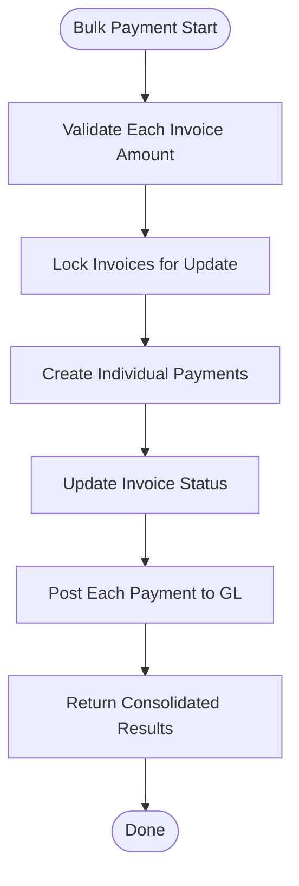

**Diagram sources**
- [InvoicePaymentService.php:197-284](file://app/Services/InvoicePaymentService.php#L197-L284)

**Section sources**
- [InvoicePaymentService.php:197-284](file://app/Services/InvoicePaymentService.php#L197-L284)

### Payment Gateway Integration Patterns
- Tenant-specific payment gateways configured per tenant
- Payment gateway controller orchestrates gateway interactions
- Payment models capture method and metadata for reconciliation

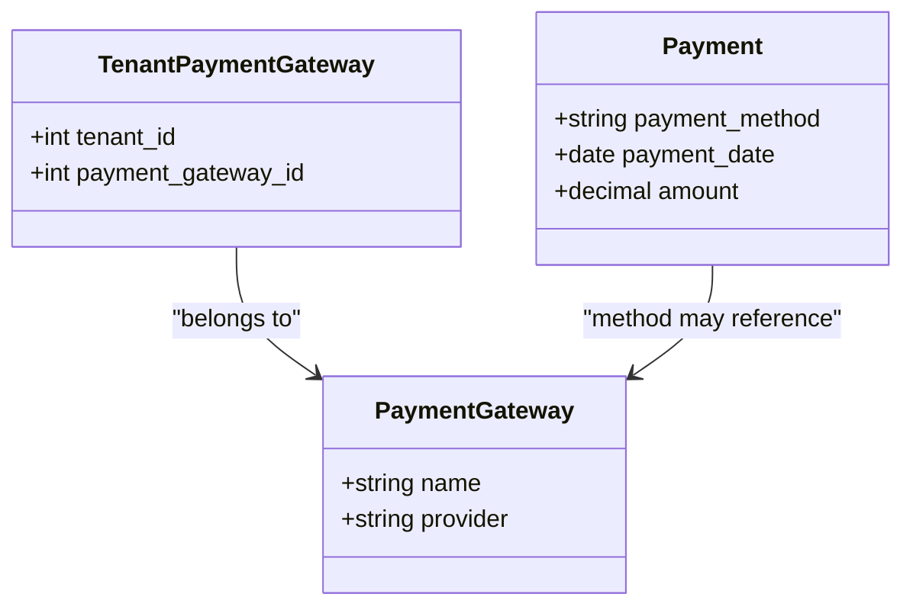

**Diagram sources**
- [PaymentGateway.php](file://app/Models/PaymentGateway.php)
- [TenantPaymentGateway.php](file://app/Models/TenantPaymentGateway.php)
- [Payment.php:1-49](file://app/Models/Payment.php#L1-L49)

**Section sources**
- [PaymentGatewayController.php](file://app/Http/Controllers/PaymentGatewayController.php)
- [PaymentGateway.php](file://app/Models/PaymentGateway.php)
- [TenantPaymentGateway.php](file://app/Models/TenantPaymentGateway.php)
- [Payment.php:1-49](file://app/Models/Payment.php#L1-L49)

### Credit Memo and Down Payment Processing
- Down Payment Application: Links down payments to invoices, reducing remaining amounts
- Down Payment Model: Tracks allocated and unallocated down payments
- Invoice Down Payment Applications: Relationship to track applied amounts

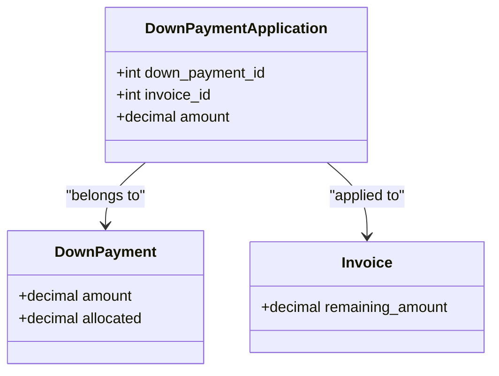

**Diagram sources**
- [DownPayment.php](file://app/Models/DownPayment.php)
- [DownPaymentApplication.php](file://app/Models/DownPaymentApplication.php)
- [Invoice.php:136-139](file://app/Models/Invoice.php#L136-L139)

**Section sources**
- [DownPaymentController.php](file://app/Http/Controllers/DownPaymentController.php)
- [DownPayment.php](file://app/Models/DownPayment.php)
- [DownPaymentApplication.php](file://app/Models/DownPaymentApplication.php)
- [Invoice.php:136-139](file://app/Models/Invoice.php#L136-L139)

### Installment and Specialized Invoices
- Invoice Installments: Support for installment-based invoicing
- Project Invoices: Invoicing for project billing configurations
- Subscription Invoices: Recurring billing support

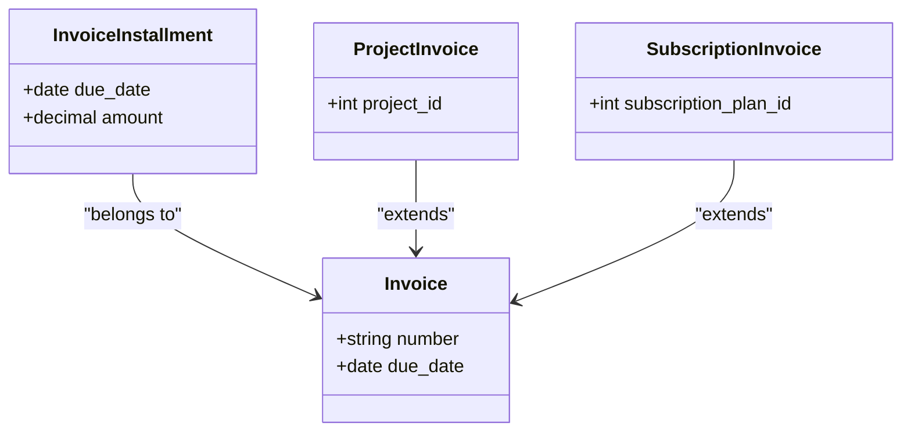

**Diagram sources**
- [InvoiceInstallment.php](file://app/Models/InvoiceInstallment.php)
- [ProjectInvoice.php](file://app/Models/ProjectInvoice.php)
- [SubscriptionInvoice.php](file://app/Models/SubscriptionInvoice.php)
- [Invoice.php:1-183](file://app/Models/Invoice.php#L1-L183)

**Section sources**
- [InvoiceInstallment.php](file://app/Models/InvoiceInstallment.php)
- [ProjectInvoice.php](file://app/Models/ProjectInvoice.php)
- [SubscriptionInvoice.php](file://app/Models/SubscriptionInvoice.php)

### Notifications and Automation
- Overdue Invoice Notification: Automated alerts for overdue invoices
- Invoice Sent Notification: Confirmation when invoices are generated and sent
- Jobs: Generate telecom invoices and notify overdue invoices

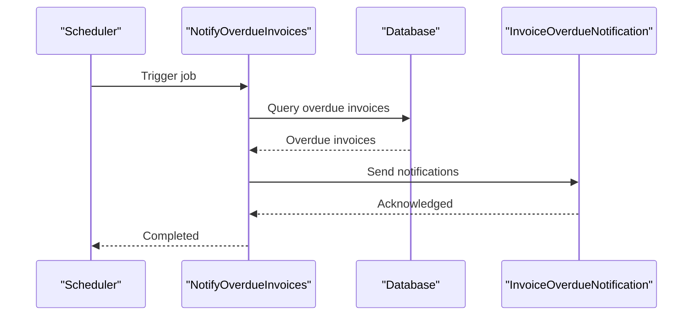

**Diagram sources**
- [NotifyOverdueInvoices.php](file://app/Jobs/NotifyOverdueInvoices.php)
- [InvoiceOverdueNotification.php](file://app/Notifications/InvoiceOverdueNotification.php)
- [InvoiceSentNotification.php](file://app/Notifications/InvoiceSentNotification.php)

**Section sources**
- [NotifyOverdueInvoices.php](file://app/Jobs/NotifyOverdueInvoices.php)
- [InvoiceOverdueNotification.php](file://app/Notifications/InvoiceOverdueNotification.php)
- [InvoiceSentNotification.php](file://app/Notifications/InvoiceSentNotification.php)

## Dependency Analysis
Key dependencies and relationships:
- InvoiceController depends on InvoicePaymentService, GlPostingService, TransactionStateMachine, DocumentNumberService, TaxService, and CurrencyService
- InvoicePaymentService coordinates Payment creation, Invoice status updates, and GL posting
- Models define polymorphic relationships and calculated fields for aging and status
- Jobs integrate with the broader system for automation

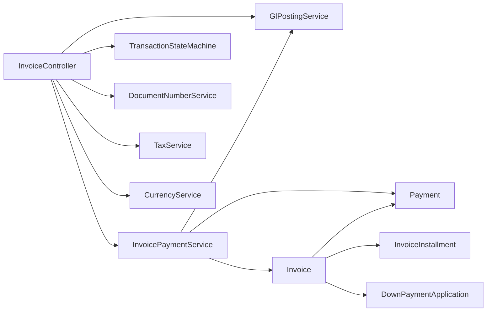

**Diagram sources**
- [InvoiceController.php:1-322](file://app/Http/Controllers/InvoiceController.php#L1-L322)
- [InvoicePaymentService.php:1-286](file://app/Services/InvoicePaymentService.php#L1-L286)
- [Invoice.php:1-183](file://app/Models/Invoice.php#L1-L183)
- [Payment.php:1-49](file://app/Models/Payment.php#L1-L49)
- [InvoiceInstallment.php](file://app/Models/InvoiceInstallment.php)
- [DownPaymentApplication.php](file://app/Models/DownPaymentApplication.php)

**Section sources**
- [InvoiceController.php:1-322](file://app/Http/Controllers/InvoiceController.php#L1-L322)
- [InvoicePaymentService.php:1-286](file://app/Services/InvoicePaymentService.php#L1-L286)
- [Invoice.php:1-183](file://app/Models/Invoice.php#L1-L183)
- [Payment.php:1-49](file://app/Models/Payment.php#L1-L49)

## Performance Considerations
- Row-level locking during payment processing prevents race conditions and ensures accurate status updates
- GL posting is performed after payment creation; failures are logged but do not block payment recording
- Bulk payment processing uses saga orchestration to maintain consistency across multiple invoices
- Sequential number generation avoids conflicts and supports auditability
- Aging calculations and overdue checks leverage efficient date arithmetic

[No sources needed since this section provides general guidance]

## Troubleshooting Guide
Common issues and resolutions:
- Payment amount exceeds remaining balance: Validation prevents over-application; adjust payment amount accordingly
- GL posting failures: Payment is still recorded; review GL posting service logs and warnings
- Transaction rollbacks: TransactionException indicates rollback; check context for specific failure details
- Overdue invoice notifications: Verify notification job scheduling and customer contact details

**Section sources**
- [InvoicePaymentService.php:68-78](file://app/Services/InvoicePaymentService.php#L68-L78)
- [InvoicePaymentService.php:123-131](file://app/Services/InvoicePaymentService.php#L123-L131)
- [InvoicePaymentService.php:161-184](file://app/Services/InvoicePaymentService.php#L161-L184)

## Conclusion
The qalcuityERP system provides a robust, transactionally sound framework for invoice and payment processing. It supports atomic payment operations, flexible lifecycle management, automated GL posting, and integration with payment gateways. The modular design enables extensibility for specialized invoicing scenarios, while built-in notifications and automation streamline day-to-day operations.