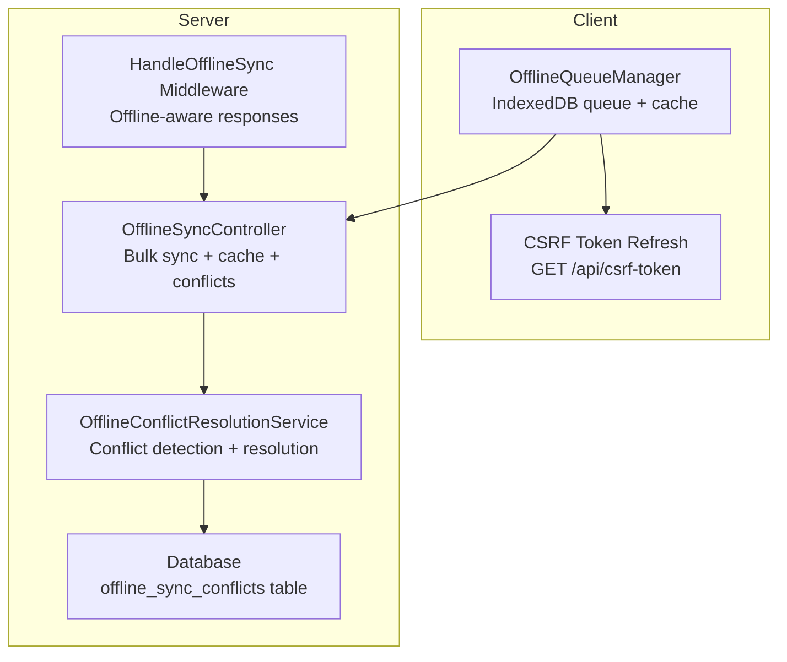
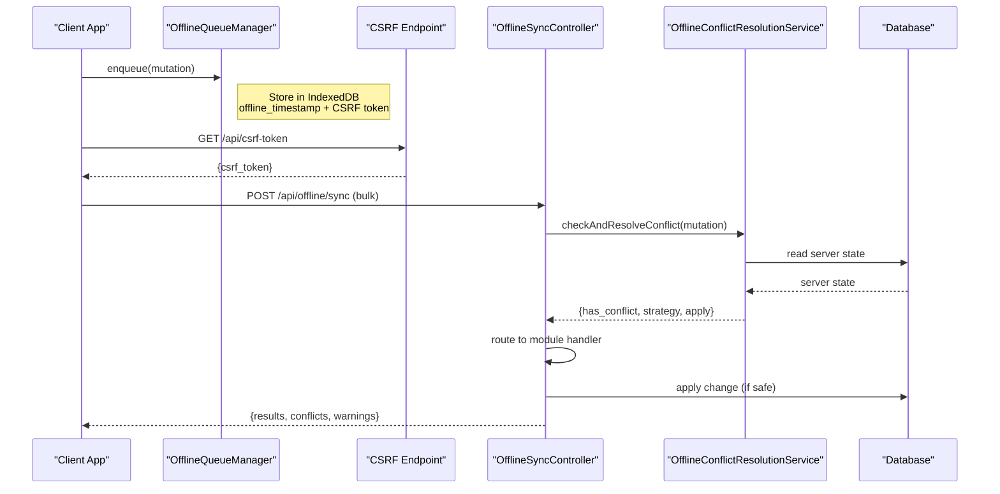
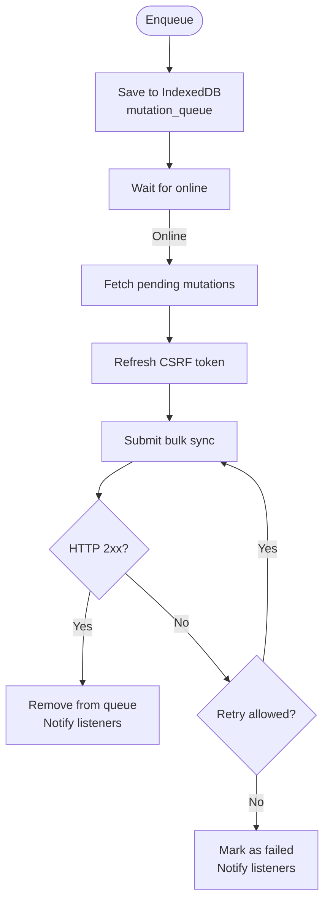
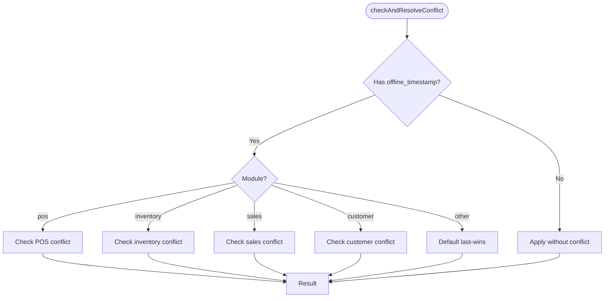
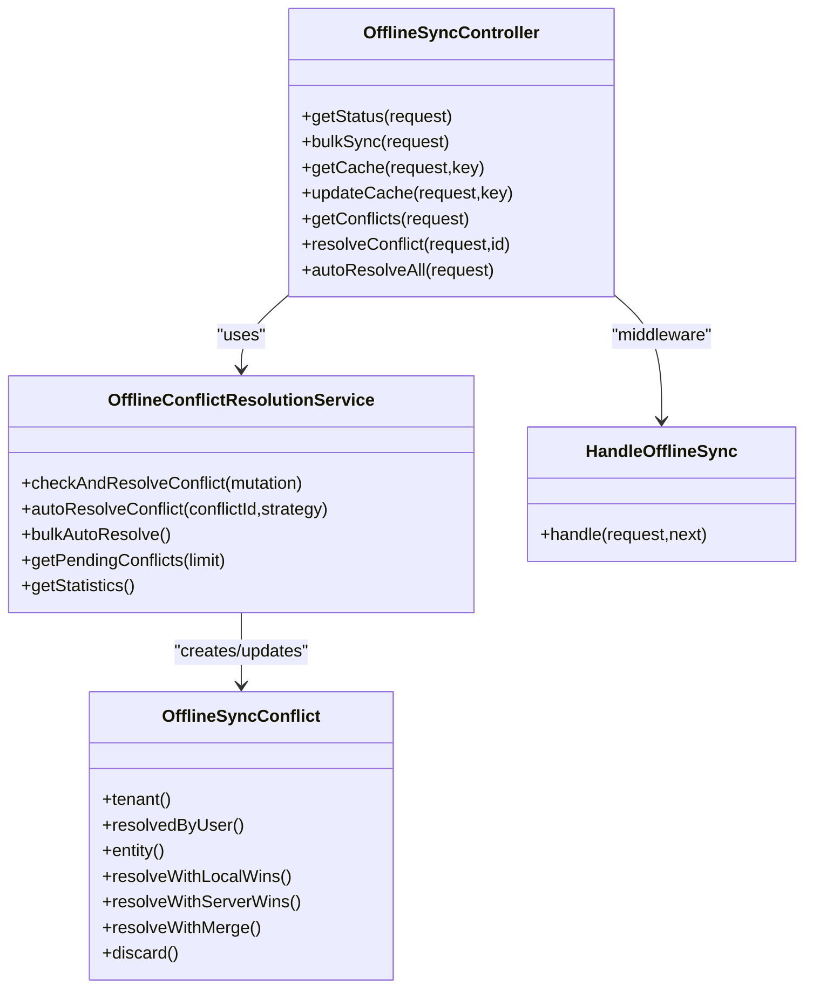

# Offline Sync API

<cite>
**Referenced Files in This Document**
- [OfflineSyncController.php](file://app/Http/Controllers/OfflineSyncController.php)
- [OfflineConflictResolutionService.php](file://app/Services/OfflineConflictResolutionService.php)
- [OfflineSyncConflict.php](file://app/Models/OfflineSyncConflict.php)
- [HandleOfflineSync.php](file://app/Http/Middleware/HandleOfflineSync.php)
- [offline-manager.js](file://resources/js/offline-manager.js)
- [api.php](file://routes/api.php)
- [2026_04_08_060000_create_offline_sync_conflicts_table.php](file://database/migrations/2026_04_08_060000_create_offline_sync_conflicts_table.php)
</cite>

## Table of Contents
1. [Introduction](#introduction)
2. [Project Structure](#project-structure)
3. [Core Components](#core-components)
4. [Architecture Overview](#architecture-overview)
5. [Detailed Component Analysis](#detailed-component-analysis)
6. [Dependency Analysis](#dependency-analysis)
7. [Performance Considerations](#performance-considerations)
8. [Troubleshooting Guide](#troubleshooting-guide)
9. [Conclusion](#conclusion)

## Introduction
This document provides comprehensive API documentation for offline data synchronization in the ERP system. It covers bulk data sync operations, conflict detection and resolution mechanisms, cache management for offline access, offline data staging, and sync status monitoring. It also documents CSRF token refresh for offline clients and offline conflict resolution workflows, with practical examples for offline POS operations and data integrity checks.

## Project Structure
The offline sync feature spans client-side queuing and caching, server-side conflict detection and resolution, and API endpoints for bulk sync and cache management.

**Diagram sources**
- [offline-manager.js:1-200](file://resources/js/offline-manager.js#L1-L200)
- [api.php:140-156](file://routes/api.php#L140-L156)
- [OfflineSyncController.php:1-149](file://app/Http/Controllers/OfflineSyncController.php#L1-L149)
- [OfflineConflictResolutionService.php:1-120](file://app/Services/OfflineConflictResolutionService.php#L1-L120)
- [HandleOfflineSync.php:1-44](file://app/Http/Middleware/HandleOfflineSync.php#L1-L44)
- [2026_04_08_060000_create_offline_sync_conflicts_table.php:1-45](file://database/migrations/2026_04_08_060000_create_offline_sync_conflicts_table.php#L1-L45)

**Section sources**
- [OfflineSyncController.php:1-149](file://app/Http/Controllers/OfflineSyncController.php#L1-L149)
- [OfflineConflictResolutionService.php:1-120](file://app/Services/OfflineConflictResolutionService.php#L1-L120)
- [HandleOfflineSync.php:1-44](file://app/Http/Middleware/HandleOfflineSync.php#L1-L44)
- [offline-manager.js:1-200](file://resources/js/offline-manager.js#L1-L200)
- [api.php:140-156](file://routes/api.php#L140-L156)

## Core Components
- OfflineSyncController: Provides bulk sync, cache management, conflict retrieval, and conflict resolution endpoints.
- OfflineConflictResolutionService: Implements conflict detection per module and automatic/manual resolution strategies.
- OfflineSyncConflict model: Persists conflict records with tenant scoping and resolution metadata.
- HandleOfflineSync middleware: Marks offline-synced requests and adapts redirects to JSON for offline clients.
- OfflineQueueManager (client): Queues mutations in IndexedDB, caches data for offline reads, and performs auto-sync with CSRF refresh.

**Section sources**
- [OfflineSyncController.php:1-149](file://app/Http/Controllers/OfflineSyncController.php#L1-L149)
- [OfflineConflictResolutionService.php:1-120](file://app/Services/OfflineConflictResolutionService.php#L1-L120)
- [OfflineSyncConflict.php:1-92](file://app/Models/OfflineSyncConflict.php#L1-L92)
- [HandleOfflineSync.php:1-44](file://app/Http/Middleware/HandleOfflineSync.php#L1-L44)
- [offline-manager.js:1-200](file://resources/js/offline-manager.js#L1-L200)

## Architecture Overview
The offline sync architecture consists of:
- Client-side queue and cache: IndexedDB-backed queue and cached data store.
- Server-side conflict detection: Timestamp-based conflict detection before applying changes.
- Conflict resolution: Automatic strategies per module and manual override via API.
- CSRF handling: Fresh CSRF token acquisition for offline submissions.

**Diagram sources**
- [offline-manager.js:110-146](file://resources/js/offline-manager.js#L110-L146)
- [api.php:140-156](file://routes/api.php#L140-L156)
- [OfflineSyncController.php:53-149](file://app/Http/Controllers/OfflineSyncController.php#L53-L149)
- [OfflineConflictResolutionService.php:38-73](file://app/Services/OfflineConflictResolutionService.php#L38-L73)

## Detailed Component Analysis

### API Endpoints

#### Bulk Sync
- Method: POST
- Path: /api/offline/sync
- Purpose: Submit multiple offline mutations in a single request for processing.
- Validation: mutations array with up to 50 items; each item requires url, method, module, and optional offline_timestamp/local_id.
- Behavior:
  - For each mutation, conflict is checked before applying.
  - Mutations are routed by module to appropriate handlers.
  - Returns aggregated results, counts of synced/failed/conflicts, and per-item outcomes.

**Section sources**
- [OfflineSyncController.php:53-149](file://app/Http/Controllers/OfflineSyncController.php#L53-L149)
- [api.php:140-148](file://routes/api.php#L140-L148)

#### Status and Statistics
- Method: GET
- Path: /api/offline/status
- Purpose: Retrieve sync status and statistics (pending/failed mutations, last sync time).
- Notes: Always returns online=true from server perspective.

**Section sources**
- [OfflineSyncController.php:21-47](file://app/Http/Controllers/OfflineSyncController.php#L21-L47)

#### Cache Management
- GET /api/offline/cache/{key}
  - Purpose: Retrieve cached data scoped by tenant and key.
  - Response includes cached_at timestamp.
- POST /api/offline/cache/{key}
  - Purpose: Update cached data with TTL.
  - Body: data (any serializable), ttl (seconds, default 3600).

**Section sources**
- [OfflineSyncController.php:251-311](file://app/Http/Controllers/OfflineSyncController.php#L251-L311)

#### Conflict Management
- GET /api/offline/conflicts
  - Purpose: List pending conflicts and statistics for the tenant.
- POST /api/offline/conflicts/{id}/resolve
  - Purpose: Manually resolve a conflict with strategy selection.
  - Strategy options: local_wins, server_wins, merge, skip.
- POST /api/offline/conflicts/auto-resolve
  - Purpose: Automatically resolve all pending conflicts using default strategies.

**Section sources**
- [OfflineSyncController.php:317-399](file://app/Http/Controllers/OfflineSyncController.php#L317-L399)
- [OfflineConflictResolutionService.php:297-355](file://app/Services/OfflineConflictResolutionService.php#L297-L355)

### Client-Side Offline Queue Manager
- IndexedDB stores:
  - mutation_queue: pending mutations with priority, timestamps, retry counts, and callbacks.
  - cached_data: offline-readable data with module, updated_at, expires_at.
- Features:
  - Online/offline event handling triggers auto-sync.
  - Enqueue mutations with offline_timestamp and CSRF token snapshot.
  - Process mutations with retry logic and conflict warning propagation.
  - CSRF token refresh via GET /api/csrf-token before submission.

**Diagram sources**
- [offline-manager.js:182-356](file://resources/js/offline-manager.js#L182-L356)

**Section sources**
- [offline-manager.js:1-200](file://resources/js/offline-manager.js#L1-L200)
- [offline-manager.js:244-356](file://resources/js/offline-manager.js#L244-L356)
- [offline-manager.js:617-666](file://resources/js/offline-manager.js#L617-L666)

### Conflict Detection and Resolution

#### Conflict Detection Logic
- Timestamp-based detection: Compares server state against offline_timestamp.
- Module-specific checks:
  - POS: Prevents duplicate transactions and warns on significant stock changes.
  - Inventory: Creates conflict when stock quantities changed during offline period.
  - Sales/Customer: Creates conflict when editable records were modified during offline period.
- Unknown modules: Defaults to last-wins strategy with warning.

**Diagram sources**
- [OfflineConflictResolutionService.php:38-73](file://app/Services/OfflineConflictResolutionService.php#L38-L73)
- [OfflineConflictResolutionService.php:78-139](file://app/Services/OfflineConflictResolutionService.php#L78-L139)
- [OfflineConflictResolutionService.php:144-203](file://app/Services/OfflineConflictResolutionService.php#L144-L203)
- [OfflineConflictResolutionService.php:208-246](file://app/Services/OfflineConflictResolutionService.php#L208-L246)
- [OfflineConflictResolutionService.php:251-292](file://app/Services/OfflineConflictResolutionService.php#L251-L292)

#### Resolution Strategies
- local_wins: Apply offline changes (e.g., inventory adjustment increment).
- server_wins: Keep server state (discard local).
- merge: Combine changes where applicable (e.g., inventory adjustment).
- skip: Discard local changes without applying.
- Default strategies per entity type:
  - inventory: merge
  - sale: server_wins
  - customer: local_wins
  - pos: skip duplicates

**Section sources**
- [OfflineConflictResolutionService.php:297-355](file://app/Services/OfflineConflictResolutionService.php#L297-L355)
- [OfflineConflictResolutionService.php:444-453](file://app/Services/OfflineConflictResolutionService.php#L444-L453)

### CSRF Token Refresh for Offline Clients
- Client obtains a fresh CSRF token via GET /api/csrf-token and updates meta[name="csrf-token"].
- Offline submissions include X-CSRF-TOKEN header and X-Offline-Sync: 1.
- Middleware converts redirect responses to JSON for offline clients.

**Section sources**
- [api.php:150-156](file://routes/api.php#L150-L156)
- [offline-manager.js:617-666](file://resources/js/offline-manager.js#L617-L666)
- [HandleOfflineSync.php:18-44](file://app/Http/Middleware/HandleOfflineSync.php#L18-L44)

### Offline POS Operations Example
- Offline checkout mutation includes items and local transaction identifier.
- Server validates and routes to POS checkout controller.
- Conflict detection prevents duplicate transactions and warns on stock changes.

**Section sources**
- [OfflineSyncController.php:181-199](file://app/Http/Controllers/OfflineSyncController.php#L181-L199)
- [OfflineConflictResolutionService.php:78-139](file://app/Services/OfflineConflictResolutionService.php#L78-L139)

### Data Integrity Checks and Sync Status Monitoring
- Server aggregates results per mutation and reports synced/failed/conflicts counts.
- Client maintains queue statistics (total/pending/failed/by module) and notifies listeners.
- Conflict statistics provide resolution rate and counts.

**Section sources**
- [OfflineSyncController.php:123-139](file://app/Http/Controllers/OfflineSyncController.php#L123-L139)
- [offline-manager.js:688-717](file://resources/js/offline-manager.js#L688-L717)
- [OfflineConflictResolutionService.php:473-495](file://app/Services/OfflineConflictResolutionService.php#L473-L495)

## Dependency Analysis

**Diagram sources**
- [OfflineSyncController.php:1-149](file://app/Http/Controllers/OfflineSyncController.php#L1-L149)
- [OfflineConflictResolutionService.php:1-120](file://app/Services/OfflineConflictResolutionService.php#L1-L120)
- [OfflineSyncConflict.php:1-92](file://app/Models/OfflineSyncConflict.php#L1-L92)
- [HandleOfflineSync.php:1-44](file://app/Http/Middleware/HandleOfflineSync.php#L1-L44)

**Section sources**
- [OfflineSyncController.php:1-149](file://app/Http/Controllers/OfflineSyncController.php#L1-L149)
- [OfflineConflictResolutionService.php:1-120](file://app/Services/OfflineConflictResolutionService.php#L1-L120)
- [OfflineSyncConflict.php:1-92](file://app/Models/OfflineSyncConflict.php#L1-L92)
- [HandleOfflineSync.php:1-44](file://app/Http/Middleware/HandleOfflineSync.php#L1-L44)

## Performance Considerations
- Bulk sync reduces network overhead by batching multiple mutations.
- Conflict detection short-circuits unnecessary work and prevents wasted retries.
- IndexedDB operations are asynchronous; ensure proper indexing (module, status, queued_at, priority) for efficient queries.
- Cache TTL controls data freshness; tune per module to balance performance and accuracy.
- Transaction boundaries in conflict resolution ensure atomicity of merges and state changes.

## Troubleshooting Guide
Common issues and resolutions:
- CSRF token expired (419):
  - Client automatically refreshes token and retries once; if still failing, mark as failed.
- Validation errors (422):
  - Do not retry; mark as failed and surface to user.
- Authentication errors (401/403):
  - Treat as transient; do not remove from queue immediately.
- Duplicate POS transactions:
  - Conflict detected and skipped; verify local_id uniqueness.
- Significant stock changes during offline:
  - Warning returned; review and resolve conflicts manually.

**Section sources**
- [offline-manager.js:305-356](file://resources/js/offline-manager.js#L305-L356)
- [OfflineConflictResolutionService.php:82-139](file://app/Services/OfflineConflictResolutionService.php#L82-L139)

## Conclusion
The offline sync API provides a robust foundation for offline-first operations with strong conflict detection and resolution, tenant-scoped cache management, and resilient client-side queuing. By leveraging timestamp-based conflict checks, module-specific strategies, and automatic resolution defaults, the system ensures data integrity while enabling seamless offline productivity. Administrators can monitor conflicts and resolve them efficiently, while clients benefit from automatic CSRF token refresh and reliable auto-sync behavior.