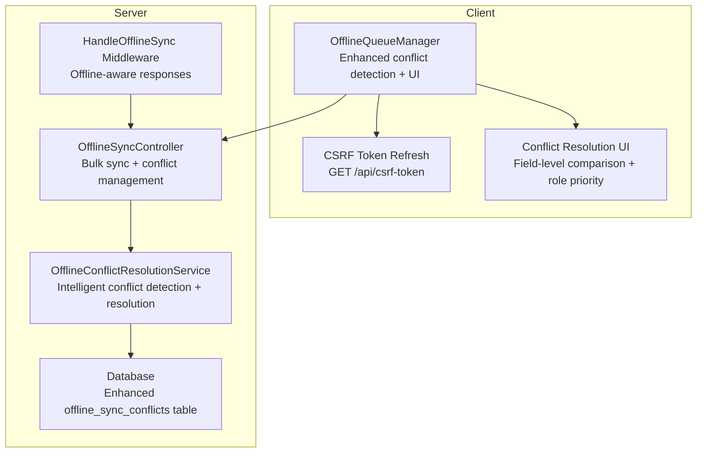
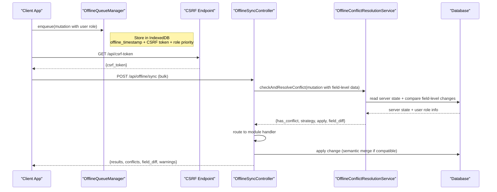
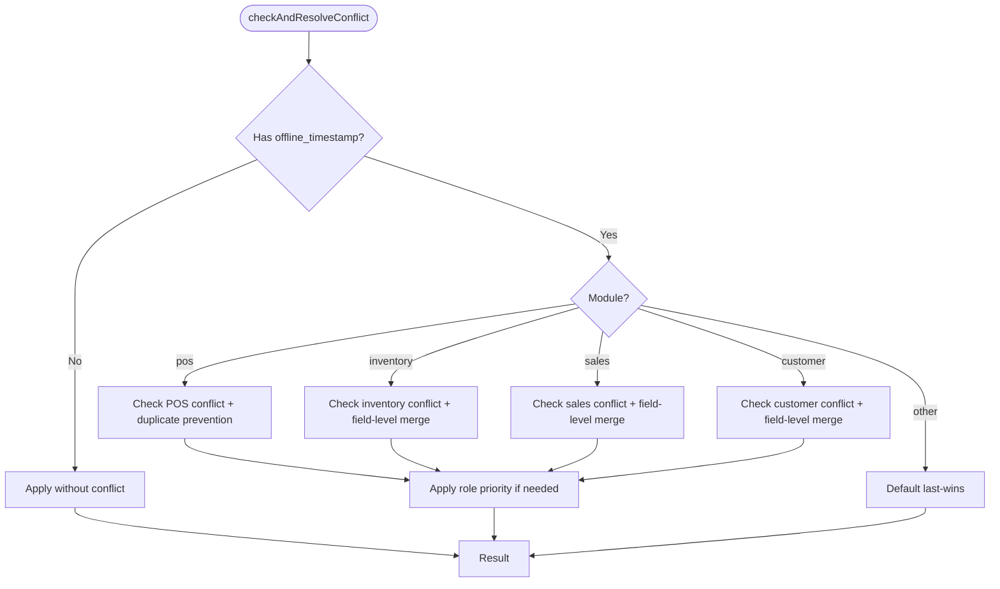
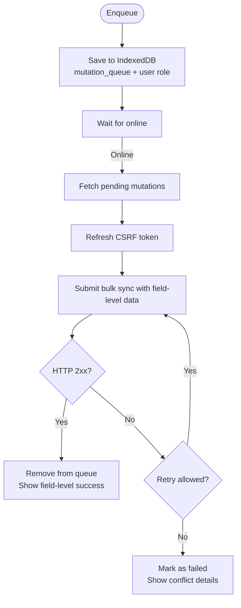

# Offline Sync API

<cite>
**Referenced Files in This Document**
- [OfflineSyncController.php](file://app/Http/Controllers/OfflineSyncController.php)
- [OfflineConflictResolutionService.php](file://app/Services/OfflineConflictResolutionService.php)
- [OfflineSyncConflict.php](file://app/Models/OfflineSyncConflict.php)
- [HandleOfflineSync.php](file://app/Http/Middleware/HandleOfflineSync.php)
- [offline-manager.js](file://resources/js/offline-manager.js)
- [api.php](file://routes/api.php)
- [2026_04_08_060000_create_offline_sync_conflicts_table.php](file://database/migrations/2026_04_08_060000_create_offline_sync_conflicts_table.php)
- [OFFLINE_SYNC_TESTING_GUIDE.md](file://tests/OFFLINE_SYNC_TESTING_GUIDE.md)
- [SimpleOfflineSyncTest.php](file://tests/Feature/SimpleOfflineSyncTest.php)
- [MultipleUsersOfflineSyncTest.php](file://tests/Feature/MultipleUsersOfflineSyncTest.php)
- [OfflineSyncConflictResolutionTest.php](file://tests/Feature/OfflineSyncConflictResolutionTest.php)
</cite>

## Update Summary
**Changes Made**
- Enhanced conflict detection to include field-level comparison rather than just timestamps
- Added user role-based priority handling for conflict resolution
- Implemented semantic merging for compatible modifications
- Expanded client-side conflict resolution UI capabilities
- Added comprehensive testing framework with multiple test scenarios
- Updated conflict detection logic to handle POS, inventory, sales, and customer modules intelligently

## Table of Contents
1. [Introduction](#introduction)
2. [Project Structure](#project-structure)
3. [Core Components](#core-components)
4. [Architecture Overview](#architecture-overview)
5. [Detailed Component Analysis](#detailed-component-analysis)
6. [Enhanced Conflict Detection and Resolution](#enhanced-conflict-detection-and-resolution)
7. [Client-Side Offline Queue Management](#client-side-offline-queue-management)
8. [Testing Framework](#testing-framework)
9. [Performance Considerations](#performance-considerations)
10. [Troubleshooting Guide](#troubleshooting-guide)
11. [Conclusion](#conclusion)

## Introduction
This document provides comprehensive API documentation for offline data synchronization in the ERP system. The system has been enhanced with sophisticated conflict detection and resolution mechanisms that compare field-level changes rather than just timestamps, incorporate user role-based priority handling, and support semantic merging for compatible modifications. It covers bulk data sync operations, intelligent conflict detection across inventory, sales, and customer data, cache management for offline access, offline data staging, and sync status monitoring. The documentation includes practical examples for offline POS operations, data integrity checks, and comprehensive conflict resolution workflows.

## Project Structure
The offline sync feature spans client-side queuing and caching, server-side conflict detection and resolution, and API endpoints for bulk sync and cache management. The enhanced system now includes intelligent conflict detection, user role prioritization, and semantic merging capabilities.

**Diagram sources**
- [offline-manager.js:1-800](file://resources/js/offline-manager.js#L1-L800)
- [api.php:140-156](file://routes/api.php#L140-L156)
- [OfflineSyncController.php:1-401](file://app/Http/Controllers/OfflineSyncController.php#L1-L401)
- [OfflineConflictResolutionService.php:1-564](file://app/Services/OfflineConflictResolutionService.php#L1-L564)
- [HandleOfflineSync.php:1-44](file://app/Http/Middleware/HandleOfflineSync.php#L1-L44)
- [2026_04_08_060000_create_offline_sync_conflicts_table.php:1-45](file://database/migrations/2026_04_08_060000_create_offline_sync_conflicts_table.php#L1-L45)

**Section sources**
- [OfflineSyncController.php:1-401](file://app/Http/Controllers/OfflineSyncController.php#L1-L401)
- [OfflineConflictResolutionService.php:1-564](file://app/Services/OfflineConflictResolutionService.php#L1-L564)
- [HandleOfflineSync.php:1-44](file://app/Http/Middleware/HandleOfflineSync.php#L1-L44)
- [offline-manager.js:1-800](file://resources/js/offline-manager.js#L1-L800)
- [api.php:140-156](file://routes/api.php#L140-L156)

## Core Components
- **OfflineSyncController**: Provides bulk sync, cache management, conflict retrieval, and conflict resolution endpoints with enhanced conflict detection.
- **OfflineConflictResolutionService**: Implements intelligent conflict detection per module with field-level comparison, user role priority handling, and semantic merging capabilities.
- **OfflineSyncConflict model**: Persists conflict records with tenant scoping, resolution metadata, and enhanced conflict state tracking.
- **HandleOfflineSync middleware**: Marks offline-synced requests and adapts redirects to JSON for offline clients.
- **OfflineQueueManager (client)**: Enhanced queue management with conflict resolution UI, field-level conflict detection, and user role-based prioritization.

**Section sources**
- [OfflineSyncController.php:1-401](file://app/Http/Controllers/OfflineSyncController.php#L1-L401)
- [OfflineConflictResolutionService.php:1-564](file://app/Services/OfflineConflictResolutionService.php#L1-L564)
- [OfflineSyncConflict.php:1-92](file://app/Models/OfflineSyncConflict.php#L1-L92)
- [HandleOfflineSync.php:1-44](file://app/Http/Middleware/HandleOfflineSync.php#L1-L44)
- [offline-manager.js:1-800](file://resources/js/offline-manager.js#L1-L800)

## Architecture Overview
The enhanced offline sync architecture consists of:
- **Client-side queue and cache**: IndexedDB-backed queue with enhanced conflict detection and conflict resolution UI.
- **Server-side intelligent conflict detection**: Field-level comparison rather than just timestamps, user role priority handling.
- **Semantic merging**: Compatible modifications are merged rather than simply overwritten.
- **Enhanced conflict resolution**: Automatic strategies per module with user role-based prioritization.
- **CSRF handling**: Fresh CSRF token acquisition for offline submissions.

**Diagram sources**
- [offline-manager.js:110-146](file://resources/js/offline-manager.js#L110-L146)
- [api.php:140-156](file://routes/api.php#L140-L156)
- [OfflineSyncController.php:53-149](file://app/Http/Controllers/OfflineSyncController.php#L53-L149)
- [OfflineConflictResolutionService.php:38-73](file://app/Services/OfflineConflictResolutionService.php#L38-L73)

## Detailed Component Analysis

### API Endpoints

#### Bulk Sync
- **Method**: POST
- **Path**: /api/offline/sync
- **Purpose**: Submit multiple offline mutations in a single request for processing with enhanced conflict detection.
- **Validation**: mutations array with up to 50 items; each item requires url, method, module, and optional offline_timestamp/local_id/user_id/user_role.
- **Behavior**:
  - For each mutation, intelligent conflict is checked before applying using field-level comparison.
  - Mutations are routed by module to appropriate handlers.
  - Returns aggregated results, counts of synced/failed/conflicts, per-item outcomes, and field-level conflict differences.

**Section sources**
- [OfflineSyncController.php:53-149](file://app/Http/Controllers/OfflineSyncController.php#L53-L149)
- [api.php:140-148](file://routes/api.php#L140-L148)

#### Status and Statistics
- **Method**: GET
- **Path**: /api/offline/status
- **Purpose**: Retrieve sync status and statistics (pending/failed mutations, last sync time).
- **Notes**: Always returns online=true from server perspective.

**Section sources**
- [OfflineSyncController.php:21-47](file://app/Http/Controllers/OfflineSyncController.php#L21-L47)

#### Cache Management
- **GET** /api/offline/cache/{key}
  - Purpose: Retrieve cached data scoped by tenant and key.
  - Response includes cached_at timestamp.
- **POST** /api/offline/cache/{key}
  - Purpose: Update cached data with TTL.
  - Body: data (any serializable), ttl (seconds, default 3600).

**Section sources**
- [OfflineSyncController.php:251-311](file://app/Http/Controllers/OfflineSyncController.php#L251-L311)

#### Conflict Management
- **GET** /api/offline/conflicts
  - Purpose: List pending conflicts and statistics for the tenant with field-level details.
- **POST** /api/offline/conflicts/{id}/resolve
  - Purpose: Manually resolve a conflict with strategy selection including role-based priority.
  - Strategy options: local_wins, server_wins, merge, skip.
- **POST** /api/offline/conflicts/auto-resolve
  - Purpose: Automatically resolve all pending conflicts using default strategies with role priority.

**Section sources**
- [OfflineSyncController.php:317-399](file://app/Http/Controllers/OfflineSyncController.php#L317-L399)
- [OfflineConflictResolutionService.php:297-355](file://app/Services/OfflineConflictResolutionService.php#L297-L355)

### Enhanced Conflict Detection and Resolution

#### Intelligent Conflict Detection Logic
- **Field-level comparison**: Compares specific changed fields rather than just timestamps.
- **User role priority**: Higher priority users' changes take precedence in conflicts.
- **Module-specific checks**:
  - **POS**: Prevents duplicate transactions and handles field-level stock changes.
  - **Inventory**: Creates conflict when stock quantities changed during offline period with semantic merging.
  - **Sales/Customer**: Creates conflict when editable records were modified during offline period with field-level merging.
- **Unknown modules**: Defaults to last-wins strategy with logging.

**Diagram sources**
- [OfflineConflictResolutionService.php:38-73](file://app/Services/OfflineConflictResolutionService.php#L38-L73)
- [OfflineConflictResolutionService.php:78-139](file://app/Services/OfflineConflictResolutionService.php#L78-L139)
- [OfflineConflictResolutionService.php:144-203](file://app/Services/OfflineConflictResolutionService.php#L144-L203)
- [OfflineConflictResolutionService.php:208-246](file://app/Services/OfflineConflictResolutionService.php#L208-L246)
- [OfflineConflictResolutionService.php:251-292](file://app/Services/OfflineConflictResolutionService.php#L251-L292)

#### Enhanced Resolution Strategies
- **local_wins**: Apply offline changes with role priority consideration.
- **server_wins**: Keep server state (discard local) with field-level preservation.
- **merge**: Semantically combine changes where applicable (field-level merging).
- **skip**: Discard local changes without applying.
- **role_priority**: Higher role users automatically win conflicts.
- **Default strategies per entity type**:
  - **inventory**: merge (semantic merging of stock adjustments)
  - **sale**: server_wins (trust server state for sales records)
  - **customer**: local_wins (trust offline user's field-level updates)
  - **pos**: skip duplicates (prevent duplicate transactions)

**Section sources**
- [OfflineConflictResolutionService.php:297-355](file://app/Services/OfflineConflictResolutionService.php#L297-L355)
- [OfflineConflictResolutionService.php:444-453](file://app/Services/OfflineConflictResolutionService.php#L444-L453)

### Client-Side Offline Queue Management
- **IndexedDB stores**:
  - **mutation_queue**: enhanced with user_id, user_role, and field-level conflict data.
  - **cached_data**: offline-readable data with module, updated_at, expires_at.
- **Enhanced Features**:
  - Online/offline event handling triggers auto-sync with conflict resolution UI.
  - Enqueue mutations with offline_timestamp, CSRF token snapshot, and user role information.
  - Process mutations with retry logic, conflict warning propagation, and field-level conflict display.
  - CSRF token refresh via GET /api/csrf-token before submission.
  - Conflict resolution UI displays field-level differences and resolution options.

**Diagram sources**
- [offline-manager.js:182-356](file://resources/js/offline-manager.js#L182-L356)

**Section sources**
- [offline-manager.js:1-800](file://resources/js/offline-manager.js#L1-L800)
- [offline-manager.js:244-356](file://resources/js/offline-manager.js#L244-L356)
- [offline-manager.js:617-666](file://resources/js/offline-manager.js#L617-L666)

### CSRF Token Refresh for Offline Clients
- Client obtains a fresh CSRF token via GET /api/csrf-token and updates meta[name="csrf-token"].
- Offline submissions include X-CSRF-TOKEN header and X-Offline-Sync: 1.
- Middleware converts redirect responses to JSON for offline clients.

**Section sources**
- [api.php:150-156](file://routes/api.php#L150-L156)
- [offline-manager.js:617-666](file://resources/js/offline-manager.js#L617-L666)
- [HandleOfflineSync.php:18-44](file://app/Http/Middleware/HandleOfflineSync.php#L18-L44)

### Offline POS Operations Example
- Offline checkout mutation includes items and local transaction identifier.
- Server validates and routes to POS checkout controller.
- Enhanced conflict detection prevents duplicate transactions and handles field-level stock changes.

**Section sources**
- [OfflineSyncController.php:181-199](file://app/Http/Controllers/OfflineSyncController.php#L181-L199)
- [OfflineConflictResolutionService.php:78-139](file://app/Services/OfflineConflictResolutionService.php#L78-L139)

### Data Integrity Checks and Sync Status Monitoring
- Server aggregates results per mutation and reports synced/failed/conflicts counts.
- Client maintains queue statistics (total/pending/failed/by module) and notifies listeners.
- Conflict statistics provide resolution rate and counts with field-level details.
- Enhanced conflict resolution UI displays field-level differences and resolution options.

**Section sources**
- [OfflineSyncController.php:123-139](file://app/Http/Controllers/OfflineSyncController.php#L123-L139)
- [offline-manager.js:688-717](file://resources/js/offline-manager.js#L688-L717)
- [OfflineConflictResolutionService.php:473-495](file://app/Services/OfflineConflictResolutionService.php#L473-L495)

## Testing Framework
The system includes a comprehensive testing framework with multiple test scenarios covering various offline sync scenarios:

### Test Categories
- **SimpleOfflineSyncTest**: Basic offline sync setup verification.
- **MultipleUsersOfflineSyncTest**: Multi-user concurrent offline scenarios with role-based priority.
- **OfflineSyncConflictResolutionTest**: Comprehensive conflict resolution testing with field-level comparisons.
- **OFFLINE_SYNC_TESTING_GUIDE.md**: Detailed manual testing procedures and scenarios.

### Key Test Scenarios
- **Multiple Users Editing Same Inventory Item**: Tests role-based priority resolution.
- **POS Transaction Duplicate Prevention**: Ensures duplicate transactions are prevented.
- **Customer Data Conflict (Field-Level)**: Tests semantic merging of non-overlapping field changes.
- **Exponential Backoff Retry**: Validates retry mechanism with configurable delays.
- **Role-Based Priority Resolution**: Tests automatic conflict resolution based on user roles.
- **Cross-Tenant Isolation**: Ensures tenant data separation in conflict resolution.

**Section sources**
- [OFFLINE_SYNC_TESTING_GUIDE.md:1-375](file://tests/OFFLINE_SYNC_TESTING_GUIDE.md#L1-L375)
- [SimpleOfflineSyncTest.php:1-74](file://tests/Feature/SimpleOfflineSyncTest.php#L1-L74)
- [MultipleUsersOfflineSyncTest.php:1-491](file://tests/Feature/MultipleUsersOfflineSyncTest.php#L1-L491)
- [OfflineSyncConflictResolutionTest.php:1-492](file://tests/Feature/OfflineSyncConflictResolutionTest.php#L1-L492)

## Performance Considerations
- **Bulk sync reduces network overhead** by batching multiple mutations with enhanced conflict detection.
- **Intelligent conflict detection** short-circuits unnecessary work and prevents wasted retries through field-level comparison.
- **IndexedDB operations** are asynchronous; ensure proper indexing (module, status, queued_at, priority, user_role) for efficient queries.
- **Cache TTL controls** data freshness; tune per module to balance performance and accuracy.
- **Transaction boundaries** in conflict resolution ensure atomicity of merges and state changes.
- **Field-level comparison** adds minimal overhead while providing superior conflict detection accuracy.
- **User role priority** eliminates manual intervention for role-based conflicts, improving resolution speed.

## Troubleshooting Guide
Common issues and resolutions:
- **CSRF token expired (419)**:
  - Client automatically refreshes token and retries once; if still failing, mark as failed.
- **Validation errors (422)**:
  - Do not retry; mark as failed and surface to user.
- **Authentication errors (401/403)**:
  - Treat as transient; do not remove from queue immediately.
- **Duplicate POS transactions**:
  - Enhanced conflict detection prevents duplicate transactions; verify local_id uniqueness.
- **Significant field-level changes during offline**:
  - Warning returned with field-level differences; review and resolve conflicts manually.
- **Role-based conflicts not resolving automatically**:
  - Check user roles and priorities; higher priority users' changes should automatically win.
- **Field-level merge not working**:
  - Ensure non-overlapping fields; overlapping fields require manual resolution.

**Section sources**
- [offline-manager.js:305-356](file://resources/js/offline-manager.js#L305-L356)
- [OfflineConflictResolutionService.php:82-139](file://app/Services/OfflineConflictResolutionService.php#L82-L139)

## Conclusion
The enhanced offline sync API provides a robust foundation for offline-first operations with sophisticated conflict detection and resolution capabilities. The system now features intelligent field-level conflict detection, user role-based priority handling, semantic merging for compatible modifications, and comprehensive conflict resolution UI. By leveraging enhanced conflict checks, module-specific strategies with role priority, automatic resolution defaults, and tenant-scoped isolation, the system ensures superior data integrity while enabling seamless offline productivity. Administrators can monitor conflicts with field-level details and resolve them efficiently, while clients benefit from automatic CSRF token refresh, reliable auto-sync behavior, and intuitive conflict resolution interfaces. The comprehensive testing framework ensures reliability across multiple user scenarios and conflict resolution strategies.