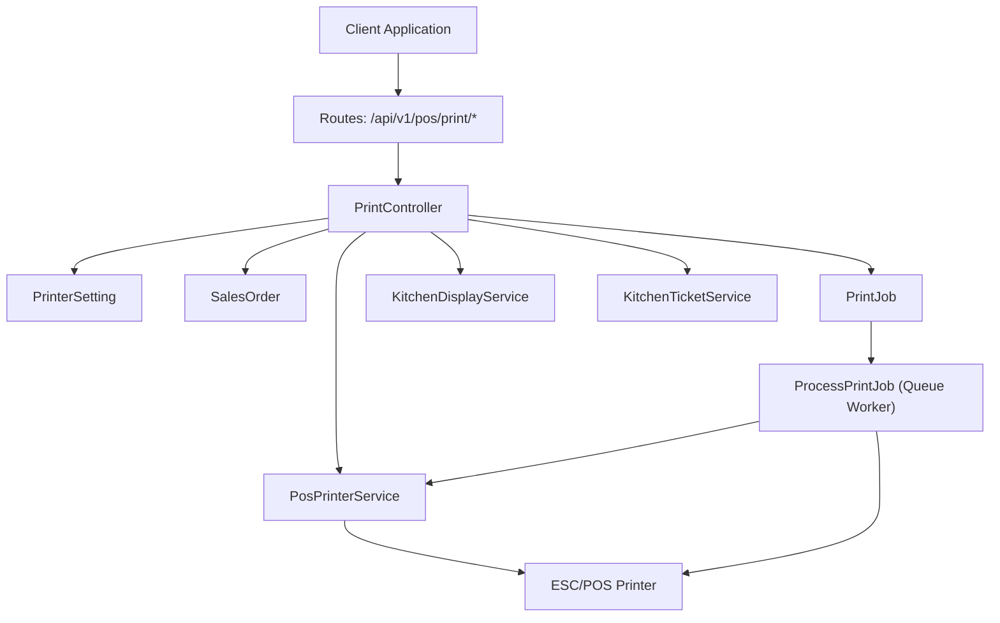
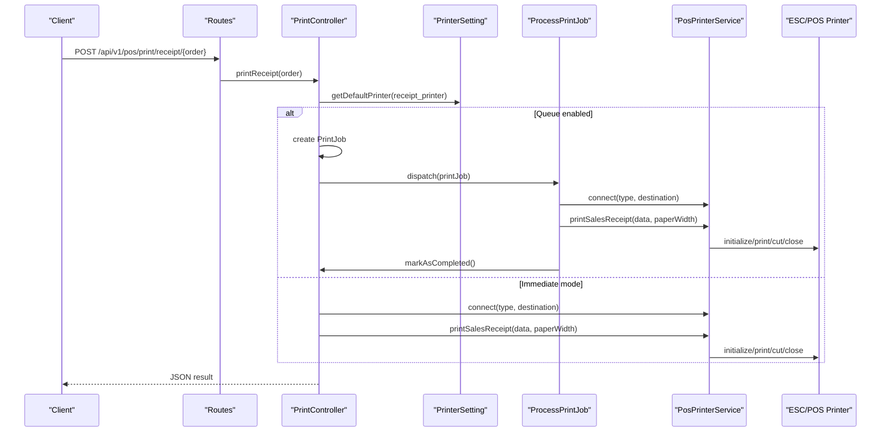
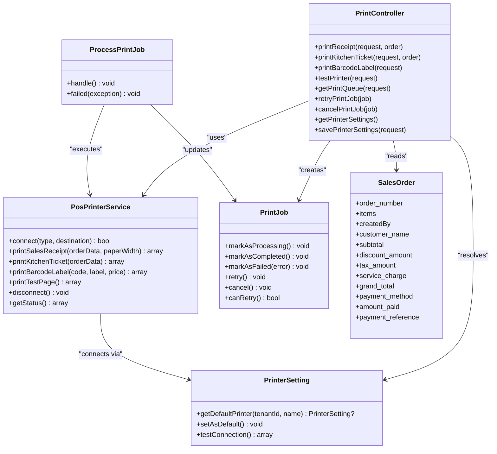

# POS Printing API

<cite>
**Referenced Files in This Document**
- [PrintController.php](file://app/Http/Controllers/Pos/PrintController.php)
- [ProcessPrintJob.php](file://app/Jobs/ProcessPrintJob.php)
- [PosPrinterService.php](file://app/Services/PosPrinterService.php)
- [PrinterSetting.php](file://app/Models/PrinterSetting.php)
- [PrintJob.php](file://app/Models/PrintJob.php)
- [pos_printer.php](file://config/pos_printer.php)
- [api.php](file://routes/api.php)
- [SalesOrder.php](file://app/Models/SalesOrder.php)
- [KitchenDisplayService.php](file://app/Services/KitchenDisplayService.php)
- [KitchenTicketService.php](file://app/Services/KitchenTicketService.php)
- [KitchenOrderTicket.php](file://app/Models/KitchenOrderTicket.php)
- [KitchenOrderItem.php](file://app/Models/KitchenOrderItem.php)
</cite>

## Table of Contents
1. [Introduction](#introduction)
2. [Project Structure](#project-structure)
3. [Core Components](#core-components)
4. [Architecture Overview](#architecture-overview)
5. [Detailed Component Analysis](#detailed-component-analysis)
6. [Dependency Analysis](#dependency-analysis)
7. [Performance Considerations](#performance-considerations)
8. [Troubleshooting Guide](#troubleshooting-guide)
9. [Conclusion](#conclusion)
10. [Appendices](#appendices)

## Introduction
This document provides comprehensive API documentation for POS printing functionality. It covers receipt printing, kitchen ticket generation, barcode label printing, and printer queue management. It also documents printer configuration, print job monitoring, retry mechanisms, printer status tracking, and integration with POS systems and kitchen display systems.

## Project Structure
The POS printing feature spans controllers, services, jobs, models, configuration, and routing:

- Controllers expose REST endpoints for printing operations and queue management
- Services encapsulate printer connectivity and formatting logic
- Jobs process print tasks asynchronously with retry and failure handling
- Models represent printer settings and print jobs
- Configuration defines printer types, destinations, and queue behavior
- Routing registers the POS print API endpoints

**Diagram sources**
- [api.php:93-104](file://routes/api.php#L93-L104)
- [PrintController.php:14-412](file://app/Http/Controllers/Pos/PrintController.php#L14-L412)
- [PosPrinterService.php:14-579](file://app/Services/PosPrinterService.php#L14-L579)
- [PrinterSetting.php:10-86](file://app/Models/PrinterSetting.php#L10-L86)
- [PrintJob.php:11-165](file://app/Models/PrintJob.php#L11-L165)
- [ProcessPrintJob.php:14-113](file://app/Jobs/ProcessPrintJob.php#L14-L113)
- [KitchenDisplayService.php:10-173](file://app/Services/KitchenDisplayService.php#L10-L173)
- [KitchenTicketService.php:22-266](file://app/Services/KitchenTicketService.php#L22-L266)

**Section sources**
- [api.php:93-104](file://routes/api.php#L93-L104)
- [PrintController.php:14-412](file://app/Http/Controllers/Pos/PrintController.php#L14-L412)
- [PosPrinterService.php:14-579](file://app/Services/PosPrinterService.php#L14-L579)
- [PrinterSetting.php:10-86](file://app/Models/PrinterSetting.php#L10-L86)
- [PrintJob.php:11-165](file://app/Models/PrintJob.php#L11-L165)
- [ProcessPrintJob.php:14-113](file://app/Jobs/ProcessPrintJob.php#L14-L113)
- [KitchenDisplayService.php:10-173](file://app/Services/KitchenDisplayService.php#L10-L173)
- [KitchenTicketService.php:22-266](file://app/Services/KitchenTicketService.php#L22-L266)

## Core Components
- PrintController: Exposes endpoints for receipts, kitchen tickets, barcode labels, printer diagnostics, queue management, and printer settings
- PosPrinterService: Manages printer connections (USB, network, file, CUPS), renders formatted output, and executes print commands
- ProcessPrintJob: Asynchronous job that connects to printers, executes print operations, handles retries, and updates job status
- PrinterSetting: Stores per-tenant printer configurations and supports default selection and connection testing
- PrintJob: Represents queued print tasks with status tracking and metadata
- KitchenDisplayService and KitchenTicketService: Manage kitchen ticket lifecycle and KDS integration
- Configuration: Defines printer types, destinations, queue behavior, and receipt settings

**Section sources**
- [PrintController.php:14-412](file://app/Http/Controllers/Pos/PrintController.php#L14-L412)
- [PosPrinterService.php:14-579](file://app/Services/PosPrinterService.php#L14-L579)
- [ProcessPrintJob.php:14-113](file://app/Jobs/ProcessPrintJob.php#L14-L113)
- [PrinterSetting.php:10-86](file://app/Models/PrinterSetting.php#L10-L86)
- [PrintJob.php:11-165](file://app/Models/PrintJob.php#L11-L165)
- [KitchenDisplayService.php:10-173](file://app/Services/KitchenDisplayService.php#L10-L173)
- [KitchenTicketService.php:22-266](file://app/Services/KitchenTicketService.php#L22-L266)
- [pos_printer.php:1-83](file://config/pos_printer.php#L1-L83)

## Architecture Overview
The POS printing architecture separates concerns across HTTP endpoints, service logic, asynchronous job processing, and printer drivers. The controller validates requests, prepares print data, and either prints immediately or queues jobs. The job worker connects to the configured printer, executes the appropriate print function, and manages retries and failures.

**Diagram sources**
- [api.php:93-104](file://routes/api.php#L93-L104)
- [PrintController.php:26-94](file://app/Http/Controllers/Pos/PrintController.php#L26-L94)
- [ProcessPrintJob.php:27-101](file://app/Jobs/ProcessPrintJob.php#L27-L101)
- [PosPrinterService.php:44-146](file://app/Services/PosPrinterService.php#L44-L146)
- [PrinterSetting.php:41-47](file://app/Models/PrinterSetting.php#L41-L47)

## Detailed Component Analysis

### PrintController
Responsibilities:
- Receipt printing: Prepares receipt data from SalesOrder, resolves default printer, and either prints immediately or enqueues a job
- Kitchen ticket printing: Creates kitchen tickets from SalesOrder and enqueues a job
- Barcode label printing: Validates input, resolves default barcode printer, and enqueues a job
- Printer diagnostics: Tests connection and prints a test page
- Queue management: Lists jobs, retries failed jobs, cancels pending/processing jobs
- Printer settings: Lists and saves printer configurations

Key behaviors:
- Uses PrinterSetting.getDefaultPrinter to resolve active default printers by name
- Uses ProcessPrintJob for asynchronous printing with retry logic
- Returns structured JSON responses with success/error fields

**Section sources**
- [PrintController.php:26-94](file://app/Http/Controllers/Pos/PrintController.php#L26-L94)
- [PrintController.php:99-154](file://app/Http/Controllers/Pos/PrintController.php#L99-L154)
- [PrintController.php:159-208](file://app/Http/Controllers/Pos/PrintController.php#L159-L208)
- [PrintController.php:213-244](file://app/Http/Controllers/Pos/PrintController.php#L213-L244)
- [PrintController.php:249-268](file://app/Http/Controllers/Pos/PrintController.php#L249-L268)
- [PrintController.php:273-297](file://app/Http/Controllers/Pos/PrintController.php#L273-L297)
- [PrintController.php:302-325](file://app/Http/Controllers/Pos/PrintController.php#L302-L325)
- [PrintController.php:330-373](file://app/Http/Controllers/Pos/PrintController.php#L330-L373)

### PosPrinterService
Responsibilities:
- Printer connection management: Supports USB, network, file, and CUPS connectors
- Receipt printing: Formats header, order info, items, totals, payment info, optional QR code, footer, and cut
- Kitchen ticket printing: Prints kitchen-specific layout with emphasis and notes
- Barcode label printing: Prints product name, barcode, and price
- Test page printing: Renders styled text, barcode, and QR code
- Utility methods: Status reporting, saving receipts to file, and disconnection

Implementation highlights:
- Uses CapabilityProfile for compatibility
- Handles exceptions gracefully and ensures printer closure
- Paper width support for 58mm and 80mm

**Section sources**
- [PosPrinterService.php:44-79](file://app/Services/PosPrinterService.php#L44-L79)
- [PosPrinterService.php:84-146](file://app/Services/PosPrinterService.php#L84-L146)
- [PosPrinterService.php:151-215](file://app/Services/PosPrinterService.php#L151-L215)
- [PosPrinterService.php:220-258](file://app/Services/PosPrinterService.php#L220-L258)
- [PosPrinterService.php:282-337](file://app/Services/PosPrinterService.php#L282-L337)
- [PosPrinterService.php:555-579](file://app/Services/PosPrinterService.php#L555-L579)

### ProcessPrintJob
Responsibilities:
- Asynchronous execution of print jobs
- Connection to printer based on job metadata
- Delegates to PosPrinterService based on job_type
- Updates job status to completed or failed
- Implements retry logic with configurable attempts and delay
- Ensures printer disconnection in finally block

Retry mechanism:
- Reads retry_attempts and retry_delay from configuration
- Releases job with delay if retry_count < maxRetries
- Marks job as failed otherwise

**Section sources**
- [ProcessPrintJob.php:27-101](file://app/Jobs/ProcessPrintJob.php#L27-L101)
- [ProcessPrintJob.php:103-112](file://app/Jobs/ProcessPrintJob.php#L103-L112)

### PrinterSetting
Responsibilities:
- Stores per-tenant printer configurations
- Provides getDefaultPrinter for resolving active default printers
- Supports setting a printer as default
- Tests printer connection and prints a test page via PosPrinterService

**Section sources**
- [PrinterSetting.php:41-47](file://app/Models/PrinterSetting.php#L41-L47)
- [PrinterSetting.php:52-61](file://app/Models/PrinterSetting.php#L52-L61)
- [PrinterSetting.php:66-84](file://app/Models/PrinterSetting.php#L66-L84)

### PrintJob
Responsibilities:
- Represents queued print tasks
- Tracks status transitions and timestamps
- Associates with tenant and customer
- Used by ProcessPrintJob for execution and status updates

**Section sources**
- [PrintJob.php:16-61](file://app/Models/PrintJob.php#L16-L61)
- [PrintJob.php:64-112](file://app/Models/PrintJob.php#L64-L112)
- [PrintJob.php:149-164](file://app/Models/PrintJob.php#L149-L164)

### Kitchen Display System Integration
- KitchenDisplayService orchestrates KDS operations: creating tickets from orders, retrieving active tickets, updating statuses, and computing statistics
- KitchenTicketService ensures idempotent creation of kitchen tickets, preventing duplicates on retries, validating counts, and cleaning up duplicates
- KitchenOrderTicket and KitchenOrderItem models represent KDS records and items

**Section sources**
- [KitchenDisplayService.php:15-86](file://app/Services/KitchenDisplayService.php#L15-L86)
- [KitchenTicketService.php:32-93](file://app/Services/KitchenTicketService.php#L32-L93)
- [KitchenTicketService.php:101-148](file://app/Services/KitchenTicketService.php#L101-L148)
- [KitchenTicketService.php:158-205](file://app/Services/KitchenTicketService.php#L158-L205)
- [KitchenOrderTicket.php:14-111](file://app/Models/KitchenOrderTicket.php#L14-L111)
- [KitchenOrderItem.php:10-49](file://app/Models/KitchenOrderItem.php#L10-L49)

### API Endpoints
Base path: /api/v1/pos/print

- POST /receipt/{order}
  - Description: Print a sales receipt for the given SalesOrder
  - Authentication: Required
  - Path parameters: order (SalesOrder ID)
  - Response: success, message/job_id or error

- POST /kitchen/{order}
  - Description: Print kitchen tickets for the given SalesOrder
  - Authentication: Required
  - Path parameters: order (SalesOrder ID)
  - Response: success, message/job_id or error

- POST /barcode
  - Description: Print a barcode label
  - Authentication: Required
  - Request body: code (string), label (optional), price (optional)
  - Response: success, message/job_id or error

- POST /test
  - Description: Test printer connection and print a test page
  - Authentication: Required
  - Request body: printer_type (usb/network/file/cups), printer_destination (string)
  - Response: success or error

- GET /queue
  - Description: List print jobs queue
  - Authentication: Required
  - Query parameters: status (optional), limit (default 50)
  - Response: success, data (paginated)

- POST /queue/{job}/retry
  - Description: Retry a failed print job
  - Authentication: Required
  - Path parameters: job (PrintJob ID)
  - Response: success or error

- POST /queue/{job}/cancel
  - Description: Cancel a pending or processing job
  - Authentication: Required
  - Path parameters: job (PrintJob ID)
  - Response: success or error

- GET /settings
  - Description: List printer settings for the tenant
  - Authentication: Required
  - Response: success, data (PrinterSetting[])

- POST /settings
  - Description: Save printer settings
  - Authentication: Required
  - Request body: printer_name (receipt_printer/kitchen_printer/barcode_printer), printer_type, printer_destination, paper_width, is_active, is_default, settings
  - Response: success or error

**Section sources**
- [api.php:93-104](file://routes/api.php#L93-L104)
- [PrintController.php:26-94](file://app/Http/Controllers/Pos/PrintController.php#L26-L94)
- [PrintController.php:99-154](file://app/Http/Controllers/Pos/PrintController.php#L99-L154)
- [PrintController.php:159-208](file://app/Http/Controllers/Pos/PrintController.php#L159-L208)
- [PrintController.php:213-244](file://app/Http/Controllers/Pos/PrintController.php#L213-L244)
- [PrintController.php:249-268](file://app/Http/Controllers/Pos/PrintController.php#L249-L268)
- [PrintController.php:273-297](file://app/Http/Controllers/Pos/PrintController.php#L273-L297)
- [PrintController.php:302-325](file://app/Http/Controllers/Pos/PrintController.php#L302-L325)
- [PrintController.php:330-373](file://app/Http/Controllers/Pos/PrintController.php#L330-L373)

### Configuration
Key configuration options under config/pos_printer.php:
- default_type, default_destination, paper_width
- receipt: company_name, address, phone, email, website, footer_text, show_tax_breakdown, show_service_charge, show_qr_code, tax_rate, service_charge_rate
- kitchen: enabled, type, destination, paper_width
- barcode: enabled, type, destination, label_width, label_height
- queue: enabled, driver, retry_attempts, retry_delay
- log_prints, log_level

These settings influence default printer behavior, receipt formatting, and queue operation.

**Section sources**
- [pos_printer.php:13-82](file://config/pos_printer.php#L13-L82)

## Dependency Analysis
The following diagram shows dependencies among major components:

**Diagram sources**
- [PrintController.php:14-412](file://app/Http/Controllers/Pos/PrintController.php#L14-L412)
- [PosPrinterService.php:14-579](file://app/Services/PosPrinterService.php#L14-L579)
- [ProcessPrintJob.php:14-113](file://app/Jobs/ProcessPrintJob.php#L14-L113)
- [PrinterSetting.php:10-86](file://app/Models/PrinterSetting.php#L10-L86)
- [PrintJob.php:11-165](file://app/Models/PrintJob.php#L11-L165)
- [SalesOrder.php:13-123](file://app/Models/SalesOrder.php#L13-L123)

**Section sources**
- [PrintController.php:14-412](file://app/Http/Controllers/Pos/PrintController.php#L14-L412)
- [PosPrinterService.php:14-579](file://app/Services/PosPrinterService.php#L14-L579)
- [ProcessPrintJob.php:14-113](file://app/Jobs/ProcessPrintJob.php#L14-L113)
- [PrinterSetting.php:10-86](file://app/Models/PrinterSetting.php#L10-L86)
- [PrintJob.php:11-165](file://app/Models/PrintJob.php#L11-L165)
- [SalesOrder.php:13-123](file://app/Models/SalesOrder.php#L13-L123)

## Performance Considerations
- Queue processing: Use asynchronous jobs to avoid blocking HTTP requests; configure retry_attempts and retry_delay appropriately
- Printer timeouts: The job sets a timeout to prevent long-running operations; adjust based on printer responsiveness
- Paper width formatting: Choose appropriate paper width to minimize truncation and reprints
- Logging: Enable logging judiciously to avoid excessive I/O overhead
- KDS ticket creation: Idempotent creation prevents duplicate tickets and reduces cleanup work

[No sources needed since this section provides general guidance]

## Troubleshooting Guide
Common issues and resolutions:
- Printer connection failures
  - Verify printer_type and printer_destination in configuration or settings
  - Use the test endpoint to validate connectivity
  - Check network connectivity for network printers and permissions for file/CUPS printers
- Print job failures
  - Inspect job status and retry attempts; use retry endpoint to requeue
  - Review job logs for detailed error messages
  - Ensure printer is online and not out of paper or in error state
- Kitchen tickets not appearing
  - Confirm kitchen printer settings are active and properly configured
  - Check KDS statistics and overdue tickets
  - Validate ticket creation idempotency and cleanup procedures
- Receipt formatting problems
  - Adjust paper width and receipt formatting options in configuration
  - Validate receipt data preparation from SalesOrder

**Section sources**
- [PrintController.php:213-244](file://app/Http/Controllers/Pos/PrintController.php#L213-L244)
- [ProcessPrintJob.php:76-96](file://app/Jobs/ProcessPrintJob.php#L76-L96)
- [PrinterSetting.php:66-84](file://app/Models/PrinterSetting.php#L66-L84)
- [KitchenDisplayService.php:62-86](file://app/Services/KitchenDisplayService.php#L62-L86)
- [KitchenTicketService.php:32-93](file://app/Services/KitchenTicketService.php#L32-L93)

## Conclusion
The POS printing API provides robust capabilities for receipt printing, kitchen ticket generation, barcode label printing, and queue management. It integrates seamlessly with POS and KDS systems through configurable printer settings, asynchronous job processing, and idempotent kitchen ticket creation. Proper configuration and monitoring ensure reliable printing operations across diverse environments.

[No sources needed since this section summarizes without analyzing specific files]

## Appendices

### Example: Print Receipt
- Endpoint: POST /api/v1/pos/print/receipt/{order}
- Behavior: Resolves default receipt printer, prepares receipt data from SalesOrder, and either prints immediately or enqueues a job depending on configuration

**Section sources**
- [PrintController.php:26-94](file://app/Http/Controllers/Pos/PrintController.php#L26-L94)
- [SalesOrder.php:13-123](file://app/Models/SalesOrder.php#L13-L123)

### Example: Print Kitchen Ticket
- Endpoint: POST /api/v1/pos/print/kitchen/{order}
- Behavior: Prepares kitchen ticket data from SalesOrder and enqueues a job for kitchen printer

**Section sources**
- [PrintController.php:99-154](file://app/Http/Controllers/Pos/PrintController.php#L99-L154)

### Example: Print Barcode Label
- Endpoint: POST /api/v1/pos/print/barcode
- Behavior: Validates code, label, and price; enqueues a job for barcode printer

**Section sources**
- [PrintController.php:159-208](file://app/Http/Controllers/Pos/PrintController.php#L159-L208)

### Example: Printer Diagnostics
- Endpoint: POST /api/v1/pos/print/test
- Behavior: Tests connection with provided printer_type and printer_destination, then prints a test page

**Section sources**
- [PrintController.php:213-244](file://app/Http/Controllers/Pos/PrintController.php#L213-L244)

### Example: Queue Management
- List jobs: GET /api/v1/pos/print/queue?status=&limit=
- Retry job: POST /api/v1/pos/print/queue/{job}/retry
- Cancel job: POST /api/v1/pos/print/queue/{job}/cancel

**Section sources**
- [PrintController.php:249-268](file://app/Http/Controllers/Pos/PrintController.php#L249-L268)
- [PrintController.php:273-297](file://app/Http/Controllers/Pos/PrintController.php#L273-L297)
- [PrintController.php:302-325](file://app/Http/Controllers/Pos/PrintController.php#L302-L325)

### Example: Printer Settings
- List settings: GET /api/v1/pos/print/settings
- Save settings: POST /api/v1/pos/print/settings with printer_name, printer_type, printer_destination, paper_width, is_active, is_default, settings

**Section sources**
- [PrintController.php:330-373](file://app/Http/Controllers/Pos/PrintController.php#L330-L373)