# Gateway Management

<cite>
**Referenced Files in This Document**
- [PaymentGatewayService.php](file://app/Services/PaymentGatewayService.php)
- [TenantPaymentGateway.php](file://app/Models/TenantPaymentGateway.php)
- [PaymentGateway.php](file://app/Models/PaymentGateway.php)
- [PaymentGatewayController.php](file://app/Http/Controllers/PaymentGatewayController.php)
- [PaymentGatewayService.php (Integrations)](file://app/Services/Integrations/PaymentGatewayService.php)
- [2026_04_04_900000_create_payment_gateway_tables.php](file://database/migrations/2026_04_04_900000_create_payment_gateway_tables.php)
- [payment-gateways.blade.php](file://resources/views/settings/payment-gateways.blade.php)
- [EncryptionService.php](file://app/Services/Security/EncryptionService.php)
</cite>

## Table of Contents
1. [Introduction](#introduction)
2. [Project Structure](#project-structure)
3. [Core Components](#core-components)
4. [Architecture Overview](#architecture-overview)
5. [Detailed Component Analysis](#detailed-component-analysis)
6. [Dependency Analysis](#dependency-analysis)
7. [Performance Considerations](#performance-considerations)
8. [Troubleshooting Guide](#troubleshooting-guide)
9. [Conclusion](#conclusion)
10. [Appendices](#appendices)

## Introduction
This document explains the payment gateway management capabilities of the system with a focus on:
- Gateway configuration via getGatewaySettings() and saveGatewaySettings() patterns
- Provider setup for midtrans, xendit, duitku, and tripay
- Environment configuration (sandbox/production), credential encryption, webhook secret management, and default gateway selection
- Examples of gateway activation/deactivation, testing procedures, and credential verification
- Security considerations for credential storage and transmission

The implementation centers around two primary services and supporting models, with database-backed configuration and UI-driven management.

## Project Structure
The gateway management system spans services, models, controllers, migrations, and UI templates:
- Services orchestrate provider-specific flows, webhook handling, and credential verification
- Models encapsulate tenant-scoped gateway configurations and transaction records
- Migrations define the schema for gateway configs, transactions, and webhook logs
- Blade templates provide the admin UI for configuration, activation toggling, and testing

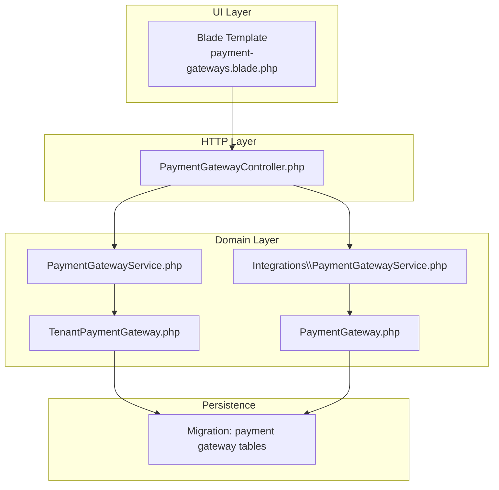

**Diagram sources**
- [payment-gateways.blade.php](file://resources/views/settings/payment-gateways.blade.php)
- [PaymentGatewayController.php](file://app/Http/Controllers/PaymentGatewayController.php)
- [PaymentGatewayService.php](file://app/Services/PaymentGatewayService.php)
- [PaymentGatewayService.php (Integrations)](file://app/Services/Integrations/PaymentGatewayService.php)
- [TenantPaymentGateway.php](file://app/Models/TenantPaymentGateway.php)
- [PaymentGateway.php](file://app/Models/PaymentGateway.php)
- [2026_04_04_900000_create_payment_gateway_tables.php](file://database/migrations/2026_04_04_900000_create_payment_gateway_tables.php)

**Section sources**
- [PaymentGatewayService.php:13-26](file://app/Services/PaymentGatewayService.php#L13-L26)
- [TenantPaymentGateway.php:11-36](file://app/Models/TenantPaymentGateway.php#L11-L36)
- [PaymentGateway.php:10-33](file://app/Models/PaymentGateway.php#L10-L33)
- [2026_04_04_900000_create_payment_gateway_tables.php:7-92](file://database/migrations/2026_04_04_900000_create_payment_gateway_tables.php#L7-L92)

## Core Components
- PaymentGatewayService (tenant-scoped): orchestrates QRIS generation, status checks, webhook handling, and credential verification for midtrans and xendit
- Integrations PaymentGatewayService: legacy service for direct provider integrations (midtrans/xendit/duitku) with invoice/charge creation and webhook handling
- TenantPaymentGateway: tenant-scoped configuration with encrypted credentials, environment, webhook settings, and default selection
- PaymentGateway: global provider configuration (legacy) with environment and API keys
- PaymentGatewayController: subscription checkout and webhook handlers for midtrans/xendit
- Migration: defines tenant_payment_gateways, payment_transactions, and payment_callbacks tables

Key responsibilities:
- Configuration: getGatewaySettings(), saveGatewaySettings() patterns are implemented via TenantPaymentGateway model attributes and service methods
- Environment: provider environment selection (sandbox vs production) drives base URLs and credential retrieval
- Security: credentials stored encrypted; webhook signatures verified; optional webhook secret per provider
- Default selection: is_default flag selects the preferred gateway for tenant

**Section sources**
- [PaymentGatewayService.php:13-26](file://app/Services/PaymentGatewayService.php#L13-L26)
- [TenantPaymentGateway.php:11-36](file://app/Models/TenantPaymentGateway.php#L11-L36)
- [PaymentGateway.php:10-33](file://app/Models/PaymentGateway.php#L10-L33)
- [PaymentGatewayController.php:14-275](file://app/Http/Controllers/PaymentGatewayController.php#L14-L275)
- [2026_04_04_900000_create_payment_gateway_tables.php:7-92](file://database/migrations/2026_04_04_900000_create_payment_gateway_tables.php#L7-L92)

## Architecture Overview
The system supports two major flows:
- POS/QRIS payments via tenant-scoped gateway (PaymentGatewayService)
- Subscription payments via controller handlers and legacy integration service

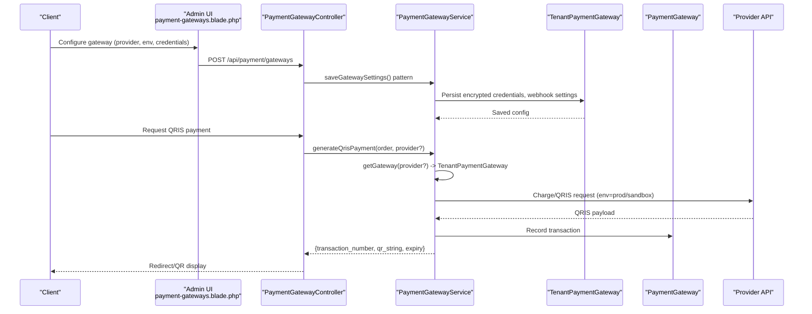

**Diagram sources**
- [payment-gateways.blade.php:330-445](file://resources/views/settings/payment-gateways.blade.php#L330-L445)
- [PaymentGatewayController.php:18-85](file://app/Http/Controllers/PaymentGatewayController.php#L18-L85)
- [PaymentGatewayService.php:31-104](file://app/Services/PaymentGatewayService.php#L31-L104)
- [TenantPaymentGateway.php:46-57](file://app/Models/TenantPaymentGateway.php#L46-L57)
- [2026_04_04_900000_create_payment_gateway_tables.php:11-64](file://database/migrations/2026_04_04_900000_create_payment_gateway_tables.php#L11-L64)

## Detailed Component Analysis

### Tenant Payment Gateway Configuration
- Storage: credentials stored as encrypted arrays; environment set to sandbox or production; webhook URL and secret optional
- Selection: default gateway selected via is_default flag; fallback to active gateway if no default exists
- Credential lifecycle: setCredentials() persists encrypted; getDecryptedCredentials() returns decrypted array for provider calls
- Verification: verifyCredentials() delegates to PaymentGatewayService.verifyGateway()

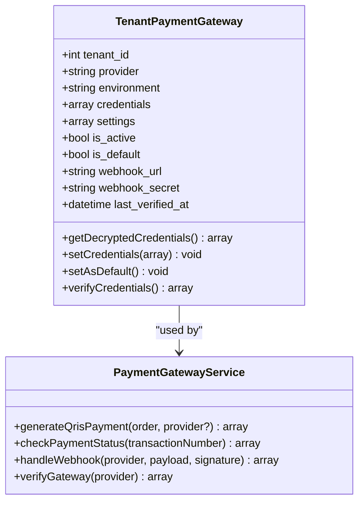

**Diagram sources**
- [TenantPaymentGateway.php:11-91](file://app/Models/TenantPaymentGateway.php#L11-L91)
- [PaymentGatewayService.php:13-26](file://app/Services/PaymentGatewayService.php#L13-L26)

**Section sources**
- [TenantPaymentGateway.php:11-91](file://app/Models/TenantPaymentGateway.php#L11-L91)
- [PaymentGatewayService.php:591-635](file://app/Services/PaymentGatewayService.php#L591-L635)

### Provider Setup: Midtrans
- Environment routing: production vs sandbox base URLs for charge/status/checkouts
- Credentials: server_key used for BasicAuth; optional client_key for Snap checkout (subscription)
- QRIS flow: charge endpoint returns redirect/QR; status endpoint updates local transaction
- Webhook: signature verification performed; payload mapped to internal statuses; order updated on success

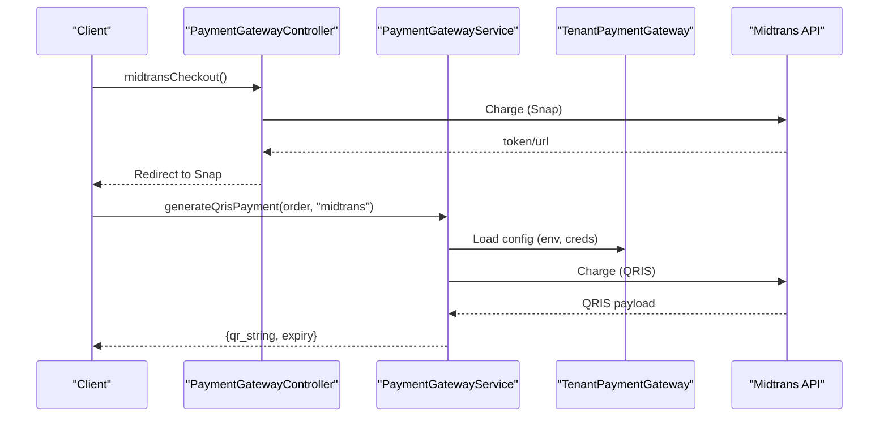

**Diagram sources**
- [PaymentGatewayController.php:18-85](file://app/Http/Controllers/PaymentGatewayController.php#L18-L85)
- [PaymentGatewayService.php:254-302](file://app/Services/PaymentGatewayService.php#L254-L302)
- [PaymentGatewayService.php:304-350](file://app/Services/PaymentGatewayService.php#L304-L350)

**Section sources**
- [PaymentGatewayController.php:18-85](file://app/Http/Controllers/PaymentGatewayController.php#L18-L85)
- [PaymentGatewayService.php:254-302](file://app/Services/PaymentGatewayService.php#L254-L302)
- [PaymentGatewayService.php:304-350](file://app/Services/PaymentGatewayService.php#L304-L350)

### Provider Setup: Xendit
- Environment: single base URL used regardless of sandbox/production
- Credentials: api_key used for BasicAuth
- QRIS flow: QR code creation endpoint returns qr_string/qr_url; status endpoint updates local transaction
- Webhook: payload mapped to internal statuses; order updated on success

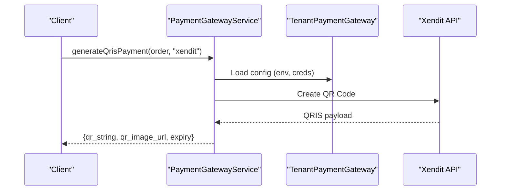

**Diagram sources**
- [PaymentGatewayService.php:434-476](file://app/Services/PaymentGatewayService.php#L434-L476)
- [PaymentGatewayService.php:478-517](file://app/Services/PaymentGatewayService.php#L478-L517)

**Section sources**
- [PaymentGatewayService.php:434-476](file://app/Services/PaymentGatewayService.php#L434-L476)
- [PaymentGatewayService.php:478-517](file://app/Services/PaymentGatewayService.php#L478-L517)

### Provider Setup: Duitku and TriPay
- Duitku: webhook handler present in integration service; implementation follows similar patterns to midtrans/xendit
- TriPay: provider constant defined; webhook handler present in integration service; implementation follows similar patterns

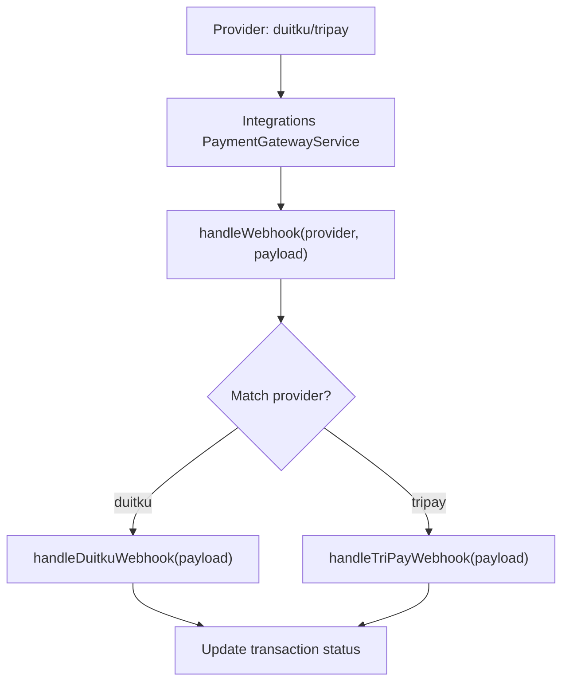

**Diagram sources**
- [PaymentGatewayService.php (Integrations):168-185](file://app/Services/Integrations/PaymentGatewayService.php#L168-L185)
- [PaymentGatewayService.php (Integrations):253-258](file://app/Services/Integrations/PaymentGatewayService.php#L253-L258)

**Section sources**
- [PaymentGatewayService.php (Integrations):168-185](file://app/Services/Integrations/PaymentGatewayService.php#L168-L185)
- [PaymentGatewayService.php (Integrations):253-258](file://app/Services/Integrations/PaymentGatewayService.php#L253-L258)

### Environment Configuration (Sandbox vs Production)
- TenantPaymentGateway.environment determines base URLs and credential selection for provider APIs
- Legacy PaymentGateway also stores environment and API keys for direct integrations

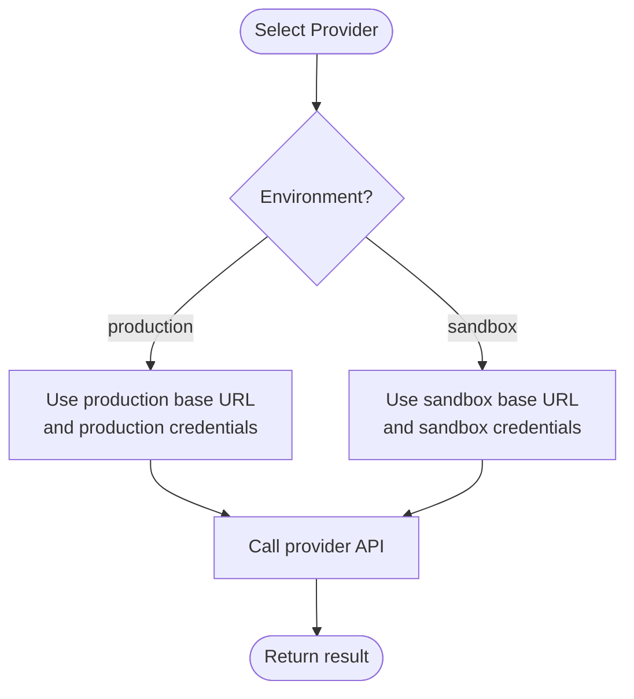

**Diagram sources**
- [TenantPaymentGateway.php:11-36](file://app/Models/TenantPaymentGateway.php#L11-L36)
- [PaymentGatewayService.php:258-262](file://app/Services/PaymentGatewayService.php#L258-L262)
- [PaymentGatewayService.php:438-442](file://app/Services/PaymentGatewayService.php#L438-L442)

**Section sources**
- [TenantPaymentGateway.php:11-36](file://app/Models/TenantPaymentGateway.php#L11-L36)
- [PaymentGatewayService.php:258-262](file://app/Services/PaymentGatewayService.php#L258-L262)
- [PaymentGatewayService.php:438-442](file://app/Services/PaymentGatewayService.php#L438-L442)

### Credential Encryption and Storage
- TenantPaymentGateway.credentials are cast as encrypted arrays; Laravel’s encryption is applied transparently
- EncryptionService provides a reusable pattern for encrypting/decrypting sensitive data with tenant scoping

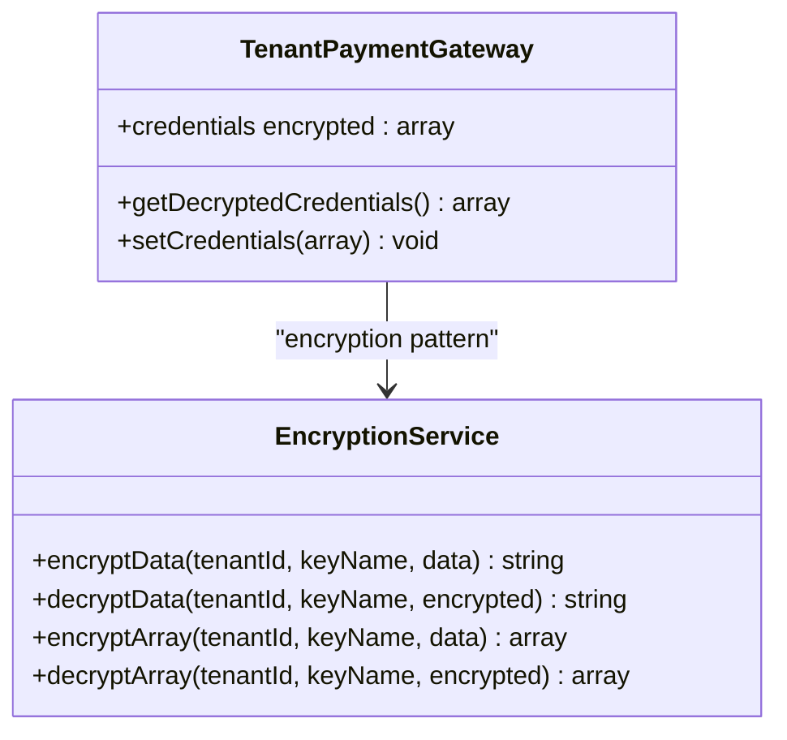

**Diagram sources**
- [TenantPaymentGateway.php:27-57](file://app/Models/TenantPaymentGateway.php#L27-L57)
- [EncryptionService.php:13-52](file://app/Services/Security/EncryptionService.php#L13-L52)

**Section sources**
- [TenantPaymentGateway.php:27-57](file://app/Models/TenantPaymentGateway.php#L27-L57)
- [EncryptionService.php:13-52](file://app/Services/Security/EncryptionService.php#L13-L52)

### Webhook Secret Management and Verification
- Webhook URL: configurable per gateway; defaults to route-based URL if not provided
- Signature verification: HMAC-SHA256 computed from payload using webhook_secret; verification skipped if secret not configured
- Callback logging: payload, signature, verification result, and processing outcome recorded

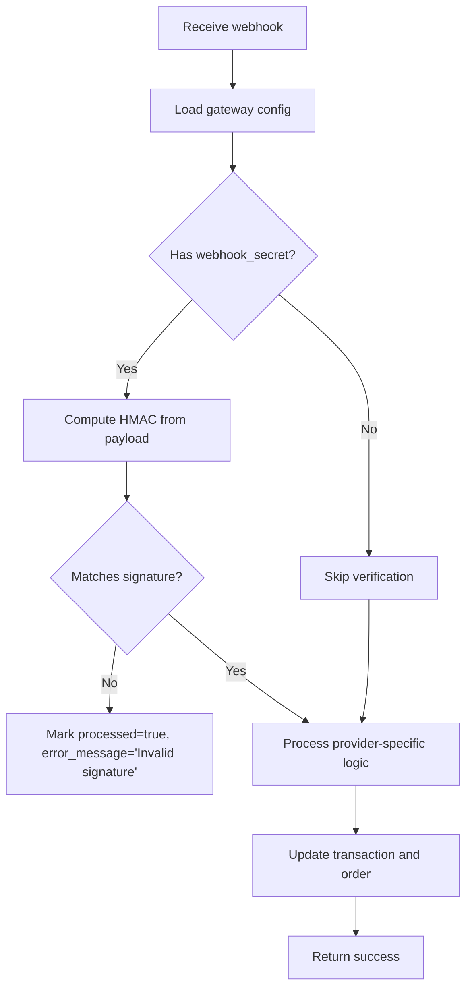

**Diagram sources**
- [TenantPaymentGateway.php:96-103](file://app/Models/TenantPaymentGateway.php#L96-L103)
- [PaymentGatewayService.php:622-635](file://app/Services/PaymentGatewayService.php#L622-L635)
- [PaymentGatewayService.php:166-217](file://app/Services/PaymentGatewayService.php#L166-L217)

**Section sources**
- [TenantPaymentGateway.php:96-103](file://app/Models/TenantPaymentGateway.php#L96-L103)
- [PaymentGatewayService.php:622-635](file://app/Services/PaymentGatewayService.php#L622-L635)
- [PaymentGatewayService.php:166-217](file://app/Services/PaymentGatewayService.php#L166-L217)

### Default Gateway Selection
- Default gateway: selected via is_default flag for the active provider
- Fallback resolution: if no default, service resolves to the first active gateway for the tenant

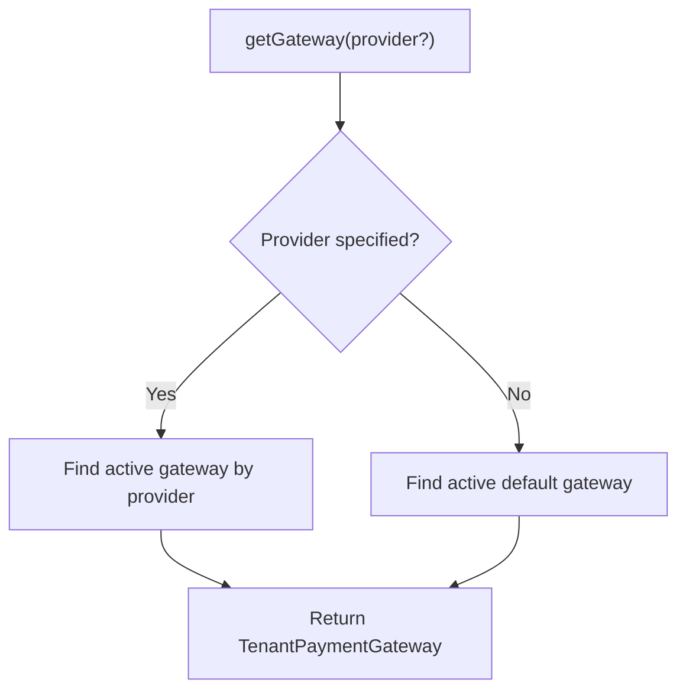

**Diagram sources**
- [PaymentGatewayService.php:591-605](file://app/Services/PaymentGatewayService.php#L591-L605)

**Section sources**
- [PaymentGatewayService.php:591-605](file://app/Services/PaymentGatewayService.php#L591-L605)
- [TenantPaymentGateway.php:83-91](file://app/Models/TenantPaymentGateway.php#L83-L91)

### Configuration Methods: getGatewaySettings() and saveGatewaySettings()
- getGatewaySettings(): implemented via TenantPaymentGateway model getters and service lookup methods
- saveGatewaySettings(): implemented via setCredentials() and attribute updates; UI triggers via API endpoints

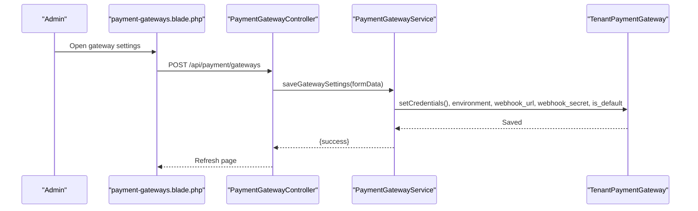

**Diagram sources**
- [payment-gateways.blade.php:359-387](file://resources/views/settings/payment-gateways.blade.php#L359-L387)
- [PaymentGatewayController.php:18-85](file://app/Http/Controllers/PaymentGatewayController.php#L18-L85)
- [TenantPaymentGateway.php:54-57](file://app/Models/TenantPaymentGateway.php#L54-L57)

**Section sources**
- [payment-gateways.blade.php:359-387](file://resources/views/settings/payment-gateways.blade.php#L359-L387)
- [TenantPaymentGateway.php:54-57](file://app/Models/TenantPaymentGateway.php#L54-L57)

### Activation/Deactivation and Testing Procedures
- Activation/Deactivation: UI toggles gateway active state; service resolves active gateways for QRIS generation
- Testing: UI invokes /api/payment/gateways/test; service verifies provider credentials against live endpoints

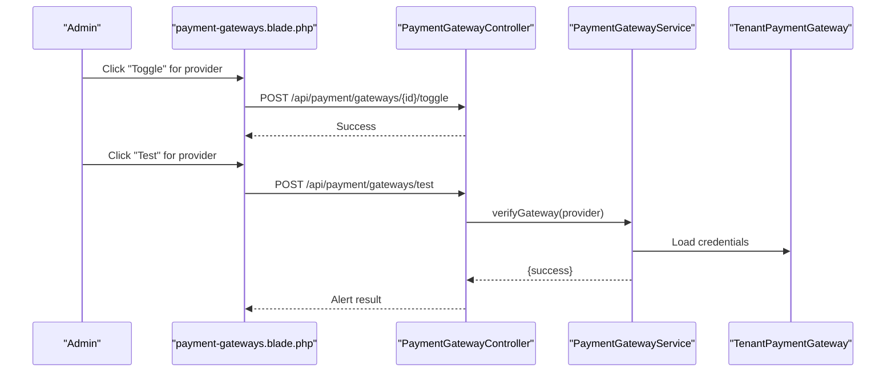

**Diagram sources**
- [payment-gateways.blade.php:415-436](file://resources/views/settings/payment-gateways.blade.php#L415-L436)
- [payment-gateways.blade.php:389-413](file://resources/views/settings/payment-gateways.blade.php#L389-L413)
- [PaymentGatewayService.php:222-250](file://app/Services/PaymentGatewayService.php#L222-L250)
- [TenantPaymentGateway.php:108-128](file://app/Models/TenantPaymentGateway.php#L108-L128)

**Section sources**
- [payment-gateways.blade.php:415-436](file://resources/views/settings/payment-gateways.blade.php#L415-L436)
- [payment-gateways.blade.php:389-413](file://resources/views/settings/payment-gateways.blade.php#L389-L413)
- [PaymentGatewayService.php:222-250](file://app/Services/PaymentGatewayService.php#L222-L250)
- [TenantPaymentGateway.php:108-128](file://app/Models/TenantPaymentGateway.php#L108-L128)

### Security Considerations
- Credential storage: credentials are encrypted at rest; decryption occurs only during provider API calls
- Transmission: BasicAuth with server/api keys; avoid logging raw credentials
- Webhook security: enforce HMAC verification; log unverified attempts; sanitize payload before processing
- Least privilege: use provider-specific keys; restrict webhook URL exposure; monitor callback logs

**Section sources**
- [TenantPaymentGateway.php:27-57](file://app/Models/TenantPaymentGateway.php#L27-L57)
- [PaymentGatewayService.php:622-635](file://app/Services/PaymentGatewayService.php#L622-L635)
- [PaymentGatewayService.php:166-217](file://app/Services/PaymentGatewayService.php#L166-L217)

## Dependency Analysis
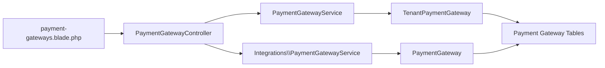

**Diagram sources**
- [payment-gateways.blade.php:330-445](file://resources/views/settings/payment-gateways.blade.php#L330-L445)
- [PaymentGatewayController.php:14-275](file://app/Http/Controllers/PaymentGatewayController.php#L14-L275)
- [PaymentGatewayService.php:13-26](file://app/Services/PaymentGatewayService.php#L13-L26)
- [PaymentGatewayService.php (Integrations):10-10](file://app/Services/Integrations/PaymentGatewayService.php#L10-L10)
- [TenantPaymentGateway.php:11-41](file://app/Models/TenantPaymentGateway.php#L11-L41)
- [PaymentGateway.php:10-43](file://app/Models/PaymentGateway.php#L10-L43)
- [2026_04_04_900000_create_payment_gateway_tables.php:7-92](file://database/migrations/2026_04_04_900000_create_payment_gateway_tables.php#L7-L92)

**Section sources**
- [PaymentGatewayService.php:13-26](file://app/Services/PaymentGatewayService.php#L13-L26)
- [PaymentGatewayService.php (Integrations):10-10](file://app/Services/Integrations/PaymentGatewayService.php#L10-L10)
- [TenantPaymentGateway.php:11-41](file://app/Models/TenantPaymentGateway.php#L11-L41)
- [PaymentGateway.php:10-43](file://app/Models/PaymentGateway.php#L10-L43)

## Performance Considerations
- Minimize external API calls: batch webhook processing, cache provider endpoints where safe
- Indexing: leverage existing indices on tenant_id, status, created_at, and gateway_transaction_id
- Asynchronous processing: offload heavy webhook processing to jobs for scalability
- Circuit breakers: implement retry policies and timeouts for provider API calls

[No sources needed since this section provides general guidance]

## Troubleshooting Guide
Common issues and resolutions:
- No payment gateway configured: ensure TenantPaymentGateway exists with is_active=true and optional is_default
- Invalid webhook signature: verify webhook_secret matches provider configuration; check payload serialization
- Credential verification failures: confirm environment setting and key correctness; test against provider sandbox
- Status sync delays: poll status endpoint periodically until terminal state; rely on webhook for real-time updates

**Section sources**
- [PaymentGatewayService.php:38-42](file://app/Services/PaymentGatewayService.php#L38-L42)
- [PaymentGatewayService.php:138-143](file://app/Services/PaymentGatewayService.php#L138-L143)
- [PaymentGatewayService.php:182-192](file://app/Services/PaymentGatewayService.php#L182-L192)
- [PaymentGatewayService.php:229-234](file://app/Services/PaymentGatewayService.php#L229-L234)

## Conclusion
The gateway management system provides a robust, tenant-isolated foundation for integrating multiple payment providers. It emphasizes secure credential handling, flexible environment configuration, and reliable webhook processing. Administrators can configure, test, and manage gateways through the UI, while developers can extend support for additional providers by following established patterns in the services and models.

[No sources needed since this section summarizes without analyzing specific files]

## Appendices

### Data Model Overview
```mermaid
erDiagram
TENANT_PAYMENT_GATEWAYS {
bigint id PK
bigint tenant_id FK
string provider
string environment
json credentials
json settings
boolean is_active
boolean is_default
text webhook_url
string webhook_secret
timestamp last_verified_at
timestamps
}
PAYMENT_TRANSACTIONS {
bigint id PK
bigint tenant_id FK
bigint sales_order_id FK
string transaction_number UK
string gateway_provider
string gateway_transaction_id
string payment_method
string payment_channel
decimal amount
decimal fee
decimal net_amount
enum status
text gateway_response
string qr_string
string qr_image_url
timestamp paid_at
timestamp expired_at
text failure_reason
json metadata
timestamps
}
PAYMENT_CALLBACKS {
bigint id PK
bigint tenant_id FK
bigint payment_transaction_id FK
string gateway_provider
string event_type
json payload
string signature
boolean verified
boolean processed
text error_message
timestamp processed_at
timestamps
}
TENANT_PAYMENT_GATEWAYS ||--o{ PAYMENT_TRANSACTIONS : "configures"
PAYMENT_TRANSACTIONS ||--o{ PAYMENT_CALLBACKS : "logs"
```

**Diagram sources**
- [2026_04_04_900000_create_payment_gateway_tables.php:11-83](file://database/migrations/2026_04_04_900000_create_payment_gateway_tables.php#L11-L83)