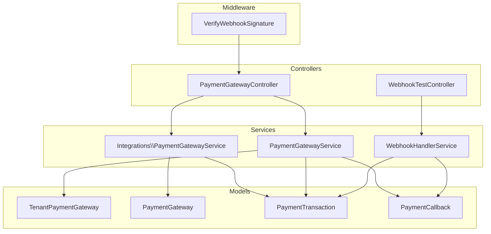
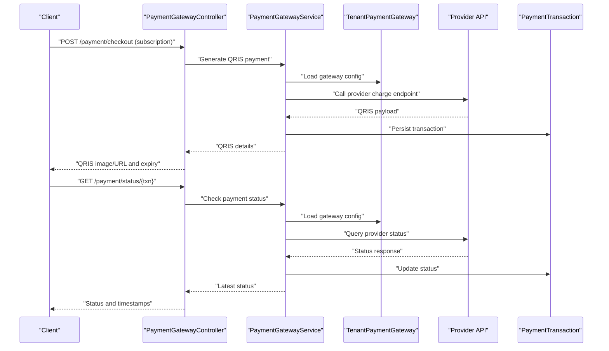
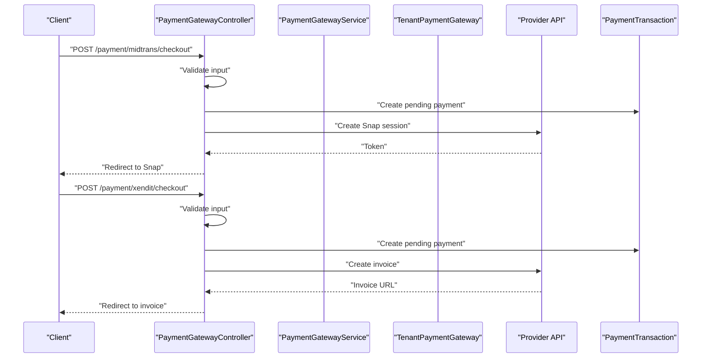
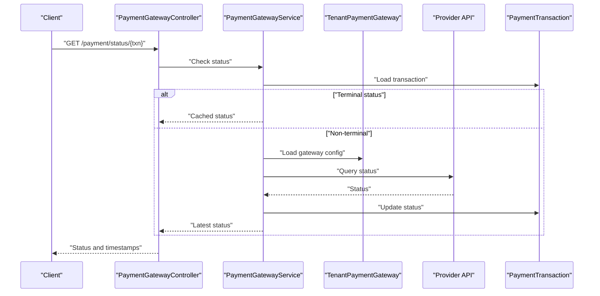
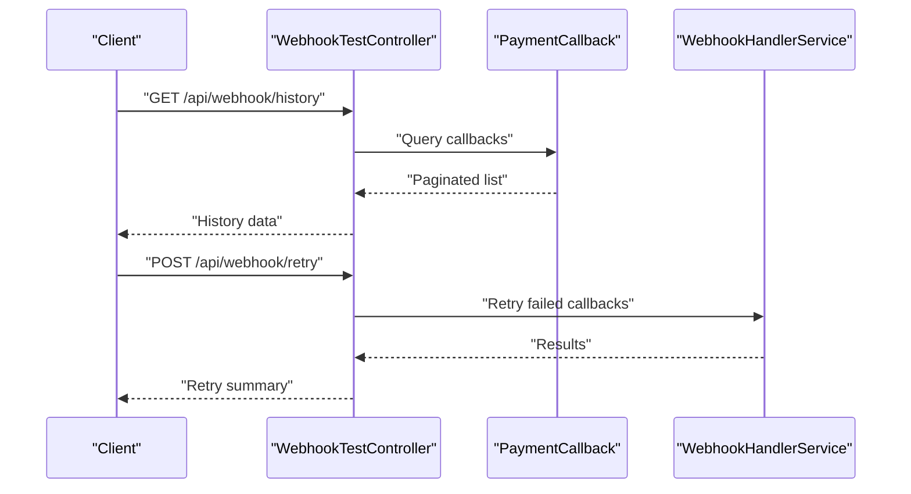
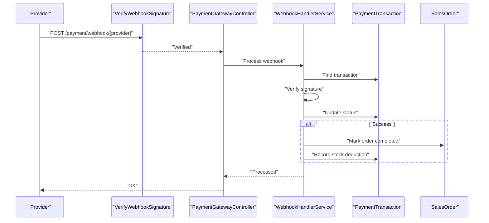
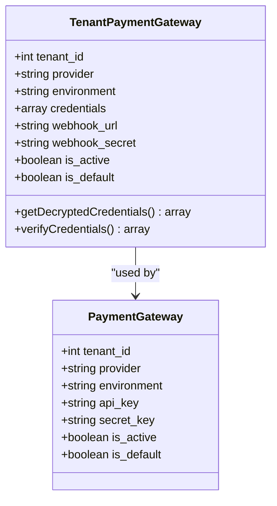
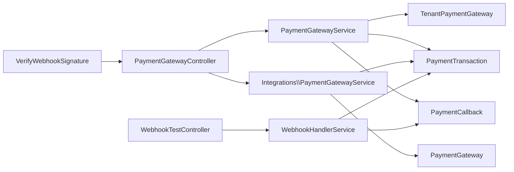

# Payment Gateway API

<cite>
**Referenced Files in This Document**
- [PaymentGatewayService.php](file://app/Services/PaymentGatewayService.php)
- [Integrations/PaymentGatewayService.php](file://app/Services/Integrations/PaymentGatewayService.php)
- [PaymentGatewayController.php](file://app/Http/Controllers/PaymentGatewayController.php)
- [PaymentGateway.php](file://app/Models/PaymentGateway.php)
- [TenantPaymentGateway.php](file://app/Models/TenantPaymentGateway.php)
- [PaymentTransaction.php](file://app/Models/PaymentTransaction.php)
- [PaymentCallback.php](file://app/Models/PaymentCallback.php)
- [VerifyWebhookSignature.php](file://app/Http/Middleware/VerifyWebhookSignature.php)
- [WebhookHandlerService.php](file://app/Services/WebhookHandlerService.php)
- [WebhookTestController.php](file://app/Http/Controllers/Api/WebhookTestController.php)
</cite>

## Table of Contents
1. [Introduction](#introduction)
2. [Project Structure](#project-structure)
3. [Core Components](#core-components)
4. [Architecture Overview](#architecture-overview)
5. [Detailed Component Analysis](#detailed-component-analysis)
6. [Dependency Analysis](#dependency-analysis)
7. [Performance Considerations](#performance-considerations)
8. [Security and PCI Compliance](#security-and-pci-compliance)
9. [Troubleshooting Guide](#troubleshooting-guide)
10. [Conclusion](#conclusion)
11. [Appendices](#appendices)

## Introduction
This document provides comprehensive API documentation for payment processing and gateway integration within the system. It covers QRIS payment generation, transaction status checking, payment history retrieval, gateway configuration management, webhook handling, and payment provider integration. It also includes examples for multi-gateway setup, payment testing, webhook verification, security considerations, PCI compliance guidance, and payment failure handling.

## Project Structure
The payment system spans controllers, services, models, middleware, and webhook handlers:
- Controllers expose endpoints for subscription payments and webhook verification.
- Services encapsulate provider-specific logic for QRIS generation, status checks, and webhook processing.
- Models represent payment transactions, gateway configurations, and webhook callbacks.
- Middleware verifies webhook signatures for supported providers.
- Webhook handler services process callbacks, enforce idempotency, and update orders and inventory.

**Diagram sources**
- [PaymentGatewayController.php:14-275](file://app/Http/Controllers/PaymentGatewayController.php#L14-L275)
- [PaymentGatewayService.php:13-637](file://app/Services/PaymentGatewayService.php#L13-L637)
- [Integrations/PaymentGatewayService.php:10-284](file://app/Services/Integrations/PaymentGatewayService.php#L10-L284)
- [WebhookHandlerService.php:12-442](file://app/Services/WebhookHandlerService.php#L12-L442)
- [TenantPaymentGateway.php:11-152](file://app/Models/TenantPaymentGateway.php#L11-L152)
- [PaymentGateway.php:10-55](file://app/Models/PaymentGateway.php#L10-L55)
- [PaymentTransaction.php:10-60](file://app/Models/PaymentTransaction.php#L10-L60)
- [PaymentCallback.php:10-86](file://app/Models/PaymentCallback.php#L10-L86)
- [VerifyWebhookSignature.php:14-60](file://app/Http/Middleware/VerifyWebhookSignature.php#L14-L60)
- [WebhookTestController.php:10-164](file://app/Http/Controllers/Api/WebhookTestController.php#L10-L164)

**Section sources**
- [PaymentGatewayController.php:14-275](file://app/Http/Controllers/PaymentGatewayController.php#L14-L275)
- [PaymentGatewayService.php:13-637](file://app/Services/PaymentGatewayService.php#L13-L637)
- [Integrations/PaymentGatewayService.php:10-284](file://app/Services/Integrations/PaymentGatewayService.php#L10-L284)
- [WebhookHandlerService.php:12-442](file://app/Services/WebhookHandlerService.php#L12-L442)
- [TenantPaymentGateway.php:11-152](file://app/Models/TenantPaymentGateway.php#L11-L152)
- [PaymentGateway.php:10-55](file://app/Models/PaymentGateway.php#L10-L55)
- [PaymentTransaction.php:10-60](file://app/Models/PaymentTransaction.php#L10-L60)
- [PaymentCallback.php:10-86](file://app/Models/PaymentCallback.php#L10-L86)
- [VerifyWebhookSignature.php:14-60](file://app/Http/Middleware/VerifyWebhookSignature.php#L14-L60)
- [WebhookTestController.php:10-164](file://app/Http/Controllers/Api/WebhookTestController.php#L10-L164)

## Core Components
- PaymentGatewayService: Orchestrates QRIS generation, status checks, webhook handling, and credential verification for tenant-specific gateways.
- Integrations/PaymentGatewayService: Manages generic payment creation and webhook handling for platform-wide gateways.
- PaymentGatewayController: Provides subscription checkout and webhook endpoints with signature verification middleware.
- TenantPaymentGateway: Stores encrypted provider credentials, webhook secrets, and environment settings per tenant.
- PaymentGateway: Stores provider credentials and settings for platform-level gateways.
- PaymentTransaction: Tracks payment lifecycle, amounts, statuses, and timestamps.
- PaymentCallback: Logs incoming webhook payloads, signatures, verification results, and processing outcomes.
- VerifyWebhookSignature: Middleware to validate webhook authenticity for Midtrans and Xendit.
- WebhookHandlerService: Processes callbacks, enforces idempotency, updates transactions and sales orders, and handles retries.

**Section sources**
- [PaymentGatewayService.php:13-637](file://app/Services/PaymentGatewayService.php#L13-L637)
- [Integrations/PaymentGatewayService.php:10-284](file://app/Services/Integrations/PaymentGatewayService.php#L10-L284)
- [PaymentGatewayController.php:14-275](file://app/Http/Controllers/PaymentGatewayController.php#L14-L275)
- [TenantPaymentGateway.php:11-152](file://app/Models/TenantPaymentGateway.php#L11-L152)
- [PaymentGateway.php:10-55](file://app/Models/PaymentGateway.php#L10-L55)
- [PaymentTransaction.php:10-60](file://app/Models/PaymentTransaction.php#L10-L60)
- [PaymentCallback.php:10-86](file://app/Models/PaymentCallback.php#L10-L86)
- [VerifyWebhookSignature.php:14-60](file://app/Http/Middleware/VerifyWebhookSignature.php#L14-L60)
- [WebhookHandlerService.php:12-442](file://app/Services/WebhookHandlerService.php#L12-L442)

## Architecture Overview
The system supports two primary flows:
- QRIS payment generation and status polling for tenant-specific gateways.
- Webhook-driven payment updates with signature verification and idempotency handling.

**Diagram sources**
- [PaymentGatewayController.php:18-98](file://app/Http/Controllers/PaymentGatewayController.php#L18-L98)
- [PaymentGatewayService.php:31-161](file://app/Services/PaymentGatewayService.php#L31-L161)
- [TenantPaymentGateway.php:11-152](file://app/Models/TenantPaymentGateway.php#L11-L152)
- [PaymentTransaction.php:10-60](file://app/Models/PaymentTransaction.php#L10-L60)

## Detailed Component Analysis

### QRIS Payment Generation
- Endpoint: Subscription checkout for Midtrans and Xendit.
- Flow:
  - Validates plan and billing cycle.
  - Creates a pending subscription payment record.
  - Calls provider APIs to initiate payment sessions or invoices.
  - Returns redirect URLs or tokens for customer payment.
- Tenant-specific QRIS generation uses PaymentGatewayService with provider mapping and credential decryption.

**Diagram sources**
- [PaymentGatewayController.php:18-174](file://app/Http/Controllers/PaymentGatewayController.php#L18-L174)
- [PaymentGatewayService.php:254-302](file://app/Services/PaymentGatewayService.php#L254-L302)
- [Integrations/PaymentGatewayService.php:15-94](file://app/Services/Integrations/PaymentGatewayService.php#L15-L94)

**Section sources**
- [PaymentGatewayController.php:18-174](file://app/Http/Controllers/PaymentGatewayController.php#L18-L174)
- [PaymentGatewayService.php:254-302](file://app/Services/PaymentGatewayService.php#L254-L302)
- [Integrations/PaymentGatewayService.php:15-94](file://app/Services/Integrations/PaymentGatewayService.php#L15-L94)

### Transaction Status Checking
- Endpoint: Retrieve latest payment status by transaction number.
- Flow:
  - Load transaction by tenant and transaction number.
  - If terminal status, return cached result.
  - Otherwise, query provider API and update local status accordingly.

**Diagram sources**
- [PaymentGatewayController.php:87-116](file://app/Http/Controllers/PaymentGatewayController.php#L87-L116)
- [PaymentGatewayService.php:109-161](file://app/Services/PaymentGatewayService.php#L109-L161)

**Section sources**
- [PaymentGatewayController.php:87-116](file://app/Http/Controllers/PaymentGatewayController.php#L87-L116)
- [PaymentGatewayService.php:109-161](file://app/Services/PaymentGatewayService.php#L109-L161)

### Payment History Retrieval
- Endpoint: List recent payment callbacks with filtering and pagination.
- Features:
  - Filter by provider and processed status.
  - Paginate results.
  - Retry failed callbacks and view statistics.

**Diagram sources**
- [WebhookTestController.php:91-129](file://app/Http/Controllers/Api/WebhookTestController.php#L91-L129)
- [PaymentCallback.php:10-86](file://app/Models/PaymentCallback.php#L10-L86)
- [WebhookHandlerService.php:401-440](file://app/Services/WebhookHandlerService.php#L401-L440)

**Section sources**
- [WebhookTestController.php:91-129](file://app/Http/Controllers/Api/WebhookTestController.php#L91-L129)
- [PaymentCallback.php:10-86](file://app/Models/PaymentCallback.php#L10-L86)
- [WebhookHandlerService.php:401-440](file://app/Services/WebhookHandlerService.php#L401-L440)

### Webhook Handling and Verification
- Signature Verification:
  - Midtrans: SHA-512 hash of concatenated order, status, amount, and server key.
  - Xendit: Header-based token verification.
- Idempotency:
  - WebhookHandlerService tracks duplicates and marks processed callbacks.
- Provider-Specific Processing:
  - Midtrans: Maps transaction and fraud statuses to internal statuses.
  - Xendit: Maps invoice statuses to internal statuses.
- Stock Deduction:
  - On successful payment, stock is atomically deducted and movements recorded.

**Diagram sources**
- [VerifyWebhookSignature.php:16-33](file://app/Http/Middleware/VerifyWebhookSignature.php#L16-L33)
- [PaymentGatewayController.php:100-116](file://app/Http/Controllers/PaymentGatewayController.php#L100-L116)
- [WebhookHandlerService.php:24-151](file://app/Services/WebhookHandlerService.php#L24-L151)
- [PaymentTransaction.php:10-60](file://app/Models/PaymentTransaction.php#L10-L60)
- [WebhookTestController.php:15-86](file://app/Http/Controllers/Api/WebhookTestController.php#L15-L86)

**Section sources**
- [VerifyWebhookSignature.php:16-33](file://app/Http/Middleware/VerifyWebhookSignature.php#L16-L33)
- [PaymentGatewayController.php:100-116](file://app/Http/Controllers/PaymentGatewayController.php#L100-L116)
- [WebhookHandlerService.php:24-151](file://app/Services/WebhookHandlerService.php#L24-L151)
- [PaymentTransaction.php:10-60](file://app/Models/PaymentTransaction.php#L10-L60)
- [WebhookTestController.php:15-86](file://app/Http/Controllers/Api/WebhookTestController.php#L15-L86)

### Gateway Configuration Management
- TenantPaymentGateway:
  - Encrypted credentials storage.
  - Default and active gateway selection.
  - Webhook URL generation and credential verification.
- PaymentGateway (platform-level):
  - Provider credentials and settings for global gateways.
- Credential Verification:
  - Tests connectivity against provider endpoints.

**Diagram sources**
- [TenantPaymentGateway.php:11-152](file://app/Models/TenantPaymentGateway.php#L11-L152)
- [PaymentGateway.php:10-55](file://app/Models/PaymentGateway.php#L10-L55)

**Section sources**
- [TenantPaymentGateway.php:11-152](file://app/Models/TenantPaymentGateway.php#L11-L152)
- [PaymentGateway.php:10-55](file://app/Models/PaymentGateway.php#L10-L55)

### Multi-Gateway Setup Example
- Use TenantPaymentGateway to configure multiple providers per tenant.
- Select default gateway per provider type.
- Verify credentials via service methods before enabling.

**Section sources**
- [TenantPaymentGateway.php:62-91](file://app/Models/TenantPaymentGateway.php#L62-L91)
- [PaymentGatewayService.php:222-250](file://app/Services/PaymentGatewayService.php#L222-L250)

### Payment Testing and Webhook Verification
- WebhookTestController provides:
  - Sample payload generation for Midtrans and Xendit.
  - Signature computation for testing.
  - Callback history, retry, and statistics endpoints.

**Section sources**
- [WebhookTestController.php:15-162](file://app/Http/Controllers/Api/WebhookTestController.php#L15-L162)
- [WebhookHandlerService.php:401-440](file://app/Services/WebhookHandlerService.php#L401-L440)

## Dependency Analysis
- Controllers depend on services for business logic.
- Services depend on models for persistence and provider configuration.
- Middleware ensures webhook authenticity.
- WebhookHandlerService coordinates transaction updates and order completion.

**Diagram sources**
- [PaymentGatewayController.php:14-275](file://app/Http/Controllers/PaymentGatewayController.php#L14-L275)
- [PaymentGatewayService.php:13-637](file://app/Services/PaymentGatewayService.php#L13-L637)
- [Integrations/PaymentGatewayService.php:10-284](file://app/Services/Integrations/PaymentGatewayService.php#L10-L284)
- [WebhookHandlerService.php:12-442](file://app/Services/WebhookHandlerService.php#L12-L442)
- [TenantPaymentGateway.php:11-152](file://app/Models/TenantPaymentGateway.php#L11-L152)
- [PaymentGateway.php:10-55](file://app/Models/PaymentGateway.php#L10-L55)
- [PaymentTransaction.php:10-60](file://app/Models/PaymentTransaction.php#L10-L60)
- [PaymentCallback.php:10-86](file://app/Models/PaymentCallback.php#L10-L86)
- [VerifyWebhookSignature.php:14-60](file://app/Http/Middleware/VerifyWebhookSignature.php#L14-L60)
- [WebhookTestController.php:10-164](file://app/Http/Controllers/Api/WebhookTestController.php#L10-L164)

**Section sources**
- [PaymentGatewayController.php:14-275](file://app/Http/Controllers/PaymentGatewayController.php#L14-L275)
- [PaymentGatewayService.php:13-637](file://app/Services/PaymentGatewayService.php#L13-L637)
- [Integrations/PaymentGatewayService.php:10-284](file://app/Services/Integrations/PaymentGatewayService.php#L10-L284)
- [WebhookHandlerService.php:12-442](file://app/Services/WebhookHandlerService.php#L12-L442)
- [TenantPaymentGateway.php:11-152](file://app/Models/TenantPaymentGateway.php#L11-L152)
- [PaymentGateway.php:10-55](file://app/Models/PaymentGateway.php#L10-L55)
- [PaymentTransaction.php:10-60](file://app/Models/PaymentTransaction.php#L10-L60)
- [PaymentCallback.php:10-86](file://app/Models/PaymentCallback.php#L10-L86)
- [VerifyWebhookSignature.php:14-60](file://app/Http/Middleware/VerifyWebhookSignature.php#L14-L60)
- [WebhookTestController.php:10-164](file://app/Http/Controllers/Api/WebhookTestController.php#L10-L164)

## Performance Considerations
- Use provider sandbox environments during development to reduce latency and avoid production charges.
- Implement idempotency checks to prevent duplicate processing and redundant database writes.
- Batch webhook retries and limit concurrent processing to manage load spikes.
- Cache frequently accessed gateway configurations per tenant to minimize repeated lookups.

## Security and PCI Compliance
- Tokenization and redirection:
  - Use provider sessions (Snap) to avoid handling cardholder data directly.
- Encrypted credentials:
  - TenantPaymentGateway stores credentials in encrypted form.
- Signature verification:
  - Verify webhook signatures using provider-specific mechanisms.
- Least privilege:
  - Restrict access to webhook endpoints and admin-only testing utilities.
- Data retention:
  - Purge sensitive logs and callbacks after retention periods.

**Section sources**
- [TenantPaymentGateway.php:27-49](file://app/Models/TenantPaymentGateway.php#L27-L49)
- [VerifyWebhookSignature.php:16-33](file://app/Http/Middleware/VerifyWebhookSignature.php#L16-L33)
- [WebhookHandlerService.php:268-295](file://app/Services/WebhookHandlerService.php#L268-L295)

## Troubleshooting Guide
- Webhook signature failures:
  - Verify webhook secret configuration and signature computation.
  - Use WebhookTestController to simulate payloads and signatures.
- Duplicate webhook processing:
  - Idempotency keys prevent reprocessing; inspect callback logs for duplicates.
- Transaction not found:
  - Ensure transaction numbers match between provider and local records.
- Payment status mismatches:
  - Confirm provider environment (sandbox vs production) and credentials.
- Stock deduction issues:
  - Review stock movement logs and ensure atomic updates succeed.

**Section sources**
- [WebhookTestController.php:15-162](file://app/Http/Controllers/Api/WebhookTestController.php#L15-L162)
- [WebhookHandlerService.php:24-151](file://app/Services/WebhookHandlerService.php#L24-L151)
- [PaymentTransaction.php:44-58](file://app/Models/PaymentTransaction.php#L44-L58)
- [PaymentCallback.php:47-84](file://app/Models/PaymentCallback.php#L47-L84)

## Conclusion
The payment system integrates tenant-specific QRIS payments, robust webhook handling with signature verification and idempotency, and flexible gateway configuration. By leveraging encrypted credentials, standardized status mapping, and retry mechanisms, it provides a secure and reliable foundation for multi-provider payment processing.

## Appendices

### API Endpoints Summary
- Subscription Checkout
  - Midtrans: POST /payment/midtrans/checkout
  - Xendit: POST /payment/xendit/checkout
- Subscription Webhooks
  - Midtrans: POST /payment/midtrans/webhook
  - Xendit: POST /payment/xendit/webhook
- Payment Status
  - GET /payment/status/{transaction_number}
- Webhook Testing
  - GET /api/webhook/history
  - POST /api/webhook/retry
  - GET /api/webhook/stats

**Section sources**
- [PaymentGatewayController.php:18-199](file://app/Http/Controllers/PaymentGatewayController.php#L18-L199)
- [WebhookTestController.php:91-162](file://app/Http/Controllers/Api/WebhookTestController.php#L91-L162)