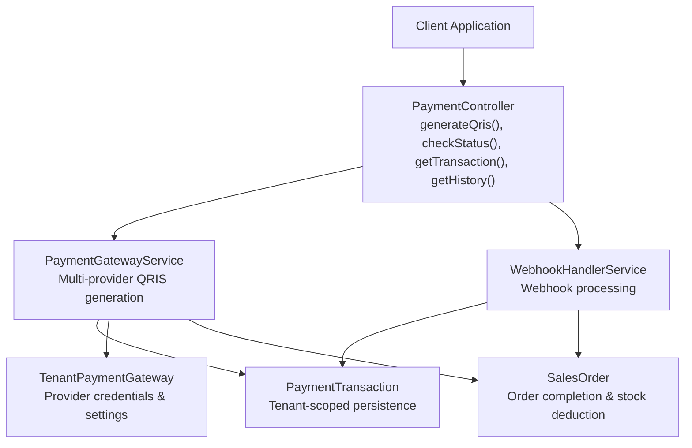
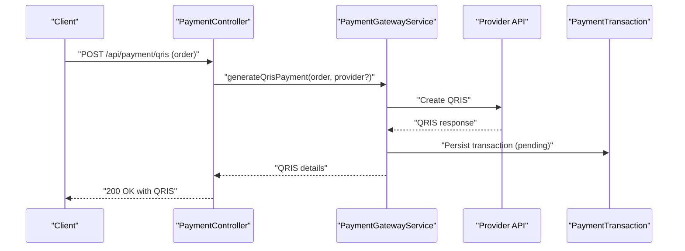
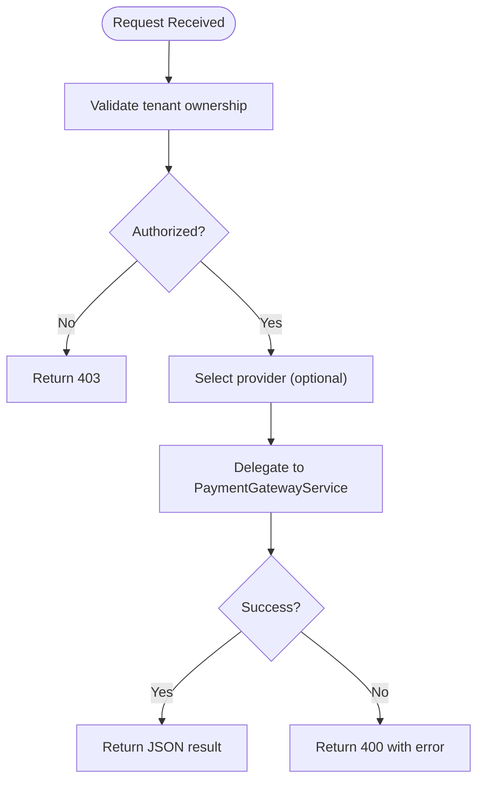
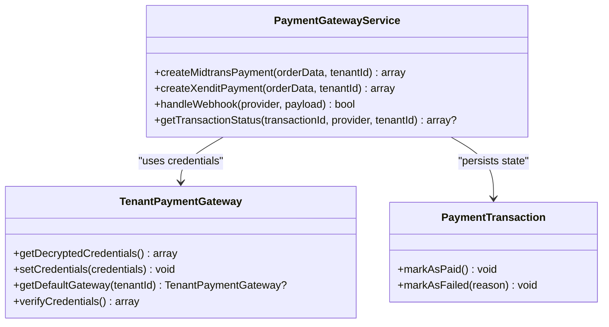
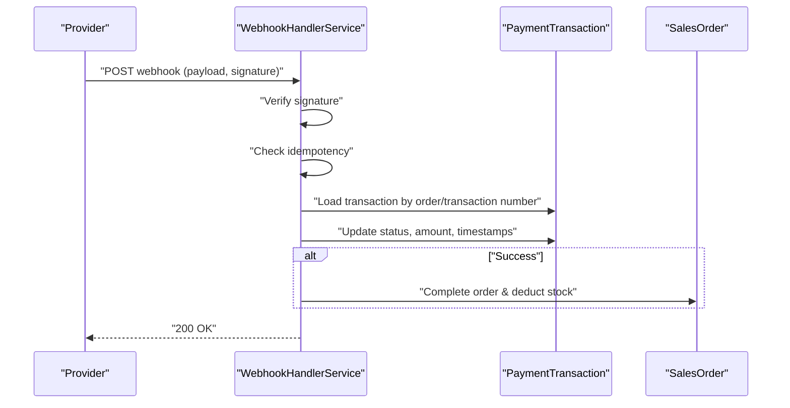
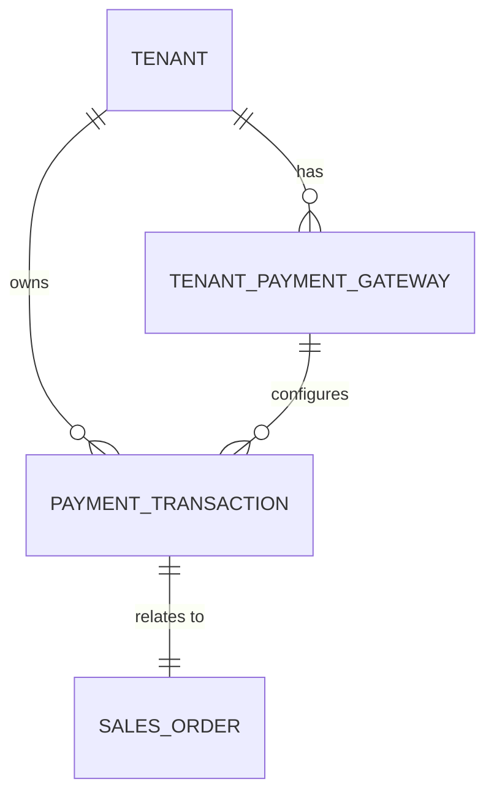
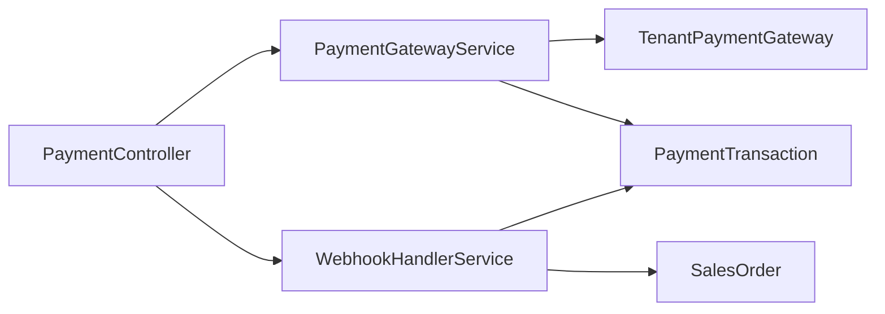

# Payment Transaction Processing

<cite>
**Referenced Files in This Document**
- [PaymentController.php](file://app/Http/Controllers/Api/PaymentController.php)
- [PaymentGatewayService.php](file://app/Services/Integrations/PaymentGatewayService.php)
- [WebhookHandlerService.php](file://app/Services/WebhookHandlerService.php)
- [PaymentTransaction.php](file://app/Models/PaymentTransaction.php)
- [TenantPaymentGateway.php](file://app/Models/TenantPaymentGateway.php)
- [SalesOrder.php](file://app/Models/SalesOrder.php)
- [Payment.php](file://app/Models/Payment.php)
- [HEALTHCARE_INTEGRATION_INTEROPERABILITY.md](file://docs/HEALTHCARE_INTEGRATION_INTEROPERABILITY.md)
</cite>

## Table of Contents
1. [Introduction](#introduction)
2. [Project Structure](#project-structure)
3. [Core Components](#core-components)
4. [Architecture Overview](#architecture-overview)
5. [Detailed Component Analysis](#detailed-component-analysis)
6. [Dependency Analysis](#dependency-analysis)
7. [Performance Considerations](#performance-considerations)
8. [Troubleshooting Guide](#troubleshooting-guide)
9. [Conclusion](#conclusion)

## Introduction
This document explains the payment transaction processing functionality with a focus on QRIS payment generation, transaction status checking, and payment history retrieval. It documents the payment controller methods generateQris(), checkStatus(), getTransaction(), and getHistory(), and covers transaction validation, tenant isolation, and multi-provider support. It also includes examples of payment creation, status polling, and historical transaction queries, along with error handling, timeout scenarios, and transaction lifecycle management.

## Project Structure
The payment system spans controllers, services, models, and supporting documentation. The primary entry points are the PaymentController API endpoints, backed by PaymentGatewayService for provider integrations and WebhookHandlerService for asynchronous updates. Models enforce tenant isolation and persist transaction state.

**Diagram sources**
- [PaymentController.php:14-107](file://app/Http/Controllers/Api/PaymentController.php#L14-L107)
- [PaymentGatewayService.php:10-284](file://app/Services/Integrations/PaymentGatewayService.php#L10-L284)
- [WebhookHandlerService.php:12-442](file://app/Services/WebhookHandlerService.php#L12-L442)
- [PaymentTransaction.php:10-59](file://app/Models/PaymentTransaction.php#L10-L59)
- [TenantPaymentGateway.php:11-151](file://app/Models/TenantPaymentGateway.php#L11-L151)
- [SalesOrder.php:13-122](file://app/Models/SalesOrder.php#L13-L122)

**Section sources**
- [PaymentController.php:14-107](file://app/Http/Controllers/Api/PaymentController.php#L14-L107)
- [PaymentGatewayService.php:10-284](file://app/Services/Integrations/PaymentGatewayService.php#L10-L284)
- [WebhookHandlerService.php:12-442](file://app/Services/WebhookHandlerService.php#L12-L442)
- [PaymentTransaction.php:10-59](file://app/Models/PaymentTransaction.php#L10-L59)
- [TenantPaymentGateway.php:11-151](file://app/Models/TenantPaymentGateway.php#L11-L151)
- [SalesOrder.php:13-122](file://app/Models/SalesOrder.php#L13-L122)

## Core Components
- PaymentController: Exposes endpoints for QRIS generation, status checks, single transaction retrieval, and transaction history with tenant isolation and provider selection.
- PaymentGatewayService: Orchestrates QRIS creation across supported providers (Midtrans, Xendit), handles status polling, and processes webhooks.
- WebhookHandlerService: Validates signatures, deduplicates callbacks, updates transactions, and completes related orders (including stock deduction).
- PaymentTransaction: Stores per-tenant payment records, statuses, and provider responses.
- TenantPaymentGateway: Holds provider credentials and settings per tenant, with encryption and default selection.
- SalesOrder: Linked to transactions to finalize orders upon successful payments.

**Section sources**
- [PaymentController.php:14-107](file://app/Http/Controllers/Api/PaymentController.php#L14-L107)
- [PaymentGatewayService.php:10-284](file://app/Services/Integrations/PaymentGatewayService.php#L10-L284)
- [WebhookHandlerService.php:12-442](file://app/Services/WebhookHandlerService.php#L12-L442)
- [PaymentTransaction.php:10-59](file://app/Models/PaymentTransaction.php#L10-L59)
- [TenantPaymentGateway.php:11-151](file://app/Models/TenantPaymentGateway.php#L11-L151)
- [SalesOrder.php:13-122](file://app/Models/SalesOrder.php#L13-L122)

## Architecture Overview
The system follows a tenant-isolated, provider-agnostic design. Controllers validate requests and tenant ownership, delegate to services for provider-specific operations, and persist state in PaymentTransaction. Webhooks asynchronously reconcile external provider events with local state.

**Diagram sources**
- [PaymentController.php:26-48](file://app/Http/Controllers/Api/PaymentController.php#L26-L48)
- [PaymentGatewayService.php:48-104](file://app/Services/Integrations/PaymentGatewayService.php#L48-L104)

## Detailed Component Analysis

### PaymentController Methods
- generateQris(Request, SalesOrder)
  - Validates tenant ownership of the order.
  - Accepts optional provider parameter (midtrans, xendit, duitku, tripay).
  - Delegates to PaymentGatewayService to create QRIS.
  - Returns success with QRIS details or error response.
- checkStatus(Request)
  - Validates presence of transaction_number.
  - Delegates to PaymentGatewayService to poll provider for status.
  - Returns current status and related details.
- getTransaction(string)
  - Enforces tenant isolation and loads transaction with related sales order.
  - Returns 404 if not found; otherwise returns transaction data.
- getHistory(Request)
  - Filters by optional status, paginates with configurable limit.
  - Enforces tenant isolation and returns transaction list with related sales order.
- Webhook handler (webhook(Request, provider))
  - Extracts tenant from payload or route.
  - Uses WebhookHandlerService to process provider-specific webhooks.
  - Supports signature verification and idempotency for Midtrans.
- Gateway management endpoints
  - getGatewaySettings(), saveGatewaySettings(), testGateway(), toggleGateway(), deleteGateway()

**Diagram sources**
- [PaymentController.php:26-48](file://app/Http/Controllers/Api/PaymentController.php#L26-L48)

**Section sources**
- [PaymentController.php:26-107](file://app/Http/Controllers/Api/PaymentController.php#L26-L107)

### PaymentGatewayService: QRIS Generation and Status Management
- Provider selection and credential resolution
  - Resolves active provider per tenant and environment.
  - Encrypts/decrypts credentials via TenantPaymentGateway.
- QRIS generation
  - Creates provider-specific QRIS requests.
  - Persists PaymentTransaction with pending/waiting_payment status and expiry.
  - Returns QRIS string, image URL, expiry, and amount.
- Status polling
  - Retrieves latest status from provider APIs.
  - Updates PaymentTransaction and triggers order completion if applicable.
- Webhook handling
  - Processes provider webhooks, maps statuses, and updates transactions.
  - Supports Midtrans and Xendit webhook formats.

**Diagram sources**
- [PaymentGatewayService.php:10-284](file://app/Services/Integrations/PaymentGatewayService.php#L10-L284)
- [TenantPaymentGateway.php:11-151](file://app/Models/TenantPaymentGateway.php#L11-L151)
- [PaymentTransaction.php:10-59](file://app/Models/PaymentTransaction.php#L10-L59)

**Section sources**
- [PaymentGatewayService.php:10-284](file://app/Services/Integrations/PaymentGatewayService.php#L10-L284)
- [TenantPaymentGateway.php:11-151](file://app/Models/TenantPaymentGateway.php#L11-L151)
- [PaymentTransaction.php:10-59](file://app/Models/PaymentTransaction.php#L10-L59)

### WebhookHandlerService: Idempotent, Signed Callback Processing
- Signature verification
  - Midtrans: SHA-512 signature verification using webhook secret.
  - Xendit: HMAC SHA256 verification using webhook secret.
- Idempotency
  - Checks for duplicate callbacks before processing to prevent double-effects.
- Transaction reconciliation
  - Updates PaymentTransaction status and timestamps.
  - Completes SalesOrder and performs stock deduction on success.
- Retry mechanism
  - Retries previously failed callbacks up to a configurable limit.

**Diagram sources**
- [WebhookHandlerService.php:24-151](file://app/Services/WebhookHandlerService.php#L24-L151)
- [WebhookHandlerService.php:156-263](file://app/Services/WebhookHandlerService.php#L156-L263)

**Section sources**
- [WebhookHandlerService.php:24-295](file://app/Services/WebhookHandlerService.php#L24-L295)
- [WebhookHandlerService.php:338-396](file://app/Services/WebhookHandlerService.php#L338-L396)

### Data Models: Tenant Isolation and Lifecycle
- PaymentTransaction
  - Tenant-scoped, stores provider responses, amounts, timestamps, and failure reasons.
  - Provides helpers to mark as paid or failed.
- TenantPaymentGateway
  - Encrypted credentials per tenant/provider/environment.
  - Default gateway selection and webhook URL generation.
- SalesOrder
  - Linked to payments; updated on successful QRIS completion.
- Payment (general)
  - Polymorphic payment record for various payables.

**Diagram sources**
- [PaymentTransaction.php:10-59](file://app/Models/PaymentTransaction.php#L10-L59)
- [TenantPaymentGateway.php:11-151](file://app/Models/TenantPaymentGateway.php#L11-L151)
- [SalesOrder.php:13-122](file://app/Models/SalesOrder.php#L13-L122)

**Section sources**
- [PaymentTransaction.php:10-59](file://app/Models/PaymentTransaction.php#L10-L59)
- [TenantPaymentGateway.php:11-151](file://app/Models/TenantPaymentGateway.php#L11-L151)
- [SalesOrder.php:13-122](file://app/Models/SalesOrder.php#L13-L122)
- [Payment.php:12-48](file://app/Models/Payment.php#L12-L48)

## Dependency Analysis
- Controllers depend on services for business logic and on models for persistence.
- PaymentGatewayService depends on TenantPaymentGateway for credentials and on PaymentTransaction for state.
- WebhookHandlerService depends on TenantPaymentGateway for secrets, PaymentTransaction for reconciliation, and SalesOrder for order completion.
- Multi-provider support is achieved through provider-specific handlers within PaymentGatewayService and WebhookHandlerService.

**Diagram sources**
- [PaymentController.php:14-107](file://app/Http/Controllers/Api/PaymentController.php#L14-L107)
- [PaymentGatewayService.php:10-284](file://app/Services/Integrations/PaymentGatewayService.php#L10-L284)
- [WebhookHandlerService.php:12-442](file://app/Services/WebhookHandlerService.php#L12-L442)
- [TenantPaymentGateway.php:11-151](file://app/Models/TenantPaymentGateway.php#L11-L151)
- [PaymentTransaction.php:10-59](file://app/Models/PaymentTransaction.php#L10-L59)
- [SalesOrder.php:13-122](file://app/Models/SalesOrder.php#L13-L122)

**Section sources**
- [PaymentController.php:14-107](file://app/Http/Controllers/Api/PaymentController.php#L14-L107)
- [PaymentGatewayService.php:10-284](file://app/Services/Integrations/PaymentGatewayService.php#L10-L284)
- [WebhookHandlerService.php:12-442](file://app/Services/WebhookHandlerService.php#L12-L442)

## Performance Considerations
- Webhook idempotency prevents redundant processing and reduces load.
- Signature verification avoids unnecessary reconciliation work on invalid callbacks.
- Status polling is delegated to provider APIs; caching or batching could reduce latency depending on provider rate limits.
- Pagination in getHistory() controls response size; tune limit based on client needs.
- Database locks during stock deduction ensure consistency under concurrency.

[No sources needed since this section provides general guidance]

## Troubleshooting Guide
Common issues and resolutions:
- Unauthorized access
  - Ensure the order belongs to the requesting tenant; controller enforces tenantId equality.
- Missing tenant ID in webhook
  - Controller attempts extraction from payload metadata or order_id; configure provider to include tenant metadata.
- Invalid webhook signature
  - Verify webhook secret is set and matches provider configuration; WebhookHandlerService rejects invalid signatures.
- Duplicate webhook callbacks
  - Idempotency service prevents reprocessing; duplicates are logged and ignored.
- Transaction not found
  - Ensure transaction_number matches either order_id or transaction_number in PaymentTransaction; controller/webhook handlers query by tenant_id and number.
- Provider configuration errors
  - Use getGatewaySettings() to inspect active providers and environment; saveGatewaySettings() to update credentials securely.
- Status polling discrepancies
  - Use checkStatus() to reconcile with provider; PaymentGatewayService updates local state on successful polling.

**Section sources**
- [PaymentController.php:28-31](file://app/Http/Controllers/Api/PaymentController.php#L28-L31)
- [PaymentController.php:120-123](file://app/Http/Controllers/Api/PaymentController.php#L120-L123)
- [WebhookHandlerService.php:28-43](file://app/Services/WebhookHandlerService.php#L28-L43)
- [WebhookHandlerService.php:59-64](file://app/Services/WebhookHandlerService.php#L59-L64)
- [PaymentTransaction.php:10-59](file://app/Models/PaymentTransaction.php#L10-L59)
- [PaymentGatewayService.php:263-282](file://app/Services/Integrations/PaymentGatewayService.php#L263-L282)

## Conclusion
The payment transaction processing system provides a robust, tenant-isolated, and multi-provider-capable solution for QRIS payments. It integrates controllers, services, and models to support QRIS generation, status polling, and historical retrieval, while webhook handlers ensure reliable reconciliation and order completion. The design emphasizes security (signatures, encryption), reliability (idempotency), and scalability (pagination, provider abstraction).