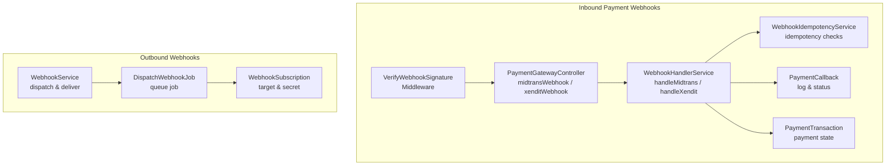
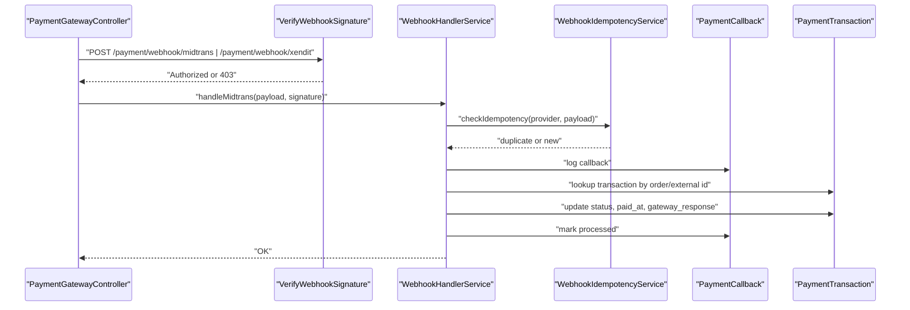
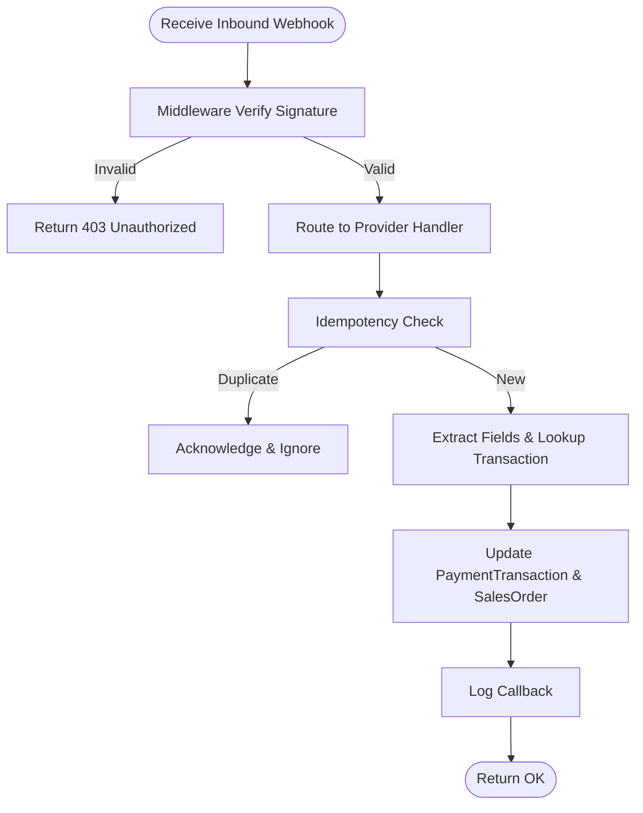
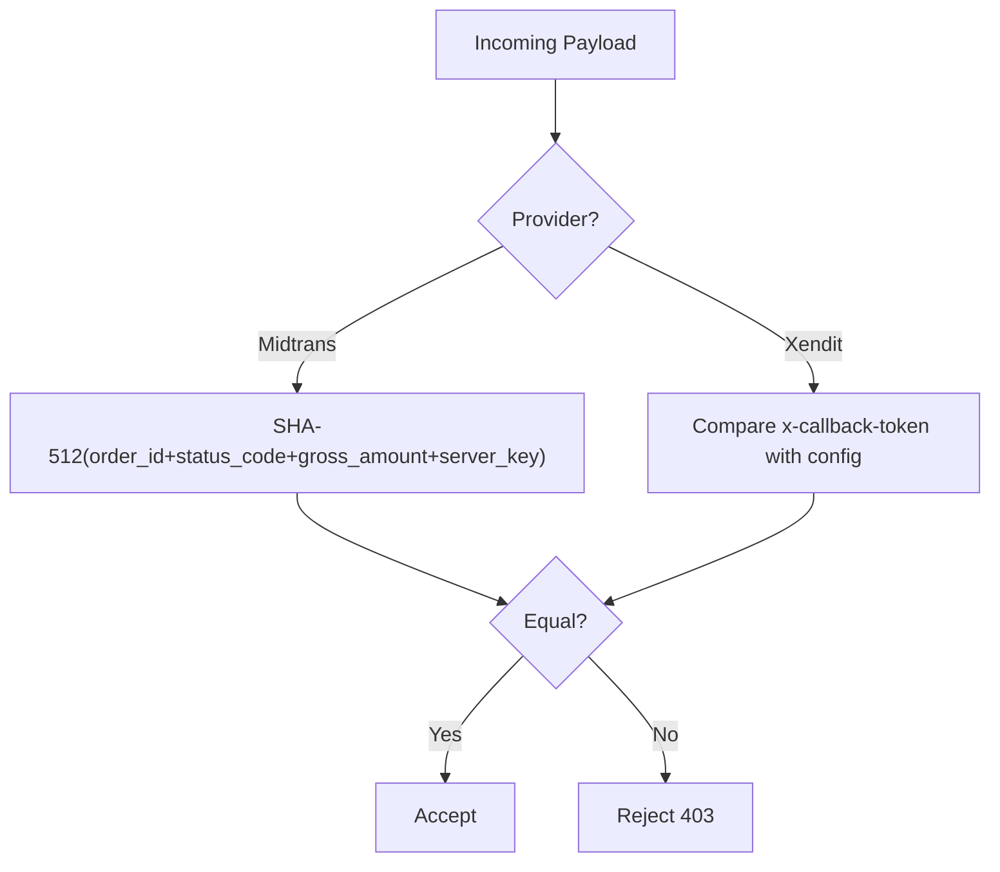
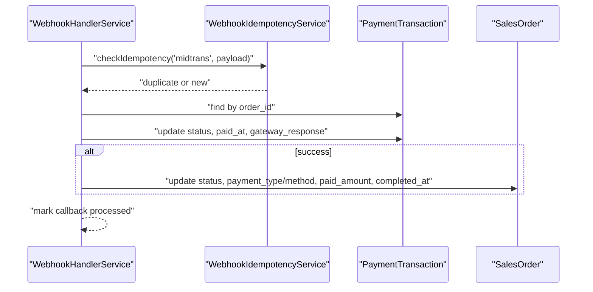
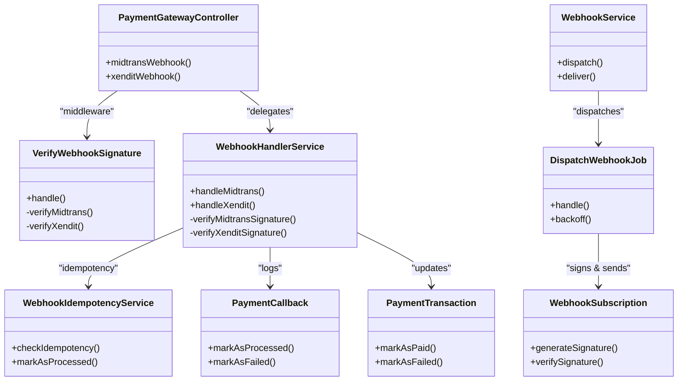

# Webhook Integration

<cite>
**Referenced Files in This Document**
- [PaymentGatewayController.php](file://app/Http/Controllers/PaymentGatewayController.php)
- [VerifyWebhookSignature.php](file://app/Http/Middleware/VerifyWebhookSignature.php)
- [PaymentGatewayService.php](file://app/Services/PaymentGatewayService.php)
- [WebhookHandlerService.php](file://app/Services/WebhookHandlerService.php)
- [WebhookIdempotencyService.php](file://app/Services/WebhookIdempotencyService.php)
- [WebhookService.php](file://app/Services/WebhookService.php)
- [DispatchWebhookJob.php](file://app/Jobs/DispatchWebhookJob.php)
- [PaymentCallback.php](file://app/Models/PaymentCallback.php)
- [PaymentTransaction.php](file://app/Models/PaymentTransaction.php)
- [WebhookSubscription.php](file://app/Models/WebhookSubscription.php)
</cite>

## Table of Contents
1. [Introduction](#introduction)
2. [Project Structure](#project-structure)
3. [Core Components](#core-components)
4. [Architecture Overview](#architecture-overview)
5. [Detailed Component Analysis](#detailed-component-analysis)
6. [Dependency Analysis](#dependency-analysis)
7. [Performance Considerations](#performance-considerations)
8. [Troubleshooting Guide](#troubleshooting-guide)
9. [Conclusion](#conclusion)

## Introduction
This document explains the payment gateway webhook integration and handling across Midtrans and Xendit within the system. It covers endpoint configuration, signature verification, provider-specific webhook handling, tenant ID extraction, payload validation, asynchronous processing, retry mechanisms, and integration with the broader payment workflow. Examples of setup, verification, and error handling are included to guide administrators and developers.

## Project Structure
The webhook integration spans controllers, middleware, services, jobs, and models:
- Controllers expose endpoints for payment initiation and webhook callbacks.
- Middleware verifies inbound webhook signatures.
- Services encapsulate provider-specific logic, signature verification, and idempotency.
- Jobs handle asynchronous outbound webhooks with retries.
- Models persist callbacks, transactions, and subscription metadata.

**Diagram sources**
- [VerifyWebhookSignature.php:14-33](file://app/Http/Middleware/VerifyWebhookSignature.php#L14-L33)
- [PaymentGatewayController.php:100-116](file://app/Http/Controllers/PaymentGatewayController.php#L100-L116)
- [WebhookHandlerService.php:24-151](file://app/Services/WebhookHandlerService.php#L24-L151)
- [WebhookIdempotencyService.php:40-93](file://app/Services/WebhookIdempotencyService.php#L40-L93)
- [PaymentCallback.php:10-44](file://app/Models/PaymentCallback.php#L10-L44)
- [PaymentTransaction.php:10-42](file://app/Models/PaymentTransaction.php#L10-L42)
- [WebhookService.php:102-112](file://app/Services/WebhookService.php#L102-L112)
- [DispatchWebhookJob.php:40-118](file://app/Jobs/DispatchWebhookJob.php#L40-L118)
- [WebhookSubscription.php:8-44](file://app/Models/WebhookSubscription.php#L8-L44)

**Section sources**
- [PaymentGatewayController.php:100-116](file://app/Http/Controllers/PaymentGatewayController.php#L100-L116)
- [VerifyWebhookSignature.php:14-33](file://app/Http/Middleware/VerifyWebhookSignature.php#L14-L33)
- [WebhookHandlerService.php:24-151](file://app/Services/WebhookHandlerService.php#L24-L151)
- [WebhookIdempotencyService.php:40-93](file://app/Services/WebhookIdempotencyService.php#L40-L93)
- [PaymentCallback.php:10-44](file://app/Models/PaymentCallback.php#L10-L44)
- [PaymentTransaction.php:10-42](file://app/Models/PaymentTransaction.php#L10-L42)
- [WebhookService.php:102-112](file://app/Services/WebhookService.php#L102-L112)
- [DispatchWebhookJob.php:40-118](file://app/Jobs/DispatchWebhookJob.php#L40-L118)
- [WebhookSubscription.php:8-44](file://app/Models/WebhookSubscription.php#L8-L44)

## Core Components
- Inbound webhook controllers for Midtrans and Xendit:
  - Validate order/external identifiers and update payment status accordingly.
- Signature verification middleware:
  - Midtrans: SHA-512 over order_id + status_code + gross_amount + server_key.
  - Xendit: Header-based token comparison against configured webhook token.
- Provider-agnostic handler:
  - Idempotency checks, signature verification, payload extraction, transaction updates, and optional stock deduction.
- Payment gateway service:
  - Unified webhook processing, signature verification, provider mapping, and transaction updates.
- Outbound webhook service:
  - Event dispatching to subscribers with HMAC signing and exponential backoff retries.
- Supporting models:
  - PaymentCallback, PaymentTransaction, WebhookSubscription.

**Section sources**
- [PaymentGatewayController.php:100-116](file://app/Http/Controllers/PaymentGatewayController.php#L100-L116)
- [VerifyWebhookSignature.php:35-58](file://app/Http/Middleware/VerifyWebhookSignature.php#L35-L58)
- [WebhookHandlerService.php:24-151](file://app/Services/WebhookHandlerService.php#L24-L151)
- [PaymentGatewayService.php:166-217](file://app/Services/PaymentGatewayService.php#L166-L217)
- [WebhookService.php:102-112](file://app/Services/WebhookService.php#L102-L112)
- [PaymentCallback.php:10-44](file://app/Models/PaymentCallback.php#L10-L44)
- [PaymentTransaction.php:10-42](file://app/Models/PaymentTransaction.php#L10-L42)
- [WebhookSubscription.php:8-44](file://app/Models/WebhookSubscription.php#L8-L44)

## Architecture Overview
The inbound webhook flow ensures secure, idempotent processing per provider. Outbound webhooks are queued and retried with exponential backoff.

**Diagram sources**
- [PaymentGatewayController.php:100-116](file://app/Http/Controllers/PaymentGatewayController.php#L100-L116)
- [VerifyWebhookSignature.php:16-33](file://app/Http/Middleware/VerifyWebhookSignature.php#L16-L33)
- [WebhookHandlerService.php:24-151](file://app/Services/WebhookHandlerService.php#L24-L151)
- [WebhookIdempotencyService.php:40-93](file://app/Services/WebhookIdempotencyService.php#L40-L93)
- [PaymentCallback.php:46-72](file://app/Models/PaymentCallback.php#L46-L72)
- [PaymentTransaction.php:44-58](file://app/Models/PaymentTransaction.php#L44-L58)

## Detailed Component Analysis

### Inbound Webhook Controllers (Midtrans and Xendit)
- Endpoints:
  - Midtrans: midtransWebhook validates order_id and updates status based on transaction_status.
  - Xendit: xenditWebhook validates external_id and updates status based on status.
- Signature verification:
  - Both rely on VerifyWebhookSignature middleware to ensure authenticity before controller logic runs.
- Idempotency:
  - The dedicated WebhookHandlerService performs idempotency checks prior to processing.

**Diagram sources**
- [PaymentGatewayController.php:100-116](file://app/Http/Controllers/PaymentGatewayController.php#L100-L116)
- [VerifyWebhookSignature.php:16-33](file://app/Http/Middleware/VerifyWebhookSignature.php#L16-L33)
- [WebhookHandlerService.php:24-151](file://app/Services/WebhookHandlerService.php#L24-L151)
- [WebhookIdempotencyService.php:40-93](file://app/Services/WebhookIdempotencyService.php#L40-L93)
- [PaymentTransaction.php:44-58](file://app/Models/PaymentTransaction.php#L44-L58)

**Section sources**
- [PaymentGatewayController.php:100-116](file://app/Http/Controllers/PaymentGatewayController.php#L100-L116)
- [VerifyWebhookSignature.php:35-58](file://app/Http/Middleware/VerifyWebhookSignature.php#L35-L58)

### Signature Verification
- Midtrans:
  - Computes SHA-512 over concatenation of order_id, status_code, gross_amount, and server_key.
  - Compares with signature_key from payload.
- Xendit:
  - Validates header x-callback-token against configured webhook token.
- PaymentGatewayService:
  - Provides centralized signature verification for webhook handling with HMAC-SHA256 for Xendit and HMAC-SHA256 for generic webhook verification.

**Diagram sources**
- [VerifyWebhookSignature.php:35-58](file://app/Http/Middleware/VerifyWebhookSignature.php#L35-L58)
- [PaymentGatewayService.php:622-635](file://app/Services/PaymentGatewayService.php#L622-L635)

**Section sources**
- [VerifyWebhookSignature.php:35-58](file://app/Http/Middleware/VerifyWebhookSignature.php#L35-L58)
- [PaymentGatewayService.php:622-635](file://app/Services/PaymentGatewayService.php#L622-L635)

### Provider-Specific Webhook Handling
- Midtrans:
  - Extract order_id, transaction_status, fraud_status, gross_amount.
  - Map statuses to internal states (e.g., settlement/capture → success).
  - Update PaymentTransaction and optionally SalesOrder.
- Xendit:
  - Extract external_id, status, paid_amount/id/paid_at.
  - Map statuses to internal states (e.g., PAID → success).
  - Update PaymentTransaction and optionally SalesOrder.

**Diagram sources**
- [WebhookHandlerService.php:24-151](file://app/Services/WebhookHandlerService.php#L24-L151)
- [WebhookIdempotencyService.php:40-93](file://app/Services/WebhookIdempotencyService.php#L40-L93)
- [PaymentTransaction.php:44-58](file://app/Models/PaymentTransaction.php#L44-L58)

**Section sources**
- [WebhookHandlerService.php:24-151](file://app/Services/WebhookHandlerService.php#L24-L151)
- [WebhookHandlerService.php:156-263](file://app/Services/WebhookHandlerService.php#L156-L263)

### Tenant ID Extraction and Payload Validation
- Tenant extraction strategies:
  - Prefer explicit tenant_id in payload.
  - Otherwise derive from SalesOrder or PaymentTransaction via order_id/external_id.
- Payload validation:
  - Required fields checked before processing (e.g., order_id/status for Midtrans, external_id/status for Xendit).
  - Signature verification performed when secrets are configured.

**Section sources**
- [WebhookIdempotencyService.php:228-247](file://app/Services/WebhookIdempotencyService.php#L228-L247)
- [WebhookHandlerService.php:73-76](file://app/Services/WebhookHandlerService.php#L73-L76)
- [WebhookHandlerService.php:187-190](file://app/Services/WebhookHandlerService.php#L187-L190)

### Asynchronous Webhook Processing
- Outbound webhooks:
  - WebhookService.dispatch enqueues DispatchWebhookJob for each subscription.
  - DispatchWebhookJob applies exponential backoff and auto-disables after excessive failures.
- Inbound webhooks:
  - PaymentGatewayController delegates to WebhookHandlerService which performs idempotency checks and transaction updates.

**Section sources**
- [WebhookService.php:102-112](file://app/Services/WebhookService.php#L102-L112)
- [DispatchWebhookJob.php:35-38](file://app/Jobs/DispatchWebhookJob.php#L35-L38)
- [DispatchWebhookJob.php:99-117](file://app/Jobs/DispatchWebhookJob.php#L99-L117)
- [PaymentGatewayController.php:100-116](file://app/Http/Controllers/PaymentGatewayController.php#L100-L116)
- [WebhookHandlerService.php:24-151](file://app/Services/WebhookHandlerService.php#L24-L151)

### Retry Mechanisms
- Outbound:
  - Backoff schedule: 10s, 30s, 90s, 270s, 810s.
  - Automatic deactivation after 50 consecutive failures.
- Inbound:
  - WebhookHandlerService.retryFailedCallbacks re-processes unprocessed callbacks.

**Section sources**
- [DispatchWebhookJob.php:35-38](file://app/Jobs/DispatchWebhookJob.php#L35-L38)
- [DispatchWebhookJob.php:120-129](file://app/Jobs/DispatchWebhookJob.php#L120-L129)
- [WebhookHandlerService.php:401-440](file://app/Services/WebhookHandlerService.php#L401-L440)

### Integration with Payment Workflow
- Successful payments update PaymentTransaction and related SalesOrder.
- Stock deduction is triggered atomically for completed orders when applicable.

**Section sources**
- [WebhookHandlerService.php:102-119](file://app/Services/WebhookHandlerService.php#L102-L119)
- [WebhookHandlerService.php:221-238](file://app/Services/WebhookHandlerService.php#L221-L238)
- [WebhookHandlerService.php:338-396](file://app/Services/WebhookHandlerService.php#L338-L396)

## Dependency Analysis

**Diagram sources**
- [PaymentGatewayController.php:100-116](file://app/Http/Controllers/PaymentGatewayController.php#L100-L116)
- [VerifyWebhookSignature.php:16-33](file://app/Http/Middleware/VerifyWebhookSignature.php#L16-L33)
- [WebhookHandlerService.php:24-151](file://app/Services/WebhookHandlerService.php#L24-L151)
- [WebhookIdempotencyService.php:40-93](file://app/Services/WebhookIdempotencyService.php#L40-L93)
- [PaymentCallback.php:66-84](file://app/Models/PaymentCallback.php#L66-L84)
- [PaymentTransaction.php:44-58](file://app/Models/PaymentTransaction.php#L44-L58)
- [WebhookService.php:102-112](file://app/Services/WebhookService.php#L102-L112)
- [DispatchWebhookJob.php:40-118](file://app/Jobs/DispatchWebhookJob.php#L40-L118)
- [WebhookSubscription.php:75-88](file://app/Models/WebhookSubscription.php#L75-L88)

**Section sources**
- [PaymentGatewayController.php:100-116](file://app/Http/Controllers/PaymentGatewayController.php#L100-L116)
- [VerifyWebhookSignature.php:16-33](file://app/Http/Middleware/VerifyWebhookSignature.php#L16-L33)
- [WebhookHandlerService.php:24-151](file://app/Services/WebhookHandlerService.php#L24-L151)
- [WebhookIdempotencyService.php:40-93](file://app/Services/WebhookIdempotencyService.php#L40-L93)
- [PaymentCallback.php:66-84](file://app/Models/PaymentCallback.php#L66-L84)
- [PaymentTransaction.php:44-58](file://app/Models/PaymentTransaction.php#L44-L58)
- [WebhookService.php:102-112](file://app/Services/WebhookService.php#L102-L112)
- [DispatchWebhookJob.php:40-118](file://app/Jobs/DispatchWebhookJob.php#L40-L118)
- [WebhookSubscription.php:75-88](file://app/Models/WebhookSubscription.php#L75-L88)

## Performance Considerations
- Idempotency caching reduces database load and prevents duplicate processing.
- Outbound webhook jobs use exponential backoff to avoid overwhelming downstream systems.
- Transactional updates ensure data consistency during payment state changes.
- Consider indexing PaymentCallback and PaymentTransaction lookup fields for improved performance.

## Troubleshooting Guide
- Invalid signature:
  - Verify provider-specific signature logic and configuration (server key, webhook token).
- Missing required fields:
  - Ensure payloads include order_id/external_id and status fields.
- Duplicate webhook detection:
  - Idempotency keys prevent repeated processing; inspect previous callbacks for context.
- Retry failures:
  - Review outbound delivery logs and subscription retry counts; subscriptions auto-disable after 50 failures.
- Payment not found:
  - Confirm order/external_id matches PaymentTransaction records.

**Section sources**
- [VerifyWebhookSignature.php:24-30](file://app/Http/Middleware/VerifyWebhookSignature.php#L24-L30)
- [WebhookHandlerService.php:73-76](file://app/Services/WebhookHandlerService.php#L73-L76)
- [WebhookHandlerService.php:187-190](file://app/Services/WebhookHandlerService.php#L187-L190)
- [WebhookIdempotencyService.php:40-93](file://app/Services/WebhookIdempotencyService.php#L40-L93)
- [DispatchWebhookJob.php:120-129](file://app/Jobs/DispatchWebhookJob.php#L120-L129)
- [PaymentTransaction.php:44-58](file://app/Models/PaymentTransaction.php#L44-L58)

## Conclusion
The webhook integration provides secure, idempotent, and asynchronous handling for Midtrans and Xendit payments. It includes robust signature verification, tenant-aware processing, retry mechanisms, and seamless integration with the broader payment workflow. Administrators should configure provider credentials and secrets, monitor delivery and callback logs, and leverage idempotency and retry features to maintain reliability.