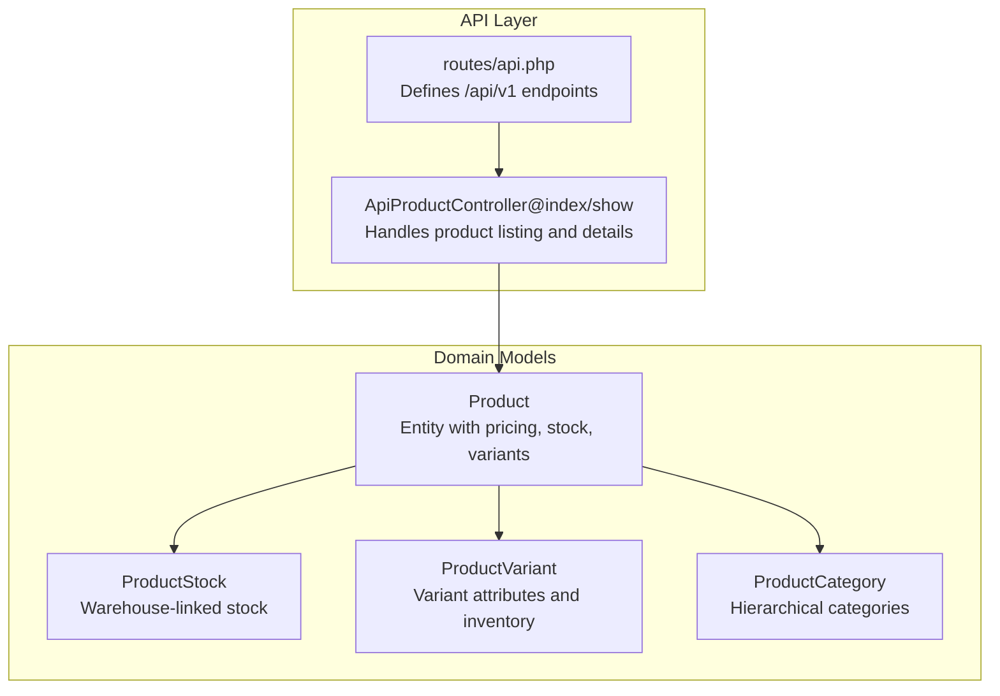
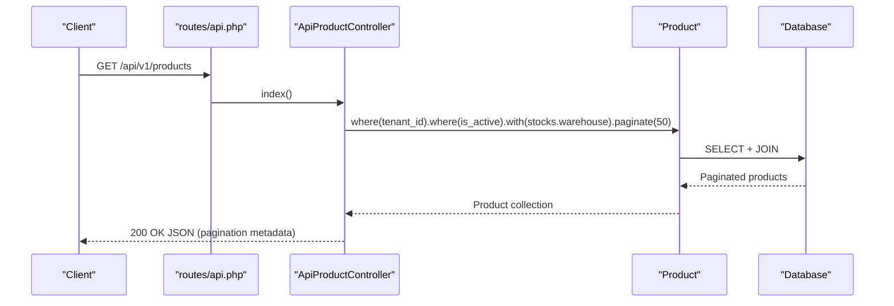
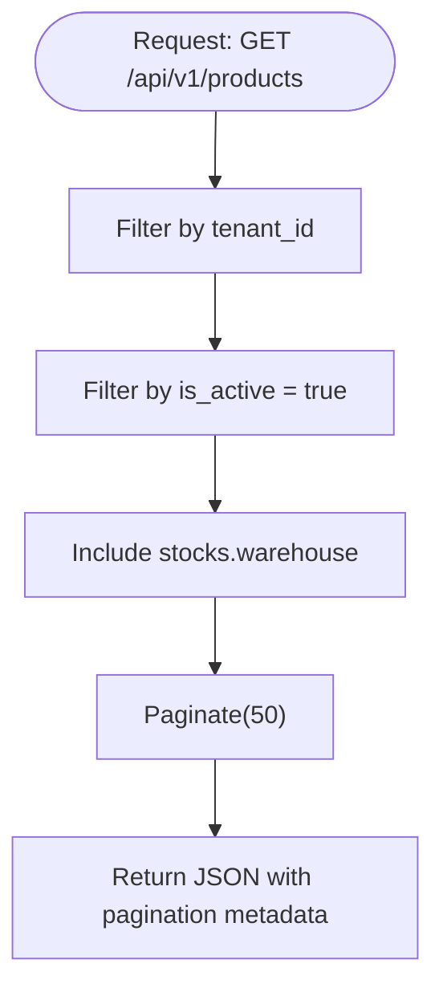
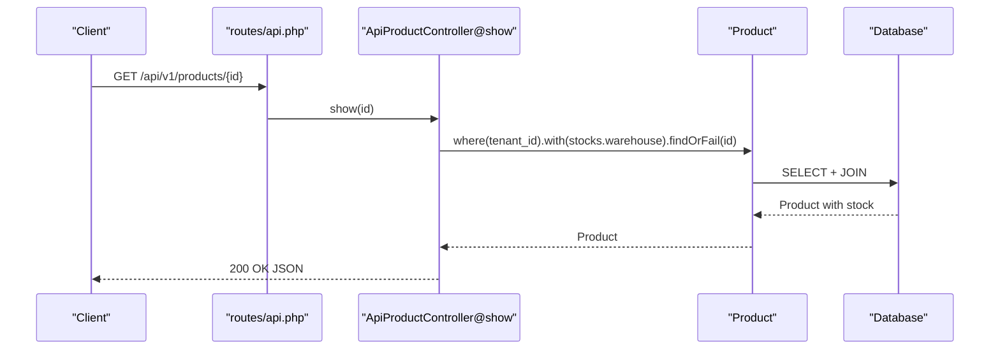
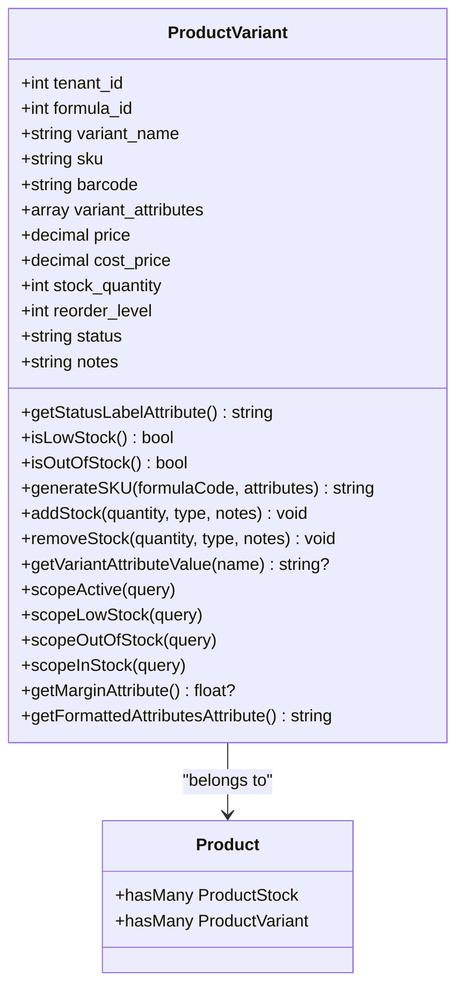
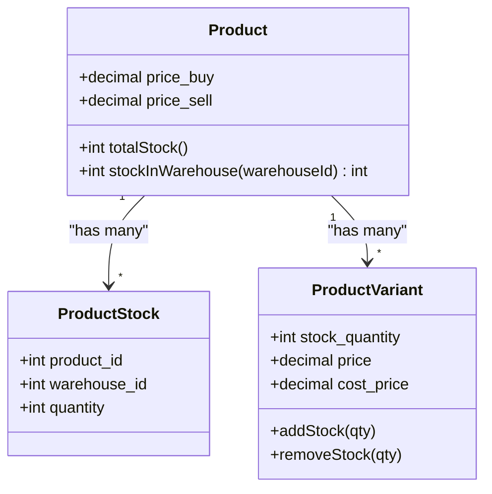
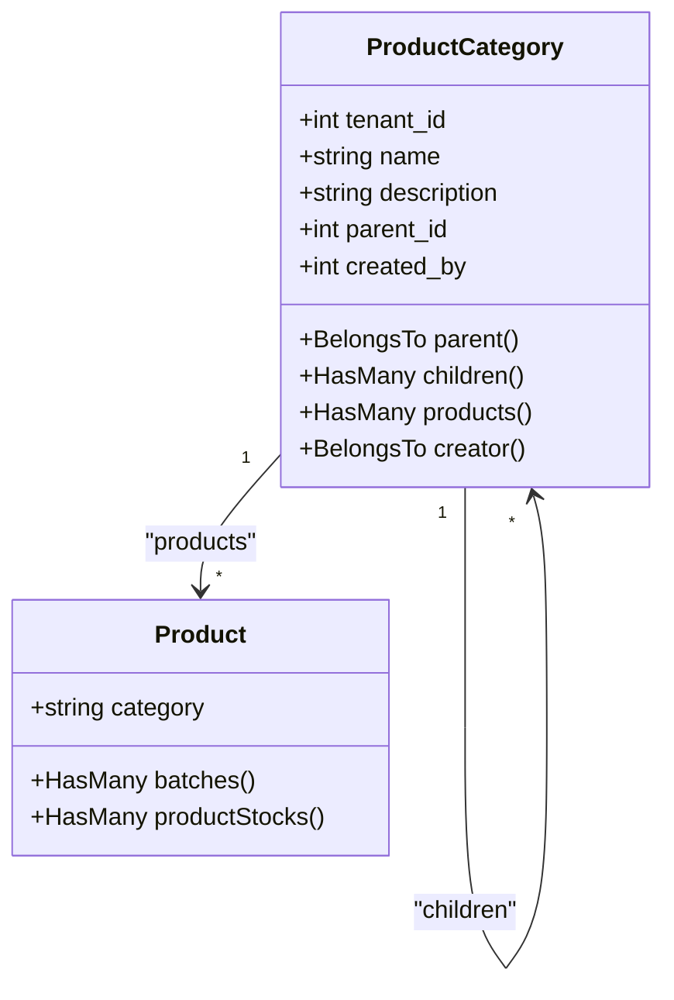
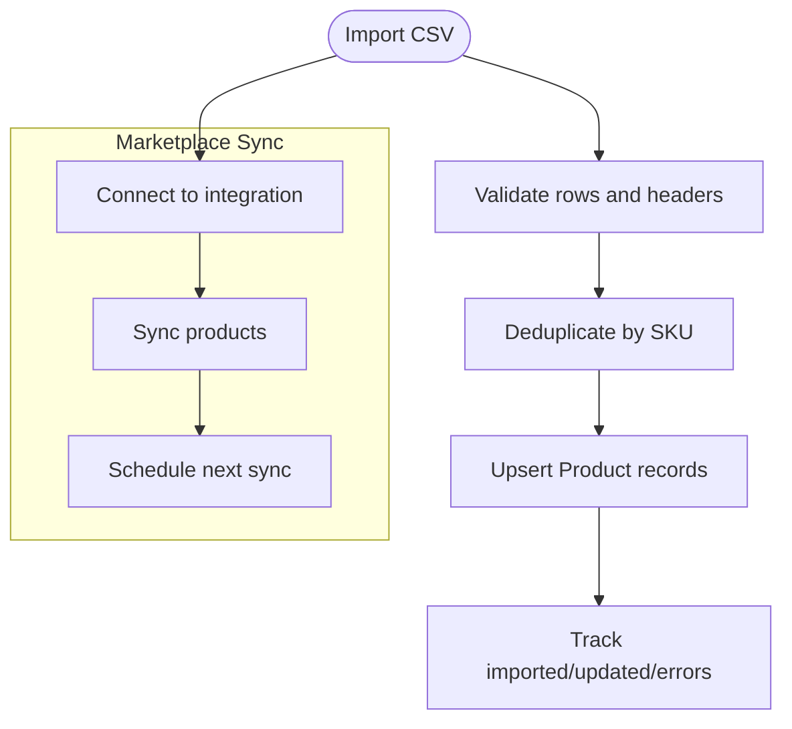
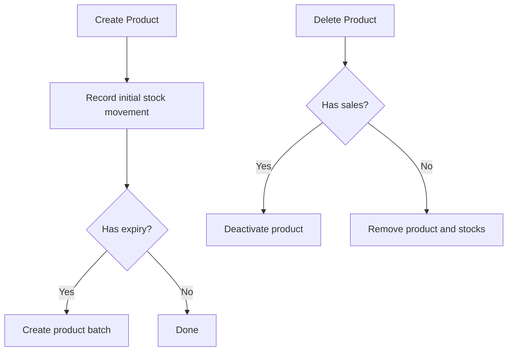
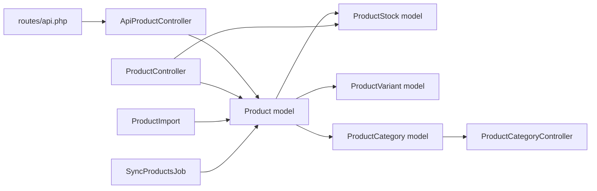

# Product Catalog API

<cite>
**Referenced Files in This Document**
- [routes/api.php](file://routes/api.php)
- [ApiProductController.php](file://app/Http/Controllers/Api/ApiProductController.php)
- [Product.php](file://app/Models/Product.php)
- [ProductStock.php](file://app/Models/ProductStock.php)
- [ProductVariant.php](file://app/Models/ProductVariant.php)
- [ProductCategory.php](file://app/Models/ProductCategory.php)
- [ProductController.php](file://app/Http/Controllers/ProductController.php)
- [ProductCategoryController.php](file://app/Http/Controllers/ProductCategoryController.php)
- [ProductImport.php](file://app/Imports/ProductImport.php)
- [SyncProductsJob.php](file://app/Jobs/Integrations/SyncProductsJob.php)
</cite>

## Table of Contents
1. [Introduction](#introduction)
2. [Project Structure](#project-structure)
3. [Core Components](#core-components)
4. [Architecture Overview](#architecture-overview)
5. [Detailed Component Analysis](#detailed-component-analysis)
6. [Dependency Analysis](#dependency-analysis)
7. [Performance Considerations](#performance-considerations)
8. [Troubleshooting Guide](#troubleshooting-guide)
9. [Conclusion](#conclusion)

## Introduction
This document provides comprehensive API documentation for product catalog management within the qalcuityERP system. It covers product listing with filtering, searching, and pagination; product details retrieval; variant management; pricing and inventory linkage; product categorization; batch processing; product synchronization; media handling; attribute management; and integration with procurement and sales workflows. The documentation is designed for both technical and non-technical users, offering clear explanations, diagrams, and practical examples mapped to the actual codebase.

## Project Structure
The product catalog API is primarily exposed via the REST API v1 routes and implemented by dedicated controllers and models. The routes define the endpoint surface, while controllers orchestrate data retrieval and transformation. Models encapsulate domain logic, relationships, and casting for pricing and booleans.

**Diagram sources**
- [routes/api.php:33-34](file://routes/api.php#L33-L34)
- [ApiProductController.php:11-28](file://app/Http/Controllers/Api/ApiProductController.php#L11-L28)
- [Product.php:12-71](file://app/Models/Product.php#L12-L71)
- [ProductStock.php:8-15](file://app/Models/ProductStock.php#L8-L15)
- [ProductVariant.php:13-175](file://app/Models/ProductVariant.php#L13-L175)
- [ProductCategory.php:10-48](file://app/Models/ProductCategory.php#L10-L48)

**Section sources**
- [routes/api.php:28-50](file://routes/api.php#L28-L50)
- [ApiProductController.php:1-30](file://app/Http/Controllers/Api/ApiProductController.php#L1-L30)

## Core Components
- Product entity: central model with pricing, stock thresholds, images, and expiry settings; exposes helpers for total stock and warehouse-specific quantities.
- ProductStock: links products to warehouses with quantity tracking.
- ProductVariant: manages variant attributes, pricing, cost, stock quantity, reorder level, and inventory transactions.
- ProductCategory: hierarchical category model with parent-child relationships and product counts.
- API Product Controller: provides paginated product listing and single product details with warehouse stock inclusion.
- Product Controller (web): supports advanced filtering, searching, bulk actions, media upload, and batch creation.
- Import and Sync: Excel-based import and scheduled product synchronization jobs for marketplace integrations.

**Section sources**
- [Product.php:16-42](file://app/Models/Product.php#L16-L42)
- [ProductStock.php:10-14](file://app/Models/ProductStock.php#L10-L14)
- [ProductVariant.php:18-37](file://app/Models/ProductVariant.php#L18-L37)
- [ProductCategory.php:14-26](file://app/Models/ProductCategory.php#L14-L26)
- [ApiProductController.php:11-28](file://app/Http/Controllers/Api/ApiProductController.php#L11-L28)
- [ProductController.php:23-51](file://app/Http/Controllers/ProductController.php#L23-L51)
- [ProductImport.php:35-81](file://app/Imports/ProductImport.php#L35-L81)
- [SyncProductsJob.php:48-90](file://app/Jobs/Integrations/SyncProductsJob.php#L48-L90)

## Architecture Overview
The product catalog API follows a layered architecture:
- Routes define the public interface under /api/v1 with read-only and write middleware groups.
- API controllers fetch tenant-scoped data, apply filters, and paginate results.
- Models encapsulate domain logic, casting, and relationships to variants, stocks, and categories.
- Background jobs support marketplace integrations and periodic synchronization.

**Diagram sources**
- [routes/api.php:33](file://routes/api.php#L33)
- [ApiProductController.php:11-19](file://app/Http/Controllers/Api/ApiProductController.php#L11-L19)
- [Product.php:12-71](file://app/Models/Product.php#L12-L71)

## Detailed Component Analysis

### Product Listing and Filtering (Read-Only)
- Endpoint: GET /api/v1/products
- Behavior:
  - Filters by tenant_id and active status.
  - Includes warehouse-linked stock information.
  - Paginates results with a fixed page size.
- Search and filter capabilities are available in the web controller but not yet exposed in the API controller. The API currently returns active products only.

**Diagram sources**
- [ApiProductController.php:11-19](file://app/Http/Controllers/Api/ApiProductController.php#L11-L19)

**Section sources**
- [routes/api.php:33](file://routes/api.php#L33)
- [ApiProductController.php:11-19](file://app/Http/Controllers/Api/ApiProductController.php#L11-L19)

### Product Details Retrieval
- Endpoint: GET /api/v1/products/{id}
- Behavior:
  - Returns a single product for the authenticated tenant.
  - Includes warehouse-linked stock information.
  - Uses tenant scoping and eager loading for performance.

**Diagram sources**
- [routes/api.php:34](file://routes/api.php#L34)
- [ApiProductController.php:21-28](file://app/Http/Controllers/Api/ApiProductController.php#L21-L28)

**Section sources**
- [routes/api.php:34](file://routes/api.php#L34)
- [ApiProductController.php:21-28](file://app/Http/Controllers/Api/ApiProductController.php#L21-L28)

### Variant Management
- Model: ProductVariant
- Capabilities:
  - Stores variant attributes as an array and exposes formatted display text.
  - Tracks stock quantity, reorder level, and status.
  - Provides scopes for active, low stock, out-of-stock, and in-stock variants.
  - Supports adding/removing stock with inventory transaction recording.
  - Calculates margin based on price and cost price.
  - Generates SKUs from formula code and attribute values.

**Diagram sources**
- [ProductVariant.php:18-175](file://app/Models/ProductVariant.php#L18-L175)
- [Product.php:52-59](file://app/Models/Product.php#L52-L59)

**Section sources**
- [ProductVariant.php:18-175](file://app/Models/ProductVariant.php#L18-L175)

### Pricing Information and Inventory Linkage
- Product model:
  - Casts purchase/sale prices to decimals with two places.
  - Provides helpers to compute total stock and warehouse-specific quantities.
- ProductStock model:
  - Links product to warehouse with quantity.
- Variant inventory:
  - ProductVariant records inventory transactions on add/remove stock.

**Diagram sources**
- [Product.php:33-70](file://app/Models/Product.php#L33-L70)
- [ProductStock.php:10-14](file://app/Models/ProductStock.php#L10-L14)
- [ProductVariant.php:77-112](file://app/Models/ProductVariant.php#L77-L112)

**Section sources**
- [Product.php:33-70](file://app/Models/Product.php#L33-L70)
- [ProductStock.php:10-14](file://app/Models/ProductStock.php#L10-L14)
- [ProductVariant.php:77-112](file://app/Models/ProductVariant.php#L77-L112)

### Product Categorization
- ProductCategory model:
  - Hierarchical with parent-child relationships.
  - Counts associated products.
- ProductController (web):
  - Index supports category filtering and status-based queries (active, inactive, low stock).
- ProductImport:
  - Resolves category by name during import.

**Diagram sources**
- [ProductCategory.php:14-47](file://app/Models/ProductCategory.php#L14-L47)
- [Product.php:48-59](file://app/Models/Product.php#L48-L59)

**Section sources**
- [ProductCategory.php:14-47](file://app/Models/ProductCategory.php#L14-L47)
- [ProductController.php:32-41](file://app/Http/Controllers/ProductController.php#L32-L41)
- [ProductImport.php:112-123](file://app/Imports/ProductImport.php#L112-L123)

### Batch Processing and Product Synchronization
- ProductImport:
  - Processes collections with heading rows, validates and parses prices/booleans, deduplicates by SKU, and tracks imported/updated/error statistics.
- SyncProductsJob:
  - Executes marketplace integrations, checks connectivity, performs product sync, updates last sync timestamps, schedules next sync based on frequency, and handles failures.

**Diagram sources**
- [ProductImport.php:35-81](file://app/Imports/ProductImport.php#L35-L81)
- [SyncProductsJob.php:48-108](file://app/Jobs/Integrations/SyncProductsJob.php#L48-L108)

**Section sources**
- [ProductImport.php:35-171](file://app/Imports/ProductImport.php#L35-L171)
- [SyncProductsJob.php:48-123](file://app/Jobs/Integrations/SyncProductsJob.php#L48-L123)

### Product Media Handling
- ProductController (web):
  - Validates and stores product images (jpg, jpeg, png, webp) with size limits.
  - Updates image URLs and cleans up previous images on replacement.
- API controller does not expose media handling endpoints; media fields are included in product responses via model casting.

**Section sources**
- [ProductController.php:159-205](file://app/Http/Controllers/ProductController.php#L159-L205)
- [ProductController.php:250-277](file://app/Http/Controllers/ProductController.php#L250-L277)
- [Product.php:26-28](file://app/Models/Product.php#L26-L28)

### Attribute Management
- ProductVariant:
  - Stores variant_attributes as an array and exposes formatted display text.
  - Provides helper to retrieve specific attribute values.
- Product:
  - Holds category as a string; category relationships supported by ProductCategory model.

**Section sources**
- [ProductVariant.php:115-118](file://app/Models/ProductVariant.php#L115-L118)
- [ProductVariant.php:162-173](file://app/Models/ProductVariant.php#L162-L173)
- [Product.php:16-31](file://app/Models/Product.php#L16-L31)
- [ProductCategory.php:38-41](file://app/Models/ProductCategory.php#L38-L41)

### Integration with Procurement and Sales Workflows
- Product creation in ProductController (web) triggers initial stock entries and optional batch creation when expiry is enabled.
- Deletion logic prevents removal of products with existing sales; instead, it deactivates them to preserve historical sales data.
- Bulk actions support mass activation/deactivation and price updates across multiple products.

**Diagram sources**
- [ProductController.php:211-241](file://app/Http/Controllers/ProductController.php#L211-L241)
- [ProductController.php:287-303](file://app/Http/Controllers/ProductController.php#L287-L303)

**Section sources**
- [ProductController.php:211-241](file://app/Http/Controllers/ProductController.php#L211-L241)
- [ProductController.php:287-303](file://app/Http/Controllers/ProductController.php#L287-L303)

## Dependency Analysis
- API routes depend on ApiProductController for product listing and details.
- ApiProductController depends on Product model and ProductStock relationship.
- Product model depends on ProductStock, ProductVariant, and ProductCategory.
- Web controllers (ProductController, ProductCategoryController) provide complementary functionality for search, filtering, and bulk operations.
- Import and sync jobs integrate external systems and rely on model upsert logic.

**Diagram sources**
- [routes/api.php:33-34](file://routes/api.php#L33-L34)
- [ApiProductController.php:11-28](file://app/Http/Controllers/Api/ApiProductController.php#L11-L28)
- [Product.php:12-71](file://app/Models/Product.php#L12-L71)
- [ProductStock.php:8-15](file://app/Models/ProductStock.php#L8-L15)
- [ProductVariant.php:13-175](file://app/Models/ProductVariant.php#L13-L175)
- [ProductCategory.php:10-48](file://app/Models/ProductCategory.php#L10-L48)
- [ProductController.php:23-51](file://app/Http/Controllers/ProductController.php#L23-L51)
- [ProductImport.php:35-81](file://app/Imports/ProductImport.php#L35-L81)
- [SyncProductsJob.php:48-90](file://app/Jobs/Integrations/SyncProductsJob.php#L48-L90)

**Section sources**
- [routes/api.php:28-50](file://routes/api.php#L28-L50)
- [ApiProductController.php:11-28](file://app/Http/Controllers/Api/ApiProductController.php#L11-L28)
- [Product.php:12-71](file://app/Models/Product.php#L12-L71)

## Performance Considerations
- Pagination: API returns fixed-size pages; consider client-side cursor-based pagination for large datasets.
- Eager loading: Product listing includes stocks with warehouse relations; avoid N+1 queries by reusing similar patterns.
- Casting: Decimal casting ensures consistent pricing; keep precision aligned across integrations.
- Indexes: Ensure tenant_id, is_active, and category fields are indexed for efficient filtering.
- Media: Large images increase payload size; consider thumbnail URLs or lazy-loading strategies.

## Troubleshooting Guide
- Authentication and rate limits:
  - API v1 requires bearer token or X-API-Token; read endpoints are rate-limited differently than write endpoints.
- Tenant isolation:
  - All product queries are scoped to tenant_id; ensure requests include the correct tenant context.
- Pagination:
  - API uses a fixed page size; adjust client pagination accordingly.
- Import errors:
  - ProductImport captures validation failures and skips invalid rows; inspect error statistics for remediation.
- Sync failures:
  - SyncProductsJob logs connection issues and exceptions; verify integration credentials and retry policies.

**Section sources**
- [routes/api.php:24-26](file://routes/api.php#L24-L26)
- [routes/api.php:31-41](file://routes/api.php#L31-L41)
- [ApiProductController.php:13-16](file://app/Http/Controllers/Api/ApiProductController.php#L13-L16)
- [ProductImport.php:161-169](file://app/Imports/ProductImport.php#L161-L169)
- [SyncProductsJob.php:81-89](file://app/Jobs/Integrations/SyncProductsJob.php#L81-L89)

## Conclusion
The product catalog API provides a robust foundation for product discovery, variant management, and inventory linkage, with strong tenant isolation and performance-conscious design. While the current API focuses on listing and details, the underlying models and controllers support advanced features like filtering, searching, media handling, categorization, batch processing, and marketplace synchronization. Extending the API to include search parameters and write operations would further align it with enterprise needs.