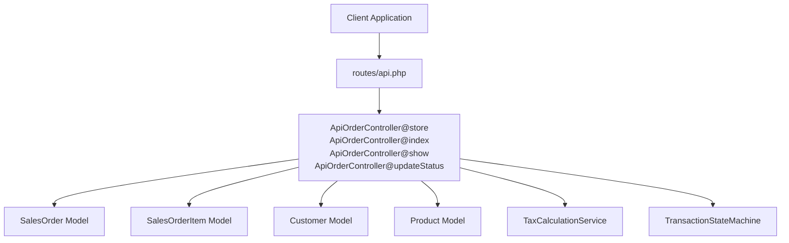
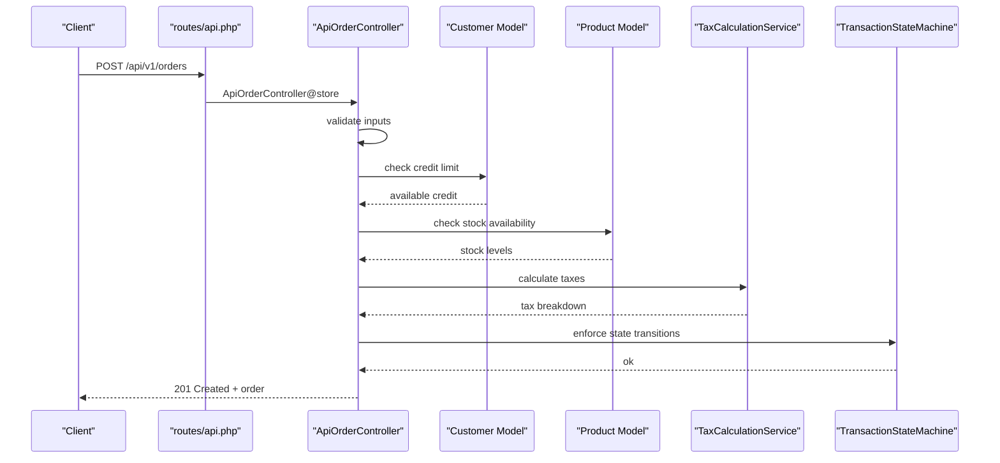
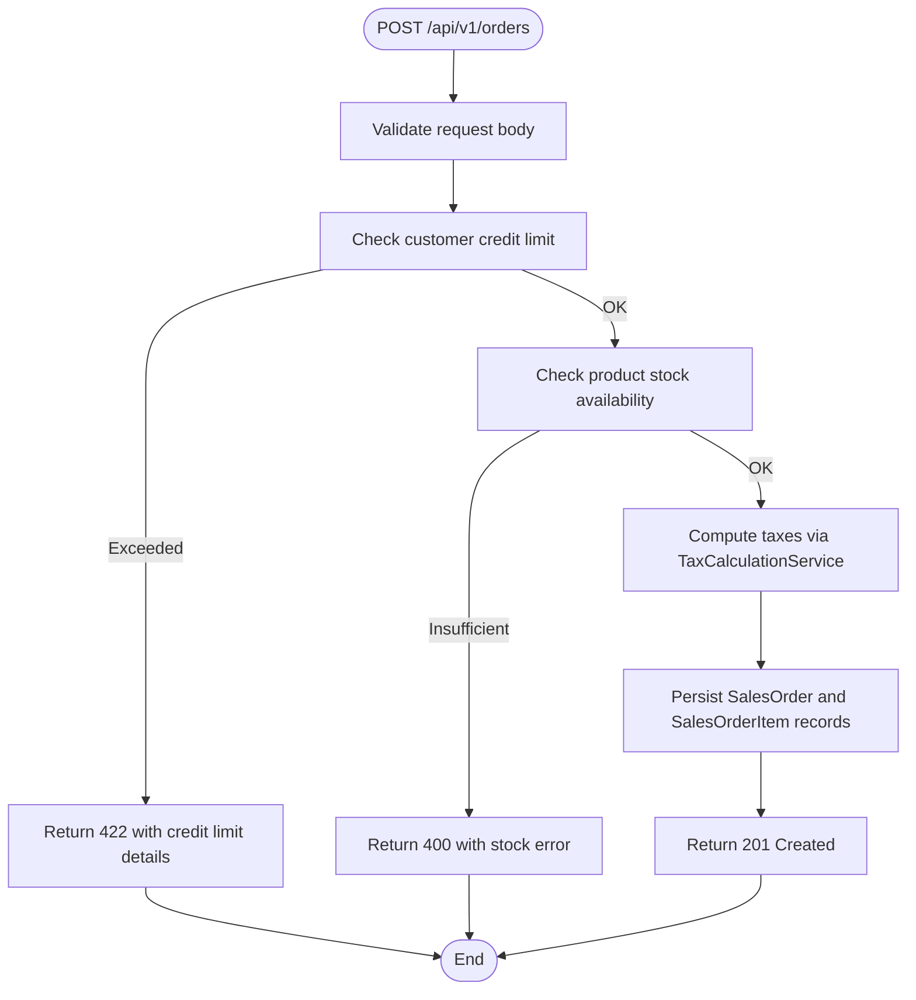
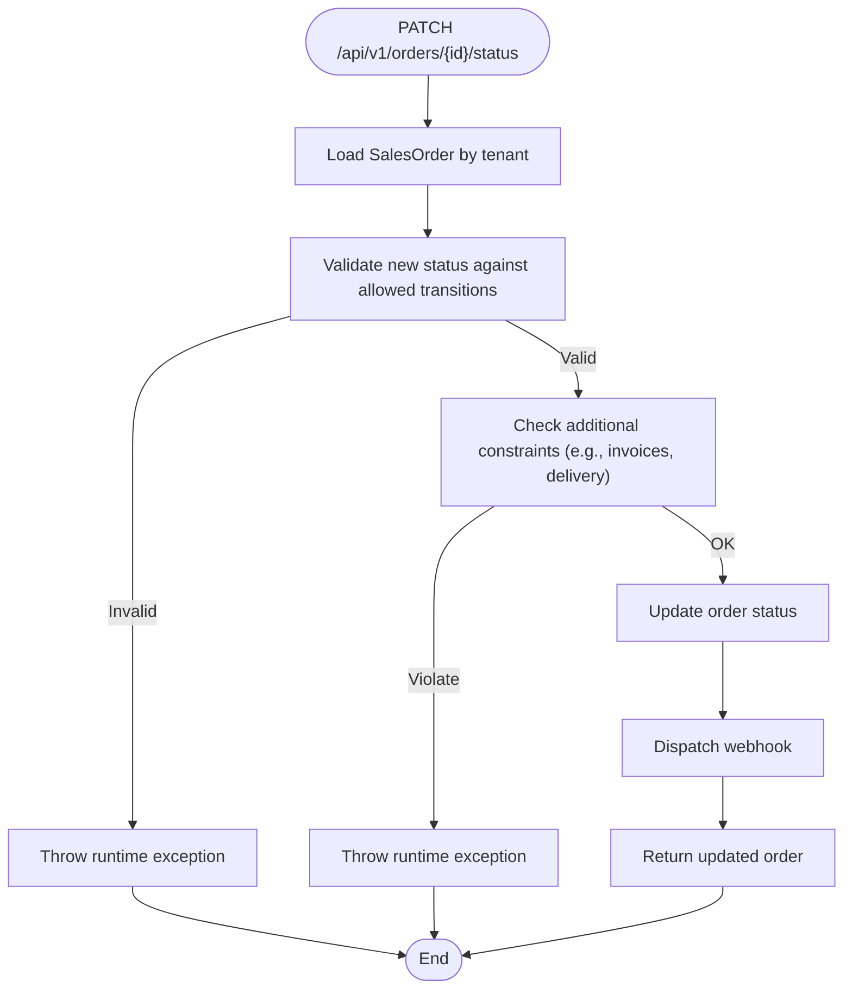
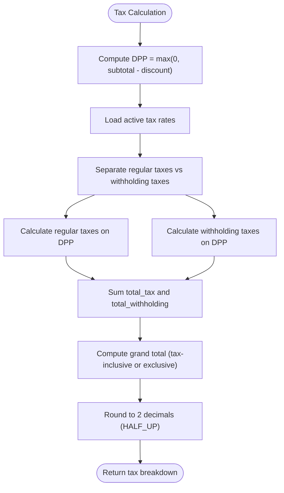
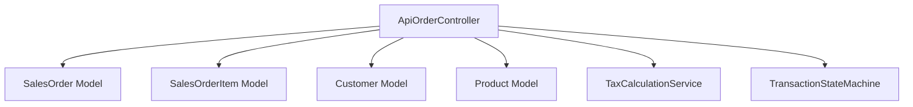
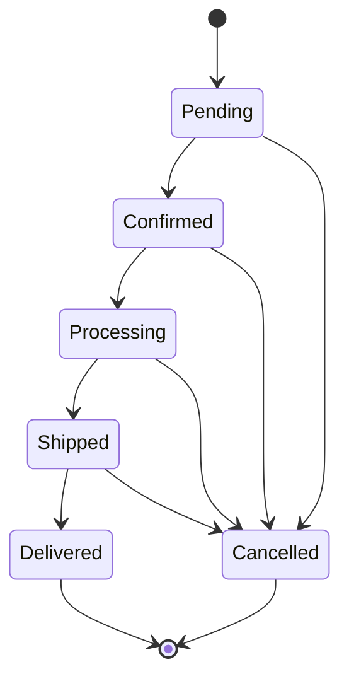

# Sales Orders API

<cite>
**Referenced Files in This Document**
- [routes/api.php](file://routes/api.php)
- [app/Http/Controllers/Api/ApiOrderController.php](file://app/Http/Controllers/Api/ApiOrderController.php)
- [app/Http/Controllers/SalesOrderController.php](file://app/Http/Controllers/SalesOrderController.php)
- [app/Models/SalesOrder.php](file://app/Models/SalesOrder.php)
- [app/Models/SalesOrderItem.php](file://app/Models/SalesOrderItem.php)
- [app/Models/Customer.php](file://app/Models/Customer.php)
- [app/Models/Product.php](file://app/Models/Product.php)
- [app/Services/TaxCalculationService.php](file://app/Services/TaxCalculationService.php)
- [app/Services/TransactionStateMachine.php](file://app/Services/TransactionStateMachine.php)
- [app/Services/ShippingService.php](file://app/Services/ShippingService.php)
- [public/api-docs/openapi.json](file://public/api-docs/openapi.json)
</cite>

## Table of Contents
1. [Introduction](#introduction)
2. [Project Structure](#project-structure)
3. [Core Components](#core-components)
4. [Architecture Overview](#architecture-overview)
5. [Detailed Component Analysis](#detailed-component-analysis)
6. [Dependency Analysis](#dependency-analysis)
7. [Performance Considerations](#performance-considerations)
8. [Troubleshooting Guide](#troubleshooting-guide)
9. [Conclusion](#conclusion)
10. [Appendices](#appendices)

## Introduction
This document provides comprehensive API documentation for sales order management. It covers order creation, modification, status updates, cancellation, and cancellation processes. It also documents order item management, quantity adjustments, pricing calculations, tax handling, and integration touchpoints with inventory and payment systems. Examples are provided for order fulfillment, shipping integration, and order tracking. The document outlines order workflow states, approval processes, and integration with inventory and payment systems.

## Project Structure
The sales order API is implemented as part of the REST API v1 under the /api/v1 prefix. The primary endpoints are:
- GET /api/v1/orders — List orders with optional filters
- GET /api/v1/orders/{id} — Retrieve a single order
- POST /api/v1/orders — Create a new order
- PATCH /api/v1/orders/{id}/status — Update order status

These endpoints are defined in the routes file and backed by dedicated controllers and models.

**Diagram sources**
- [routes/api.php:28-50](file://routes/api.php#L28-L50)
- [app/Http/Controllers/Api/ApiOrderController.php:13-217](file://app/Http/Controllers/Api/ApiOrderController.php#L13-L217)
- [app/Models/SalesOrder.php:13-123](file://app/Models/SalesOrder.php#L13-L123)
- [app/Models/SalesOrderItem.php:8-20](file://app/Models/SalesOrderItem.php#L8-L20)
- [app/Models/Customer.php:14-91](file://app/Models/Customer.php#L14-L91)
- [app/Models/Product.php:12-71](file://app/Models/Product.php#L12-L71)
- [app/Services/TaxCalculationService.php:29-307](file://app/Services/TaxCalculationService.php#L29-L307)
- [app/Services/TransactionStateMachine.php:31-314](file://app/Services/TransactionStateMachine.php#L31-L314)

**Section sources**
- [routes/api.php:28-50](file://routes/api.php#L28-L50)
- [public/api-docs/openapi.json:403-542](file://public/api-docs/openapi.json#L403-L542)

## Core Components
- SalesOrder model: Represents a sales order with fields for tenant, customer, user, dates, totals, taxes, currency, and status. Includes relationships to customer, items, invoices, delivery orders, and sales returns.
- SalesOrderItem model: Represents line items with product linkage, quantities, prices, discounts, and totals.
- Customer model: Provides credit limit checks and outstanding balance calculations used during order creation.
- Product model: Supplies product metadata and stock availability used for validation.
- TaxCalculationService: Computes taxes, withholding taxes, and grand totals with support for multiple tax rates and tax-inclusive pricing.
- TransactionStateMachine: Enforces strict state transitions for sales orders and posts journal entries upon posting.

Key validations and integrations:
- Credit limit validation for customers before order creation
- Stock availability checks against warehouse inventory
- Tax computation supporting multiple tax rates and withholding taxes
- Posting workflow with GL auto-posting and activity logging

**Section sources**
- [app/Models/SalesOrder.php:13-123](file://app/Models/SalesOrder.php#L13-L123)
- [app/Models/SalesOrderItem.php:8-20](file://app/Models/SalesOrderItem.php#L8-L20)
- [app/Models/Customer.php:70-89](file://app/Models/Customer.php#L70-L89)
- [app/Models/Product.php:61-69](file://app/Models/Product.php#L61-L69)
- [app/Services/TaxCalculationService.php:40-126](file://app/Services/TaxCalculationService.php#L40-L126)
- [app/Services/TransactionStateMachine.php:185-217](file://app/Services/TransactionStateMachine.php#L185-L217)

## Architecture Overview
The sales order API follows a layered architecture:
- API Layer: Routes define endpoints and middleware for authentication and rate limiting.
- Controller Layer: ApiOrderController handles requests, validates inputs, orchestrates business logic, and returns standardized responses.
- Service Layer: TaxCalculationService performs tax computations; TransactionStateMachine enforces state transitions and revision controls.
- Persistence Layer: Eloquent models encapsulate data access and relationships.

**Diagram sources**
- [routes/api.php:44-49](file://routes/api.php#L44-L49)
- [app/Http/Controllers/Api/ApiOrderController.php:90-148](file://app/Http/Controllers/Api/ApiOrderController.php#L90-L148)
- [app/Models/Customer.php:77-89](file://app/Models/Customer.php#L77-L89)
- [app/Models/Product.php:61-69](file://app/Models/Product.php#L61-L69)
- [app/Services/TaxCalculationService.php:40-126](file://app/Services/TaxCalculationService.php#L40-L126)
- [app/Services/TransactionStateMachine.php:185-217](file://app/Services/TransactionStateMachine.php#L185-L217)

## Detailed Component Analysis

### API Endpoints
- GET /api/v1/orders
  - Purpose: List orders with optional filters (status, date range).
  - Filters: status, from, to.
  - Response: Paginated collection of orders with customer and items loaded.
- GET /api/v1/orders/{id}
  - Purpose: Retrieve a single order with customer and items.
- POST /api/v1/orders
  - Purpose: Create a new sales order.
  - Request body fields: customer_id (optional), date, notes (optional), items (required).
  - Items: product_id, quantity, price (required).
  - Validation: Credit limit check for customer; stock availability checks; numeric and range validations.
  - Response: 201 Created with created order; fires webhook on success.
- PATCH /api/v1/orders/{id}/status
  - Purpose: Update order status with strict transition rules.
  - Allowed transitions: enforced by controller logic; invalid transitions raise errors.
  - Response: Updated order; fires webhook on change.

**Section sources**
- [routes/api.php:44-49](file://routes/api.php#L44-L49)
- [app/Http/Controllers/Api/ApiOrderController.php:68-88](file://app/Http/Controllers/Api/ApiOrderController.php#L68-L88)
- [app/Http/Controllers/Api/ApiOrderController.php:90-148](file://app/Http/Controllers/Api/ApiOrderController.php#L90-L148)
- [app/Http/Controllers/Api/ApiOrderController.php:150-215](file://app/Http/Controllers/Api/ApiOrderController.php#L150-L215)
- [public/api-docs/openapi.json:403-542](file://public/api-docs/openapi.json#L403-L542)

### Order Creation Workflow
- Input validation ensures required fields and numeric ranges.
- Credit limit check prevents exceeding customer limits.
- Stock availability is verified per item against warehouse inventory.
- Taxes are computed using TaxCalculationService supporting multiple tax rates and withholding taxes.
- Order and items are persisted within a transaction.
- Webhooks are dispatched on successful creation.

**Diagram sources**
- [app/Http/Controllers/Api/ApiOrderController.php:90-148](file://app/Http/Controllers/Api/ApiOrderController.php#L90-L148)
- [app/Models/Customer.php:77-89](file://app/Models/Customer.php#L77-L89)
- [app/Models/Product.php:61-69](file://app/Models/Product.php#L61-L69)
- [app/Services/TaxCalculationService.php:40-126](file://app/Services/TaxCalculationService.php#L40-L126)

**Section sources**
- [app/Http/Controllers/Api/ApiOrderController.php:90-148](file://app/Http/Controllers/Api/ApiOrderController.php#L90-L148)
- [app/Models/Customer.php:77-89](file://app/Models/Customer.php#L77-L89)
- [app/Models/Product.php:61-69](file://app/Models/Product.php#L61-L69)
- [app/Services/TaxCalculationService.php:40-126](file://app/Services/TaxCalculationService.php#L40-L126)

### Status Updates and Cancellation
- Status transitions are validated against predefined allowed transitions.
- Additional constraints prevent cancellation if invoices exist or if the order is already delivered.
- On successful status update, a webhook is dispatched.

**Diagram sources**
- [app/Http/Controllers/Api/ApiOrderController.php:150-215](file://app/Http/Controllers/Api/ApiOrderController.php#L150-L215)

**Section sources**
- [app/Http/Controllers/Api/ApiOrderController.php:150-215](file://app/Http/Controllers/Api/ApiOrderController.php#L150-L215)

### Tax Handling and Pricing Calculations
- Supports multiple tax rates and withholding taxes.
- Handles tax-inclusive pricing scenarios.
- Computes DPP (Tax Base), taxes, withholdings, and grand total with accounting-compliant rounding.

**Diagram sources**
- [app/Services/TaxCalculationService.php:40-126](file://app/Services/TaxCalculationService.php#L40-L126)

**Section sources**
- [app/Services/TaxCalculationService.php:40-126](file://app/Services/TaxCalculationService.php#L40-L126)

### Inventory and Stock Management
- During order creation, stock is decremented per item and recorded as outgoing movements.
- Stock movements capture quantity before/after and reference to the order number.

**Section sources**
- [app/Http/Controllers/Api/ApiOrderController.php:113-148](file://app/Http/Controllers/Api/ApiOrderController.php#L113-L148)

### Payment Integration
- Payment endpoints are available under /api/v1/payment, including QRIS generation, status checks, and webhook handling.
- Gateways are tenant-configurable and include testing capabilities.

**Section sources**
- [routes/api.php:107-134](file://routes/api.php#L107-L134)

### Shipping Integration and Tracking
- ShippingService integrates with RajaOngkir API (supports starter/basic/pro tiers).
- Features include rate estimation, province/city lookup, and shipment tracking (Pro tier).
- In demo mode without API key, mock rates are returned.

**Section sources**
- [app/Services/ShippingService.php:8-144](file://app/Services/ShippingService.php#L8-L144)

### Fulfillment and Delivery Orders
- The SalesOrderController provides a method to create invoices from sales orders.
- Delivery orders and sales returns are related via model relationships.

**Section sources**
- [app/Http/Controllers/SalesOrderController.php:386-422](file://app/Http/Controllers/SalesOrderController.php#L386-L422)
- [app/Models/SalesOrder.php:106-121](file://app/Models/SalesOrder.php#L106-L121)

## Dependency Analysis
The sales order API depends on:
- Models: SalesOrder, SalesOrderItem, Customer, Product
- Services: TaxCalculationService, TransactionStateMachine
- Routing: Defined in routes/api.php

**Diagram sources**
- [app/Http/Controllers/Api/ApiOrderController.php:13-217](file://app/Http/Controllers/Api/ApiOrderController.php#L13-L217)
- [app/Models/SalesOrder.php:13-123](file://app/Models/SalesOrder.php#L13-L123)
- [app/Models/SalesOrderItem.php:8-20](file://app/Models/SalesOrderItem.php#L8-L20)
- [app/Models/Customer.php:14-91](file://app/Models/Customer.php#L14-L91)
- [app/Models/Product.php:12-71](file://app/Models/Product.php#L12-L71)
- [app/Services/TaxCalculationService.php:29-307](file://app/Services/TaxCalculationService.php#L29-L307)
- [app/Services/TransactionStateMachine.php:31-314](file://app/Services/TransactionStateMachine.php#L31-L314)

**Section sources**
- [app/Http/Controllers/Api/ApiOrderController.php:13-217](file://app/Http/Controllers/Api/ApiOrderController.php#L13-L217)
- [app/Models/SalesOrder.php:13-123](file://app/Models/SalesOrder.php#L13-L123)
- [app/Models/SalesOrderItem.php:8-20](file://app/Models/SalesOrderItem.php#L8-L20)
- [app/Models/Customer.php:14-91](file://app/Models/Customer.php#L14-L91)
- [app/Models/Product.php:12-71](file://app/Models/Product.php#L12-L71)
- [app/Services/TaxCalculationService.php:29-307](file://app/Services/TaxCalculationService.php#L29-L307)
- [app/Services/TransactionStateMachine.php:31-314](file://app/Services/TransactionStateMachine.php#L31-L314)

## Performance Considerations
- Use pagination for listing orders to avoid large payloads.
- Apply filters (status, date range) to reduce query load.
- Batch operations should leverage transactions to maintain consistency.
- Webhooks are dispatched asynchronously; ensure queue workers are configured for reliable delivery.

## Troubleshooting Guide
Common issues and resolutions:
- Credit limit exceeded: The API returns a structured error with available credit details when customer credit limit would be exceeded.
- Insufficient stock: Validation fails with a message indicating available stock for the product.
- Invalid status transition: Attempting to transition to a disallowed status raises a runtime exception with allowed transitions.
- Cancellation constraints: Orders with existing invoices or already delivered cannot be cancelled.

**Section sources**
- [app/Http/Controllers/Api/ApiOrderController.php:37-67](file://app/Http/Controllers/Api/ApiOrderController.php#L37-L67)
- [app/Http/Controllers/Api/ApiOrderController.php:107-111](file://app/Http/Controllers/Api/ApiOrderController.php#L107-L111)
- [app/Http/Controllers/Api/ApiOrderController.php:173-215](file://app/Http/Controllers/Api/ApiOrderController.php#L173-L215)

## Conclusion
The sales order API provides a robust, validated, and tax-aware interface for managing orders. It enforces strict status transitions, integrates with inventory and payment systems, and supports multi-tax scenarios. The documented endpoints and flows enable reliable order creation, modification, fulfillment, and tracking.

## Appendices

### API Definitions

- GET /api/v1/orders
  - Query parameters: status (pending, confirmed, processing, shipped, delivered, cancelled), from (date), to (date)
  - Response: Paginated list of orders with customer and items populated

- GET /api/v1/orders/{id}
  - Path parameter: id (integer)
  - Response: Single order with customer and items populated

- POST /api/v1/orders
  - Request body:
    - customer_id: integer (nullable)
    - date: date (required)
    - notes: string (nullable)
    - items: array (required, min 1)
      - items.*.product_id: integer (required)
      - items.*.quantity: number (min 0.01)
      - items.*.price: number (min 0)
  - Response: 201 Created with created order

- PATCH /api/v1/orders/{id}/status
  - Path parameter: id (integer)
  - Request body: status (required; one of pending, confirmed, processing, shipped, delivered, cancelled)
  - Response: Updated order

**Section sources**
- [routes/api.php:44-49](file://routes/api.php#L44-L49)
- [public/api-docs/openapi.json:403-542](file://public/api-docs/openapi.json#L403-L542)

### Order Workflow States and Transitions
- Front-end and back-end enforce allowed transitions to ensure process integrity.
- The state machine enforces strict transitions for posted/cancelled states.

**Diagram sources**
- [app/Http/Controllers/Api/ApiOrderController.php:21-28](file://app/Http/Controllers/Api/ApiOrderController.php#L21-L28)
- [app/Http/Controllers/Api/ApiOrderController.php:173-197](file://app/Http/Controllers/Api/ApiOrderController.php#L173-L197)

### Examples

- Order Creation
  - Endpoint: POST /api/v1/orders
  - Request payload includes customer_id, date, items with product_id, quantity, and price.
  - Response: 201 Created with the created order object.

- Status Update
  - Endpoint: PATCH /api/v1/orders/{id}/status
  - Request payload includes status set to one of the allowed transitions.
  - Response: Updated order object.

- Invoice Creation from Sales Order
  - Endpoint: POST /api/v1/orders/{id}/invoice (backend controller)
  - Creates an invoice linked to the sales order with computed amounts.

- Shipping Rate Estimation
  - Endpoint: GET /api/v1/logistics/rates (via integration routes)
  - Uses ShippingService to estimate shipping costs based on origin, destination, weight, and courier.

- Order Tracking
  - Endpoint: GET /api/v1/logistics/track (via integration routes)
  - Uses ShippingService to track shipments (Pro tier required).

**Section sources**
- [app/Http/Controllers/Api/ApiOrderController.php:90-148](file://app/Http/Controllers/Api/ApiOrderController.php#L90-L148)
- [app/Http/Controllers/Api/ApiOrderController.php:150-215](file://app/Http/Controllers/Api/ApiOrderController.php#L150-L215)
- [app/Http/Controllers/SalesOrderController.php:386-422](file://app/Http/Controllers/SalesOrderController.php#L386-L422)
- [app/Services/ShippingService.php:28-60](file://app/Services/ShippingService.php#L28-L60)
- [app/Services/ShippingService.php:65-91](file://app/Services/ShippingService.php#L65-L91)