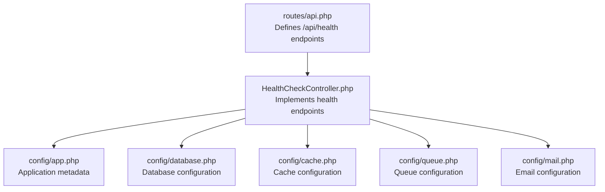
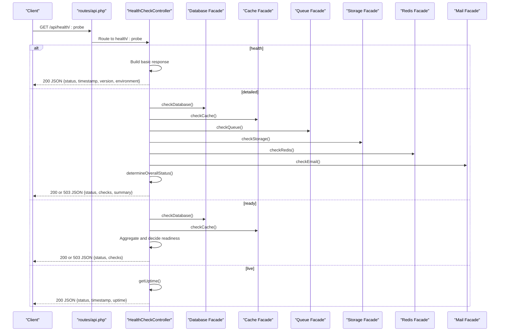
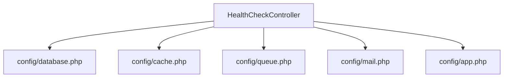

# System Health & Monitoring API

<cite>
**Referenced Files in This Document**
- [api.php](file://routes/api.php)
- [HealthCheckController.php](file://app/Http/Controllers/HealthCheckController.php)
- [app.php](file://config/app.php)
- [database.php](file://config/database.php)
- [cache.php](file://config/cache.php)
- [queue.php](file://config/queue.php)
- [mail.php](file://config/mail.php)
</cite>

## Table of Contents
1. [Introduction](#introduction)
2. [Project Structure](#project-structure)
3. [Core Components](#core-components)
4. [Architecture Overview](#architecture-overview)
5. [Detailed Component Analysis](#detailed-component-analysis)
6. [Dependency Analysis](#dependency-analysis)
7. [Performance Considerations](#performance-considerations)
8. [Troubleshooting Guide](#troubleshooting-guide)
9. [Conclusion](#conclusion)
10. [Appendices](#appendices)

## Introduction
This document provides comprehensive API documentation for system health monitoring endpoints. It covers:
- Health check, readiness probes, and liveness endpoints
- Detailed system status reporting across core dependencies
- Dependency checks for database, cache, queue, storage, Redis, and email
- Kubernetes integration examples for health checks and probes
- Monitoring and alerting setup guidance
- Response formats and status interpretation for different system components

The health monitoring endpoints are exposed under the `/api/health` route prefix and are publicly accessible without authentication.

## Project Structure
The health monitoring endpoints are defined in the API routes and implemented by a dedicated controller. Supporting configuration files define the underlying infrastructure dependencies checked by the health endpoints.

**Diagram sources**
- [api.php:169-175](file://routes/api.php#L169-L175)
- [HealthCheckController.php:25-376](file://app/Http/Controllers/HealthCheckController.php#L25-L376)
- [app.php:1-127](file://config/app.php#L1-L127)
- [database.php:1-185](file://config/database.php#L1-L185)
- [cache.php:1-131](file://config/cache.php#L1-L131)
- [queue.php:1-130](file://config/queue.php#L1-L130)
- [mail.php:1-119](file://config/mail.php#L1-L119)

**Section sources**
- [api.php:169-175](file://routes/api.php#L169-L175)

## Core Components
This section documents the four primary health endpoints and their purpose:
- Basic health: Returns application status, timestamp, version, and environment
- Detailed health: Returns an aggregated status across all dependencies with per-service details
- Readiness probe: Used by orchestrators to determine if the service can accept traffic
- Liveness probe: Used by orchestrators to determine if the service process is alive

Key behaviors:
- Basic health returns a simple JSON with healthy status
- Detailed health aggregates individual dependency checks and sets HTTP status accordingly
- Readiness probe requires database and cache to be healthy
- Liveness probe returns alive status with uptime

**Section sources**
- [HealthCheckController.php:32-40](file://app/Http/Controllers/HealthCheckController.php#L32-L40)
- [HealthCheckController.php:47-73](file://app/Http/Controllers/HealthCheckController.php#L47-L73)
- [HealthCheckController.php:80-104](file://app/Http/Controllers/HealthCheckController.php#L80-L104)
- [HealthCheckController.php:111-119](file://app/Http/Controllers/HealthCheckController.php#L111-L119)

## Architecture Overview
The health endpoints are implemented by a single controller that performs dependency checks against Laravel's facade services. The controller aggregates results and returns structured JSON responses.

**Diagram sources**
- [api.php:169-175](file://routes/api.php#L169-L175)
- [HealthCheckController.php:32-119](file://app/Http/Controllers/HealthCheckController.php#L32-L119)

## Detailed Component Analysis

### Health Check Endpoints
- Endpoint: GET /api/health/
  - Purpose: Basic health verification
  - Response: Healthy status, ISO timestamp, application version, environment
  - Status Codes: 200 OK
- Endpoint: GET /api/health/detailed
  - Purpose: Comprehensive health report across all dependencies
  - Response: Aggregated status, per-dependency checks, summary counts, ISO timestamp, version, environment
  - Status Codes: 200 OK or 503 Service Unavailable depending on overall health
- Endpoint: GET /api/health/ready
  - Purpose: Kubernetes readiness probe
  - Response: Ready/not_ready, per-dependency checks, ISO timestamp
  - Status Codes: 200 OK if healthy, 503 Service Unavailable otherwise
- Endpoint: GET /api/health/live
  - Purpose: Kubernetes liveness probe
  - Response: Alive status, ISO timestamp, uptime duration
  - Status Codes: 200 OK

Interpretation guidelines:
- Basic health: Use for simple heartbeat checks
- Detailed health: Use for comprehensive monitoring dashboards and alerting
- Ready: Use for traffic gating; only mark ready when database and cache are healthy
- Live: Use for process health; indicates the application is running

**Section sources**
- [api.php:169-175](file://routes/api.php#L169-L175)
- [HealthCheckController.php:32-40](file://app/Http/Controllers/HealthCheckController.php#L32-L40)
- [HealthCheckController.php:47-73](file://app/Http/Controllers/HealthCheckController.php#L47-L73)
- [HealthCheckController.php:80-104](file://app/Http/Controllers/HealthCheckController.php#L80-L104)
- [HealthCheckController.php:111-119](file://app/Http/Controllers/HealthCheckController.php#L111-L119)

### Dependency Checks and Response Formats
Each dependency check returns a standardized structure with status and metadata. The overall health status is determined by prioritizing unhealthy > degraded > healthy.

- Database check
  - Status: healthy/unhealthy
  - Metadata: driver, response_time_ms, message
  - Notes: Uses a simple SELECT to verify connectivity
- Cache check
  - Status: healthy/unhealthy/degraded
  - Metadata: driver, response_time_ms, message
  - Notes: Tests write/read/forget cycle; mismatches indicate failure
- Queue check
  - Status: healthy/unhealthy/degraded
  - Metadata: driver, response_time_ms, message, warning (for sync driver)
  - Notes: For sync driver, always healthy; for others, queries queue size
- Storage check
  - Status: healthy/unhealthy
  - Metadata: disk, response_time_ms, message
  - Notes: Writes and reads a temporary file on the local disk
- Redis check
  - Status: healthy/unhealthy/degraded/not_configured
  - Metadata: response_time_ms, message, impact (when degraded)
  - Notes: Requires Redis extension; ping test performed
- Email check
  - Status: healthy/unhealthy/degraded
  - Metadata: driver, host/port (SMTP), message, recommendation
  - Notes: Logs and arrays are considered degraded/unhealthy for production

Aggregation rules:
- If any dependency is unhealthy, overall status is unhealthy
- Else if any dependency is degraded, overall status is degraded
- Else overall status is healthy

HTTP status mapping:
- Detailed and Ready endpoints return 503 when overall status is unhealthy; otherwise 200

**Section sources**
- [HealthCheckController.php:124-145](file://app/Http/Controllers/HealthCheckController.php#L124-L145)
- [HealthCheckController.php:150-183](file://app/Http/Controllers/HealthCheckController.php#L150-L183)
- [HealthCheckController.php:188-225](file://app/Http/Controllers/HealthCheckController.php#L188-L225)
- [HealthCheckController.php:230-265](file://app/Http/Controllers/HealthCheckController.php#L230-L265)
- [HealthCheckController.php:270-298](file://app/Http/Controllers/HealthCheckController.php#L270-L298)
- [HealthCheckController.php:303-339](file://app/Http/Controllers/HealthCheckController.php#L303-L339)
- [HealthCheckController.php:344-359](file://app/Http/Controllers/HealthCheckController.php#L344-L359)

### Kubernetes Deployment Examples
Below are example Kubernetes probe configurations targeting the health endpoints. Replace <your-host> with your actual service host.

- Liveness Probe
  - Path: /api/health/live
  - InitialDelaySeconds: 30
  - PeriodSeconds: 10
  - TimeoutSeconds: 5
  - SuccessThreshold: 1
  - FailureThreshold: 3
- Readiness Probe
  - Path: /api/health/ready
  - InitialDelaySeconds: 30
  - PeriodSeconds: 10
  - TimeoutSeconds: 5
  - SuccessThreshold: 1
  - FailureThreshold: 3
- Startup Probe (optional)
  - Path: /api/health/ready
  - InitialDelaySeconds: 60
  - PeriodSeconds: 10
  - TimeoutSeconds: 5
  - SuccessThreshold: 1
  - FailureThreshold: 3

These probes ensure traffic is only sent to pods that pass readiness checks and that the process remains alive according to the liveness probe.

**Section sources**
- [api.php:169-175](file://routes/api.php#L169-L175)

### Monitoring Integration and Alerting Setup
- Prometheus scraping: Configure Prometheus to scrape the /api/health/live endpoint for basic liveness signals. For detailed metrics, integrate with your existing monitoring stack to consume the /api/health/detailed endpoint.
- Grafana dashboards: Visualize dependency health statuses and response times from the detailed endpoint.
- Alerting rules:
  - If overall status is unhealthy, trigger critical alert
  - If overall status is degraded, trigger warning alert
  - If database or cache unhealthy, escalate immediately
  - If Redis degraded, monitor closely and escalate based on SLA

**Section sources**
- [HealthCheckController.php:47-73](file://app/Http/Controllers/HealthCheckController.php#L47-L73)

## Dependency Analysis
The health controller depends on Laravel facades and configuration files to evaluate system dependencies. The following diagram shows the relationships between the controller and configuration sources.

**Diagram sources**
- [HealthCheckController.php:6-10](file://app/Http/Controllers/HealthCheckController.php#L6-L10)
- [database.php:1-185](file://config/database.php#L1-L185)
- [cache.php:1-131](file://config/cache.php#L1-L131)
- [queue.php:1-130](file://config/queue.php#L1-L130)
- [mail.php:1-119](file://config/mail.php#L1-L119)
- [app.php:1-127](file://config/app.php#L1-L127)

**Section sources**
- [HealthCheckController.php:6-10](file://app/Http/Controllers/HealthCheckController.php#L6-L10)
- [database.php:1-185](file://config/database.php#L1-L185)
- [cache.php:1-131](file://config/cache.php#L1-L131)
- [queue.php:1-130](file://config/queue.php#L1-L130)
- [mail.php:1-119](file://config/mail.php#L1-L119)
- [app.php:1-127](file://config/app.php#L1-L127)

## Performance Considerations
- Response time measurement: Each dependency check measures response time in milliseconds and includes it in the response for observability.
- Non-blocking checks: The checks perform minimal operations (ping/select/write/read) to avoid impacting application performance.
- Degraded vs unhealthy: Some components (like queue and Redis) may return degraded instead of unhealthy to distinguish partial failures from complete outages.

**Section sources**
- [HealthCheckController.php:127-130](file://app/Http/Controllers/HealthCheckController.php#L127-L130)
- [HealthCheckController.php:155-158](file://app/Http/Controllers/HealthCheckController.php#L155-L158)
- [HealthCheckController.php:207-208](file://app/Http/Controllers/HealthCheckController.php#L207-L208)
- [HealthCheckController.php:239-240](file://app/Http/Controllers/HealthCheckController.php#L239-L240)
- [HealthCheckController.php:282-283](file://app/Http/Controllers/HealthCheckController.php#L282-L283)

## Troubleshooting Guide
Common scenarios and resolutions:
- Database unhealthy
  - Verify database credentials and connectivity in configuration
  - Check for network issues or database server downtime
- Cache unhealthy
  - Confirm cache driver configuration and availability
  - Ensure proper permissions for file-based cache or network connectivity for remote cache
- Queue degraded
  - For sync driver, consider switching to database or Redis for production
  - Investigate queue backend connectivity or configuration
- Storage unhealthy
  - Check local disk permissions and available space
- Redis degraded
  - Install Redis extension if missing
  - Verify Redis server connectivity and credentials
- Email degraded/unhealthy
  - Configure SMTP for production; log/array drivers are intended for development/testing

Interpretation of statuses:
- healthy: All systems operational
- degraded: Partial functionality (e.g., queue or Redis issues)
- unhealthy: Critical failure (e.g., database or storage issues)
- not_configured: Optional dependency not installed (e.g., Redis extension)

**Section sources**
- [HealthCheckController.php:138-144](file://app/Http/Controllers/HealthCheckController.php#L138-L144)
- [HealthCheckController.php:176-182](file://app/Http/Controllers/HealthCheckController.php#L176-L182)
- [HealthCheckController.php:217-224](file://app/Http/Controllers/HealthCheckController.php#L217-L224)
- [HealthCheckController.php:258-264](file://app/Http/Controllers/HealthCheckController.php#L258-L264)
- [HealthCheckController.php:291-297](file://app/Http/Controllers/HealthCheckController.php#L291-L297)
- [HealthCheckController.php:317-338](file://app/Http/Controllers/HealthCheckController.php#L317-L338)

## Conclusion
The health monitoring API provides essential observability for the system, enabling robust Kubernetes deployments, comprehensive monitoring dashboards, and effective alerting. By leveraging the four endpoints—basic health, detailed health, readiness, and liveness—you can ensure reliable traffic routing, early detection of issues, and transparent visibility into system dependencies.

## Appendices

### Endpoint Reference
- GET /api/health/
  - Description: Basic health check
  - Response fields: status, timestamp, version, environment
  - Typical response: 200 OK
- GET /api/health/detailed
  - Description: Detailed health report across all dependencies
  - Response fields: status, timestamp, version, environment, checks, summary
  - Typical response: 200 OK or 503 Service Unavailable
- GET /api/health/ready
  - Description: Kubernetes readiness probe
  - Response fields: status, checks, timestamp
  - Typical response: 200 OK or 503 Service Unavailable
- GET /api/health/live
  - Description: Kubernetes liveness probe
  - Response fields: status, timestamp, uptime
  - Typical response: 200 OK

**Section sources**
- [api.php:169-175](file://routes/api.php#L169-L175)
- [HealthCheckController.php:32-40](file://app/Http/Controllers/HealthCheckController.php#L32-L40)
- [HealthCheckController.php:47-73](file://app/Http/Controllers/HealthCheckController.php#L47-L73)
- [HealthCheckController.php:80-104](file://app/Http/Controllers/HealthCheckController.php#L80-L104)
- [HealthCheckController.php:111-119](file://app/Http/Controllers/HealthCheckController.php#L111-L119)