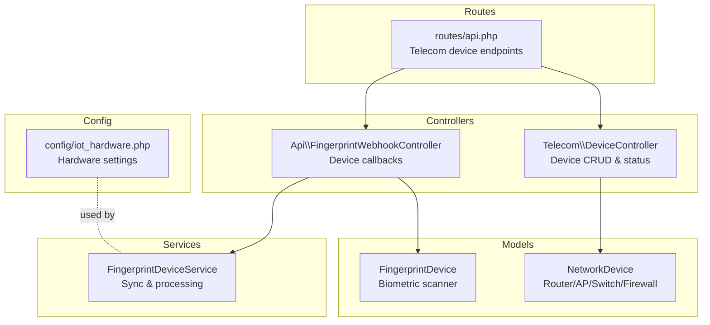
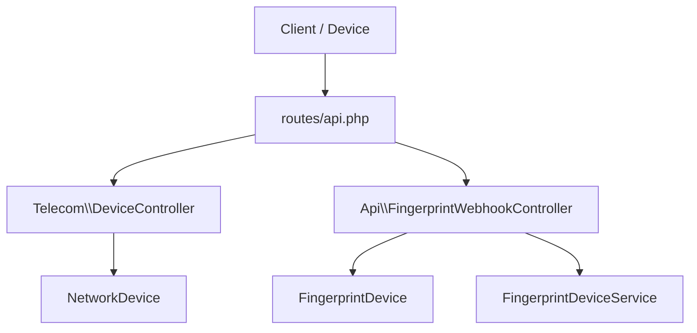
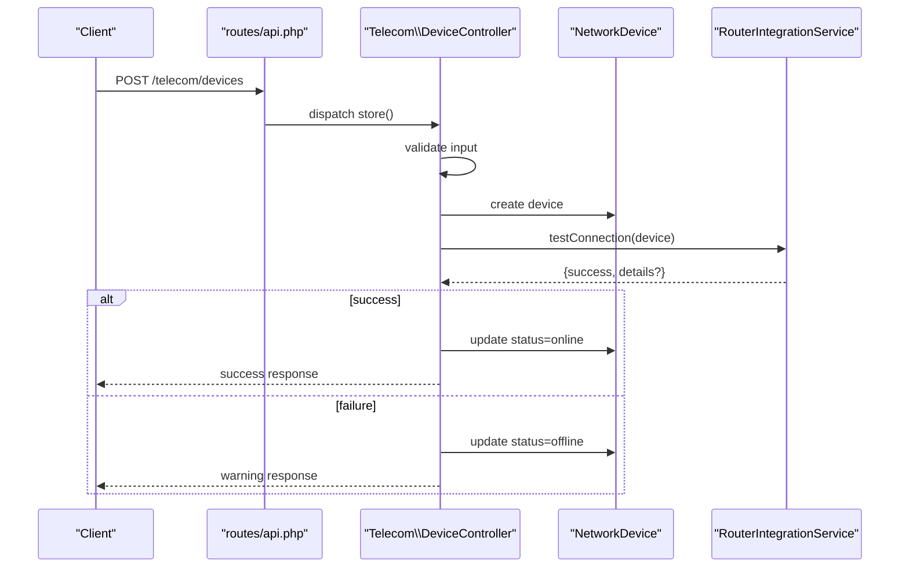
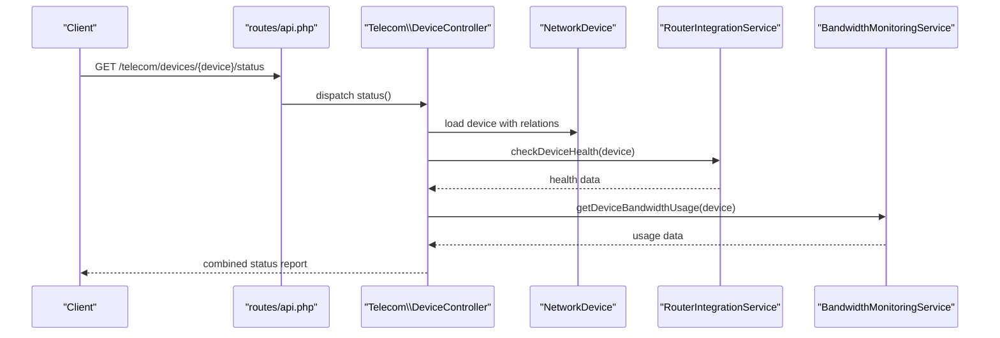
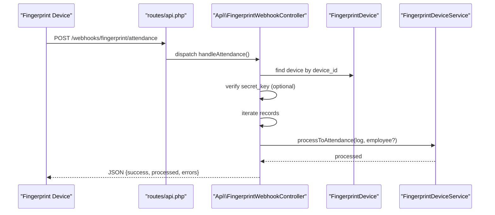
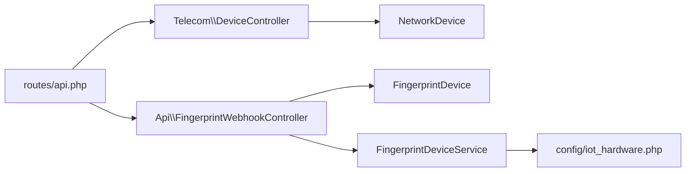

# Device Management API

<cite>
**Referenced Files in This Document**
- [api.php](file://routes/api.php)
- [DeviceController.php](file://app/Http/Controllers/Telecom/DeviceController.php)
- [NetworkDevice.php](file://app/Models/NetworkDevice.php)
- [2026_04_04_000001_create_network_devices_table.php](file://database/migrations/2026_04_04_000001_create_network_devices_table.php)
- [FingerprintWebhookController.php](file://app/Http/Controllers/Api/FingerprintWebhookController.php)
- [FingerprintDeviceService.php](file://app/Services/FingerprintDeviceService.php)
- [FingerprintDevice.php](file://app/Models/FingerprintDevice.php)
- [2026_04_04_000001_create_fingerprint_devices_table.php](file://database/migrations/2026_04_04_000001_create_fingerprint_devices_table.php)
- [iot_hardware.php](file://config/iot_hardware.php)
- [auth.php](file://config/auth.php)
</cite>

## Table of Contents
1. [Introduction](#introduction)
2. [Project Structure](#project-structure)
3. [Core Components](#core-components)
4. [Architecture Overview](#architecture-overview)
5. [Detailed Component Analysis](#detailed-component-analysis)
6. [Dependency Analysis](#dependency-analysis)
7. [Performance Considerations](#performance-considerations)
8. [Troubleshooting Guide](#troubleshooting-guide)
9. [Conclusion](#conclusion)
10. [Appendices](#appendices)

## Introduction
This document provides comprehensive API documentation for device management endpoints within the telecom module, covering device provisioning, registration, lifecycle management, discovery, configuration synchronization, and status monitoring. It also documents authentication mechanisms for device-to-server communication and secure device provisioning protocols. The scope includes network devices (routers, access points, switches, firewalls) and biometric fingerprint devices used for attendance synchronization.

## Project Structure
The device management APIs are organized under the telecom module with dedicated routes, controllers, models, and supporting services. Webhooks enable device-initiated callbacks for attendance and heartbeat events. Configuration files define hardware integration parameters.



**Diagram sources**
- [api.php:64-91](file://routes/api.php#L64-L91)
- [DeviceController.php:13-347](file://app/Http/Controllers/Telecom/DeviceController.php#L13-L347)
- [FingerprintWebhookController.php:13-223](file://app/Http/Controllers/Api/FingerprintWebhookController.php#L13-L223)
- [NetworkDevice.php:13-191](file://app/Models/NetworkDevice.php#L13-L191)
- [FingerprintDevice.php:11-76](file://app/Models/FingerprintDevice.php#L11-L76)
- [FingerprintDeviceService.php:12-372](file://app/Services/FingerprintDeviceService.php#L12-L372)
- [iot_hardware.php:1-217](file://config/iot_hardware.php#L1-L217)

**Section sources**
- [api.php:64-91](file://routes/api.php#L64-L91)

## Core Components
- Telecom Device Management Controller: Handles listing, creation, updating, deletion, connection testing, and maintenance toggling for network devices.
- Network Device Model: Represents routers, access points, switches, and firewalls with attributes such as IP/port, credentials, capabilities, configuration, and status.
- Fingerprint Device Webhook Controller: Processes attendance events, heartbeat pings, and pending registration queries from fingerprint devices.
- Fingerprint Device Service: Manages device connectivity checks, attendance log synchronization, and employee fingerprint registration/removal.
- Fingerprint Device Model: Stores device metadata, connection configuration, and synchronization status.
- IoT Hardware Configuration: Provides defaults and tunables for various hardware integrations (e.g., Bluetooth, smart scale, RFID, thermal printer).

Key API surface for device management:
- GET /telecom/devices
- POST /telecom/devices
- GET /telecom/devices/{device}/status
- POST /telecom/hotspot/users
- GET /telecom/hotspot/users/{user}/stats
- POST /telecom/hotspot/users/{user}/suspend
- POST /telecom/hotspot/users/{user}/reactivate
- GET /telecom/usage/{customerId}
- POST /telecom/usage/record
- POST /telecom/vouchers/generate
- POST /telecom/vouchers/redeem
- GET /telecom/vouchers/stats
- POST /telecom/webhook/router-usage
- POST /telecom/webhook/device-alert
- POST /webhooks/fingerprint/attendance
- POST /webhooks/fingerprint/heartbeat
- GET /webhooks/fingerprint/pending-registrations

**Section sources**
- [api.php:64-91](file://routes/api.php#L64-L91)
- [DeviceController.php:27-142](file://app/Http/Controllers/Telecom/DeviceController.php#L27-L142)
- [NetworkDevice.php:17-49](file://app/Models/NetworkDevice.php#L17-L49)
- [FingerprintWebhookController.php:24-185](file://app/Http/Controllers/Api/FingerprintWebhookController.php#L24-L185)
- [FingerprintDeviceService.php:17-130](file://app/Services/FingerprintDeviceService.php#L17-L130)
- [FingerprintDevice.php:14-40](file://app/Models/FingerprintDevice.php#L14-L40)

## Architecture Overview
The device management architecture separates concerns between:
- Route layer: Defines telecom and webhook endpoints with rate limiting and authentication middleware.
- Controller layer: Implements device provisioning, status retrieval, and lifecycle actions.
- Model layer: Encapsulates device persistence, relations, and helpers.
- Service layer: Orchestrates device-specific operations (e.g., fingerprint sync).
- Configuration layer: Supplies hardware integration parameters.



**Diagram sources**
- [api.php:64-91](file://routes/api.php#L64-L91)
- [DeviceController.php:13-347](file://app/Http/Controllers/Telecom/DeviceController.php#L13-L347)
- [FingerprintWebhookController.php:13-223](file://app/Http/Controllers/Api/FingerprintWebhookController.php#L13-L223)
- [NetworkDevice.php:13-191](file://app/Models/NetworkDevice.php#L13-L191)
- [FingerprintDevice.php:11-76](file://app/Models/FingerprintDevice.php#L11-L76)
- [FingerprintDeviceService.php:12-372](file://app/Services/FingerprintDeviceService.php#L12-L372)

## Detailed Component Analysis

### Network Device Provisioning and Lifecycle
Endpoints:
- GET /telecom/devices: List devices with filtering and pagination.
- POST /telecom/devices: Create a new device; automatically tests connectivity and sets initial status.
- GET /telecom/devices/{device}: Retrieve device details, health, and recent alerts.
- PUT /telecom/devices/{device}: Update device configuration and credentials; optionally re-test connectivity.
- DELETE /telecom/devices/{device}: Remove device if safe to delete.
- POST /telecom/devices/{device}/test-connection: Explicitly test device connectivity.
- POST /telecom/devices/{device}/maintenance: Toggle maintenance mode.

Processing logic:
- Validation ensures required fields and acceptable values for brand, type, IP, port, and credentials.
- On creation, the controller invokes router integration to test connectivity; status is set accordingly.
- Updates support optional password changes and re-validation of connectivity.
- Deletion enforces constraints: no active subscriptions and no active hotspot users.



**Diagram sources**
- [api.php:67-68](file://routes/api.php#L67-L68)
- [DeviceController.php:87-142](file://app/Http/Controllers/Telecom/DeviceController.php#L87-L142)

**Section sources**
- [api.php:67-69](file://routes/api.php#L67-L69)
- [DeviceController.php:27-142](file://app/Http/Controllers/Telecom/DeviceController.php#L27-L142)
- [NetworkDevice.php:17-49](file://app/Models/NetworkDevice.php#L17-L49)

### Device Status Monitoring and Health Checks
Endpoints:
- GET /telecom/devices/{device}/status: Returns current device status and related metrics.

Controller behavior:
- Loads device with related subscriptions and users.
- Attempts live health and bandwidth usage retrieval via integration services.
- Aggregates recent alerts for the device.



**Diagram sources**
- [api.php:69](file://routes/api.php#L69)
- [DeviceController.php:147-175](file://app/Http/Controllers/Telecom/DeviceController.php#L147-L175)

**Section sources**
- [api.php:69](file://routes/api.php#L69)
- [DeviceController.php:147-175](file://app/Http/Controllers/Telecom/DeviceController.php#L147-L175)

### Fingerprint Device Webhooks and Attendance Synchronization
Endpoints:
- POST /webhooks/fingerprint/attendance: Device pushes attendance records; server persists logs and attempts to process to attendance.
- POST /webhooks/fingerprint/heartbeat: Device pings server to indicate connectivity.
- GET /webhooks/fingerprint/pending-registrations: Device requests employees pending fingerprint registration.

Security and flow:
- Device identification via device_id and optional secret_key verification.
- Device must be active; inactive devices receive forbidden responses.
- Attendance records are validated, logged, and processed to attendance if employee mapping exists.



**Diagram sources**
- [api.php:58-61](file://routes/api.php#L58-L61)
- [FingerprintWebhookController.php:24-99](file://app/Http/Controllers/Api/FingerprintWebhookController.php#L24-L99)
- [FingerprintDeviceService.php:154-272](file://app/Services/FingerprintDeviceService.php#L154-L272)

**Section sources**
- [api.php:58-61](file://routes/api.php#L58-L61)
- [FingerprintWebhookController.php:24-185](file://app/Http/Controllers/Api/FingerprintWebhookController.php#L24-L185)
- [FingerprintDeviceService.php:74-130](file://app/Services/FingerprintDeviceService.php#L74-L130)

### Authentication and Authorization
- Telecom device endpoints under /telecom require Sanctum authentication and enforce write-rate limits.
- Webhook endpoints (both telecom and fingerprint) are public and rely on signature-based verification or device secret keys.
- General API token middleware supports read/write scopes and rate limiting for other API groups.

Authentication highlights:
- Sanctum guard for telecom endpoints.
- No authentication for fingerprint/webhook endpoints; device secret keys and device_id provide device identity and basic protection.

**Section sources**
- [api.php:64](file://routes/api.php#L64)
- [api.php:58-61](file://routes/api.php#L58-L61)
- [auth.php:40-44](file://config/auth.php#L40-L44)

### Data Models and Database Schema
Network Devices:
- Fields include tenant association, device identity, connectivity credentials, capabilities, configuration, status, timestamps, and hierarchical parent reference.
- Indexes optimize tenant+status and tenant+type queries; unique constraint on tenant+IP+port.

Fingerprint Devices:
- Fields include tenant association, device_id, IP/port, protocol, vendor/model, API/secret keys, activity flags, last sync timestamp, and JSON config.
- Indexes optimize tenant+active and tenant+device_id.

```mermaid
erDiagram
NETWORK_DEVICES {
bigint id PK
bigint tenant_id FK
string name
string device_type
string brand
string model
string ip_address
int port
string username
string password_encrypted
string api_token
string mac_address
string serial_number
string firmware_version
enum status
timestamp last_seen_at
json capabilities
json configuration
text notes
bigint parent_device_id FK
timestamps
}
FINGERPRINT_DEVICES {
bigint id PK
bigint tenant_id FK
string name
string device_id UK
string ip_address
string port
string protocol
string vendor
string model
string api_key
string secret_key
boolean is_active
boolean is_connected
timestamp last_sync_at
json config
text notes
timestamps
}
TENANTS {
bigint id PK
}
NETWORK_DEVICES }o--|| TENANTS : "belongs to"
FINGERPRINT_DEVICES }o--|| TENANTS : "belongs to"
```

**Diagram sources**
- [2026_04_04_000001_create_network_devices_table.php:13-43](file://database/migrations/2026_04_04_000001_create_network_devices_table.php#L13-L43)
- [2026_04_04_000001_create_fingerprint_devices_table.php:13-34](file://database/migrations/2026_04_04_000001_create_fingerprint_devices_table.php#L13-L34)

**Section sources**
- [2026_04_04_000001_create_network_devices_table.php:13-43](file://database/migrations/2026_04_04_000001_create_network_devices_table.php#L13-L43)
- [2026_04_04_000001_create_fingerprint_devices_table.php:13-34](file://database/migrations/2026_04_04_000001_create_fingerprint_devices_table.php#L13-L34)

## Dependency Analysis
- Controllers depend on models for persistence and on services for device-specific operations.
- Webhooks depend on device models and services to process incoming data streams.
- Routes define middleware layers: Sanctum for authenticated endpoints and rate limiting for throughput control.
- Configuration files supply hardware integration defaults leveraged by services.



**Diagram sources**
- [api.php:64-91](file://routes/api.php#L64-L91)
- [DeviceController.php:13-347](file://app/Http/Controllers/Telecom/DeviceController.php#L13-L347)
- [FingerprintWebhookController.php:13-223](file://app/Http/Controllers/Api/FingerprintWebhookController.php#L13-L223)
- [NetworkDevice.php:13-191](file://app/Models/NetworkDevice.php#L13-L191)
- [FingerprintDevice.php:11-76](file://app/Models/FingerprintDevice.php#L11-L76)
- [FingerprintDeviceService.php:12-372](file://app/Services/FingerprintDeviceService.php#L12-L372)
- [iot_hardware.php:1-217](file://config/iot_hardware.php#L1-L217)

**Section sources**
- [api.php:64-91](file://routes/api.php#L64-L91)
- [DeviceController.php:13-347](file://app/Http/Controllers/Telecom/DeviceController.php#L13-L347)
- [FingerprintWebhookController.php:13-223](file://app/Http/Controllers/Api/FingerprintWebhookController.php#L13-L223)

## Performance Considerations
- Pagination: Device listing uses pagination to limit payload sizes.
- Indexes: Database indexes on tenant_id with status/type and unique tenant+IP+port improve query performance.
- Rate limiting: Middleware enforces rate caps for read/write and webhook traffic to prevent abuse.
- Lazy loading: Controllers defer heavy computations (health/bandwidth) to reduce latency for listing operations.
- Background processing: Consider offloading heavy synchronization tasks to queues for fingerprint devices.

## Troubleshooting Guide
Common issues and resolutions:
- Device connection failures during provisioning:
  - Verify IP/port and credentials; re-test connection after updates.
  - Review integration service logs for detailed error messages.
- Unauthorized webhook access:
  - Ensure device_id matches registered device and secret_key is correct.
  - Confirm device is active before sending webhook payloads.
- Attendance processing errors:
  - Check employee fingerprint_uid mapping; logs are marked unprocessed when employee is not found.
  - Validate timestamp formats and scan types.
- Maintenance mode:
  - Toggle maintenance mode to temporarily take devices offline for maintenance without deleting configurations.

**Section sources**
- [DeviceController.php:124-141](file://app/Http/Controllers/Telecom/DeviceController.php#L124-L141)
- [FingerprintWebhookController.php:40-54](file://app/Http/Controllers/Api/FingerprintWebhookController.php#L40-L54)
- [FingerprintDeviceService.php:154-184](file://app/Services/FingerprintDeviceService.php#L154-L184)

## Conclusion
The device management API provides a robust foundation for provisioning, monitoring, and lifecycle management of network and biometric devices. It integrates securely with webhook-driven workflows for attendance and heartbeat monitoring while enforcing authentication and rate-limiting policies. Extending support for firmware updates, configuration synchronization, and advanced discovery features can further enhance operational efficiency.

## Appendices

### API Reference Summary

- Device Management
  - GET /telecom/devices
  - POST /telecom/devices
  - GET /telecom/devices/{device}
  - PUT /telecom/devices/{device}
  - DELETE /telecom/devices/{device}
  - POST /telecom/devices/{device}/test-connection
  - POST /telecom/devices/{device}/maintenance

- Device Status
  - GET /telecom/devices/{device}/status

- Hotspot User Management
  - POST /telecom/hotspot/users
  - GET /telecom/hotspot/users/{user}/stats
  - POST /telecom/hotspot/users/{user}/suspend
  - POST /telecom/hotspot/users/{user}/reactivate

- Usage Tracking
  - GET /telecom/usage/{customerId}
  - POST /telecom/usage/record

- Voucher Management
  - POST /telecom/vouchers/generate
  - POST /telecom/vouchers/redeem
  - GET /telecom/vouchers/stats

- Webhooks
  - POST /telecom/webhook/router-usage
  - POST /telecom/webhook/device-alert
  - POST /webhooks/fingerprint/attendance
  - POST /webhooks/fingerprint/heartbeat
  - GET /webhooks/fingerprint/pending-registrations

- Authentication Notes
  - Telecom endpoints: Sanctum authentication required.
  - Webhook endpoints: No authentication; rely on device secret keys and device_id.

**Section sources**
- [api.php:64-91](file://routes/api.php#L64-L91)