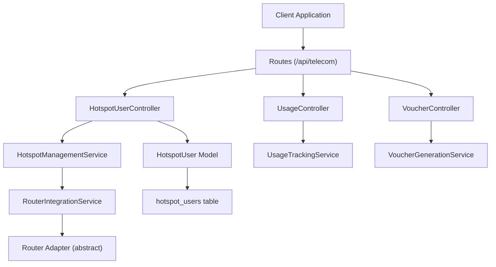
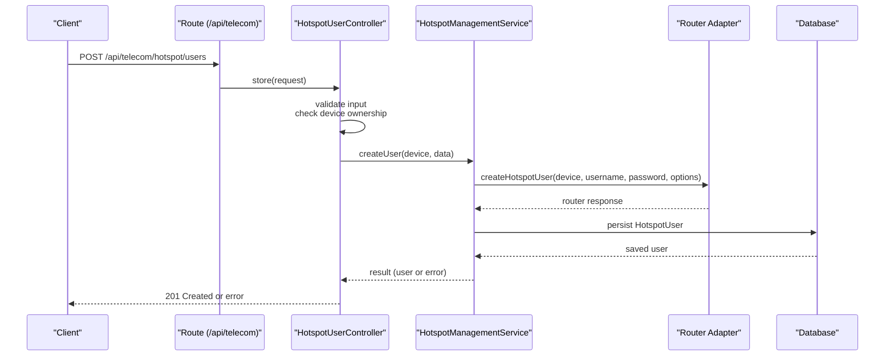
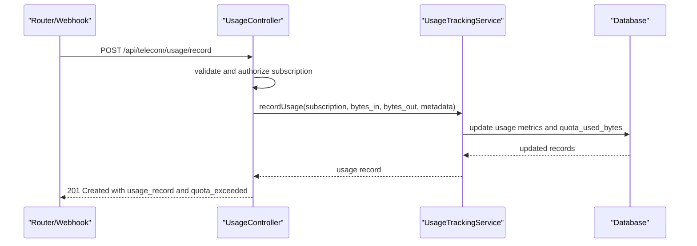
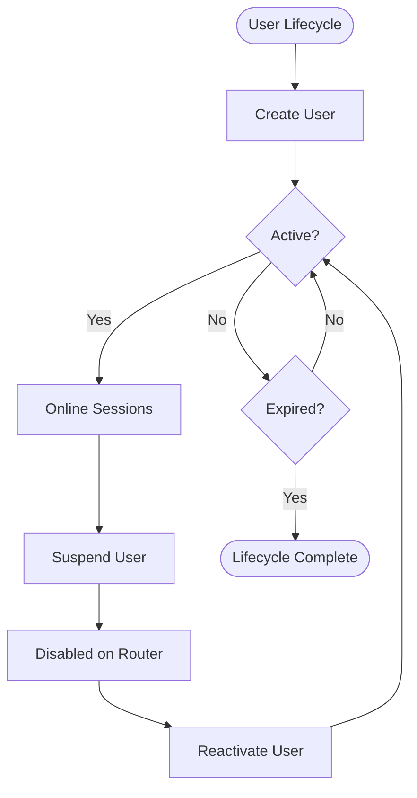
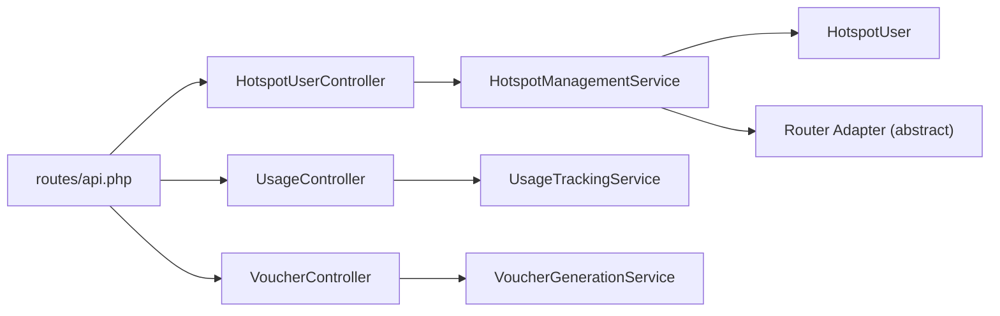

# Hotspot User Management API

<cite>
**Referenced Files in This Document**
- [api.php](file://routes/api.php)
- [HotspotUserController.php](file://app/Http/Controllers/Api/Telecom/HotspotUserController.php)
- [HotspotManagementService.php](file://app/Services/Telecom/HotspotManagementService.php)
- [HotspotUser.php](file://app/Models/HotspotUser.php)
- [create_hotspot_users_table.php](file://database/migrations/2026_04_04_000005_create_hotspot_users_table.php)
- [UsageController.php](file://app/Http/Controllers/Api/Telecom/UsageController.php)
- [VoucherController.php](file://app/Http/Controllers/Api/Telecom/VoucherController.php)
</cite>

## Table of Contents
1. [Introduction](#introduction)
2. [Project Structure](#project-structure)
3. [Core Components](#core-components)
4. [Architecture Overview](#architecture-overview)
5. [Detailed Component Analysis](#detailed-component-analysis)
6. [Dependency Analysis](#dependency-analysis)
7. [Performance Considerations](#performance-considerations)
8. [Troubleshooting Guide](#troubleshooting-guide)
9. [Conclusion](#conclusion)

## Introduction
This document provides comprehensive API documentation for the Hotspot User Management system within the Telecom module. It covers user registration, authentication, session management, and account lifecycle operations. Additionally, it documents credential management, access control policies, billing integration via usage tracking, and usage monitoring. Integration points with router adapters and subscription management are explained, along with practical examples for onboarding, token generation, session validation, and activity monitoring.

## Project Structure
The Hotspot User Management API is organized under the Telecom module with dedicated controller, service, model, and migration components. Routes are grouped under `/api/telecom` and secured with Sanctum authentication and rate limiting middleware.

**Diagram sources**
- [api.php:64-85](file://routes/api.php#L64-L85)
- [HotspotUserController.php:11-171](file://app/Http/Controllers/Api/Telecom/HotspotUserController.php#L11-L171)
- [HotspotManagementService.php:14-231](file://app/Services/Telecom/HotspotManagementService.php#L14-L231)
- [HotspotUser.php:12-250](file://app/Models/HotspotUser.php#L12-L250)
- [create_hotspot_users_table.php:7-77](file://database/migrations/2026_04_04_000005_create_hotspot_users_table.php#L7-L77)

**Section sources**
- [api.php:64-85](file://routes/api.php#L64-L85)

## Core Components
- HotspotUserController: Handles user creation, statistics retrieval, suspension, and reactivation. Implements tenant ownership checks and integrates with HotspotManagementService.
- HotspotManagementService: Orchestrates router adapter interactions for user CRUD, quota updates, bandwidth profiles, and user stats collection.
- HotspotUser Model: Represents user records with encryption for passwords, quota and session metrics, and tenant scoping.
- UsageController: Provides customer usage summaries and records router-reported usage against subscriptions.
- VoucherController: Generates and redeems vouchers linked to internet packages and customers.

**Section sources**
- [HotspotUserController.php:25-171](file://app/Http/Controllers/Api/Telecom/HotspotUserController.php#L25-L171)
- [HotspotManagementService.php:30-231](file://app/Services/Telecom/HotspotManagementService.php#L30-L231)
- [HotspotUser.php:16-250](file://app/Models/HotspotUser.php#L16-L250)
- [UsageController.php:25-149](file://app/Http/Controllers/Api/Telecom/UsageController.php#L25-L149)
- [VoucherController.php:26-172](file://app/Http/Controllers/Api/Telecom/VoucherController.php#L26-L172)

## Architecture Overview
The API follows a layered architecture:
- Routes define endpoints under `/api/telecom` with Sanctum authentication and rate limiting.
- Controllers handle request validation, tenant checks, and orchestrate service operations.
- Services encapsulate router adapter interactions and business logic.
- Models manage persistence, encryption, and computed attributes.
- Migrations define the schema for hotspot user records and indexes.

**Diagram sources**
- [api.php:72](file://routes/api.php#L72)
- [HotspotUserController.php:25-79](file://app/Http/Controllers/Api/Telecom/HotspotUserController.php#L25-L79)
- [HotspotManagementService.php:30-50](file://app/Services/Telecom/HotspotManagementService.php#L30-L50)

## Detailed Component Analysis

### User Registration API
- Endpoint: POST /api/telecom/hotspot/users
- Authentication: Requires Sanctum token
- Request body fields:
  - device_id (required): network device identifier owned by the tenant
  - username (optional): user identifier; auto-generated if omitted
  - password (optional): user password; auto-generated if omitted
  - download_speed_kbps (optional): Kbps limit
  - upload_speed_kbps (optional): Kbps limit
  - quota_bytes (optional): total quota in bytes; 0 means unlimited
  - expires_at (optional): expiration datetime
  - comment (optional): note
  - subscription_id (optional): links to telecom subscription
- Response:
  - 201 Created with user object on success
  - 400 Bad Request with error message if router operation fails
  - 403 Forbidden if device does not belong to tenant
  - 422 Unprocessable Entity for validation errors
  - 500 Internal Server Error for unexpected failures

Example request payload:
- device_id: 123
- username: "john_doe"
- password: "SecurePass123!"
- download_speed_kbps: 5120
- upload_speed_kbps: 1024
- quota_bytes: 10737418240
- expires_at: "2025-12-31T23:59:59Z"
- comment: "Guest user for conference"

Success response includes the created user object with hidden encrypted password.

**Section sources**
- [api.php:72](file://routes/api.php#L72)
- [HotspotUserController.php:25-79](file://app/Http/Controllers/Api/Telecom/HotspotUserController.php#L25-L79)
- [HotspotManagementService.php:30-50](file://app/Services/Telecom/HotspotManagementService.php#L30-L50)
- [HotspotUser.php:106-121](file://app/Models/HotspotUser.php#L106-L121)

### User Statistics API
- Endpoint: GET /api/telecom/hotspot/users/{user}/stats
- Authentication: Requires Sanctum token
- Path parameter: user (HotspotUser model)
- Response includes:
  - Online status, IP/MAC address
  - Bytes in/out/total with formatted values
  - Uptime, quota usage/limit/remaining (formatted)
  - Total sessions and total uptime seconds
- Tenant ownership check ensures access only to tenant-owned users.

Example response keys:
- username, is_online, ip_address, mac_address
- bytes_in, bytes_out, bytes_total (+ formatted variants)
- uptime, quota_used, quota_limit, quota_remaining (+ formatted)
- total_sessions, total_uptime

**Section sources**
- [api.php:73](file://routes/api.php#L73)
- [HotspotUserController.php:86-107](file://app/Http/Controllers/Api/Telecom/HotspotUserController.php#L86-L107)
- [HotspotManagementService.php:181-213](file://app/Services/Telecom/HotspotManagementService.php#L181-L213)

### User Suspension API
- Endpoint: POST /api/telecom/hotspot/users/{user}/suspend
- Authentication: Requires Sanctum token
- Behavior:
  - Disables user on router via adapter
  - Disconnects active session if online
  - Sets is_active to false in database
- Response:
  - 200 OK with refreshed user object on success
  - 500 Internal Server Error if router operation fails

**Section sources**
- [api.php:74](file://routes/api.php#L74)
- [HotspotUserController.php:114-138](file://app/Http/Controllers/Api/Telecom/HotspotUserController.php#L114-L138)
- [HotspotManagementService.php:120-145](file://app/Services/Telecom/HotspotManagementService.php#L120-L145)

### User Reactivation API
- Endpoint: POST /api/telecom/hotspot/users/{user}/reactivate
- Authentication: Requires Sanctum token
- Behavior:
  - Enables user on router via adapter
  - Updates is_active to true in database
- Response:
  - 200 OK with refreshed user object on success
  - 500 Internal Server Error if router operation fails

**Section sources**
- [api.php:75](file://routes/api.php#L75)
- [HotspotUserController.php:145-169](file://app/Http/Controllers/Api/Telecom/HotspotUserController.php#L145-L169)
- [HotspotManagementService.php:153-173](file://app/Services/Telecom/HotspotManagementService.php#L153-L173)

### Usage Tracking Integration
- Retrieve customer usage summary:
  - Endpoint: GET /api/telecom/usage/{customerId}
  - Validates tenant ownership of customer
  - Finds latest active subscription
  - Returns customer, subscription, and usage summary
- Record router-reported usage:
  - Endpoint: POST /api/telecom/usage/record
  - Validates subscription ownership (tenant-aware)
  - Accepts bytes_in, bytes_out, packets, duration, peak bandwidth, IP/MAC, period metadata
  - Persists usage and updates quota usage on subscription
  - Returns usage record and quota status

**Diagram sources**
- [UsageController.php:83-147](file://app/Http/Controllers/Api/Telecom/UsageController.php#L83-L147)

**Section sources**
- [UsageController.php:25-76](file://app/Http/Controllers/Api/Telecom/UsageController.php#L25-L76)
- [UsageController.php:83-147](file://app/Http/Controllers/Api/Telecom/UsageController.php#L83-L147)

### Voucher Management Integration
- Generate vouchers:
  - Endpoint: POST /api/telecom/vouchers/generate
  - Validates package ownership by tenant
  - Supports single or batch generation with options (length, pattern, validity, max usage, sale price, batch number)
  - Returns generated codes with package details
- Redeem vouchers:
  - Endpoint: POST /api/telecom/vouchers/redeem
  - Optional customer association (tenant-scoped)
  - Optional username assignment
  - Returns voucher, package, and message
- Voucher statistics:
  - Endpoint: GET /api/telecom/vouchers/stats
  - Returns tenant-scoped statistics, optionally filtered by batch number

**Section sources**
- [VoucherController.php:26-91](file://app/Http/Controllers/Api/Telecom/VoucherController.php#L26-L91)
- [VoucherController.php:98-147](file://app/Http/Controllers/Api/Telecom/VoucherController.php#L98-L147)
- [VoucherController.php:154-170](file://app/Http/Controllers/Api/Telecom/VoucherController.php#L154-L170)

### Credential Management and Access Control
- Password handling:
  - Passwords are stored encrypted in the database via model mutators
  - Decryption helper is available for internal operations
- Access control:
  - All endpoints require Sanctum authentication
  - Controllers enforce tenant ownership for devices, users, packages, and customers
  - Router adapter operations are scoped per device tenant association

**Section sources**
- [HotspotUser.php:106-121](file://app/Models/HotspotUser.php#L106-L121)
- [HotspotUserController.php:40-45](file://app/Http/Controllers/Api/Telecom/HotspotUserController.php#L40-L45)
- [VoucherController.php:41-43](file://app/Http/Controllers/Api/Telecom/VoucherController.php#L41-L43)
- [UsageController.php:28-31](file://app/Http/Controllers/Api/Telecom/UsageController.php#L28-L31)

### Account Lifecycle Operations
- Creation: Auto-generates username/password if not provided; applies router configuration (bandwidth, quota, expiry)
- Suspension: Disables router account and disconnects active sessions
- Reactivation: Re-enables router account and restores access
- Deletion: Router adapter removes user from device; database cleanup handled by service

**Diagram sources**
- [HotspotManagementService.php:120-173](file://app/Services/Telecom/HotspotManagementService.php#L120-L173)

## Dependency Analysis
- Controllers depend on services for business logic and router adapter interactions.
- Services depend on router adapters (abstract) and database models.
- Models encapsulate encryption, computed attributes, and tenant scoping.
- Routes group endpoints under `/api/telecom` with shared middleware for authentication and rate limiting.

**Diagram sources**
- [api.php:64-85](file://routes/api.php#L64-L85)
- [HotspotUserController.php:11-18](file://app/Http/Controllers/Api/Telecom/HotspotUserController.php#L11-L18)
- [HotspotManagementService.php:14-21](file://app/Services/Telecom/HotspotManagementService.php#L14-L21)

**Section sources**
- [api.php:64-85](file://routes/api.php#L64-L85)
- [HotspotManagementService.php:14-231](file://app/Services/Telecom/HotspotManagementService.php#L14-L231)

## Performance Considerations
- Indexes on tenant_id and status fields improve filtering for active and online users.
- Bandwidth and quota updates are applied via router adapters; ensure adapter implementations are efficient.
- Usage recording aggregates bytes and updates quota atomically; consider batching for high-frequency events.
- Tenant scoping prevents cross-tenant queries; maintain consistent tenant context in requests.

[No sources needed since this section provides general guidance]

## Troubleshooting Guide
Common issues and resolutions:
- Unauthorized access: Ensure the device, user, package, or customer belongs to the authenticated tenant.
- Validation failures: Review field constraints (e.g., integer min/max, date validation, allowed periods).
- Router operation errors: Check adapter connectivity and credentials; verify device compatibility.
- Exceeded quota or expiration: Confirm quota_bytes and expires_at values; reset quota if needed.
- Session disconnect failures: Validate active session presence and adapter support for disconnection.

**Section sources**
- [HotspotUserController.php:40-45](file://app/Http/Controllers/Api/Telecom/HotspotUserController.php#L40-L45)
- [HotspotManagementService.php:120-145](file://app/Services/Telecom/HotspotManagementService.php#L120-L145)
- [HotspotUser.php:137-145](file://app/Models/HotspotUser.php#L137-L145)

## Conclusion
The Hotspot User Management API provides a robust foundation for provisioning, controlling, and monitoring hotspot users within tenant boundaries. It integrates seamlessly with router adapters for real-time control, supports comprehensive usage tracking aligned with subscriptions, and offers voucher-based monetization. By adhering to tenant scoping, validation rules, and adapter interfaces, operators can reliably manage user lifecycles and enforce access policies.