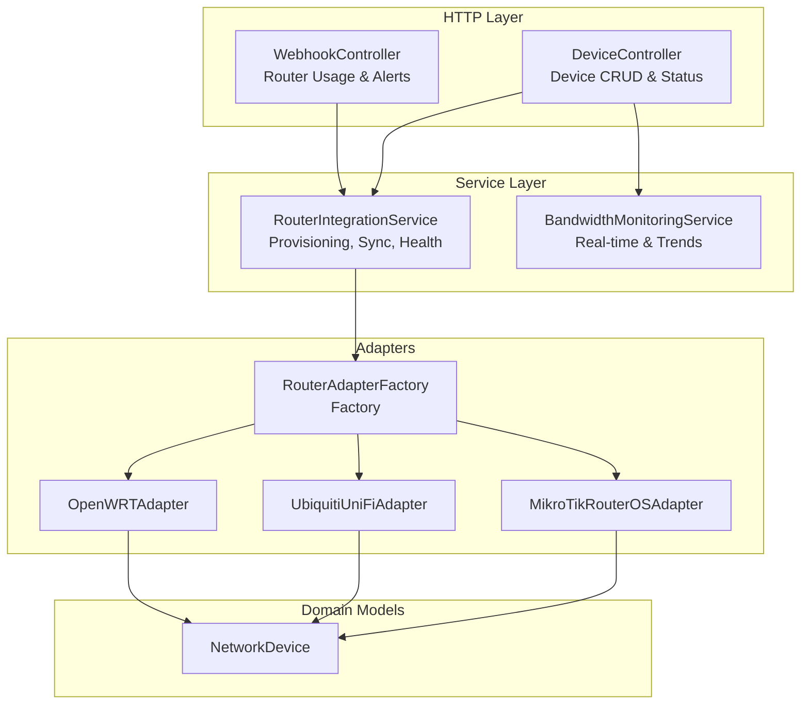
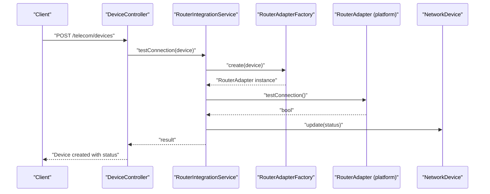
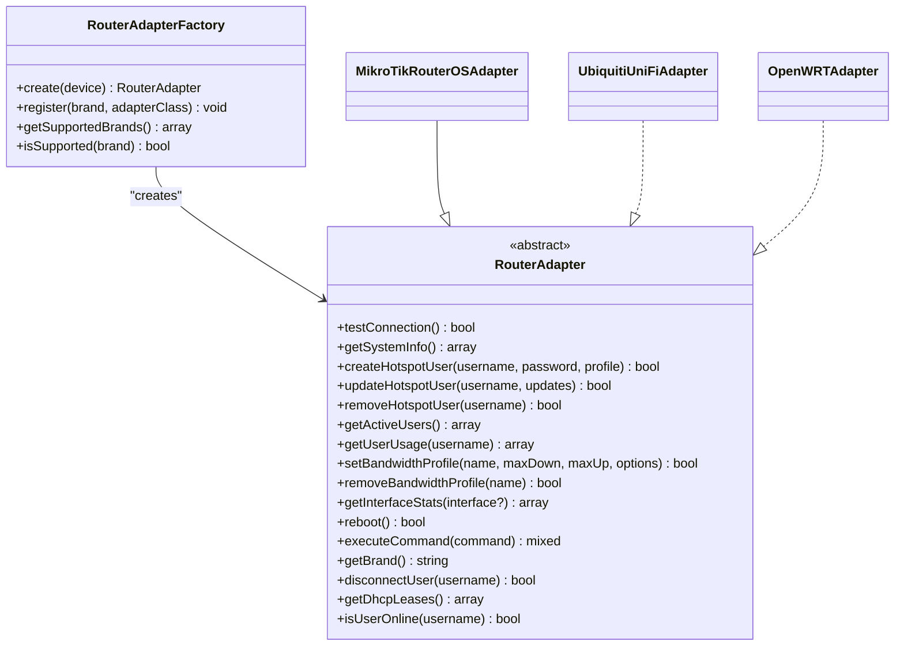
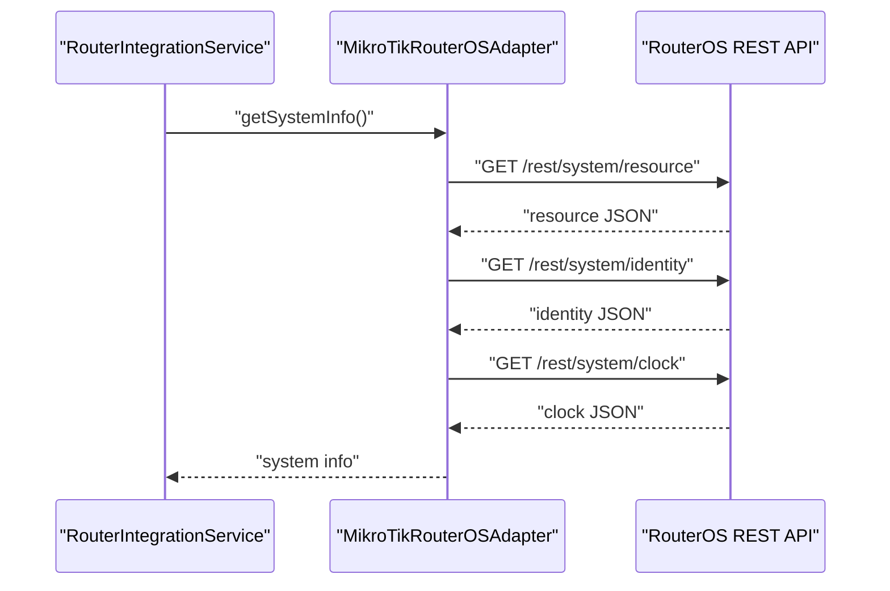
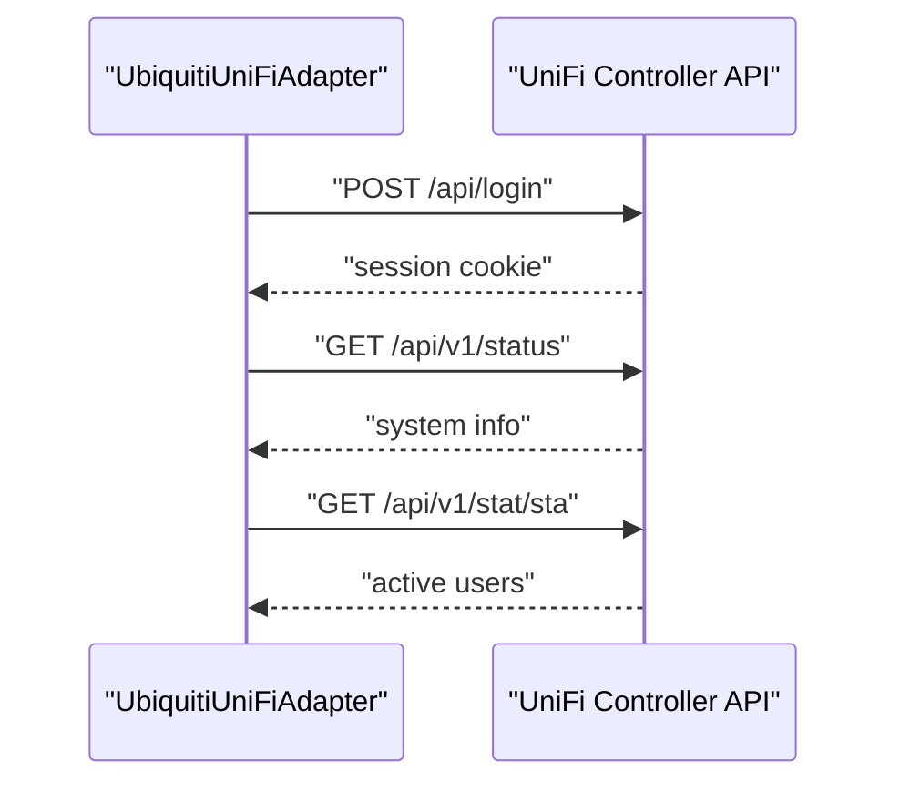
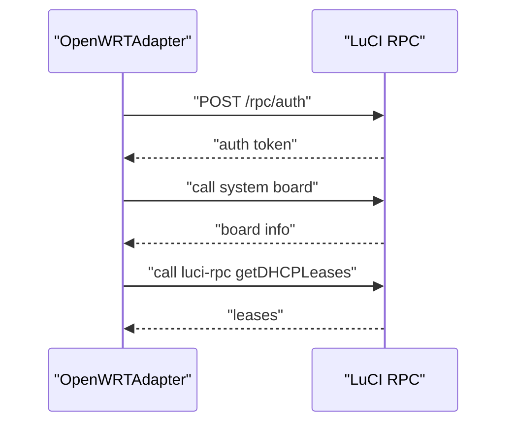
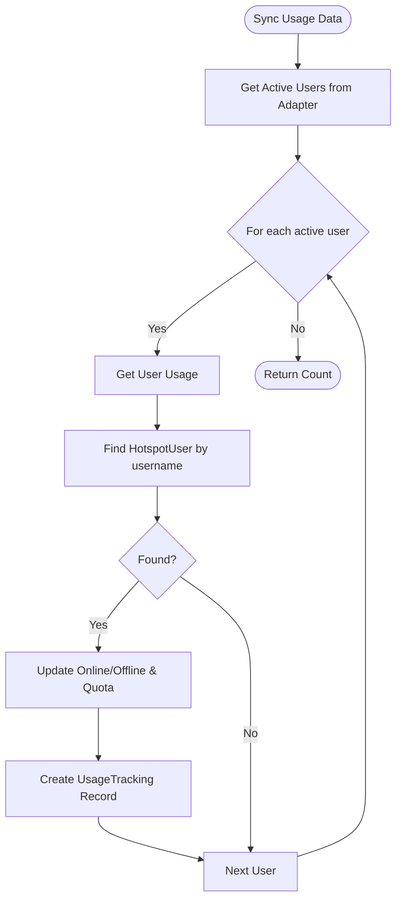
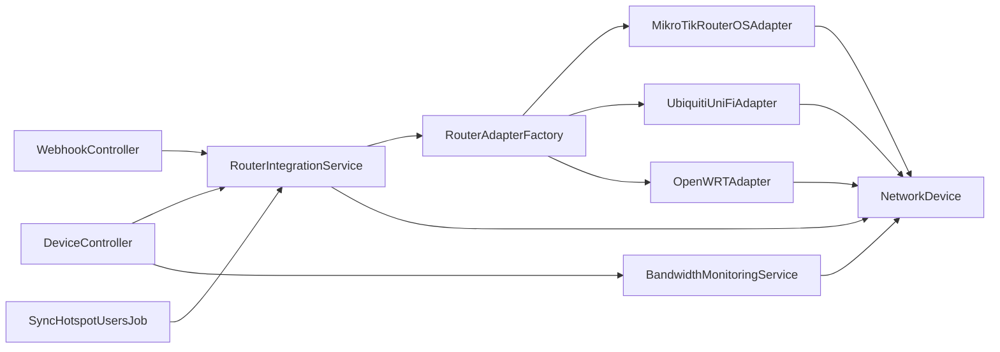

# Router Integration API

<cite>
**Referenced Files in This Document**
- [RouterAdapter.php](file://app/Services/Telecom/RouterAdapter.php)
- [RouterAdapterFactory.php](file://app/Services/Telecom/RouterAdapterFactory.php)
- [MikroTikRouterOSAdapter.php](file://app/Services/Telecom/MikroTikRouterOSAdapter.php)
- [UbiquitiUniFiAdapter.php](file://app/Services/Telecom/UbiquitiUniFiAdapter.php)
- [OpenWRTAdapter.php](file://app/Services/Telecom/OpenWRTAdapter.php)
- [RouterIntegrationService.php](file://app/Services/Telecom/RouterIntegrationService.php)
- [BandwidthMonitoringService.php](file://app/Services/Telecom/BandwidthMonitoringService.php)
- [DeviceController.php](file://app/Http/Controllers/Telecom/DeviceController.php)
- [WebhookController.php](file://app/Http/Controllers/Api/Telecom/WebhookController.php)
- [NetworkDevice.php](file://app/Models/NetworkDevice.php)
- [SyncHotspotUsersJob.php](file://app/Jobs/Telecom/SyncHotspotUsersJob.php)
- [2026_04_04_000001_create_network_devices_table.php](file://database/migrations/2026_04_04_000001_create_network_devices_table.php)
- [api.php](file://routes/api.php)
</cite>

## Table of Contents
1. [Introduction](#introduction)
2. [Project Structure](#project-structure)
3. [Core Components](#core-components)
4. [Architecture Overview](#architecture-overview)
5. [Detailed Component Analysis](#detailed-component-analysis)
6. [Dependency Analysis](#dependency-analysis)
7. [Performance Considerations](#performance-considerations)
8. [Troubleshooting Guide](#troubleshooting-guide)
9. [Conclusion](#conclusion)
10. [Appendices](#appendices)

## Introduction
This document provides comprehensive API documentation for router integration endpoints within the telecom module. It covers adapter implementations for MikroTik, Ubiquiti (UniFi), and OpenWRT routers, along with configuration management, command execution capabilities, and status monitoring. The documentation includes practical examples for router provisioning, configuration synchronization, firmware updates, and performance monitoring, and explains the adapter abstraction pattern and platform-specific integration details.

## Project Structure
The router integration spans several layers:
- Controllers expose HTTP endpoints for device lifecycle and webhook ingestion.
- Services orchestrate operations, manage transactions, and integrate with adapters.
- Adapters encapsulate platform-specific API interactions.
- Models represent network devices and related telemetry.
- Migrations define the persistent schema for device metadata and configuration.

**Diagram sources**
- [DeviceController.php:13-347](file://app/Http/Controllers/Telecom/DeviceController.php#L13-L347)
- [WebhookController.php:10-164](file://app/Http/Controllers/Api/Telecom/WebhookController.php#L10-L164)
- [RouterIntegrationService.php:19-396](file://app/Services/Telecom/RouterIntegrationService.php#L19-L396)
- [BandwidthMonitoringService.php:14-302](file://app/Services/Telecom/BandwidthMonitoringService.php#L14-L302)
- [RouterAdapterFactory.php:14-91](file://app/Services/Telecom/RouterAdapterFactory.php#L14-L91)
- [MikroTikRouterOSAdapter.php:15-498](file://app/Services/Telecom/MikroTikRouterOSAdapter.php#L15-L498)
- [UbiquitiUniFiAdapter.php:15-378](file://app/Services/Telecom/UbiquitiUniFiAdapter.php#L15-L378)
- [OpenWRTAdapter.php:15-442](file://app/Services/Telecom/OpenWRTAdapter.php#L15-L442)
- [NetworkDevice.php:13-191](file://app/Models/NetworkDevice.php#L13-L191)

**Section sources**
- [DeviceController.php:13-347](file://app/Http/Controllers/Telecom/DeviceController.php#L13-L347)
- [WebhookController.php:10-164](file://app/Http/Controllers/Api/Telecom/WebhookController.php#L10-L164)
- [RouterIntegrationService.php:19-396](file://app/Services/Telecom/RouterIntegrationService.php#L19-L396)
- [BandwidthMonitoringService.php:14-302](file://app/Services/Telecom/BandwidthMonitoringService.php#L14-L302)
- [RouterAdapterFactory.php:14-91](file://app/Services/Telecom/RouterAdapterFactory.php#L14-L91)
- [MikroTikRouterOSAdapter.php:15-498](file://app/Services/Telecom/MikroTikRouterOSAdapter.php#L15-L498)
- [UbiquitiUniFiAdapter.php:15-378](file://app/Services/Telecom/UbiquitiUniFiAdapter.php#L15-L378)
- [OpenWRTAdapter.php:15-442](file://app/Services/Telecom/OpenWRTAdapter.php#L15-L442)
- [NetworkDevice.php:13-191](file://app/Models/NetworkDevice.php#L13-L191)
- [2026_04_04_000001_create_network_devices_table.php:11-54](file://database/migrations/2026_04_04_000001_create_network_devices_table.php#L11-L54)

## Core Components
- RouterAdapter: Abstract base defining the contract for router operations (connection, system info, hotspot user management, bandwidth profiles, interface stats, reboot, command execution, brand identification, user disconnection, DHCP leases).
- RouterAdapterFactory: Factory responsible for creating platform-specific adapters and registering custom ones.
- Platform Adapters: MikroTikRouterOSAdapter, UbiquitiUniFiAdapter, OpenWRTAdapter implement RouterAdapter or RouterAdapterInterface with platform-specific API integrations.
- RouterIntegrationService: Orchestrates provisioning, synchronization, health checks, and alert creation.
- BandwidthMonitoringService: Provides real-time bandwidth metrics, trends, and allocation monitoring.
- DeviceController: Manages device CRUD, connection testing, maintenance toggling, and device status pages.
- WebhookController: Processes inbound usage and alert webhooks from routers.
- NetworkDevice model: Stores device metadata, credentials, capabilities, configuration, and status.
- SyncHotspotUsersJob: Scheduled job to synchronize active users between router and database.

**Section sources**
- [RouterAdapter.php:14-198](file://app/Services/Telecom/RouterAdapter.php#L14-L198)
- [RouterAdapterFactory.php:14-91](file://app/Services/Telecom/RouterAdapterFactory.php#L14-L91)
- [MikroTikRouterOSAdapter.php:15-498](file://app/Services/Telecom/MikroTikRouterOSAdapter.php#L15-L498)
- [UbiquitiUniFiAdapter.php:15-378](file://app/Services/Telecom/UbiquitiUniFiAdapter.php#L15-L378)
- [OpenWRTAdapter.php:15-442](file://app/Services/Telecom/OpenWRTAdapter.php#L15-L442)
- [RouterIntegrationService.php:19-396](file://app/Services/Telecom/RouterIntegrationService.php#L19-L396)
- [BandwidthMonitoringService.php:14-302](file://app/Services/Telecom/BandwidthMonitoringService.php#L14-L302)
- [DeviceController.php:13-347](file://app/Http/Controllers/Telecom/DeviceController.php#L13-L347)
- [WebhookController.php:10-164](file://app/Http/Controllers/Api/Telecom/WebhookController.php#L10-L164)
- [NetworkDevice.php:13-191](file://app/Models/NetworkDevice.php#L13-L191)
- [SyncHotspotUsersJob.php:20-101](file://app/Jobs/Telecom/SyncHotspotUsersJob.php#L20-L101)

## Architecture Overview
The system follows a layered architecture:
- HTTP endpoints delegate to controllers.
- Controllers coordinate with services.
- Services instantiate adapters via the factory.
- Adapters communicate with router APIs (REST, RPC, or cookies).
- Models persist device metadata and operational telemetry.
- Jobs run periodic synchronization tasks.

**Diagram sources**
- [DeviceController.php:87-142](file://app/Http/Controllers/Telecom/DeviceController.php#L87-L142)
- [RouterIntegrationService.php:27-65](file://app/Services/Telecom/RouterIntegrationService.php#L27-L65)
- [RouterAdapterFactory.php:33-51](file://app/Services/Telecom/RouterAdapterFactory.php#L33-L51)
- [MikroTikRouterOSAdapter.php:51-72](file://app/Services/Telecom/MikroTikRouterOSAdapter.php#L51-L72)
- [NetworkDevice.php:126-143](file://app/Models/NetworkDevice.php#L126-L143)

## Detailed Component Analysis

### Adapter Abstraction Pattern
The adapter pattern isolates platform differences behind a unified interface:
- RouterAdapter defines methods for connection testing, system info retrieval, hotspot user management, bandwidth profiles, interface statistics, reboot, command execution, brand identification, user disconnection, and DHCP leases.
- RouterAdapterFactory centralizes adapter instantiation and supports registration of custom adapters.
- Platform adapters implement RouterAdapter or RouterAdapterInterface and encapsulate API specifics.

**Diagram sources**
- [RouterAdapter.php:14-198](file://app/Services/Telecom/RouterAdapter.php#L14-L198)
- [RouterAdapterFactory.php:14-91](file://app/Services/Telecom/RouterAdapterFactory.php#L14-L91)
- [MikroTikRouterOSAdapter.php:15-498](file://app/Services/Telecom/MikroTikRouterOSAdapter.php#L15-L498)
- [UbiquitiUniFiAdapter.php:15-378](file://app/Services/Telecom/UbiquitiUniFiAdapter.php#L15-L378)
- [OpenWRTAdapter.php:15-442](file://app/Services/Telecom/OpenWRTAdapter.php#L15-L442)

**Section sources**
- [RouterAdapter.php:14-198](file://app/Services/Telecom/RouterAdapter.php#L14-L198)
- [RouterAdapterFactory.php:14-91](file://app/Services/Telecom/RouterAdapterFactory.php#L14-L91)

### MikroTik Integration
- Authentication: Basic auth or session cookie via RouterOS REST API.
- Operations: System info, resource usage, identity, clock; hotspot user CRUD; active sessions; bandwidth queues; interface stats; reboot; user disconnect; DHCP leases.
- Speed formatting: Converts Kbps to RouterOS notation (e.g., 10240 Kbps to 10M).

**Diagram sources**
- [MikroTikRouterOSAdapter.php:74-109](file://app/Services/Telecom/MikroTikRouterOSAdapter.php#L74-L109)

**Section sources**
- [MikroTikRouterOSAdapter.php:15-498](file://app/Services/Telecom/MikroTikRouterOSAdapter.php#L15-L498)

### Ubiquiti UniFi Integration
- Authentication: Cookie-based session via login endpoint; session cookie name varies by UniFi OS.
- Operations: System status, device list, active clients, create/remove/block users, bandwidth usage, logout, destructor cleanup.

**Diagram sources**
- [UbiquitiUniFiAdapter.php:306-342](file://app/Services/Telecom/UbiquitiUniFiAdapter.php#L306-L342)

**Section sources**
- [UbiquitiUniFiAdapter.php:15-378](file://app/Services/Telecom/UbiquitiUniFiAdapter.php#L15-L378)

### OpenWRT Integration
- Authentication: LuCI RPC auth; token-based RPC calls.
- Operations: System board info, interface list, DHCP leases, bandwidth usage via /proc/net/dev parsing, user creation via iptables/tc, user removal, user disconnect, logout, destructor cleanup.

**Diagram sources**
- [OpenWRTAdapter.php:329-398](file://app/Services/Telecom/OpenWRTAdapter.php#L329-L398)

**Section sources**
- [OpenWRTAdapter.php:15-442](file://app/Services/Telecom/OpenWRTAdapter.php#L15-L442)

### Router Integration Service
- Device connection testing and system info update.
- Hotspot user provisioning with optional bandwidth profile creation and database synchronization.
- Usage data synchronization from router to database with online/offline state and quota updates.
- Bandwidth allocation application to router.
- Device health checks with alert creation for offline/high CPU/high memory conditions.
- Uptime parsing and alert deduplication.

**Diagram sources**
- [RouterIntegrationService.php:182-253](file://app/Services/Telecom/RouterIntegrationService.php#L182-L253)

**Section sources**
- [RouterIntegrationService.php:19-396](file://app/Services/Telecom/RouterIntegrationService.php#L19-L396)

### Bandwidth Monitoring Service
- Real-time bandwidth aggregation per interface with caching.
- Historical trend extraction from UsageTracking.
- Top bandwidth consumers reporting.
- Allocation monitoring with current usage calculation and status classification.

**Section sources**
- [BandwidthMonitoringService.php:14-302](file://app/Services/Telecom/BandwidthMonitoringService.php#L14-L302)

### Device Controller
- Device listing with filtering and search.
- Device creation with connection test and status assignment.
- Device viewing with health check and bandwidth usage.
- Device editing with conditional reconnection testing.
- Device deletion with safety checks.
- Connection testing endpoint returning structured results.
- Maintenance mode toggle.

**Section sources**
- [DeviceController.php:13-347](file://app/Http/Controllers/Telecom/DeviceController.php#L13-L347)

### Webhook Controller
- Inbound usage webhook: validates signature, extracts device and subscription identifiers, records usage via service, and responds with success.
- Inbound alert webhook: validates signature, persists alert, updates device status for connectivity events, and responds with success.

**Section sources**
- [WebhookController.php:10-164](file://app/Http/Controllers/Api/Telecom/WebhookController.php#L10-L164)

### Scheduled Synchronization Job
- Periodic synchronization of active users between router and database.
- Updates online/offline states and logs sync results.

**Section sources**
- [SyncHotspotUsersJob.php:20-101](file://app/Jobs/Telecom/SyncHotspotUsersJob.php#L20-L101)

## Dependency Analysis
- Controllers depend on services for business logic.
- Services depend on adapters via the factory.
- Adapters depend on platform APIs and router models.
- Models encapsulate persistence and tenant scoping.
- Jobs depend on services and adapters for periodic tasks.

**Diagram sources**
- [DeviceController.php:15-22](file://app/Http/Controllers/Telecom/DeviceController.php#L15-L22)
- [WebhookController.php:12-17](file://app/Http/Controllers/Api/Telecom/WebhookController.php#L12-L17)
- [RouterIntegrationService.php:27-31](file://app/Services/Telecom/RouterIntegrationService.php#L27-L31)
- [RouterAdapterFactory.php:33-51](file://app/Services/Telecom/RouterAdapterFactory.php#L33-L51)
- [MikroTikRouterOSAdapter.php:51-72](file://app/Services/Telecom/MikroTikRouterOSAdapter.php#L51-L72)
- [UbiquitiUniFiAdapter.php:306-342](file://app/Services/Telecom/UbiquitiUniFiAdapter.php#L306-L342)
- [OpenWRTAdapter.php:329-398](file://app/Services/Telecom/OpenWRTAdapter.php#L329-L398)
- [NetworkDevice.php:13-191](file://app/Models/NetworkDevice.php#L13-L191)
- [SyncHotspotUsersJob.php:33-62](file://app/Jobs/Telecom/SyncHotspotUsersJob.php#L33-L62)

**Section sources**
- [DeviceController.php:13-347](file://app/Http/Controllers/Telecom/DeviceController.php#L13-L347)
- [WebhookController.php:10-164](file://app/Http/Controllers/Api/Telecom/WebhookController.php#L10-L164)
- [RouterIntegrationService.php:19-396](file://app/Services/Telecom/RouterIntegrationService.php#L19-L396)
- [RouterAdapterFactory.php:14-91](file://app/Services/Telecom/RouterAdapterFactory.php#L14-L91)
- [NetworkDevice.php:13-191](file://app/Models/NetworkDevice.php#L13-L191)
- [SyncHotspotUsersJob.php:20-101](file://app/Jobs/Telecom/SyncHotspotUsersJob.php#L20-L101)

## Performance Considerations
- Caching: BandwidthMonitoringService caches interface totals for short intervals to reduce adapter calls.
- Batch operations: RouterIntegrationService synchronizes usage in batches and commits database changes atomically.
- Timeout and retries: SyncHotspotUsersJob sets timeout and retry limits for robust operation.
- Conditional updates: DeviceController avoids unnecessary reconnection tests when credentials or endpoints remain unchanged.

[No sources needed since this section provides general guidance]

## Troubleshooting Guide
- Connection failures: RouterIntegrationService marks devices offline on exceptions and returns structured results; verify credentials, ports, and firewall rules.
- Authentication errors: MikroTik uses Basic auth or session cookies; Ubiquiti requires valid login and session cookie; OpenWRT requires RPC auth token.
- Validation errors: DeviceController and WebhookController return 422 with field-specific errors; ensure required fields and brands are valid.
- Alerting: RouterIntegrationService creates alerts for offline/high CPU/high memory conditions; confirm alert thresholds and deduplication windows.
- Webhook signatures: WebhookController validates HMAC signature using configured secret; ensure router sends X-Webhook-Signature header.

**Section sources**
- [RouterIntegrationService.php:56-64](file://app/Services/Telecom/RouterIntegrationService.php#L56-L64)
- [DeviceController.php:138-141](file://app/Http/Controllers/Telecom/DeviceController.php#L138-L141)
- [WebhookController.php:31-33](file://app/Http/Controllers/Api/Telecom/WebhookController.php#L31-L33)
- [MikroTikRouterOSAdapter.php:36-49](file://app/Services/Telecom/MikroTikRouterOSAdapter.php#L36-L49)
- [UbiquitiUniFiAdapter.php:306-342](file://app/Services/Telecom/UbiquitiUniFiAdapter.php#L306-L342)
- [OpenWRTAdapter.php:329-398](file://app/Services/Telecom/OpenWRTAdapter.php#L329-L398)

## Conclusion
The router integration module provides a robust, extensible foundation for managing diverse router platforms. The adapter abstraction enables seamless integration with MikroTik, Ubiquiti, and OpenWRT, while services orchestrate provisioning, synchronization, monitoring, and alerting. Webhooks facilitate real-time telemetry ingestion, and scheduled jobs maintain consistency across systems.

[No sources needed since this section summarizes without analyzing specific files]

## Appendices

### API Endpoints Overview
- Device management and status:
  - GET /telecom/devices
  - GET /telecom/devices/create
  - POST /telecom/devices
  - GET /telecom/devices/{device}
  - GET /telecom/devices/{device}/edit
  - PUT /telecom/devices/{device}
  - DELETE /telecom/devices/{device}
  - POST /telecom/devices/{device}/test-connection
  - POST /telecom/devices/{device}/toggle-maintenance
- Webhooks (verified by signature):
  - POST /api/telecom/webhook/router-usage
  - POST /api/telecom/webhook/device-alert

**Section sources**
- [DeviceController.php:27-347](file://app/Http/Controllers/Telecom/DeviceController.php#L27-L347)
- [WebhookController.php:24-162](file://app/Http/Controllers/Api/Telecom/WebhookController.php#L24-L162)
- [api.php:87-91](file://routes/api.php#L87-L91)

### Data Models Overview
- NetworkDevice: Stores tenant-scoped device metadata, credentials, capabilities, configuration, and status. Includes helpers for online/offline transitions and encrypted password handling.

**Section sources**
- [NetworkDevice.php:13-191](file://app/Models/NetworkDevice.php#L13-L191)
- [2026_04_04_000001_create_network_devices_table.php:11-54](file://database/migrations/2026_04_04_000001_create_network_devices_table.php#L11-L54)

### Examples Index
- Router provisioning:
  - Device creation with connection test and status assignment.
  - Reference: [DeviceController@store:87-142](file://app/Http/Controllers/Telecom/DeviceController.php#L87-L142)
- Configuration synchronization:
  - RouterIntegrationService.syncUsageData for batch usage sync.
  - Reference: [RouterIntegrationService.syncUsageData:182-253](file://app/Services/Telecom/RouterIntegrationService.php#L182-L253)
- Firmware updates:
  - Use RouterAdapter.executeCommand or platform-specific reboot flows.
  - References: [RouterAdapter.executeCommand:121-121](file://app/Services/Telecom/RouterAdapter.php#L121-L121), [MikroTikRouterOSAdapter.reboot:364-381](file://app/Services/Telecom/MikroTikRouterOSAdapter.php#L364-L381)
- Performance monitoring:
  - BandwidthMonitoringService.getDeviceBandwidthUsage for real-time metrics.
  - Reference: [BandwidthMonitoringService.getDeviceBandwidthUsage:29-73](file://app/Services/Telecom/BandwidthMonitoringService.php#L29-L73)