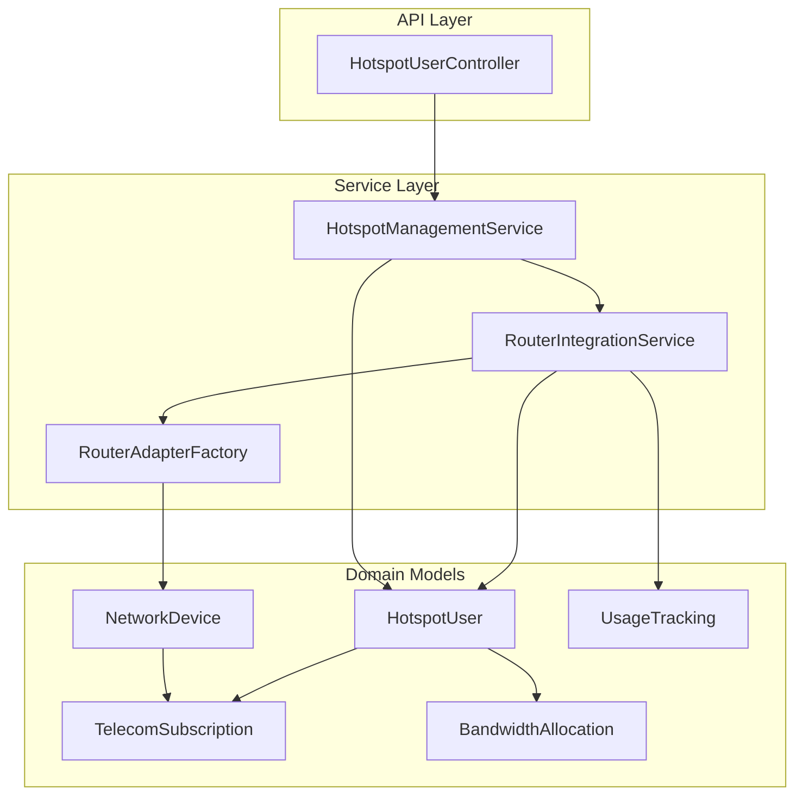
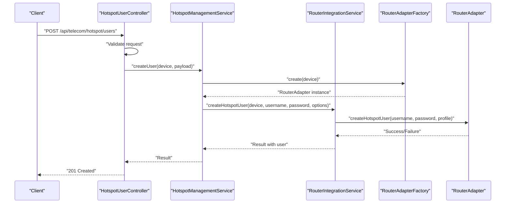
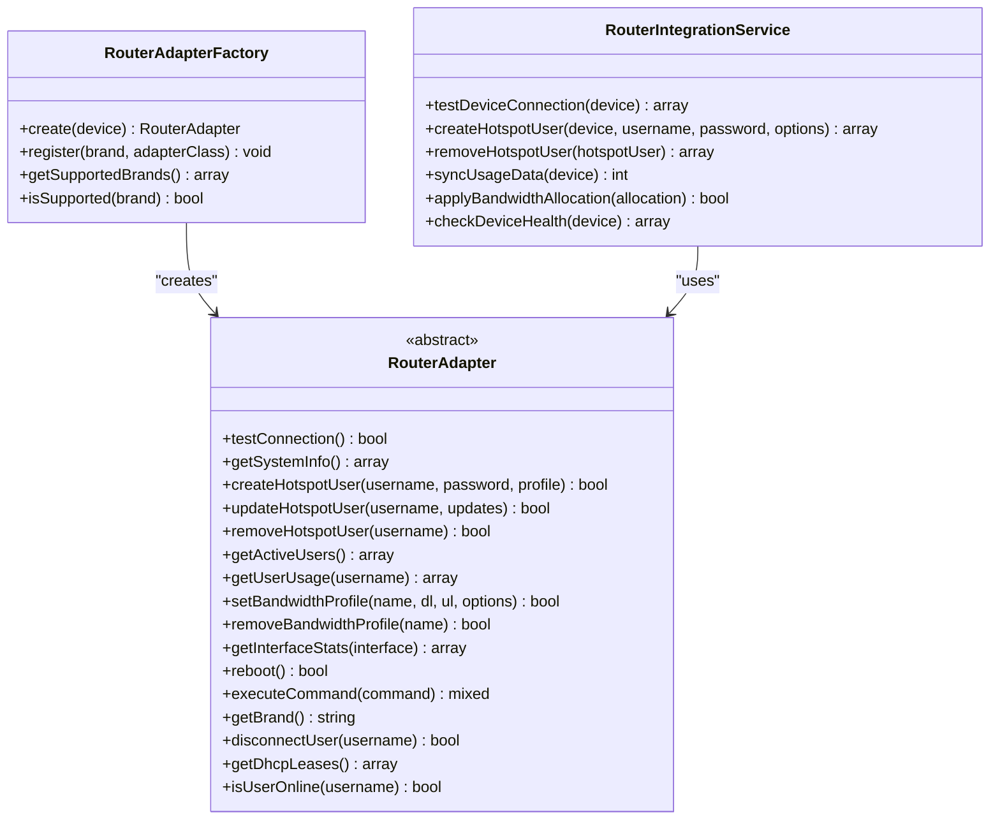
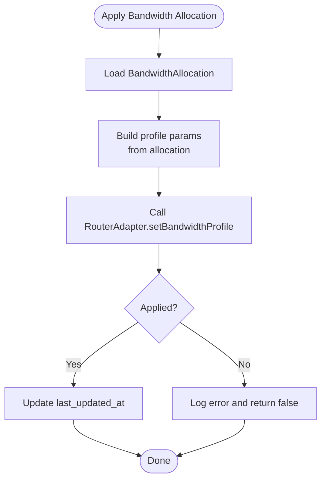
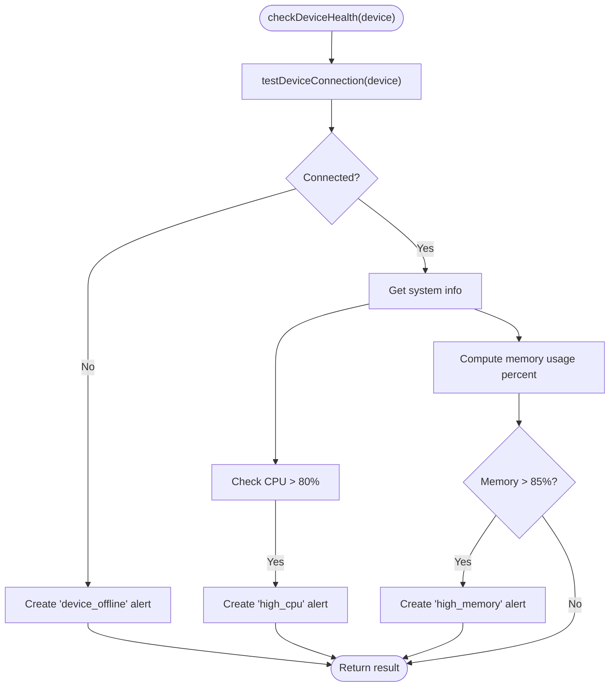
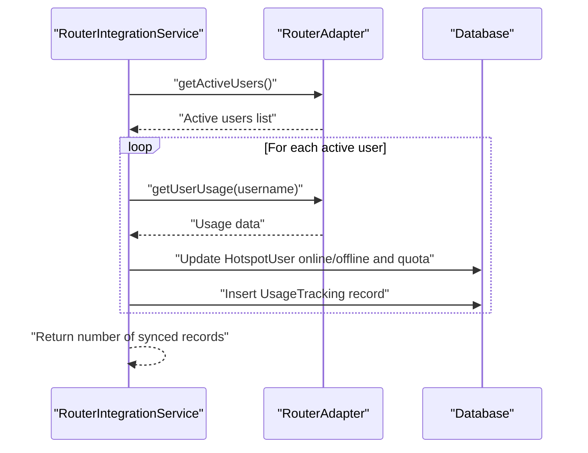
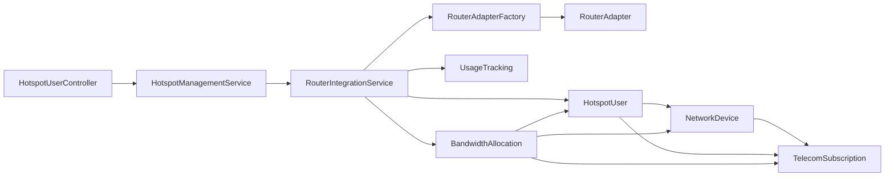

# Telecom Module API

<cite>
**Referenced Files in This Document**
- [HotspotUserController.php](file://app/Http/Controllers/Api/Telecom/HotspotUserController.php)
- [HotspotManagementService.php](file://app/Services/Telecom/HotspotManagementService.php)
- [RouterIntegrationService.php](file://app/Services/Telecom/RouterIntegrationService.php)
- [RouterAdapterFactory.php](file://app/Services/Telecom/RouterAdapterFactory.php)
- [RouterAdapter.php](file://app/Services/Telecom/RouterAdapter.php)
- [HotspotUser.php](file://app/Models/HotspotUser.php)
- [NetworkDevice.php](file://app/Models/NetworkDevice.php)
- [TelecomSubscription.php](file://app/Models/TelecomSubscription.php)
- [BandwidthAllocation.php](file://app/Models/BandwidthAllocation.php)
- [UsageTracking.php](file://app/Models/UsageTracking.php)
</cite>

## Table of Contents
1. [Introduction](#introduction)
2. [Project Structure](#project-structure)
3. [Core Components](#core-components)
4. [Architecture Overview](#architecture-overview)
5. [Detailed Component Analysis](#detailed-component-analysis)
6. [Dependency Analysis](#dependency-analysis)
7. [Performance Considerations](#performance-considerations)
8. [Troubleshooting Guide](#troubleshooting-guide)
9. [Conclusion](#conclusion)
10. [Appendices](#appendices)

## Introduction
This document provides specialized API documentation for the telecom module. It covers device management for network equipment, hotspot user lifecycle management, usage tracking, and router integration patterns. It also documents bandwidth monitoring, network alerting, and webhook integration for real-time device status updates and usage alerts. Examples are provided for device provisioning, user authentication, usage reporting, and voucher redemption.

## Project Structure
The telecom module is organized around:
- API controllers for resource endpoints
- Service layer orchestrating router integrations
- Domain models representing network devices, subscriptions, users, bandwidth allocations, and usage
- Router adapter abstraction enabling brand-specific implementations

**Diagram sources**
- [HotspotUserController.php:1-171](file://app/Http/Controllers/Api/Telecom/HotspotUserController.php#L1-L171)
- [HotspotManagementService.php:1-231](file://app/Services/Telecom/HotspotManagementService.php#L1-L231)
- [RouterIntegrationService.php:1-396](file://app/Services/Telecom/RouterIntegrationService.php#L1-L396)
- [RouterAdapterFactory.php:1-91](file://app/Services/Telecom/RouterAdapterFactory.php#L1-L91)
- [HotspotUser.php:1-250](file://app/Models/HotspotUser.php#L1-L250)
- [NetworkDevice.php:1-191](file://app/Models/NetworkDevice.php#L1-L191)
- [TelecomSubscription.php:1-304](file://app/Models/TelecomSubscription.php#L1-L304)
- [BandwidthAllocation.php:1-188](file://app/Models/BandwidthAllocation.php#L1-L188)
- [UsageTracking.php:1-160](file://app/Models/UsageTracking.php#L1-L160)

**Section sources**
- [HotspotUserController.php:1-171](file://app/Http/Controllers/Api/Telecom/HotspotUserController.php#L1-L171)
- [RouterIntegrationService.php:1-396](file://app/Services/Telecom/RouterIntegrationService.php#L1-L396)

## Core Components
- HotspotUserController: Exposes REST endpoints for creating, suspending/reactivating users, and retrieving user statistics.
- HotspotManagementService: Encapsulates business logic for user CRUD, suspension, reactivation, and statistics retrieval.
- RouterIntegrationService: Coordinates router operations, transaction-safe creation/deletion, usage sync, bandwidth application, and health checks/alerts.
- RouterAdapterFactory: Factory for brand-specific router adapters.
- RouterAdapter: Abstract interface for router operations.
- Domain models: NetworkDevice, HotspotUser, TelecomSubscription, BandwidthAllocation, UsageTracking.

**Section sources**
- [HotspotUserController.php:1-171](file://app/Http/Controllers/Api/Telecom/HotspotUserController.php#L1-L171)
- [HotspotManagementService.php:1-231](file://app/Services/Telecom/HotspotManagementService.php#L1-L231)
- [RouterIntegrationService.php:1-396](file://app/Services/Telecom/RouterIntegrationService.php#L1-L396)
- [RouterAdapterFactory.php:1-91](file://app/Services/Telecom/RouterAdapterFactory.php#L1-L91)
- [RouterAdapter.php:1-198](file://app/Services/Telecom/RouterAdapter.php#L1-L198)
- [HotspotUser.php:1-250](file://app/Models/HotspotUser.php#L1-L250)
- [NetworkDevice.php:1-191](file://app/Models/NetworkDevice.php#L1-L191)
- [TelecomSubscription.php:1-304](file://app/Models/TelecomSubscription.php#L1-L304)
- [BandwidthAllocation.php:1-188](file://app/Models/BandwidthAllocation.php#L1-L188)
- [UsageTracking.php:1-160](file://app/Models/UsageTracking.php#L1-L160)

## Architecture Overview
The system follows a layered architecture:
- API controllers validate requests and delegate to services.
- Services orchestrate router adapters via a factory, ensuring brand compatibility.
- Models encapsulate persistence and domain logic.
- RouterIntegrationService ensures transaction safety and synchronization.

**Diagram sources**
- [HotspotUserController.php:25-79](file://app/Http/Controllers/Api/Telecom/HotspotUserController.php#L25-L79)
- [HotspotManagementService.php:30-50](file://app/Services/Telecom/HotspotManagementService.php#L30-L50)
- [RouterIntegrationService.php:76-143](file://app/Services/Telecom/RouterIntegrationService.php#L76-L143)
- [RouterAdapterFactory.php:33-51](file://app/Services/Telecom/RouterAdapterFactory.php#L33-L51)
- [RouterAdapter.php:47-47](file://app/Services/Telecom/RouterAdapter.php#L47-L47)

## Detailed Component Analysis

### Device Management Endpoints
- Endpoint: POST /api/telecom/hotspot/users
  - Purpose: Provision a new hotspot user on a network device.
  - Request body fields:
    - device_id: integer, required, references network_devices.id
    - username: string, optional
    - password: string, optional
    - download_speed_kbps: integer, optional
    - upload_speed_kbps: integer, optional
    - quota_bytes: integer, min 0, optional
    - expires_at: datetime, optional, after now
    - comment: string, optional
    - subscription_id: integer, optional, references telecom_subscriptions.id
  - Validation: Controller validates presence and types; tenant ownership checked against the authenticated user.
  - Response: 201 with created user; 422 on validation failure; 500 on internal error.

- Endpoint: GET /api/telecom/hotspot/users/{id}/stats
  - Purpose: Retrieve live usage statistics for a user.
  - Response: Includes online status, IP/MAC, bytes in/out/total, formatted quotas, uptime, session counts.

- Endpoint: POST /api/telecom/hotspot/users/{id}/suspend
  - Purpose: Temporarily disable a user and disconnect if online.
  - Response: 200 with updated user; 500 on failure.

- Endpoint: POST /api/telecom/hotspot/users/{id}/reactivate
  - Purpose: Re-enable a previously suspended user.
  - Response: 200 with updated user; 500 on failure.

**Section sources**
- [HotspotUserController.php:25-171](file://app/Http/Controllers/Api/Telecom/HotspotUserController.php#L25-L171)
- [HotspotManagementService.php:30-231](file://app/Services/Telecom/HotspotManagementService.php#L30-L231)
- [HotspotUser.php:184-223](file://app/Models/HotspotUser.php#L184-L223)

### Router Integration Patterns
Router operations are abstracted behind RouterAdapter implementations selected by RouterAdapterFactory based on device brand. RouterIntegrationService coordinates:
- Device connectivity testing and status updates
- Hotspot user creation with optional bandwidth profiles
- Removal and suspension/reactivation
- Usage synchronization and alerting
- Bandwidth allocation application

**Diagram sources**
- [RouterAdapter.php:14-198](file://app/Services/Telecom/RouterAdapter.php#L14-L198)
- [RouterAdapterFactory.php:14-91](file://app/Services/Telecom/RouterAdapterFactory.php#L14-L91)
- [RouterIntegrationService.php:19-396](file://app/Services/Telecom/RouterIntegrationService.php#L19-L396)

**Section sources**
- [RouterAdapterFactory.php:19-51](file://app/Services/Telecom/RouterAdapterFactory.php#L19-L51)
- [RouterAdapter.php:30-136](file://app/Services/Telecom/RouterAdapter.php#L30-L136)
- [RouterIntegrationService.php:27-396](file://app/Services/Telecom/RouterIntegrationService.php#L27-L396)

### Bandwidth Monitoring and Allocation
- BandwidthAllocation model supports per-device/per-subscription/per-user allocations with time-based activation rules and queue parameters.
- RouterIntegrationService applies allocations to routers via RouterAdapter.setBandwidthProfile.
- HotspotManagementService can create bandwidth profiles during user creation and update profiles when rate limits change.

**Diagram sources**
- [RouterIntegrationService.php:261-293](file://app/Services/Telecom/RouterIntegrationService.php#L261-L293)
- [BandwidthAllocation.php:84-129](file://app/Models/BandwidthAllocation.php#L84-L129)

**Section sources**
- [BandwidthAllocation.php:13-49](file://app/Models/BandwidthAllocation.php#L13-L49)
- [RouterIntegrationService.php:261-293](file://app/Services/Telecom/RouterIntegrationService.php#L261-L293)

### Network Alerting
- RouterIntegrationService.checkDeviceHealth performs connectivity checks and creates alerts for offline devices, high CPU, and high memory usage.
- Alerts are deduplicated within a short timeframe and stored in the database.

**Diagram sources**
- [RouterIntegrationService.php:301-345](file://app/Services/Telecom/RouterIntegrationService.php#L301-L345)

**Section sources**
- [RouterIntegrationService.php:301-375](file://app/Services/Telecom/RouterIntegrationService.php#L301-L375)

### Usage Tracking
- RouterIntegrationService.syncUsageData pulls active users from the router, updates online/offline status, accumulates quota usage, and persists daily usage records.
- UsageTracking model stores per-period metrics and provides formatted helpers.

**Diagram sources**
- [RouterIntegrationService.php:182-253](file://app/Services/Telecom/RouterIntegrationService.php#L182-L253)
- [UsageTracking.php:13-51](file://app/Models/UsageTracking.php#L13-L51)

**Section sources**
- [RouterIntegrationService.php:182-253](file://app/Services/Telecom/RouterIntegrationService.php#L182-L253)
- [UsageTracking.php:78-118](file://app/Models/UsageTracking.php#L78-L118)

### Voucher Generation
- The telecom module includes views for voucher creation and printing, indicating support for generating promotional or temporary access credentials.
- While no dedicated API endpoint is present in the analyzed files, voucher generation typically integrates with subscription provisioning and user creation flows.

**Section sources**
- [resources/views/telecom/vouchers/create.blade.php](file://resources/views/telecom/vouchers/create.blade.php)
- [resources/views/telecom/vouchers/print.blade.php](file://resources/views/telecom/vouchers/print.blade.php)

### Webhook Integration for Real-Time Updates
- The system includes a webhook delivery service and idempotency service, enabling real-time notifications for device status and usage alerts.
- Integration pattern:
  - RouterIntegrationService.checkDeviceHealth can trigger alert events.
  - WebhookService/WebhookIdempotencyService handle delivery retries and deduplication.

[No sources needed since this section describes integration patterns conceptually]

## Dependency Analysis
Key dependencies and relationships:
- HotspotUserController depends on HotspotManagementService.
- HotspotManagementService depends on RouterIntegrationService and RouterAdapterFactory.
- RouterIntegrationService depends on RouterAdapter implementations and models (HotspotUser, UsageTracking, BandwidthAllocation).
- Models define relationships among tenants, devices, subscriptions, users, allocations, and usage.

**Diagram sources**
- [HotspotUserController.php:11-18](file://app/Http/Controllers/Api/Telecom/HotspotUserController.php#L11-L18)
- [HotspotManagementService.php:16-21](file://app/Services/Telecom/HotspotManagementService.php#L16-L21)
- [RouterIntegrationService.php:19-19](file://app/Services/Telecom/RouterIntegrationService.php#L19-L19)
- [RouterAdapterFactory.php:19-51](file://app/Services/Telecom/RouterAdapterFactory.php#L19-L51)
- [HotspotUser.php:74-93](file://app/Models/HotspotUser.php#L74-L93)
- [NetworkDevice.php:54-89](file://app/Models/NetworkDevice.php#L54-L89)
- [TelecomSubscription.php:70-97](file://app/Models/TelecomSubscription.php#L70-L97)
- [BandwidthAllocation.php:54-81](file://app/Models/BandwidthAllocation.php#L54-L81)
- [UsageTracking.php:55-75](file://app/Models/UsageTracking.php#L55-L75)

**Section sources**
- [HotspotUserController.php:11-18](file://app/Http/Controllers/Api/Telecom/HotspotUserController.php#L11-L18)
- [HotspotManagementService.php:16-21](file://app/Services/Telecom/HotspotManagementService.php#L16-L21)
- [RouterIntegrationService.php:19-19](file://app/Services/Telecom/RouterIntegrationService.php#L19-L19)
- [RouterAdapterFactory.php:19-51](file://app/Services/Telecom/RouterAdapterFactory.php#L19-L51)
- [HotspotUser.php:74-93](file://app/Models/HotspotUser.php#L74-L93)
- [NetworkDevice.php:54-89](file://app/Models/NetworkDevice.php#L54-L89)
- [TelecomSubscription.php:70-97](file://app/Models/TelecomSubscription.php#L70-L97)
- [BandwidthAllocation.php:54-81](file://app/Models/BandwidthAllocation.php#L54-L81)
- [UsageTracking.php:55-75](file://app/Models/UsageTracking.php#L55-L75)

## Performance Considerations
- Batch operations: Use RouterIntegrationService.syncUsageData to minimize repeated router queries and consolidate writes to UsageTracking.
- Bandwidth profiles: Prefer pre-created profiles for users to avoid frequent router configuration changes.
- Deduplication: RouterIntegrationService.createAlert prevents redundant alerts within a short window.
- Formatting: Use model attributes that compute formatted values to reduce client-side formatting overhead.

[No sources needed since this section provides general guidance]

## Troubleshooting Guide
Common issues and resolutions:
- Validation failures: Ensure device_id references an existing device and belongs to the authenticated tenant. Check field constraints (min/max values, date validation).
- Router connectivity: Use RouterIntegrationService.testDeviceConnection to verify device reachability and update status.
- Bandwidth application: Confirm RouterAdapter.setBandwidthProfile succeeded; inspect RouterIntegrationService logs for exceptions.
- Alerting: Review RouterIntegrationService.createAlert logic for duplicate suppression and alert severity thresholds.
- Usage sync: Verify RouterAdapter.getActiveUsers and RouterAdapter.getUserUsage return expected data; confirm HotspotUser existence and tenant matching.

**Section sources**
- [HotspotUserController.php:28-78](file://app/Http/Controllers/Api/Telecom/HotspotUserController.php#L28-L78)
- [RouterIntegrationService.php:27-65](file://app/Services/Telecom/RouterIntegrationService.php#L27-L65)
- [RouterIntegrationService.php:261-293](file://app/Services/Telecom/RouterIntegrationService.php#L261-L293)
- [RouterIntegrationService.php:355-375](file://app/Services/Telecom/RouterIntegrationService.php#L355-L375)
- [RouterIntegrationService.php:182-253](file://app/Services/Telecom/RouterIntegrationService.php#L182-L253)

## Conclusion
The telecom module provides a robust, extensible API for managing network devices and hotspot users, with strong integration patterns for router operations, usage tracking, bandwidth monitoring, and alerting. The adapter-based architecture enables straightforward extension to additional router brands, while services encapsulate operational complexity and maintain data consistency.

[No sources needed since this section summarizes without analyzing specific files]

## Appendices

### API Definitions

- Create Hotspot User
  - Method: POST
  - Path: /api/telecom/hotspot/users
  - Request body fields: device_id, username, password, download_speed_kbps, upload_speed_kbps, quota_bytes, expires_at, comment, subscription_id
  - Responses:
    - 201 Created: { user }
    - 400 Bad Request: { error }
    - 403 Forbidden: { error }
    - 422 Unprocessable Entity: { errors }
    - 500 Internal Server Error: { error }

- Get User Statistics
  - Method: GET
  - Path: /api/telecom/hotspot/users/{id}/stats
  - Responses:
    - 200 OK: { username, is_online, ip_address, mac_address, bytes_in, bytes_out, bytes_total, quota_* fields, uptime, total_sessions, total_uptime }
    - 403 Forbidden: { error }
    - 500 Internal Server Error: { error }

- Suspend User
  - Method: POST
  - Path: /api/telecom/hotspot/users/{id}/suspend
  - Responses:
    - 200 OK: { user }
    - 403 Forbidden: { error }
    - 500 Internal Server Error: { error }

- Reactivate User
  - Method: POST
  - Path: /api/telecom/hotspot/users/{id}/reactivate
  - Responses:
    - 200 OK: { user }
    - 403 Forbidden: { error }
    - 500 Internal Server Error: { error }

**Section sources**
- [HotspotUserController.php:25-171](file://app/Http/Controllers/Api/Telecom/HotspotUserController.php#L25-L171)
- [HotspotManagementService.php:181-213](file://app/Services/Telecom/HotspotManagementService.php#L181-L213)

### Example Workflows

- Device Provisioning
  - Steps:
    1. Authenticate and select a tenant-aware device.
    2. Call POST /api/telecom/hotspot/users with desired options.
    3. On success, persist subscription association if applicable.
  - Notes: RouterIntegrationService handles router-side creation and database synchronization.

- User Authentication
  - Steps:
    1. RouterAdapter.authenticate(username, password) invoked by router firmware.
    2. RouterIntegrationService.syncUsageData periodically updates HotspotUser and UsageTracking.

- Usage Reporting
  - Steps:
    1. Schedule RouterIntegrationService.syncUsageData.
    2. Query UsageTracking with period filters and high-usage scopes.
    3. Present formatted metrics via model accessors.

- Voucher Redemption
  - Steps:
    1. Generate temporary credentials via controller/service flow.
    2. Optionally associate with a TelecomSubscription for billing alignment.

**Section sources**
- [RouterIntegrationService.php:182-253](file://app/Services/Telecom/RouterIntegrationService.php#L182-L253)
- [UsageTracking.php:139-158](file://app/Models/UsageTracking.php#L139-L158)
- [TelecomSubscription.php:102-113](file://app/Models/TelecomSubscription.php#L102-L113)