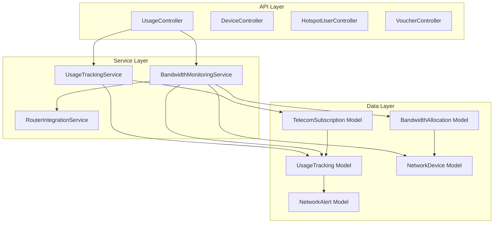
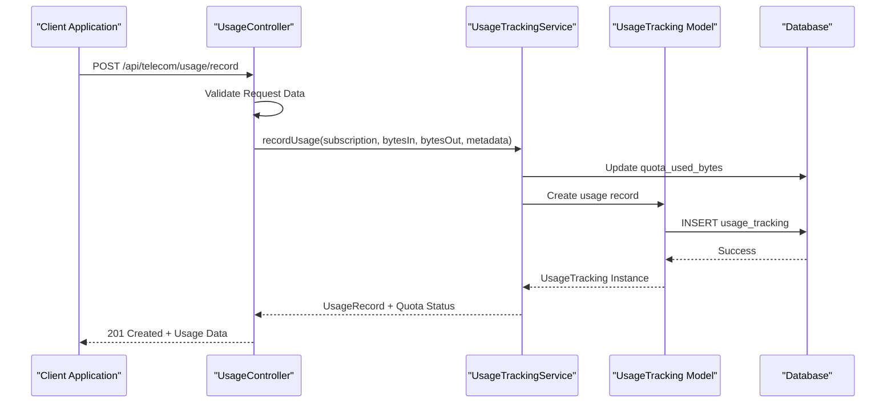
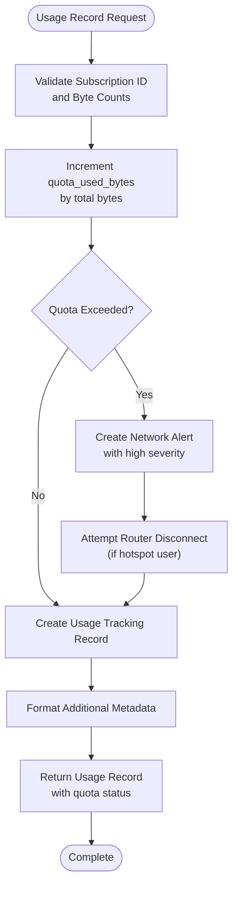
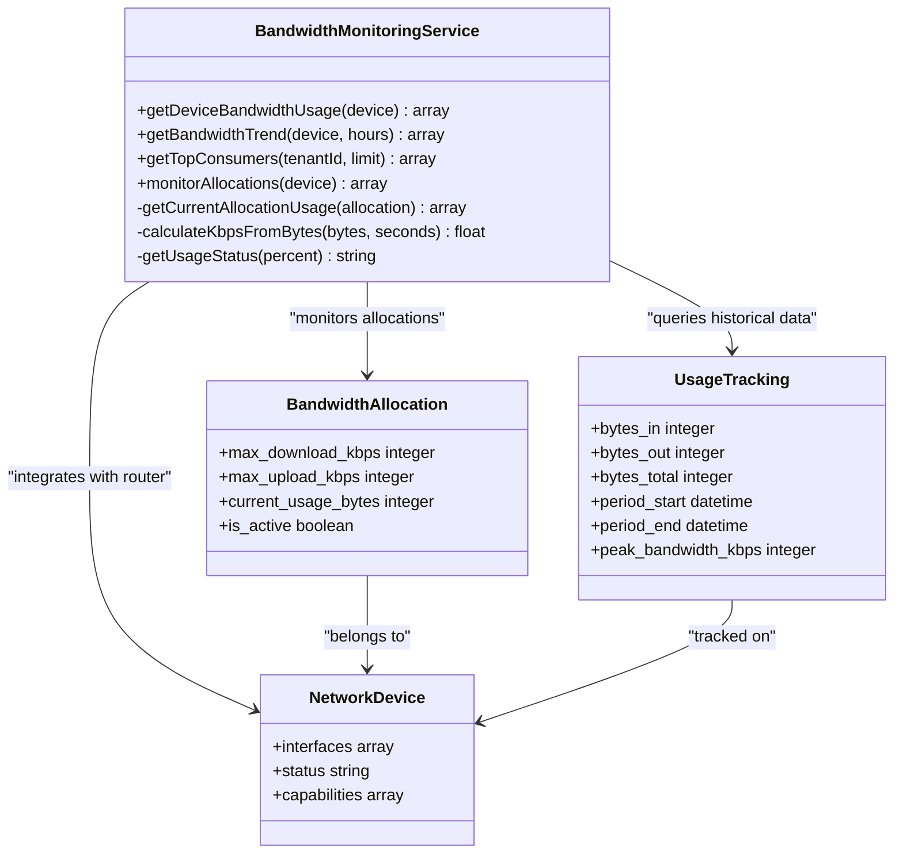

# Usage Tracking API

<cite>
**Referenced Files in This Document**
- [UsageController.php](file://app/Http/Controllers/Api/Telecom/UsageController.php)
- [UsageTrackingService.php](file://app/Services/Telecom/UsageTrackingService.php)
- [BandwidthMonitoringService.php](file://app/Services/Telecom/BandwidthMonitoringService.php)
- [UsageTracking.php](file://app/Models/UsageTracking.php)
- [TelecomSubscription.php](file://app/Models/TelecomSubscription.php)
- [BandwidthAllocation.php](file://app/Models/BandwidthAllocation.php)
- [NetworkDevice.php](file://app/Models/NetworkDevice.php)
- [NetworkAlert.php](file://app/Models/NetworkAlert.php)
- [api.php](file://routes/api.php)
</cite>

## Table of Contents
1. [Introduction](#introduction)
2. [Project Structure](#project-structure)
3. [Core Components](#core-components)
4. [Architecture Overview](#architecture-overview)
5. [Detailed Component Analysis](#detailed-component-analysis)
6. [API Reference](#api-reference)
7. [Real-time Monitoring](#real-time-monitoring)
8. [Historical Analytics](#historical-analytics)
9. [Capacity Planning Tools](#capacity-planning-tools)
10. [Integration Patterns](#integration-patterns)
11. [Performance Considerations](#performance-considerations)
12. [Troubleshooting Guide](#troubleshooting-guide)
13. [Conclusion](#conclusion)

## Introduction
This document provides comprehensive API documentation for the usage tracking system that monitors bandwidth consumption, manages data usage reporting, and enables traffic analytics for telecom subscriptions. The system supports real-time usage alerts, historical usage pattern analysis, and capacity planning tools. It integrates with network monitoring systems and includes automated scaling mechanisms through quota enforcement and bandwidth allocation monitoring.

## Project Structure
The usage tracking functionality is organized around three primary layers:
- API Controllers: Handle external requests and coordinate service operations
- Service Layer: Implements business logic for usage recording, monitoring, and analytics
- Data Models: Define the schema and relationships for usage tracking, subscriptions, and network devices

**Diagram sources**
- [UsageController.php:11-18](file://app/Http/Controllers/Api/Telecom/UsageController.php#L11-L18)
- [UsageTrackingService.php:14-67](file://app/Services/Telecom/UsageTrackingService.php#L14-L67)
- [BandwidthMonitoringService.php:14-21](file://app/Services/Telecom/BandwidthMonitoringService.php#L14-L21)

**Section sources**
- [api.php:63-91](file://routes/api.php#L63-L91)

## Core Components
The usage tracking system comprises several key components that work together to provide comprehensive bandwidth monitoring and analytics capabilities.

### Usage Tracking Model
The UsageTracking model serves as the central repository for all bandwidth consumption data, storing both raw metrics and derived statistics.

**Section sources**
- [UsageTracking.php:10-51](file://app/Models/UsageTracking.php#L10-L51)

### Usage Tracking Service
The UsageTrackingService handles the core business logic for recording usage data, calculating quotas, and generating usage summaries.

**Section sources**
- [UsageTrackingService.php:14-67](file://app/Services/Telecom/UsageTrackingService.php#L14-L67)

### Bandwidth Monitoring Service
The BandwidthMonitoringService provides real-time monitoring capabilities, trend analysis, and allocation management for network devices.

**Section sources**
- [BandwidthMonitoringService.php:14-73](file://app/Services/Telecom/BandwidthMonitoringService.php#L14-L73)

## Architecture Overview
The usage tracking architecture follows a layered approach with clear separation of concerns between API handling, business logic, and data persistence.

**Diagram sources**
- [UsageController.php:83-147](file://app/Http/Controllers/Api/Telecom/UsageController.php#L83-L147)
- [UsageTrackingService.php:25-67](file://app/Services/Telecom/UsageTrackingService.php#L25-L67)

## Detailed Component Analysis

### Usage Recording and Quota Management
The usage recording process involves transaction-safe updates to both usage records and subscription quotas, with automatic quota exceeded detection and alert generation.

**Diagram sources**
- [UsageTrackingService.php:25-67](file://app/Services/Telecom/UsageTrackingService.php#L25-L67)
- [UsageTrackingService.php:123-147](file://app/Services/Telecom/UsageTrackingService.php#L123-L147)

**Section sources**
- [UsageTrackingService.php:25-118](file://app/Services/Telecom/UsageTrackingService.php#L25-L118)

### Real-time Bandwidth Monitoring
The bandwidth monitoring system provides live insights into network device performance and allocation utilization through multiple data sources and caching mechanisms.

**Diagram sources**
- [BandwidthMonitoringService.php:14-178](file://app/Services/Telecom/BandwidthMonitoringService.php#L14-L178)
- [UsageTracking.php:10-51](file://app/Models/UsageTracking.php#L10-L51)
- [BandwidthAllocation.php:10-49](file://app/Models/BandwidthAllocation.php#L10-L49)

**Section sources**
- [BandwidthMonitoringService.php:29-105](file://app/Services/Telecom/BandwidthMonitoringService.php#L29-L105)

### Usage Summary Generation
The system generates comprehensive usage summaries that combine historical data with current quota status to provide actionable insights for billing and capacity planning.

**Section sources**
- [UsageTrackingService.php:76-118](file://app/Services/Telecom/UsageTrackingService.php#L76-L118)

## API Reference

### Usage Data Collection Endpoints

#### Get Customer Usage Summary
Retrieves aggregated usage data for a customer's active subscription with configurable period analysis.

**Endpoint:** `GET /api/telecom/usage/{customerId}`

**Authentication:** Required (Bearer token)

**Query Parameters:**
- `period` (optional): daily | weekly | monthly (default: monthly)

**Response Fields:**
- `customer`: Customer information (id, name, email)
- `subscription`: Active subscription details (id, package_name, status, dates)
- `usage`: Aggregated usage metrics including totals and formatted values

**Section sources**
- [UsageController.php:25-76](file://app/Http/Controllers/Api/Telecom/UsageController.php#L25-L76)

#### Record Usage Data
Accepts usage measurements from routers or polling jobs and updates both usage records and quota status.

**Endpoint:** `POST /api/telecom/usage/record`

**Authentication:** Required (Bearer token)

**Request Body Fields:**
- `subscription_id` (required): Associated subscription identifier
- `bytes_in` (required): Download bytes consumed
- `bytes_out` (required): Upload bytes consumed
- `packets_in` (optional): Incoming packets count
- `packets_out` (optional): Outgoing packets count
- `duration_seconds` (optional): Session duration in seconds
- `peak_bandwidth_kbps` (optional): Peak bandwidth during period
- `ip_address` (optional): Client IP address
- `mac_address` (optional): Client MAC address
- `period_type` (optional): hourly | daily | weekly | monthly
- `period_start` (optional): Period start timestamp
- `period_end` (optional): Period end timestamp

**Response Fields:**
- `usage_record`: Complete usage tracking record
- `quota_used_bytes`: Updated quota consumption
- `quota_exceeded`: Current quota exceeded status

**Section sources**
- [UsageController.php:83-147](file://app/Http/Controllers/Api/Telecom/UsageController.php#L83-L147)

### Real-time Monitoring Endpoints

#### Device Bandwidth Usage
Provides current bandwidth statistics for network devices with interface-level breakdowns.

**Endpoint:** `GET /api/telecom/devices/{device}/bandwidth`

**Authentication:** Required (Bearer token)

**Response Fields:**
- `device_id`: Network device identifier
- `device_name`: Device name
- `total_download_bytes`: Sum of all interface downloads
- `total_upload_bytes`: Sum of all interface uploads
- `interfaces`: Array of interface statistics with formatted values
- `timestamp`: Data collection timestamp

**Section sources**
- [BandwidthMonitoringService.php:29-73](file://app/Services/Telecom/BandwidthMonitoringService.php#L29-L73)

#### Top Bandwidth Consumers
Returns ranked list of highest data consuming subscriptions for capacity planning.

**Endpoint:** `GET /api/telecom/analytics/top-consumers`

**Authentication:** Required (Bearer token)

**Query Parameters:**
- `tenant_id` (required): Tenant identifier
- `limit` (optional): Number of top consumers to return (default: 10)

**Response Fields:**
- `subscription_id`: Subscription identifier
- `customer_name`: Customer name
- `total_bytes`: Total bytes consumed
- `total_formatted`: Human-readable byte format
- `record_count`: Number of usage records

**Section sources**
- [BandwidthMonitoringService.php:114-135](file://app/Services/Telecom/BandwidthMonitoringService.php#L114-L135)

## Real-time Monitoring

### Live Device Statistics
The system provides real-time visibility into network device performance through cached router adapter integrations.

**Key Features:**
- Interface-level bandwidth aggregation
- Real-time download/upload statistics
- Formatted byte value presentation
- Automatic caching with 30-second TTL

**Section sources**
- [BandwidthMonitoringService.php:29-73](file://app/Services/Telecom/BandwidthMonitoringService.php#L29-L73)

### Allocation Monitoring
Tracks individual bandwidth allocations across subscriptions and hotspot users with dynamic status assessment.

**Monitoring Criteria:**
- Current vs. allocated bandwidth comparison
- Priority-based allocation management
- Time-based rule compliance checking
- Real-time user session integration

**Section sources**
- [BandwidthMonitoringService.php:143-178](file://app/Services/Telecom/BandwidthMonitoringService.php#L143-L178)

## Historical Analytics

### Usage Trend Analysis
The system maintains historical usage patterns for trend analysis and forecasting capabilities.

**Available Timeframes:**
- Hourly granularity for recent activity
- Daily, weekly, and monthly aggregations
- Custom period range queries
- Peak bandwidth analysis

**Section sources**
- [BandwidthMonitoringService.php:81-105](file://app/Services/Telecom/BandwidthMonitoringService.php#L81-L105)

### Capacity Planning Reports
Usage summaries enable informed capacity planning decisions through comprehensive utilization metrics.

**Planning Metrics:**
- Monthly usage trends and projections
- Peak bandwidth identification
- Subscription-level consumption patterns
- Device performance baselines

**Section sources**
- [UsageTrackingService.php:76-118](file://app/Services/Telecom/UsageTrackingService.php#L76-L118)

## Capacity Planning Tools

### Quota Management System
Automated quota tracking with configurable limits and renewal cycles.

**Features:**
- Subscription-level quota enforcement
- Unlimited package support
- Automatic quota reset scheduling
- Over-quota detection and alerting

**Section sources**
- [TelecomSubscription.php:194-224](file://app/Models/TelecomSubscription.php#L194-L224)

### Bandwidth Allocation Management
Dynamic allocation of network resources with priority queuing and time-based restrictions.

**Allocation Types:**
- Guaranteed minimum bandwidth
- Maximum usage caps
- Priority-based queue management
- Time-based access restrictions

**Section sources**
- [BandwidthAllocation.php:13-49](file://app/Models/BandwidthAllocation.php#L13-L49)

## Integration Patterns

### Router Integration
Seamless integration with various router platforms through standardized adapter interfaces.

**Supported Operations:**
- Real-time interface statistics
- Active user session monitoring
- Bandwidth usage extraction
- Device connectivity verification

**Section sources**
- [BandwidthMonitoringService.php:35-36](file://app/Services/Telecom/BandwidthMonitoringService.php#L35-L36)

### Webhook Integration
Automated data ingestion from router events and network alerts.

**Webhook Endpoints:**
- Router usage notifications
- Device health alerts
- Bandwidth threshold violations
- Subscription status changes

**Section sources**
- [api.php:87-91](file://routes/api.php#L87-L91)

## Performance Considerations

### Caching Strategy
The system employs strategic caching to minimize router API calls and database load.

**Cache Implementation:**
- Device bandwidth statistics cached for 30 seconds
- Automatic cache invalidation on data changes
- Redis-backed cache storage
- Configurable TTL based on data volatility

**Section sources**
- [BandwidthMonitoringService.php:31-32](file://app/Services/Telecom/BandwidthMonitoringService.php#L31-L32)

### Database Optimization
Usage tracking data is optimized for analytical queries and trend analysis.

**Indexing Strategy:**
- Composite indexes on subscription_id and period_start
- Range query optimization for time-series data
- Aggregation-friendly column design
- Partitioning considerations for large datasets

**Section sources**
- [UsageTracking.php:139-150](file://app/Models/UsageTracking.php#L139-L150)

## Troubleshooting Guide

### Common Issues and Solutions

#### Usage Data Not Updating
**Symptoms:** Usage records not appearing in reports
**Causes:** 
- Router integration failures
- Authentication issues with router adapters
- Database connection problems

**Resolutions:**
- Verify router adapter credentials and connectivity
- Check webhook endpoint configuration
- Review database write permissions

#### Quota Exceeded Alerts
**Symptoms:** Frequent quota exceeded notifications
**Causes:**
- Router disconnection failures
- Incorrect quota calculation
- Missing router integration

**Resolutions:**
- Validate router adapter configuration
- Check subscription package limits
- Review automated disconnection logic

#### Performance Degradation
**Symptoms:** Slow API responses and high database load
**Causes:**
- Missing cache configuration
- Inefficient query patterns
- Router API rate limiting

**Resolutions:**
- Implement proper caching strategies
- Optimize database queries with appropriate indexes
- Configure router API rate limiting

**Section sources**
- [UsageTrackingService.php:123-147](file://app/Services/Telecom/UsageTrackingService.php#L123-L147)
- [BandwidthMonitoringService.php:65-71](file://app/Services/Telecom/BandwidthMonitoringService.php#L65-L71)

## Conclusion
The usage tracking API provides a comprehensive solution for bandwidth monitoring, data usage reporting, and traffic analytics. Its modular architecture supports real-time monitoring, historical analysis, and automated capacity planning while maintaining high performance through strategic caching and database optimization. The system's integration capabilities with router platforms and webhook systems enable seamless automation of network management tasks including quota enforcement, bandwidth allocation monitoring, and usage-based billing calculations.