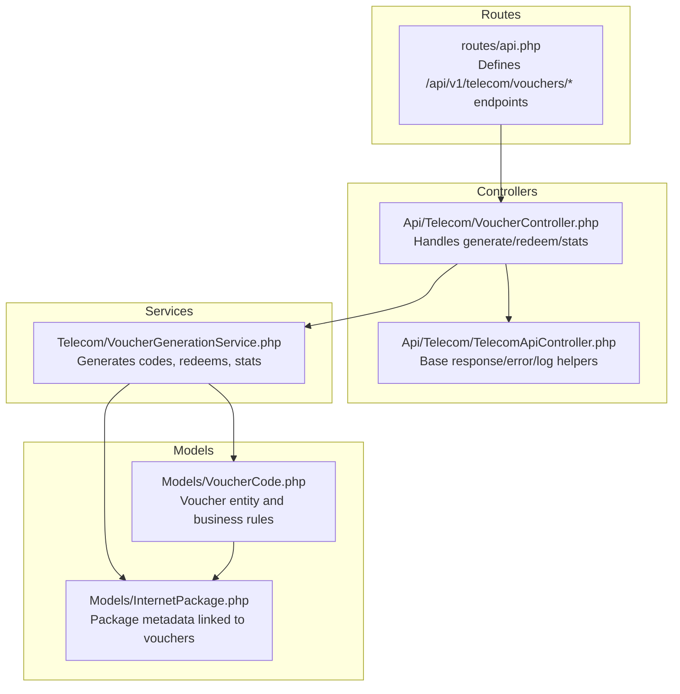
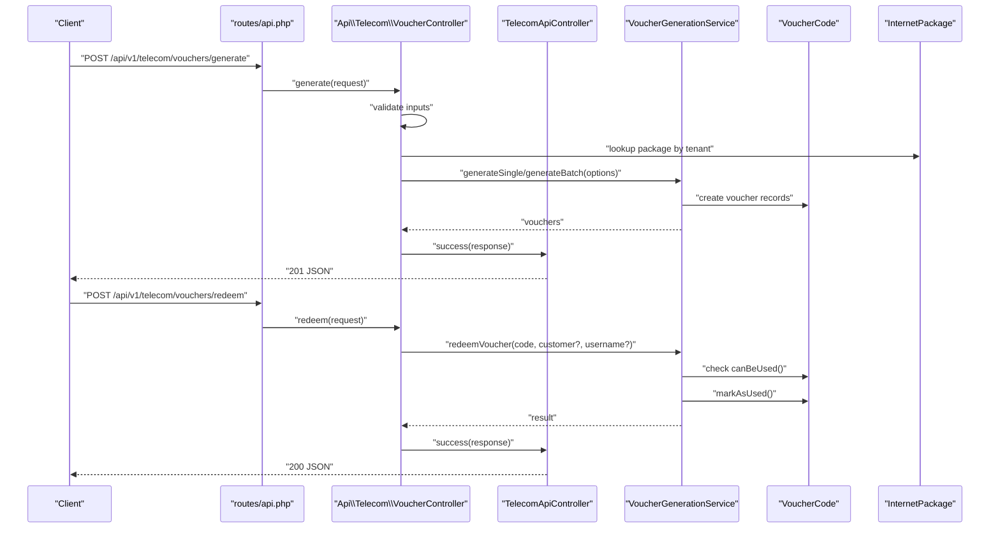
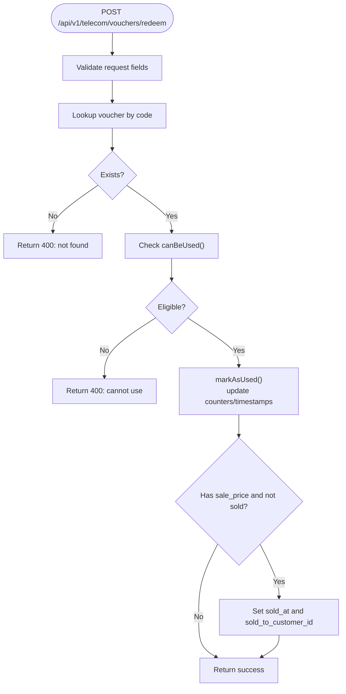
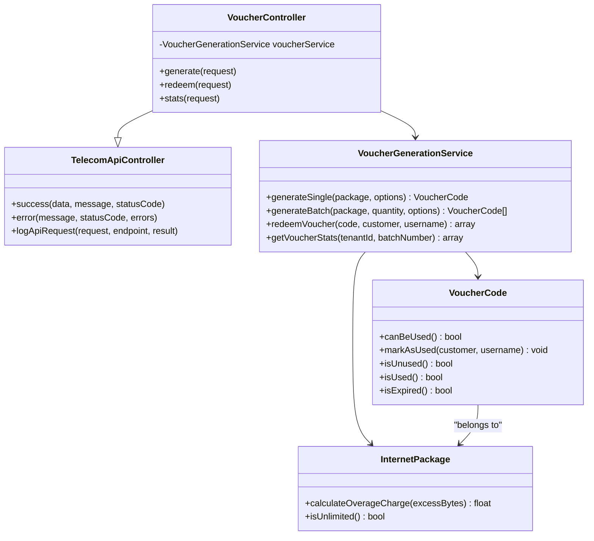

# Voucher Management API

<cite>
**Referenced Files in This Document**
- [routes/api.php](file://routes/api.php)
- [app/Http/Controllers/Api/Telecom/VoucherController.php](file://app/Http/Controllers/Api/Telecom/VoucherController.php)
- [app/Services/Telecom/VoucherGenerationService.php](file://app/Services/Telecom/VoucherGenerationService.php)
- [app/Models/VoucherCode.php](file://app/Models/VoucherCode.php)
- [app/Models/InternetPackage.php](file://app/Models/InternetPackage.php)
- [app/Http/Controllers/Api/Telecom/TelecomApiController.php](file://app/Http/Controllers/Api/Telecom/TelecomApiController.php)
</cite>

## Table of Contents
1. [Introduction](#introduction)
2. [Project Structure](#project-structure)
3. [Core Components](#core-components)
4. [Architecture Overview](#architecture-overview)
5. [Detailed Component Analysis](#detailed-component-analysis)
6. [Dependency Analysis](#dependency-analysis)
7. [Performance Considerations](#performance-considerations)
8. [Troubleshooting Guide](#troubleshooting-guide)
9. [Conclusion](#conclusion)

## Introduction
This document provides comprehensive API documentation for the voucher management system. It covers endpoints for generating, validating, redeeming, and tracking vouchers, along with bulk creation capabilities, promotional campaign support via batch numbering, and usage analytics. Security measures for voucher integrity and anti-fraud protections are also documented.

## Project Structure
The voucher management API is implemented under the telecom module with dedicated routes, controller, service, and model layers.

**Diagram sources**
- [routes/api.php:63-85](file://routes/api.php#L63-L85)
- [app/Http/Controllers/Api/Telecom/VoucherController.php:12-172](file://app/Http/Controllers/Api/Telecom/VoucherController.php#L12-L172)
- [app/Services/Telecom/VoucherGenerationService.php:12-208](file://app/Services/Telecom/VoucherGenerationService.php#L12-L208)
- [app/Models/VoucherCode.php:10-224](file://app/Models/VoucherCode.php#L10-L224)
- [app/Models/InternetPackage.php:12-148](file://app/Models/InternetPackage.php#L12-L148)

**Section sources**
- [routes/api.php:63-85](file://routes/api.php#L63-L85)

## Core Components
- API routes: POST /api/v1/telecom/vouchers/generate, POST /api/v1/telecom/vouchers/redeem, GET /api/v1/telecom/vouchers/stats
- Controller: Orchestrates validation, authorization, and delegates to service
- Service: Generates single/batch codes, redeems vouchers, computes statistics
- Models: VoucherCode encapsulates validity, usage, and sale tracking; InternetPackage defines package attributes linked to vouchers

Key capabilities:
- Single or bulk voucher generation with configurable length, pattern, validity hours, max usage, optional sale price, and batch number
- Voucher redemption with customer association and username tracking
- Campaign-style grouping via batch_number
- Usage analytics including counts, rates, and revenue

**Section sources**
- [app/Http/Controllers/Api/Telecom/VoucherController.php:26-91](file://app/Http/Controllers/Api/Telecom/VoucherController.php#L26-L91)
- [app/Services/Telecom/VoucherGenerationService.php:21-62](file://app/Services/Telecom/VoucherGenerationService.php#L21-L62)
- [app/Services/Telecom/VoucherGenerationService.php:72-107](file://app/Services/Telecom/VoucherGenerationService.php#L72-L107)
- [app/Services/Telecom/VoucherGenerationService.php:116-145](file://app/Services/Telecom/VoucherGenerationService.php#L116-L145)
- [app/Models/VoucherCode.php:13-50](file://app/Models/VoucherCode.php#L13-L50)
- [app/Models/InternetPackage.php:16-57](file://app/Models/InternetPackage.php#L16-L57)

## Architecture Overview
The API follows a layered architecture: routes define endpoints, controllers handle requests and responses, services encapsulate business logic, and models represent domain entities.

**Diagram sources**
- [routes/api.php:82-84](file://routes/api.php#L82-L84)
- [app/Http/Controllers/Api/Telecom/VoucherController.php:26-91](file://app/Http/Controllers/Api/Telecom/VoucherController.php#L26-L91)
- [app/Services/Telecom/VoucherGenerationService.php:21-62](file://app/Services/Telecom/VoucherGenerationService.php#L21-L62)
- [app/Services/Telecom/VoucherGenerationService.php:72-107](file://app/Services/Telecom/VoucherGenerationService.php#L72-L107)
- [app/Models/VoucherCode.php:127-158](file://app/Models/VoucherCode.php#L127-L158)

## Detailed Component Analysis

### API Endpoints

#### Generate Vouchers
- Method: POST
- Path: /api/v1/telecom/vouchers/generate
- Authentication: Requires Sanctum token
- Purpose: Create one or many voucher codes associated with a tenant’s internet package
- Request body fields:
  - package_id: integer, required, exists in internet_packages
  - quantity: integer, required, 1–1000
  - code_length: integer, optional, 6–16
  - code_pattern: string, optional, one of numeric, alphabetic, alphanumeric
  - validity_hours: integer, optional, minimum 1
  - max_usage: integer, optional, minimum 1
  - sale_price: numeric, optional, minimum 0
  - batch_number: string, optional, max 255
  - generated_by: integer, optional, exists in users
- Response:
  - 201 Created with created vouchers list, total count, and batch number
  - On validation failure: 422 Unprocessable Entity with errors
  - On server error: 500 Internal Server Error

Example request:
- POST /api/v1/telecom/vouchers/generate
- Body: {"package_id":1,"quantity":10,"code_length":8,"code_pattern":"alphanumeric","validity_hours":24,"max_usage":1,"batch_number":"CAMPAIGN-2025"}

Example response:
- 201 Created
- Body includes an array of voucher summaries with code, package name, expiry, max usage, and sale price

Security and rate limiting:
- Requires Sanctum auth and write-rate limit middleware
- Logs request metadata for auditing

**Section sources**
- [routes/api.php:82](file://routes/api.php#L82)
- [app/Http/Controllers/Api/Telecom/VoucherController.php:26-91](file://app/Http/Controllers/Api/Telecom/VoucherController.php#L26-L91)
- [app/Services/Telecom/VoucherGenerationService.php:21-62](file://app/Services/Telecom/VoucherGenerationService.php#L21-L62)

#### Redeem Voucher
- Method: POST
- Path: /api/v1/telecom/vouchers/redeem
- Authentication: Requires Sanctum token
- Purpose: Validate and consume a voucher code
- Request body fields:
  - code: string, required
  - customer_id: integer, optional, must belong to the same tenant
  - username: string, optional
- Response:
  - 200 OK with voucher and package details on success
  - 400 Bad Request with error message if invalid
  - 404 Not Found if customer specified but not authorized
  - 422 Unprocessable Entity on validation failure
  - 500 Internal Server Error on unexpected failures

Redemption workflow:
- Lookup voucher by code
- Validate eligibility (unused, not expired, usage count below max)
- Mark as used, update counters/timestamps, optionally associate customer and username
- If sale_price is set and not yet marked sold, record sale metadata

**Diagram sources**
- [app/Services/Telecom/VoucherGenerationService.php:72-107](file://app/Services/Telecom/VoucherGenerationService.php#L72-L107)
- [app/Models/VoucherCode.php:127-158](file://app/Models/VoucherCode.php#L127-L158)

**Section sources**
- [routes/api.php:83](file://routes/api.php#L83)
- [app/Http/Controllers/Api/Telecom/VoucherController.php:98-147](file://app/Http/Controllers/Api/Telecom/VoucherController.php#L98-L147)
- [app/Services/Telecom/VoucherGenerationService.php:72-107](file://app/Services/Telecom/VoucherGenerationService.php#L72-L107)
- [app/Models/VoucherCode.php:127-158](file://app/Models/VoucherCode.php#L127-L158)

#### Get Voucher Statistics
- Method: GET
- Path: /api/v1/telecom/vouchers/stats
- Authentication: Requires Sanctum token
- Optional query: batch_number (string)
- Response:
  - 200 OK with totals, counts per status, usage rate, and total revenue
  - 500 Internal Server Error on failure

Statistics computed:
- Totals and counts for unused, used, expired, revoked
- Usage rate percentage
- Total revenue from sold vouchers

**Section sources**
- [routes/api.php:84](file://routes/api.php#L84)
- [app/Http/Controllers/Api/Telecom/VoucherController.php:154-170](file://app/Http/Controllers/Api/Telecom/VoucherController.php#L154-L170)
- [app/Services/Telecom/VoucherGenerationService.php:116-145](file://app/Services/Telecom/VoucherGenerationService.php#L116-L145)

### Voucher Generation Service
Responsibilities:
- Generate single or batch voucher codes with configurable attributes
- Enforce uniqueness of generated codes
- Provide redemption logic and error messaging
- Compute statistics across tenant and optional batch scope

Key behaviors:
- Code generation supports numeric, alphabetic, and alphanumeric patterns with adjustable length
- Batch generation assigns a consistent batch_number across generated codes
- Redemption checks status, expiry, and max usage before marking as used

**Section sources**
- [app/Services/Telecom/VoucherGenerationService.php:21-62](file://app/Services/Telecom/VoucherGenerationService.php#L21-L62)
- [app/Services/Telecom/VoucherGenerationService.php:147-178](file://app/Services/Telecom/VoucherGenerationService.php#L147-L178)
- [app/Services/Telecom/VoucherGenerationService.php:72-107](file://app/Services/Telecom/VoucherGenerationService.php#L72-L107)
- [app/Services/Telecom/VoucherGenerationService.php:116-145](file://app/Services/Telecom/VoucherGenerationService.php#L116-L145)

### Voucher and Package Models
VoucherCode:
- Attributes include tenant/package linkage, validity window, usage limits, speed/quota, sale metadata, and status lifecycle
- Methods:
  - canBeUsed(): enforces unused, non-expired, and within max_usage
  - markAsUsed(): updates counters and timestamps, associates customer/username if provided
  - Status helpers: isUnused/isUsed/isExpired, validity status attribute
  - Scopes: unused, valid, byBatch

InternetPackage:
- Defines package characteristics (speeds, quota, pricing, features)
- Helpers: unlimited quota detection, formatted price, overage calculation

**Section sources**
- [app/Models/VoucherCode.php:13-50](file://app/Models/VoucherCode.php#L13-L50)
- [app/Models/VoucherCode.php:127-158](file://app/Models/VoucherCode.php#L127-L158)
- [app/Models/VoucherCode.php:179-194](file://app/Models/VoucherCode.php#L179-L194)
- [app/Models/InternetPackage.php:16-57](file://app/Models/InternetPackage.php#L16-L57)
- [app/Models/InternetPackage.php:86-101](file://app/Models/InternetPackage.php#L86-L101)
- [app/Models/InternetPackage.php:138-146](file://app/Models/InternetPackage.php#L138-L146)

## Dependency Analysis

**Diagram sources**
- [app/Http/Controllers/Api/Telecom/TelecomApiController.php:12-57](file://app/Http/Controllers/Api/Telecom/TelecomApiController.php#L12-L57)
- [app/Http/Controllers/Api/Telecom/VoucherController.php:12-19](file://app/Http/Controllers/Api/Telecom/VoucherController.php#L12-L19)
- [app/Services/Telecom/VoucherGenerationService.php:12-208](file://app/Services/Telecom/VoucherGenerationService.php#L12-L208)
- [app/Models/VoucherCode.php:10-224](file://app/Models/VoucherCode.php#L10-L224)
- [app/Models/InternetPackage.php:12-148](file://app/Models/InternetPackage.php#L12-L148)

**Section sources**
- [app/Http/Controllers/Api/Telecom/VoucherController.php:12-19](file://app/Http/Controllers/Api/Telecom/VoucherController.php#L12-L19)
- [app/Services/Telecom/VoucherGenerationService.php:12-208](file://app/Services/Telecom/VoucherGenerationService.php#L12-L208)
- [app/Models/VoucherCode.php:60-90](file://app/Models/VoucherCode.php#L60-L90)
- [app/Models/InternetPackage.php:66-81](file://app/Models/InternetPackage.php#L66-L81)

## Performance Considerations
- Batch generation: Prefer batch creation for high-volume scenarios to reduce overhead
- Indexing: Ensure database indexes exist on frequently queried fields such as code, batch_number, tenant_id, and status
- Validation: Keep validation rules minimal and efficient; leverage existing model relationships
- Logging: API request logs are written to a daily channel; monitor log volume in production environments

## Troubleshooting Guide
Common issues and resolutions:
- Validation failures (422):
  - Ensure package_id belongs to the authenticated tenant
  - Confirm quantity, code_length, and validity_hours are within allowed ranges
- Redemption errors (400):
  - Voucher not found: verify code spelling and case sensitivity
  - Already used/expired/revoked: check status and validity window
  - Usage limit reached: increase max_usage during generation if needed
- Customer not found (404):
  - Verify customer_id belongs to the same tenant
- Server errors (500):
  - Review logs for stack traces and retry after correcting input

Operational tips:
- Use batch_number to group promotional campaigns for easier reporting and revocation
- Extend validity for vouchers nearing expiry if appropriate
- Monitor statistics endpoint for campaign performance and revenue tracking

**Section sources**
- [app/Http/Controllers/Api/Telecom/VoucherController.php:82-90](file://app/Http/Controllers/Api/Telecom/VoucherController.php#L82-L90)
- [app/Http/Controllers/Api/Telecom/VoucherController.php:138-146](file://app/Http/Controllers/Api/Telecom/VoucherController.php#L138-L146)
- [app/Services/Telecom/VoucherGenerationService.php:183-206](file://app/Services/Telecom/VoucherGenerationService.php#L183-L206)

## Security Measures and Anti-Fraud
- Authentication and authorization:
  - All telecom endpoints require Sanctum authentication
  - Tenant scoping enforced in both controller validations and model relations
- Rate limiting:
  - Middleware applied to telecom endpoints to prevent abuse
- Input validation:
  - Strict validation of numeric ranges and allowed patterns
- Integrity and audit:
  - Centralized response/error/log helpers in base controller
  - API request logs capture endpoint, method, IP, user, tenant, and result for traceability

Best practices:
- Limit batch sizes and validity periods for promotional campaigns
- Monitor redemption spikes and correlate with batch_number for anomaly detection
- Restrict generated_by to authorized users and track provenance

**Section sources**
- [routes/api.php:63-85](file://routes/api.php#L63-L85)
- [app/Http/Controllers/Api/Telecom/TelecomApiController.php:17-56](file://app/Http/Controllers/Api/Telecom/TelecomApiController.php#L17-L56)
- [app/Models/VoucherCode.php:127-158](file://app/Models/VoucherCode.php#L127-L158)

## Conclusion
The voucher management API provides robust capabilities for generating, redeeming, and tracking vouchers with strong tenant isolation, validation, and auditing. Bulk generation and batch-based campaigns enable scalable promotional operations, while built-in statistics support performance tracking and monetization insights. Adhering to the documented security and operational guidelines ensures reliable, fraud-resistant usage.