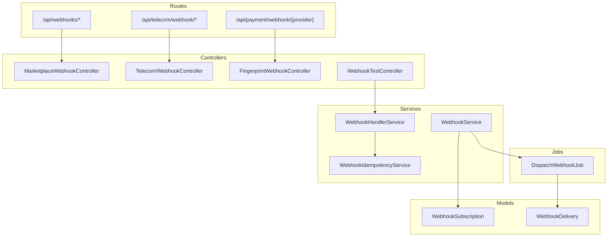
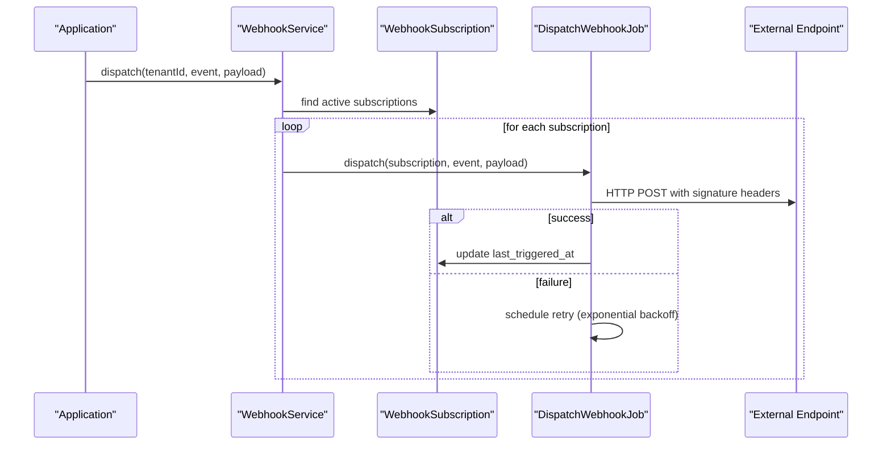
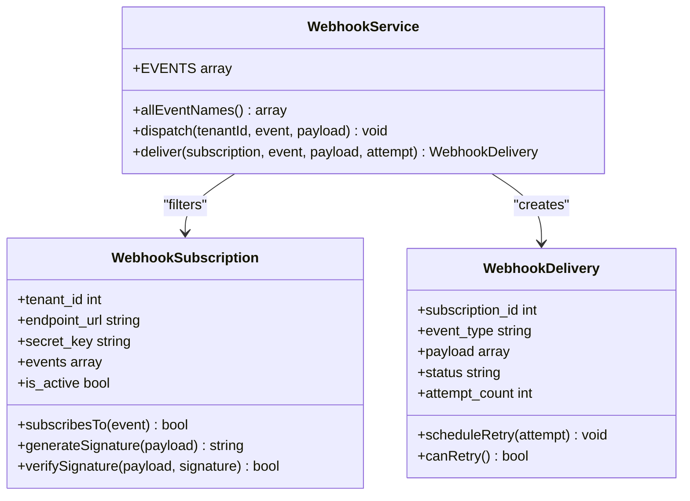
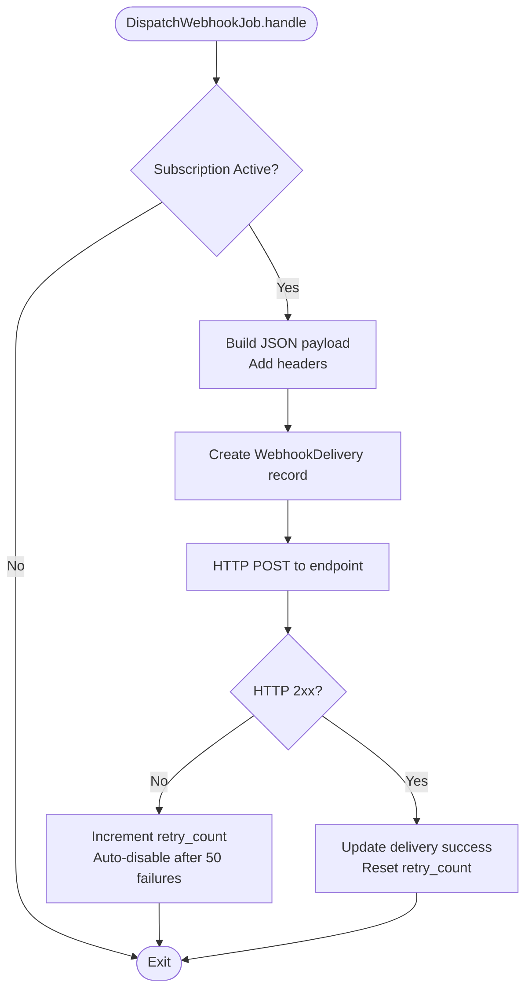
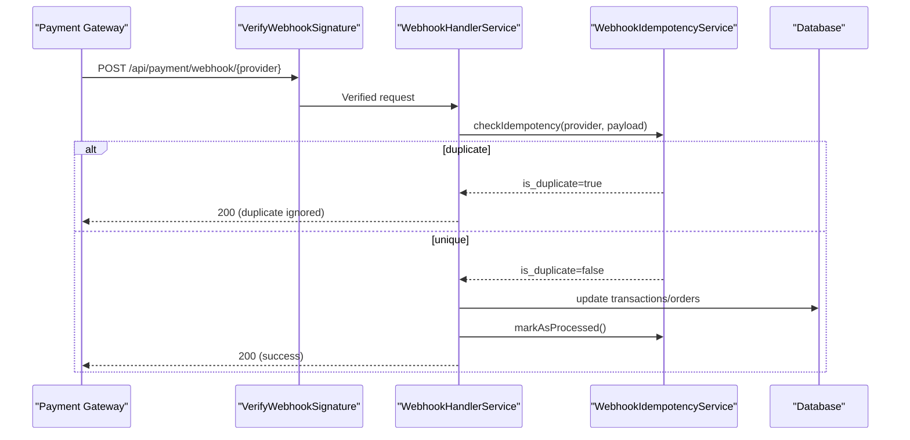
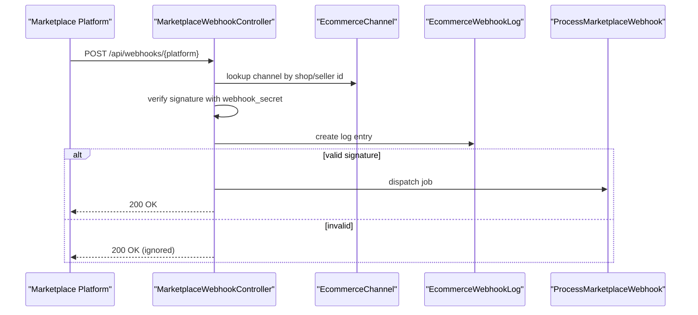
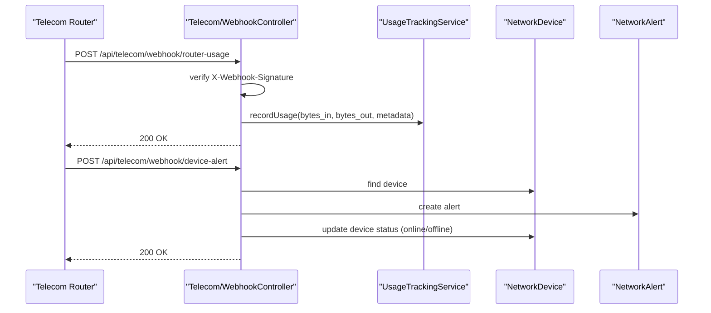
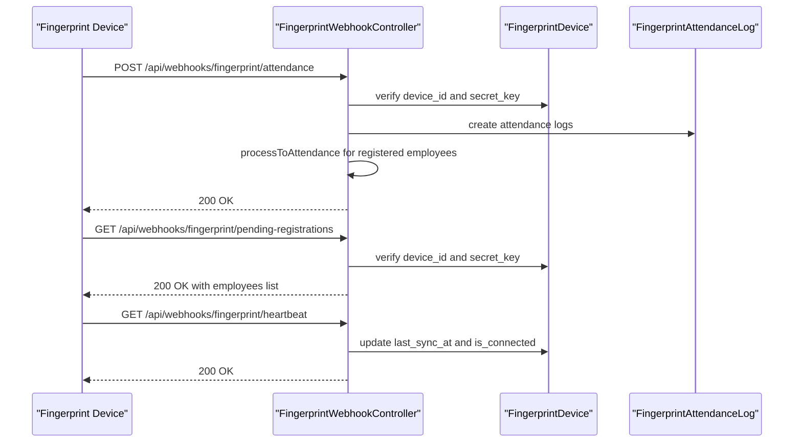
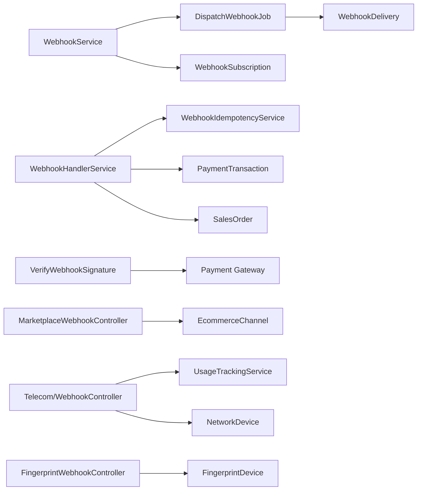

# Webhook Notifications API

<cite>
**Referenced Files in This Document**
- [WebhookService.php](file://app/Services/WebhookService.php)
- [WebhookHandlerService.php](file://app/Services/WebhookHandlerService.php)
- [WebhookIdempotencyService.php](file://app/Services/WebhookIdempotencyService.php)
- [WebhookSubscription.php](file://app/Models/WebhookSubscription.php)
- [WebhookDelivery.php](file://app/Models/WebhookDelivery.php)
- [DispatchWebhookJob.php](file://app/Jobs/DispatchWebhookJob.php)
- [WebhookTestController.php](file://app/Http/Controllers/Api/WebhookTestController.php)
- [VerifyWebhookSignature.php](file://app/Http/Middleware/VerifyWebhookSignature.php)
- [MarketplaceWebhookController.php](file://app/Http/Controllers/MarketplaceWebhookController.php)
- [Telecom/WebhookController.php](file://app/Http/Controllers/Api/Telecom/WebhookController.php)
- [FingerprintWebhookController.php](file://app/Http/Controllers/Api/FingerprintWebhookController.php)
- [api.php](file://routes/api.php)
</cite>

## Table of Contents
1. [Introduction](#introduction)
2. [Project Structure](#project-structure)
3. [Core Components](#core-components)
4. [Architecture Overview](#architecture-overview)
5. [Detailed Component Analysis](#detailed-component-analysis)
6. [Dependency Analysis](#dependency-analysis)
7. [Performance Considerations](#performance-considerations)
8. [Troubleshooting Guide](#troubleshooting-guide)
9. [Conclusion](#conclusion)

## Introduction
This document provides comprehensive API documentation for webhook notification endpoints within the system. It covers webhook subscription management, delivery mechanisms, and event-driven notifications across multiple domains including sales, inventory, payments, telecom, and IoT devices. The documentation includes endpoint definitions, payload formatting, retry mechanisms, delivery confirmation, and security considerations for webhook signatures and payload validation.

## Project Structure
The webhook system spans several layers:
- Routes define inbound webhook endpoints and outbound webhook dispatching
- Controllers handle incoming webhook requests and signature verification
- Services manage event dispatching, idempotency, and handler logic
- Jobs orchestrate asynchronous delivery with retry/backoff policies
- Models track subscriptions, deliveries, and related entities

**Diagram sources**
- [api.php:52-61](file://routes/api.php#L52-L61)
- [api.php:87-91](file://routes/api.php#L87-L91)
- [api.php:107-134](file://routes/api.php#L107-L134)
- [MarketplaceWebhookController.php:11-137](file://app/Http/Controllers/MarketplaceWebhookController.php#L11-L137)
- [Telecom/WebhookController.php:10-164](file://app/Http/Controllers/Api/Telecom/WebhookController.php#L10-L164)
- [FingerprintWebhookController.php:13-223](file://app/Http/Controllers/Api/FingerprintWebhookController.php#L13-L223)
- [WebhookTestController.php:10-164](file://app/Http/Controllers/Api/WebhookTestController.php#L10-L164)
- [WebhookService.php:11-189](file://app/Services/WebhookService.php#L11-L189)
- [WebhookHandlerService.php:12-442](file://app/Services/WebhookHandlerService.php#L12-L442)
- [WebhookIdempotencyService.php:20-283](file://app/Services/WebhookIdempotencyService.php#L20-L283)
- [DispatchWebhookJob.php:15-131](file://app/Jobs/DispatchWebhookJob.php#L15-L131)
- [WebhookSubscription.php:8-160](file://app/Models/WebhookSubscription.php#L8-L160)
- [WebhookDelivery.php:8-179](file://app/Models/WebhookDelivery.php#L8-L179)

**Section sources**
- [api.php:52-61](file://routes/api.php#L52-L61)
- [api.php:87-91](file://routes/api.php#L87-L91)
- [api.php:107-134](file://routes/api.php#L107-L134)

## Core Components
- WebhookService: Defines supported outbound events, dispatches to subscriptions, and performs synchronous delivery for testing
- WebhookSubscription: Manages subscription configuration, event filtering, and signature generation/verification
- WebhookDelivery: Tracks delivery attempts, statuses, and retry scheduling
- DispatchWebhookJob: Asynchronously delivers payloads with exponential backoff and failure handling
- WebhookHandlerService: Processes inbound payment gateway webhooks with signature verification and idempotency
- WebhookIdempotencyService: Prevents duplicate processing using multiple strategies and caching
- Controllers: Handle inbound webhooks for marketplace integrations, telecom devices, and fingerprint devices

**Section sources**
- [WebhookService.php:11-189](file://app/Services/WebhookService.php#L11-L189)
- [WebhookSubscription.php:8-160](file://app/Models/WebhookSubscription.php#L8-L160)
- [WebhookDelivery.php:8-179](file://app/Models/WebhookDelivery.php#L8-L179)
- [DispatchWebhookJob.php:15-131](file://app/Jobs/DispatchWebhookJob.php#L15-L131)
- [WebhookHandlerService.php:12-442](file://app/Services/WebhookHandlerService.php#L12-L442)
- [WebhookIdempotencyService.php:20-283](file://app/Services/WebhookIdempotencyService.php#L20-L283)

## Architecture Overview
The webhook architecture supports two primary flows:
- Outbound webhooks: Events are dispatched to subscribed endpoints with retries and delivery tracking
- Inbound webhooks: Third-party systems send signed payloads that are validated and processed

**Diagram sources**
- [WebhookService.php:102-112](file://app/Services/WebhookService.php#L102-L112)
- [DispatchWebhookJob.php:40-118](file://app/Jobs/DispatchWebhookJob.php#L40-L118)
- [WebhookSubscription.php:93-120](file://app/Models/WebhookSubscription.php#L93-L120)

## Detailed Component Analysis

### Outbound Webhook Dispatching
Outbound webhooks are defined by domain and event type. The dispatcher filters active subscriptions and queues jobs for asynchronous delivery.

Supported outbound events include:
- Sales: order.created, order.updated, order.status_changed, order.cancelled
- Invoice: invoice.created, invoice.updated, invoice.paid, invoice.overdue, invoice.cancelled
- Customer: customer.created, customer.updated, customer.deleted
- Product: product.created, product.updated, product.deleted, product.low_stock
- Inventory: inventory.adjusted, inventory.transferred, stock.received
- Purchasing: purchase.created, purchase.received, purchase.cancelled
- Payment: payment.received, payment.refunded, expense.created
- HRM: employee.created, employee.updated, payroll.processed, attendance.recorded
- Project: project.created, project.updated, task.completed
- Telecom: subscription lifecycle and quota/alert events
- System: test.ping, wildcard events

**Diagram sources**
- [WebhookService.php:16-83](file://app/Services/WebhookService.php#L16-L83)
- [WebhookSubscription.php:8-160](file://app/Models/WebhookSubscription.php#L8-L160)
- [WebhookDelivery.php:8-179](file://app/Models/WebhookDelivery.php#L8-L179)

**Section sources**
- [WebhookService.php:16-97](file://app/Services/WebhookService.php#L16-L97)
- [WebhookService.php:102-112](file://app/Services/WebhookService.php#L102-L112)
- [WebhookService.php:117-187](file://app/Services/WebhookService.php#L117-L187)

### Delivery Mechanisms and Retry Logic
Delivery uses asynchronous jobs with exponential backoff and automatic deactivation after sustained failures.

**Diagram sources**
- [DispatchWebhookJob.php:40-118](file://app/Jobs/DispatchWebhookJob.php#L40-L118)
- [WebhookDelivery.php:103-112](file://app/Models/WebhookDelivery.php#L103-L112)

**Section sources**
- [DispatchWebhookJob.php:19-38](file://app/Jobs/DispatchWebhookJob.php#L19-L38)
- [DispatchWebhookJob.php:120-129](file://app/Jobs/DispatchWebhookJob.php#L120-L129)
- [WebhookDelivery.php:103-112](file://app/Models/WebhookDelivery.php#L103-L112)

### Inbound Webhook Processing
Inbound webhooks are handled by specialized controllers with signature verification and idempotency checks.

#### Payment Gateway Webhooks (Midtrans/Xendit)
- Verified by signature middleware
- Idempotency service prevents duplicate processing
- Transaction updates and optional stock deductions

**Diagram sources**
- [VerifyWebhookSignature.php:14-33](file://app/Http/Middleware/VerifyWebhookSignature.php#L14-L33)
- [WebhookHandlerService.php:24-151](file://app/Services/WebhookHandlerService.php#L24-L151)
- [WebhookIdempotencyService.php:40-93](file://app/Services/WebhookIdempotencyService.php#L40-L93)

**Section sources**
- [VerifyWebhookSignature.php:16-33](file://app/Http/Middleware/VerifyWebhookSignature.php#L16-L33)
- [WebhookHandlerService.php:24-151](file://app/Services/WebhookHandlerService.php#L24-L151)
- [WebhookIdempotencyService.php:40-93](file://app/Services/WebhookIdempotencyService.php#L40-L93)

#### Marketplace Webhooks (Shopee/Tokopedia/Lazada)
- Signature verification using platform-specific headers and secrets
- Logging and job queuing for asynchronous processing

**Diagram sources**
- [MarketplaceWebhookController.php:17-54](file://app/Http/Controllers/MarketplaceWebhookController.php#L17-L54)
- [MarketplaceWebhookController.php:59-94](file://app/Http/Controllers/MarketplaceWebhookController.php#L59-L94)
- [MarketplaceWebhookController.php:99-135](file://app/Http/Controllers/MarketplaceWebhookController.php#L99-L135)

**Section sources**
- [MarketplaceWebhookController.php:17-54](file://app/Http/Controllers/MarketplaceWebhookController.php#L17-L54)
- [MarketplaceWebhookController.php:59-94](file://app/Http/Controllers/MarketplaceWebhookController.php#L59-L94)
- [MarketplaceWebhookController.php:99-135](file://app/Http/Controllers/MarketplaceWebhookController.php#L99-L135)

#### Telecom Device Webhooks
- Router usage data ingestion with signature verification
- Device alert handling with status updates

**Diagram sources**
- [Telecom/WebhookController.php:24-84](file://app/Http/Controllers/Api/Telecom/WebhookController.php#L24-L84)
- [Telecom/WebhookController.php:91-162](file://app/Http/Controllers/Api/Telecom/WebhookController.php#L91-L162)

**Section sources**
- [Telecom/WebhookController.php:24-84](file://app/Http/Controllers/Api/Telecom/WebhookController.php#L24-L84)
- [Telecom/WebhookController.php:91-162](file://app/Http/Controllers/Api/Telecom/WebhookController.php#L91-L162)

#### Fingerprint Device Webhooks
- Attendance data ingestion with device secret verification
- Pending registration retrieval for device polling
- Heartbeat endpoint for device status

**Diagram sources**
- [FingerprintWebhookController.php:24-99](file://app/Http/Controllers/Api/FingerprintWebhookController.php#L24-L99)
- [FingerprintWebhookController.php:141-185](file://app/Http/Controllers/Api/FingerprintWebhookController.php#L141-L185)
- [FingerprintWebhookController.php:190-221](file://app/Http/Controllers/Api/FingerprintWebhookController.php#L190-L221)

**Section sources**
- [FingerprintWebhookController.php:24-99](file://app/Http/Controllers/Api/FingerprintWebhookController.php#L24-L99)
- [FingerprintWebhookController.php:141-185](file://app/Http/Controllers/Api/FingerprintWebhookController.php#L141-L185)
- [FingerprintWebhookController.php:190-221](file://app/Http/Controllers/Api/FingerprintWebhookController.php#L190-L221)

### Event-Driven Notifications
The system supports event-driven notifications across multiple domains:
- Device status changes (telecom online/offline, fingerprint heartbeat)
- Usage thresholds (telecom quota exceeded, low stock alerts)
- User activities (attendance records, payment completions)
- System alerts (network alerts, device connectivity issues)

**Section sources**
- [Telecom/WebhookController.php:115-133](file://app/Http/Controllers/Api/Telecom/WebhookController.php#L115-L133)
- [WebhookHandlerService.php:338-396](file://app/Services/WebhookHandlerService.php#L338-L396)

## Dependency Analysis
The webhook system exhibits clear separation of concerns with minimal coupling between components.

**Diagram sources**
- [WebhookService.php:5-11](file://app/Services/WebhookService.php#L5-L11)
- [DispatchWebhookJob.php:15-30](file://app/Jobs/DispatchWebhookJob.php#L15-L30)
- [WebhookHandlerService.php:5-10](file://app/Services/WebhookHandlerService.php#L5-L10)
- [VerifyWebhookSignature.php:14-22](file://app/Http/Middleware/VerifyWebhookSignature.php#L14-L22)
- [MarketplaceWebhookController.php:5-9](file://app/Http/Controllers/MarketplaceWebhookController.php#L5-L9)
- [Telecom/WebhookController.php:5-17](file://app/Http/Controllers/Api/Telecom/WebhookController.php#L5-L17)
- [FingerprintWebhookController.php:6-11](file://app/Http/Controllers/Api/FingerprintWebhookController.php#L6-L11)

**Section sources**
- [WebhookService.php:5-11](file://app/Services/WebhookService.php#L5-L11)
- [DispatchWebhookJob.php:15-30](file://app/Jobs/DispatchWebhookJob.php#L15-L30)
- [WebhookHandlerService.php:5-10](file://app/Services/WebhookHandlerService.php#L5-L10)

## Performance Considerations
- Asynchronous delivery: Outbound webhooks are queued to prevent blocking the main request thread
- Exponential backoff: Retry delays increase to reduce load on failing endpoints
- Idempotency: Prevents duplicate processing overhead and race conditions
- Request timeouts: Configured connection and request timeouts to avoid hanging connections
- Retry limits: Automatic deactivation after sustained failures to protect system health

## Troubleshooting Guide
Common issues and resolutions:
- Invalid webhook signature: Verify shared secrets and signature algorithms match
- Duplicate webhook processing: Check idempotency cache and database entries
- Delivery failures: Review retry logs and adjust retry configuration
- Authentication errors: Confirm device secrets and endpoint credentials
- Validation errors: Ensure payload conforms to expected schema

**Section sources**
- [VerifyWebhookSignature.php:24-30](file://app/Http/Middleware/VerifyWebhookSignature.php#L24-L30)
- [WebhookIdempotencyService.php:48-66](file://app/Services/WebhookIdempotencyService.php#L48-L66)
- [DispatchWebhookJob.php:120-129](file://app/Jobs/DispatchWebhookJob.php#L120-L129)
- [FingerprintWebhookController.php:40-54](file://app/Http/Controllers/Api/FingerprintWebhookController.php#L40-L54)

## Conclusion
The webhook system provides a robust, secure, and scalable mechanism for event-driven communication across the platform. It supports both inbound and outbound webhooks with comprehensive security measures, idempotency, and retry logic to ensure reliable delivery and processing.