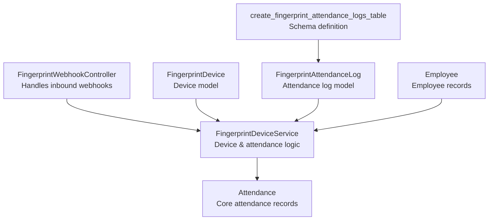
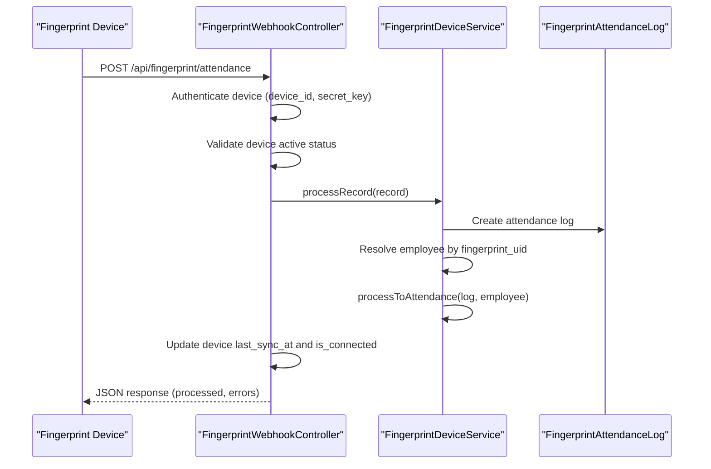
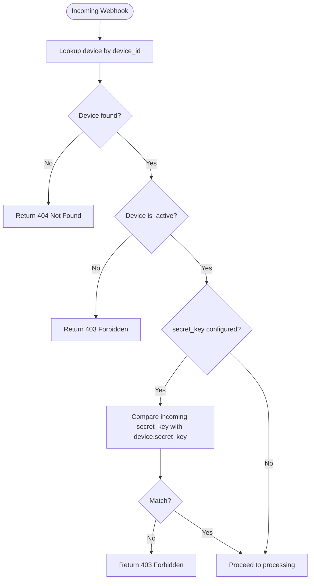
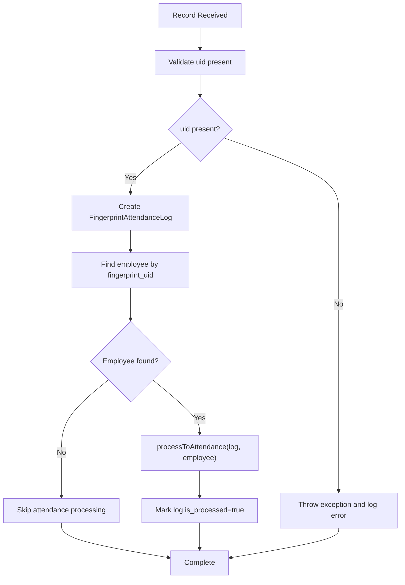
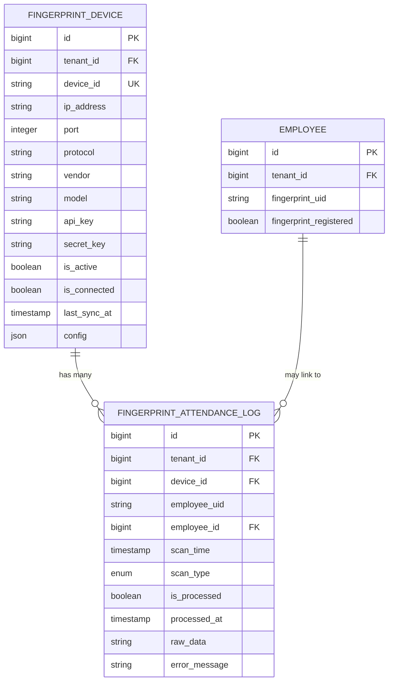
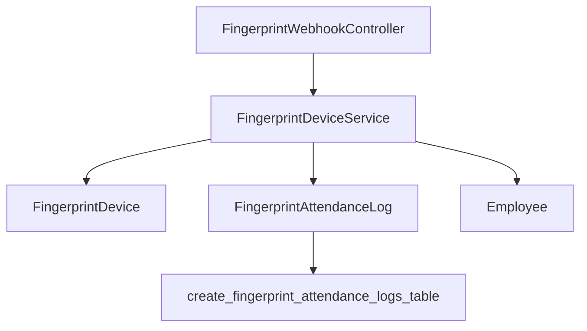

# Fingerprint Device Webhooks

<cite>
**Referenced Files in This Document**
- [FingerprintWebhookController.php](file://app/Http/Controllers/Api/FingerprintWebhookController.php)
- [FingerprintDeviceController.php](file://app/Http/Controllers/FingerprintDeviceController.php)
- [FingerprintDeviceService.php](file://app/Services/FingerprintDeviceService.php)
- [FingerprintDevice.php](file://app/Models/FingerprintDevice.php)
- [FingerprintAttendanceLog.php](file://app/Models/FingerprintAttendanceLog.php)
- [create_fingerprint_attendance_logs_table.php](file://database/migrations/2026_04_04_000002_create_fingerprint_attendance_logs_table.php)
- [VerifyWebhookSignature.php](file://app/Http/Middleware/VerifyWebhookSignature.php)
- [WebhookService.php](file://app/Services/WebhookService.php)
- [WebhookHandlerService.php](file://app/Services/WebhookHandlerService.php)
</cite>

## Table of Contents
1. [Introduction](#introduction)
2. [Project Structure](#project-structure)
3. [Core Components](#core-components)
4. [Architecture Overview](#architecture-overview)
5. [Detailed Component Analysis](#detailed-component-analysis)
6. [Dependency Analysis](#dependency-analysis)
7. [Performance Considerations](#performance-considerations)
8. [Troubleshooting Guide](#troubleshooting-guide)
9. [Conclusion](#conclusion)

## Introduction
This document provides comprehensive API documentation for fingerprint device webhook integration. It covers webhook endpoints for attendance tracking, heartbeat monitoring, and device status updates. It explains payload formats for different event types, device authentication and secret verification, payload validation, integration with fingerprint hardware devices, attendance logging, and real-time synchronization capabilities.

## Project Structure
The fingerprint webhook integration spans several components:
- API controller for receiving webhook events from fingerprint devices
- Device management controller for administrative operations
- Service layer for device connectivity, attendance synchronization, and attendance processing
- Eloquent models for device metadata and attendance logs
- Database migration defining attendance log schema
- Webhook infrastructure supporting outbound webhooks and signature verification patterns

**Diagram sources**
- [FingerprintWebhookController.php:13-223](file://app/Http/Controllers/Api/FingerprintWebhookController.php#L13-L223)
- [FingerprintDeviceService.php:12-372](file://app/Services/FingerprintDeviceService.php#L12-L372)
- [FingerprintDevice.php:11-76](file://app/Models/FingerprintDevice.php#L11-L76)
- [FingerprintAttendanceLog.php:10-50](file://app/Models/FingerprintAttendanceLog.php#L10-L50)
- [create_fingerprint_attendance_logs_table.php:7-43](file://database/migrations/2026_04_04_000002_create_fingerprint_attendance_logs_table.php#L7-L43)

**Section sources**
- [FingerprintWebhookController.php:13-223](file://app/Http/Controllers/Api/FingerprintWebhookController.php#L13-L223)
- [FingerprintDeviceController.php:13-259](file://app/Http/Controllers/FingerprintDeviceController.php#L13-L259)
- [FingerprintDeviceService.php:12-372](file://app/Services/FingerprintDeviceService.php#L12-L372)
- [FingerprintDevice.php:11-76](file://app/Models/FingerprintDevice.php#L11-L76)
- [FingerprintAttendanceLog.php:10-50](file://app/Models/FingerprintAttendanceLog.php#L10-L50)
- [create_fingerprint_attendance_logs_table.php:7-43](file://database/migrations/2026_04_04_000002_create_fingerprint_attendance_logs_table.php#L7-L43)

## Core Components
- FingerprintWebhookController: Receives attendance, registration queries, and heartbeat signals from fingerprint devices. Performs device authentication via secret keys and processes attendance records.
- FingerprintDeviceService: Manages device connectivity testing, attendance log synchronization, and attendance record creation from fingerprint logs. Determines scan types and integrates with the core attendance system.
- FingerprintDevice: Stores device configuration, connectivity status, and synchronization timestamps. Provides connection configuration for external integrations.
- FingerprintAttendanceLog: Persists raw attendance data from devices, links to employees when identified, and tracks processing status.
- Database Migration: Defines the attendance log table schema, including tenant scoping, indexing, and uniqueness constraints.

**Section sources**
- [FingerprintWebhookController.php:24-99](file://app/Http/Controllers/Api/FingerprintWebhookController.php#L24-L99)
- [FingerprintDeviceService.php:17-130](file://app/Services/FingerprintDeviceService.php#L17-L130)
- [FingerprintDevice.php:52-75](file://app/Models/FingerprintDevice.php#L52-L75)
- [FingerprintAttendanceLog.php:13-49](file://app/Models/FingerprintAttendanceLog.php#L13-L49)
- [create_fingerprint_attendance_logs_table.php:13-32](file://database/migrations/2026_04_04_000002_create_fingerprint_attendance_logs_table.php#L13-L32)

## Architecture Overview
The fingerprint webhook architecture supports three primary flows:
- Attendance webhook: Device sends attendance records; server authenticates device, persists logs, attempts employee resolution, and updates attendance.
- Pending registrations endpoint: Device requests employees awaiting fingerprint registration; server returns unregistered employees.
- Heartbeat endpoint: Device periodically pings to indicate connectivity; server updates last sync timestamp.

**Diagram sources**
- [FingerprintWebhookController.php:24-99](file://app/Http/Controllers/Api/FingerprintWebhookController.php#L24-L99)
- [FingerprintDeviceService.php:104-136](file://app/Services/FingerprintDeviceService.php#L104-L136)
- [FingerprintDeviceService.php:218-272](file://app/Services/FingerprintDeviceService.php#L218-L272)

## Detailed Component Analysis

### Webhook Endpoints

#### Attendance Endpoint
- Path: POST /api/fingerprint/attendance
- Purpose: Receive attendance records from fingerprint devices
- Authentication: Requires device_id and optional secret_key configured on device
- Request payload:
  - device_id: String identifier of the device
  - secret_key: Optional string if device secret is configured
  - records: Array of attendance records
- Individual record fields:
  - uid: Required employee identifier
  - timestamp: Optional scan timestamp (defaults to current time if missing)
  - type: Optional scan type, one of check_in, check_out, break_in, break_out (defaults to check_in)
- Response:
  - success: Boolean indicating operation outcome
  - message: Human-readable status
  - processed: Count of successfully processed records
  - errors: Count of failed records

Processing logic:
- Validates device existence and active status
- Optionally verifies secret_key against device configuration
- Iterates through records, creates attendance logs, attempts employee resolution, and triggers attendance processing
- Updates device connectivity and last_sync_at timestamps

**Section sources**
- [FingerprintWebhookController.php:24-99](file://app/Http/Controllers/Api/FingerprintWebhookController.php#L24-L99)
- [FingerprintDeviceService.php:104-136](file://app/Services/FingerprintDeviceService.php#L104-L136)

#### Pending Registrations Endpoint
- Path: GET /api/fingerprint/pending-registrations
- Purpose: Allow device polling to retrieve employees who need fingerprint registration
- Authentication: Same device authentication as attendance endpoint
- Query parameters:
  - device_id: Device identifier
  - secret_key: Optional device secret
- Response:
  - success: Boolean indicator
  - employees: Array of employees without fingerprint_uid or not registered

**Section sources**
- [FingerprintWebhookController.php:141-185](file://app/Http/Controllers/Api/FingerprintWebhookController.php#L141-L185)

#### Heartbeat Endpoint
- Path: GET /api/fingerprint/heartbeat
- Purpose: Device connectivity ping
- Query parameters:
  - device_id: Device identifier
- Response:
  - success: Boolean indicator
  - message: Status message
  - device_name: Device name if found

Behavior:
- Updates device is_connected and last_sync_at timestamps upon successful ping

**Section sources**
- [FingerprintWebhookController.php:190-221](file://app/Http/Controllers/Api/FingerprintWebhookController.php#L190-L221)

### Device Authentication and Secret Verification
- Device lookup: Device is located by device_id field
- Active status: Device must be marked active to accept data
- Secret verification: If device.secret_key is configured, incoming secret_key must match; otherwise authentication fails
- Heartbeat endpoint does not require secret_key for connectivity ping

**Diagram sources**
- [FingerprintWebhookController.php:30-54](file://app/Http/Controllers/Api/FingerprintWebhookController.php#L30-L54)

**Section sources**
- [FingerprintWebhookController.php:30-54](file://app/Http/Controllers/Api/FingerprintWebhookController.php#L30-L54)

### Payload Validation and Processing
- Attendance records:
  - uid is mandatory; missing uid results in processing failure for that record
  - timestamp defaults to current time if omitted
  - scan_type normalized to allowed values; defaults to check_in if invalid
- Attendance log persistence:
  - Stores tenant_id, device_id, employee_uid, scan_time, scan_type, raw_data
  - Links to employee if fingerprint_uid matches existing employee
  - Marks is_processed as false initially
- Attendance processing:
  - Uses service method to convert logs into core attendance records
  - Determines status based on shift and calculates work/overtime minutes
  - Updates processed_at timestamp upon completion

**Diagram sources**
- [FingerprintDeviceService.php:154-184](file://app/Services/FingerprintDeviceService.php#L154-L184)
- [FingerprintDeviceService.php:218-272](file://app/Services/FingerprintDeviceService.php#L218-L272)

**Section sources**
- [FingerprintDeviceService.php:154-184](file://app/Services/FingerprintDeviceService.php#L154-L184)
- [FingerprintDeviceService.php:218-272](file://app/Services/FingerprintDeviceService.php#L218-L272)

### Data Models and Schema

#### FingerprintDevice
- Fields: tenant_id, name, device_id, ip_address, port, protocol, vendor, model, api_key, secret_key, is_active, is_connected, last_sync_at, config, notes
- Relationships: belongs to Tenant, has many FingerprintAttendanceLog
- Methods: getConnectionConfig(), isConfigured()

#### FingerprintAttendanceLog
- Fields: tenant_id, device_id, employee_uid, employee_id, scan_time, scan_type, is_processed, processed_at, raw_data, error_message
- Relationships: belongs to Tenant, FingerprintDevice, Employee

#### Attendance Log Schema
- Unique constraint: device_id, employee_uid, scan_time
- Indexes: tenant_id+employee_uid, tenant_id+scan_time, device_id+scan_time, employee_id+scan_time

**Diagram sources**
- [FingerprintDevice.php:14-50](file://app/Models/FingerprintDevice.php#L14-L50)
- [FingerprintAttendanceLog.php:13-48](file://app/Models/FingerprintAttendanceLog.php#L13-L48)
- [create_fingerprint_attendance_logs_table.php:13-32](file://database/migrations/2026_04_04_000002_create_fingerprint_attendance_logs_table.php#L13-L32)

**Section sources**
- [FingerprintDevice.php:11-76](file://app/Models/FingerprintDevice.php#L11-L76)
- [FingerprintAttendanceLog.php:10-50](file://app/Models/FingerprintAttendanceLog.php#L10-L50)
- [create_fingerprint_attendance_logs_table.php:7-43](file://database/migrations/2026_04_04_000002_create_fingerprint_attendance_logs_table.php#L7-L43)

### Integration with Attendance System
- Attendance determination: Based on existing attendance records for the day, determines whether a scan is a check-in or check-out
- Timezone handling: Uses tenant timezone for accurate daily boundary calculations
- Overtime calculation: Computes overtime minutes using shift definitions when check-out is recorded
- Idempotency considerations: While inbound fingerprint webhooks do not implement idempotency, the outbound webhook infrastructure includes replay protection via timestamp and nonce

**Section sources**
- [FingerprintDeviceService.php:189-211](file://app/Services/FingerprintDeviceService.php#L189-L211)
- [FingerprintDeviceService.php:218-272](file://app/Services/FingerprintDeviceService.php#L218-L272)

### Signature Verification and Security
- Inbound fingerprint webhooks do not implement signature verification; authentication relies on device_id and optional secret_key
- Outbound webhook infrastructure includes signature verification patterns:
  - Replay protection via timestamp and nonce headers
  - HMAC-based signatures for outbound deliveries
  - Middleware pattern for verifying provider-specific signatures exists for other integrations

Note: For production deployments requiring strong security for inbound webhooks, consider extending the fingerprint webhook controller with signature verification similar to the outbound webhook infrastructure.

**Section sources**
- [VerifyWebhookSignature.php:14-60](file://app/Http/Middleware/VerifyWebhookSignature.php#L14-L60)
- [WebhookService.php:117-146](file://app/Services/WebhookService.php#L117-L146)

## Dependency Analysis
The fingerprint webhook system exhibits clear separation of concerns:
- Controller depends on service layer for business logic
- Service layer interacts with models and external device APIs
- Models encapsulate persistence and relationships
- Migration defines schema and constraints

**Diagram sources**
- [FingerprintWebhookController.php:15-18](file://app/Http/Controllers/Api/FingerprintWebhookController.php#L15-L18)
- [FingerprintDeviceService.php:5-12](file://app/Services/FingerprintDeviceService.php#L5-L12)
- [FingerprintDevice.php:11-13](file://app/Models/FingerprintDevice.php#L11-L13)
- [FingerprintAttendanceLog.php:10-12](file://app/Models/FingerprintAttendanceLog.php#L10-L12)
- [create_fingerprint_attendance_logs_table.php:7-13](file://database/migrations/2026_04_04_000002_create_fingerprint_attendance_logs_table.php#L7-L13)

**Section sources**
- [FingerprintWebhookController.php:15-18](file://app/Http/Controllers/Api/FingerprintWebhookController.php#L15-L18)
- [FingerprintDeviceService.php:5-12](file://app/Services/FingerprintDeviceService.php#L5-L12)

## Performance Considerations
- Batch processing: Incoming attendance endpoints accept arrays of records; processing occurs per record with individual error logging
- Indexing: Attendance log table includes strategic indexes for tenant filtering, time-based queries, and uniqueness constraints
- Connectivity updates: Heartbeat and successful attendance processing update last_sync_at and is_connected for real-time status
- Timezone awareness: Attendance processing accounts for tenant timezone to avoid incorrect daily boundaries

## Troubleshooting Guide
Common issues and resolutions:
- Device not found: Ensure device_id matches the configured value; verify device record exists
- Authentication failures: Confirm secret_key matches device configuration if set; inactive devices are rejected
- Missing uid in records: Records without uid are rejected; ensure device sends valid employee identifiers
- Employee not found: Employee must have fingerprint_uid matching device record; register fingerprints first
- Processing errors: Review error logs for specific record failures; individual records are processed independently

Operational checks:
- Heartbeat endpoint confirms device connectivity
- Pending registrations endpoint helps identify unregistered employees
- Attendance logs capture raw data for debugging

**Section sources**
- [FingerprintWebhookController.php:30-54](file://app/Http/Controllers/Api/FingerprintWebhookController.php#L30-L54)
- [FingerprintWebhookController.php:104-136](file://app/Http/Controllers/Api/FingerprintWebhookController.php#L104-L136)
- [FingerprintDeviceService.php:154-184](file://app/Services/FingerprintDeviceService.php#L154-L184)

## Conclusion
The fingerprint device webhook integration provides robust support for attendance tracking, device connectivity monitoring, and employee registration workflows. The design separates concerns between authentication, validation, and business logic while maintaining clear data models and schema constraints. For enhanced security, consider implementing signature verification for inbound webhooks aligned with the outbound webhook infrastructure patterns.