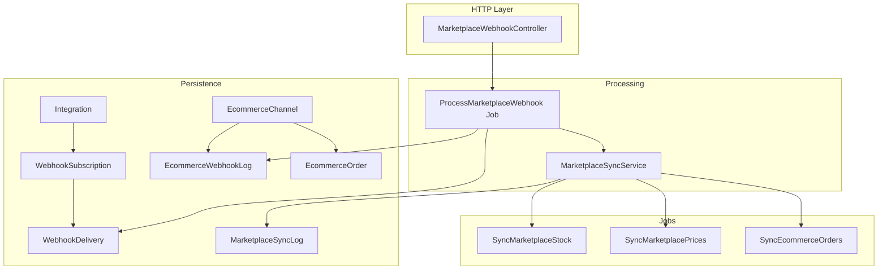
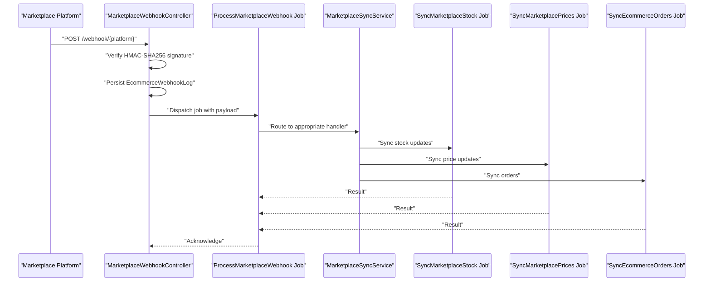
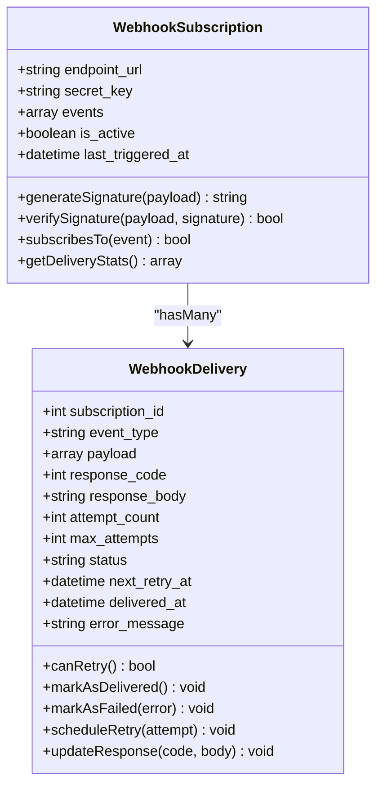
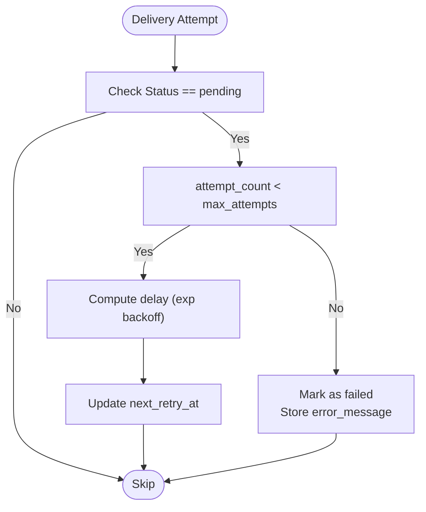
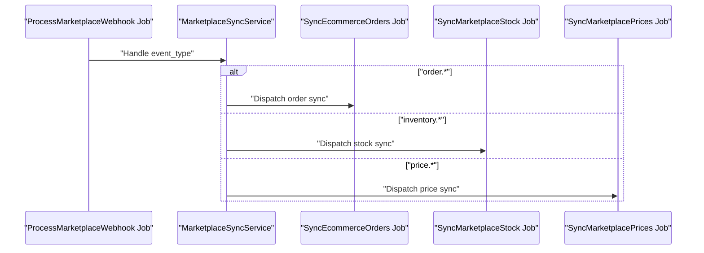
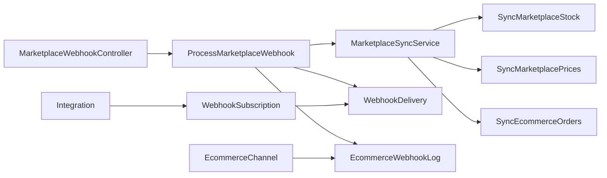

# Marketplace Webhooks

<cite>
**Referenced Files in This Document**
- [MarketplaceWebhookController.php](file://app/Http/Controllers/MarketplaceWebhookController.php)
- [ProcessMarketplaceWebhook.php](file://app/Jobs/ProcessMarketplaceWebhook.php)
- [WebhookSubscription.php](file://app/Models/WebhookSubscription.php)
- [WebhookDelivery.php](file://app/Models/WebhookDelivery.php)
- [EcommerceWebhookLog.php](file://app/Models/EcommerceWebhookLog.php)
- [EcommerceChannel.php](file://app/Models/EcommerceChannel.php)
- [EcommerceOrder.php](file://app/Models/EcommerceOrder.php)
- [Integration.php](file://app/Models/Integration.php)
- [MarketplaceSyncLog.php](file://app/Models/MarketplaceSyncLog.php)
- [SyncMarketplaceStock.php](file://app/Jobs/SyncMarketplaceStock.php)
- [SyncMarketplacePrices.php](file://app/Jobs/SyncMarketplacePrices.php)
- [SyncEcommerceOrders.php](file://app/Jobs/SyncEcommerceOrders.php)
- [MarketplaceSyncService.php](file://app/Services/MarketplaceSyncService.php)
- [webhook-log.blade.php](file://resources/views/settings/webhook-log.blade.php)
</cite>

## Table of Contents
1. [Introduction](#introduction)
2. [Project Structure](#project-structure)
3. [Core Components](#core-components)
4. [Architecture Overview](#architecture-overview)
5. [Detailed Component Analysis](#detailed-component-analysis)
6. [Dependency Analysis](#dependency-analysis)
7. [Performance Considerations](#performance-considerations)
8. [Troubleshooting Guide](#troubleshooting-guide)
9. [Conclusion](#conclusion)
10. [Appendices](#appendices)

## Introduction
This document provides comprehensive API documentation for marketplace webhook integration supporting Shopee, Tokopedia, and Lazada platforms. It covers webhook endpoints, signature verification using HMAC-SHA256, payload validation, event processing, webhook logs, retry mechanisms, error handling, and integration with marketplace APIs for order synchronization and inventory updates.

## Project Structure
The marketplace webhook system is composed of:
- HTTP controller for receiving incoming webhooks
- Job for asynchronous processing of webhook events
- Models for webhook subscriptions, deliveries, and logs
- E-commerce channel configuration and order models
- Integration model linking to webhook subscriptions
- Jobs for syncing orders, stock, and prices
- Service orchestrating marketplace sync operations
- Blade view for webhook log inspection

**Diagram sources**
- [MarketplaceWebhookController.php](file://app/Http/Controllers/MarketplaceWebhookController.php)
- [ProcessMarketplaceWebhook.php](file://app/Jobs/ProcessMarketplaceWebhook.php)
- [MarketplaceSyncService.php](file://app/Services/MarketplaceSyncService.php)
- [WebhookSubscription.php](file://app/Models/WebhookSubscription.php)
- [WebhookDelivery.php](file://app/Models/WebhookDelivery.php)
- [EcommerceWebhookLog.php](file://app/Models/EcommerceWebhookLog.php)
- [EcommerceChannel.php](file://app/Models/EcommerceChannel.php)
- [EcommerceOrder.php](file://app/Models/EcommerceOrder.php)
- [Integration.php](file://app/Models/Integration.php)
- [MarketplaceSyncLog.php](file://app/Models/MarketplaceSyncLog.php)
- [SyncMarketplaceStock.php](file://app/Jobs/SyncMarketplaceStock.php)
- [SyncMarketplacePrices.php](file://app/Jobs/SyncMarketplacePrices.php)
- [SyncEcommerceOrders.php](file://app/Jobs/SyncEcommerceOrders.php)

**Section sources**
- [MarketplaceWebhookController.php](file://app/Http/Controllers/MarketplaceWebhookController.php)
- [ProcessMarketplaceWebhook.php](file://app/Jobs/ProcessMarketplaceWebhook.php)
- [WebhookSubscription.php](file://app/Models/WebhookSubscription.php)
- [WebhookDelivery.php](file://app/Models/WebhookDelivery.php)
- [EcommerceWebhookLog.php](file://app/Models/EcommerceWebhookLog.php)
- [EcommerceChannel.php](file://app/Models/EcommerceChannel.php)
- [EcommerceOrder.php](file://app/Models/EcommerceOrder.php)
- [Integration.php](file://app/Models/Integration.php)
- [MarketplaceSyncLog.php](file://app/Models/MarketplaceSyncLog.php)
- [SyncMarketplaceStock.php](file://app/Jobs/SyncMarketplaceStock.php)
- [SyncMarketplacePrices.php](file://app/Jobs/SyncMarketplacePrices.php)
- [SyncEcommerceOrders.php](file://app/Jobs/SyncEcommerceOrders.php)

## Core Components
- Webhook endpoint controller: Receives incoming webhook requests, validates signatures, persists logs, and dispatches jobs for processing.
- Webhook subscription model: Stores endpoint URL, secret key, subscribed events, and provides HMAC-SHA256 signature generation and verification.
- Webhook delivery model: Tracks delivery attempts, statuses, retries, and responses with exponential backoff.
- E-commerce channel model: Holds platform credentials, webhook settings, and enables/disables webhook processing per platform.
- E-commerce order model: Represents synchronized orders with payment and fulfillment statuses.
- Integration model: Links integrations to webhook subscriptions and manages OAuth tokens and configurations.
- Marketplace sync service: Orchestrates order, stock, and price synchronization jobs.
- Webhook log model: Stores raw payloads, signatures, validity, and processing outcomes for auditing and replay.

**Section sources**
- [WebhookSubscription.php](file://app/Models/WebhookSubscription.php)
- [WebhookDelivery.php](file://app/Models/WebhookDelivery.php)
- [EcommerceChannel.php](file://app/Models/EcommerceChannel.php)
- [EcommerceOrder.php](file://app/Models/EcommerceOrder.php)
- [Integration.php](file://app/Models/Integration.php)
- [MarketplaceSyncService.php](file://app/Services/MarketplaceSyncService.php)
- [EcommerceWebhookLog.php](file://app/Models/EcommerceWebhookLog.php)

## Architecture Overview
The webhook pipeline receives events from marketplace platforms, verifies authenticity via HMAC-SHA256, persists logs, enqueues asynchronous processing, and triggers downstream sync jobs for orders, stock, and pricing.

**Diagram sources**
- [MarketplaceWebhookController.php](file://app/Http/Controllers/MarketplaceWebhookController.php)
- [ProcessMarketplaceWebhook.php](file://app/Jobs/ProcessMarketplaceWebhook.php)
- [MarketplaceSyncService.php](file://app/Services/MarketplaceSyncService.php)
- [SyncMarketplaceStock.php](file://app/Jobs/SyncMarketplaceStock.php)
- [SyncMarketplacePrices.php](file://app/Jobs/SyncMarketplacePrices.php)
- [SyncEcommerceOrders.php](file://app/Jobs/SyncEcommerceOrders.php)

## Detailed Component Analysis

### Webhook Endpoint Controller
Responsibilities:
- Accept webhook POST requests from marketplace platforms
- Extract and validate signature headers
- Persist incoming payload and signature to EcommerceWebhookLog
- Dispatch ProcessMarketplaceWebhook job for asynchronous processing

Key behaviors:
- Signature verification using HMAC-SHA256 against channel-specific secret
- Payload validation and sanitization prior to dispatch
- Immediate HTTP 200 acknowledgment upon acceptance
- Error logging and non-delivery tracking via EcommerceWebhookLog

Operational flow:
- Receive request
- Verify signature
- Save log entry
- Enqueue job
- Respond with success

**Section sources**
- [MarketplaceWebhookController.php](file://app/Http/Controllers/MarketplaceWebhookController.php)
- [EcommerceWebhookLog.php](file://app/Models/EcommerceWebhookLog.php)

### Webhook Subscription Model
Responsibilities:
- Store endpoint URL and shared secret for each integration
- Maintain subscribed event types as JSON array
- Generate and verify HMAC-SHA256 signatures for payload integrity

Key behaviors:
- Signature generation using hash_hmac('sha256')
- Constant-time comparison via hash_equals
- Event filtering helpers for subscription scopes
- Delivery statistics aggregation

**Diagram sources**
- [WebhookSubscription.php](file://app/Models/WebhookSubscription.php)
- [WebhookDelivery.php](file://app/Models/WebhookDelivery.php)

**Section sources**
- [WebhookSubscription.php](file://app/Models/WebhookSubscription.php)
- [WebhookDelivery.php](file://app/Models/WebhookDelivery.php)

### Webhook Delivery and Retry Mechanism
Responsibilities:
- Track delivery attempts per event type
- Apply exponential backoff delays between retries
- Record response codes and bodies
- Determine success/failure and remaining retries

Retry policy:
- Attempts: up to configured max_attempts
- Delays: 1 min, 5 min, 15 min, 1 hour, 4 hours (exponential backoff)
- Pending items eligible for retry when next_retry_at <= now()

**Diagram sources**
- [WebhookDelivery.php](file://app/Models/WebhookDelivery.php)

**Section sources**
- [WebhookDelivery.php](file://app/Models/WebhookDelivery.php)

### E-commerce Channel and Platform Configuration
Responsibilities:
- Store platform credentials and webhook settings
- Enable/disable webhook processing per platform
- Maintain sync flags and timestamps for stock and price sync
- Encrypt sensitive fields at rest

Key fields:
- platform, shop_name, shop_id
- api_key, api_secret, access_token
- webhook_enabled, webhook_secret
- stock_sync_enabled, price_sync_enabled
- last_sync_at, last_stock_sync_at, last_price_sync_at

**Section sources**
- [EcommerceChannel.php](file://app/Models/EcommerceChannel.php)

### E-commerce Orders and Sync Logs
Responsibilities:
- Persist synchronized orders with payment and fulfillment metadata
- Track marketplace sync operations and outcomes
- Support reconciliation and audit trails

Order attributes:
- external_order_id, internal_order_id
- customer details, shipping address
- amounts (subtotal, shipping_cost, total_amount)
- payment_status, fulfillment_status
- ordered_at, synced_at
- raw_data for audit

**Section sources**
- [EcommerceOrder.php](file://app/Models/EcommerceOrder.php)
- [MarketplaceSyncLog.php](file://app/Models/MarketplaceSyncLog.php)

### Integration Model and Webhook Subscriptions
Responsibilities:
- Link integrations to webhook subscriptions
- Manage OAuth tokens and configuration values
- Provide connector class resolution for platform-specific handlers

Relationships:
- Integration has many WebhookSubscription
- WebhookSubscription belongs to Integration

**Section sources**
- [Integration.php](file://app/Models/Integration.php)
- [WebhookSubscription.php](file://app/Models/WebhookSubscription.php)

### Webhook Log System
Responsibilities:
- Capture raw payloads, signatures, and validity flags
- Record processed timestamps and error messages
- Associate with channel and tenant for auditability

Fields:
- tenant_id, channel_id, platform, event_type
- payload (array), signature, is_valid, processed_at, error_message

**Section sources**
- [EcommerceWebhookLog.php](file://app/Models/EcommerceWebhookLog.php)

### Order Synchronization, Inventory Updates, and Price Sync
Responsibilities:
- Process incoming order events and synchronize to internal EcommerceOrder records
- Trigger stock inventory updates based on inventory change events
- Update product prices according to price change events

Jobs:
- SyncEcommerceOrders: Create/update orders and related line items
- SyncMarketplaceStock: Adjust stock quantities per variant/product
- SyncMarketplacePrices: Update product/pricing tiers

**Diagram sources**
- [ProcessMarketplaceWebhook.php](file://app/Jobs/ProcessMarketplaceWebhook.php)
- [MarketplaceSyncService.php](file://app/Services/MarketplaceSyncService.php)
- [SyncEcommerceOrders.php](file://app/Jobs/SyncEcommerceOrders.php)
- [SyncMarketplaceStock.php](file://app/Jobs/SyncMarketplaceStock.php)
- [SyncMarketplacePrices.php](file://app/Jobs/SyncMarketplacePrices.php)

**Section sources**
- [ProcessMarketplaceWebhook.php](file://app/Jobs/ProcessMarketplaceWebhook.php)
- [MarketplaceSyncService.php](file://app/Services/MarketplaceSyncService.php)
- [SyncEcommerceOrders.php](file://app/Jobs/SyncEcommerceOrders.php)
- [SyncMarketplaceStock.php](file://app/Jobs/SyncMarketplaceStock.php)
- [SyncMarketplacePrices.php](file://app/Jobs/SyncMarketplacePrices.php)

## Dependency Analysis
The webhook system exhibits clear separation of concerns:
- Controller depends on signature verification and job dispatch
- Jobs depend on service orchestration and platform connectors
- Models encapsulate persistence and business rules
- Views provide operational visibility into webhook logs

**Diagram sources**
- [MarketplaceWebhookController.php](file://app/Http/Controllers/MarketplaceWebhookController.php)
- [ProcessMarketplaceWebhook.php](file://app/Jobs/ProcessMarketplaceWebhook.php)
- [MarketplaceSyncService.php](file://app/Services/MarketplaceSyncService.php)
- [SyncMarketplaceStock.php](file://app/Jobs/SyncMarketplaceStock.php)
- [SyncMarketplacePrices.php](file://app/Jobs/SyncMarketplacePrices.php)
- [SyncEcommerceOrders.php](file://app/Jobs/SyncEcommerceOrders.php)
- [WebhookDelivery.php](file://app/Models/WebhookDelivery.php)
- [EcommerceWebhookLog.php](file://app/Models/EcommerceWebhookLog.php)
- [EcommerceChannel.php](file://app/Models/EcommerceChannel.php)
- [Integration.php](file://app/Models/Integration.php)
- [WebhookSubscription.php](file://app/Models/WebhookSubscription.php)

**Section sources**
- [MarketplaceWebhookController.php](file://app/Http/Controllers/MarketplaceWebhookController.php)
- [ProcessMarketplaceWebhook.php](file://app/Jobs/ProcessMarketplaceWebhook.php)
- [MarketplaceSyncService.php](file://app/Services/MarketplaceSyncService.php)
- [WebhookDelivery.php](file://app/Models/WebhookDelivery.php)
- [EcommerceWebhookLog.php](file://app/Models/EcommerceWebhookLog.php)
- [EcommerceChannel.php](file://app/Models/EcommerceChannel.php)
- [Integration.php](file://app/Models/Integration.php)
- [WebhookSubscription.php](file://app/Models/WebhookSubscription.php)

## Performance Considerations
- Asynchronous processing: Use jobs to avoid blocking webhook responses
- Exponential backoff: Reduce load on downstream systems during failures
- Payload validation: Reject malformed or oversized payloads early
- Idempotency: Ensure order and inventory sync jobs handle duplicate events gracefully
- Monitoring: Track delivery success rates and retry counts via WebhookDelivery metrics

## Troubleshooting Guide
Common issues and resolutions:
- Signature verification failure:
  - Confirm shared secret matches between platform and channel configuration
  - Verify header names and encoding used by the platform
- Delivery failures:
  - Inspect WebhookDelivery records for response codes and error messages
  - Review retry counts and next_retry_at timestamps
- Missing events:
  - Ensure WebhookSubscription.events includes target event types
  - Confirm Integration status and OAuth tokens are valid
- Audit and replay:
  - Use EcommerceWebhookLog entries to inspect raw payloads and validity flags
  - Replay logs via administrative tools if available

Operational views:
- Webhook log dashboard for monitoring deliveries and retries

**Section sources**
- [WebhookDelivery.php](file://app/Models/WebhookDelivery.php)
- [EcommerceWebhookLog.php](file://app/Models/EcommerceWebhookLog.php)
- [webhook-log.blade.php](file://resources/views/settings/webhook-log.blade.php)

## Conclusion
The marketplace webhook system provides a robust, scalable foundation for integrating Shopee, Tokopedia, and Lazada. It ensures secure, reliable event delivery through HMAC-SHA256 verification, resilient retry mechanisms, and comprehensive logging. The modular design supports seamless order, stock, and price synchronization while maintaining auditability and operability.

## Appendices

### API Definition: Webhook Endpoints
- Base Path: /webhook
- Supported Platforms: shopee, tokopedia, lazada
- Method: POST
- Headers:
  - X-Platform: Platform identifier (shopee|tokopedia|lazada)
  - X-Hmac-Signature: HMAC-SHA256 signature of payload
  - Content-Type: application/json
- Request Body: Platform-specific JSON payload
- Response:
  - 200 OK: Acknowledged
  - 400 Bad Request: Invalid signature or malformed payload
  - 500 Internal Server Error: Server-side processing errors

Note: Platform-specific header names and payload schemas may vary. Ensure alignment with the platform’s documented webhook specification.

### Signature Verification Using HMAC-SHA256
- Compute HMAC-SHA256 of the raw payload using the channel’s shared secret
- Compare with received signature using constant-time comparison
- Reject if mismatch or missing signature

**Section sources**
- [WebhookSubscription.php](file://app/Models/WebhookSubscription.php)
- [EcommerceChannel.php](file://app/Models/EcommerceChannel.php)

### Payload Validation and Event Processing
- Validate JSON structure and required fields
- Filter by event_type using WebhookSubscription.subscribesTo
- Dispatch appropriate job based on event category (order, inventory, price)

**Section sources**
- [ProcessMarketplaceWebhook.php](file://app/Jobs/ProcessMarketplaceWebhook.php)
- [WebhookSubscription.php](file://app/Models/WebhookSubscription.php)

### Webhook Log System
- Persist raw payload, signature, and validity flag
- Track processing outcomes and error messages
- Provide tenant/channel association for auditability

**Section sources**
- [EcommerceWebhookLog.php](file://app/Models/EcommerceWebhookLog.php)

### Retry Mechanisms and Error Handling
- Automatic retries with exponential backoff
- Max attempts configurable per subscription
- Failure marking with error messages stored for diagnostics

**Section sources**
- [WebhookDelivery.php](file://app/Models/WebhookDelivery.php)

### Integration with Marketplace APIs
- Use Integration.oauth_tokens for authenticated API calls
- Retrieve connector class via Integration.getConnectorClass
- Maintain sync frequency and last/next sync timestamps

**Section sources**
- [Integration.php](file://app/Models/Integration.php)

### Order Synchronization Process
- Parse order events and map to EcommerceOrder fields
- Create/update order records with payment and fulfillment status
- Trigger downstream workflows for fulfillment and accounting

**Section sources**
- [SyncEcommerceOrders.php](file://app/Jobs/SyncEcommerceOrders.php)
- [EcommerceOrder.php](file://app/Models/EcommerceOrder.php)

### Inventory Update Workflows
- Process inventory change events
- Update stock quantities in product/variant models
- Trigger reordering alerts and reporting updates

**Section sources**
- [SyncMarketplaceStock.php](file://app/Jobs/SyncMarketplaceStock.php)

### Price Update Workflows
- Handle price change events
- Update product pricing tiers and variants
- Invalidate caches and trigger price change notifications

**Section sources**
- [SyncMarketplacePrices.php](file://app/Jobs/SyncMarketplacePrices.php)