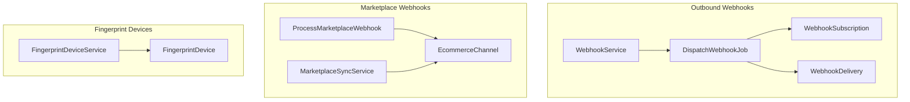
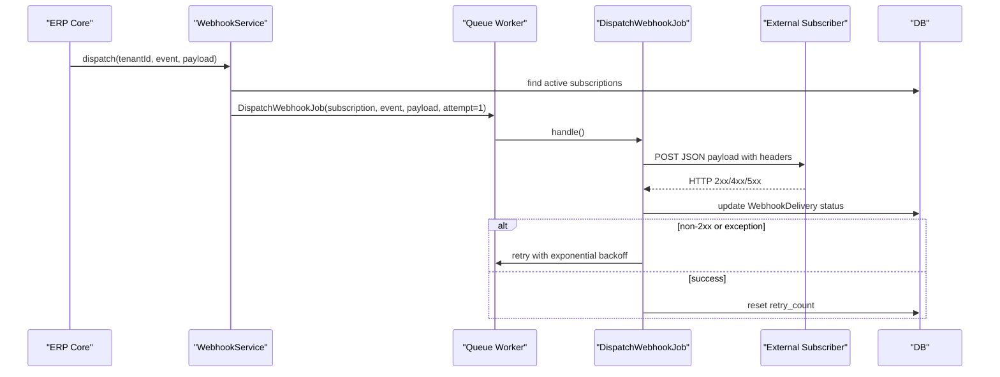
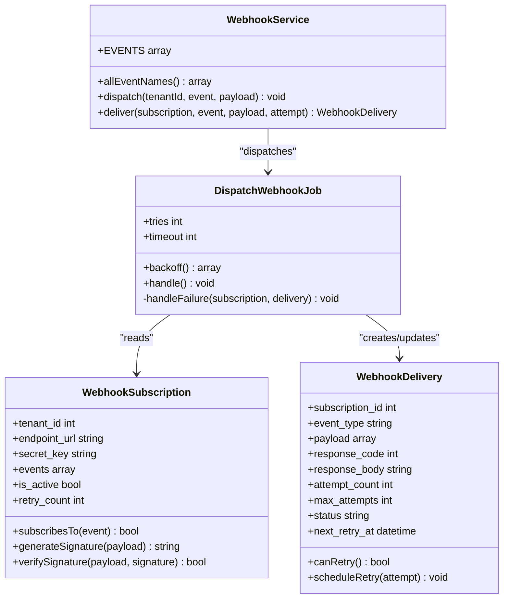
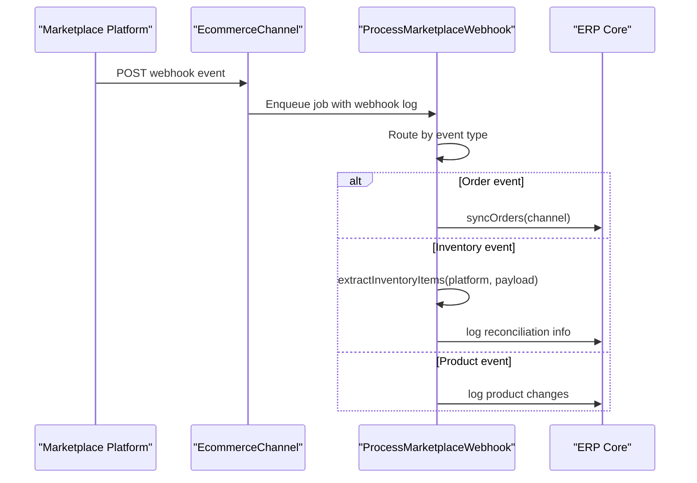
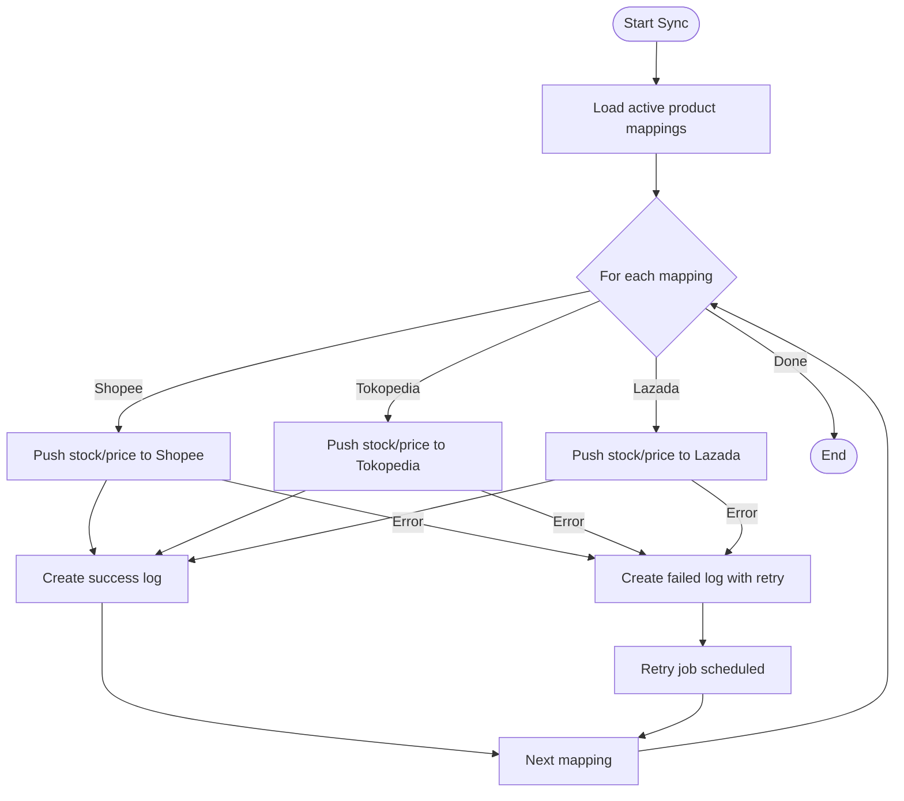
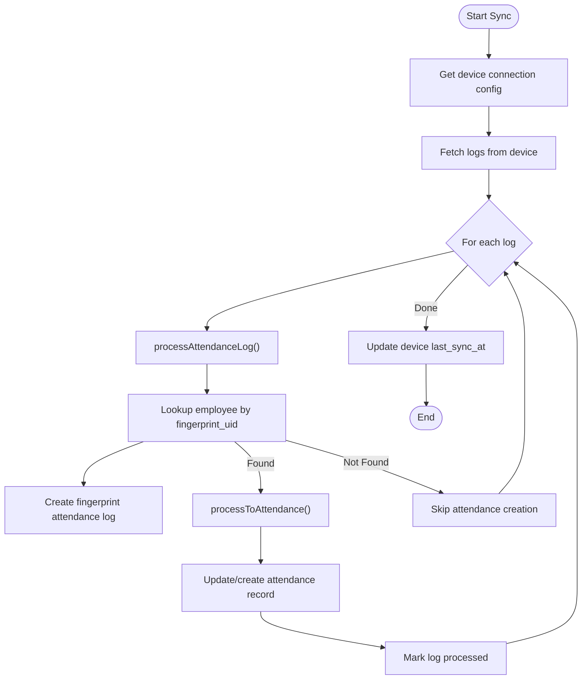
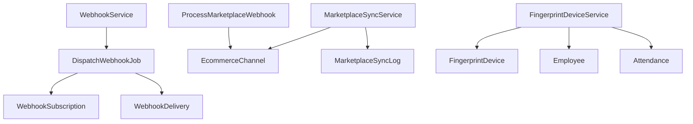

# Webhook Integration API

<cite>
**Referenced Files in This Document**
- [WebhookService.php](file://app/Services/WebhookService.php)
- [WebhookHandlerService.php](file://app/Services/WebhookHandlerService.php)
- [MarketplaceSyncService.php](file://app/Services/MarketplaceSyncService.php)
- [FingerprintDeviceService.php](file://app/Services/FingerprintDeviceService.php)
- [DispatchWebhookJob.php](file://app/Jobs/DispatchWebhookJob.php)
- [ProcessMarketplaceWebhook.php](file://app/Jobs/ProcessMarketplaceWebhook.php)
- [RetryFailedMarketplaceSyncs.php](file://app/Jobs/RetryFailedMarketplaceSyncs.php)
- [WebhookSubscription.php](file://app/Models/WebhookSubscription.php)
- [WebhookDelivery.php](file://app/Models/WebhookDelivery.php)
- [EcommerceChannel.php](file://app/Models/EcommerceChannel.php)
- [FingerprintDevice.php](file://app/Models/FingerprintDevice.php)
- [2026_03_23_000037_create_api_tokens_and_webhooks_table.php](file://database/migrations/2026_03_23_000037_create_api_tokens_and_webhooks_table.php)
- [2026_04_08_000013_create_webhook_subscriptions_table.php](file://database/migrations/2026_04_08_000013_create_webhook_subscriptions_table.php)
- [2026_04_08_000014_create_webhook_deliveries_table.php](file://database/migrations/2026_04_08_000014_create_webhook_deliveries_table.php)
- [2026_04_02_200001_enhance_marketplace_integration.php](file://database/migrations/2026_04_02_200001_enhance_marketplace_integration.php)
- [2026_04_04_000001_create_fingerprint_devices_table.php](file://database/migrations/2026_04_04_000001_create_fingerprint_devices_table.php)
</cite>

## Table of Contents
1. [Introduction](#introduction)
2. [Project Structure](#project-structure)
3. [Core Components](#core-components)
4. [Architecture Overview](#architecture-overview)
5. [Detailed Component Analysis](#detailed-component-analysis)
6. [Dependency Analysis](#dependency-analysis)
7. [Performance Considerations](#performance-considerations)
8. [Troubleshooting Guide](#troubleshooting-guide)
9. [Conclusion](#conclusion)
10. [Appendices](#appendices)

## Introduction
This document provides comprehensive API documentation for webhook integration endpoints within the system. It covers:
- Outbound webhooks for ERP events to external subscribers
- Inbound marketplace webhooks from Shopee, Tokopedia, and Lazada for order synchronization and inventory reconciliation
- Fingerprint device webhooks for attendance tracking and heartbeat monitoring
- Signature verification, payload validation, and retry mechanisms
- Testing tools, monitoring, and troubleshooting procedures

The documentation is designed for both technical and non-technical audiences, with clear explanations, diagrams, and actionable guidance.

## Project Structure
The webhook integration spans services, jobs, models, and database migrations. Key areas:
- Outbound webhooks: Services and jobs for dispatching and retrying
- Inbound marketplace webhooks: Jobs for processing order/inventory/product events
- Fingerprint devices: Services for device connectivity, attendance sync, and status reporting
- Data models: Subscriptions, deliveries, marketplace channels, and fingerprint devices
- Migrations: Database schema for webhook subscriptions, deliveries, marketplace mappings, and fingerprint devices



**Diagram sources**
- [WebhookService.php:11-189](file://app/Services/WebhookService.php#L11-L189)
- [DispatchWebhookJob.php:15-131](file://app/Jobs/DispatchWebhookJob.php#L15-L131)
- [WebhookSubscription.php:8-160](file://app/Models/WebhookSubscription.php#L8-L160)
- [WebhookDelivery.php:8-179](file://app/Models/WebhookDelivery.php#L8-L179)
- [ProcessMarketplaceWebhook.php:16-142](file://app/Jobs/ProcessMarketplaceWebhook.php#L16-L142)
- [EcommerceChannel.php:11-116](file://app/Models/EcommerceChannel.php#L11-L116)
- [MarketplaceSyncService.php:22-439](file://app/Services/MarketplaceSyncService.php#L22-L439)
- [FingerprintDeviceService.php:12-372](file://app/Services/FingerprintDeviceService.php#L12-L372)
- [FingerprintDevice.php:11-76](file://app/Models/FingerprintDevice.php#L11-L76)

**Section sources**
- [WebhookService.php:11-189](file://app/Services/WebhookService.php#L11-L189)
- [DispatchWebhookJob.php:15-131](file://app/Jobs/DispatchWebhookJob.php#L15-L131)
- [ProcessMarketplaceWebhook.php:16-142](file://app/Jobs/ProcessMarketplaceWebhook.php#L16-L142)
- [MarketplaceSyncService.php:22-439](file://app/Services/MarketplaceSyncService.php#L22-L439)
- [FingerprintDeviceService.php:12-372](file://app/Services/FingerprintDeviceService.php#L12-L372)
- [WebhookSubscription.php:8-160](file://app/Models/WebhookSubscription.php#L8-L160)
- [WebhookDelivery.php:8-179](file://app/Models/WebhookDelivery.php#L8-L179)
- [EcommerceChannel.php:11-116](file://app/Models/EcommerceChannel.php#L11-L116)
- [FingerprintDevice.php:11-76](file://app/Models/FingerprintDevice.php#L11-L76)

## Core Components
- Outbound Webhook Service: Defines supported events, dispatches to subscribers, and delivers synchronously for testing.
- Webhook Delivery Job: Asynchronously sends payloads with exponential backoff and auto-disable after failures.
- Marketplace Sync Service: Pushes stock and price updates to Shopee, Tokopedia, and Lazada; handles platform-specific authentication and signatures.
- Marketplace Webhook Processor: Routes inbound marketplace events to appropriate handlers for orders, inventory, and products.
- Fingerprint Device Service: Manages device connectivity, attendance log sync, and attendance processing with timezone-aware logic.
- Data Models: Subscriptions, deliveries, marketplace channels, and fingerprint devices with encrypted credential storage.

**Section sources**
- [WebhookService.php:11-189](file://app/Services/WebhookService.php#L11-L189)
- [DispatchWebhookJob.php:15-131](file://app/Jobs/DispatchWebhookJob.php#L15-L131)
- [MarketplaceSyncService.php:22-439](file://app/Services/MarketplaceSyncService.php#L22-L439)
- [ProcessMarketplaceWebhook.php:16-142](file://app/Jobs/ProcessMarketplaceWebhook.php#L16-L142)
- [FingerprintDeviceService.php:12-372](file://app/Services/FingerprintDeviceService.php#L12-L372)
- [WebhookSubscription.php:8-160](file://app/Models/WebhookSubscription.php#L8-L160)
- [WebhookDelivery.php:8-179](file://app/Models/WebhookDelivery.php#L8-L179)
- [EcommerceChannel.php:11-116](file://app/Models/EcommerceChannel.php#L11-L116)
- [FingerprintDevice.php:11-76](file://app/Models/FingerprintDevice.php#L11-L76)

## Architecture Overview
The webhook integration follows a publish-subscribe model for outbound events and a request-response model for inbound marketplace notifications. The system ensures reliability through retries, idempotency, and encrypted credentials.



**Diagram sources**
- [WebhookService.php:102-112](file://app/Services/WebhookService.php#L102-L112)
- [DispatchWebhookJob.php:40-118](file://app/Jobs/DispatchWebhookJob.php#L40-L118)
- [WebhookDelivery.php:8-179](file://app/Models/WebhookDelivery.php#L8-L179)

**Section sources**
- [WebhookService.php:102-112](file://app/Services/WebhookService.php#L102-L112)
- [DispatchWebhookJob.php:40-118](file://app/Jobs/DispatchWebhookJob.php#L40-L118)
- [WebhookDelivery.php:8-179](file://app/Models/WebhookDelivery.php#L8-L179)

## Detailed Component Analysis

### Outbound Webhook API
- Event Catalog: Events are grouped by module (Sales, Invoice, Customer, Product, Inventory, Purchasing, Payment, HRM, Project, Telecom, System).
- Dispatch Mechanism: Finds active subscriptions and dispatches jobs asynchronously.
- Delivery Headers: Includes event type, attempt number, timestamp, nonce, and optional HMAC signature.
- Retry Logic: Up to 5 attempts with exponential backoff; subscription auto-disabled after 50 consecutive failures.



**Diagram sources**
- [WebhookService.php:11-189](file://app/Services/WebhookService.php#L11-L189)
- [DispatchWebhookJob.php:15-131](file://app/Jobs/DispatchWebhookJob.php#L15-L131)
- [WebhookSubscription.php:8-160](file://app/Models/WebhookSubscription.php#L8-L160)
- [WebhookDelivery.php:8-179](file://app/Models/WebhookDelivery.php#L8-L179)

**Section sources**
- [WebhookService.php:16-112](file://app/Services/WebhookService.php#L16-L112)
- [DispatchWebhookJob.php:19-38](file://app/Jobs/DispatchWebhookJob.php#L19-L38)
- [WebhookSubscription.php:67-88](file://app/Models/WebhookSubscription.php#L67-L88)
- [WebhookDelivery.php:72-112](file://app/Models/WebhookDelivery.php#L72-L112)

### Marketplace Webhook Integration
- Supported Platforms: Shopee (Open Platform v2, HMAC-SHA256), Tokopedia (Fulfillment Service, OAuth2 Bearer), Lazada (Open Platform, Bearer token).
- Event Routing: Orders, inventory, and product events are parsed and routed to handlers.
- Inventory Reconciliation: Logs marketplace stock updates for reconciliation; does not auto-sync back to ERP stock.
- Authentication Helpers: Platform-specific signing and token acquisition with robust error handling.



**Diagram sources**
- [ProcessMarketplaceWebhook.php:22-98](file://app/Jobs/ProcessMarketplaceWebhook.php#L22-L98)
- [EcommerceChannel.php:11-116](file://app/Models/EcommerceChannel.php#L11-L116)

**Section sources**
- [ProcessMarketplaceWebhook.php:35-98](file://app/Jobs/ProcessMarketplaceWebhook.php#L35-L98)
- [MarketplaceSyncService.php:165-437](file://app/Services/MarketplaceSyncService.php#L165-L437)

### Marketplace Outbound Sync (Push to Marketplaces)
- Stock Sync: Aggregates warehouse stock per product and pushes to Shopee, Tokopedia, and Lazada with platform-specific APIs.
- Price Sync: Uses price override or product sell price and updates platforms accordingly.
- Error Logging: Creates sync logs with retry scheduling and abandonment after max attempts.
- Retry Automation: Background job retries failed syncs with exponential backoff and admin notifications.



**Diagram sources**
- [MarketplaceSyncService.php:35-93](file://app/Services/MarketplaceSyncService.php#L35-L93)
- [RetryFailedMarketplaceSyncs.php:22-70](file://app/Jobs/RetryFailedMarketplaceSyncs.php#L22-L70)

**Section sources**
- [MarketplaceSyncService.php:35-161](file://app/Services/MarketplaceSyncService.php#L35-L161)
- [RetryFailedMarketplaceSyncs.php:22-115](file://app/Jobs/RetryFailedMarketplaceSyncs.php#L22-L115)

### Fingerprint Device Webhooks and Attendance
- Device Connectivity: Tests connection and retrieves device info (vendor-specific logic).
- Attendance Sync: Fetches logs from device, processes each log, and creates attendance records with timezone-aware timestamps.
- Scan Type Determination: Determines check-in/check-out based on existing attendance records.
- Device Status: Provides today's scan counts and registered employees.



**Diagram sources**
- [FingerprintDeviceService.php:74-130](file://app/Services/FingerprintDeviceService.php#L74-L130)
- [FingerprintDeviceService.php:154-272](file://app/Services/FingerprintDeviceService.php#L154-L272)
- [FingerprintDevice.php:55-76](file://app/Models/FingerprintDevice.php#L55-L76)

**Section sources**
- [FingerprintDeviceService.php:74-130](file://app/Services/FingerprintDeviceService.php#L74-L130)
- [FingerprintDeviceService.php:154-272](file://app/Services/FingerprintDeviceService.php#L154-L272)
- [FingerprintDevice.php:55-76](file://app/Models/FingerprintDevice.php#L55-L76)

## Dependency Analysis
- Outbound Webhooks depend on subscriptions and deliveries; deliveries rely on queue workers and HTTP client.
- Marketplace integration depends on channel configurations and product mappings; sync logs track retry attempts.
- Fingerprint devices depend on employee mappings and attendance records; device configs drive connectivity.



**Diagram sources**
- [WebhookService.php:102-112](file://app/Services/WebhookService.php#L102-L112)
- [DispatchWebhookJob.php:40-118](file://app/Jobs/DispatchWebhookJob.php#L40-L118)
- [ProcessMarketplaceWebhook.php:24-50](file://app/Jobs/ProcessMarketplaceWebhook.php#L24-L50)
- [MarketplaceSyncService.php:35-93](file://app/Services/MarketplaceSyncService.php#L35-L93)
- [FingerprintDeviceService.php:74-130](file://app/Services/FingerprintDeviceService.php#L74-L130)

**Section sources**
- [WebhookService.php:102-112](file://app/Services/WebhookService.php#L102-L112)
- [DispatchWebhookJob.php:40-118](file://app/Jobs/DispatchWebhookJob.php#L40-L118)
- [ProcessMarketplaceWebhook.php:24-50](file://app/Jobs/ProcessMarketplaceWebhook.php#L24-L50)
- [MarketplaceSyncService.php:35-93](file://app/Services/MarketplaceSyncService.php#L35-L93)
- [FingerprintDeviceService.php:74-130](file://app/Services/FingerprintDeviceService.php#L74-L130)

## Performance Considerations
- Queue Backoff: Exponential delays reduce load during transient failures.
- Timeouts: Connection and request timeouts prevent long-blocking operations.
- Idempotency: Payment webhook handler prevents duplicate processing.
- Retry Scheduling: Marketplace sync logs schedule retries with bounded attempts.
- Encrypted Credentials: Sensitive credentials stored securely to avoid overhead on retrieval.

[No sources needed since this section provides general guidance]

## Troubleshooting Guide
Common issues and resolutions:
- Webhook delivery failures: Inspect delivery logs, verify subscription status, and review retry counts. Auto-disable occurs after 50 consecutive failures.
- Marketplace sync failures: Check channel credentials, token expiration, and platform-specific error messages. Use retry job to reattempt failed logs.
- Payment webhook signature verification: Ensure webhook secret is configured and signature matches expected HMAC.
- Fingerprint device connectivity: Validate IP/port/vendor configuration and device availability.

**Section sources**
- [DispatchWebhookJob.php:120-129](file://app/Jobs/DispatchWebhookJob.php#L120-L129)
- [RetryFailedMarketplaceSyncs.php:72-113](file://app/Jobs/RetryFailedMarketplaceSyncs.php#L72-L113)
- [WebhookHandlerService.php:24-151](file://app/Services/WebhookHandlerService.php#L24-L151)
- [FingerprintDeviceService.php:17-50](file://app/Services/FingerprintDeviceService.php#L17-L50)

## Conclusion
The webhook integration provides a robust, secure, and scalable mechanism for outbound ERP events, inbound marketplace notifications, and fingerprint-based attendance tracking. With built-in signature verification, idempotency, retry logic, and encrypted credentials, the system ensures reliable interoperability with external systems while maintaining operational visibility through logs and metrics.

[No sources needed since this section summarizes without analyzing specific files]

## Appendices

### Database Schema Overview
- Webhook Subscriptions and Deliveries: Support event filtering, retry tracking, and delivery status.
- Marketplace Integration: Product mappings, channel configurations, and sync logs.
- Fingerprint Devices: Device metadata, connectivity status, and sync history.

```mermaid
erDiagram
WEBHOOK_SUBSCRIPTIONS {
bigint id PK
bigint tenant_id
string endpoint_url
string secret_key
json events
boolean is_active
integer retry_count
timestamp last_triggered_at
timestamps
}
WEBHOOK_DELIVERIES {
bigint id PK
bigint subscription_id FK
string event_type
json payload
integer response_code
text response_body
integer attempt_count
integer max_attempts
string status
timestamp next_retry_at
timestamp delivered_at
text error_message
timestamps
}
ECOMMERCE_CHANNELS {
bigint id PK
bigint tenant_id
string platform
string shop_name
string shop_id
string api_key
string api_secret
string access_token
boolean is_active
boolean stock_sync_enabled
boolean price_sync_enabled
timestamp last_sync_at
timestamp last_stock_sync_at
timestamp last_price_sync_at
json sync_errors
boolean webhook_enabled
timestamps
}
ECOMMERCE_PRODUCT_MAPPINGS {
bigint id PK
bigint tenant_id
bigint channel_id FK
bigint product_id FK
string external_sku
string external_product_id
string external_url
decimal price_override
boolean is_active
timestamp last_stock_sync_at
timestamp last_price_sync_at
timestamps
}
FINGERPRINT_DEVICES {
bigint id PK
bigint tenant_id
string name
string device_id
string ip_address
string port
string protocol
string vendor
string model
string api_key
string secret_key
boolean is_active
boolean is_connected
timestamp last_sync_at
json config
timestamps
}
WEBHOOK_SUBSCRIPTIONS ||--o{ WEBHOOK_DELIVERIES : "has"
ECOMMERCE_CHANNELS ||--o{ ECOMMERCE_PRODUCT_MAPPINGS : "has"
```

**Diagram sources**
- [2026_03_23_000037_create_api_tokens_and_webhooks_table.php:28-56](file://database/migrations/2026_03_23_000037_create_api_tokens_and_webhooks_table.php#L28-L56)
- [2026_04_08_000013_create_webhook_subscriptions_table.php:14-27](file://database/migrations/2026_04_08_000013_create_webhook_subscriptions_table.php#L14-L27)
- [2026_04_08_000014_create_webhook_deliveries_table.php:14-32](file://database/migrations/2026_04_08_000014_create_webhook_deliveries_table.php#L14-L32)
- [2026_04_02_200001_enhance_marketplace_integration.php:12-51](file://database/migrations/2026_04_02_200001_enhance_marketplace_integration.php#L12-L51)
- [2026_04_04_000001_create_fingerprint_devices_table.php:13-34](file://database/migrations/2026_04_04_000001_create_fingerprint_devices_table.php#L13-L34)