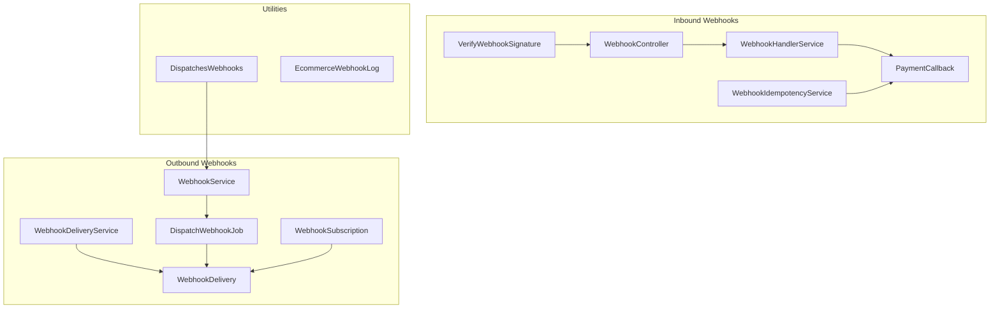
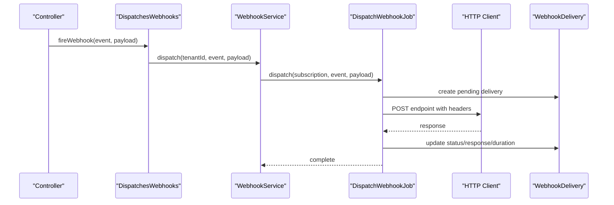
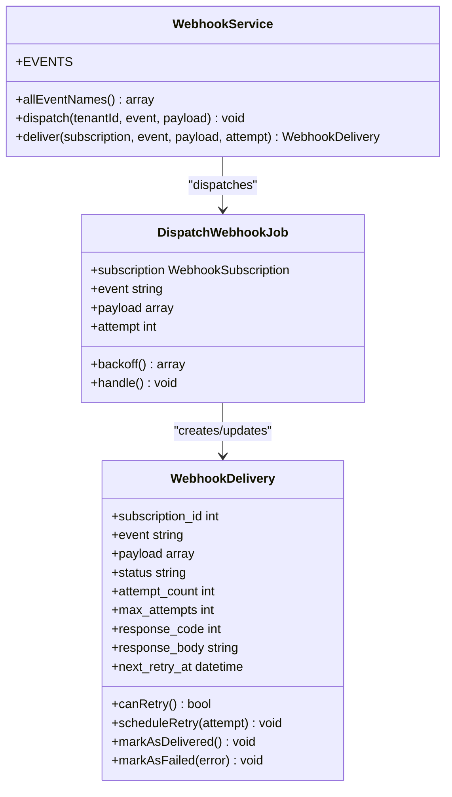
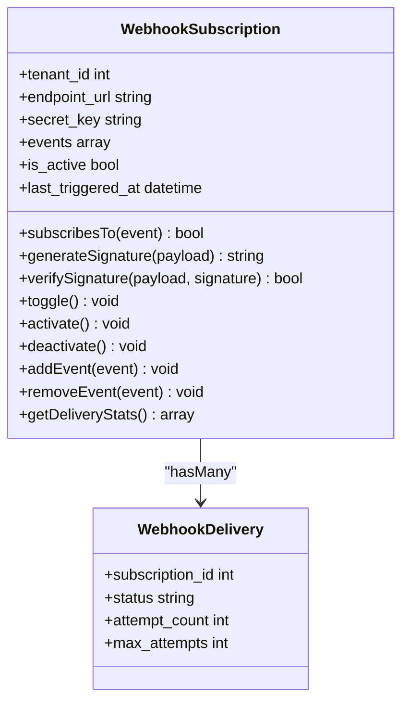
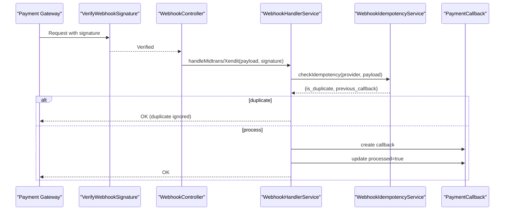
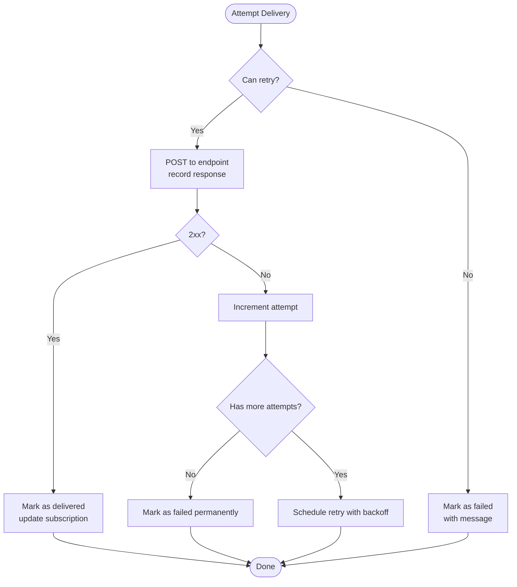
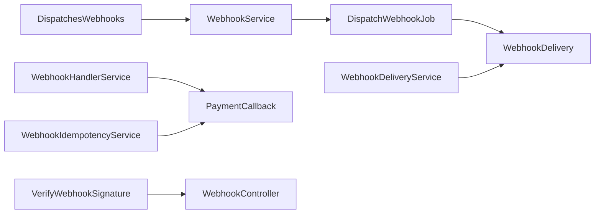

# Webhook Monitoring & Logging

<cite>
**Referenced Files in This Document**
- [WebhookService.php](file://app/Services/WebhookService.php)
- [WebhookHandlerService.php](file://app/Services/WebhookHandlerService.php)
- [WebhookIdempotencyService.php](file://app/Services/WebhookIdempotencyService.php)
- [WebhookDeliveryService.php](file://app/Services/Integrations/WebhookDeliveryService.php)
- [WebhookSubscription.php](file://app/Models/WebhookSubscription.php)
- [WebhookDelivery.php](file://app/Models/WebhookDelivery.php)
- [DispatchWebhookJob.php](file://app/Jobs/DispatchWebhookJob.php)
- [VerifyWebhookSignature.php](file://app/Http/Middleware/VerifyWebhookSignature.php)
- [WebhookController.php](file://app/Http/Controllers/Integrations/WebhookController.php)
- [WebhookTestController.php](file://app/Http/Controllers/Api/WebhookTestController.php)
- [DispatchesWebhooks.php](file://app/Traits/DispatchesWebhooks.php)
- [PaymentCallback.php](file://app/Models/PaymentCallback.php)
- [EcommerceWebhookLog.php](file://app/Models/EcommerceWebhookLog.php)
</cite>

## Table of Contents
1. [Introduction](#introduction)
2. [Project Structure](#project-structure)
3. [Core Components](#core-components)
4. [Architecture Overview](#architecture-overview)
5. [Detailed Component Analysis](#detailed-component-analysis)
6. [Dependency Analysis](#dependency-analysis)
7. [Performance Considerations](#performance-considerations)
8. [Troubleshooting Guide](#troubleshooting-guide)
9. [Conclusion](#conclusion)
10. [Appendices](#appendices)

## Introduction
This document explains the webhook monitoring, logging, and debugging systems in the codebase. It covers:
- Outbound webhook delivery pipeline and retry logic
- Event tracking and subscription management
- Inbound payment webhook handling and idempotency
- Logging and metrics for delivery and processing
- Debugging tools and troubleshooting procedures

## Project Structure
The webhook system spans services, models, jobs, middleware, controllers, and traits:
- Outbound webhooks: service, job, model, and delivery service
- Inbound webhooks: handler service, idempotency service, middleware, and controller
- Shared utilities: trait for firing webhooks and models for logs

**Diagram sources**
- [WebhookService.php:11-189](file://app/Services/WebhookService.php#L11-L189)
- [WebhookDeliveryService.php:17-369](file://app/Services/Integrations/WebhookDeliveryService.php#L17-L369)
- [DispatchWebhookJob.php:15-131](file://app/Jobs/DispatchWebhookJob.php#L15-L131)
- [WebhookSubscription.php:8-160](file://app/Models/WebhookSubscription.php#L8-L160)
- [WebhookDelivery.php:8-179](file://app/Models/WebhookDelivery.php#L8-L179)
- [WebhookHandlerService.php:12-442](file://app/Services/WebhookHandlerService.php#L12-L442)
- [WebhookIdempotencyService.php:20-283](file://app/Services/WebhookIdempotencyService.php#L20-L283)
- [VerifyWebhookSignature.php:14-60](file://app/Http/Middleware/VerifyWebhookSignature.php#L14-L60)
- [WebhookController.php:12-175](file://app/Http/Controllers/Integrations/WebhookController.php#L12-L175)
- [PaymentCallback.php:10-86](file://app/Models/PaymentCallback.php#L10-L86)
- [DispatchesWebhooks.php:13-26](file://app/Traits/DispatchesWebhooks.php#L13-L26)
- [EcommerceWebhookLog.php:9-42](file://app/Models/EcommerceWebhookLog.php#L9-L42)

**Section sources**
- [WebhookService.php:11-189](file://app/Services/WebhookService.php#L11-L189)
- [WebhookDeliveryService.php:17-369](file://app/Services/Integrations/WebhookDeliveryService.php#L17-L369)
- [DispatchWebhookJob.php:15-131](file://app/Jobs/DispatchWebhookJob.php#L15-L131)
- [WebhookSubscription.php:8-160](file://app/Models/WebhookSubscription.php#L8-L160)
- [WebhookDelivery.php:8-179](file://app/Models/WebhookDelivery.php#L8-L179)
- [WebhookHandlerService.php:12-442](file://app/Services/WebhookHandlerService.php#L12-L442)
- [WebhookIdempotencyService.php:20-283](file://app/Services/WebhookIdempotencyService.php#L20-L283)
- [VerifyWebhookSignature.php:14-60](file://app/Http/Middleware/VerifyWebhookSignature.php#L14-L60)
- [WebhookController.php:12-175](file://app/Http/Controllers/Integrations/WebhookController.php#L12-L175)
- [PaymentCallback.php:10-86](file://app/Models/PaymentCallback.php#L10-L86)
- [DispatchesWebhooks.php:13-26](file://app/Traits/DispatchesWebhooks.php#L13-L26)
- [EcommerceWebhookLog.php:9-42](file://app/Models/EcommerceWebhookLog.php#L9-L42)

## Core Components
- Outbound delivery orchestration and retry:
  - WebhookService: event catalog, dispatch to subscriptions, synchronous delivery
  - WebhookDeliveryService: retry/backoff, delivery tracking, stats
  - DispatchWebhookJob: queued delivery with exponential backoff and auto-disable on persistent failure
  - WebhookSubscription and WebhookDelivery: persistence and scopes for filtering and stats
- Inbound payment webhooks and idempotency:
  - WebhookHandlerService: handles provider-specific payloads, updates transactions/orders, and retries
  - WebhookIdempotencyService: prevents duplicates and replay attacks
  - VerifyWebhookSignature middleware and WebhookController: signature verification and routing
  - PaymentCallback: inbound payload logging and processing state
- Utilities:
  - DispatchesWebhooks trait: convenient event firing from controllers
  - EcommerceWebhookLog: marketplace/webflow-style inbound logging

**Section sources**
- [WebhookService.php:16-189](file://app/Services/WebhookService.php#L16-L189)
- [WebhookDeliveryService.php:37-369](file://app/Services/Integrations/WebhookDeliveryService.php#L37-L369)
- [DispatchWebhookJob.php:40-131](file://app/Jobs/DispatchWebhookJob.php#L40-L131)
- [WebhookSubscription.php:41-160](file://app/Models/WebhookSubscription.php#L41-L160)
- [WebhookDelivery.php:42-179](file://app/Models/WebhookDelivery.php#L42-L179)
- [WebhookHandlerService.php:24-442](file://app/Services/WebhookHandlerService.php#L24-L442)
- [WebhookIdempotencyService.php:40-283](file://app/Services/WebhookIdempotencyService.php#L40-L283)
- [VerifyWebhookSignature.php:16-60](file://app/Http/Middleware/VerifyWebhookSignature.php#L16-L60)
- [WebhookController.php:17-175](file://app/Http/Controllers/Integrations/WebhookController.php#L17-L175)
- [PaymentCallback.php:46-86](file://app/Models/PaymentCallback.php#L46-L86)
- [DispatchesWebhooks.php:15-26](file://app/Traits/DispatchesWebhooks.php#L15-L26)
- [EcommerceWebhookLog.php:12-42](file://app/Models/EcommerceWebhookLog.php#L12-L42)

## Architecture Overview
End-to-end flow for outbound and inbound webhooks:

**Diagram sources**
- [DispatchesWebhooks.php:15-26](file://app/Traits/DispatchesWebhooks.php#L15-L26)
- [WebhookService.php:102-112](file://app/Services/WebhookService.php#L102-L112)
- [DispatchWebhookJob.php:40-118](file://app/Jobs/DispatchWebhookJob.php#L40-L118)
- [WebhookDelivery.php:12-30](file://app/Models/WebhookDelivery.php#L12-L30)

## Detailed Component Analysis

### Outbound Webhook Delivery Pipeline
- Event catalog and dispatch:
  - WebhookService maintains a structured list of supported events and dispatches to active subscriptions listening to a given event.
- Queued delivery:
  - DispatchWebhookJob builds the payload, sets headers (including signature when secret is present), records a pending delivery, sends the HTTP request, updates status, and triggers retry on non-2xx responses.
- Retry and backoff:
  - Exponential backoff delays are defined in the job’s backoff schedule. Persistent failures increment a retry counter; after a threshold, the subscription is auto-disabled.
- Delivery tracking:
  - WebhookDelivery persists per-delivery metadata (status, response code/body, attempts, timestamps) and exposes scopes and helpers for retry scheduling and success checks.

**Diagram sources**
- [WebhookService.php:16-189](file://app/Services/WebhookService.php#L16-L189)
- [DispatchWebhookJob.php:23-131](file://app/Jobs/DispatchWebhookJob.php#L23-L131)
- [WebhookDelivery.php:12-179](file://app/Models/WebhookDelivery.php#L12-L179)

**Section sources**
- [WebhookService.php:16-189](file://app/Services/WebhookService.php#L16-L189)
- [DispatchWebhookJob.php:40-131](file://app/Jobs/DispatchWebhookJob.php#L40-L131)
- [WebhookDelivery.php:72-179](file://app/Models/WebhookDelivery.php#L72-L179)

### Subscription Management and Endpoint Configuration
- WebhookSubscription stores endpoint URL, secret, subscribed events, activation status, and last-triggered timestamp. It supports adding/removing events, toggling activation, and generating/verifying signatures.
- Delivery statistics are computed via scopes and helper methods.

**Diagram sources**
- [WebhookSubscription.php:12-160](file://app/Models/WebhookSubscription.php#L12-L160)
- [WebhookDelivery.php:12-38](file://app/Models/WebhookDelivery.php#L12-L38)

**Section sources**
- [WebhookSubscription.php:41-160](file://app/Models/WebhookSubscription.php#L41-L160)
- [WebhookDelivery.php:42-179](file://app/Models/WebhookDelivery.php#L42-L179)

### Inbound Payment Webhook Handling and Idempotency
- WebhookHandlerService processes provider-specific payloads (e.g., Midtrans/Xendit), verifies signatures when configured, maps statuses to internal states, updates payment and sales orders, and marks callbacks processed.
- WebhookIdempotencyService ensures idempotent processing by generating idempotency keys from event IDs, order/status/amount combinations, or payload hashes, and caches duplicate detection to prevent race conditions.
- VerifyWebhookSignature middleware validates incoming requests from supported gateways.
- WebhookController routes and verifies Shopify/WooCommerce webhooks and delegates to connectors.

**Diagram sources**
- [VerifyWebhookSignature.php:16-60](file://app/Http/Middleware/VerifyWebhookSignature.php#L16-L60)
- [WebhookController.php:17-175](file://app/Http/Controllers/Integrations/WebhookController.php#L17-L175)
- [WebhookHandlerService.php:24-151](file://app/Services/WebhookHandlerService.php#L24-151)
- [WebhookIdempotencyService.php:40-117](file://app/Services/WebhookIdempotencyService.php#L40-L117)
- [PaymentCallback.php:46-86](file://app/Models/PaymentCallback.php#L46-L86)

**Section sources**
- [WebhookHandlerService.php:24-442](file://app/Services/WebhookHandlerService.php#L24-L442)
- [WebhookIdempotencyService.php:40-283](file://app/Services/WebhookIdempotencyService.php#L40-L283)
- [VerifyWebhookSignature.php:16-60](file://app/Http/Middleware/VerifyWebhookSignature.php#L16-L60)
- [WebhookController.php:17-175](file://app/Http/Controllers/Integrations/WebhookController.php#L17-L175)
- [PaymentCallback.php:46-86](file://app/Models/PaymentCallback.php#L46-L86)

### Delivery History Tracking and Metrics
- WebhookDeliveryService provides:
  - Immediate delivery attempt and response recording
  - Retry scheduling with exponential backoff
  - Statistics aggregation for a subscription (counts and success rate)
  - Recent deliveries listing with endpoint and integration info
- WebhookService delivers synchronously for test ping and legacy compatibility, capturing duration and response metadata.

**Diagram sources**
- [WebhookDeliveryService.php:62-136](file://app/Services/Integrations/WebhookDeliveryService.php#L62-L136)
- [WebhookDelivery.php:72-147](file://app/Models/WebhookDelivery.php#L72-L147)

**Section sources**
- [WebhookDeliveryService.php:143-369](file://app/Services/Integrations/WebhookDeliveryService.php#L143-L369)
- [WebhookService.php:117-187](file://app/Services/WebhookService.php#L117-L187)
- [WebhookDelivery.php:149-179](file://app/Models/WebhookDelivery.php#L149-L179)

### Debugging Tools and Testing
- WebhookTestController:
  - Generates test payloads for providers and invokes handlers for validation
  - Retrieves callback history with filters
  - Retries failed callbacks programmatically
  - Provides statistics on callbacks by provider and recent failures
- WebhookController includes a generic test endpoint for integrations.

**Section sources**
- [WebhookTestController.php:15-164](file://app/Http/Controllers/Api/WebhookTestController.php#L15-L164)
- [WebhookController.php:162-175](file://app/Http/Controllers/Integrations/WebhookController.php#L162-L175)

## Dependency Analysis
- Cohesion:
  - WebhookService and DispatchWebhookJob encapsulate outbound delivery concerns
  - WebhookHandlerService and WebhookIdempotencyService encapsulate inbound processing and idempotency
- Coupling:
  - Jobs depend on models and HTTP client
  - Handlers depend on models and external provider specifics
  - Middleware depends on configuration and request headers
- External dependencies:
  - HTTP client for outbound requests
  - Cache for idempotency short-term duplicate detection

**Diagram sources**
- [WebhookService.php:102-112](file://app/Services/WebhookService.php#L102-L112)
- [DispatchWebhookJob.php:68-118](file://app/Jobs/DispatchWebhookJob.php#L68-L118)
- [WebhookDeliveryService.php:37-136](file://app/Services/Integrations/WebhookDeliveryService.php#L37-L136)
- [WebhookHandlerService.php:46-133](file://app/Services/WebhookHandlerService.php#L46-L133)
- [WebhookIdempotencyService.php:102-117](file://app/Services/WebhookIdempotencyService.php#L102-L117)
- [VerifyWebhookSignature.php:16-33](file://app/Http/Middleware/VerifyWebhookSignature.php#L16-L33)
- [WebhookController.php:17-66](file://app/Http/Controllers/Integrations/WebhookController.php#L17-L66)
- [DispatchesWebhooks.php:23](file://app/Traits/DispatchesWebhooks.php#L23)

**Section sources**
- [WebhookService.php:102-189](file://app/Services/WebhookService.php#L102-L189)
- [DispatchWebhookJob.php:68-131](file://app/Jobs/DispatchWebhookJob.php#L68-L131)
- [WebhookDeliveryService.php:37-369](file://app/Services/Integrations/WebhookDeliveryService.php#L37-L369)
- [WebhookHandlerService.php:46-442](file://app/Services/WebhookHandlerService.php#L46-L442)
- [WebhookIdempotencyService.php:102-283](file://app/Services/WebhookIdempotencyService.php#L102-L283)
- [VerifyWebhookSignature.php:16-60](file://app/Http/Middleware/VerifyWebhookSignature.php#L16-L60)
- [WebhookController.php:17-175](file://app/Http/Controllers/Integrations/WebhookController.php#L17-L175)
- [DispatchesWebhooks.php:15-26](file://app/Traits/DispatchesWebhooks.php#L15-L26)

## Performance Considerations
- Asynchronous delivery:
  - Outbound webhooks are queued to avoid blocking requests and to leverage retry/backoff
- Timeouts and backoff:
  - HTTP timeouts and connection timeouts are set in jobs/services
  - Exponential backoff reduces load on failing endpoints
- Idempotency caching:
  - Short-term cache prevents duplicate processing and race conditions for inbound webhooks
- Metrics and visibility:
  - Delivery records capture response codes, durations, and retry counts for observability

[No sources needed since this section provides general guidance]

## Troubleshooting Guide
Common issues and resolutions:
- Signature verification failures (inbound):
  - Ensure webhook secrets are configured and signatures match computed values
  - Check middleware and controller verification logic
- Duplicate processing (inbound):
  - Confirm idempotency keys are generated and cached; inspect previous callbacks
- Delivery failures (outbound):
  - Review delivery logs for response codes and messages
  - Inspect retry scheduling and subscription auto-disable thresholds
- Endpoint misconfiguration:
  - Validate subscription URLs, secrets, and event filters
- Testing:
  - Use test endpoints/controllers to simulate payloads and inspect outcomes

**Section sources**
- [VerifyWebhookSignature.php:16-60](file://app/Http/Middleware/VerifyWebhookSignature.php#L16-L60)
- [WebhookController.php:17-175](file://app/Http/Controllers/Integrations/WebhookController.php#L17-L175)
- [WebhookIdempotencyService.php:40-117](file://app/Services/WebhookIdempotencyService.php#L40-L117)
- [DispatchWebhookJob.php:120-131](file://app/Jobs/DispatchWebhookJob.php#L120-L131)
- [WebhookDelivery.php:103-112](file://app/Models/WebhookDelivery.php#L103-L112)
- [WebhookTestController.php:15-164](file://app/Http/Controllers/Api/WebhookTestController.php#L15-L164)

## Conclusion
The webhook system combines robust outbound delivery with retry/backoff, comprehensive inbound processing and idempotency, and strong observability through logs and metrics. The modular design enables easy subscription management, endpoint configuration, and debugging.

[No sources needed since this section summarizes without analyzing specific files]

## Appendices

### Webhook Log Structure and Fields
- Outbound delivery log (WebhookDelivery):
  - Identifiers: subscription_id, event, payload
  - Status: pending, delivered, failed
  - Attempts: attempt_count, max_attempts, next_retry_at
  - Response: response_code, response_body, duration_ms
  - Timestamps: created_at, delivered_at
- Inbound callback log (PaymentCallback):
  - Identifiers: tenant_id, payment_transaction_id, gateway_provider
  - Payload and signature: payload (JSON), signature
  - State: verified, processed, processed_at, error_message
- E-commerce webhook log (EcommerceWebhookLog):
  - Identifiers: tenant_id, channel_id, platform
  - Event and payload: event_type, payload (JSON)
  - Validation: is_valid, processed_at, error_message

**Section sources**
- [WebhookDelivery.php:12-30](file://app/Models/WebhookDelivery.php#L12-L30)
- [PaymentCallback.php:13-33](file://app/Models/PaymentCallback.php#L13-L33)
- [EcommerceWebhookLog.php:12-28](file://app/Models/EcommerceWebhookLog.php#L12-L28)

### Event Catalog (Outbound)
Supported outbound events are grouped by domain. Use these names when subscribing or firing webhooks.

**Section sources**
- [WebhookService.php:16-83](file://app/Services/WebhookService.php#L16-L83)

### Delivery Status Monitoring and Retry Behavior
- Status transitions: pending → delivered (2xx) or failed (non-2xx or exceptions)
- Retry scheduling: exponential backoff with max attempts
- Auto-disable: subscriptions disabled after excessive consecutive failures
- Stats: counts and success rates per subscription

**Section sources**
- [DispatchWebhookJob.php:98-129](file://app/Jobs/DispatchWebhookJob.php#L98-L129)
- [WebhookDelivery.php:103-147](file://app/Models/WebhookDelivery.php#L103-L147)
- [WebhookDeliveryService.php:103-136](file://app/Services/Integrations/WebhookDeliveryService.php#L103-L136)

### Subscription Management Operations
- Add/remove events, toggle activation, compute delivery stats
- Generate and verify signatures for outbound requests

**Section sources**
- [WebhookSubscription.php:67-160](file://app/Models/WebhookSubscription.php#L67-L160)

### Inbound Webhook Processing Flow
- Signature verification
- Idempotency check and caching
- Payload extraction and transaction lookup
- Status mapping and order updates
- Callback marking as processed

**Section sources**
- [WebhookHandlerService.php:24-151](file://app/Services/WebhookHandlerService.php#L24-L151)
- [WebhookIdempotencyService.php:40-117](file://app/Services/WebhookIdempotencyService.php#L40-L117)