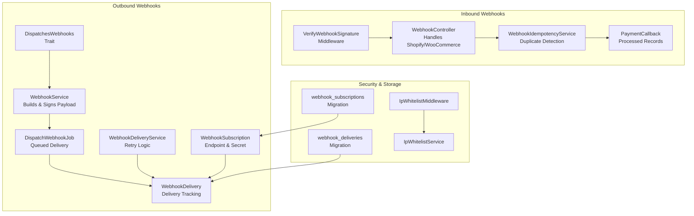
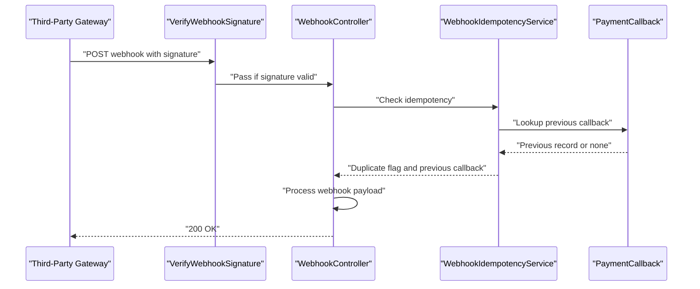
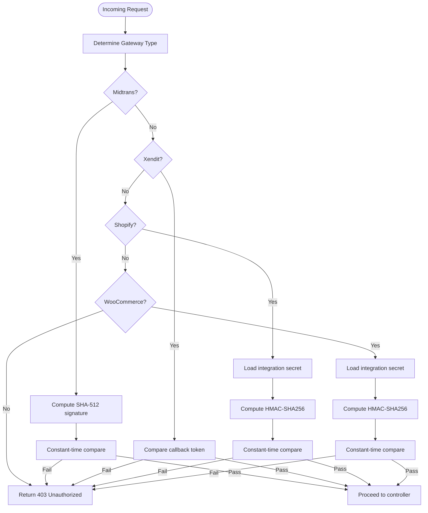
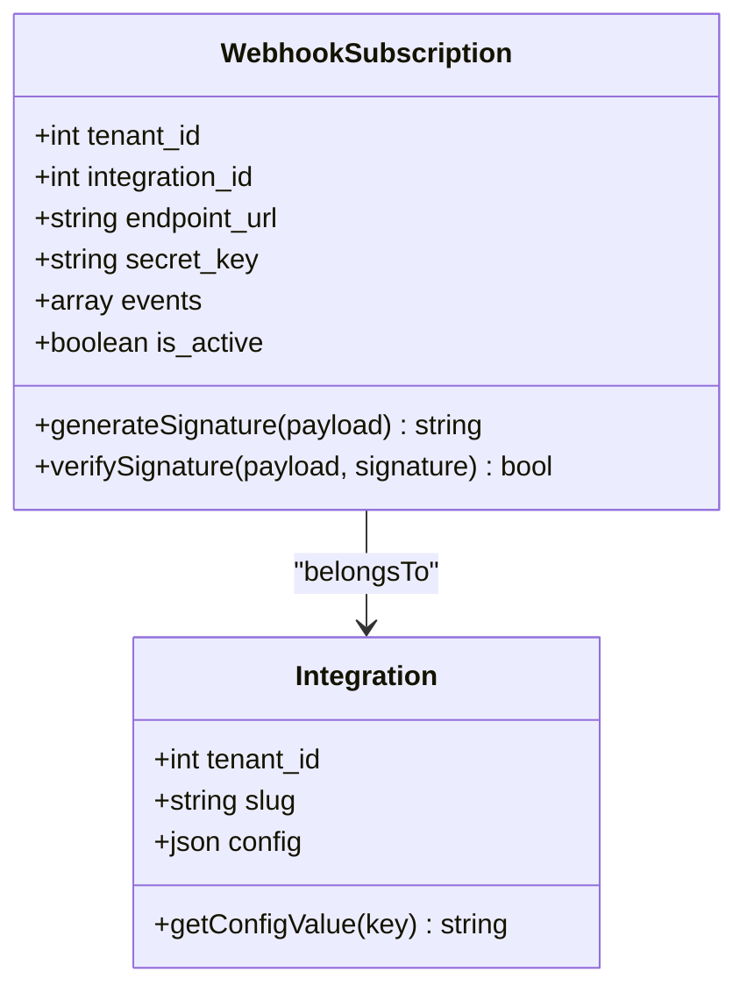
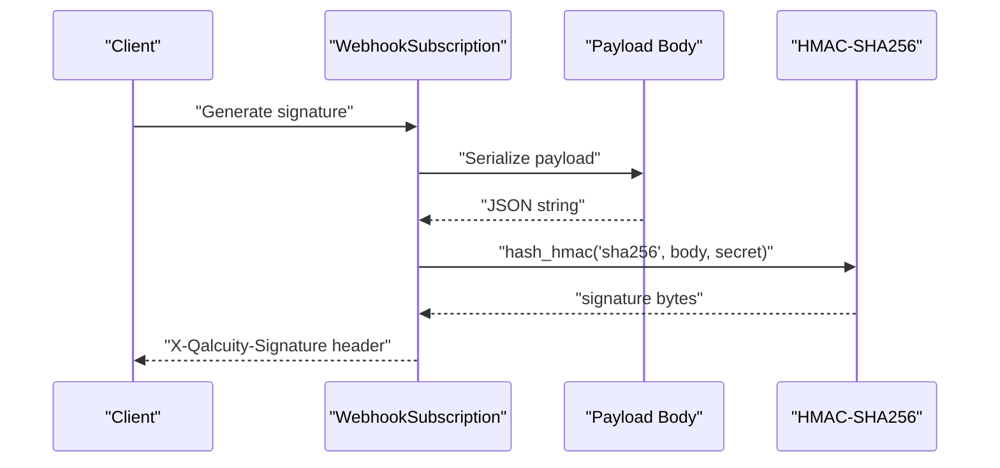
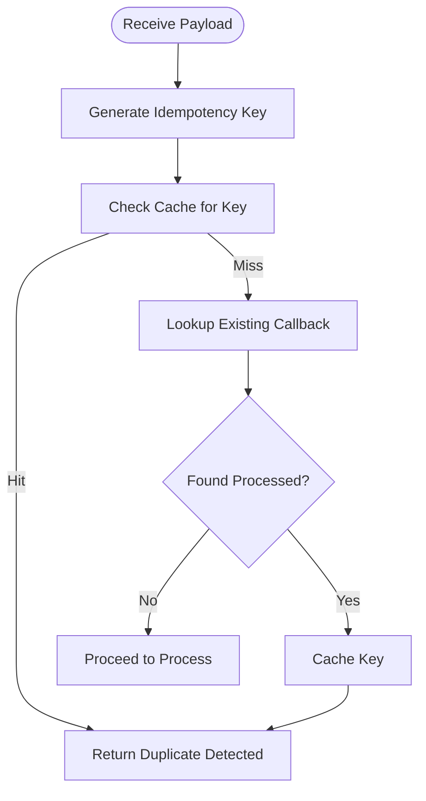
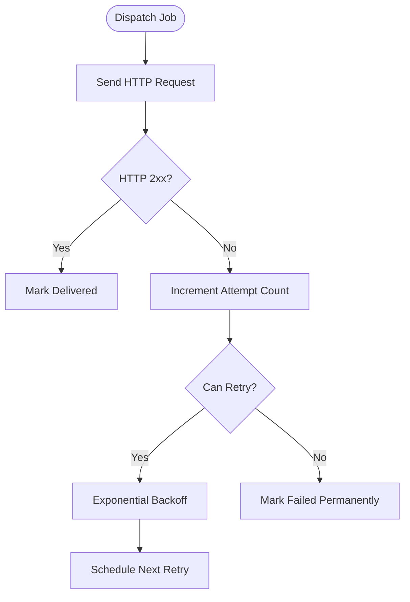
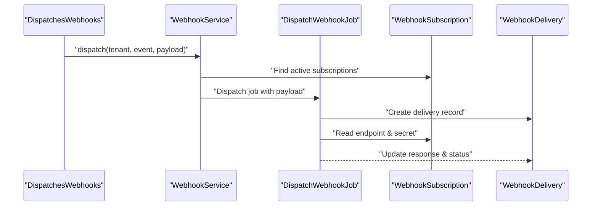
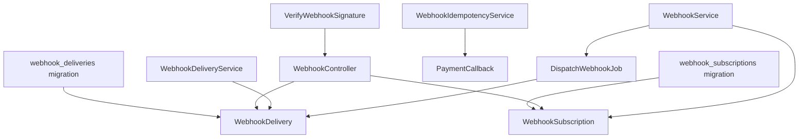

# Webhook Security & Authentication

<cite>
**Referenced Files in This Document**
- [VerifyWebhookSignature.php](file://app/Http/Middleware/VerifyWebhookSignature.php)
- [WebhookController.php](file://app/Http/Controllers/Integrations/WebhookController.php)
- [WebhookService.php](file://app/Services/WebhookService.php)
- [WebhookIdempotencyService.php](file://app/Services/WebhookIdempotencyService.php)
- [WebhookDeliveryService.php](file://app/Services/Integrations/WebhookDeliveryService.php)
- [DispatchWebhookJob.php](file://app/Jobs/DispatchWebhookJob.php)
- [WebhookSubscription.php](file://app/Models/WebhookSubscription.php)
- [WebhookDelivery.php](file://app/Models/WebhookDelivery.php)
- [PaymentCallback.php](file://app/Models/PaymentCallback.php)
- [DispatchesWebhooks.php](file://app/Traits/DispatchesWebhooks.php)
- [2026_04_08_000013_create_webhook_subscriptions_table.php](file://database/migrations/2026_04_08_000013_create_webhook_subscriptions_table.php)
- [2026_04_08_000014_create_webhook_deliveries_table.php](file://database/migrations/2026_04_08_000014_create_webhook_deliveries_table.php)
- [IpWhitelistMiddleware.php](file://app/Http/Middleware/IpWhitelistMiddleware.php)
- [IpWhitelistService.php](file://app/Services/Security/IpWhitelistService.php)
</cite>

## Table of Contents
1. [Introduction](#introduction)
2. [Project Structure](#project-structure)
3. [Core Components](#core-components)
4. [Architecture Overview](#architecture-overview)
5. [Detailed Component Analysis](#detailed-component-analysis)
6. [Dependency Analysis](#dependency-analysis)
7. [Performance Considerations](#performance-considerations)
8. [Troubleshooting Guide](#troubleshooting-guide)
9. [Conclusion](#conclusion)

## Introduction
This document provides comprehensive documentation for webhook security and authentication mechanisms within the system. It covers signature verification using HMAC-SHA256, webhook secret management, cryptographic validation processes, idempotency handling, duplicate detection, retry mechanisms, and operational safeguards such as rate limiting, IP whitelisting, and endpoint protection. The goal is to help both developers and operators understand how the system secures inbound and outbound webhooks, validates authenticity, prevents replay/duplicate processing, and maintains reliability through robust retry policies.

## Project Structure
The webhook security implementation spans middleware, controllers, services, jobs, models, traits, and database migrations. The structure supports:
- Inbound webhook verification for third-party integrations (Shopify, WooCommerce, payment gateways)
- Outbound webhook delivery with HMAC signing and retry logic
- Idempotency to prevent duplicate processing
- Delivery tracking and retry scheduling
- Tenant-scoped configuration and storage

**Diagram sources**
- [VerifyWebhookSignature.php:1-60](file://app/Http/Middleware/VerifyWebhookSignature.php#L1-L60)
- [WebhookController.php:1-175](file://app/Http/Controllers/Integrations/WebhookController.php#L1-L175)
- [WebhookIdempotencyService.php:1-283](file://app/Services/WebhookIdempotencyService.php#L1-L283)
- [PaymentCallback.php:1-86](file://app/Models/PaymentCallback.php#L1-L86)
- [DispatchesWebhooks.php:1-26](file://app/Traits/DispatchesWebhooks.php#L1-L26)
- [WebhookService.php:1-189](file://app/Services/WebhookService.php#L1-L189)
- [DispatchWebhookJob.php:1-131](file://app/Jobs/DispatchWebhookJob.php#L1-L131)
- [WebhookDeliveryService.php:1-369](file://app/Services/Integrations/WebhookDeliveryService.php#L1-L369)
- [WebhookSubscription.php:1-160](file://app/Models/WebhookSubscription.php#L1-L160)
- [WebhookDelivery.php:1-179](file://app/Models/WebhookDelivery.php#L1-L179)
- [2026_04_08_000013_create_webhook_subscriptions_table.php:1-39](file://database/migrations/2026_04_08_000013_create_webhook_subscriptions_table.php#L1-L39)
- [2026_04_08_000014_create_webhook_deliveries_table.php:1-44](file://database/migrations/2026_04_08_000014_create_webhook_deliveries_table.php#L1-L44)
- [IpWhitelistMiddleware.php:1-43](file://app/Http/Middleware/IpWhitelistMiddleware.php#L1-L43)
- [IpWhitelistService.php:1-41](file://app/Services/Security/IpWhitelistService.php#L1-L41)

**Section sources**
- [VerifyWebhookSignature.php:1-60](file://app/Http/Middleware/VerifyWebhookSignature.php#L1-L60)
- [WebhookController.php:1-175](file://app/Http/Controllers/Integrations/WebhookController.php#L1-L175)
- [WebhookService.php:1-189](file://app/Services/WebhookService.php#L1-L189)
- [WebhookIdempotencyService.php:1-283](file://app/Services/WebhookIdempotencyService.php#L1-L283)
- [WebhookDeliveryService.php:1-369](file://app/Services/Integrations/WebhookDeliveryService.php#L1-L369)
- [DispatchWebhookJob.php:1-131](file://app/Jobs/DispatchWebhookJob.php#L1-L131)
- [WebhookSubscription.php:1-160](file://app/Models/WebhookSubscription.php#L1-L160)
- [WebhookDelivery.php:1-179](file://app/Models/WebhookDelivery.php#L1-L179)
- [2026_04_08_000013_create_webhook_subscriptions_table.php:1-39](file://database/migrations/2026_04_08_000013_create_webhook_subscriptions_table.php#L1-L39)
- [2026_04_08_000014_create_webhook_deliveries_table.php:1-44](file://database/migrations/2026_04_08_000014_create_webhook_deliveries_table.php#L1-L44)
- [IpWhitelistMiddleware.php:1-43](file://app/Http/Middleware/IpWhitelistMiddleware.php#L1-L43)
- [IpWhitelistService.php:1-41](file://app/Services/Security/IpWhitelistService.php#L1-L41)

## Core Components
- Inbound signature verification middleware for payment gateways and integration platforms
- Integration controller for Shopify and WooCommerce with HMAC verification
- Outbound webhook service that signs payloads and manages retries
- Idempotency service to prevent replay/duplicate processing
- Delivery service and job for asynchronous delivery with exponential backoff
- Models for subscriptions, deliveries, and payment callbacks
- IP whitelisting middleware and service for endpoint protection

**Section sources**
- [VerifyWebhookSignature.php:1-60](file://app/Http/Middleware/VerifyWebhookSignature.php#L1-L60)
- [WebhookController.php:1-175](file://app/Http/Controllers/Integrations/WebhookController.php#L1-L175)
- [WebhookService.php:1-189](file://app/Services/WebhookService.php#L1-L189)
- [WebhookIdempotencyService.php:1-283](file://app/Services/WebhookIdempotencyService.php#L1-L283)
- [WebhookDeliveryService.php:1-369](file://app/Services/Integrations/WebhookDeliveryService.php#L1-L369)
- [DispatchWebhookJob.php:1-131](file://app/Jobs/DispatchWebhookJob.php#L1-L131)
- [WebhookSubscription.php:1-160](file://app/Models/WebhookSubscription.php#L1-L160)
- [WebhookDelivery.php:1-179](file://app/Models/WebhookDelivery.php#L1-L179)
- [PaymentCallback.php:1-86](file://app/Models/PaymentCallback.php#L1-L86)
- [IpWhitelistMiddleware.php:1-43](file://app/Http/Middleware/IpWhitelistMiddleware.php#L1-L43)
- [IpWhitelistService.php:1-41](file://app/Services/Security/IpWhitelistService.php#L1-L41)

## Architecture Overview
The system implements a layered approach to webhook security:
- Inbound: Middleware and controllers validate signatures and enforce IP whitelisting where applicable
- Processing: Idempotency service ensures each event is processed once
- Outbound: Signed payloads are queued for delivery with retry logic and exponential backoff
- Persistence: Subscriptions and deliveries are tracked in dedicated tables with indexes for performance

**Diagram sources**
- [VerifyWebhookSignature.php:1-60](file://app/Http/Middleware/VerifyWebhookSignature.php#L1-L60)
- [WebhookController.php:1-175](file://app/Http/Controllers/Integrations/WebhookController.php#L1-L175)
- [WebhookIdempotencyService.php:1-283](file://app/Services/WebhookIdempotencyService.php#L1-L283)
- [PaymentCallback.php:1-86](file://app/Models/PaymentCallback.php#L1-L86)

## Detailed Component Analysis

### Inbound Webhook Signature Verification
- Middleware supports payment gateway signatures (Midtrans, Xendit) and integration signatures (Shopify, WooCommerce).
- Uses constant-time comparison to avoid timing attacks.
- Logs unauthorized attempts for monitoring.

**Diagram sources**
- [VerifyWebhookSignature.php:1-60](file://app/Http/Middleware/VerifyWebhookSignature.php#L1-L60)
- [WebhookController.php:1-175](file://app/Http/Controllers/Integrations/WebhookController.php#L1-L175)

**Section sources**
- [VerifyWebhookSignature.php:1-60](file://app/Http/Middleware/VerifyWebhookSignature.php#L1-L60)
- [WebhookController.php:1-175](file://app/Http/Controllers/Integrations/WebhookController.php#L1-L175)

### Webhook Secret Management
- Secrets are stored per integration and retrieved dynamically for signature verification.
- Outbound subscriptions store secrets to sign payloads.
- Best practice: rotate secrets periodically and invalidate old ones.

**Diagram sources**
- [WebhookSubscription.php:1-160](file://app/Models/WebhookSubscription.php#L1-L160)
- [WebhookController.php:1-175](file://app/Http/Controllers/Integrations/WebhookController.php#L1-L175)

**Section sources**
- [WebhookSubscription.php:1-160](file://app/Models/WebhookSubscription.php#L1-L160)
- [WebhookController.php:1-175](file://app/Http/Controllers/Integrations/WebhookController.php#L1-L175)

### Cryptographic Validation Processes
- HMAC-SHA256 is used for Shopify and WooCommerce signatures.
- Outbound HMAC-SHA256 includes body content for integrity and authenticity.
- Constant-time comparisons prevent timing attacks.

**Diagram sources**
- [WebhookSubscription.php:74-88](file://app/Models/WebhookSubscription.php#L74-L88)
- [DispatchWebhookJob.php:64-66](file://app/Jobs/DispatchWebhookJob.php#L64-L66)
- [WebhookService.php:141-145](file://app/Services/WebhookService.php#L141-L145)

**Section sources**
- [WebhookSubscription.php:74-88](file://app/Models/WebhookSubscription.php#L74-L88)
- [DispatchWebhookJob.php:64-66](file://app/Jobs/DispatchWebhookJob.php#L64-L66)
- [WebhookService.php:141-145](file://app/Services/WebhookService.php#L141-L145)

### Idempotency Handling and Duplicate Detection
- Idempotency keys are generated using gateway event IDs, order/status combinations, or payload hashes.
- Cache-first strategy prevents race conditions; database lookup provides persistence.
- Duplicate detection returns the previous callback for correlation.

**Diagram sources**
- [WebhookIdempotencyService.php:40-93](file://app/Services/WebhookIdempotencyService.php#L40-L93)
- [PaymentCallback.php:1-86](file://app/Models/PaymentCallback.php#L1-L86)

**Section sources**
- [WebhookIdempotencyService.php:1-283](file://app/Services/WebhookIdempotencyService.php#L1-L283)
- [PaymentCallback.php:1-86](file://app/Models/PaymentCallback.php#L1-L86)

### Retry Mechanisms and Failure Handling
- Outbound delivery uses exponential backoff with bounded delays.
- Queued job handles retries automatically; subscription disabled after excessive failures.
- Delivery records track attempts, next retry time, and error messages.

**Diagram sources**
- [DispatchWebhookJob.php:35-38](file://app/Jobs/DispatchWebhookJob.php#L35-L38)
- [DispatchWebhookJob.php:98-117](file://app/Jobs/DispatchWebhookJob.php#L98-L117)
- [WebhookDelivery.php:103-112](file://app/Models/WebhookDelivery.php#L103-L112)
- [WebhookDelivery.php:72-75](file://app/Models/WebhookDelivery.php#L72-L75)

**Section sources**
- [DispatchWebhookJob.php:1-131](file://app/Jobs/DispatchWebhookJob.php#L1-L131)
- [WebhookDelivery.php:1-179](file://app/Models/WebhookDelivery.php#L1-L179)

### Webhook Delivery System
- Outbound service builds signed payloads with replay protection headers.
- Jobs enqueue deliveries; delivery service coordinates retries and statistics.
- Subscriptions define endpoints, events, and secrets; deliveries track outcomes.

**Diagram sources**
- [DispatchesWebhooks.php:1-26](file://app/Traits/DispatchesWebhooks.php#L1-L26)
- [WebhookService.php:102-112](file://app/Services/WebhookService.php#L102-L112)
- [DispatchWebhookJob.php:40-118](file://app/Jobs/DispatchWebhookJob.php#L40-L118)
- [WebhookSubscription.php:1-160](file://app/Models/WebhookSubscription.php#L1-L160)
- [WebhookDelivery.php:1-179](file://app/Models/WebhookDelivery.php#L1-L179)

**Section sources**
- [DispatchesWebhooks.php:1-26](file://app/Traits/DispatchesWebhooks.php#L1-L26)
- [WebhookService.php:1-189](file://app/Services/WebhookService.php#L1-L189)
- [DispatchWebhookJob.php:1-131](file://app/Jobs/DispatchWebhookJob.php#L1-L131)
- [WebhookSubscription.php:1-160](file://app/Models/WebhookSubscription.php#L1-L160)
- [WebhookDelivery.php:1-179](file://app/Models/WebhookDelivery.php#L1-L179)

### Security Best Practices
- Always verify signatures using constant-time comparisons.
- Enforce IP whitelisting for sensitive endpoints.
- Rotate secrets regularly and maintain audit logs.
- Limit payload sizes and sanitize inputs.
- Use HTTPS-only endpoints and secure storage for secrets.

**Section sources**
- [VerifyWebhookSignature.php:1-60](file://app/Http/Middleware/VerifyWebhookSignature.php#L1-L60)
- [IpWhitelistMiddleware.php:1-43](file://app/Http/Middleware/IpWhitelistMiddleware.php#L1-L43)
- [IpWhitelistService.php:1-41](file://app/Services/Security/IpWhitelistService.php#L1-L41)

### Rate Limiting and Endpoint Protection
- Implement rate limiting at the gateway level and application level.
- Use IP whitelisting middleware to restrict access to trusted networks.
- Monitor delivery failures and subscription health; auto-disable problematic subscriptions.

**Section sources**
- [IpWhitelistMiddleware.php:1-43](file://app/Http/Middleware/IpWhitelistMiddleware.php#L1-L43)
- [IpWhitelistService.php:1-41](file://app/Services/Security/IpWhitelistService.php#L1-L41)
- [DispatchWebhookJob.php:120-129](file://app/Jobs/DispatchWebhookJob.php#L120-L129)

## Dependency Analysis
The following diagram shows key dependencies among webhook components:

**Diagram sources**
- [WebhookService.php:1-189](file://app/Services/WebhookService.php#L1-L189)
- [DispatchWebhookJob.php:1-131](file://app/Jobs/DispatchWebhookJob.php#L1-L131)
- [WebhookDeliveryService.php:1-369](file://app/Services/Integrations/WebhookDeliveryService.php#L1-L369)
- [WebhookController.php:1-175](file://app/Http/Controllers/Integrations/WebhookController.php#L1-L175)
- [VerifyWebhookSignature.php:1-60](file://app/Http/Middleware/VerifyWebhookSignature.php#L1-L60)
- [WebhookIdempotencyService.php:1-283](file://app/Services/WebhookIdempotencyService.php#L1-L283)
- [PaymentCallback.php:1-86](file://app/Models/PaymentCallback.php#L1-L86)
- [2026_04_08_000013_create_webhook_subscriptions_table.php:1-39](file://database/migrations/2026_04_08_000013_create_webhook_subscriptions_table.php#L1-L39)
- [2026_04_08_000014_create_webhook_deliveries_table.php:1-44](file://database/migrations/2026_04_08_000014_create_webhook_deliveries_table.php#L1-L44)

**Section sources**
- [WebhookService.php:1-189](file://app/Services/WebhookService.php#L1-L189)
- [DispatchWebhookJob.php:1-131](file://app/Jobs/DispatchWebhookJob.php#L1-L131)
- [WebhookDeliveryService.php:1-369](file://app/Services/Integrations/WebhookDeliveryService.php#L1-L369)
- [WebhookController.php:1-175](file://app/Http/Controllers/Integrations/WebhookController.php#L1-L175)
- [VerifyWebhookSignature.php:1-60](file://app/Http/Middleware/VerifyWebhookSignature.php#L1-L60)
- [WebhookIdempotencyService.php:1-283](file://app/Services/WebhookIdempotencyService.php#L1-L283)
- [PaymentCallback.php:1-86](file://app/Models/PaymentCallback.php#L1-L86)
- [2026_04_08_000013_create_webhook_subscriptions_table.php:1-39](file://database/migrations/2026_04_08_000013_create_webhook_subscriptions_table.php#L1-L39)
- [2026_04_08_000014_create_webhook_deliveries_table.php:1-44](file://database/migrations/2026_04_08_000014_create_webhook_deliveries_table.php#L1-L44)

## Performance Considerations
- Use cache-backed idempotency checks to minimize database load during high-volume webhook traffic.
- Apply exponential backoff to reduce server load during transient failures.
- Indexes on subscription status and retry timing improve query performance for retry scheduling.
- Keep payload sizes reasonable and truncate oversized responses for logging.

[No sources needed since this section provides general guidance]

## Troubleshooting Guide
Common issues and resolutions:
- Invalid signature errors: Verify gateway-specific signature computation and secret correctness.
- Duplicate webhook processing: Confirm idempotency key generation and cache/database lookup logic.
- Delivery failures: Inspect delivery records for response codes, error messages, and retry counts.
- Subscription auto-disabled: Review consecutive failure thresholds and investigate root causes.

**Section sources**
- [VerifyWebhookSignature.php:24-32](file://app/Http/Middleware/VerifyWebhookSignature.php#L24-L32)
- [WebhookIdempotencyService.php:48-93](file://app/Services/WebhookIdempotencyService.php#L48-L93)
- [DispatchWebhookJob.php:120-129](file://app/Jobs/DispatchWebhookJob.php#L120-L129)
- [WebhookDelivery.php:103-112](file://app/Models/WebhookDelivery.php#L103-L112)

## Conclusion
The system implements a robust webhook security model with strong cryptographic validation, idempotency controls, and resilient delivery mechanisms. By combining signature verification, replay protection, exponential backoff, and tenant-scoped configurations, it ensures secure, reliable webhook communications across inbound and outbound channels.