# Advanced Analytics Reporting

<cite>
**Referenced Files in This Document**
- [AdvancedAnalyticsDashboardController.php](file://app/Http/Controllers/Analytics/AdvancedAnalyticsDashboardController.php)
- [AnalyticsDashboardController.php](file://app/Http/Controllers/Analytics/AnalyticsDashboardController.php)
- [AdvancedAnalyticsService.php](file://app/Services/AdvancedAnalyticsService.php)
- [ReportingAnalyticsService.php](file://app/Services/ReportingAnalyticsService.php)
- [ForecastService.php](file://app/Services/ForecastService.php)
- [AiInsightService.php](file://app/Services/AiInsightService.php)
- [AnomalyDetectionService.php](file://app/Services/AnomalyDetectionService.php)
- [SharedReport.php](file://app/Models/SharedReport.php)
- [SharedReportController.php](file://app/Http/Controllers/Analytics/SharedReportController.php)
- [ScheduledReport.php](file://app/Models/ScheduledReport.php)
- [web.php](file://routes/web.php)
- [advanced-dashboard.blade.php](file://resources/views/analytics/advanced-dashboard.blade.php)
- [predictive.blade.php](file://resources/views/analytics/predictive.blade.php)
- [scheduled-reports.blade.php](file://resources/views/analytics/scheduled-reports.blade.php)
- [shared-report-view.blade.php](file://resources/views/analytics/shared-report-view.blade.php)
- [shared-report-expired.blade.php](file://resources/views/analytics/shared-report-expired.blade.php)
- [comparative.blade.php](file://resources/views/analytics/comparative.blade.php)
</cite>

## Update Summary
**Changes Made**
- Enhanced ReportingAnalyticsService with comprehensive executive dashboard capabilities
- Added comparative analysis functionality (YoY, MoM, QoQ) for period-over-period comparisons
- Implemented shared report functionality with expiration management and access controls
- Added real-time metrics for live dashboard updates
- Expanded dashboard views with comparative analysis and shared report interfaces
- Integrated SharedReport model with comprehensive expiration and access control features

## Table of Contents
1. [Introduction](#introduction)
2. [Project Structure](#project-structure)
3. [Core Components](#core-components)
4. [Architecture Overview](#architecture-overview)
5. [Detailed Component Analysis](#detailed-component-analysis)
6. [Enhanced Reporting Capabilities](#enhanced-reporting-capabilities)
7. [Dependency Analysis](#dependency-analysis)
8. [Performance Considerations](#performance-considerations)
9. [Troubleshooting Guide](#troubleshooting-guide)
10. [Conclusion](#conclusion)

## Introduction
This document provides comprehensive technical documentation for the Advanced Analytics Reporting system within the qalcuityERP platform. The system delivers executive dashboards, predictive analytics, comparative analysis, real-time metrics, automated report scheduling, and comprehensive report sharing capabilities with expiration management. It integrates multiple analytical services, anomaly detection, and AI-powered insights to enable data-driven decision-making across financial, operational, and customer-facing KPIs.

## Project Structure
The Advanced Analytics Reporting system is organized around controller-layer dashboards, service-layer analytics, model-backed scheduling and sharing, and comprehensive view templates. Key components include:
- Controllers for advanced analytics, basic analytics, and shared report management
- Services for advanced analytics, reporting analytics, forecasting, and AI insights
- Models for scheduled reports, shared reports, and tenant management
- Blade templates for dashboard views, comparative analysis, and report sharing interfaces

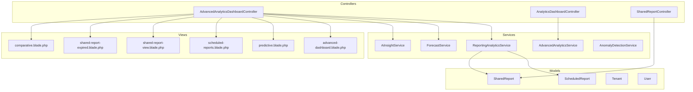

**Diagram sources**
- [AdvancedAnalyticsDashboardController.php:26-855](file://app/Http/Controllers/Analytics/AdvancedAnalyticsDashboardController.php#L26-L855)
- [AnalyticsDashboardController.php:10-48](file://app/Http/Controllers/Analytics/AnalyticsDashboardController.php#L10-L48)
- [SharedReportController.php:1-158](file://app/Http/Controllers/Analytics/SharedReportController.php#L1-L158)
- [AdvancedAnalyticsService.php:13-811](file://app/Services/AdvancedAnalyticsService.php#L13-L811)
- [ReportingAnalyticsService.php:24-499](file://app/Services/ReportingAnalyticsService.php#L24-L499)
- [ForecastService.php:11-220](file://app/Services/ForecastService.php#L11-L220)
- [AiInsightService.php:25-1330](file://app/Services/AiInsightService.php#L25-L1330)
- [AnomalyDetectionService.php:16-287](file://app/Services/AnomalyDetectionService.php#L16-L287)
- [ScheduledReport.php:8-101](file://app/Models/ScheduledReport.php#L8-L101)
- [SharedReport.php:9-119](file://app/Models/SharedReport.php#L9-L119)

**Section sources**
- [AdvancedAnalyticsDashboardController.php:26-855](file://app/Http/Controllers/Analytics/AdvancedAnalyticsDashboardController.php#L26-L855)
- [AnalyticsDashboardController.php:10-48](file://app/Http/Controllers/Analytics/AnalyticsDashboardController.php#L10-L48)
- [SharedReportController.php:1-158](file://app/Http/Controllers/Analytics/SharedReportController.php#L1-L158)
- [AdvancedAnalyticsService.php:13-811](file://app/Services/AdvancedAnalyticsService.php#L13-L811)
- [ReportingAnalyticsService.php:24-499](file://app/Services/ReportingAnalyticsService.php#L24-L499)
- [ForecastService.php:11-220](file://app/Services/ForecastService.php#L11-L220)
- [AiInsightService.php:25-1330](file://app/Services/AiInsightService.php#L25-L1330)
- [AnomalyDetectionService.php:16-287](file://app/Services/AnomalyDetectionService.php#L16-L287)
- [ScheduledReport.php:8-101](file://app/Models/ScheduledReport.php#L8-L101)
- [SharedReport.php:9-119](file://app/Models/SharedReport.php#L9-L119)

## Core Components
- AdvancedAnalyticsDashboardController: Provides the main advanced analytics dashboard, predictive analytics, comparative analysis, real-time metrics, report builder, scheduled reports, and comprehensive report sharing capabilities with expiration management.
- AnalyticsDashboardController: Delivers the basic analytics dashboard with health scores and segmentation.
- AdvancedAnalyticsService: Computes composite business health scores, RFM analysis, product profitability matrix, employee performance metrics, churn risk prediction, and seasonal trend analysis.
- ReportingAnalyticsService: **Enhanced** with comprehensive executive dashboard generation, comparative analysis (YoY/MoM/QoQ), predictive analytics with caching, real-time metrics, and shared report preparation with expiration management.
- ForecastService: Implements revenue forecasts, cash flow projections, demand forecasts, and receivables aging forecasts.
- AiInsightService: Proactively generates insights, anomalies, and recommendations across financial, inventory, and operational domains.
- AnomalyDetectionService: Detects unusual transactions, unbalanced journals, duplicates, fraud patterns, price anomalies, and stock mismatches.
- ScheduledReport model: Manages automated report schedules with recipients, formats, and execution tracking.
- **New** SharedReport model: Manages report sharing with access levels, expiration dates, recipient lists, and comprehensive access control.

**Section sources**
- [AdvancedAnalyticsDashboardController.php:31-855](file://app/Http/Controllers/Analytics/AdvancedAnalyticsDashboardController.php#L31-L855)
- [AnalyticsDashboardController.php:26-48](file://app/Http/Controllers/Analytics/AnalyticsDashboardController.php#L26-L48)
- [AdvancedAnalyticsService.php:19-811](file://app/Services/AdvancedAnalyticsService.php#L19-L811)
- [ReportingAnalyticsService.php:29-499](file://app/Services/ReportingAnalyticsService.php#L29-L499)
- [ForecastService.php:17-220](file://app/Services/ForecastService.php#L17-L220)
- [AiInsightService.php:38-1330](file://app/Services/AiInsightService.php#L38-L1330)
- [AnomalyDetectionService.php:22-287](file://app/Services/AnomalyDetectionService.php#L22-L287)
- [ScheduledReport.php:12-101](file://app/Models/ScheduledReport.php#L12-L101)
- [SharedReport.php:11-119](file://app/Models/SharedReport.php#L11-L119)

## Architecture Overview
The system follows a layered architecture with enhanced reporting capabilities:
- Presentation Layer: Blade views render dashboards, comparative analysis, shared reports, and expiration notifications.
- Controller Layer: Handles HTTP requests and orchestrates service calls for analytics, reporting, and sharing.
- Service Layer: Encapsulates business logic for analytics, forecasting, insights, and comprehensive reporting.
- Data Access Layer: Uses Eloquent models and raw queries for efficient analytics and comprehensive report management.
- Integration Layer: Optional AI integrations via GeminiService for enhanced predictions.

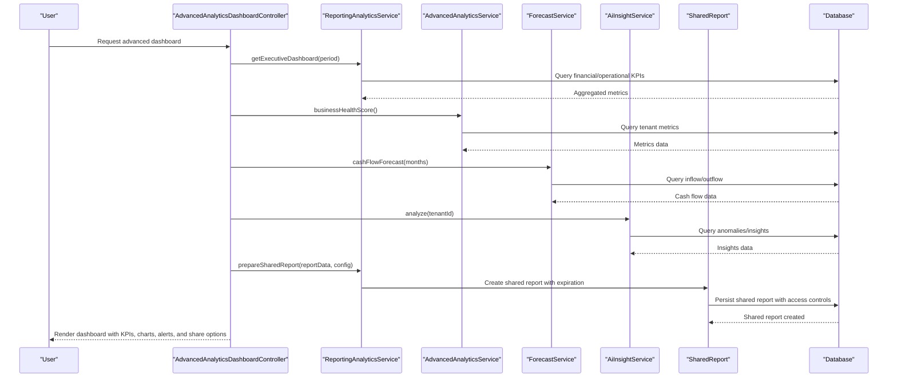

**Diagram sources**
- [AdvancedAnalyticsDashboardController.php:426-451](file://app/Http/Controllers/Analytics/AdvancedAnalyticsDashboardController.php#L426-L451)
- [ReportingAnalyticsService.php:29-101](file://app/Services/ReportingAnalyticsService.php#L29-L101)
- [AdvancedAnalyticsService.php:19-63](file://app/Services/AdvancedAnalyticsService.php#L19-L63)
- [ForecastService.php:67-122](file://app/Services/ForecastService.php#L67-L122)
- [AiInsightService.php:38-75](file://app/Services/AiInsightService.php#L38-L75)
- [ReportingAnalyticsService.php:449-467](file://app/Services/ReportingAnalyticsService.php#L449-L467)

## Detailed Component Analysis

### Advanced Analytics Dashboard Controller
Responsibilities:
- Real-time KPI aggregation with caching
- Revenue trend computation
- Top metrics extraction (products, customers, categories)
- Predictive analytics with AI enhancement
- **Enhanced** Comparative analysis with YoY/MoM/QoQ period comparisons
- Custom report builder and export
- Scheduled report creation and management
- **Enhanced** Report sharing with comprehensive access controls and expiration management

Key processing logic:
- Caches KPIs for 5 minutes to optimize performance
- Computes growth rates and conversion metrics
- Uses linear regression for forecasting
- Integrates GeminiService for AI-enhanced insights
- **New** Supports multiple comparison periods (today, this_week, this_month, this_quarter, this_year, last_30_days, last_90_days)
- **New** Generates comparative analysis with growth calculations and trend analysis

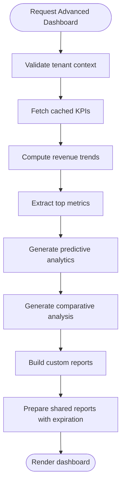

**Diagram sources**
- [AdvancedAnalyticsDashboardController.php:31-192](file://app/Http/Controllers/Analytics/AdvancedAnalyticsDashboardController.php#L31-L192)
- [AdvancedAnalyticsDashboardController.php:216-254](file://app/Http/Controllers/Analytics/AdvancedAnalyticsDashboardController.php#L216-L254)
- [AdvancedAnalyticsDashboardController.php:456-464](file://app/Http/Controllers/Analytics/AdvancedAnalyticsDashboardController.php#L456-L464)

**Section sources**
- [AdvancedAnalyticsDashboardController.php:31-855](file://app/Http/Controllers/Analytics/AdvancedAnalyticsDashboardController.php#L31-L855)

### Enhanced Reporting Analytics Service
**Updated** Features:
- Executive Dashboard: Comprehensive financial, operational, customer, and performance KPIs with comparative analysis
- Predictive Analytics: Sales forecasting with linear regression and confidence intervals
- **Enhanced** Comparative Analysis: Year-over-Year (YoY), Month-over-Month (MoM), Quarter-over-Quarter (QoQ) comparisons with growth calculations
- Real-time Metrics: Live revenue, orders, active users, pending tasks with timestamped data
- **Enhanced** Report Sharing: Configurable access levels (view, download, edit), expiration management, and comprehensive sharing metadata

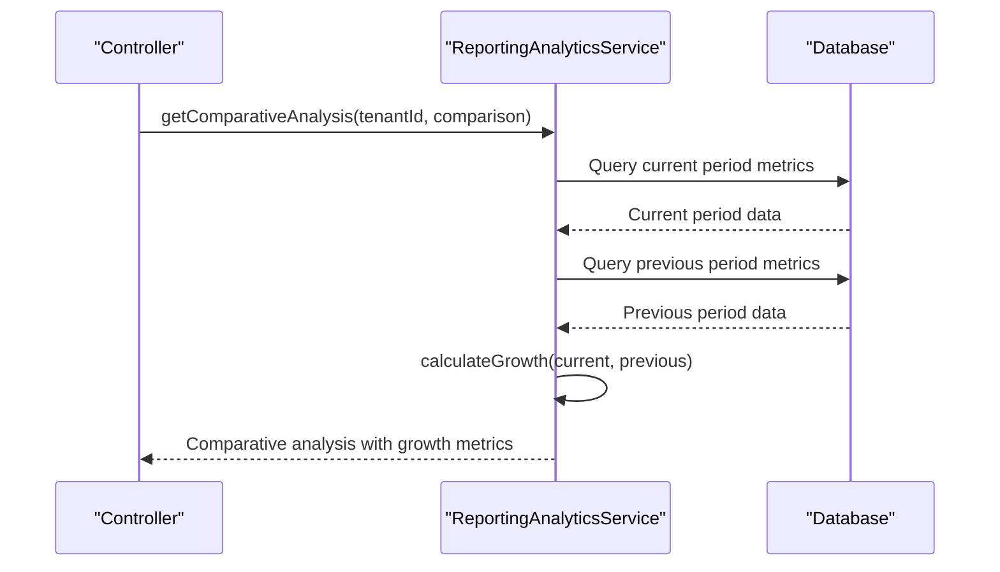

**Diagram sources**
- [ReportingAnalyticsService.php:342-380](file://app/Services/ReportingAnalyticsService.php#L342-L380)
- [ReportingAnalyticsService.php:409-427](file://app/Services/ReportingAnalyticsService.php#L409-L427)

**Section sources**
- [ReportingAnalyticsService.php:29-499](file://app/Services/ReportingAnalyticsService.php#L29-L499)

### Advanced Analytics Service
Capabilities:
- Business Health Score: Composite score with weighted components (revenue growth, profitability, cash flow, retention, inventory, productivity)
- RFM Analysis: Customer segmentation based on recency, frequency, and monetary value
- Product Profitability Matrix: Quadrant analysis of products by profit margin and velocity
- Employee Performance Metrics: Revenue, conversion rate, and performance ranking
- Churn Risk Prediction: Risk scoring for customer attrition
- Seasonal Trend Analysis: Monthly trends, seasonality index, YoY comparison

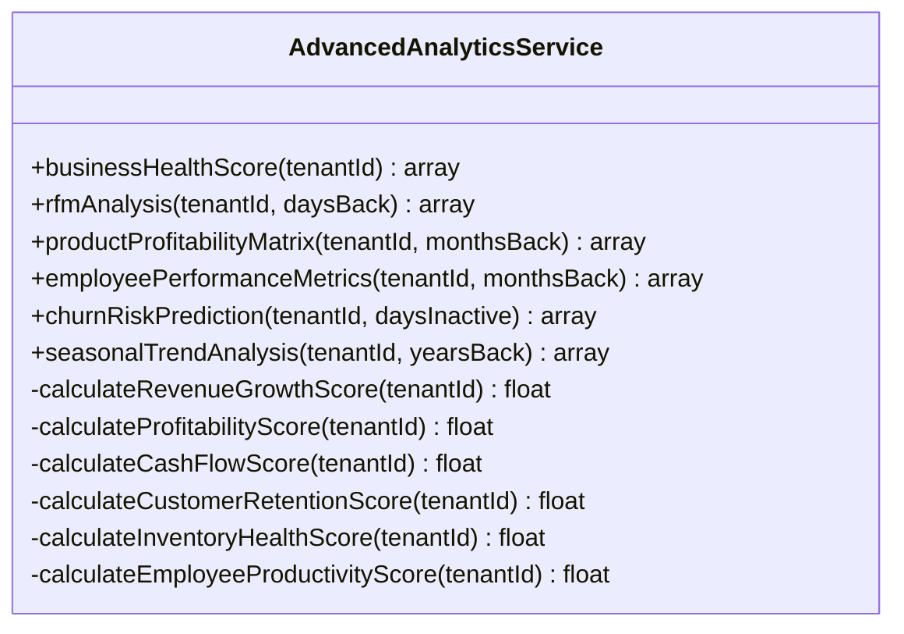

**Diagram sources**
- [AdvancedAnalyticsService.php:19-520](file://app/Services/AdvancedAnalyticsService.php#L19-L520)

**Section sources**
- [AdvancedAnalyticsService.php:19-811](file://app/Services/AdvancedAnalyticsService.php#L19-L811)

### Forecast Service
Functions:
- Revenue Forecast: Monthly sales totals with linear regression
- Cash Flow Forecast: Inflow vs outflow projections
- Demand Forecast: Product-level demand with trend analysis
- Receivables Forecast: Aging analysis and collection estimates

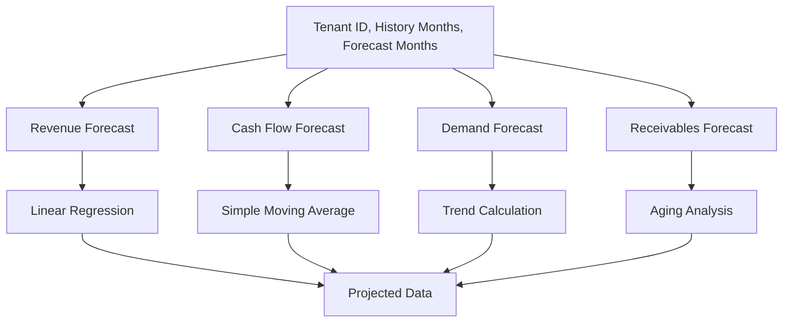

**Diagram sources**
- [ForecastService.php:17-185](file://app/Services/ForecastService.php#L17-L185)

**Section sources**
- [ForecastService.php:17-220](file://app/Services/ForecastService.php#L17-L220)

### AI Insights and Anomaly Detection
AiInsightService:
- Proactive insights across revenue trends, stock depletion, expense anomalies, receivables, credit limits, currency staleness, sales velocity, top products, cash flow prediction, budget variance, payroll costs, and GL-based alerts
- Generates actionable recommendations with severity levels

AnomalyDetectionService:
- Detects unusual transactions, unbalanced journals, duplicates, fraud patterns, price anomalies, and stock mismatches
- Prevents duplicate alerts by hashing anomaly signatures

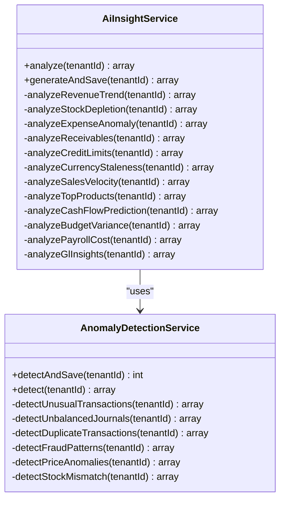

**Diagram sources**
- [AiInsightService.php:38-1330](file://app/Services/AiInsightService.php#L38-L1330)
- [AnomalyDetectionService.php:22-287](file://app/Services/AnomalyDetectionService.php#L22-L287)

**Section sources**
- [AiInsightService.php:38-1330](file://app/Services/AiInsightService.php#L38-L1330)
- [AnomalyDetectionService.php:22-287](file://app/Services/AnomalyDetectionService.php#L22-L287)

### Scheduled Reports Management
The system supports automated report generation and distribution:
- Creation of daily, weekly, or monthly schedules
- Recipient management and format selection (PDF, Excel, CSV)
- Execution tracking and next-run calculation
- Integration with the advanced analytics dashboard for report building

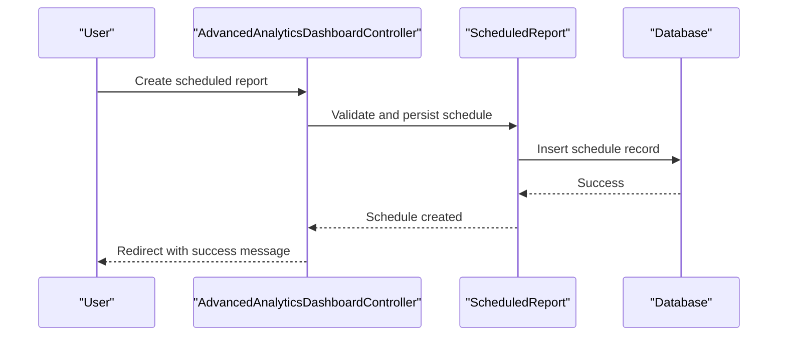

**Diagram sources**
- [AdvancedAnalyticsDashboardController.php:580-604](file://app/Http/Controllers/Analytics/AdvancedAnalyticsDashboardController.php#L580-L604)
- [ScheduledReport.php:67-99](file://app/Models/ScheduledReport.php#L67-L99)

**Section sources**
- [AdvancedAnalyticsDashboardController.php:413-604](file://app/Http/Controllers/Analytics/AdvancedAnalyticsDashboardController.php#L413-L604)
- [ScheduledReport.php:12-101](file://app/Models/ScheduledReport.php#L12-L101)

## Enhanced Reporting Capabilities

### Comparative Analysis System
**New** Comprehensive comparative analysis functionality provides period-over-period insights:
- Year-over-Year (YoY) comparisons for annual trends
- Month-over-Month (MoM) comparisons for monthly fluctuations  
- Quarter-over-Quarter (QoQ) comparisons for quarterly performance
- Automatic growth calculation with percentage changes and trend indicators
- Detailed metric breakdowns for revenue, orders, customers, and products sold

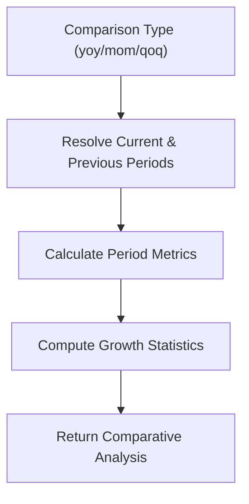

**Diagram sources**
- [ReportingAnalyticsService.php:342-380](file://app/Services/ReportingAnalyticsService.php#L342-L380)
- [ReportingAnalyticsService.php:409-427](file://app/Services/ReportingAnalyticsService.php#L409-L427)

**Section sources**
- [ReportingAnalyticsService.php:342-427](file://app/Services/ReportingAnalyticsService.php#L342-L427)
- [AdvancedAnalyticsDashboardController.php:456-464](file://app/Http/Controllers/Analytics/AdvancedAnalyticsDashboardController.php#L456-L464)

### Shared Report Management System
**New** Comprehensive report sharing with expiration and access control:
- UUID-based unique report identifiers
- Configurable access levels (view, download, edit)
- Expiration date management with automatic cleanup
- Recipient list support for targeted distribution
- Comprehensive access tracking and analytics
- Secure sharing URLs with expiration validation

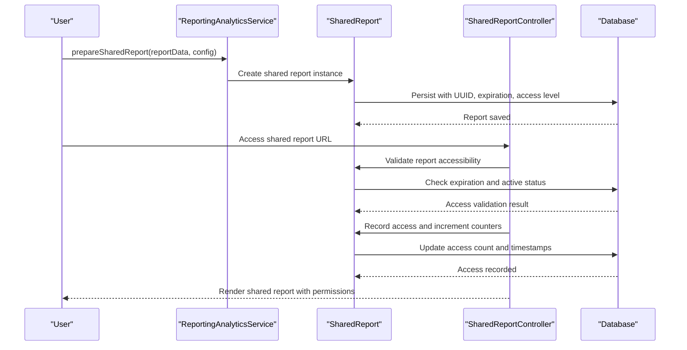

**Diagram sources**
- [ReportingAnalyticsService.php:449-467](file://app/Services/ReportingAnalyticsService.php#L449-L467)
- [SharedReport.php:68-90](file://app/Models/SharedReport.php#L68-L90)
- [SharedReportController.php:15-52](file://app/Http/Controllers/Analytics/SharedReportController.php#L15-L52)

**Section sources**
- [ReportingAnalyticsService.php:449-467](file://app/Services/ReportingAnalyticsService.php#L449-L467)
- [SharedReport.php:11-119](file://app/Models/SharedReport.php#L11-L119)
- [SharedReportController.php:1-158](file://app/Http/Controllers/Analytics/SharedReportController.php#L1-L158)

### Real-time Metrics System
**New** Live dashboard metrics for WebSocket integration:
- Timestamped metrics with ISO 8601 format
- Today's revenue and order counts
- Active user placeholders for presence channels
- Pending task counters
- Seamless integration with WebSocket broadcasting

**Section sources**
- [ReportingAnalyticsService.php:432-446](file://app/Services/ReportingAnalyticsService.php#L432-L446)

## Dependency Analysis
The system exhibits clear separation of concerns with enhanced reporting capabilities:
- Controllers depend on services for analytics computations and report sharing
- Services encapsulate data access, business logic, and comprehensive reporting features
- Models provide persistence for scheduled reports, shared reports, and tenant isolation
- Views consume controller-provided data for rendering with comparative analysis and sharing interfaces

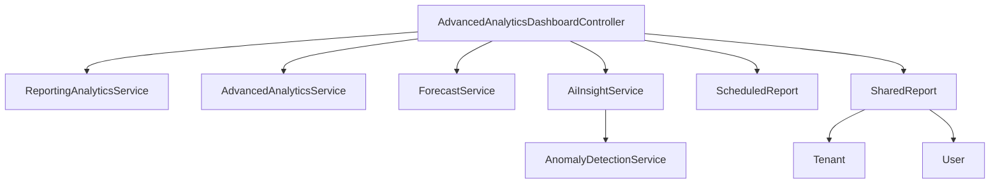

**Diagram sources**
- [AdvancedAnalyticsDashboardController.php:426-451](file://app/Http/Controllers/Analytics/AdvancedAnalyticsDashboardController.php#L426-L451)
- [ReportingAnalyticsService.php:24-52](file://app/Services/ReportingAnalyticsService.php#L24-L52)
- [AdvancedAnalyticsService.php:13-63](file://app/Services/AdvancedAnalyticsService.php#L13-L63)
- [ForecastService.php:11-35](file://app/Services/ForecastService.php#L11-L35)
- [AiInsightService.php:27-30](file://app/Services/AiInsightService.php#L27-L30)
- [AnomalyDetectionService.php:16-21](file://app/Services/AnomalyDetectionService.php#L16-L21)
- [ScheduledReport.php:8-26](file://app/Models/ScheduledReport.php#L8-L26)
- [SharedReport.php:54-65](file://app/Models/SharedReport.php#L54-L65)

**Section sources**
- [AdvancedAnalyticsDashboardController.php:426-451](file://app/Http/Controllers/Analytics/AdvancedAnalyticsDashboardController.php#L426-L451)
- [ReportingAnalyticsService.php:24-52](file://app/Services/ReportingAnalyticsService.php#L24-L52)
- [AdvancedAnalyticsService.php:13-63](file://app/Services/AdvancedAnalyticsService.php#L13-L63)
- [ForecastService.php:11-35](file://app/Services/ForecastService.php#L11-L35)
- [AiInsightService.php:27-30](file://app/Services/AiInsightService.php#L27-L30)
- [AnomalyDetectionService.php:16-21](file://app/Services/AnomalyDetectionService.php#L16-L21)
- [ScheduledReport.php:8-26](file://app/Models/ScheduledReport.php#L8-L26)
- [SharedReport.php:54-65](file://app/Models/SharedReport.php#L54-L65)

## Performance Considerations
- Caching: Extensive use of caching for KPIs, predictive analytics, executive dashboards, and comparative analysis to reduce database load
- Efficient Queries: Aggregation queries with grouping and filtering to minimize result sets
- Linear Regression: Lightweight calculations for forecasting avoid heavy ML frameworks
- Pagination and Limits: Top metrics queries limit results to prevent excessive rendering
- Asynchronous Processing: Scheduled reports leverage model scopes for due execution tracking
- **New** Shared Report Caching: Report data is cached with UUID-based keys for improved access performance
- **New** Expiration Cleanup: Database indexes on expiration dates enable efficient cleanup processes

## Troubleshooting Guide
Common issues and resolutions:
- Unauthenticated Access: Controllers validate tenant context and abort with unauthorized responses
- Missing Data: Services handle zero-value scenarios gracefully and return empty arrays or defaults
- Cache Invalidation: Use cache keys with tenant IDs and time-based TTLs to ensure freshness
- Forecast Accuracy: Validate historical data completeness and adjust horizon windows
- Anomaly Duplicates: Hash-based deduplication prevents repeated alerts for the same anomaly type
- **New** Shared Report Access: Verify UUID format, expiration status, and access level permissions
- **New** Comparative Analysis: Ensure sufficient historical data for meaningful period comparisons
- **New** Real-time Metrics: Implement WebSocket connections for live dashboard updates

**Section sources**
- [AdvancedAnalyticsDashboardController.php:33-36](file://app/Http/Controllers/Analytics/AdvancedAnalyticsDashboardController.php#L33-L36)
- [AdvancedAnalyticsDashboardController.php:564-575](file://app/Http/Controllers/Analytics/AdvancedAnalyticsDashboardController.php#L564-L575)
- [ReportingAnalyticsService.php:249-273](file://app/Services/ReportingAnalyticsService.php#L249-L273)
- [AiInsightService.php:92-99](file://app/Services/AiInsightService.php#L92-L99)
- [AnomalyDetectionService.php:34-47](file://app/Services/AnomalyDetectionService.php#L34-L47)
- [SharedReportController.php:25-32](file://app/Http/Controllers/Analytics/SharedReportController.php#L25-L32)

## Conclusion
The Advanced Analytics Reporting system provides a robust, scalable foundation for business intelligence within qalcuityERP. Through comprehensive enhancements, the system now offers executive dashboards with comparative analysis, predictive analytics, automated reporting, AI-driven insights, and sophisticated report sharing with expiration management. The modular architecture ensures maintainability and extensibility for future enhancements, enabling stakeholders to monitor performance, anticipate trends, collaborate through shared insights, and make informed decisions with confidence.