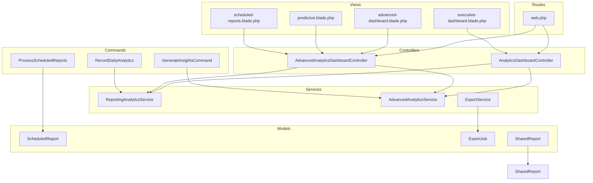
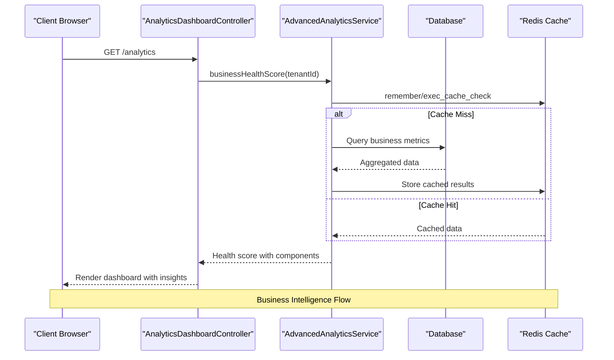
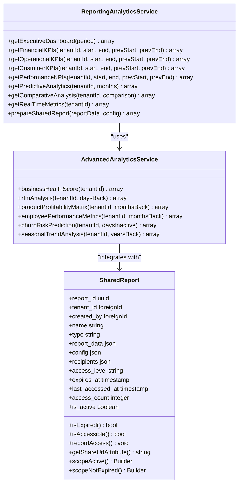
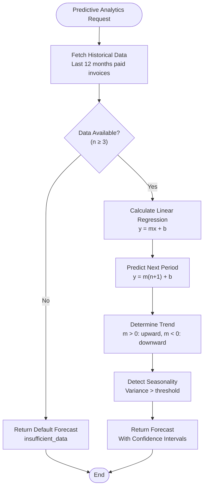
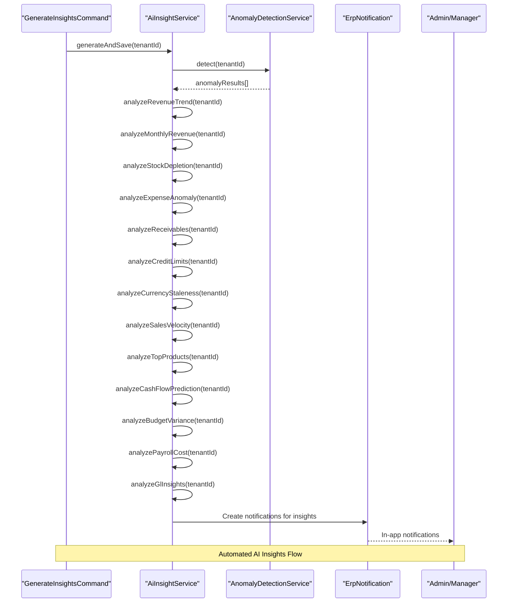
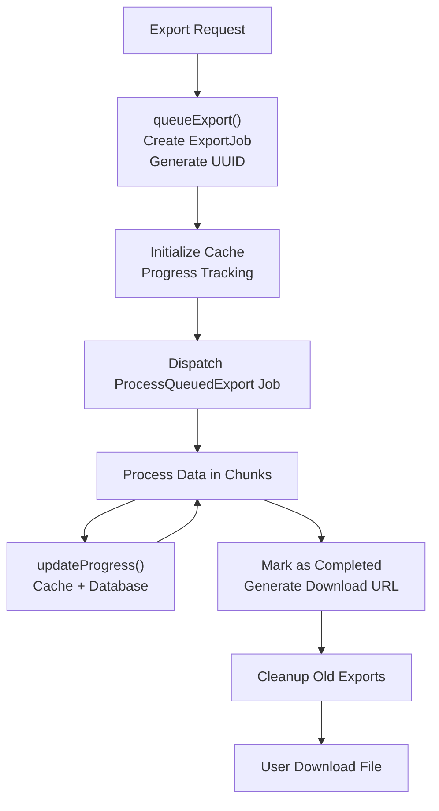
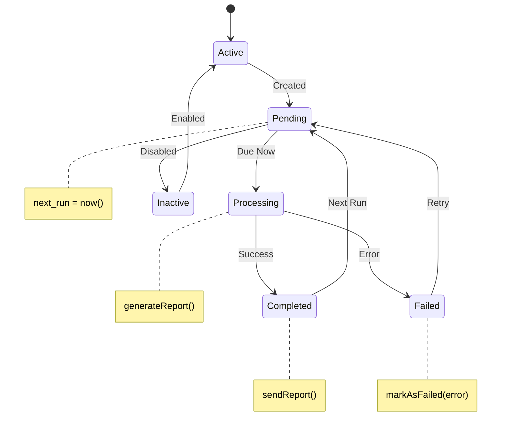
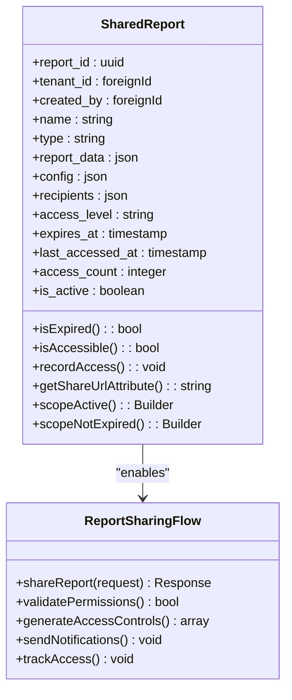
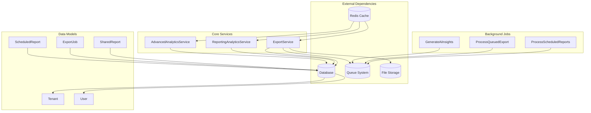

# Analytics Reporting

<cite>
**Referenced Files in This Document**
- [ReportingAnalyticsService.php](file://app/Services/ReportingAnalyticsService.php)
- [AdvancedAnalyticsService.php](file://app/Services/AdvancedAnalyticsService.php)
- [AnalyticsDashboardController.php](file://app/Http/Controllers/Analytics/AnalyticsDashboardController.php)
- [AdvancedAnalyticsDashboardController.php](file://app/Http/Controllers/Analytics/AdvancedAnalyticsDashboardController.php)
- [SharedReport.php](file://app/Models/SharedReport.php)
- [ExportService.php](file://app/Services/ExportService.php)
- [ScheduledReport.php](file://app/Models/ScheduledReport.php)
- [ExportJob.php](file://app/Models/ExportJob.php)
- [RecordDailyAnalytics.php](file://app/Console/Commands/RecordDailyAnalytics.php)
- [GenerateInsightsCommand.php](file://app/Console/Commands/GenerateInsightsCommand.php)
- [ProcessScheduledReports.php](file://app/Console/Commands/ProcessScheduledReports.php)
- [web.php](file://routes/web.php)
- [2026_04_08_001834_create_export_jobs_table.php](file://database/migrations/2026_04_08_001834_create_export_jobs_table.php)
- [2024_04_10_000001_create_shared_reports_table.php](file://database/migrations/2024_04_10_000001_create_shared_reports_table.php)
- [executive-dashboard.blade.php](file://resources/views/analytics/executive-dashboard.blade.php)
- [advanced-dashboard.blade.php](file://resources/views/analytics/advanced-dashboard.blade.php)
- [predictive.blade.php](file://resources/views/analytics/predictive.blade.php)
- [scheduled-reports.blade.php](file://resources/views/analytics/scheduled-reports.blade.php)
</cite>

## Update Summary
**Changes Made**
- Added comprehensive SharedReport model and database schema for enhanced report sharing capabilities
- Integrated advanced reporting analytics service with executive dashboard functionality
- Enhanced comparative analysis and predictive analytics capabilities
- Expanded dashboard widgets with real-time metrics and executive insights
- Improved report sharing with configurable access levels and expiration controls

## Table of Contents
1. [Introduction](#introduction)
2. [Project Structure](#project-structure)
3. [Core Components](#core-components)
4. [Architecture Overview](#architecture-overview)
5. [Detailed Component Analysis](#detailed-component-analysis)
6. [Dependency Analysis](#dependency-analysis)
7. [Performance Considerations](#performance-considerations)
8. [Troubleshooting Guide](#troubleshooting-guide)
9. [Conclusion](#conclusion)

## Introduction
This document provides comprehensive documentation for the Analytics Reporting system within the qalcuityERP platform. The system encompasses executive dashboards, advanced analytics, predictive modeling, scheduled reporting, export capabilities, AI-driven insights, and enhanced report sharing with the new SharedReport model. It supports multi-tenant environments and provides both real-time and historical analytics for business intelligence.

## Project Structure
The analytics reporting system is organized around several key areas:
- Services: Core analytics logic and reporting orchestration
- Controllers: Web and API endpoints for analytics dashboards
- Models: Data structures for scheduled reports, export tracking, and shared reports
- Commands: Background processing for daily analytics, insights generation, and scheduled report execution
- Views: Blade templates for dashboard presentations
- Routes: Web routes exposing analytics endpoints

**Diagram sources**
- [AnalyticsDashboardController.php:1-48](file://app/Http/Controllers/Analytics/AnalyticsDashboardController.php#L1-L48)
- [AdvancedAnalyticsDashboardController.php:575-616](file://app/Http/Controllers/Analytics/AdvancedAnalyticsDashboardController.php#L575-L616)
- [ReportingAnalyticsService.php:24-52](file://app/Services/ReportingAnalyticsService.php#L24-L52)
- [AdvancedAnalyticsService.php:13-63](file://app/Services/AdvancedAnalyticsService.php#L13-L63)
- [ExportService.php:17-69](file://app/Services/ExportService.php#L17-L69)
- [ScheduledReport.php:8-35](file://app/Models/ScheduledReport.php#L8-L35)
- [ExportJob.php:8-45](file://app/Models/ExportJob.php#L8-L45)
- [SharedReport.php:9-38](file://app/Models/SharedReport.php#L9-L38)
- [RecordDailyAnalytics.php:9-64](file://app/Console/Commands/RecordDailyAnalytics.php#L9-L64)
- [GenerateInsightsCommand.php:22-68](file://app/Console/Commands/GenerateInsightsCommand.php#L22-L68)
- [ProcessScheduledReports.php:11-78](file://app/Console/Commands/ProcessScheduledReports.php#L11-L78)
- [web.php:261-291](file://routes/web.php#L261-L291)

**Section sources**
- [web.php:261-291](file://routes/web.php#L261-L291)
- [AnalyticsDashboardController.php:1-48](file://app/Http/Controllers/Analytics/AnalyticsDashboardController.php#L1-L48)
- [AdvancedAnalyticsDashboardController.php:575-616](file://app/Http/Controllers/Analytics/AdvancedAnalyticsDashboardController.php#L575-L616)

## Core Components
The analytics reporting system consists of several core components that work together to deliver comprehensive business intelligence:

### ReportingAnalyticsService
Provides executive dashboards, comparative analysis, predictive analytics, and real-time metrics. Features include:
- Executive KPI dashboard with financial, operational, customer, and performance metrics
- Comparative analysis (YoY, MoM, QoQ) with growth calculations
- Predictive analytics using linear regression for revenue forecasting
- Real-time metrics for live dashboard updates
- Report sharing capabilities with permission controls

### AdvancedAnalyticsService
Delivers advanced analytical capabilities including:
- Business health score calculation with weighted components
- RFM (Recency, Frequency, Monetary) customer segmentation
- Product profitability matrix with quadrant analysis
- Employee performance metrics and rankings
- Churn risk prediction for customer retention
- Seasonal trend analysis and peak season identification

### ExportService
Handles large-scale data exports with queuing and progress tracking:
- Queued export processing for large datasets (>5,000 rows)
- Progress tracking via cache and database synchronization
- Support for Excel, CSV, and PDF export formats
- Automatic cleanup of expired export files
- Download URL generation for completed exports

### ScheduledReport Management
Manages automated report generation and distribution:
- Configurable report schedules (daily, weekly, monthly)
- Metric-based report generation (revenue, orders, customers, inventory)
- Recipient management and format selection
- Execution tracking and failure handling
- Next-run calculation based on frequency

### SharedReport Model
**New** Enhanced report sharing capabilities with comprehensive access control:
- UUID-based report identifiers with automatic generation
- Configurable access levels (view, download, edit)
- Expiration date management with automatic cleanup
- Recipient tracking with email notifications
- Access counting and analytics
- Tenant isolation with multi-tenant support
- JSON-based report data storage for flexibility

**Section sources**
- [ReportingAnalyticsService.php:24-499](file://app/Services/ReportingAnalyticsService.php#L24-L499)
- [AdvancedAnalyticsService.php:13-811](file://app/Services/AdvancedAnalyticsService.php#L13-L811)
- [ExportService.php:17-244](file://app/Services/ExportService.php#L17-L244)
- [ScheduledReport.php:8-101](file://app/Models/ScheduledReport.php#L8-L101)
- [SharedReport.php:9-119](file://app/Models/SharedReport.php#L9-L119)

## Architecture Overview
The analytics reporting system follows a layered architecture pattern with clear separation of concerns:

**Diagram sources**
- [AnalyticsDashboardController.php:26-36](file://app/Http/Controllers/Analytics/AnalyticsDashboardController.php#L26-L36)
- [AdvancedAnalyticsService.php:19-62](file://app/Services/AdvancedAnalyticsService.php#L19-L62)

The system employs several architectural patterns:
- **Service Layer Pattern**: Analytics logic encapsulated in dedicated service classes
- **Command Pattern**: Background processing for heavy analytics tasks
- **Queue Pattern**: Asynchronous processing for large exports and scheduled reports
- **Caching Strategy**: Redis caching for improved performance and reduced database load
- **Multi-Tenant Architecture**: Tenant isolation with per-tenant analytics contexts
- **Model-Driven Architecture**: Enhanced data models with comprehensive validation and relationships

## Detailed Component Analysis

### Executive Dashboard Analytics
The executive dashboard provides comprehensive business intelligence through multiple KPI categories:

**Diagram sources**
- [ReportingAnalyticsService.php:24-52](file://app/Services/ReportingAnalyticsService.php#L24-L52)
- [AdvancedAnalyticsService.php:13-63](file://app/Services/AdvancedAnalyticsService.php#L13-L63)
- [SharedReport.php:9-38](file://app/Models/SharedReport.php#L9-L38)

The executive dashboard aggregates data from multiple sources:
- **Financial KPIs**: Revenue growth, profit margins, outstanding receivables, cash flow
- **Operational KPIs**: Order volume growth, inventory health, fulfillment rates
- **Customer KPIs**: New customer acquisition, retention rates, churn risk
- **Performance KPIs**: Employee productivity, quality metrics, response times

### Predictive Analytics Implementation
The predictive analytics module implements linear regression for revenue forecasting:

**Diagram sources**
- [ReportingAnalyticsService.php:247-337](file://app/Services/ReportingAnalyticsService.php#L247-L337)

The forecasting algorithm calculates:
- **Slope and Intercept**: Using least squares method
- **Confidence Intervals**: ±10% around predicted values
- **Trend Analysis**: Upward, downward, or stable based on slope
- **Seasonality Detection**: Based on variance thresholds

### AI Insights Generation
The AI insights system automatically generates actionable business insights:

**Diagram sources**
- [GenerateInsightsCommand.php:31-67](file://app/Console/Commands/GenerateInsightsCommand.php#L31-L67)
- [AdvancedAnalyticsService.php:539-558](file://app/Services/AdvancedAnalyticsService.php#L539-L558)

### Export Processing Pipeline
Large-scale data exports are handled asynchronously to prevent timeouts:

**Diagram sources**
- [ExportService.php:28-69](file://app/Services/ExportService.php#L28-L69)
- [ExportService.php:119-159](file://app/Services/ExportService.php#L119-L159)

### Scheduled Report System
The scheduled report system automates report generation and distribution:

**Diagram sources**
- [ScheduledReport.php:58-99](file://app/Models/ScheduledReport.php#L58-L99)
- [ProcessScheduledReports.php:30-78](file://app/Console/Commands/ProcessScheduledReports.php#L30-L78)

### Enhanced Report Sharing System
**New** The SharedReport model provides comprehensive report sharing capabilities:

**Diagram sources**
- [SharedReport.php:9-119](file://app/Models/SharedReport.php#L9-L119)
- [AdvancedAnalyticsDashboardController.php:484-575](file://app/Http/Controllers/Analytics/AdvancedAnalyticsDashboardController.php#L484-L575)

The report sharing system includes:
- **Access Control**: Configurable permissions (view, download, edit)
- **Expiration Management**: Automatic cleanup of expired shared reports
- **Recipient Tracking**: Email notifications and access logging
- **Tenant Isolation**: Multi-tenant support with proper data segregation
- **Flexible Data Storage**: JSON-based report data with dynamic schemas

**Section sources**
- [ReportingAnalyticsService.php:247-337](file://app/Services/ReportingAnalyticsService.php#L247-L337)
- [AdvancedAnalyticsService.php:539-558](file://app/Services/AdvancedAnalyticsService.php#L539-L558)
- [ExportService.php:28-159](file://app/Services/ExportService.php#L28-L159)
- [SharedReport.php:9-119](file://app/Models/SharedReport.php#L9-L119)

## Dependency Analysis
The analytics reporting system exhibits strong modularity with clear dependency relationships:

**Diagram sources**
- [AdvancedAnalyticsService.php:13-13](file://app/Services/AdvancedAnalyticsService.php#L13-L13)
- [ReportingAnalyticsService.php:24-8](file://app/Services/ReportingAnalyticsService.php#L24-L8)
- [ExportService.php:17-9](file://app/Services/ExportService.php#L17-L9)
- [ScheduledReport.php:8-48](file://app/Models/ScheduledReport.php#L8-L48)
- [ExportJob.php:8-30](file://app/Models/ExportJob.php#L8-L30)
- [SharedReport.php:9-38](file://app/Models/SharedReport.php#L9-L38)

Key dependency characteristics:
- **High Cohesion**: Each service has a focused responsibility
- **Low Coupling**: Services communicate through well-defined interfaces
- **External Dependencies**: Database, cache, queue, and storage systems
- **Asynchronous Processing**: Heavy operations offloaded to background jobs
- **Enhanced Data Modeling**: New SharedReport model with comprehensive relationships

**Section sources**
- [AdvancedAnalyticsService.php:13-13](file://app/Services/AdvancedAnalyticsService.php#L13-L13)
- [ReportingAnalyticsService.php:24-8](file://app/Services/ReportingAnalyticsService.php#L24-L8)
- [ExportService.php:17-9](file://app/Services/ExportService.php#L17-L9)
- [SharedReport.php:9-38](file://app/Models/SharedReport.php#L9-L38)

## Performance Considerations
The analytics reporting system implements several performance optimization strategies:

### Caching Strategy
- **Executive Dashboard**: 5-minute cache TTL for frequently accessed metrics
- **Predictive Analytics**: 1-hour cache for forecast calculations
- **Real-time Metrics**: Short-lived cache for live updates
- **AI Insights**: Duplicate prevention with daily deduplication
- **Shared Reports**: Cache for frequently accessed shared content

### Query Optimization
- **Aggregation Queries**: Optimized with proper indexing on date and tenant_id fields
- **Chunked Processing**: Large exports processed in chunks to prevent memory issues
- **Lazy Loading**: Eager loading of relationships to reduce N+1 query problems
- **Shared Report Indexing**: UUID and expiration date indexing for fast lookups

### Asynchronous Processing
- **Export Queues**: Large exports processed in background jobs
- **AI Insight Generation**: Distributed across tenants to prevent blocking
- **Report Scheduling**: Cron-based execution with proper error handling
- **Report Sharing Notifications**: Asynchronous email delivery

### Scalability Patterns
- **Tenant Isolation**: Multi-tenant architecture with per-tenant analytics contexts
- **Database Partitioning**: Historical data partitioning for performance
- **Load Balancing**: Stateless services for horizontal scaling
- **Shared Report Cleanup**: Automated cleanup of expired shared reports

## Troubleshooting Guide

### Common Issues and Solutions

**Export Timeout Problems**
- **Symptom**: PHP timeout during large export generation
- **Solution**: Enable queue processing and use ExportService.shouldQueue() threshold
- **Prevention**: Monitor export job progress and adjust queue thresholds

**Missing Analytics Data**
- **Symptom**: Empty or incomplete analytics dashboard
- **Solution**: Verify daily analytics recording command execution
- **Prevention**: Set up proper cron scheduling for RecordDailyAnalytics

**AI Insights Not Generated**
- **Symptom**: No AI-generated insights appearing
- **Solution**: Check GenerateInsightsCommand execution and queue worker status
- **Prevention**: Monitor insight generation logs and retry failed jobs

**Scheduled Report Failures**
- **Symptom**: Scheduled reports not being sent
- **Solution**: Review ProcessScheduledReports command logs and recipient configurations
- **Prevention**: Implement proper error handling and notification systems

**Shared Report Access Issues**
- **Symptom**: Users cannot access shared reports
- **Solution**: Check SharedReport.isAccessible() method and expiration dates
- **Prevention**: Monitor shared report access logs and implement proper expiration handling

**Performance Degradation**
- **Symptom**: Slow dashboard loading times
- **Solution**: Optimize database queries and increase cache TTL
- **Prevention**: Monitor query performance and implement proper indexing

**Section sources**
- [RecordDailyAnalytics.php:30-64](file://app/Console/Commands/RecordDailyAnalytics.php#L30-L64)
- [GenerateInsightsCommand.php:31-67](file://app/Console/Commands/GenerateInsightsCommand.php#L31-L67)
- [ProcessScheduledReports.php:30-78](file://app/Console/Commands/ProcessScheduledReports.php#L30-L78)
- [SharedReport.php:69-90](file://app/Models/SharedReport.php#L69-L90)

## Conclusion
The Analytics Reporting system in qalcuityERP provides a comprehensive foundation for business intelligence and data-driven decision-making. Through its modular architecture, robust performance optimizations, and scalable design, it supports both real-time analytics and long-term strategic planning across multiple business domains.

**Key Enhancements**:
- **Enhanced Report Sharing**: New SharedReport model with comprehensive access control and expiration management
- **Advanced Analytics Integration**: Seamless integration between reporting and advanced analytics services
- **Executive Dashboard Capabilities**: Comprehensive executive dashboard with comparative analysis and predictive insights
- **Improved Performance**: Enhanced caching strategies and optimized data models
- **Scalable Architecture**: Multi-tenant support with proper isolation and resource management

Key strengths of the system include:
- **Multi-layered Analytics**: From basic KPIs to advanced predictive modeling
- **Asynchronous Processing**: Ensures system responsiveness under heavy loads
- **Tenant Isolation**: Secure multi-tenant analytics with proper data segregation
- **Extensible Design**: Modular services that can accommodate future analytics requirements
- **Performance Focus**: Comprehensive caching and optimization strategies
- **Enhanced Collaboration**: Advanced report sharing capabilities with granular access controls

The system's architecture provides a solid foundation for future enhancements, including machine learning integrations, advanced visualization capabilities, expanded reporting automation features, and enhanced collaborative analytics workflows.