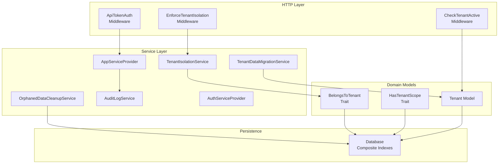
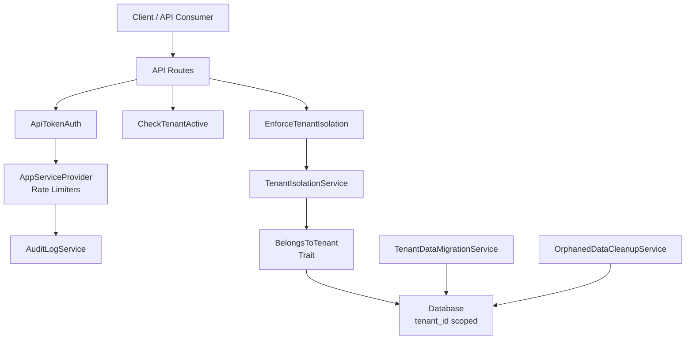
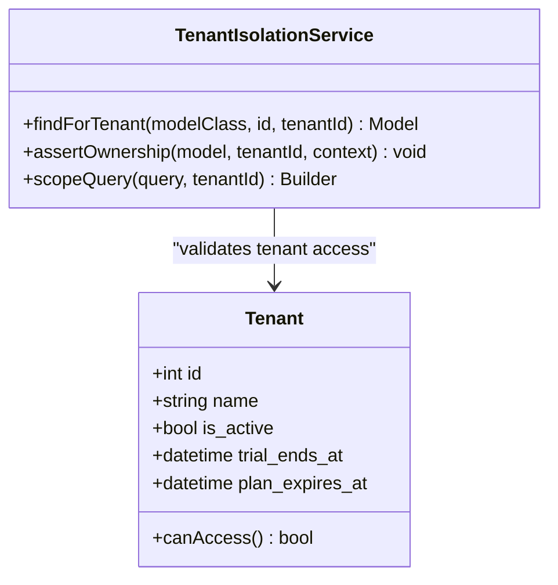
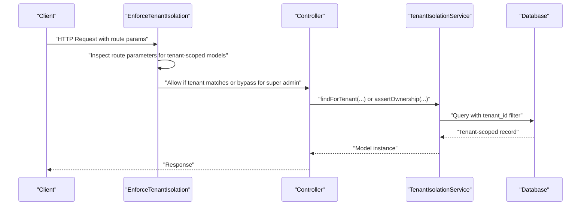
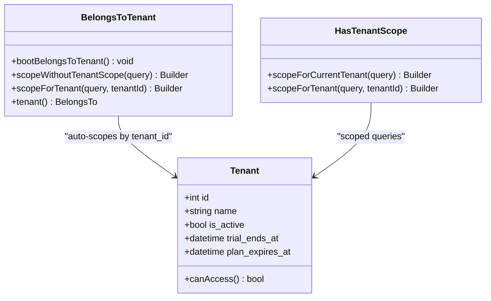
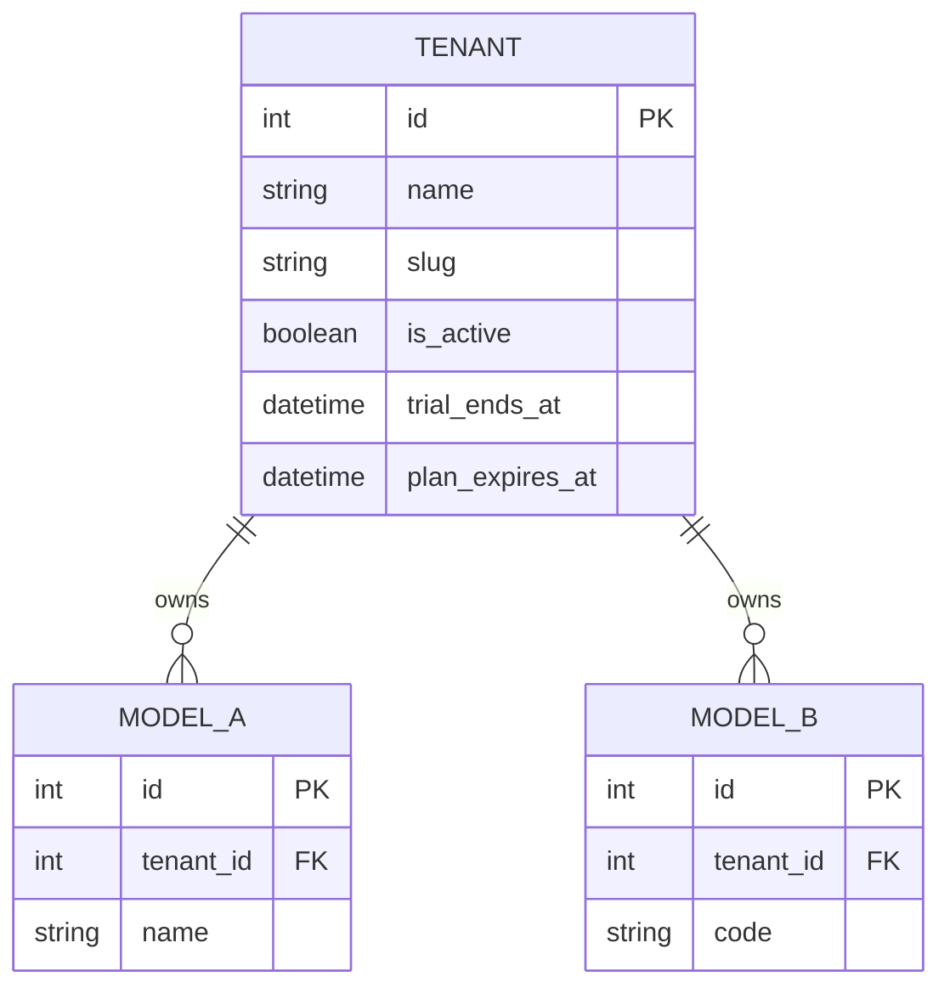
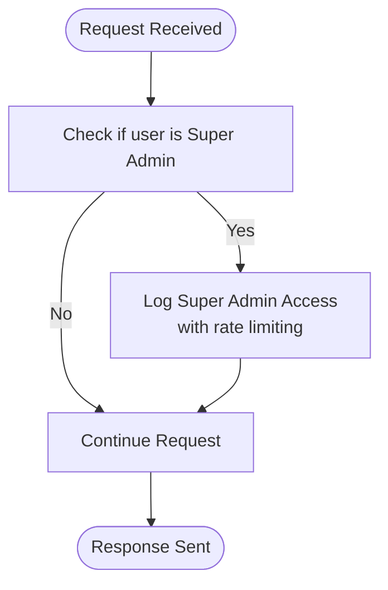
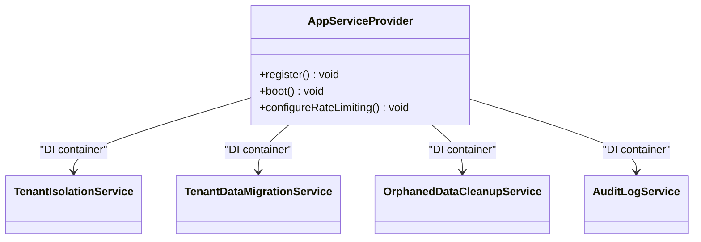
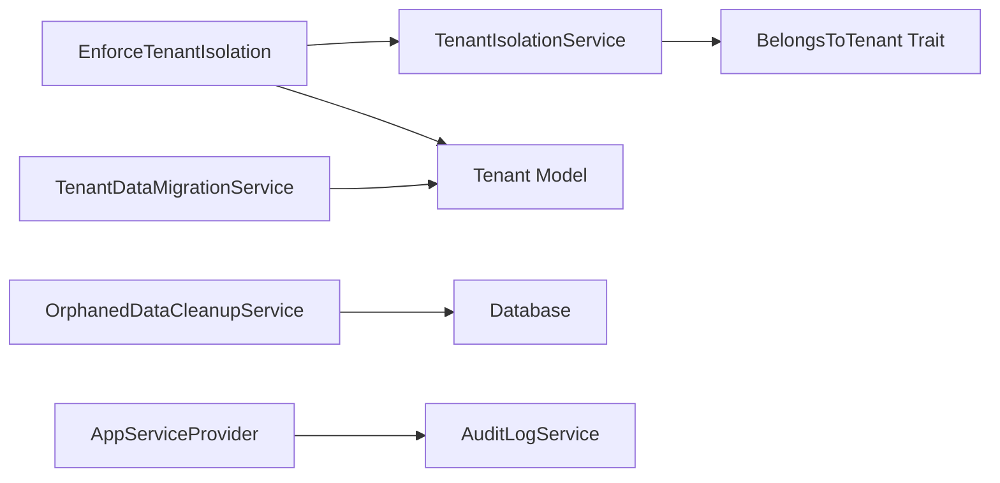

# Architecture Overview

<cite>
**Referenced Files in This Document**
- [Tenant.php](file://app/Models/Tenant.php)
- [BelongsToTenant.php](file://app/Traits/BelongsToTenant.php)
- [HasTenantScope.php](file://app/Models/Concerns/HasTenantScope.php)
- [EnforceTenantIsolation.php](file://app/Http/Middleware/EnforceTenantIsolation.php)
- [CheckTenantActive.php](file://app/Http/Middleware/CheckTenantActive.php)
- [ApiTokenAuth.php](file://app/Http/Middleware/ApiTokenAuth.php)
- [TenantIsolationService.php](file://app/Services/TenantIsolationService.php)
- [TenantDataMigrationService.php](file://app/Services/TenantDataMigrationService.php)
- [OrphanedDataCleanupService.php](file://app/Services/OrphanedDataCleanupService.php)
- [AuditLogService.php](file://app/Services/Security/AuditLogService.php)
- [AppServiceProvider.php](file://app/Providers/AppServiceProvider.php)
- [AuthServiceProvider.php](file://app/Providers/AuthServiceProvider.php)
- [2025_04_06_000014_add_composite_indexes_for_performance.php](file://database/migrations/2025_04_06_000014_add_composite_indexes_for_performance.php)
- [2025_04_06_000014_add_composite_indexes_for_performance.php](file://database/migrations/2025_04_06_000014_add_composite_indexes_for_performance.php)
- [DataMigrationCleanupTest.php](file://tests/Feature/DataMigrationCleanupTest.php)
</cite>

## Table of Contents
1. [Introduction](#introduction)
2. [Project Structure](#project-structure)
3. [Core Components](#core-components)
4. [Architecture Overview](#architecture-overview)
5. [Detailed Component Analysis](#detailed-component-analysis)
6. [Dependency Analysis](#dependency-analysis)
7. [Performance Considerations](#performance-considerations)
8. [Troubleshooting Guide](#troubleshooting-guide)
9. [Conclusion](#conclusion)

## Introduction
This document describes the multi-tenant architecture of Qalcuity ERP, focusing on tenant isolation, database schema design, shared versus isolated resources, and tenant scoping mechanisms. It also documents the service layer architecture, dependency injection patterns, and cross-cutting concerns such as tenant-aware models, middleware for tenant isolation, and data segregation strategies. The goal is to provide a comprehensive understanding of how the system enforces tenant boundaries, scales across tenants, and maintains secure and compliant operations.

## Project Structure
Qalcuity ERP follows a layered architecture with clear separation of concerns:
- Models define domain entities and encapsulate tenant-aware behavior via traits and scopes.
- Middleware enforces tenant isolation at the HTTP boundary and validates tenant activation.
- Services encapsulate business logic for tenant isolation, data migration, cleanup, and auditing.
- Providers manage dependency injection, rate limiting, and system-wide configuration.
- Migrations define tenant-scoped database schema and composite indexes for performance.

**Diagram sources**
- [EnforceTenantIsolation.php:19-159](file://app/Http/Middleware/EnforceTenantIsolation.php#L19-L159)
- [CheckTenantActive.php:9-38](file://app/Http/Middleware/CheckTenantActive.php#L9-L38)
- [ApiTokenAuth.php:10-71](file://app/Http/Middleware/ApiTokenAuth.php#L10-L71)
- [TenantIsolationService.php:16-66](file://app/Services/TenantIsolationService.php#L16-L66)
- [TenantDataMigrationService.php:346-435](file://app/Services/TenantDataMigrationService.php#L346-L435)
- [OrphanedDataCleanupService.php:76-115](file://app/Services/OrphanedDataCleanupService.php#L76-L115)
- [AuditLogService.php:8-32](file://app/Services/Security/AuditLogService.php#L8-L32)
- [AppServiceProvider.php:24-75](file://app/Providers/AppServiceProvider.php#L24-L75)
- [AuthServiceProvider.php:14-42](file://app/Providers/AuthServiceProvider.php#L14-L42)
- [BelongsToTenant.php:32-110](file://app/Traits/BelongsToTenant.php#L32-L110)
- [HasTenantScope.php:23-41](file://app/Models/Concerns/HasTenantScope.php#L23-L41)
- [Tenant.php:10-118](file://app/Models/Tenant.php#L10-L118)
- [2025_04_06_000014_add_composite_indexes_for_performance.php:19-103](file://database/migrations/2025_04_06_000014_add_composite_indexes_for_performance.php#L19-L103)

**Section sources**
- [AppServiceProvider.php:24-75](file://app/Providers/AppServiceProvider.php#L24-L75)
- [AuthServiceProvider.php:14-42](file://app/Providers/AuthServiceProvider.php#L14-L42)

## Core Components
- Tenant model: Central entity representing a tenant with subscription and access controls.
- BelongsToTenant trait: Adds automatic tenant scoping and tenant_id assignment for models.
- HasTenantScope trait: Provides convenient tenant-scoped query helpers for sensitive models.
- TenantIsolationService: Enforces ownership checks and safe retrieval of tenant-scoped models.
- EnforceTenantIsolation middleware: Validates route-bound tenant models and audits super admin access.
- CheckTenantActive middleware: Ensures tenants can access the system based on subscription status.
- ApiTokenAuth middleware: Authenticates API requests and attaches tenant context for rate limiting.
- TenantDataMigrationService: Supports tenant split, merge, and data transfer operations.
- OrphanedDataCleanupService: Identifies and cleans orphaned records with tenant-awareness.
- AuditLogService: Records security events and compliance-relevant activities.
- AppServiceProvider: Registers singletons, blade directives, rate limiters, and loads system settings.
- AuthServiceProvider: Registers policies for authorization.

**Section sources**
- [Tenant.php:10-118](file://app/Models/Tenant.php#L10-L118)
- [BelongsToTenant.php:32-110](file://app/Traits/BelongsToTenant.php#L32-L110)
- [HasTenantScope.php:23-41](file://app/Models/Concerns/HasTenantScope.php#L23-L41)
- [TenantIsolationService.php:16-66](file://app/Services/TenantIsolationService.php#L16-L66)
- [EnforceTenantIsolation.php:19-159](file://app/Http/Middleware/EnforceTenantIsolation.php#L19-L159)
- [CheckTenantActive.php:9-38](file://app/Http/Middleware/CheckTenantActive.php#L9-L38)
- [ApiTokenAuth.php:10-71](file://app/Http/Middleware/ApiTokenAuth.php#L10-L71)
- [TenantDataMigrationService.php:346-435](file://app/Services/TenantDataMigrationService.php#L346-L435)
- [OrphanedDataCleanupService.php:76-115](file://app/Services/OrphanedDataCleanupService.php#L76-L115)
- [AuditLogService.php:8-32](file://app/Services/Security/AuditLogService.php#L8-L32)
- [AppServiceProvider.php:24-75](file://app/Providers/AppServiceProvider.php#L24-L75)
- [AuthServiceProvider.php:14-42](file://app/Providers/AuthServiceProvider.php#L14-L42)

## Architecture Overview
The system employs a hybrid isolation strategy:
- Automatic tenant scoping via global scopes and traits for most models.
- Explicit ownership enforcement at the HTTP boundary using middleware.
- Dedicated services for tenant-aware operations and data segregation.
- Strong cross-cutting concerns for auditing and compliance.

**Diagram sources**
- [EnforceTenantIsolation.php:19-159](file://app/Http/Middleware/EnforceTenantIsolation.php#L19-L159)
- [CheckTenantActive.php:9-38](file://app/Http/Middleware/CheckTenantActive.php#L9-L38)
- [ApiTokenAuth.php:10-71](file://app/Http/Middleware/ApiTokenAuth.php#L10-L71)
- [TenantIsolationService.php:16-66](file://app/Services/TenantIsolationService.php#L16-L66)
- [TenantDataMigrationService.php:346-435](file://app/Services/TenantDataMigrationService.php#L346-L435)
- [OrphanedDataCleanupService.php:76-115](file://app/Services/OrphanedDataCleanupService.php#L76-L115)
- [AuditLogService.php:8-32](file://app/Services/Security/AuditLogService.php#L8-L32)
- [AppServiceProvider.php:24-75](file://app/Providers/AppServiceProvider.php#L24-L75)
- [BelongsToTenant.php:32-110](file://app/Traits/BelongsToTenant.php#L32-L110)

## Detailed Component Analysis

### Tenant Isolation Service Layer
TenantIsolationService centralizes safe retrieval and ownership verification for tenant-scoped models. It provides:
- Safe find-by-ID with tenant scoping.
- Ownership assertion with security logging.
- Query scoping helpers for controllers.

**Diagram sources**
- [TenantIsolationService.php:16-66](file://app/Services/TenantIsolationService.php#L16-L66)
- [Tenant.php:10-118](file://app/Models/Tenant.php#L10-L118)

**Section sources**
- [TenantIsolationService.php:16-66](file://app/Services/TenantIsolationService.php#L16-L66)
- [Tenant.php:10-118](file://app/Models/Tenant.php#L10-L118)

### Middleware-Based Tenant Enforcement
The middleware stack enforces tenant isolation and activation:
- EnforceTenantIsolation validates route-bound models and audits super admin access.
- CheckTenantActive blocks inactive tenants from accessing protected routes.
- ApiTokenAuth authenticates API requests and attaches tenant context for rate limiting.

**Diagram sources**
- [EnforceTenantIsolation.php:19-159](file://app/Http/Middleware/EnforceTenantIsolation.php#L19-L159)
- [TenantIsolationService.php:25-56](file://app/Services/TenantIsolationService.php#L25-L56)

**Section sources**
- [EnforceTenantIsolation.php:19-159](file://app/Http/Middleware/EnforceTenantIsolation.php#L19-L159)
- [CheckTenantActive.php:9-38](file://app/Http/Middleware/CheckTenantActive.php#L9-L38)
- [ApiTokenAuth.php:10-71](file://app/Http/Middleware/ApiTokenAuth.php#L10-L71)

### Tenant-Aware Models and Scopes
Tenant scoping is implemented at the model level:
- BelongsToTenant trait applies a global scope and auto-assigns tenant_id during creation.
- HasTenantScope trait provides convenient scopes for sensitive models without global scope.
- Tenant model encapsulates subscription and access control logic.

**Diagram sources**
- [BelongsToTenant.php:32-110](file://app/Traits/BelongsToTenant.php#L32-L110)
- [HasTenantScope.php:23-41](file://app/Models/Concerns/HasTenantScope.php#L23-L41)
- [Tenant.php:10-118](file://app/Models/Tenant.php#L10-L118)

**Section sources**
- [BelongsToTenant.php:32-110](file://app/Traits/BelongsToTenant.php#L32-L110)
- [HasTenantScope.php:23-41](file://app/Models/Concerns/HasTenantScope.php#L23-L41)
- [Tenant.php:10-118](file://app/Models/Tenant.php#L10-L118)

### Data Segregation and Database Schema Design
The database schema enforces tenant segregation through:
- tenant_id on most entities.
- Composite indexes for common tenant-scoped queries (e.g., invoices by tenant, due date, and status).
- Unique constraints per tenant for critical identifiers (SKU, email).

**Diagram sources**
- [2025_04_06_000014_add_composite_indexes_for_performance.php:19-103](file://database/migrations/2025_04_06_000014_add_composite_indexes_for_performance.php#L19-L103)

**Section sources**
- [2025_04_06_000014_add_composite_indexes_for_performance.php:19-103](file://database/migrations/2025_04_06_000014_add_composite_indexes_for_performance.php#L19-L103)

### Cross-Cutting Concerns: Auditing and Compliance
AuditLogService records security-relevant events with tenant context, enabling compliance reporting and incident investigation. EnforceTenantIsolation logs super admin access to monitored tenants.

**Diagram sources**
- [EnforceTenantIsolation.php:164-224](file://app/Http/Middleware/EnforceTenantIsolation.php#L164-L224)
- [AuditLogService.php:13-32](file://app/Services/Security/AuditLogService.php#L13-L32)

**Section sources**
- [AuditLogService.php:13-32](file://app/Services/Security/AuditLogService.php#L13-L32)
- [EnforceTenantIsolation.php:164-224](file://app/Http/Middleware/EnforceTenantIsolation.php#L164-L224)

### Service Layer Architecture and Dependency Injection
The service layer is organized around cohesive capabilities:
- TenantIsolationService: Ownership checks and safe retrieval.
- TenantDataMigrationService: Tenant split, merge, and data transfer.
- OrphanedDataCleanupService: Data integrity maintenance.
- AuditLogService: Security and compliance logging.

AppServiceProvider registers singletons and rate limiters, ensuring proper lifecycle and tenant-aware behavior for services like GeminiService and ToolRegistry.

**Diagram sources**
- [AppServiceProvider.php:24-75](file://app/Providers/AppServiceProvider.php#L24-L75)
- [TenantIsolationService.php:16-66](file://app/Services/TenantIsolationService.php#L16-L66)
- [TenantDataMigrationService.php:346-435](file://app/Services/TenantDataMigrationService.php#L346-L435)
- [OrphanedDataCleanupService.php:76-115](file://app/Services/OrphanedDataCleanupService.php#L76-L115)
- [AuditLogService.php:8-32](file://app/Services/Security/AuditLogService.php#L8-L32)

**Section sources**
- [AppServiceProvider.php:24-75](file://app/Providers/AppServiceProvider.php#L24-L75)

### Authorization and Policies
Authorization is handled via policies registered in AuthServiceProvider. These policies govern access to sensitive domains (e.g., patient data and medical records), complementing tenant isolation enforced at the model and middleware layers.

**Section sources**
- [AuthServiceProvider.php:14-42](file://app/Providers/AuthServiceProvider.php#L14-L42)

## Dependency Analysis
The system exhibits low coupling and high cohesion:
- Models depend on traits for tenant scoping, minimizing duplication.
- Middleware depends on services for enforcement and auditing.
- Providers orchestrate DI and cross-cutting concerns.
- Tests validate tenant migration and orphan cleanup scenarios.

**Diagram sources**
- [EnforceTenantIsolation.php:19-159](file://app/Http/Middleware/EnforceTenantIsolation.php#L19-L159)
- [TenantIsolationService.php:16-66](file://app/Services/TenantIsolationService.php#L16-L66)
- [TenantDataMigrationService.php:346-435](file://app/Services/TenantDataMigrationService.php#L346-L435)
- [OrphanedDataCleanupService.php:76-115](file://app/Services/OrphanedDataCleanupService.php#L76-L115)
- [AppServiceProvider.php:24-75](file://app/Providers/AppServiceProvider.php#L24-L75)
- [Tenant.php:10-118](file://app/Models/Tenant.php#L10-L118)

**Section sources**
- [DataMigrationCleanupTest.php:176-223](file://tests/Feature/DataMigrationCleanupTest.php#L176-L223)

## Performance Considerations
- Composite indexes improve tenant-scoped query performance for common filters (e.g., invoices by tenant, due date, and status).
- Unique constraints per tenant prevent duplicates and support fast lookups.
- Rate limiters scale per tenant plan to balance fairness and throughput.
- Avoid global scopes on shared models to prevent unnecessary filtering overhead.

[No sources needed since this section provides general guidance]

## Troubleshooting Guide
Common issues and resolutions:
- Access denied errors: Verify tenant_id on route-bound models and ensure middleware chain is intact.
- Orphaned records: Use OrphanedDataCleanupService to identify and remove dangling foreign keys.
- Tenant migration failures: Validate tenant data integrity before transfers and confirm unique constraints.
- Audit gaps: Confirm AuditLogService is invoked and tenant context is present in requests.

**Section sources**
- [EnforceTenantIsolation.php:19-159](file://app/Http/Middleware/EnforceTenantIsolation.php#L19-L159)
- [OrphanedDataCleanupService.php:76-115](file://app/Services/OrphanedDataCleanupService.php#L76-L115)
- [TenantDataMigrationService.php:427-435](file://app/Services/TenantDataMigrationService.php#L427-L435)
- [AuditLogService.php:13-32](file://app/Services/Security/AuditLogService.php#L13-L32)

## Conclusion
Qalcuity ERP’s multi-tenant architecture combines automatic tenant scoping at the model level, explicit enforcement at the HTTP boundary, and robust services for tenant-aware operations. The design balances security, scalability, and maintainability through composite indexes, unique constraints, and comprehensive auditing. Together, these mechanisms enable secure, compliant, and high-performance multi-tenant deployments.