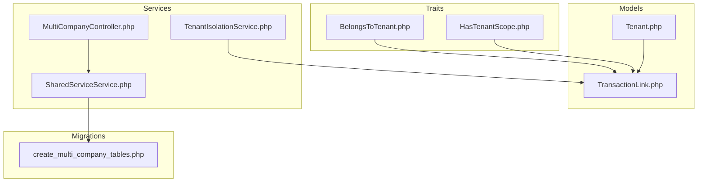
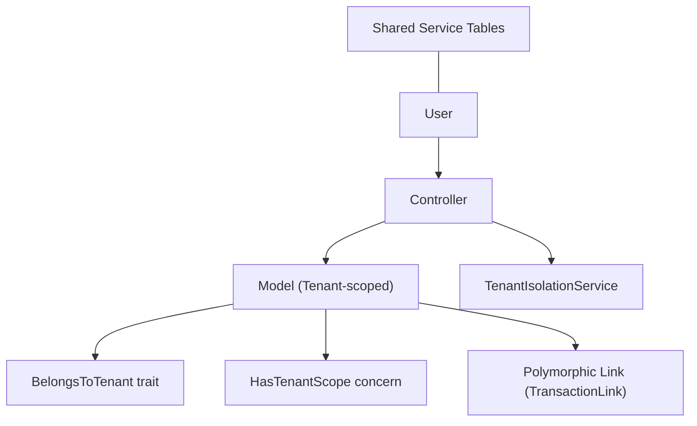
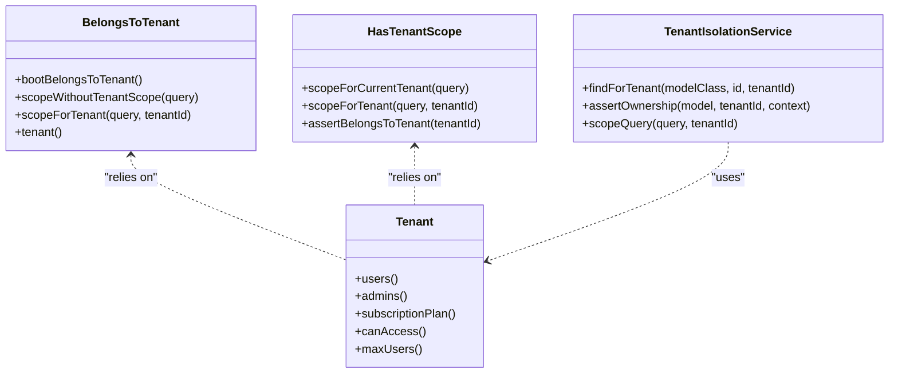
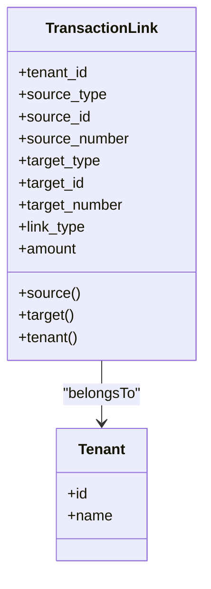
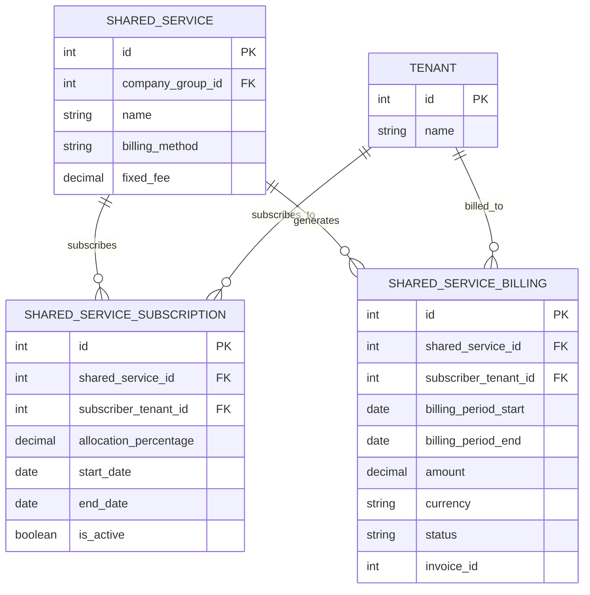
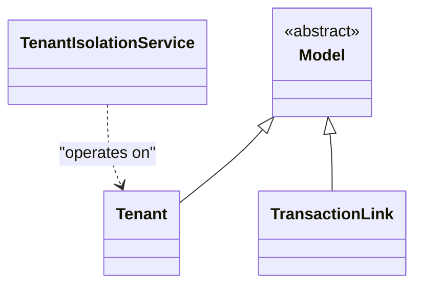
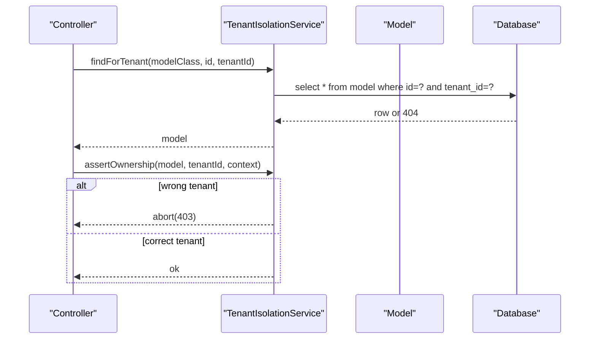
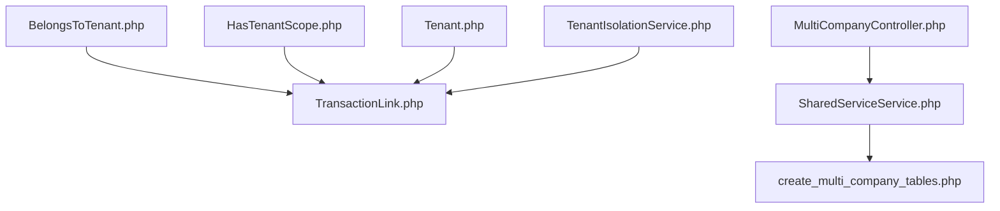

# Data Modeling Patterns

<cite>
**Referenced Files in This Document**
- [BelongsToTenant.php](file://app/Traits/BelongsToTenant.php)
- [HasTenantScope.php](file://app/Models/Concerns/HasTenantScope.php)
- [Tenant.php](file://app/Models/Tenant.php)
- [TransactionLink.php](file://app/Models/TransactionLink.php)
- [TenantIsolationService.php](file://app/Services/TenantIsolationService.php)
- [MultiCompanyController.php](file://app/Http/Controllers/MultiCompany/MultiCompanyController.php)
- [SharedServiceService.php](file://app/Services/MultiCompany/SharedServiceService.php)
- [create_multi_company_tables.php](file://database/migrations/2026_04_06_120000_create_multi_company_tables.php)
- [OrphanedDataCleanupService.php](file://app/Services/OrphanedDataCleanupService.php)
- [add-belongs-to-tenant-trait.php](file://scripts/add-belongs-to-tenant-trait.php)
- [data_retention.php](file://config/data_retention.php)
</cite>

## Table of Contents
1. [Introduction](#introduction)
2. [Project Structure](#project-structure)
3. [Core Components](#core-components)
4. [Architecture Overview](#architecture-overview)
5. [Detailed Component Analysis](#detailed-component-analysis)
6. [Dependency Analysis](#dependency-analysis)
7. [Performance Considerations](#performance-considerations)
8. [Troubleshooting Guide](#troubleshooting-guide)
9. [Conclusion](#conclusion)

## Introduction
This document describes the data modeling patterns used in Qalcuity ERP to achieve tenant scoping, polymorphic associations, and shared resource modeling. It explains how tenant isolation is enforced via traits and services, how polymorphic links connect unrelated transaction types, and how shared services are modeled across tenants. It also covers data segregation strategies, cross-tenant relationships, performance optimization techniques, and practical examples of tenant-aware queries and model configurations.

## Project Structure
Qalcuity ERP organizes tenant-aware models and services under dedicated namespaces:
- Traits for tenant scoping live under app/Traits
- Model concerns for tenant scopes live under app/Models/Concerns
- Tenant and related models live under app/Models
- Services enforcing isolation and managing shared resources live under app/Services
- Shared resource tables are defined in database/migrations
- Scripts assist in applying tenant scoping to models

**Diagram sources**
- [BelongsToTenant.php:1-110](file://app/Traits/BelongsToTenant.php#L1-L110)
- [HasTenantScope.php:1-56](file://app/Models/Concerns/HasTenantScope.php#L1-L56)
- [Tenant.php:1-223](file://app/Models/Tenant.php#L1-L223)
- [TransactionLink.php:1-46](file://app/Models/TransactionLink.php#L1-L46)
- [TenantIsolationService.php:1-66](file://app/Services/TenantIsolationService.php#L1-L66)
- [MultiCompanyController.php:331-374](file://app/Http/Controllers/MultiCompany/MultiCompanyController.php#L331-L374)
- [SharedServiceService.php:38-180](file://app/Services/MultiCompany/SharedServiceService.php#L38-L180)
- [create_multi_company_tables.php:144-169](file://database/migrations/2026_04_06_120000_create_multi_company_tables.php#L144-L169)

**Section sources**
- [BelongsToTenant.php:1-110](file://app/Traits/BelongsToTenant.php#L1-L110)
- [HasTenantScope.php:1-56](file://app/Models/Concerns/HasTenantScope.php#L1-L56)
- [Tenant.php:1-223](file://app/Models/Tenant.php#L1-L223)
- [TransactionLink.php:1-46](file://app/Models/TransactionLink.php#L1-L46)
- [TenantIsolationService.php:1-66](file://app/Services/TenantIsolationService.php#L1-L66)
- [MultiCompanyController.php:331-374](file://app/Http/Controllers/MultiCompany/MultiCompanyController.php#L331-L374)
- [SharedServiceService.php:38-180](file://app/Services/MultiCompany/SharedServiceService.php#L38-L180)
- [create_multi_company_tables.php:144-169](file://database/migrations/2026_04_06_120000_create_multi_company_tables.php#L144-L169)

## Core Components
- BelongsToTenant trait: Adds a global scope to filter queries by tenant and auto-sets tenant_id on creation, with bypass for super-admins and helpers to bypass or force a tenant scope.
- HasTenantScope concern: Provides convenient scopes for current and specific tenant filtering and ownership assertions for models that require tenant scoping but are not globally scoped.
- Tenant model: Central entity representing tenants, with helper methods for plan checks, limits, and module enablement.
- TransactionLink model: Polymorphic link between any two tenant-scoped models, enabling cross-document relationships without tight coupling.
- TenantIsolationService: Enforces tenant isolation at runtime, finds tenant-scoped records safely, asserts ownership, and scopes queries.
- Shared services: Multi-company shared services with subscriptions and billing across tenants, modeled via dedicated tables and controllers/services.

**Section sources**
- [BelongsToTenant.php:32-110](file://app/Traits/BelongsToTenant.php#L32-L110)
- [HasTenantScope.php:23-56](file://app/Models/Concerns/HasTenantScope.php#L23-L56)
- [Tenant.php:10-135](file://app/Models/Tenant.php#L10-L135)
- [TransactionLink.php:11-46](file://app/Models/TransactionLink.php#L11-L46)
- [TenantIsolationService.php:16-66](file://app/Services/TenantIsolationService.php#L16-L66)
- [create_multi_company_tables.php:144-169](file://database/migrations/2026_04_06_120000_create_multi_company_tables.php#L144-L169)

## Architecture Overview
The system enforces tenant isolation at multiple layers:
- Automatic tenant scoping via traits on models
- Explicit tenant scoping via model concerns
- Runtime enforcement via a dedicated service
- Polymorphic linking for cross-document relationships
- Shared services across tenants with explicit tenant foreign keys and indexes

**Diagram sources**
- [BelongsToTenant.php:37-70](file://app/Traits/BelongsToTenant.php#L37-L70)
- [HasTenantScope.php:29-45](file://app/Models/Concerns/HasTenantScope.php#L29-L45)
- [TenantIsolationService.php:25-40](file://app/Services/TenantIsolationService.php#L25-L40)
- [TransactionLink.php:25-26](file://app/Models/TransactionLink.php#L25-L26)
- [create_multi_company_tables.php:144-169](file://database/migrations/2026_04_06_120000_create_multi_company_tables.php#L144-L169)

## Detailed Component Analysis

### Tenant Scoping Patterns
Two complementary approaches are used:
- Global scope via BelongsToTenant trait: Automatically filters queries and sets tenant_id on create for models that must never leak across tenants.
- Helper scopes via HasTenantScope concern: Provides convenient scopes for models that are not globally scoped but still benefit from tenant-aware queries.

**Diagram sources**
- [BelongsToTenant.php:32-110](file://app/Traits/BelongsToTenant.php#L32-L110)
- [HasTenantScope.php:23-56](file://app/Models/Concerns/HasTenantScope.php#L23-L56)
- [Tenant.php:77-90](file://app/Models/Tenant.php#L77-L90)
- [TenantIsolationService.php:16-66](file://app/Services/TenantIsolationService.php#L16-L66)

Key behaviors:
- Global scope applies tenant filtering unless the user is super-admin or there is no authenticated user context.
- Creating new records auto-assigns tenant_id from the current user when applicable.
- Helper scopes and assertions provide safe tenant-aware access for controllers and services.

**Section sources**
- [BelongsToTenant.php:37-70](file://app/Traits/BelongsToTenant.php#L37-L70)
- [HasTenantScope.php:29-54](file://app/Models/Concerns/HasTenantScope.php#L29-L54)
- [TenantIsolationService.php:25-56](file://app/Services/TenantIsolationService.php#L25-L56)

### Polymorphic Associations and Cross-Tenant Links
Cross-document relationships are modeled using polymorphic morphTo relations. The TransactionLink model stores links between any two tenant-scoped entities, identified by type and id, and includes optional numbers and amounts.

**Diagram sources**
- [TransactionLink.php:11-27](file://app/Models/TransactionLink.php#L11-L27)
- [Tenant.php:10-47](file://app/Models/Tenant.php#L10-L47)

Practical usage patterns:
- Create a link between two tenant-scoped models by specifying tenant_id, source and target polymorphic identifiers, and link type.
- Retrieve source and target polymorphic relations for navigation.

**Section sources**
- [TransactionLink.php:11-46](file://app/Models/TransactionLink.php#L11-L46)

### Shared Resource Modeling Across Tenants
Shared services are modeled with explicit tenant foreign keys and indexes to support multi-tenant billing and subscriptions. The schema defines:
- Subscriptions per tenant to a shared service
- Billings generated per subscriber with status and invoice linkage

**Diagram sources**
- [create_multi_company_tables.php:144-169](file://database/migrations/2026_04_06_120000_create_multi_company_tables.php#L144-L169)

Operational flows:
- Subscribe a tenant to a shared service with an allocation percentage.
- Generate billings for a period across active subscriptions.
- Mark billings as invoiced or paid.

**Section sources**
- [MultiCompanyController.php:333-374](file://app/Http/Controllers/MultiCompany/MultiCompanyController.php#L333-L374)
- [SharedServiceService.php:57-131](file://app/Services/MultiCompany/SharedServiceService.php#L57-L131)

### Model Inheritance and Relationship Configurations
- Models using BelongsToTenant gain automatic tenant scoping and tenant_id assignment on create.
- Models using HasTenantScope gain convenient scopes and ownership assertions without global scope.
- Tenant model encapsulates plan and access checks, and exposes relationships to users and subscription plans.

**Diagram sources**
- [Tenant.php:10-90](file://app/Models/Tenant.php#L10-L90)
- [TransactionLink.php:11-27](file://app/Models/TransactionLink.php#L11-L27)
- [TenantIsolationService.php:16-66](file://app/Services/TenantIsolationService.php#L16-L66)

**Section sources**
- [Tenant.php:77-90](file://app/Models/Tenant.php#L77-L90)
- [TransactionLink.php:23-26](file://app/Models/TransactionLink.php#L23-L26)

### Data Segregation Strategies and Cross-Tenant Relationships
- Global tenant scoping via BelongsToTenant ensures tenant isolation for sensitive models.
- Helper scopes via HasTenantScope allow controlled tenant filtering for non-globally-scoped models.
- TenantIsolationService centralizes safety checks for controller-level operations.
- Polymorphic TransactionLink enables cross-document relationships within a tenant boundary.
- Shared services maintain tenant boundaries with explicit foreign keys and indexes.

**Diagram sources**
- [TenantIsolationService.php:25-56](file://app/Services/TenantIsolationService.php#L25-L56)

**Section sources**
- [BelongsToTenant.php:37-70](file://app/Traits/BelongsToTenant.php#L37-L70)
- [HasTenantScope.php:29-54](file://app/Models/Concerns/HasTenantScope.php#L29-L54)
- [TenantIsolationService.php:25-56](file://app/Services/TenantIsolationService.php#L25-L56)

### Examples of Tenant-Aware Queries and Access Patterns
- Using BelongsToTenant: All queries automatically filter by tenant_id; bypass or force scope via helper methods.
- Using HasTenantScope: Apply scopes forCurrentTenant or forTenant in controllers.
- Using TenantIsolationService: Use findForTenant to safely fetch records and assertOwnership before mutations.

**Section sources**
- [BelongsToTenant.php:82-100](file://app/Traits/BelongsToTenant.php#L82-L100)
- [HasTenantScope.php:29-45](file://app/Models/Concerns/HasTenantScope.php#L29-L45)
- [TenantIsolationService.php:25-56](file://app/Services/TenantIsolationService.php#L25-L56)

### Data Integrity Constraints and Indexing Strategies
- Foreign keys ensure referential integrity for shared services and subscriptions.
- Unique composite indexes prevent duplicate subscriptions and support fast lookups.
- Indexes on is_active and tenant_id improve query performance for active subscriptions and tenant-scoped queries.

**Section sources**
- [create_multi_company_tables.php:144-169](file://database/migrations/2026_04_06_120000_create_multi_company_tables.php#L144-L169)

### Query Optimization for Multi-Tenant Scenarios
- Prefer tenant_id in WHERE clauses and JOINs to leverage indexes.
- Use scopes provided by HasTenantScope to consistently apply tenant filters.
- For batch operations across tenants, use explicit tenant scoping and avoid global scopes when unnecessary.
- Keep shared service billing generation bounded by active subscriptions and date ranges.

**Section sources**
- [HasTenantScope.php:29-45](file://app/Models/Concerns/HasTenantScope.php#L29-L45)
- [SharedServiceService.php:57-87](file://app/Services/MultiCompany/SharedServiceService.php#L57-L87)

## Dependency Analysis
The following diagram shows key dependencies among tenant scoping components and shared services:

**Diagram sources**
- [BelongsToTenant.php:32-110](file://app/Traits/BelongsToTenant.php#L32-L110)
- [HasTenantScope.php:23-56](file://app/Models/Concerns/HasTenantScope.php#L23-L56)
- [Tenant.php:10-90](file://app/Models/Tenant.php#L10-L90)
- [TransactionLink.php:11-46](file://app/Models/TransactionLink.php#L11-L46)
- [TenantIsolationService.php:16-66](file://app/Services/TenantIsolationService.php#L16-L66)
- [MultiCompanyController.php:333-374](file://app/Http/Controllers/MultiCompany/MultiCompanyController.php#L333-L374)
- [SharedServiceService.php:57-131](file://app/Services/MultiCompany/SharedServiceService.php#L57-L131)
- [create_multi_company_tables.php:144-169](file://database/migrations/2026_04_06_120000_create_multi_company_tables.php#L144-L169)

**Section sources**
- [BelongsToTenant.php:32-110](file://app/Traits/BelongsToTenant.php#L32-L110)
- [HasTenantScope.php:23-56](file://app/Models/Concerns/HasTenantScope.php#L23-L56)
- [Tenant.php:10-90](file://app/Models/Tenant.php#L10-L90)
- [TransactionLink.php:11-46](file://app/Models/TransactionLink.php#L11-L46)
- [TenantIsolationService.php:16-66](file://app/Services/TenantIsolationService.php#L16-L66)
- [MultiCompanyController.php:333-374](file://app/Http/Controllers/MultiCompany/MultiCompanyController.php#L333-L374)
- [SharedServiceService.php:57-131](file://app/Services/MultiCompany/SharedServiceService.php#L57-L131)
- [create_multi_company_tables.php:144-169](file://database/migrations/2026_04_06_120000_create_multi_company_tables.php#L144-L169)

## Performance Considerations
- Index tenant_id on all tenant-scoped tables to speed up global scope filtering and joins.
- Add composite indexes for frequently filtered pairs (e.g., tenant_id + status, tenant_id + created_at).
- Use scopes from HasTenantScope to ensure consistent filtering and leverage indexes.
- For shared services, index subscriber_tenant_id and shared_service_id to accelerate billing generation and subscription lookups.
- Consider partitioning or archiving historical data for models with high write volumes (see retention policies).

[No sources needed since this section provides general guidance]

## Troubleshooting Guide
Common issues and resolutions:
- Unauthorized access attempts: Use TenantIsolationService.assertOwnership to detect and log violations with context.
- Missing tenant_id on create: Ensure BelongsToTenant is applied and the user has a tenant_id; otherwise manually set tenant_id before save.
- Cross-tenant data leakage: Verify that sensitive models use BelongsToTenant and that controllers do not bypass scopes unnecessarily.
- Orphaned records: Use OrphanedDataCleanupService to identify and clean references to missing parent records, with tenant_scoped flag indicating whether the reference table is tenant-scoped.

**Section sources**
- [TenantIsolationService.php:39-56](file://app/Services/TenantIsolationService.php#L39-L56)
- [BelongsToTenant.php:56-69](file://app/Traits/BelongsToTenant.php#L56-L69)
- [OrphanedDataCleanupService.php:45-115](file://app/Services/OrphanedDataCleanupService.php#L45-L115)

## Conclusion
Qalcuity ERP employs a layered approach to tenant isolation: automatic global scoping via BelongsToTenant, helper scopes via HasTenantScope, and runtime enforcement via TenantIsolationService. Polymorphic TransactionLink supports flexible cross-document relationships within tenants, while shared services are modeled with explicit tenant foreign keys and indexes to enable multi-tenant billing. Combined with targeted indexing and retention policies, these patterns deliver secure, scalable, and maintainable multi-tenant data management.