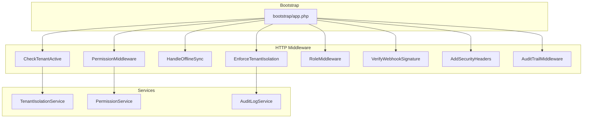
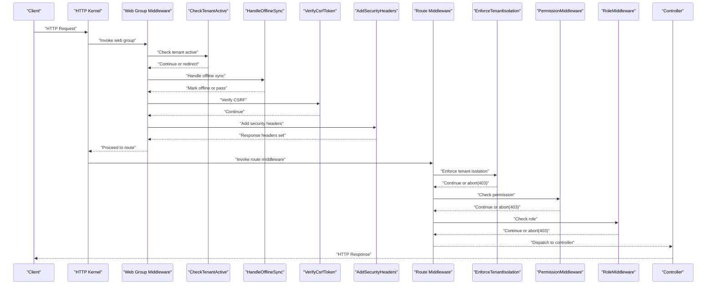
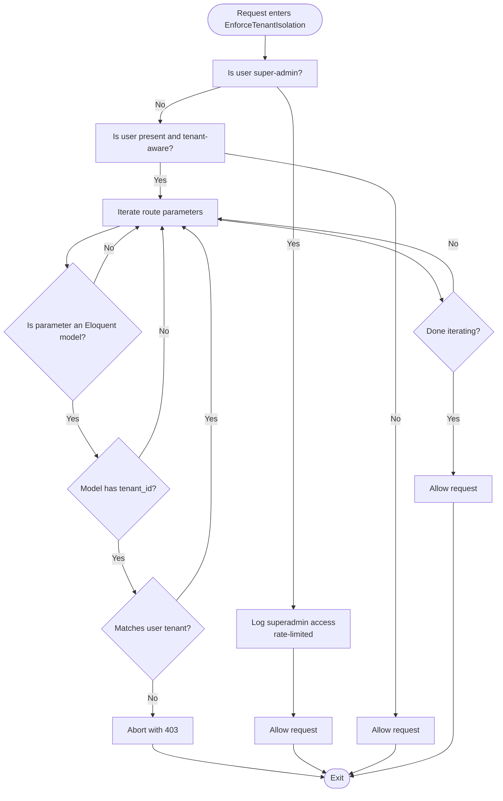
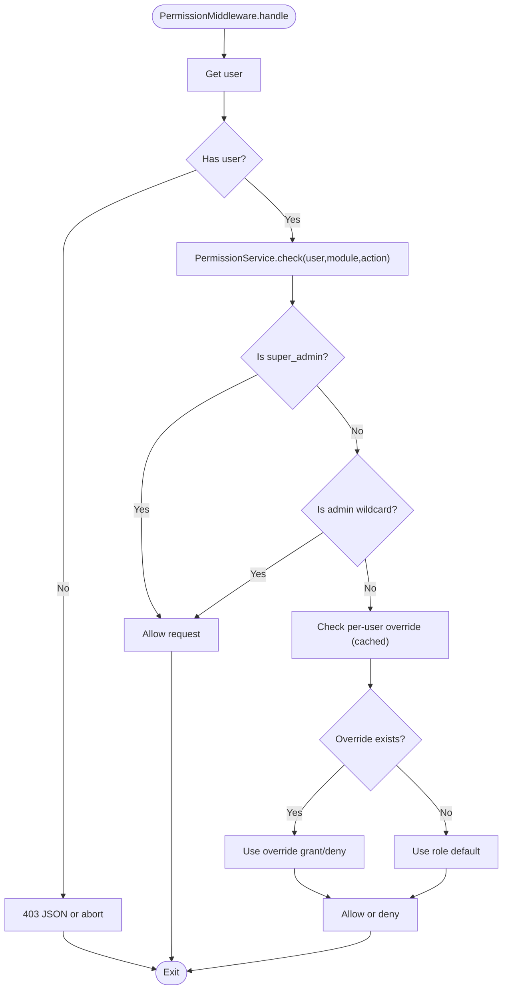
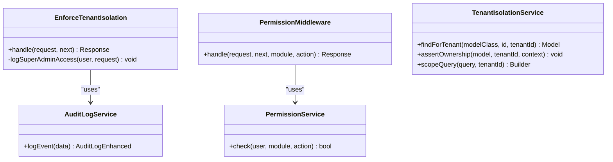

# Middleware Stack & Cross-Cutting Concerns

<cite>
**Referenced Files in This Document**
- [bootstrap/app.php](file://bootstrap/app.php)
- [EnforceTenantIsolation.php](file://app/Http/Middleware/EnforceTenantIsolation.php)
- [CheckTenantActive.php](file://app/Http/Middleware/CheckTenantActive.php)
- [HandleOfflineSync.php](file://app/Http/Middleware/HandleOfflineSync.php)
- [PermissionMiddleware.php](file://app/Http/Middleware/PermissionMiddleware.php)
- [RoleMiddleware.php](file://app/Http/Middleware/RoleMiddleware.php)
- [VerifyWebhookSignature.php](file://app/Http/Middleware/VerifyWebhookSignature.php)
- [AddSecurityHeaders.php](file://app/Http/Middleware/AddSecurityHeaders.php)
- [AuditTrailMiddleware.php](file://app/Http/Middleware/AuditTrailMiddleware.php)
- [TenantIsolationService.php](file://app/Services/TenantIsolationService.php)
- [PermissionService.php](file://app/Services/PermissionService.php)
- [AuditLogService.php](file://app/Services/Security/AuditLogService.php)
</cite>

## Table of Contents
1. [Introduction](#introduction)
2. [Project Structure](#project-structure)
3. [Core Components](#core-components)
4. [Architecture Overview](#architecture-overview)
5. [Detailed Component Analysis](#detailed-component-analysis)
6. [Dependency Analysis](#dependency-analysis)
7. [Performance Considerations](#performance-considerations)
8. [Troubleshooting Guide](#troubleshooting-guide)
9. [Conclusion](#conclusion)

## Introduction
This document explains Qalcuity ERP’s middleware architecture and cross-cutting concerns. It covers the middleware pipeline, tenant isolation enforcement, audit trail generation, permission checking, request/response transformation patterns, error handling strategies, and practical guidance for implementing custom middleware, security middleware, and offline sync handling. It also addresses performance impacts, caching strategies, and middleware composition patterns.

## Project Structure
Qalcuity organizes middleware and cross-cutting services under dedicated namespaces:
- Middleware: app/Http/Middleware/*
- Services: app/Services/* and app/Services/Security/*
- Global middleware registration and groups: bootstrap/app.php

**Diagram sources**
- [bootstrap/app.php:18-55](file://bootstrap/app.php#L18-L55)
- [EnforceTenantIsolation.php:19-26](file://app/Http/Middleware/EnforceTenantIsolation.php#L19-L26)
- [PermissionMiddleware.php:10-12](file://app/Http/Middleware/PermissionMiddleware.php#L10-L12)
- [TenantIsolationService.php:16-16](file://app/Services/TenantIsolationService.php#L16-L16)
- [PermissionService.php:9-9](file://app/Services/PermissionService.php#L9-L9)
- [AuditLogService.php:8-8](file://app/Services/Security/AuditLogService.php#L8-L8)

**Section sources**
- [bootstrap/app.php:18-55](file://bootstrap/app.php#L18-L55)

## Core Components
- Middleware aliases and group registration define the cross-cutting concerns applied globally or per-route group.
- Tenant isolation middleware validates route-bound models and enforces tenant ownership.
- Permission and role middleware provide authorization checks.
- Security headers middleware hardens responses.
- Audit trail middleware logs access and after-hours usage.
- Offline sync middleware adapts redirects for service workers.
- Services encapsulate isolation checks, permission resolution, and audit logging.

**Section sources**
- [bootstrap/app.php:19-41](file://bootstrap/app.php#L19-L41)
- [bootstrap/app.php:46-51](file://bootstrap/app.php#L46-L51)
- [EnforceTenantIsolation.php:28-159](file://app/Http/Middleware/EnforceTenantIsolation.php#L28-L159)
- [PermissionMiddleware.php:18-30](file://app/Http/Middleware/PermissionMiddleware.php#L18-L30)
- [RoleMiddleware.php:15-23](file://app/Http/Middleware/RoleMiddleware.php#L15-L23)
- [AddSecurityHeaders.php:19-46](file://app/Http/Middleware/AddSecurityHeaders.php#L19-L46)
- [AuditTrailMiddleware.php:17-107](file://app/Http/Middleware/AuditTrailMiddleware.php#L17-L107)
- [HandleOfflineSync.php:20-42](file://app/Http/Middleware/HandleOfflineSync.php#L20-L42)
- [TenantIsolationService.php:25-65](file://app/Services/TenantIsolationService.php#L25-L65)
- [PermissionService.php:207-227](file://app/Services/PermissionService.php#L207-L227)
- [AuditLogService.php:13-81](file://app/Services/Security/AuditLogService.php#L13-L81)

## Architecture Overview
The middleware stack is registered globally and in the web group. The tenant isolation middleware runs per-route group because it requires route parameters. The permission and role middleware are attached per-route. Security headers are applied to all responses. Audit trail middleware logs access and after-hours usage. Offline sync middleware transforms redirect responses for service workers.

**Diagram sources**
- [bootstrap/app.php:46-51](file://bootstrap/app.php#L46-L51)
- [CheckTenantActive.php:11-36](file://app/Http/Middleware/CheckTenantActive.php#L11-L36)
- [HandleOfflineSync.php:20-42](file://app/Http/Middleware/HandleOfflineSync.php#L20-L42)
- [AddSecurityHeaders.php:19-46](file://app/Http/Middleware/AddSecurityHeaders.php#L19-L46)
- [EnforceTenantIsolation.php:28-159](file://app/Http/Middleware/EnforceTenantIsolation.php#L28-L159)
- [PermissionMiddleware.php:18-30](file://app/Http/Middleware/PermissionMiddleware.php#L18-L30)
- [RoleMiddleware.php:15-23](file://app/Http/Middleware/RoleMiddleware.php#L15-L23)

## Detailed Component Analysis

### Tenant Isolation Enforcement
- Purpose: Ensure users access only their tenant’s data. Super-admin bypass is logged for compliance.
- Mechanism:
  - Route parameter validation: Iterates bound models and compares tenant_id with user’s tenant.
  - Super-admin audit: Logs access events with rate limiting.
  - Non-tenant-aware guests: Bypassed.

**Diagram sources**
- [EnforceTenantIsolation.php:28-159](file://app/Http/Middleware/EnforceTenantIsolation.php#L28-L159)

**Section sources**
- [EnforceTenantIsolation.php:28-159](file://app/Http/Middleware/EnforceTenantIsolation.php#L28-L159)
- [TenantIsolationService.php:25-65](file://app/Services/TenantIsolationService.php#L25-L65)

### Permission Checking Mechanism
- Purpose: Enforce module-action permissions with role defaults and per-user overrides.
- Mechanism:
  - Priority: super_admin/admin wildcard → per-user override (cached) → role default.
  - Overrides stored in UserPermission and cached per user.
  - Route usage: ->middleware('permission:module,action').

**Diagram sources**
- [PermissionMiddleware.php:18-30](file://app/Http/Middleware/PermissionMiddleware.php#L18-L30)
- [PermissionService.php:207-227](file://app/Services/PermissionService.php#L207-L227)
- [PermissionService.php:232-251](file://app/Services/PermissionService.php#L232-L251)
- [PermissionService.php:256-265](file://app/Services/PermissionService.php#L256-L265)

**Section sources**
- [PermissionMiddleware.php:18-30](file://app/Http/Middleware/PermissionMiddleware.php#L18-L30)
- [PermissionService.php:207-227](file://app/Services/PermissionService.php#L207-L227)
- [PermissionService.php:232-251](file://app/Services/PermissionService.php#L232-L251)
- [PermissionService.php:256-265](file://app/Services/PermissionService.php#L256-L265)

### Role-Based Access Control
- Purpose: Restrict routes to specific roles or role sets.
- Mechanism: ->middleware('role:admin,manager').

**Section sources**
- [RoleMiddleware.php:15-23](file://app/Http/Middleware/RoleMiddleware.php#L15-L23)

### Security Headers Middleware
- Purpose: Harden responses with security headers (X-Frame-Options, X-Content-Type-Options, CSP, etc.).
- Mechanism: Applies headers to all responses in the web group.

**Section sources**
- [AddSecurityHeaders.php:19-46](file://app/Http/Middleware/AddSecurityHeaders.php#L19-L46)

### Audit Trail Middleware (Healthcare)
- Purpose: Log access attempts, after-hours usage, and cross-department access for compliance.
- Mechanism: Creates audit log entries and channels warnings to healthcare_audit log channel.

**Section sources**
- [AuditTrailMiddleware.php:17-107](file://app/Http/Middleware/AuditTrailMiddleware.php#L17-L107)

### Offline Sync Handling
- Purpose: Adapt responses for service worker-driven offline sync (convert redirect to JSON when applicable).
- Mechanism: Detects X-Offline-Sync header and transforms redirect responses.

**Section sources**
- [HandleOfflineSync.php:20-42](file://app/Http/Middleware/HandleOfflineSync.php#L20-L42)

### Webhook Signature Verification
- Purpose: Verify webhook authenticity for payment gateways (Midtrans, Xendit).
- Mechanism: Gateway-specific signature computation and constant-time comparison.

**Section sources**
- [VerifyWebhookSignature.php:16-33](file://app/Http/Middleware/VerifyWebhookSignature.php#L16-L33)
- [VerifyWebhookSignature.php:35-58](file://app/Http/Middleware/VerifyWebhookSignature.php#L35-L58)

### Tenant Active Check
- Purpose: Redirect inactive tenants or expired subscriptions to appropriate pages.
- Mechanism: Skips for super_admin and affiliate; otherwise checks tenant.canAccess().

**Section sources**
- [CheckTenantActive.php:11-36](file://app/Http/Middleware/CheckTenantActive.php#L11-L36)

## Dependency Analysis
- Middleware aliasing and grouping are configured centrally in bootstrap/app.php.
- EnforceTenantIsolation depends on AuditLogService for compliance logging.
- PermissionMiddleware depends on PermissionService for authorization decisions.
- TenantIsolationService supports controller-level safe lookups and ownership assertions.

**Diagram sources**
- [EnforceTenantIsolation.php:21-26](file://app/Http/Middleware/EnforceTenantIsolation.php#L21-L26)
- [AuditLogService.php:13-32](file://app/Services/Security/AuditLogService.php#L13-L32)
- [PermissionMiddleware.php:12-12](file://app/Http/Middleware/PermissionMiddleware.php#L12-L12)
- [PermissionService.php:207-227](file://app/Services/PermissionService.php#L207-L227)
- [TenantIsolationService.php:25-65](file://app/Services/TenantIsolationService.php#L25-L65)

**Section sources**
- [bootstrap/app.php:19-41](file://bootstrap/app.php#L19-L41)
- [EnforceTenantIsolation.php:21-26](file://app/Http/Middleware/EnforceTenantIsolation.php#L21-L26)
- [PermissionMiddleware.php:12-12](file://app/Http/Middleware/PermissionMiddleware.php#L12-L12)
- [TenantIsolationService.php:25-65](file://app/Services/TenantIsolationService.php#L25-L65)

## Performance Considerations
- Middleware ordering matters: put fast checks early (role/permission) before heavier ones (tenant isolation).
- Caching:
  - PermissionService caches per-user overrides for 10 minutes to reduce DB queries.
  - EnforceTenantIsolation uses route parameter iteration; keep tenantModels list focused to minimize reflection overhead.
- Logging:
  - AuditTrailMiddleware writes to database and healthcare_audit channel; consider batching or async logging for high throughput.
  - Super-admin access logging is rate-limited to avoid excessive entries.
- Response headers:
  - AddSecurityHeaders adds CSP and other headers; ensure policies are minimal yet effective to avoid resource loading delays.

**Section sources**
- [PermissionService.php:235-242](file://app/Services/PermissionService.php#L235-L242)
- [EnforceTenantIsolation.php:164-190](file://app/Http/Middleware/EnforceTenantIsolation.php#L164-L190)
- [AuditTrailMiddleware.php:39-63](file://app/Http/Middleware/AuditTrailMiddleware.php#L39-L63)

## Troubleshooting Guide
- 403 errors during tenant access:
  - Verify user tenant_id matches route-bound model’s tenant_id.
  - Confirm EnforceTenantIsolation is applied in the correct route group.
- Permission denials:
  - Check PermissionService.check() precedence and cached overrides.
  - Ensure module/action exists in PermissionService::MODULES.
- After-hours alerts:
  - Confirm healthcare business hours configuration and timezone settings.
- Offline sync redirect anomalies:
  - Ensure X-Offline-Sync header is present and response expects JSON.
- Webhook verification failures:
  - Validate gateway-specific keys and payload fields.
- Exception logging:
  - Centralized reporting avoids recursion by writing directly to database via ErrorContextEnricher.

**Section sources**
- [EnforceTenantIsolation.php:153-155](file://app/Http/Middleware/EnforceTenantIsolation.php#L153-L155)
- [PermissionService.php:207-227](file://app/Services/PermissionService.php#L207-L227)
- [AuditTrailMiddleware.php:112-128](file://app/Http/Middleware/AuditTrailMiddleware.php#L112-L128)
- [HandleOfflineSync.php:22-42](file://app/Http/Middleware/HandleOfflineSync.php#L22-L42)
- [VerifyWebhookSignature.php:24-30](file://app/Http/Middleware/VerifyWebhookSignature.php#L24-L30)
- [bootstrap/app.php:56-87](file://bootstrap/app.php#L56-L87)

## Conclusion
Qalcuity ERP’s middleware stack provides robust tenant isolation, granular permission checks, security hardening, audit logging, and offline sync support. Proper middleware ordering, caching strategies, and service-layer abstractions enable scalable and maintainable cross-cutting concerns. Extending the stack follows established patterns: register aliases, compose groups, and leverage services for reusable logic.