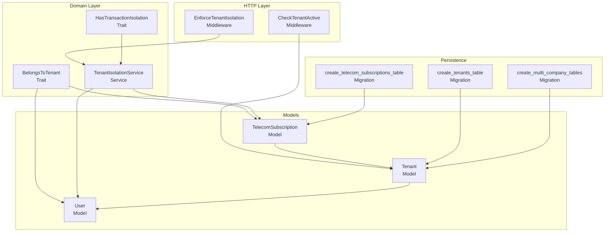
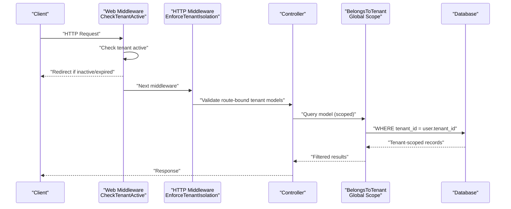
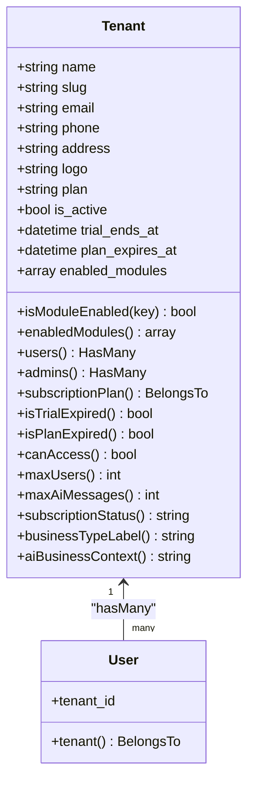
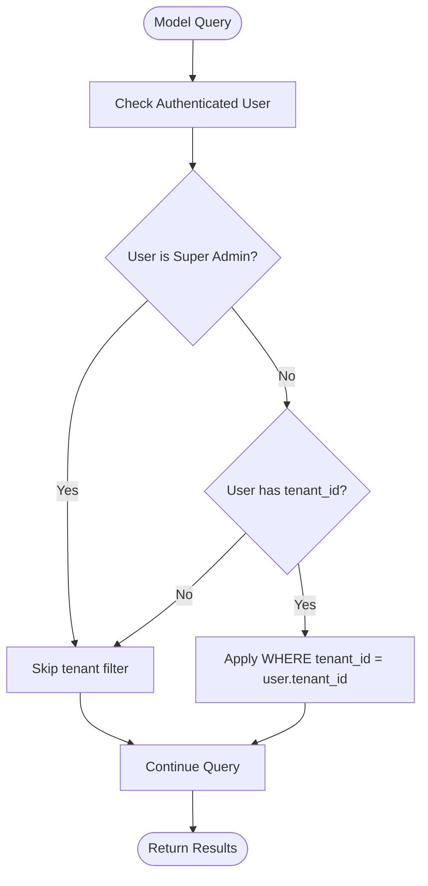
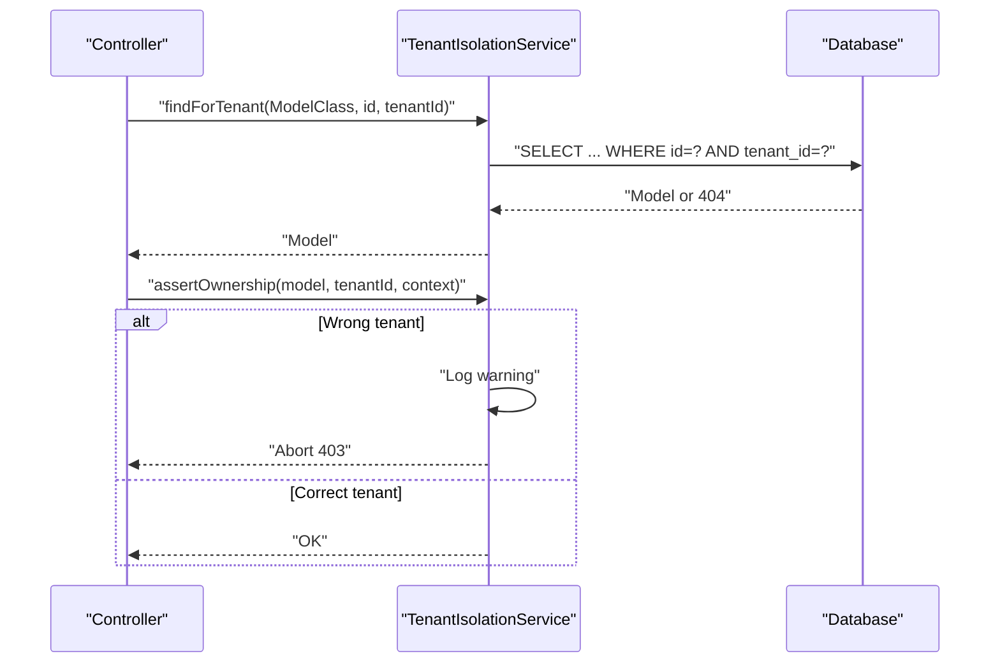
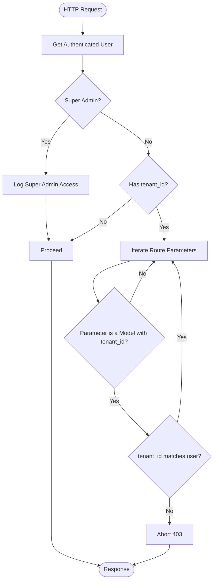
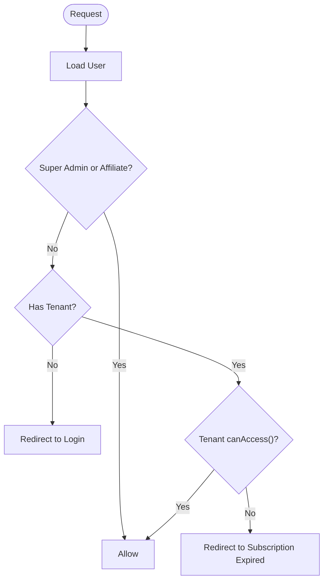
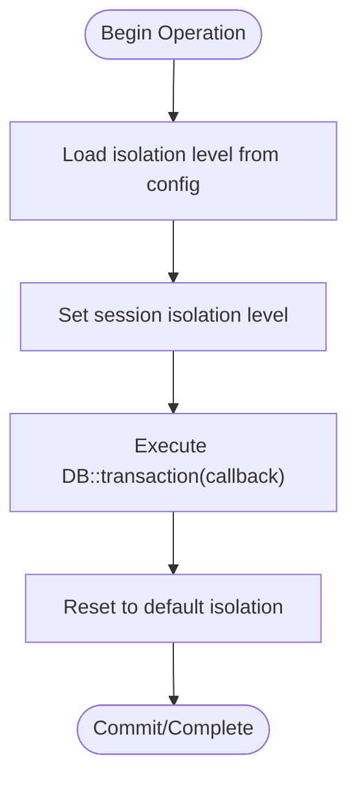
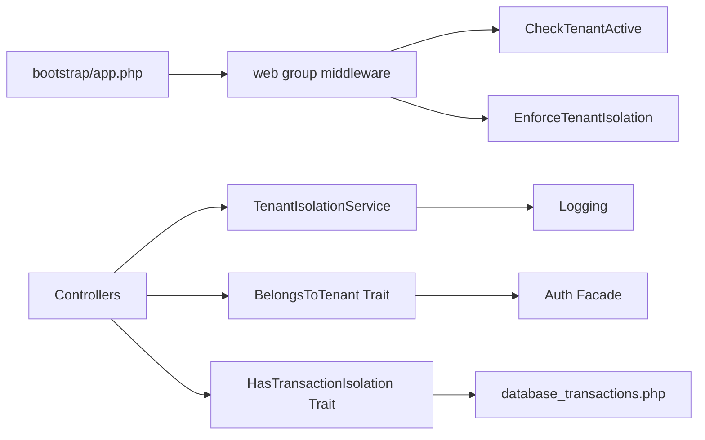

# Multi-Tenant Architecture

<cite>
**Referenced Files in This Document**
- [Tenant.php](file://app/Models/Tenant.php)
- [User.php](file://app/Models/User.php)
- [BelongsToTenant.php](file://app/Traits/BelongsToTenant.php)
- [TenantIsolationService.php](file://app/Services/TenantIsolationService.php)
- [EnforceTenantIsolation.php](file://app/Http/Middleware/EnforceTenantIsolation.php)
- [CheckTenantActive.php](file://app/Http/Middleware/CheckTenantActive.php)
- [HasTransactionIsolation.php](file://app/Traits/HasTransactionIsolation.php)
- [database_transactions.php](file://config/database_transactions.php)
- [0000_01_01_000000_create_tenants_table.php](file://database/migrations/0000_01_01_000000_create_tenants_table.php)
- [2026_04_04_000003_create_telecom_subscriptions_table.php](file://database/migrations/2026_04_04_000003_create_telecom_subscriptions_table.php)
- [2026_04_06_120000_create_multi_company_tables.php](file://database/migrations/2026_04_06_120000_create_multi_company_tables.php)
- [app.php](file://bootstrap/app.php)
- [routes/web.php](file://routes/web.php)
- [CustomerController.php](file://app/Http/Controllers/Telecom/CustomerController.php)
- [TelecomSubscription.php](file://app/Models/TelecomSubscription.php)
- [TenantDataMigrationService.php](file://app/Services/TenantDataMigrationService.php)
- [add-belongs-to-tenant-trait.php](file://scripts/add-belongs-to-tenant-trait.php)
- [audit-tenant-indexes.php](file://scripts/audit-tenant-indexes.php)
- [tenant-index-audit.json](file://scripts/tenant-index-audit.json)
</cite>

## Table of Contents
1. [Introduction](#introduction)
2. [Project Structure](#project-structure)
3. [Core Components](#core-components)
4. [Architecture Overview](#architecture-overview)
5. [Detailed Component Analysis](#detailed-component-analysis)
6. [Dependency Analysis](#dependency-analysis)
7. [Performance Considerations](#performance-considerations)
8. [Troubleshooting Guide](#troubleshooting-guide)
9. [Conclusion](#conclusion)
10. [Appendices](#appendices)

## Introduction
This document explains Qalcuity ERP’s multi-tenant architecture with a focus on tenant isolation, database schema design, shared versus isolated resources, and tenant scoping strategies. It documents the Tenant model, tenant-aware traits, middleware enforcement, and service-layer patterns. It also covers data segregation, tenant switching, resource allocation, and performance considerations, with practical examples and diagrams.

## Project Structure
Qalcuity ERP organizes multi-tenancy around:
- A central Tenant model representing each tenant account
- A BelongsToTenant trait that scopes Eloquent queries and auto-assigns tenant_id on create
- Middleware to enforce tenant isolation at the HTTP boundary
- A TenantIsolationService for safe lookups and ownership assertions
- Transaction isolation configuration for critical financial operations
- Database migrations defining tenant-scoped tables and shared services



**Diagram sources**
- [EnforceTenantIsolation.php:19-159](file://app/Http/Middleware/EnforceTenantIsolation.php#L19-L159)
- [CheckTenantActive.php:9-38](file://app/Http/Middleware/CheckTenantActive.php#L9-L38)
- [BelongsToTenant.php:32-108](file://app/Traits/BelongsToTenant.php#L32-L108)
- [TenantIsolationService.php:16-66](file://app/Services/TenantIsolationService.php#L16-L66)
- [HasTransactionIsolation.php:24-129](file://app/Traits/HasTransactionIsolation.php#L24-L129)
- [0000_01_01_000000_create_tenants_table.php:7-31](file://database/migrations/0000_01_01_000000_create_tenants_table.php#L7-L31)
- [2026_04_04_000003_create_telecom_subscriptions_table.php:7-74](file://database/migrations/2026_04_04_000003_create_telecom_subscriptions_table.php#L7-L74)
- [2026_04_06_120000_create_multi_company_tables.php:144-169](file://database/migrations/2026_04_06_120000_create_multi_company_tables.php#L144-L169)
- [Tenant.php:10-223](file://app/Models/Tenant.php#L10-L223)
- [User.php:15-137](file://app/Models/User.php#L15-L137)
- [TelecomSubscription.php:12-51](file://app/Models/TelecomSubscription.php#L12-L51)

**Section sources**
- [app.php:43-55](file://bootstrap/app.php#L43-L55)
- [routes/web.php:2705-2715](file://routes/web.php#L2705-L2715)

## Core Components
- Tenant model encapsulates tenant metadata, subscription status, module enablement, and limits.
- BelongsToTenant trait enforces tenant scoping globally and auto-sets tenant_id on create.
- TenantIsolationService provides safe lookup and ownership assertion helpers.
- EnforceTenantIsolation middleware validates route-bound tenant models and audits super admin access.
- CheckTenantActive middleware ensures logged-in users belong to an active tenant and redirects appropriately.
- HasTransactionIsolation trait configures isolation levels and row-level locking for critical operations.
- Database migrations define tenant-scoped tables and shared services for multi-company scenarios.

**Section sources**
- [Tenant.php:10-223](file://app/Models/Tenant.php#L10-L223)
- [BelongsToTenant.php:32-108](file://app/Traits/BelongsToTenant.php#L32-L108)
- [TenantIsolationService.php:16-66](file://app/Services/TenantIsolationService.php#L16-L66)
- [EnforceTenantIsolation.php:19-159](file://app/Http/Middleware/EnforceTenantIsolation.php#L19-L159)
- [CheckTenantActive.php:9-38](file://app/Http/Middleware/CheckTenantActive.php#L9-L38)
- [HasTransactionIsolation.php:24-129](file://app/Traits/HasTransactionIsolation.php#L24-L129)
- [0000_01_01_000000_create_tenants_table.php:7-31](file://database/migrations/0000_01_01_000000_create_tenants_table.php#L7-L31)
- [2026_04_04_000003_create_telecom_subscriptions_table.php:7-74](file://database/migrations/2026_04_04_000003_create_telecom_subscriptions_table.php#L7-L74)
- [2026_04_06_120000_create_multi_company_tables.php:144-169](file://database/migrations/2026_04_06_120000_create_multi_company_tables.php#L144-L169)

## Architecture Overview
The system enforces tenant isolation at three layers:
- Database: tenant_id stored on tenant-scoped tables
- Application: global scope and observers set tenant_id; middleware validates route parameters
- HTTP boundary: middleware checks tenant activity and ownership



**Diagram sources**
- [CheckTenantActive.php:9-38](file://app/Http/Middleware/CheckTenantActive.php#L9-L38)
- [EnforceTenantIsolation.php:19-159](file://app/Http/Middleware/EnforceTenantIsolation.php#L19-L159)
- [BelongsToTenant.php:38-70](file://app/Traits/BelongsToTenant.php#L38-L70)

## Detailed Component Analysis

### Tenant Model
The Tenant model stores tenant metadata, billing plan, activity status, trial expiration, and module enablement. It exposes helpers to compute limits and status, and relationship accessors for users and subscriptions.



**Diagram sources**
- [Tenant.php:10-223](file://app/Models/Tenant.php#L10-L223)
- [User.php:15-137](file://app/Models/User.php#L15-L137)

**Section sources**
- [Tenant.php:10-223](file://app/Models/Tenant.php#L10-L223)
- [User.php:15-137](file://app/Models/User.php#L15-L137)

### Tenant-Aware Trait (BelongsToTenant)
The BelongsToTenant trait adds:
- A global scope that filters all queries by the authenticated user’s tenant_id
- A creating callback that auto-sets tenant_id when missing
- Utility scopes to bypass or force tenant scoping for administrative tasks
- A tenant relationship accessor



**Diagram sources**
- [BelongsToTenant.php:38-70](file://app/Traits/BelongsToTenant.php#L38-L70)

**Section sources**
- [BelongsToTenant.php:32-108](file://app/Traits/BelongsToTenant.php#L32-L108)

### Tenant Isolation Service
TenantIsolationService provides:
- Safe lookup by ID with tenant scoping
- Ownership assertion with logging
- Query scoping helper



**Diagram sources**
- [TenantIsolationService.php:25-56](file://app/Services/TenantIsolationService.php#L25-L56)

**Section sources**
- [TenantIsolationService.php:16-66](file://app/Services/TenantIsolationService.php#L16-L66)

### Middleware: EnforceTenantIsolation
This middleware:
- Allows super admins with audit logging
- Skips isolation for guests or users without tenant_id
- Validates route-bound models for tenant ownership
- Prevents unauthorized access across tenants



**Diagram sources**
- [EnforceTenantIsolation.php:28-159](file://app/Http/Middleware/EnforceTenantIsolation.php#L28-L159)

**Section sources**
- [EnforceTenantIsolation.php:19-159](file://app/Http/Middleware/EnforceTenantIsolation.php#L19-L159)

### Middleware: CheckTenantActive
Ensures the user belongs to an active tenant and redirects appropriately if not.



**Diagram sources**
- [CheckTenantActive.php:11-36](file://app/Http/Middleware/CheckTenantActive.php#L11-L36)

**Section sources**
- [CheckTenantActive.php:9-38](file://app/Http/Middleware/CheckTenantActive.php#L9-L38)

### Transaction Isolation for Critical Operations
HasTransactionIsolation trait:
- Reads isolation level from configuration
- Sets appropriate isolation per operation type
- Supports row-level locking with lockForUpdate
- Resets isolation after transaction completion



**Diagram sources**
- [HasTransactionIsolation.php:33-49](file://app/Traits/HasTransactionIsolation.php#L33-L49)
- [database_transactions.php:25-80](file://config/database_transactions.php#L25-L80)

**Section sources**
- [HasTransactionIsolation.php:24-129](file://app/Traits/HasTransactionIsolation.php#L24-L129)
- [database_transactions.php:1-169](file://config/database_transactions.php#L1-L169)

### Database Schema Design for Multi-Tenancy
- Tenants table stores tenant metadata and plan status
- Tenant-scoped tables include tenant_id and indexes for performance
- Shared services tables enable multi-company resource sharing

```mermaid
erDiagram
TENANTS {
bigint id PK
string name
string slug UK
string email UK
string phone
string address
string logo
enum plan
bool is_active
datetime trial_ends_at
timestamps
}
TELECOM_SUBSCRIPTIONS {
bigint id PK
bigint tenant_id FK
bigint customer_id
bigint package_id
bigint device_id
string subscription_number UK
enum status
timestamps
}
MULTI_COMPANY_SHARED_SERVICES {
bigint id PK
string name
string description
timestamps
}
SHARED_SERVICE_ALLOCATIONS {
bigint id PK
bigint shared_service_id FK
bigint subscriber_tenant_id FK
decimal allocation_percentage
date start_date
date end_date
bool is_active
timestamps
}
SHARED_SERVICE_BILLINGS {
bigint id PK
bigint shared_service_id FK
bigint subscriber_tenant_id FK
date billing_period_start
date billing_period_end
decimal amount
string currency
string status
bigint invoice_id
text calculation_details
timestamps
}
TENANTS ||--o{ TELECOM_SUBSCRIPTIONS : "owns"
MULTI_COMPANY_SHARED_SERVICES ||--o{ SHARED_SERVICE_ALLOCATIONS : "allocates"
TENANTS ||--o{ SHARED_SERVICE_ALLOCATIONS : "subscribes"
MULTI_COMPANY_SHARED_SERVICES ||--o{ SHARED_SERVICE_BILLINGS : "bills"
TENANTS ||--o{ SHARED_SERVICE_BILLINGS : "incurred"
```

**Diagram sources**
- [0000_01_01_000000_create_tenants_table.php:11-23](file://database/migrations/0000_01_01_000000_create_tenants_table.php#L11-L23)
- [2026_04_04_000003_create_telecom_subscriptions_table.php:13-64](file://database/migrations/2026_04_04_000003_create_telecom_subscriptions_table.php#L13-L64)
- [2026_04_06_120000_create_multi_company_tables.php:144-169](file://database/migrations/2026_04_06_120000_create_multi_company_tables.php#L144-L169)

**Section sources**
- [0000_01_01_000000_create_tenants_table.php:7-31](file://database/migrations/0000_01_01_000000_create_tenants_table.php#L7-L31)
- [2026_04_04_000003_create_telecom_subscriptions_table.php:7-74](file://database/migrations/2026_04_04_000003_create_telecom_subscriptions_table.php#L7-L74)
- [2026_04_06_120000_create_multi_company_tables.php:144-169](file://database/migrations/2026_04_06_120000_create_multi_company_tables.php#L144-L169)

### Practical Examples

- Tenant configuration and limits
  - Use Tenant model helpers to check plan limits and status
  - Example paths:
    - [Tenant.php:121-135](file://app/Models/Tenant.php#L121-L135)
    - [Tenant.php:138-152](file://app/Models/Tenant.php#L138-L152)
    - [Tenant.php:109-118](file://app/Models/Tenant.php#L109-L118)

- Enforcing isolation in controllers
  - Use TenantIsolationService for safe lookups and ownership checks
  - Example paths:
    - [TenantIsolationService.php:25-33](file://app/Services/TenantIsolationService.php#L25-L33)
    - [TenantIsolationService.php:39-56](file://app/Services/TenantIsolationService.php#L39-L56)

- Tenant switching and scoping
  - Use BelongsToTenant global scope for tenant-scoped queries
  - Example paths:
    - [BelongsToTenant.php:38-70](file://app/Traits/BelongsToTenant.php#L38-L70)
    - [BelongsToTenant.php:82-100](file://app/Traits/BelongsToTenant.php#L82-L100)

- Shared services and multi-company
  - Shared services tables enable cross-tenant allocations and billings
  - Example paths:
    - [2026_04_06_120000_create_multi_company_tables.php:144-169](file://database/migrations/2026_04_06_120000_create_multi_company_tables.php#L144-L169)
    - [routes/web.php:2705-2715](file://routes/web.php#L2705-L2715)

- Tenant data migration and splitting
  - Use TenantDataMigrationService for data transfers and splits
  - Example paths:
    - [TenantDataMigrationService.php:347-360](file://app/Services/TenantDataMigrationService.php#L347-L360)
    - [TenantDataMigrationService.php:365-391](file://app/Services/TenantDataMigrationService.php#L365-L391)

**Section sources**
- [Tenant.php:109-152](file://app/Models/Tenant.php#L109-L152)
- [TenantIsolationService.php:25-56](file://app/Services/TenantIsolationService.php#L25-L56)
- [BelongsToTenant.php:38-100](file://app/Traits/BelongsToTenant.php#L38-L100)
- [2026_04_06_120000_create_multi_company_tables.php:144-169](file://database/migrations/2026_04_06_120000_create_multi_company_tables.php#L144-L169)
- [routes/web.php:2705-2715](file://routes/web.php#L2705-L2715)
- [TenantDataMigrationService.php:347-391](file://app/Services/TenantDataMigrationService.php#L347-L391)

## Dependency Analysis
- Middleware registration ensures tenant activity checks run on all web requests
- TenantIsolationService depends on logging and controller usage
- BelongsToTenant trait depends on Auth facade and Eloquent lifecycle callbacks
- Transaction isolation depends on configuration and database driver support



**Diagram sources**
- [app.php:43-55](file://bootstrap/app.php#L43-L55)
- [CheckTenantActive.php:9-38](file://app/Http/Middleware/CheckTenantActive.php#L9-L38)
- [EnforceTenantIsolation.php:19-159](file://app/Http/Middleware/EnforceTenantIsolation.php#L19-L159)
- [TenantIsolationService.php:16-66](file://app/Services/TenantIsolationService.php#L16-L66)
- [BelongsToTenant.php:32-108](file://app/Traits/BelongsToTenant.php#L32-L108)
- [HasTransactionIsolation.php:24-129](file://app/Traits/HasTransactionIsolation.php#L24-L129)
- [database_transactions.php:1-169](file://config/database_transactions.php#L1-L169)

**Section sources**
- [app.php:43-55](file://bootstrap/app.php#L43-L55)
- [EnforceTenantIsolation.php:19-159](file://app/Http/Middleware/EnforceTenantIsolation.php#L19-L159)
- [TenantIsolationService.php:16-66](file://app/Services/TenantIsolationService.php#L16-L66)
- [BelongsToTenant.php:32-108](file://app/Traits/BelongsToTenant.php#L32-L108)
- [HasTransactionIsolation.php:24-129](file://app/Traits/HasTransactionIsolation.php#L24-L129)
- [database_transactions.php:1-169](file://config/database_transactions.php#L1-L169)

## Performance Considerations
- Indexes on tenant_id and frequently filtered columns improve query performance
- Use targeted indexes for tenant-scoped lookups (e.g., telecom_subscriptions)
- Prefer batch operations with appropriate timeouts and retries for heavy migrations
- Monitor deadlock retry settings and adjust for workload characteristics

[No sources needed since this section provides general guidance]

## Troubleshooting Guide
- Ownership violation errors indicate mismatched tenant_id in route parameters or missing tenant_id on models
  - Verify middleware is applied to relevant routes
  - Confirm BelongsToTenant trait is present on tenant-scoped models
  - Example paths:
    - [EnforceTenantIsolation.php:153-155](file://app/Http/Middleware/EnforceTenantIsolation.php#L153-L155)
    - [TenantIsolationService.php:43-55](file://app/Services/TenantIsolationService.php#L43-L55)

- Super admin access auditing
  - Ensure audit logging does not block requests and respects rate limiting
  - Example paths:
    - [EnforceTenantIsolation.php:164-224](file://app/Http/Middleware/EnforceTenantIsolation.php#L164-L224)

- Transaction isolation failures
  - Adjust isolation levels and timeouts per operation type
  - Example paths:
    - [HasTransactionIsolation.php:33-49](file://app/Traits/HasTransactionIsolation.php#L33-L49)
    - [database_transactions.php:25-169](file://config/database_transactions.php#L25-L169)

**Section sources**
- [EnforceTenantIsolation.php:153-155](file://app/Http/Middleware/EnforceTenantIsolation.php#L153-L155)
- [TenantIsolationService.php:43-55](file://app/Services/TenantIsolationService.php#L43-L55)
- [EnforceTenantIsolation.php:164-224](file://app/Http/Middleware/EnforceTenantIsolation.php#L164-L224)
- [HasTransactionIsolation.php:33-49](file://app/Traits/HasTransactionIsolation.php#L33-L49)
- [database_transactions.php:25-169](file://config/database_transactions.php#L25-L169)

## Conclusion
Qalcuity ERP’s multi-tenant design combines database-level tenant_id, application-level global scoping, and HTTP boundary middleware to ensure strong tenant isolation. The Tenant model centralizes tenant configuration and limits, while TenantIsolationService and middleware provide robust enforcement. Transaction isolation configuration and shared services tables support both strict isolation and collaborative multi-company scenarios.

[No sources needed since this section summarizes without analyzing specific files]

## Appendices

### Tenant Switching Mechanisms
- Users are associated with a single tenant via tenant_id
- Super admins can audit-access other tenants with logging
- Example paths:
  - [User.php:61-64](file://app/Models/User.php#L61-L64)
  - [EnforceTenantIsolation.php:33-37](file://app/Http/Middleware/EnforceTenantIsolation.php#L33-L37)

### Resource Allocation Per Tenant
- Shared services tables enable cross-tenant allocations and billings
- Example paths:
  - [2026_04_06_120000_create_multi_company_tables.php:144-169](file://database/migrations/2026_04_06_120000_create_multi_company_tables.php#L144-L169)
  - [routes/web.php:2705-2715](file://routes/web.php#L2705-L2715)

### Scaling Strategies
- Add indexes on tenant_id and commonly filtered columns
- Use batch jobs for large-scale migrations
- Tune transaction isolation levels and timeouts per workload
- Example paths:
  - [audit-tenant-indexes.php](file://scripts/audit-tenant-indexes.php)
  - [tenant-index-audit.json](file://scripts/tenant-index-audit.json)
  - [add-belongs-to-tenant-trait.php](file://scripts/add-belongs-to-tenant-trait.php)

**Section sources**
- [User.php:61-64](file://app/Models/User.php#L61-L64)
- [EnforceTenantIsolation.php:33-37](file://app/Http/Middleware/EnforceTenantIsolation.php#L33-L37)
- [2026_04_06_120000_create_multi_company_tables.php:144-169](file://database/migrations/2026_04_06_120000_create_multi_company_tables.php#L144-L169)
- [routes/web.php:2705-2715](file://routes/web.php#L2705-L2715)
- [audit-tenant-indexes.php](file://scripts/audit-tenant-indexes.php)
- [tenant-index-audit.json](file://scripts/tenant-index-audit.json)
- [add-belongs-to-tenant-trait.php:14-46](file://scripts/add-belongs-to-tenant-trait.php#L14-L46)