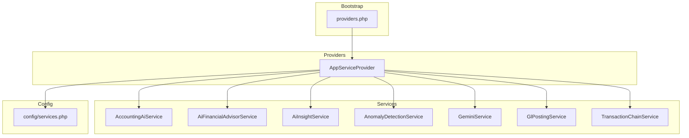
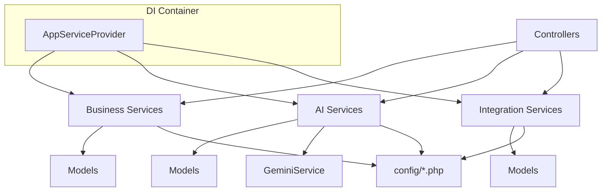
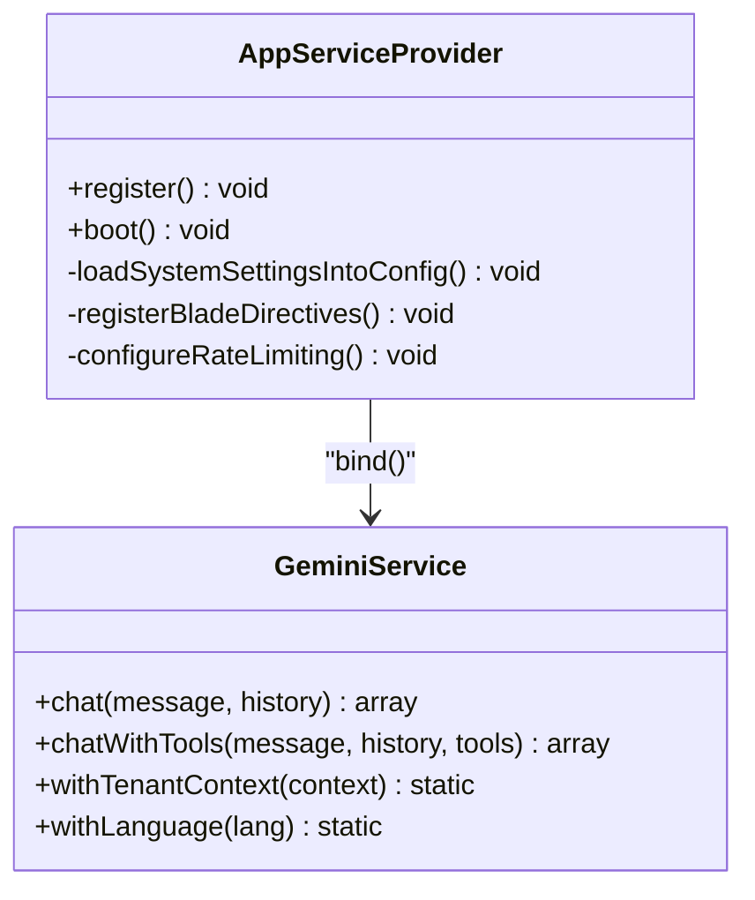
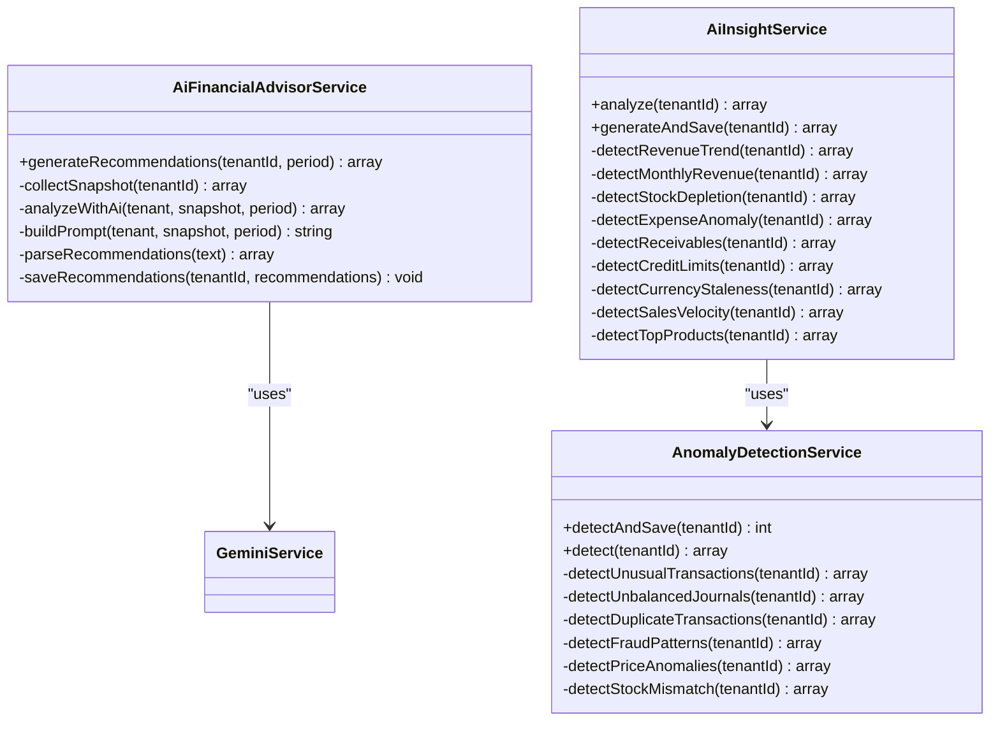
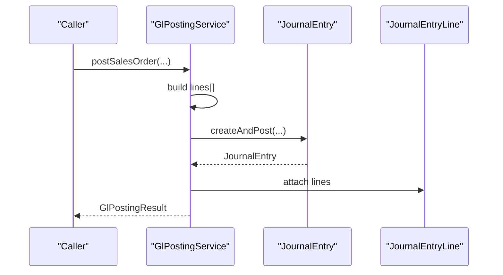
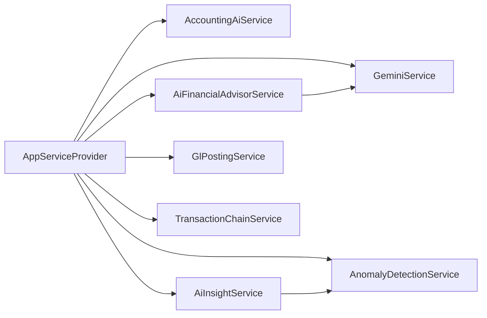

# Service Layer Architecture

<cite>
**Referenced Files in This Document**
- [AppServiceProvider.php](file://app/Providers/AppServiceProvider.php)
- [providers.php](file://bootstrap/providers.php)
- [services.php](file://config/services.php)
- [AccountingAiService.php](file://app/Services/AccountingAiService.php)
- [AiFinancialAdvisorService.php](file://app/Services/AiFinancialAdvisorService.php)
- [AiInsightService.php](file://app/Services/AiInsightService.php)
- [AnomalyDetectionService.php](file://app/Services/AnomalyDetectionService.php)
- [GeminiService.php](file://app/Services/GeminiService.php)
- [GlPostingService.php](file://app/Services/GlPostingService.php)
- [TransactionChainService.php](file://app/Services/TransactionChainService.php)
</cite>

## Table of Contents
1. [Introduction](#introduction)
2. [Project Structure](#project-structure)
3. [Core Components](#core-components)
4. [Architecture Overview](#architecture-overview)
5. [Detailed Component Analysis](#detailed-component-analysis)
6. [Dependency Analysis](#dependency-analysis)
7. [Performance Considerations](#performance-considerations)
8. [Troubleshooting Guide](#troubleshooting-guide)
9. [Conclusion](#conclusion)

## Introduction
This document describes the service layer architecture of Qalcuity ERP, focusing on service-oriented design patterns, dependency injection and service registration, and cross-cutting concerns. It explains how business logic is encapsulated in services, roles of service providers, and how AI, integration, and domain-specific services are organized. It also covers service composition, error handling, testing approaches, performance optimization, caching strategies, and lifecycle management.

## Project Structure
Qalcuity ERP organizes business logic into discrete service classes under the app/Services namespace. Services are registered and bound via the application’s service provider, which controls singleton versus transient lifetimes and integrates with configuration-driven settings. The service provider also registers model observers, blade directives, rate limiters, and loads dynamic system settings from the database into configuration.

**Diagram sources**
- [providers.php:1-10](file://bootstrap/providers.php#L1-L10)
- [AppServiceProvider.php:26-60](file://app/Providers/AppServiceProvider.php#L26-L60)
- [services.php:1-70](file://config/services.php#L1-L70)

**Section sources**
- [providers.php:1-10](file://bootstrap/providers.php#L1-L10)
- [AppServiceProvider.php:62-117](file://app/Providers/AppServiceProvider.php#L62-L117)
- [services.php:1-70](file://config/services.php#L1-L70)

## Core Components
- Service providers and dependency injection
  - AppServiceProvider registers bindings and singletons, binds exception handler, and configures rate limiting and blade directives.
  - GeminiService is intentionally bound (not singleton) to ensure fresh state per request.
  - Several services are registered as singletons for stateless or shared-state reuse across requests.

- AI services
  - GeminiService: orchestrates AI interactions, validates API keys, manages fallback models, and exposes chat and tool-enabled chat APIs.
  - AiFinancialAdvisorService: aggregates tenant data, sends prompts to Gemini, parses recommendations, and persists notifications.
  - AiInsightService: runs multiple analyzers and anomaly detection, converts anomalies to insights, and persists notifications.
  - AnomalyDetectionService: detects unusual transactions, unbalanced journals, duplicates, fraud patterns, pricing anomalies, and stock mismatches.

- Domain services
  - GlPostingService: auto-posts journal entries for sales, purchases, payments, expenses, depreciation, and other accounting events, returning standardized results.
  - TransactionChainService: builds upstream/downstream transaction chains for documents and resolves related entities.

- Integration services
  - Third-party credentials are centralized in config/services.php for mail, Slack, payment gateways, OAuth, and push notification keys.

**Section sources**
- [AppServiceProvider.php:26-60](file://app/Providers/AppServiceProvider.php#L26-L60)
- [GeminiService.php:28-57](file://app/Services/GeminiService.php#L28-L57)
- [AiFinancialAdvisorService.php:38-56](file://app/Services/AiFinancialAdvisorService.php#L38-L56)
- [AiInsightService.php:38-75](file://app/Services/AiInsightService.php#L38-L75)
- [AnomalyDetectionService.php:22-66](file://app/Services/AnomalyDetectionService.php#L22-L66)
- [GlPostingService.php:26-80](file://app/Services/GlPostingService.php#L26-L80)
- [TransactionChainService.php:27-41](file://app/Services/TransactionChainService.php#L27-L41)
- [services.php:17-67](file://config/services.php#L17-L67)

## Architecture Overview
The service layer follows a layered, service-oriented design:
- Controllers orchestrate user actions and delegate to services.
- Services encapsulate business logic and coordinate models, repositories, and external integrations.
- Dependency Injection (via AppServiceProvider) manages lifetimes and wiring.
- Cross-cutting concerns (logging, rate limiting, configuration loading) are centralized in the provider and configuration files.

[No sources needed since this diagram shows conceptual workflow, not actual code structure]

## Detailed Component Analysis

### Service Provider and Dependency Injection
- Singleton vs bind semantics
  - Exception handler is bound as a singleton replacement.
  - GeminiService is bound (not singleton) to avoid carrying state across requests.
  - Other services are registered as singletons for performance and shared-state reuse.

- Configuration-driven settings
  - System settings are loaded from the database into configuration, overriding environment values. This enables dynamic tuning of AI behavior, email, OAuth, and push notification settings.

- Blade directives and rate limiting
  - Permission checks are exposed via Blade directives.
  - Multiple rate limiters are configured for AI chat/media, API reads/writes, webhooks, POS checkout, exports, imports, and general web traffic.

**Diagram sources**
- [AppServiceProvider.php:26-117](file://app/Providers/AppServiceProvider.php#L26-L117)
- [GeminiService.php:28-80](file://app/Services/GeminiService.php#L28-L80)

**Section sources**
- [AppServiceProvider.php:26-60](file://app/Providers/AppServiceProvider.php#L26-L60)
- [AppServiceProvider.php:82-117](file://app/Providers/AppServiceProvider.php#L82-L117)
- [AppServiceProvider.php:119-218](file://app/Providers/AppServiceProvider.php#L119-L218)

### AI Services
- AccountingAiService
  - Provides account suggestion from history and keyword rules, anomaly detection for journal entries, and bank statement categorization.
  - Uses tenant-scoped queries and COA lookups to propose accounts and validate pairings.

- AiFinancialAdvisorService
  - Aggregates financial snapshots across modules, builds prompts, calls Gemini, parses recommendations, and persists notifications.

- AiInsightService
  - Runs multiple analyzers (revenue trends, monthly revenue, stock depletion, expense anomalies, receivables, credit limits, currency staleness, sales velocity, top products) and anomaly detection.
  - Converts anomalies to insights and persists notifications.

- AnomalyDetectionService
  - Detects unusual transactions, unbalanced journals, duplicates, fraud patterns, pricing anomalies, and stock mismatches.

**Diagram sources**
- [AiFinancialAdvisorService.php:38-366](file://app/Services/AiFinancialAdvisorService.php#L38-L366)
- [AiInsightService.php:38-799](file://app/Services/AiInsightService.php#L38-L799)
- [AnomalyDetectionService.php:22-287](file://app/Services/AnomalyDetectionService.php#L22-L287)
- [GeminiService.php:754-800](file://app/Services/GeminiService.php#L754-L800)

**Section sources**
- [AccountingAiService.php:34-577](file://app/Services/AccountingAiService.php#L34-L577)
- [AiFinancialAdvisorService.php:38-366](file://app/Services/AiFinancialAdvisorService.php#L38-L366)
- [AiInsightService.php:38-799](file://app/Services/AiInsightService.php#L38-L799)
- [AnomalyDetectionService.php:22-287](file://app/Services/AnomalyDetectionService.php#L22-L287)

### Domain Services
- GlPostingService
  - Auto-posts journal entries for sales orders, invoices, purchase orders, payments, expenses, depreciation, consignment, landed costs, contracts, fleet fuel/maintenance, and more.
  - Returns standardized GlPostingResult objects to callers for consistent error handling.

- TransactionChainService
  - Builds upstream/downstream transaction chains for documents and resolves related entities (quotes, SOs, DOs, invoices, payments, journal entries, POs, goods receipts, payables).

**Diagram sources**
- [GlPostingService.php:84-124](file://app/Services/GlPostingService.php#L84-L124)
- [GlPostingService.php:434-466](file://app/Services/GlPostingService.php#L434-L466)

**Section sources**
- [GlPostingService.php:26-996](file://app/Services/GlPostingService.php#L26-L996)
- [TransactionChainService.php:27-170](file://app/Services/TransactionChainService.php#L27-L170)

### Integration Services
- Third-party credentials and settings are centralized in config/services.php for:
  - Email/SendGrid/SES/Postmark/Resend
  - Slack notifications
  - Payment gateways (Midtrans, Xendit)
  - SMS/WhatsApp (Fonnte)
  - OAuth (Google)
  - Push notifications (VAPID)

**Section sources**
- [services.php:17-67](file://config/services.php#L17-L67)

## Dependency Analysis
- Service provider registrations
  - AppServiceProvider registers bindings and singletons for services and loads system settings into configuration.
- Internal dependencies
  - AiInsightService depends on AnomalyDetectionService for anomaly-derived insights.
  - AiFinancialAdvisorService depends on GeminiService for AI analysis.
  - GlPostingService coordinates with models and returns standardized results.

**Diagram sources**
- [AppServiceProvider.php:26-60](file://app/Providers/AppServiceProvider.php#L26-L60)
- [AiInsightService.php:41-49](file://app/Services/AiInsightService.php#L41-L49)
- [AiFinancialAdvisorService.php:230-234](file://app/Services/AiFinancialAdvisorService.php#L230-L234)

**Section sources**
- [AppServiceProvider.php:26-60](file://app/Providers/AppServiceProvider.php#L26-L60)
- [AiInsightService.php:41-49](file://app/Services/AiInsightService.php#L41-L49)
- [AiFinancialAdvisorService.php:230-234](file://app/Services/AiFinancialAdvisorService.php#L230-L234)

## Performance Considerations
- Singleton services
  - Singletons are used for stateless or shared-state services (e.g., DocumentNumberService, TransactionStateMachine, ToolRegistry factory) to reduce overhead and enable caching.
- Fresh AI state
  - GeminiService is bound (not singleton) to ensure fresh tenant context and language per request.
- Rate limiting
  - Configured for AI chat/media, API reads/writes, webhooks, POS checkout, exports/imports, and general web traffic, scaled by tenant plan.
- Caching and optimization
  - GeminiService supports fallback models and rate-limit-aware retries.
  - System settings are loaded into configuration to avoid repeated DB queries for frequently accessed settings.

**Section sources**
- [AppServiceProvider.php:34-37](file://app/Providers/AppServiceProvider.php#L34-L37)
- [AppServiceProvider.php:142-218](file://app/Providers/AppServiceProvider.php#L142-L218)
- [GeminiService.php:28-57](file://app/Services/GeminiService.php#L28-L57)

## Troubleshooting Guide
- Gemini API key validation
  - GeminiService validates API key presence and correctness during construction and logs meaningful errors.
- Exception handling
  - AppServiceProvider replaces the default exception handler with a custom handler for centralized error management.
- Anomaly detection
  - AnomalyDetectionService avoids duplicate alerts by hashing anomaly data and checking for existing open alerts per day.
- Logging and observability
  - Services log warnings and errors for AI failures and configuration issues.

**Section sources**
- [GeminiService.php:32-46](file://app/Services/GeminiService.php#L32-L46)
- [AppServiceProvider.php:28-32](file://app/Providers/AppServiceProvider.php#L28-L32)
- [AnomalyDetectionService.php:34-47](file://app/Services/AnomalyDetectionService.php#L34-L47)

## Conclusion
Qalcuity ERP’s service layer is designed around clear separation of concerns, robust dependency injection, and modular AI and domain services. The AppServiceProvider centralizes registration and cross-cutting concerns, while services encapsulate business logic and integrate with configuration-driven settings. AI services leverage Gemini for intelligent insights and recommendations, while domain services automate financial posting and transaction chaining. Performance and reliability are addressed through singleton usage, rate limiting, and careful error handling.