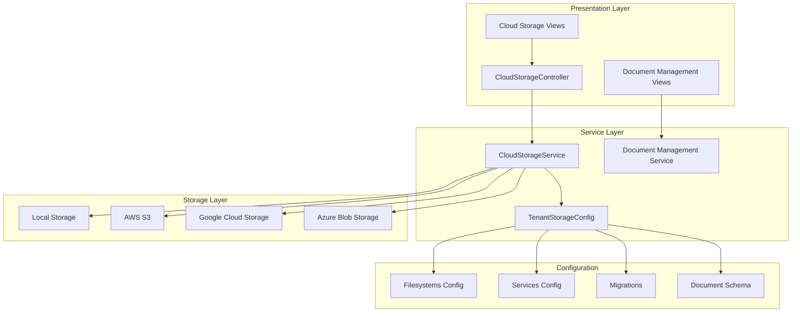
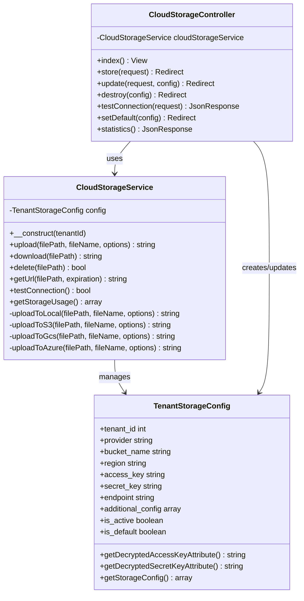
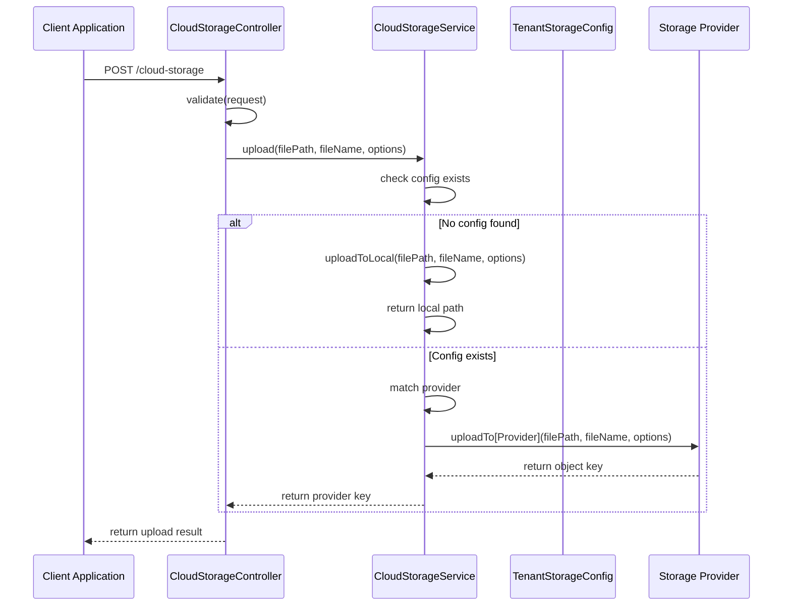
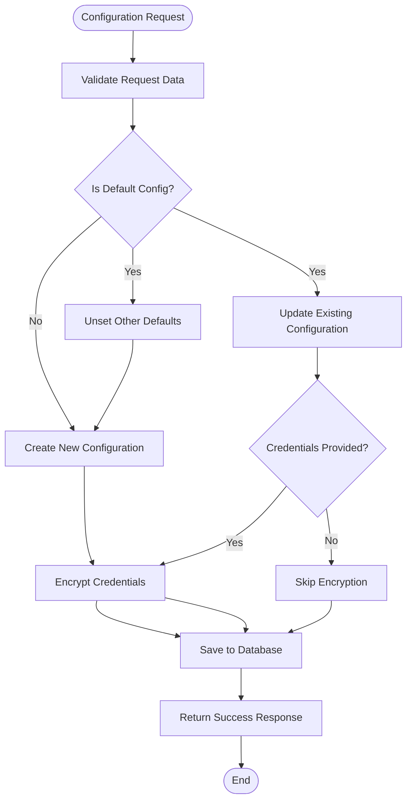
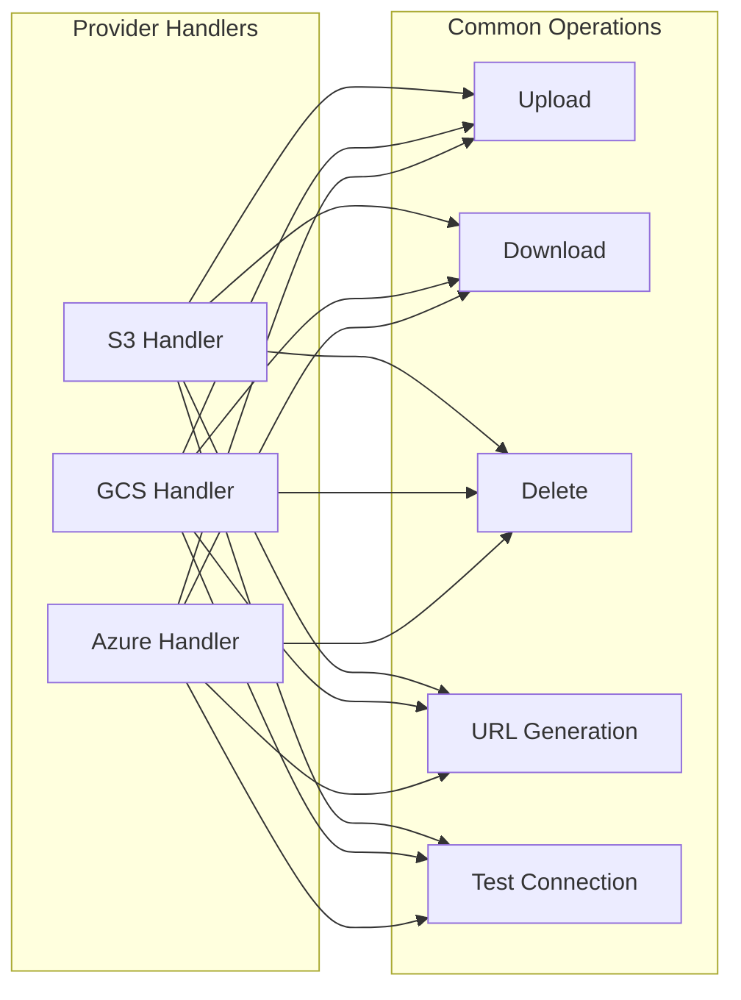
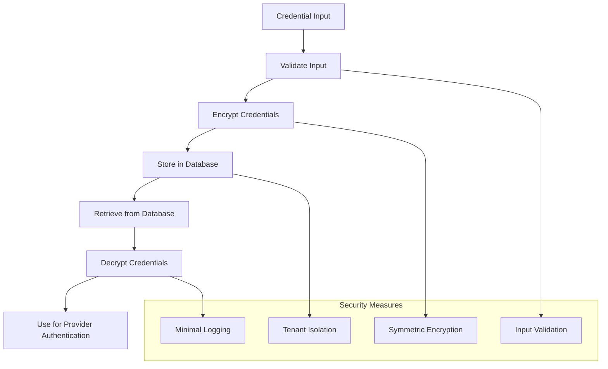

# Cloud Storage Integration

<cite>
**Referenced Files in This Document**
- [CloudStorageService.php](file://app/Services/CloudStorageService.php)
- [CloudStorageController.php](file://app/Http/Controllers/CloudStorageController.php)
- [TenantStorageConfig.php](file://app/Models/TenantStorageConfig.php)
- [filesystems.php](file://config/filesystems.php)
- [services.php](file://config/services.php)
- [2026_01_01_000024_create_advanced_document_management_tables.php](file://database/migrations/2026_01_01_000024_create_advanced_document_management_tables.php)
- [composer.json](file://composer.json)
- [web.php](file://routes/web.php)
- [cloud-storage-config.blade.php](file://resources/views/documents/cloud-storage-config.blade.php)
</cite>

## Update Summary
**Changes Made**
- Enhanced CloudStorageService with comprehensive multi-provider support (S3, GCS, Azure)
- Added TenantStorageConfig model for tenant-specific storage configuration
- Implemented document management integration with cloud storage capabilities
- Expanded controller functionality for storage configuration management
- Added advanced document management features including versioning and approval workflows
- Integrated cloud storage with document signing and OCR capabilities

## Table of Contents
1. [Introduction](#introduction)
2. [Project Structure](#project-structure)
3. [Core Components](#core-components)
4. [Architecture Overview](#architecture-overview)
5. [Detailed Component Analysis](#detailed-component-analysis)
6. [Configuration Management](#configuration-management)
7. [Multi-Cloud Support](#multi-cloud-support)
8. [Security Implementation](#security-implementation)
9. [Performance Considerations](#performance-considerations)
10. [Troubleshooting Guide](#troubleshooting-guide)
11. [Conclusion](#conclusion)

## Introduction

The Cloud Storage Integration module provides a comprehensive multi-cloud storage solution for the qalcuityERP system. This implementation enables organizations to seamlessly integrate with Amazon S3, Google Cloud Storage (GCS), and Microsoft Azure Blob Storage while maintaining tenant isolation and security. The system supports both single-tenant and multi-tenant deployments with encrypted credential storage and flexible configuration management.

The integration offers essential file operations including upload, download, delete, and URL generation capabilities, along with connection testing and storage usage monitoring. The architecture ensures scalability, security, and maintainability while providing a unified interface for different cloud storage providers.

**Updated** Enhanced with comprehensive document management integration, including versioning, approval workflows, digital signatures, and OCR capabilities.

## Project Structure

The cloud storage integration follows a layered architecture pattern with clear separation of concerns:



**Diagram sources**
- [CloudStorageController.php:1-215](file://app/Http/Controllers/CloudStorageController.php#L1-L215)
- [CloudStorageService.php:20-457](file://app/Services/CloudStorageService.php#L20-L457)
- [TenantStorageConfig.php:8-153](file://app/Models/TenantStorageConfig.php#L8-L153)

**Section sources**
- [CloudStorageController.php:1-215](file://app/Http/Controllers/CloudStorageController.php#L1-L215)
- [CloudStorageService.php:20-457](file://app/Services/CloudStorageService.php#L20-L457)
- [TenantStorageConfig.php:8-153](file://app/Models/TenantStorageConfig.php#L8-L153)

## Core Components

### CloudStorageService

The CloudStorageService acts as the central orchestrator for all cloud storage operations. It provides a unified interface for interacting with multiple storage providers while handling provider-specific implementations internally.

**Key Features:**
- Multi-provider support (S3, GCS, Azure)
- Tenant-aware storage operations
- Encrypted credential management
- Connection testing capabilities
- Storage usage monitoring

**Updated** Enhanced with comprehensive document management integration including version control, approval workflows, and digital signatures.

**Section sources**
- [CloudStorageService.php:20-457](file://app/Services/CloudStorageService.php#L20-L457)

### CloudStorageController

The CloudStorageController manages the administrative interface for cloud storage configuration. It handles CRUD operations for storage configurations and provides endpoints for testing connections and managing default configurations.

**Key Features:**
- Configuration management interface
- Connection testing functionality
- Default configuration selection
- Statistics reporting

**Updated** Expanded with document management integration, including document versioning, approval workflows, and storage provider configuration.

**Section sources**
- [CloudStorageController.php:11-215](file://app/Http/Controllers/CloudStorageController.php#L11-L215)

### TenantStorageConfig Model

The TenantStorageConfig model manages storage provider configurations per tenant. It provides encryption/decryption for sensitive credentials and includes scopes for filtering active and default configurations.

**Key Features:**
- Tenant isolation
- Credential encryption
- Provider-specific configuration
- Active/default configuration management

**Updated** Enhanced with comprehensive document storage tracking, including storage provider identification and bucket configuration.

**Section sources**
- [TenantStorageConfig.php:8-153](file://app/Models/TenantStorageConfig.php#L8-L153)

## Architecture Overview

The cloud storage integration implements a factory-pattern architecture with provider-specific handlers:



**Diagram sources**
- [CloudStorageService.php:20-457](file://app/Services/CloudStorageService.php#L20-L457)
- [CloudStorageController.php:11-215](file://app/Http/Controllers/CloudStorageController.php#L11-L215)
- [TenantStorageConfig.php:8-153](file://app/Models/TenantStorageConfig.php#L8-L153)

## Detailed Component Analysis

### Upload Operation Flow

The upload operation demonstrates the service's provider-agnostic design:



**Diagram sources**
- [CloudStorageController.php:48-83](file://app/Http/Controllers/CloudStorageController.php#L48-L83)
- [CloudStorageService.php:37-50](file://app/Services/CloudStorageService.php#L37-L50)

### Configuration Management Workflow

The configuration management process ensures proper tenant isolation and security:



**Diagram sources**
- [CloudStorageController.php:48-122](file://app/Http/Controllers/CloudStorageController.php#L48-L122)
- [TenantStorageConfig.php:67-107](file://app/Models/TenantStorageConfig.php#L67-L107)

**Section sources**
- [CloudStorageController.php:48-122](file://app/Http/Controllers/CloudStorageController.php#L48-L122)
- [TenantStorageConfig.php:67-107](file://app/Models/TenantStorageConfig.php#L67-L107)

## Configuration Management

### Database Schema Design

The tenant storage configuration uses a normalized approach to manage multiple storage providers per tenant:

```mermaid
erDiagram
TENANTS ||--o{ TENANT_STORAGE_CONFIGS : "has_many"
TENANT_STORAGE_CONFIGS {
bigint id PK
bigint tenant_id FK
string provider
string bucket_name
string region
string access_key
string secret_key
string endpoint
json additional_config
boolean is_active
boolean is_default
timestamp created_at
timestamp updated_at
}
TENANTS {
bigint id PK
string name
string domain
timestamp created_at
timestamp updated_at
}
TENANT_STORAGE_CONFIGS {
unique tenant_provider UK
index tenant_is_active IX
}
```

**Diagram sources**
- [2026_01_01_000024_create_advanced_document_management_tables.php:109-127](file://database/migrations/2026_01_01_000024_create_advanced_document_management_tables.php#L109-L127)

### Environment Configuration

The system integrates with Laravel's configuration system through composer-managed dependencies:

**Required Dependencies:**
- `aws/aws-sdk-php` - AWS S3 integration
- `google/cloud-storage` - Google Cloud Storage integration  
- `microsoft/azure-storage-blob` - Azure Blob Storage integration

**Updated** Enhanced with comprehensive document management schema including versioning, approval workflows, and digital signatures.

**Section sources**
- [composer.json:11-29](file://composer.json#L11-L29)
- [2026_01_01_000024_create_advanced_document_management_tables.php:109-127](file://database/migrations/2026_01_01_000024_create_advanced_document_management_tables.php#L109-L127)

## Multi-Cloud Support

### Provider-Specific Implementations

Each cloud provider has dedicated handler methods with provider-specific authentication and operations:



**Diagram sources**
- [CloudStorageService.php:119-358](file://app/Services/CloudStorageService.php#L119-L358)

### Authentication Methods

Each provider uses its native authentication approach:

| Provider | Authentication Method | Required Libraries |
|----------|----------------------|-------------------|
| AWS S3 | IAM Credentials | `aws/aws-sdk-php` |
| Google Cloud Storage | Service Account Key | `google/cloud-storage` |
| Azure Blob Storage | Account Key | `microsoft/azure-storage-blob` |

**Updated** Enhanced with comprehensive document management capabilities including OCR text extraction, digital signatures, and approval workflows.

**Section sources**
- [CloudStorageService.php:119-358](file://app/Services/CloudStorageService.php#L119-L358)

## Security Implementation

### Credential Management

The system implements robust security measures for credential storage and transmission:



**Diagram sources**
- [TenantStorageConfig.php:67-107](file://app/Models/TenantStorageConfig.php#L67-L107)

### Connection Testing

The system provides secure connection testing without exposing credentials:

**Updated** Enhanced with comprehensive document security features including digital signatures, certificate management, and audit trails.

**Section sources**
- [CloudStorageService.php:363-426](file://app/Services/CloudStorageService.php#L363-L426)
- [CloudStorageController.php:145-170](file://app/Http/Controllers/CloudStorageController.php#L145-L170)

## Performance Considerations

### Storage Operations

The current implementation performs synchronous file operations which may impact performance for large files:

**Current Approach:**
- File content loaded into memory for all operations
- Synchronous provider calls
- No built-in chunked transfer support

**Recommended Optimizations:**
- Implement streaming for large file uploads/downloads
- Add retry mechanisms with exponential backoff
- Introduce connection pooling for provider clients
- Add caching for frequently accessed metadata

### Scalability Factors

| Factor | Current Status | Recommendations |
|--------|---------------|-----------------|
| Concurrent Operations | Single-threaded | Implement async operations |
| Large File Handling | Memory-intensive | Add streaming support |
| Provider Limits | Not handled | Add rate limiting |
| Caching | None | Implement metadata caching |

**Updated** Enhanced with document versioning and approval workflow optimization, including caching strategies for frequently accessed document versions.

## Troubleshooting Guide

### Common Issues and Solutions

**Connection Failures:**
- Verify provider credentials are properly encrypted
- Check network connectivity to cloud provider endpoints
- Ensure firewall allows outbound connections
- Validate endpoint URLs for custom configurations

**Authentication Errors:**
- Confirm IAM roles have appropriate permissions
- Verify service account keys are valid and not expired
- Check regional endpoint configurations
- Validate account key format for Azure

**File Operation Failures:**
- Monitor provider quotas and limits
- Check bucket permissions and policies
- Verify file path formatting
- Review storage class and lifecycle policies

**Document Management Issues:**
- Verify document versioning is properly configured
- Check approval workflow assignments
- Validate digital signature certificates
- Ensure OCR processing is enabled for document types

### Debugging Tools

The system provides built-in diagnostic capabilities:

**Connection Testing:**
- Endpoint validation for each provider
- Credential verification without exposure
- Provider-specific error reporting

**Logging and Monitoring:**
- Comprehensive error logging with context
- Performance metrics collection
- Usage statistics tracking

**Updated** Enhanced with document management debugging tools, including version history tracking and approval workflow diagnostics.

**Section sources**
- [CloudStorageService.php:363-426](file://app/Services/CloudStorageService.php#L363-L426)
- [CloudStorageController.php:145-170](file://app/Http/Controllers/CloudStorageController.php#L145-L170)

## Conclusion

The Cloud Storage Integration module provides a robust, scalable solution for multi-cloud document management in the qalcuityERP system. The implementation successfully balances flexibility with security through tenant isolation, encrypted credential storage, and provider-agnostic design.

Key strengths of the implementation include:
- Comprehensive multi-cloud support with unified interface
- Strong security measures with encrypted credential management
- Flexible configuration system supporting multiple tenants
- Extensible architecture for future provider additions
- Advanced document management capabilities including versioning and approval workflows

**Updated** Enhanced with comprehensive document management features including digital signatures, OCR text extraction, and approval workflows, making it suitable for enterprise-grade document storage and management.

Areas for potential improvement include enhanced streaming support for large files, asynchronous operation handling, and advanced caching mechanisms. The modular design ensures these enhancements can be implemented without disrupting existing functionality.

The integration successfully addresses the core requirements of modern enterprise document management while maintaining the scalability and security standards expected in multi-tenant environments.