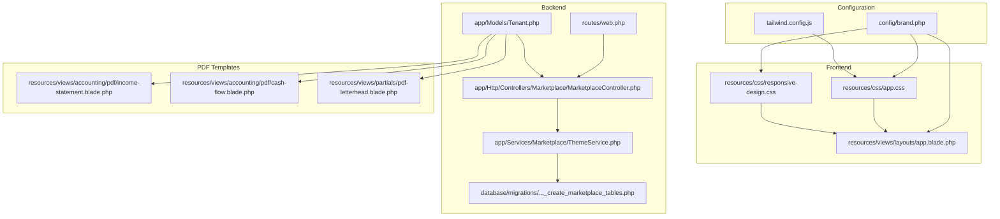
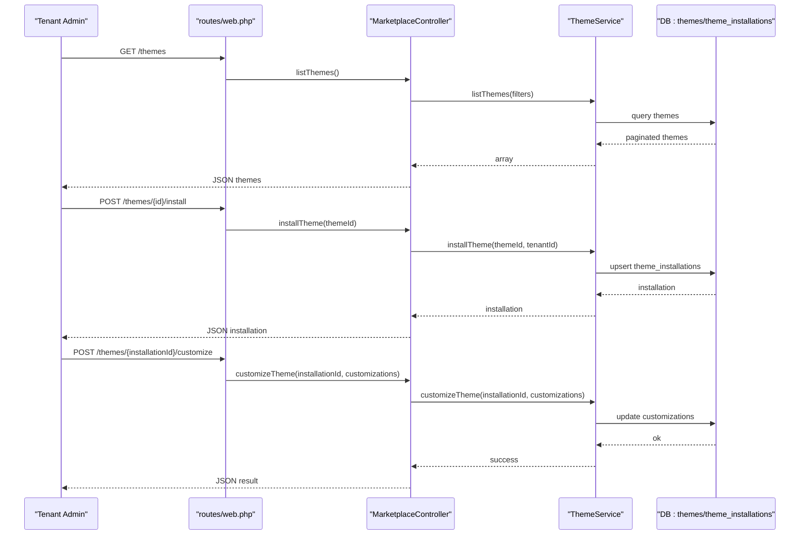
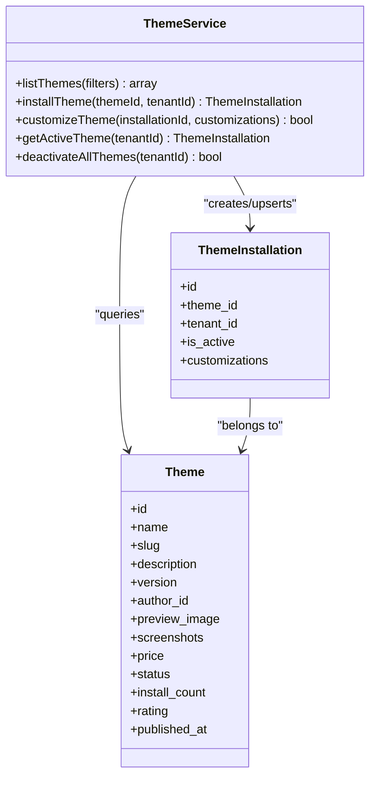
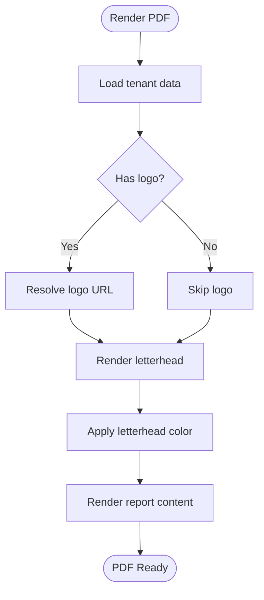
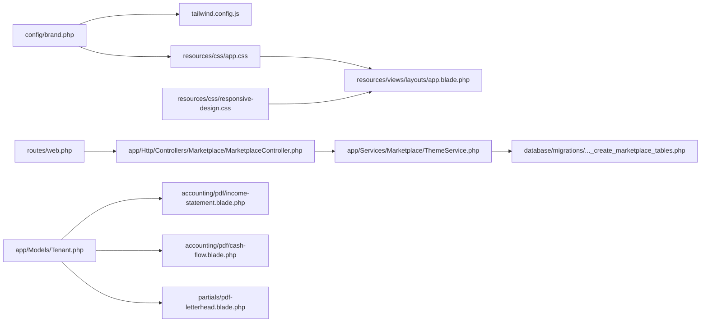

# Branding & Theming

<cite>
**Referenced Files in This Document**
- [brand.php](file://config/brand.php)
- [tailwind.config.js](file://tailwind.config.js)
- [app.css](file://resources/css/app.css)
- [responsive-design.css](file://resources/css/responsive-design.css)
- [app.blade.php](file://resources/views/layouts/app.blade.php)
- [ThemeService.php](file://app/Services/Marketplace/ThemeService.php)
- [2026_04_06_130000_create_marketplace_tables.php](file://database/migrations/2026_04_06_130000_create_marketplace_tables.php)
- [web.php](file://routes/web.php)
- [MarketplaceController.php](file://app/Http/Controllers/Marketplace/MarketplaceController.php)
- [Tenant.php](file://app/Models/Tenant.php)
- [income-statement.blade.php](file://resources/views/accounting/pdf/income-statement.blade.php)
- [cash-flow.blade.php](file://resources/views/accounting/pdf/cash-flow.blade.php)
- [pdf-letterhead.blade.php](file://resources/views/partials/pdf-letterhead.blade.php)
- [HEALTHCARE_COLOR_TYPOGRAPHY_STANDARD.md](file://docs/HEALTHCARE_COLOR_TYPOGRAPHY_STANDARD.md)
- [MOBILE_RESPONSIVE_IMPLEMENTATION.md](file://docs/MOBILE_RESPONSIVE_IMPLEMENTATION.md)
- [HEALTHCARE_MODAL_MOBILE_FIX_GUIDE.md](file://docs/HEALTHCARE_MODAL_MOBILE_FIX_GUIDE.md)
</cite>

## Table of Contents
1. [Introduction](#introduction)
2. [Project Structure](#project-structure)
3. [Core Components](#core-components)
4. [Architecture Overview](#architecture-overview)
5. [Detailed Component Analysis](#detailed-component-analysis)
6. [Dependency Analysis](#dependency-analysis)
7. [Performance Considerations](#performance-considerations)
8. [Troubleshooting Guide](#troubleshooting-guide)
9. [Conclusion](#conclusion)
10. [Appendices](#appendices)

## Introduction
This document explains how Qalcuity ERP supports branding and theming customization across the application. It covers:
- Logo management and tenant-specific branding
- Color scheme customization via configuration and Tailwind extension
- Typography and border radius/shadow preferences
- Responsive design and accessibility compliance
- Theme marketplace and multi-tenant theme installation and customization
- Creating branded PDF templates
- Component-level styling overrides and layout customization
- Mobile-first design principles and performance optimization for custom stylesheets

## Project Structure
The theming system spans configuration, frontend CSS/Tailwind, Blade layouts, and backend services for multi-tenant theme management.

**Diagram sources**
- [brand.php:1-135](file://config/brand.php#L1-L135)
- [tailwind.config.js:1-23](file://tailwind.config.js#L1-L23)
- [app.css:1-12](file://resources/css/app.css#L1-L12)
- [responsive-design.css:1-488](file://resources/css/responsive-design.css#L1-L488)
- [app.blade.php:1-800](file://resources/views/layouts/app.blade.php#L1-L800)
- [ThemeService.php:1-86](file://app/Services/Marketplace/ThemeService.php#L1-L86)
- [2026_04_06_130000_create_marketplace_tables.php:166-195](file://database/migrations/2026_04_06_130000_create_marketplace_tables.php#L166-L195)
- [web.php:2938-2944](file://routes/web.php#L2938-L2944)
- [MarketplaceController.php:474-525](file://app/Http/Controllers/Marketplace/MarketplaceController.php#L474-L525)
- [Tenant.php:1-223](file://app/Models/Tenant.php#L1-L223)
- [income-statement.blade.php:20-40](file://resources/views/accounting/pdf/income-statement.blade.php#L20-L40)
- [cash-flow.blade.php:21-44](file://resources/views/accounting/pdf/cash-flow.blade.php#L21-L44)
- [pdf-letterhead.blade.php:23-57](file://resources/views/partials/pdf-letterhead.blade.php#L23-L57)

**Section sources**
- [brand.php:1-135](file://config/brand.php#L1-L135)
- [tailwind.config.js:1-23](file://tailwind.config.js#L1-L23)
- [app.css:1-12](file://resources/css/app.css#L1-L12)
- [responsive-design.css:1-488](file://resources/css/responsive-design.css#L1-L488)
- [app.blade.php:1-800](file://resources/views/layouts/app.blade.php#L1-L800)
- [ThemeService.php:1-86](file://app/Services/Marketplace/ThemeService.php#L1-L86)
- [2026_04_06_130000_create_marketplace_tables.php:166-195](file://database/migrations/2026_04_06_130000_create_marketplace_tables.php#L166-L195)
- [web.php:2938-2944](file://routes/web.php#L2938-L2944)
- [MarketplaceController.php:474-525](file://app/Http/Controllers/Marketplace/MarketplaceController.php#L474-L525)
- [Tenant.php:1-223](file://app/Models/Tenant.php#L1-L223)
- [income-statement.blade.php:20-40](file://resources/views/accounting/pdf/income-statement.blade.php#L20-L40)
- [cash-flow.blade.php:21-44](file://resources/views/accounting/pdf/cash-flow.blade.php#L21-L44)
- [pdf-letterhead.blade.php:23-57](file://resources/views/partials/pdf-letterhead.blade.php#L23-L57)

## Core Components
- Brand configuration: centralizes brand colors, gradients, logo, typography, radii, shadows, payment icons, e-wallet branding, receipts, UI text, and feature toggles.
- Tailwind extension: adds a custom sans font family and enables dark mode via class.
- Global CSS: imports responsive and accessibility utilities and sets base font family.
- Responsive and accessibility utilities: enforce WCAG touch targets, smooth scrolling, safe area insets, and print-safe styles.
- Theme marketplace: manages theme discovery, installation, activation, and per-tenant customization.
- PDF templates: render branded letterheads and financial statements using tenant data.

**Section sources**
- [brand.php:14-134](file://config/brand.php#L14-L134)
- [tailwind.config.js:13-19](file://tailwind.config.js#L13-L19)
- [app.css:8-12](file://resources/css/app.css#L8-L12)
- [responsive-design.css:1-488](file://resources/css/responsive-design.css#L1-L488)
- [ThemeService.php:13-85](file://app/Services/Marketplace/ThemeService.php#L13-L85)
- [income-statement.blade.php:27-40](file://resources/views/accounting/pdf/income-statement.blade.php#L27-L40)
- [cash-flow.blade.php:26-44](file://resources/views/accounting/pdf/cash-flow.blade.php#L26-L44)
- [pdf-letterhead.blade.php:23-57](file://resources/views/partials/pdf-letterhead.blade.php#L23-L57)

## Architecture Overview
The theming pipeline integrates configuration-driven brand settings with Tailwind-generated CSS, runtime layout overrides, and tenant-aware PDF rendering.

**Diagram sources**
- [web.php:2938-2944](file://routes/web.php#L2938-L2944)
- [MarketplaceController.php:474-525](file://app/Http/Controllers/Marketplace/MarketplaceController.php#L474-L525)
- [ThemeService.php:13-85](file://app/Services/Marketplace/ThemeService.php#L13-L85)
- [2026_04_06_130000_create_marketplace_tables.php:166-195](file://database/migrations/2026_04_06_130000_create_marketplace_tables.php#L166-L195)

## Detailed Component Analysis

### Brand Configuration System
- Colors: primary, secondary, success, warning, error, info.
- Gradients: primary, secondary, payment.
- Logo: URL, width, height, and receipt visibility.
- Typography: font family and headings font.
- Border radius and shadows presets.
- Payment icons and e-wallet branding.
- Receipt customization: show logo, footer message, QR code, paper width.
- UI text overrides: app name, payment UI title, instructions, success/expired messages.
- Feature toggles: enable/disable payment methods, quick cash buttons, auto print receipt.
- Quick cash amounts.

These settings are environment-driven and influence both Tailwind utilities and Blade-rendered UI.

**Section sources**
- [brand.php:14-134](file://config/brand.php#L14-L134)

### Tailwind Extension and Dark Mode
- Adds a custom sans font family and enables dark mode via class.
- Ensures consistent typography and dark/light variants across components.

**Section sources**
- [tailwind.config.js:13-19](file://tailwind.config.js#L13-L19)

### Global CSS and Base Styles
- Imports responsive and accessibility utilities.
- Sets base font family for body.
- Provides layout-level overrides and dark mode variants in the main layout.

**Section sources**
- [app.css:1-12](file://resources/css/app.css#L1-L12)
- [app.blade.php:411-412](file://resources/views/layouts/app.blade.php#L411-L412)

### Responsive Design and Accessibility Utilities
- Enforces WCAG 2.1 AA touch targets (minimum 44x44px).
- Mobile-first responsive enhancements for tables, modals, cards, forms, navigation, and pagination.
- Focus-visible and high-contrast focus states.
- Safe area insets for modern devices.
- Print-safe styles to hide non-essential elements.

**Section sources**
- [responsive-design.css:1-488](file://resources/css/responsive-design.css#L1-L488)

### Theme Marketplace and Multi-Tenant Customization
- Theme listing with filters and sorting.
- Theme installation per tenant with activation flag and empty customizations.
- Per-installation customization payload stored as JSON.
- Retrieval of active theme per tenant.
- Deactivation of all themes for a tenant.

**Diagram sources**
- [ThemeService.php:1-86](file://app/Services/Marketplace/ThemeService.php#L1-L86)
- [2026_04_06_130000_create_marketplace_tables.php:166-195](file://database/migrations/2026_04_06_130000_create_marketplace_tables.php#L166-L195)

**Section sources**
- [ThemeService.php:13-85](file://app/Services/Marketplace/ThemeService.php#L13-L85)
- [2026_04_06_130000_create_marketplace_tables.php:166-195](file://database/migrations/2026_04_06_130000_create_marketplace_tables.php#L166-L195)
- [web.php:2938-2944](file://routes/web.php#L2938-L2944)
- [MarketplaceController.php:474-525](file://app/Http/Controllers/Marketplace/MarketplaceController.php#L474-L525)

### PDF Template Branding
- Letterhead partial renders tenant logo, company details, and optional tagline and NPWP.
- Financial reports embed the same branding elements and use tenant-defined letterhead color.
- PDFs conditionally include logo and styling based on tenant data.

**Diagram sources**
- [income-statement.blade.php:27-40](file://resources/views/accounting/pdf/income-statement.blade.php#L27-L40)
- [cash-flow.blade.php:26-44](file://resources/views/accounting/pdf/cash-flow.blade.php#L26-L44)
- [pdf-letterhead.blade.php:23-57](file://resources/views/partials/pdf-letterhead.blade.php#L23-L57)
- [Tenant.php:13-47](file://app/Models/Tenant.php#L13-L47)

**Section sources**
- [income-statement.blade.php:20-40](file://resources/views/accounting/pdf/income-statement.blade.php#L20-L40)
- [cash-flow.blade.php:21-44](file://resources/views/accounting/pdf/cash-flow.blade.php#L21-L44)
- [pdf-letterhead.blade.php:23-57](file://resources/views/partials/pdf-letterhead.blade.php#L23-L57)
- [Tenant.php:13-47](file://app/Models/Tenant.php#L13-L47)

### Component-Level Styling Overrides and Layout Customization
- The main layout defines extensive component-level styles for sidebar, panel, topbar, and mobile responsiveness.
- Uses CSS custom properties for dynamic accent colors and applies dark/light mode overrides.
- Implements mobile-first responsive breakpoints and transitions for sidebar and panel.

**Section sources**
- [app.blade.php:31-408](file://resources/views/layouts/app.blade.php#L31-L408)

### Typography Standards and Color Guidelines
- Healthcare color and typography standards define consistent palettes, gradients, and typographic scales.
- These guidelines inform brand configuration choices and ensure accessibility and consistency.

**Section sources**
- [HEALTHCARE_COLOR_TYPOGRAPHY_STANDARD.md:1-141](file://docs/HEALTHCARE_COLOR_TYPOGRAPHY_STANDARD.md#L1-L141)

### Mobile-First Design Principles and Accessibility Compliance
- Mobile-first responsive implementation with dedicated guides and standards.
- Modal and table mobile fixes emphasize usability and accessibility.
- WCAG-compliant touch targets and focus states.

**Section sources**
- [MOBILE_RESPONSIVE_IMPLEMENTATION.md](file://docs/MOBILE_RESPONSIVE_IMPLEMENTATION.md)
- [HEALTHCARE_MODAL_MOBILE_FIX_GUIDE.md:282-357](file://docs/HEALTHCARE_MODAL_MOBILE_FIX_GUIDE.md#L282-L357)
- [responsive-design.css:241-250](file://resources/css/responsive-design.css#L241-L250)

## Dependency Analysis
- Brand configuration depends on environment variables and influences Tailwind utilities and Blade rendering.
- Tailwind extension depends on Tailwind CSS and the @forms plugin.
- Global CSS depends on responsive utilities and Tailwind directives.
- Theme marketplace depends on database schema for themes and installations and exposes routes and controller actions.
- PDF templates depend on tenant model attributes for branding.

**Diagram sources**
- [brand.php:1-135](file://config/brand.php#L1-L135)
- [tailwind.config.js:1-23](file://tailwind.config.js#L1-L23)
- [app.css:1-12](file://resources/css/app.css#L1-L12)
- [responsive-design.css:1-488](file://resources/css/responsive-design.css#L1-L488)
- [app.blade.php:1-800](file://resources/views/layouts/app.blade.php#L1-L800)
- [web.php:2938-2944](file://routes/web.php#L2938-L2944)
- [MarketplaceController.php:474-525](file://app/Http/Controllers/Marketplace/MarketplaceController.php#L474-L525)
- [ThemeService.php:1-86](file://app/Services/Marketplace/ThemeService.php#L1-L86)
- [2026_04_06_130000_create_marketplace_tables.php:166-195](file://database/migrations/2026_04_06_130000_create_marketplace_tables.php#L166-L195)
- [Tenant.php:1-223](file://app/Models/Tenant.php#L1-L223)
- [income-statement.blade.php:20-40](file://resources/views/accounting/pdf/income-statement.blade.php#L20-L40)
- [cash-flow.blade.php:21-44](file://resources/views/accounting/pdf/cash-flow.blade.php#L21-L44)
- [pdf-letterhead.blade.php:23-57](file://resources/views/partials/pdf-letterhead.blade.php#L23-L57)

**Section sources**
- [brand.php:1-135](file://config/brand.php#L1-L135)
- [tailwind.config.js:1-23](file://tailwind.config.js#L1-L23)
- [app.css:1-12](file://resources/css/app.css#L1-L12)
- [responsive-design.css:1-488](file://resources/css/responsive-design.css#L1-L488)
- [app.blade.php:1-800](file://resources/views/layouts/app.blade.php#L1-L800)
- [web.php:2938-2944](file://routes/web.php#L2938-L2944)
- [MarketplaceController.php:474-525](file://app/Http/Controllers/Marketplace/MarketplaceController.php#L474-L525)
- [ThemeService.php:1-86](file://app/Services/Marketplace/ThemeService.php#L1-L86)
- [2026_04_06_130000_create_marketplace_tables.php:166-195](file://database/migrations/2026_04_06_130000_create_marketplace_tables.php#L166-L195)
- [Tenant.php:1-223](file://app/Models/Tenant.php#L1-L223)
- [income-statement.blade.php:20-40](file://resources/views/accounting/pdf/income-statement.blade.php#L20-L40)
- [cash-flow.blade.php:21-44](file://resources/views/accounting/pdf/cash-flow.blade.php#L21-L44)
- [pdf-letterhead.blade.php:23-57](file://resources/views/partials/pdf-letterhead.blade.php#L23-L57)

## Performance Considerations
- Prefer Tailwind utilities over ad-hoc CSS to leverage purging and minimize bundle size.
- Keep custom CSS scoped to layout and component overrides; avoid global resets.
- Use environment variables for brand assets to enable CDN caching and reduce server load.
- Minimize dynamic CSS generation; rely on prebuilt Tailwind classes and light runtime overrides.
- For PDFs, keep images optimized and limit repeated DOM rendering.

[No sources needed since this section provides general guidance]

## Troubleshooting Guide
- Brand colors not applying:
  - Verify environment variables for brand settings and ensure they are loaded.
  - Confirm Tailwind is rebuilt after configuration changes.
- Theme installation/customization failing:
  - Check controller responses and service logs for exceptions.
  - Validate database schema for themes and theme_installations.
- PDF branding missing:
  - Ensure tenant has logo uploaded and letterhead color set.
  - Confirm PDF templates reference tenant attributes correctly.

**Section sources**
- [brand.php:14-134](file://config/brand.php#L14-L134)
- [MarketplaceController.php:474-525](file://app/Http/Controllers/Marketplace/MarketplaceController.php#L474-L525)
- [ThemeService.php:48-63](file://app/Services/Marketplace/ThemeService.php#L48-L63)
- [2026_04_06_130000_create_marketplace_tables.php:166-195](file://database/migrations/2026_04_06_130000_create_marketplace_tables.php#L166-L195)
- [income-statement.blade.php:27-40](file://resources/views/accounting/pdf/income-statement.blade.php#L27-L40)
- [cash-flow.blade.php:26-44](file://resources/views/accounting/pdf/cash-flow.blade.php#L26-L44)
- [pdf-letterhead.blade.php:23-57](file://resources/views/partials/pdf-letterhead.blade.php#L23-L57)

## Conclusion
Qalcuity ERP’s theming system combines environment-driven brand configuration, Tailwind-based design tokens, and a robust theme marketplace to support multi-tenant visual differentiation. With responsive and accessibility utilities, component-level overrides, and tenant-aware PDF templates, organizations can achieve consistent, compliant, and performant branding across the platform.

[No sources needed since this section summarizes without analyzing specific files]

## Appendices

### Brand Configuration Reference
- Colors: primary, secondary, success, warning, error, info.
- Gradients: primary, secondary, payment.
- Logo: url, width, height, show_in_receipts.
- Typography: font_family, heading_font.
- Border radius: small, medium, large, xl.
- Shadows: small, medium, large.
- Payment icons: cash, qris, card, bank_transfer.
- E-wallets: gopay, ovo, dana, linkaja, shopeepay (name, color, icon).
- Receipt: show_logo, footer_message, show_qr_code, paper_width.
- UI text: app_name, payment_title, qris_instruction, success_message, expired_message.
- Features: enable_cash, enable_qris, enable_card, enable_bank_transfer, show_quick_cash_buttons, auto_print_receipt.
- Quick cash amounts: numeric list.

**Section sources**
- [brand.php:14-134](file://config/brand.php#L14-L134)

### Theme Marketplace API Endpoints
- GET /themes → listThemes()
- POST /themes/{id}/install → installTheme()
- POST /themes/{installationId}/customize → customizeTheme()
- GET /themes/active → getActiveTheme()

**Section sources**
- [web.php:2938-2944](file://routes/web.php#L2938-L2944)
- [MarketplaceController.php:474-525](file://app/Http/Controllers/Marketplace/MarketplaceController.php#L474-L525)