# Configuration & Customization

<cite>
**Referenced Files in This Document**
- [app.php](file://config/app.php)
- [brand.php](file://config/brand.php)
- [SystemSetting.php](file://app/Models/SystemSetting.php)
- [CustomField.php](file://app/Models/CustomField.php)
- [CustomFieldValue.php](file://app/Models/CustomFieldValue.php)
- [CustomFieldService.php](file://app/Services/CustomFieldService.php)
- [Tenant.php](file://app/Models/Tenant.php)
- [BelongsToTenant.php](file://app/Traits/BelongsToTenant.php)
- [ModuleSettingsController.php](file://app/Http/Controllers/ModuleSettingsController.php)
- [ModuleRecommendationService.php](file://app/Services/ModuleRecommendationService.php)
- [ModuleCleanupService.php](file://app/Services/ModuleCleanupService.php)
- [CustomModule.php](file://app/Models/CustomModule.php)
- [Workflow.php](file://app/Models/Workflow.php)
- [WorkflowAction.php](file://app/Models/WorkflowAction.php)
- [WorkflowEngine.php](file://app/Services/WorkflowEngine.php)
- [ReportController.php](file://app/Http/Controllers/ReportController.php)
- [ScheduledReports.php](file://app/Console/Commands/ProcessScheduledReports.php)
- [ScheduledWorkflows.php](file://app/Console/Commands/ProcessScheduledWorkflows.php)
- [AutomatedBackupService.php](file://app/Services/AutomatedBackupService.php)
- [RestorePointService.php](file://app/Services/RestorePointService.php)
- [TenantDataMigrationService.php](file://app/Services/TenantDataMigrationService.php)
- [ClearSettingsCache.php](file://app/Console/Commands/ClearSettingsCache.php)
- [ClearSettingsCache.php](file://app/Console/Commands/ClearSettingsCache.php)
</cite>

## Table of Contents
1. [Introduction](#introduction)
2. [Project Structure](#project-structure)
3. [Core Components](#core-components)
4. [Architecture Overview](#architecture-overview)
5. [Detailed Component Analysis](#detailed-component-analysis)
6. [Dependency Analysis](#dependency-analysis)
7. [Performance Considerations](#performance-considerations)
8. [Troubleshooting Guide](#troubleshooting-guide)
9. [Conclusion](#conclusion)
10. [Appendices](#appendices)

## Introduction
This document explains how Qalcuity ERP manages configuration and customization across systems, modules, forms, reports, workflows, and branding. It covers:
- System settings and environment-driven configuration
- Tenant isolation and module enablement
- Custom field management per tenant and per module
- Branding and theme customization
- Extension points via custom modules and workflows
- Configuration caching, backup, migration, and environment-specific settings

## Project Structure
Configuration and customization touchpoints span configuration files, models, services, traits, controllers, and console commands. The following diagram maps the primary components involved in configuration and customization.

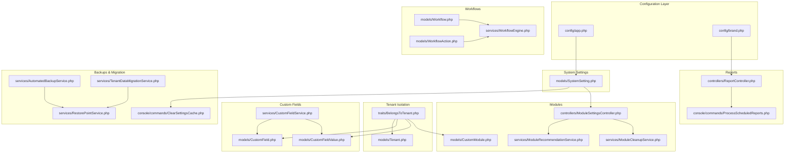

**Diagram sources**
- [app.php:1-127](file://config/app.php#L1-L127)
- [brand.php:1-135](file://config/brand.php#L1-L135)
- [BelongsToTenant.php:1-110](file://app/Traits/BelongsToTenant.php#L1-L110)
- [Tenant.php:1-223](file://app/Models/Tenant.php#L1-L223)
- [SystemSetting.php:1-182](file://app/Models/SystemSetting.php#L1-L182)
- [CustomFieldService.php:1-117](file://app/Services/CustomFieldService.php#L1-L117)
- [CustomField.php:1-56](file://app/Models/CustomField.php#L1-L56)
- [CustomFieldValue.php:1-20](file://app/Models/CustomFieldValue.php#L1-L20)
- [ModuleSettingsController.php:1-133](file://app/Http/Controllers/ModuleSettingsController.php#L1-L133)
- [ModuleRecommendationService.php:1-137](file://app/Services/ModuleRecommendationService.php#L1-L137)
- [ModuleCleanupService.php](file://app/Services/ModuleCleanupService.php)
- [CustomModule.php:1-47](file://app/Models/CustomModule.php#L1-L47)
- [Workflow.php](file://app/Models/Workflow.php)
- [WorkflowAction.php](file://app/Models/WorkflowAction.php)
- [WorkflowEngine.php](file://app/Services/WorkflowEngine.php)
- [ReportController.php](file://app/Http/Controllers/ReportController.php)
- [ProcessScheduledReports.php](file://app/Console/Commands/ProcessScheduledReports.php)
- [AutomatedBackupService.php](file://app/Services/AutomatedBackupService.php)
- [RestorePointService.php](file://app/Services/RestorePointService.php)
- [TenantDataMigrationService.php](file://app/Services/TenantDataMigrationService.php)
- [ClearSettingsCache.php](file://app/Console/Commands/ClearSettingsCache.php)

**Section sources**
- [app.php:1-127](file://config/app.php#L1-L127)
- [brand.php:1-135](file://config/brand.php#L1-L135)
- [BelongsToTenant.php:1-110](file://app/Traits/BelongsToTenant.php#L1-L110)
- [Tenant.php:1-223](file://app/Models/Tenant.php#L1-L223)
- [SystemSetting.php:1-182](file://app/Models/SystemSetting.php#L1-L182)
- [CustomFieldService.php:1-117](file://app/Services/CustomFieldService.php#L1-L117)
- [CustomField.php:1-56](file://app/Models/CustomField.php#L1-L56)
- [CustomFieldValue.php:1-20](file://app/Models/CustomFieldValue.php#L1-L20)
- [ModuleSettingsController.php:1-133](file://app/Http/Controllers/ModuleSettingsController.php#L1-L133)
- [ModuleRecommendationService.php:1-137](file://app/Services/ModuleRecommendationService.php#L1-L137)
- [ModuleCleanupService.php](file://app/Services/ModuleCleanupService.php)
- [CustomModule.php:1-47](file://app/Models/CustomModule.php#L1-L47)
- [Workflow.php](file://app/Models/Workflow.php)
- [WorkflowAction.php](file://app/Models/WorkflowAction.php)
- [WorkflowEngine.php](file://app/Services/WorkflowEngine.php)
- [ReportController.php](file://app/Http/Controllers/ReportController.php)
- [ProcessScheduledReports.php](file://app/Console/Commands/ProcessScheduledReports.php)
- [AutomatedBackupService.php](file://app/Services/AutomatedBackupService.php)
- [RestorePointService.php](file://app/Services/RestorePointService.php)
- [TenantDataMigrationService.php](file://app/Services/TenantDataMigrationService.php)
- [ClearSettingsCache.php](file://app/Console/Commands/ClearSettingsCache.php)

## Core Components
- System settings framework: centralized storage, caching, encryption, and config injection.
- Tenant isolation: automatic tenant scoping and creation enforcement.
- Module configuration: enable/disable modules with impact analysis and cleanup strategies.
- Custom fields: tenant-scoped extensibility per module with validation and caching.
- Branding and theme: environment-driven brand colors, typography, logos, and UI text.
- Workflows and automation: configurable workflows and scheduled actions.
- Reports and scheduling: report generation and scheduled dispatch.
- Backups, restore points, and migration: automated backup, restore points, and tenant data migration.

**Section sources**
- [SystemSetting.php:1-182](file://app/Models/SystemSetting.php#L1-L182)
- [BelongsToTenant.php:1-110](file://app/Traits/BelongsToTenant.php#L1-L110)
- [ModuleSettingsController.php:1-133](file://app/Http/Controllers/ModuleSettingsController.php#L1-L133)
- [CustomFieldService.php:1-117](file://app/Services/CustomFieldService.php#L1-L117)
- [brand.php:1-135](file://config/brand.php#L1-L135)
- [WorkflowEngine.php](file://app/Services/WorkflowEngine.php)
- [ReportController.php](file://app/Http/Controllers/ReportController.php)
- [AutomatedBackupService.php](file://app/Services/AutomatedBackupService.php)
- [RestorePointService.php](file://app/Services/RestorePointService.php)
- [TenantDataMigrationService.php](file://app/Services/TenantDataMigrationService.php)

## Architecture Overview
The configuration and customization architecture centers around tenant isolation, dynamic system settings, and modular extensibility. The diagram below shows how components interact during typical operations like module enable/disable, custom field persistence, and report generation.

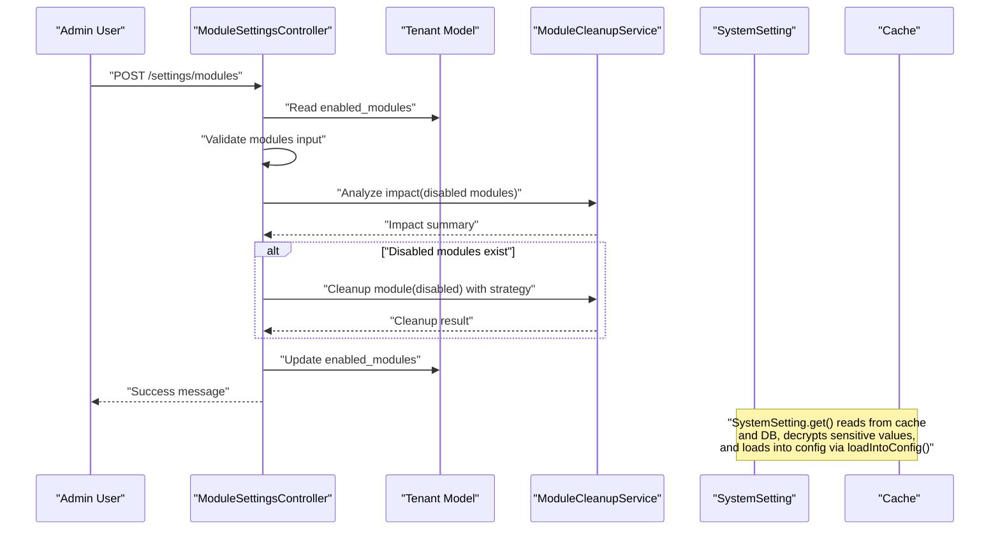

**Diagram sources**
- [ModuleSettingsController.php:25-78](file://app/Http/Controllers/ModuleSettingsController.php#L25-L78)
- [ModuleCleanupService.php](file://app/Services/ModuleCleanupService.php)
- [Tenant.php:64-75](file://app/Models/Tenant.php#L64-L75)
- [SystemSetting.php:98-130](file://app/Models/SystemSetting.php#L98-L130)

## Detailed Component Analysis

### System Settings Framework
- Purpose: Store, retrieve, encrypt, and cache system-wide settings; inject settings into Laravel config.
- Key behaviors:
  - Retrieve settings with default fallback.
  - Encrypt sensitive values when storing.
  - Cache all settings for 60 minutes.
  - Load settings into Laravel config with a key mapping and decrypt when needed.
  - Clear cache after updates.
- Environment integration: Uses environment variables for defaults and runtime overrides.

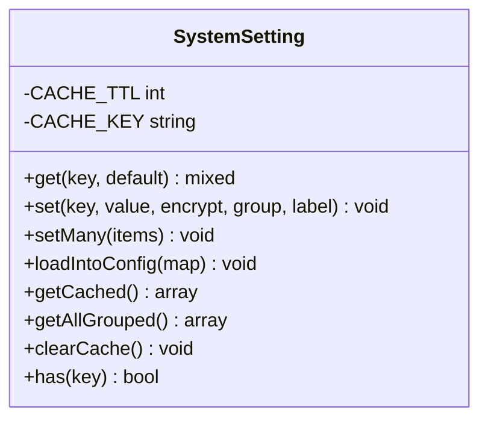

**Diagram sources**
- [SystemSetting.php:1-182](file://app/Models/SystemSetting.php#L1-L182)

**Section sources**
- [SystemSetting.php:26-130](file://app/Models/SystemSetting.php#L26-L130)
- [app.php:1-127](file://config/app.php#L1-L127)

### Tenant Isolation and Overrides
- Purpose: Enforce tenant boundaries across models and support tenant-specific overrides.
- Key behaviors:
  - Automatic global scope filters queries by tenant unless user is super admin or guest.
  - Automatically set tenant_id on model creation when possible.
  - Provide scopes to bypass tenant filtering for administrative tasks.
- Overrides:
  - Tenant model exposes module enablement lists and derived limits/statuses.
  - System settings can be loaded into config to override defaults per tenant.

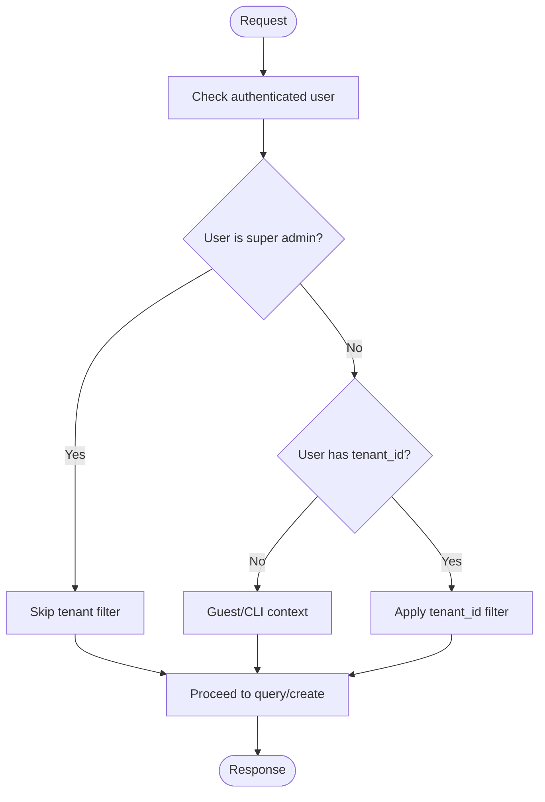

**Diagram sources**
- [BelongsToTenant.php:37-70](file://app/Traits/BelongsToTenant.php#L37-L70)
- [Tenant.php:64-75](file://app/Models/Tenant.php#L64-L75)

**Section sources**
- [BelongsToTenant.php:37-100](file://app/Traits/BelongsToTenant.php#L37-L100)
- [Tenant.php:64-75](file://app/Models/Tenant.php#L64-L75)

### Module Configuration and Cleanup
- Purpose: Allow tenants to enable/disable modules with impact analysis and cleanup strategies.
- Key behaviors:
  - Validate module keys against a canonical list.
  - Compute disabled modules and analyze impact before cleanup.
  - Support cleanup strategies: keep, archive, soft delete.
  - Persist enabled modules on tenant.
  - Provide AI-powered recommendations by industry.

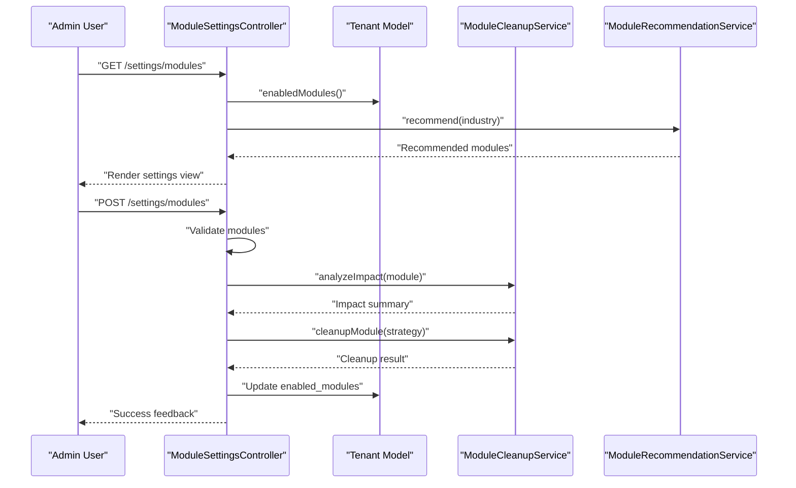

**Diagram sources**
- [ModuleSettingsController.php:12-78](file://app/Http/Controllers/ModuleSettingsController.php#L12-L78)
- [ModuleRecommendationService.php:87-135](file://app/Services/ModuleRecommendationService.php#L87-L135)
- [ModuleCleanupService.php](file://app/Services/ModuleCleanupService.php)

**Section sources**
- [ModuleSettingsController.php:25-78](file://app/Http/Controllers/ModuleSettingsController.php#L25-L78)
- [ModuleRecommendationService.php:8-43](file://app/Services/ModuleRecommendationService.php#L8-L43)
- [ModuleCleanupService.php](file://app/Services/ModuleCleanupService.php)

### Custom Field Management
- Purpose: Add tenant-scoped, module-specific fields and persist values.
- Key behaviors:
  - Define fields per tenant and module with type, options, sort order, and required flag.
  - Persist values per model instance with tenant scoping.
  - Validate required fields.
  - Cache field definitions per tenant/module for performance.
  - Invalidate cache when fields change.

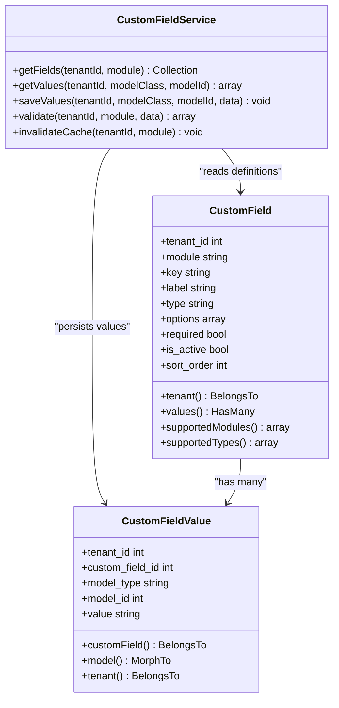

**Diagram sources**
- [CustomField.php:1-56](file://app/Models/CustomField.php#L1-L56)
- [CustomFieldValue.php:1-20](file://app/Models/CustomFieldValue.php#L1-L20)
- [CustomFieldService.php:1-117](file://app/Services/CustomFieldService.php#L1-L117)

**Section sources**
- [CustomFieldService.php:19-92](file://app/Services/CustomFieldService.php#L19-L92)
- [CustomField.php:28-54](file://app/Models/CustomField.php#L28-L54)
- [CustomFieldValue.php:11-19](file://app/Models/CustomFieldValue.php#L11-L19)

### Branding and Theme Customization
- Purpose: Centralize brand colors, gradients, logos, typography, shadows, payment icons, receipts, and feature toggles.
- Mechanism: Environment variables feed defaults in the brand configuration file. These settings influence UI components and payment experiences.

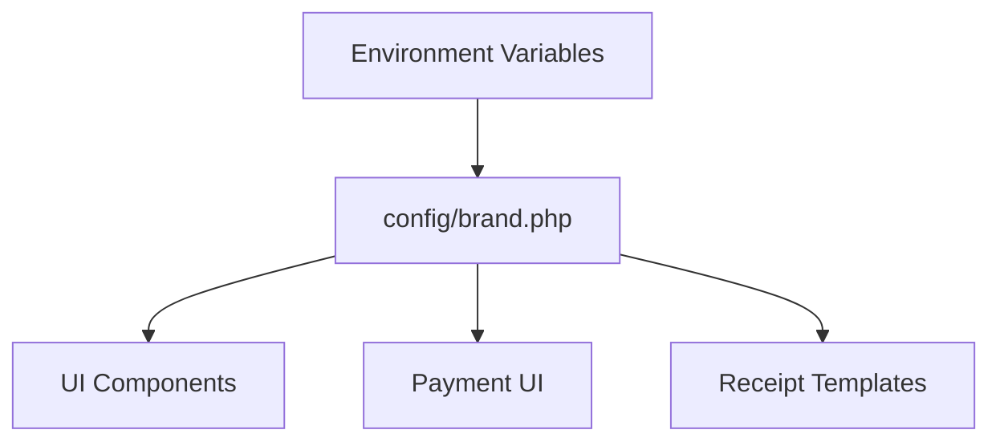

**Diagram sources**
- [brand.php:1-135](file://config/brand.php#L1-L135)

**Section sources**
- [brand.php:14-134](file://config/brand.php#L14-L134)

### Workflows and Automation
- Purpose: Define and execute automated actions triggered by events or schedules.
- Key components:
  - Workflow definition and actions.
  - Workflow engine to evaluate conditions and execute steps.
  - Scheduled processing via console commands.

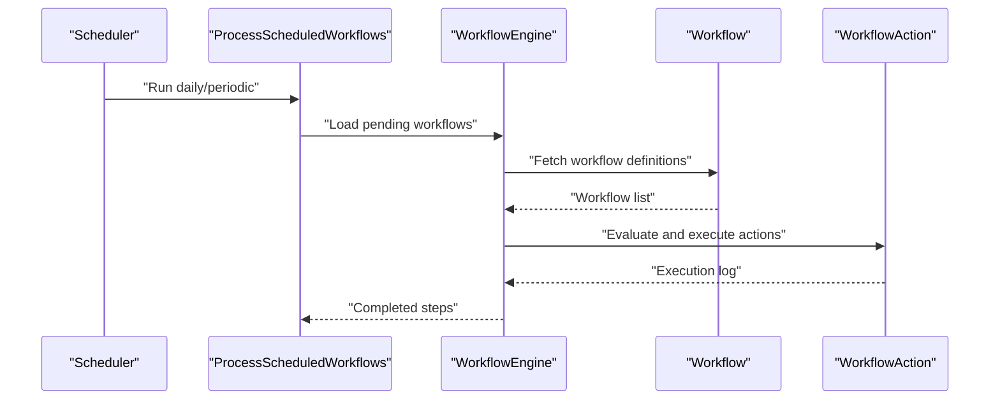

**Diagram sources**
- [ProcessScheduledWorkflows.php](file://app/Console/Commands/ProcessScheduledWorkflows.php)
- [WorkflowEngine.php](file://app/Services/WorkflowEngine.php)
- [Workflow.php](file://app/Models/Workflow.php)
- [WorkflowAction.php](file://app/Models/WorkflowAction.php)

**Section sources**
- [WorkflowEngine.php](file://app/Services/WorkflowEngine.php)
- [Workflow.php](file://app/Models/Workflow.php)
- [WorkflowAction.php](file://app/Models/WorkflowAction.php)
- [ProcessScheduledWorkflows.php](file://app/Console/Commands/ProcessScheduledWorkflows.php)

### Reports and Scheduling
- Purpose: Generate and deliver reports on schedule.
- Mechanism:
  - Report controller orchestrates report generation.
  - Scheduled command triggers periodic report processing.

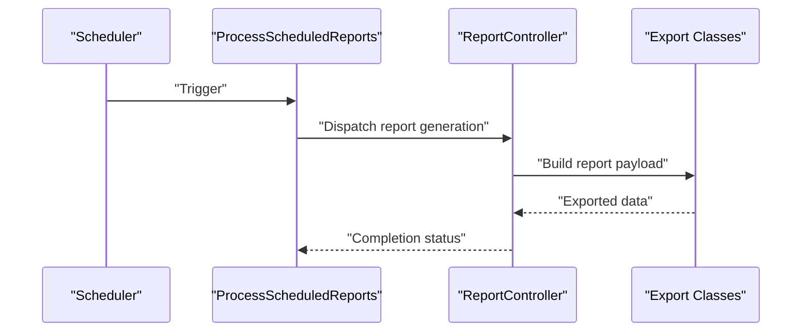

**Diagram sources**
- [ProcessScheduledReports.php](file://app/Console/Commands/ProcessScheduledReports.php)
- [ReportController.php](file://app/Http/Controllers/ReportController.php)

**Section sources**
- [ReportController.php](file://app/Http/Controllers/ReportController.php)
- [ProcessScheduledReports.php](file://app/Console/Commands/ProcessScheduledReports.php)

### Configuration Backup, Migration, and Environment-Specific Settings
- Backup and restore:
  - Automated backup service and restore point service provide backup and recovery mechanisms.
- Migration:
  - Tenant data migration service supports moving tenant data across environments.
- Environment-specific settings:
  - Application configuration and brand configuration rely on environment variables.
  - System settings can be injected into Laravel config for environment-specific overrides.
- Cache invalidation:
  - Clear settings cache command ensures configuration changes take effect immediately.

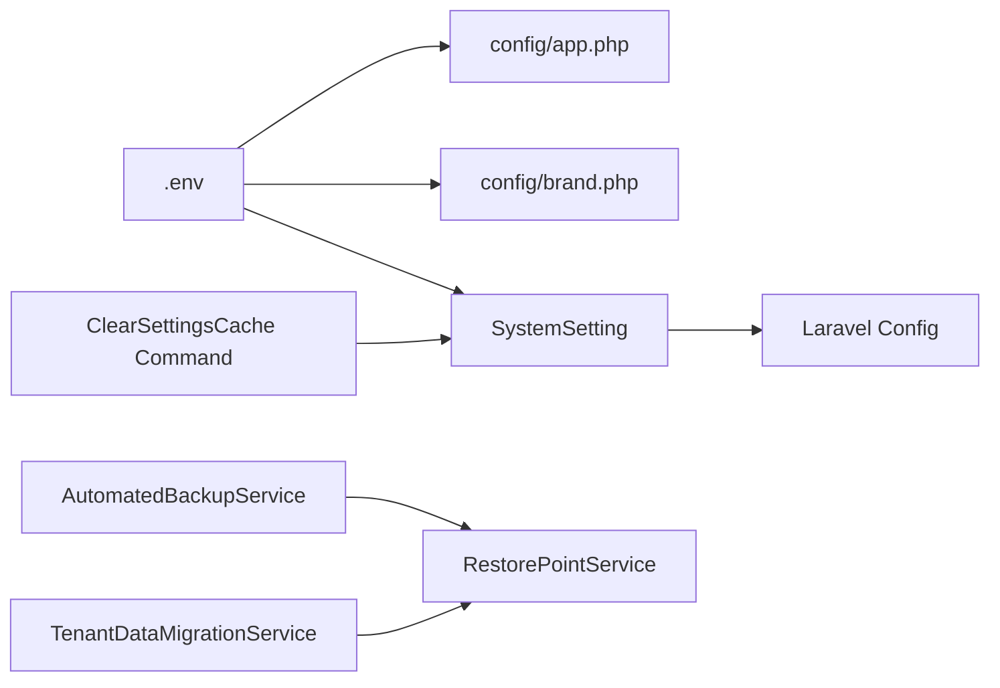

**Diagram sources**
- [app.php:1-127](file://config/app.php#L1-L127)
- [brand.php:1-135](file://config/brand.php#L1-L135)
- [SystemSetting.php:98-130](file://app/Models/SystemSetting.php#L98-L130)
- [AutomatedBackupService.php](file://app/Services/AutomatedBackupService.php)
- [RestorePointService.php](file://app/Services/RestorePointService.php)
- [TenantDataMigrationService.php](file://app/Services/TenantDataMigrationService.php)
- [ClearSettingsCache.php](file://app/Console/Commands/ClearSettingsCache.php)

**Section sources**
- [app.php:16-100](file://config/app.php#L16-L100)
- [brand.php:10-134](file://config/brand.php#L10-L134)
- [SystemSetting.php:98-130](file://app/Models/SystemSetting.php#L98-L130)
- [AutomatedBackupService.php](file://app/Services/AutomatedBackupService.php)
- [RestorePointService.php](file://app/Services/RestorePointService.php)
- [TenantDataMigrationService.php](file://app/Services/TenantDataMigrationService.php)
- [ClearSettingsCache.php](file://app/Console/Commands/ClearSettingsCache.php)

## Dependency Analysis
- Tenant isolation trait is used across models to enforce tenant scoping and automatic tenant_id assignment.
- System settings depend on cache and encryption facilities and are consumed by controllers and services.
- Module configuration depends on recommendation and cleanup services.
- Custom fields depend on tenant scoping and caching.
- Workflows and reports depend on scheduled commands and engines.
- Backup, restore, and migration services are independent but coordinate around tenant data.

```mermaid
graph TB
TRAIT_TENANT["BelongsToTenant Trait"] --> MODEL_TENANT["Tenant Model"]
TRAIT_TENANT --> MODEL_CF["CustomField"]
TRAIT_TENANT --> MODEL_CFV["CustomFieldValue"]
TRAIT_TENANT --> MODEL_CMOD["CustomModule"]
MODEL_SYS["SystemSetting"] --> CFG_APP["config/app.php"]
MODEL_SYS --> CFG_BRAND["config/brand.php"]
CTRL_MOD["ModuleSettingsController"] --> SVC_MOD_REC["ModuleRecommendationService"]
CTRL_MOD --> SVC_MOD_CLEAN["ModuleCleanupService"]
SVC_CF["CustomFieldService"] --> MODEL_CF
SVC_CF --> MODEL_CFV
MODEL_WF["Workflow"] --> SVC_WFE["WorkflowEngine"]
MODEL_WFA["WorkflowAction"] --> SVC_WFE
CTRL_RPT["ReportController"] --> CMD_RPT["ProcessScheduledReports"]
SVC_BACK["AutomatedBackupService"] --> SVC_REST["RestorePointService"]
SVC_MIG["TenantDataMigrationService"] --> SVC_REST
```

**Diagram sources**
- [BelongsToTenant.php:1-110](file://app/Traits/BelongsToTenant.php#L1-L110)
- [Tenant.php:1-223](file://app/Models/Tenant.php#L1-L223)
- [SystemSetting.php:1-182](file://app/Models/SystemSetting.php#L1-L182)
- [ModuleSettingsController.php:1-133](file://app/Http/Controllers/ModuleSettingsController.php#L1-L133)
- [ModuleRecommendationService.php:1-137](file://app/Services/ModuleRecommendationService.php#L1-L137)
- [ModuleCleanupService.php](file://app/Services/ModuleCleanupService.php)
- [CustomFieldService.php:1-117](file://app/Services/CustomFieldService.php#L1-L117)
- [CustomField.php:1-56](file://app/Models/CustomField.php#L1-L56)
- [CustomFieldValue.php:1-20](file://app/Models/CustomFieldValue.php#L1-L20)
- [Workflow.php](file://app/Models/Workflow.php)
- [WorkflowAction.php](file://app/Models/WorkflowAction.php)
- [WorkflowEngine.php](file://app/Services/WorkflowEngine.php)
- [ReportController.php](file://app/Http/Controllers/ReportController.php)
- [ProcessScheduledReports.php](file://app/Console/Commands/ProcessScheduledReports.php)
- [AutomatedBackupService.php](file://app/Services/AutomatedBackupService.php)
- [RestorePointService.php](file://app/Services/RestorePointService.php)
- [TenantDataMigrationService.php](file://app/Services/TenantDataMigrationService.php)

**Section sources**
- [BelongsToTenant.php:37-100](file://app/Traits/BelongsToTenant.php#L37-L100)
- [SystemSetting.php:135-171](file://app/Models/SystemSetting.php#L135-L171)
- [ModuleSettingsController.php:25-78](file://app/Http/Controllers/ModuleSettingsController.php#L25-L78)
- [CustomFieldService.php:19-100](file://app/Services/CustomFieldService.php#L19-L100)
- [WorkflowEngine.php](file://app/Services/WorkflowEngine.php)
- [ReportController.php](file://app/Http/Controllers/ReportController.php)
- [AutomatedBackupService.php](file://app/Services/AutomatedBackupService.php)
- [RestorePointService.php](file://app/Services/RestorePointService.php)
- [TenantDataMigrationService.php](file://app/Services/TenantDataMigrationService.php)

## Performance Considerations
- System settings caching: Settings are cached for 60 minutes to reduce DB queries. Use the cache-clearing command when updating settings.
- Custom field caching: Field definitions are cached per tenant and module to speed up form rendering and validation.
- Tenant scoping: Global scopes add a WHERE clause on tenant_id; ensure proper indexes exist on tenant_id for optimal performance.
- Reports and workflows: Schedule heavy operations during off-peak hours and monitor execution logs.

[No sources needed since this section provides general guidance]

## Troubleshooting Guide
- Settings not applying:
  - Verify environment variables and confirm settings are loaded into config.
  - Clear settings cache to force reload.
- Tenant data leakage or missing data:
  - Confirm user role and tenant_id; super admin bypasses tenant filter.
  - Use tenant-scoped methods to query or create records.
- Module disable issues:
  - Review impact analysis and cleanup strategy; ensure data is archived or deleted as intended.
- Custom field validation errors:
  - Check required fields and ensure values are saved under correct keys.
- Backup/restore failures:
  - Inspect automated backup and restore point services logs; verify permissions and disk space.

**Section sources**
- [ClearSettingsCache.php](file://app/Console/Commands/ClearSettingsCache.php)
- [BelongsToTenant.php:37-100](file://app/Traits/BelongsToTenant.php#L37-L100)
- [ModuleSettingsController.php:39-78](file://app/Http/Controllers/ModuleSettingsController.php#L39-L78)
- [CustomFieldService.php:79-92](file://app/Services/CustomFieldService.php#L79-L92)
- [AutomatedBackupService.php](file://app/Services/AutomatedBackupService.php)
- [RestorePointService.php](file://app/Services/RestorePointService.php)

## Conclusion
Qalcuity ERP provides a robust configuration and customization foundation:
- Centralized, cache-backed system settings with encryption and config injection
- Strong tenant isolation with tenant-scoped models and overrides
- Flexible module enablement with impact analysis and cleanup strategies
- Extensible custom fields per tenant and module
- Branding and theme controls driven by environment variables
- Workflow automation and scheduled reporting
- Backup, restore, and migration services for operational continuity

These capabilities enable administrators to tailor the system to diverse business needs while maintaining data integrity and performance.

[No sources needed since this section summarizes without analyzing specific files]

## Appendices

### Appendix A: Environment Variables and Configuration Keys
- Application configuration keys (from application config):
  - Application name, environment, debug mode, URL, timezone, locale, encryption key, maintenance driver/store.
- Brand configuration keys (from brand config):
  - Colors, gradients, logo, typography, border radius, shadows, payment icons, e-wallets, receipt settings, UI text, feature toggles, quick cash amounts.

**Section sources**
- [app.php:15-124](file://config/app.php#L15-L124)
- [brand.php:14-134](file://config/brand.php#L14-L134)

### Appendix B: Module Enablement Keys and Metadata
- Canonical module keys and metadata are maintained in the recommendation service.
- Module enablement is stored on the tenant model as an array of keys.

**Section sources**
- [ModuleRecommendationService.php:8-81](file://app/Services/ModuleRecommendationService.php#L8-L81)
- [Tenant.php:64-75](file://app/Models/Tenant.php#L64-L75)

### Appendix C: Custom Field Types and Modules
- Supported modules and types are defined in the custom field model.
- Validation and saving leverage module classification.

**Section sources**
- [CustomField.php:28-54](file://app/Models/CustomField.php#L28-L54)
- [CustomFieldService.php:102-115](file://app/Services/CustomFieldService.php#L102-L115)