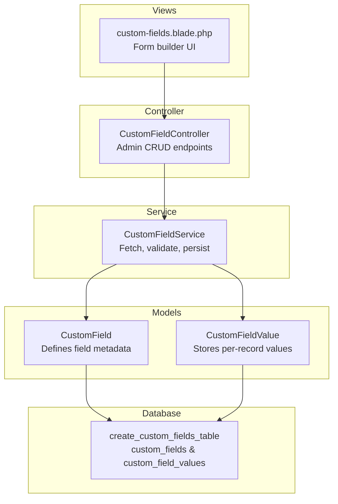
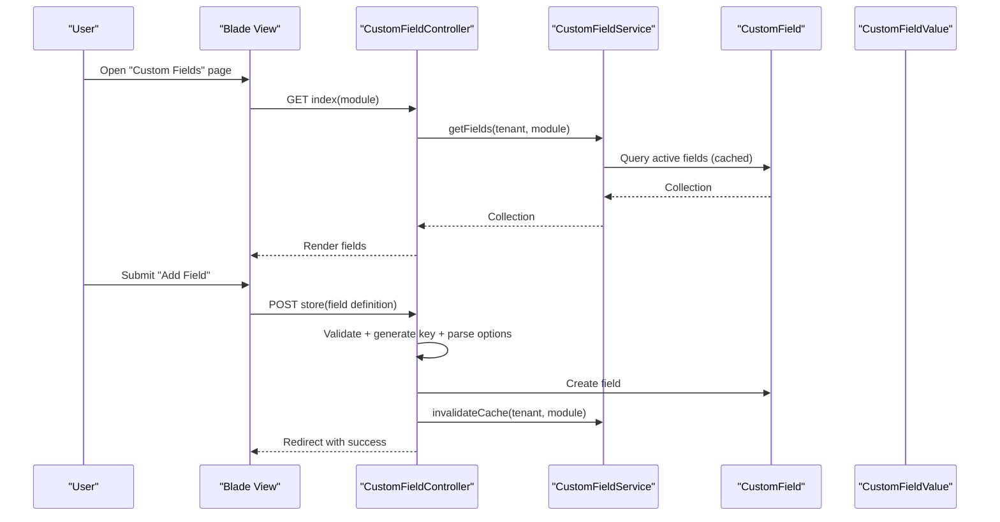
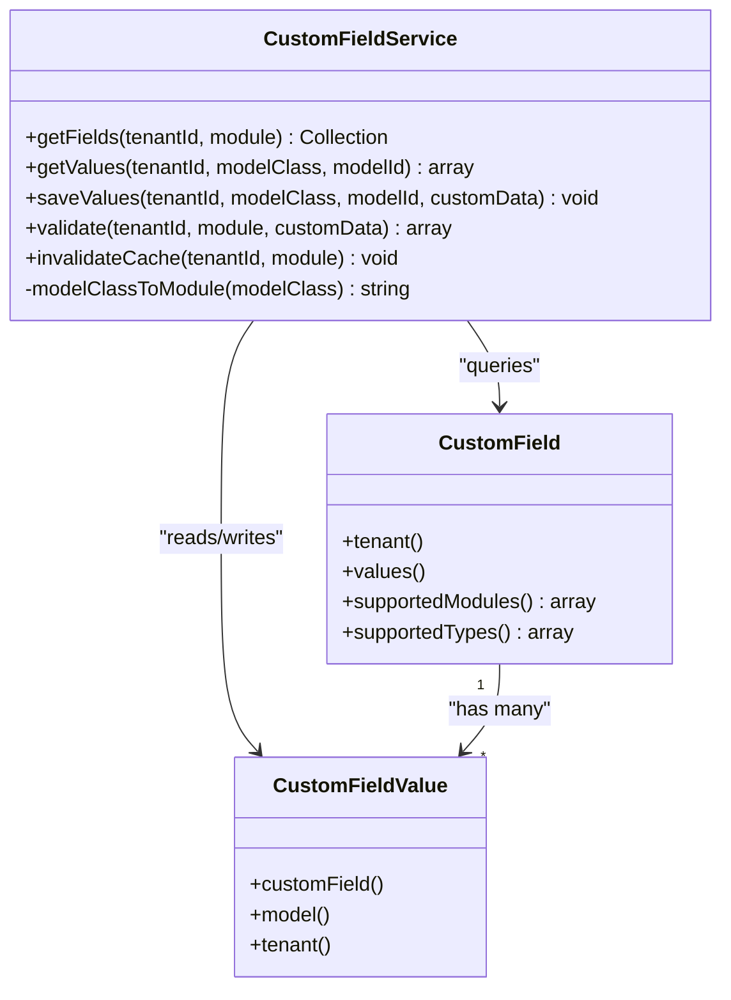
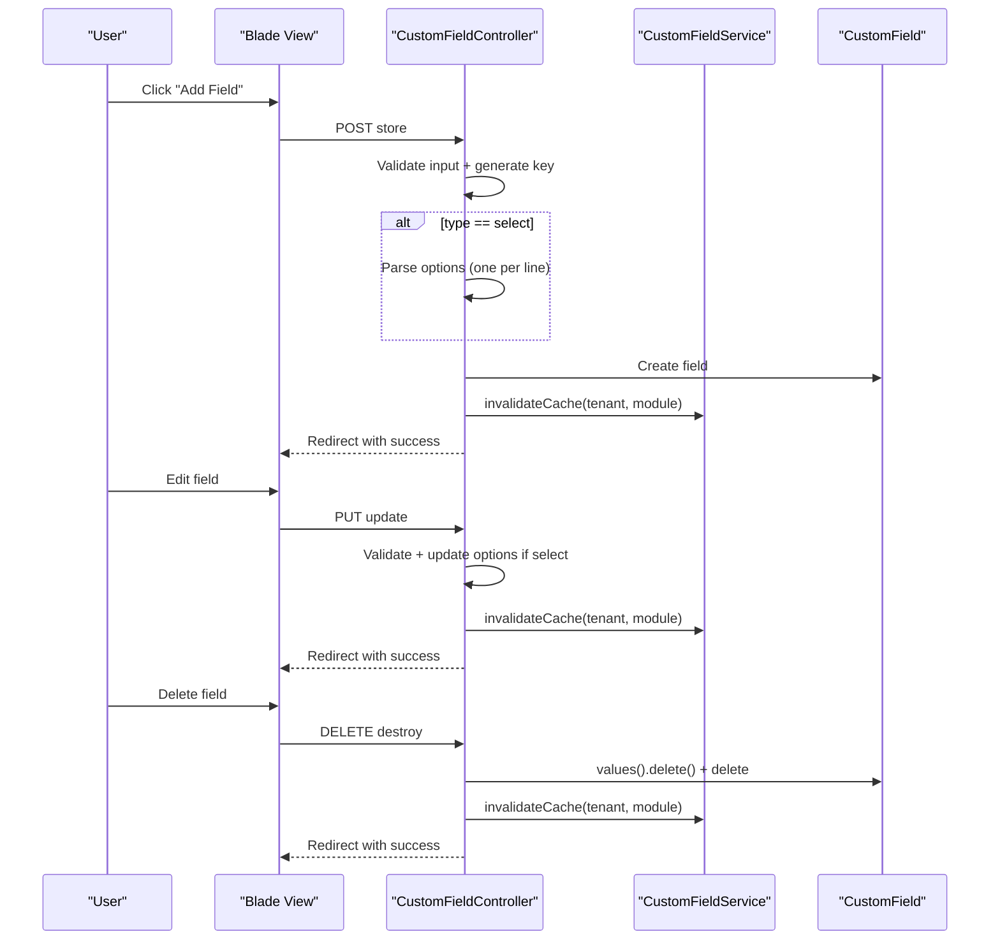
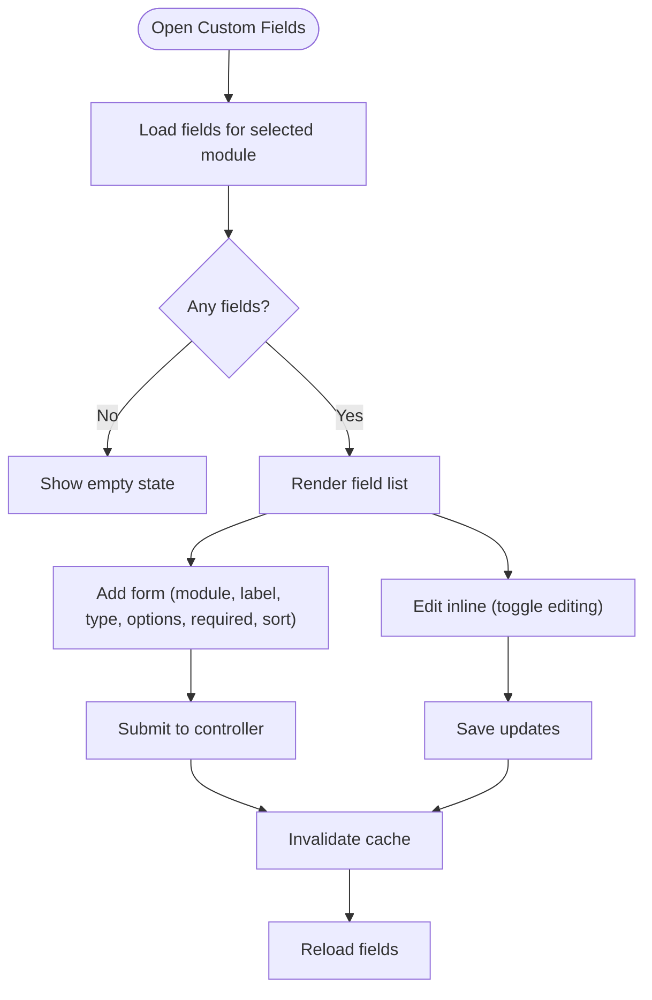
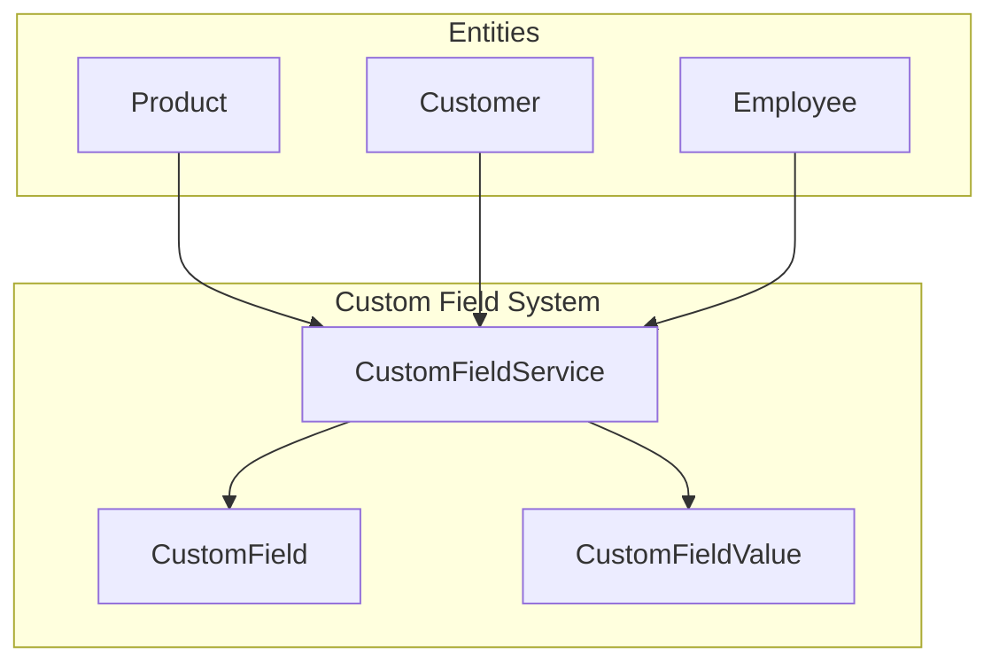
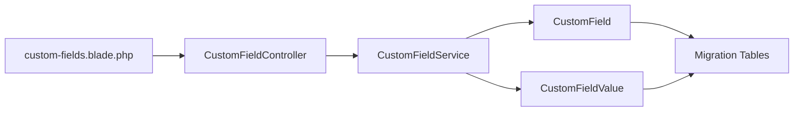

# Custom Fields & Forms

<cite>
**Referenced Files in This Document**
- [CustomField.php](file://app/Models/CustomField.php)
- [CustomFieldValue.php](file://app/Models/CustomFieldValue.php)
- [CustomFieldService.php](file://app/Services/CustomFieldService.php)
- [CustomFieldController.php](file://app/Http/Controllers/CustomFieldController.php)
- [2026_03_23_000054_create_custom_fields_table.php](file://database/migrations/2026_03_23_000054_create_custom_fields_table.php)
- [custom-fields.blade.php](file://resources/views/settings/custom-fields.blade.php)
- [Product.php](file://app/Models/Product.php)
- [Customer.php](file://app/Models/Customer.php)
- [Employee.php](file://app/Models/Employee.php)
</cite>

## Table of Contents
1. [Introduction](#introduction)
2. [Project Structure](#project-structure)
3. [Core Components](#core-components)
4. [Architecture Overview](#architecture-overview)
5. [Detailed Component Analysis](#detailed-component-analysis)
6. [Dependency Analysis](#dependency-analysis)
7. [Performance Considerations](#performance-considerations)
8. [Troubleshooting Guide](#troubleshooting-guide)
9. [Conclusion](#conclusion)
10. [Appendices](#appendices)

## Introduction
This document explains Qalcuity ERP’s custom field system and form customization capabilities. It covers the dynamic field creation framework, supported field types (text, numeric, date, select, checkbox, textarea), validation rules, and display options. It also documents the custom field service architecture, field inheritance patterns via module scoping, and data persistence mechanisms. Step-by-step guides show how to create custom fields for products, customers, and employees, configure field visibility and ordering, and integrate custom fields into existing workflows. Finally, it outlines form builder functionality, field reordering, conditional logic, and mobile-responsive form designs.

## Project Structure
The custom field system spans models, a dedicated service, a controller, Blade views, and database migrations. The models define the schema and relationships; the service encapsulates retrieval, validation, and persistence of custom field values; the controller exposes admin endpoints; the view renders the form builder UI; and the migration defines the relational schema.



**Diagram sources**
- [CustomField.php:11-55](file://app/Models/CustomField.php#L11-L55)
- [CustomFieldValue.php:11-19](file://app/Models/CustomFieldValue.php#L11-L19)
- [CustomFieldService.php:14-116](file://app/Services/CustomFieldService.php#L14-L116)
- [CustomFieldController.php:9-115](file://app/Http/Controllers/CustomFieldController.php#L9-L115)
- [custom-fields.blade.php:1-155](file://resources/views/settings/custom-fields.blade.php#L1-L155)
- [2026_03_23_000054_create_custom_fields_table.php:10-48](file://database/migrations/2026_03_23_000054_create_custom_fields_table.php#L10-L48)

**Section sources**
- [CustomField.php:11-55](file://app/Models/CustomField.php#L11-L55)
- [CustomFieldValue.php:11-19](file://app/Models/CustomFieldValue.php#L11-L19)
- [CustomFieldService.php:14-116](file://app/Services/CustomFieldService.php#L14-L116)
- [CustomFieldController.php:9-115](file://app/Http/Controllers/CustomFieldController.php#L9-L115)
- [custom-fields.blade.php:1-155](file://resources/views/settings/custom-fields.blade.php#L1-L155)
- [2026_03_23_000054_create_custom_fields_table.php:10-48](file://database/migrations/2026_03_23_000054_create_custom_fields_table.php#L10-L48)

## Core Components
- CustomField: Defines field metadata (module, key, label, type, options, required flag, sort order, activation status) and relationships to tenant and values.
- CustomFieldValue: Stores per-record values with polymorphic linkage to any model type and tenant scoping.
- CustomFieldService: Centralized logic for fetching active fields, retrieving stored values, saving values, validating required fields, and cache invalidation.
- CustomFieldController: Admin interface for creating, updating, and deleting fields; generates keys and parses select options.
- Blade Template: Provides a form builder UI for managing fields and their properties.
- Migration: Creates two tables with tenant scoping, unique constraints per record, and appropriate indexes.

Key capabilities:
- Dynamic field creation per module and tenant.
- Supported field types: text, number, date, select, checkbox, textarea.
- Required validation and optional select options parsing.
- Per-record value storage with polymorphic model linkage.
- Cache-backed retrieval of active fields.

**Section sources**
- [CustomField.php:14-54](file://app/Models/CustomField.php#L14-L54)
- [CustomFieldValue.php:13-18](file://app/Models/CustomFieldValue.php#L13-L18)
- [CustomFieldService.php:19-92](file://app/Services/CustomFieldService.php#L19-L92)
- [CustomFieldController.php:29-114](file://app/Http/Controllers/CustomFieldController.php#L29-L114)
- [custom-fields.blade.php:13-55](file://resources/views/settings/custom-fields.blade.php#L13-L55)
- [2026_03_23_000054_create_custom_fields_table.php:10-48](file://database/migrations/2026_03_23_000054_create_custom_fields_table.php#L10-L48)

## Architecture Overview
The system follows a layered architecture:
- Presentation: Blade view renders the form builder and manages UI state.
- Application: Controller validates and persists field definitions; invalidates caches.
- Domain: Service encapsulates business logic for field retrieval, validation, and persistence.
- Persistence: Models map to relational tables with tenant scoping and polymorphic linkage.



**Diagram sources**
- [custom-fields.blade.php:13-55](file://resources/views/settings/custom-fields.blade.php#L13-L55)
- [CustomFieldController.php:15-74](file://app/Http/Controllers/CustomFieldController.php#L15-L74)
- [CustomFieldService.php:19-28](file://app/Services/CustomFieldService.php#L19-L28)
- [CustomField.php:14-26](file://app/Models/CustomField.php#L14-L26)

**Section sources**
- [CustomFieldController.php:15-74](file://app/Http/Controllers/CustomFieldController.php#L15-L74)
- [CustomFieldService.php:19-28](file://app/Services/CustomFieldService.php#L19-L28)
- [custom-fields.blade.php:13-55](file://resources/views/settings/custom-fields.blade.php#L13-L55)

## Detailed Component Analysis

### Data Model Layer
The schema supports multi-tenant isolation and flexible per-record values.

```mermaid
erDiagram
CUSTOM_FIELDS {
bigint id PK
bigint tenant_id
string module
string key
string label
string type
json options
boolean required
boolean is_active
smallint sort_order
timestamps created_at, updated_at
}
CUSTOM_FIELD_VALUES {
bigint id PK
bigint tenant_id
bigint custom_field_id FK
string model_type
bigint model_id
text value
timestamps created_at, updated_at
}
TENANT ||--o{ CUSTOM_FIELDS : "owns"
CUSTOM_FIELDS ||--o{ CUSTOM_FIELD_VALUES : "defines"
CUSTOM_FIELD_VALUES ||--|| CUSTOM_FIELDS : "has"
```

- Unique constraint ensures one value per field per record.
- Indexes optimize lookups by tenant and model.
- Options are stored as JSON for select-type fields.

**Diagram sources**
- [2026_03_23_000054_create_custom_fields_table.php:10-48](file://database/migrations/2026_03_23_000054_create_custom_fields_table.php#L10-L48)

**Section sources**
- [2026_03_23_000054_create_custom_fields_table.php:10-48](file://database/migrations/2026_03_23_000054_create_custom_fields_table.php#L10-L48)
- [CustomField.php:14-26](file://app/Models/CustomField.php#L14-L26)
- [CustomFieldValue.php:13-18](file://app/Models/CustomFieldValue.php#L13-L18)

### Service Layer
The service centralizes field retrieval, validation, and persistence.



- getFields fetches active fields ordered by sort_order and caches them.
- getValues returns a keyed array of field values for a given record.
- saveValues persists values for known fields; arrays are serialized to comma-separated strings.
- validate checks required fields against submitted data.
- modelClassToModule maps Eloquent model classes to module identifiers.

**Diagram sources**
- [CustomFieldService.php:19-116](file://app/Services/CustomFieldService.php#L19-L116)
- [CustomField.php:25-26](file://app/Models/CustomField.php#L25-L26)
- [CustomFieldValue.php:16-18](file://app/Models/CustomFieldValue.php#L16-L18)

**Section sources**
- [CustomFieldService.php:19-116](file://app/Services/CustomFieldService.php#L19-L116)
- [CustomField.php:28-54](file://app/Models/CustomField.php#L28-L54)

### Controller Layer
The controller handles admin actions for field definitions.



- Keys are generated from labels and suffixed with timestamp if duplicates exist.
- Select options are parsed from newline-separated entries.
- Cache is invalidated after any change to ensure immediate effect.

**Diagram sources**
- [CustomFieldController.php:29-114](file://app/Http/Controllers/CustomFieldController.php#L29-L114)
- [CustomFieldService.php:97-100](file://app/Services/CustomFieldService.php#L97-L100)

**Section sources**
- [CustomFieldController.php:29-114](file://app/Http/Controllers/CustomFieldController.php#L29-L114)
- [CustomFieldService.php:97-100](file://app/Services/CustomFieldService.php#L97-L100)

### UI and Form Builder
The Blade template provides a responsive form builder with:
- Module tabs to switch contexts.
- Add form with module selection, label, type selector, optional options for select, required toggle, and sort order.
- Edit inline with toggled editing state and per-field controls.
- Real-time UI feedback for required and inactive fields.



**Diagram sources**
- [custom-fields.blade.php:13-55](file://resources/views/settings/custom-fields.blade.php#L13-L55)
- [custom-fields.blade.php:78-150](file://resources/views/settings/custom-fields.blade.php#L78-L150)

**Section sources**
- [custom-fields.blade.php:13-55](file://resources/views/settings/custom-fields.blade.php#L13-L55)
- [custom-fields.blade.php:78-150](file://resources/views/settings/custom-fields.blade.php#L78-L150)

### Field Types, Validation, and Display
Supported types and their characteristics:
- Text: Free-form string input.
- Number: Numeric input; service stores as string; downstream casting can be applied by consumers.
- Date: Date input; service stores as string; consumers can cast to date/datetime.
- Select: Dropdown with newline-separated options; options stored as JSON.
- Checkbox: Boolean-like toggle; service stores as string; consumers interpret as boolean.
- Textarea: Multi-line text input.

Validation:
- Required fields are enforced during submission; missing required values produce error messages keyed by field key.

Display options:
- Sort order controls rendering order.
- Active/inactive toggles enable/disable fields without deletion.
- Required indicators improve UX.

**Section sources**
- [CustomField.php:44-54](file://app/Models/CustomField.php#L44-L54)
- [CustomFieldService.php:79-92](file://app/Services/CustomFieldService.php#L79-L92)
- [CustomFieldController.php:53-57](file://app/Http/Controllers/CustomFieldController.php#L53-L57)

### Field Inheritance Patterns and Module Scoping
- Tenant scoping ensures isolation across environments.
- Module scoping groups fields by domain (e.g., product, customer, employee).
- Polymorphic linkage allows any model to attach values via model_type and model_id.
- Inheritance pattern: fields are inherited by records through the polymorphic relationship; no explicit inheritance among fields is implemented—instead, module scoping and caching provide effective inheritance semantics.

**Section sources**
- [CustomField.php:25-26](file://app/Models/CustomField.php#L25-L26)
- [CustomFieldValue.php:16-18](file://app/Models/CustomFieldValue.php#L16-L18)
- [CustomFieldService.php:34-44](file://app/Services/CustomFieldService.php#L34-L44)

### Data Persistence Mechanisms
- Values are persisted per record with a unique composite key (field × model type × model id).
- Arrays are serialized to comma-separated strings for multi-select or multi-value scenarios.
- Tenant scoping is enforced in queries and writes.
- Indexes support efficient lookups by tenant and model.

**Section sources**
- [CustomFieldService.php:50-73](file://app/Services/CustomFieldService.php#L50-L73)
- [CustomFieldValue.php:14](file://app/Models/CustomFieldValue.php#L14)
- [2026_03_23_000054_create_custom_fields_table.php:38-39](file://database/migrations/2026_03_23_000054_create_custom_fields_table.php#L38-L39)

## Architecture Overview
The system integrates seamlessly with existing models and workflows:
- Products, customers, and employees are standard Eloquent models that can leverage custom fields via the service.
- Workflows can call the service to validate and persist custom data alongside standard attributes.
- Views can render custom fields by fetching active fields and values for a record.



**Diagram sources**
- [Product.php:12-70](file://app/Models/Product.php#L12-L70)
- [Customer.php:14-90](file://app/Models/Customer.php#L14-L90)
- [Employee.php:13-99](file://app/Models/Employee.php#L13-L99)
- [CustomFieldService.php:19-44](file://app/Services/CustomFieldService.php#L19-L44)

**Section sources**
- [Product.php:12-70](file://app/Models/Product.php#L12-L70)
- [Customer.php:14-90](file://app/Models/Customer.php#L14-L90)
- [Employee.php:13-99](file://app/Models/Employee.php#L13-L99)
- [CustomFieldService.php:19-44](file://app/Services/CustomFieldService.php#L19-L44)

## Detailed Component Analysis

### Creating Custom Fields for Entities
Step-by-step for adding a custom field to a module:
1. Navigate to the “Custom Fields” page and select the target module (e.g., product, customer, employee).
2. Fill in the label; the system auto-generates a key (ensuring uniqueness per module).
3. Choose the field type; for select, enter options, one per line.
4. Toggle required and set sort order.
5. Submit to create the field; the service invalidates cache immediately.

Guides by entity:
- Products: Add fields like “Brand,” “HS Code,” or “Warranty Period.”
- Customers: Add fields like “Sales Rep,” “Credit Terms,” or “Preferred Payment Method.”
- Employees: Add fields like “Emergency Contact,” “Department Tag,” or “Badge Number.”

Visibility and ordering:
- Use the sort order field to control display precedence.
- Toggle is_active to hide fields without losing historical data.

Integration into workflows:
- Before saving a record, collect custom fields via the service’s getFields and validate via validate.
- On successful validation, persist values using saveValues with the record’s model class and ID.

**Section sources**
- [CustomFieldController.php:29-74](file://app/Http/Controllers/CustomFieldController.php#L29-L74)
- [CustomFieldService.php:19-92](file://app/Services/CustomFieldService.php#L19-L92)

### Retrieving and Rendering Custom Fields
- Retrieve active fields for a tenant and module using getFields.
- Fetch values for a specific record using getValues.
- Render fields in views by iterating over returned collections and values.

**Section sources**
- [CustomFieldService.php:19-44](file://app/Services/CustomFieldService.php#L19-L44)

### Saving and Validating Custom Values
- Validation: Call validate with tenant, module, and submitted data to receive error messages for missing required fields.
- Persistence: Call saveValues with tenant, model class, model ID, and associative array of field keys to values.

Notes:
- Arrays are serialized to comma-separated strings.
- Unknown keys are ignored to prevent injection.

**Section sources**
- [CustomFieldService.php:79-92](file://app/Services/CustomFieldService.php#L79-L92)
- [CustomFieldService.php:50-73](file://app/Services/CustomFieldService.php#L50-L73)

### Conditional Logic and Visibility
- The current implementation does not include built-in conditional visibility logic for fields.
- Recommended approach: Implement client-side visibility rules in the Blade view (e.g., Alpine.js) based on related field values, or introduce a visibility expression engine in the service layer.

[No sources needed since this section provides general guidance]

### Mobile-Responsive Form Design
- The Blade template uses Tailwind-based responsive grids and spacing.
- Inline editing toggles reduce page reloads and improve mobile usability.
- Consider adding responsive breakpoints and touch-friendly controls for optimal mobile experience.

**Section sources**
- [custom-fields.blade.php:9-155](file://resources/views/settings/custom-fields.blade.php#L9-L155)

## Dependency Analysis


- Coupling: Controller depends on Service; Service depends on Models.
- Cohesion: Service encapsulates field logic; Controller focuses on HTTP concerns.
- External dependencies: Eloquent ORM, Laravel Collections, Blade templating.

Potential circular dependencies: None observed.

**Diagram sources**
- [CustomFieldController.php:13](file://app/Http/Controllers/CustomFieldController.php#L13)
- [CustomFieldService.php:5-6](file://app/Services/CustomFieldService.php#L5-L6)
- [CustomField.php:11-26](file://app/Models/CustomField.php#L11-L26)
- [CustomFieldValue.php:11-18](file://app/Models/CustomFieldValue.php#L11-L18)
- [custom-fields.blade.php:1](file://resources/views/settings/custom-fields.blade.php#L1)

**Section sources**
- [CustomFieldController.php:13](file://app/Http/Controllers/CustomFieldController.php#L13)
- [CustomFieldService.php:5-6](file://app/Services/CustomFieldService.php#L5-L6)
- [CustomField.php:11-26](file://app/Models/CustomField.php#L11-L26)
- [CustomFieldValue.php:11-18](file://app/Models/CustomFieldValue.php#L11-L18)
- [custom-fields.blade.php:1](file://resources/views/settings/custom-fields.blade.php#L1)

## Performance Considerations
- Caching: Active fields are cached per tenant and module; cache is invalidated on changes to ensure freshness.
- Indexes: Unique and composite indexes optimize lookups by field, tenant, and model.
- Serialization: Arrays are flattened to strings; consider normalization if frequent aggregation is required.
- Pagination: For large datasets, paginate field lists and values.

**Section sources**
- [CustomFieldService.php:21-27](file://app/Services/CustomFieldService.php#L21-L27)
- [CustomFieldService.php:97-100](file://app/Services/CustomFieldService.php#L97-L100)
- [2026_03_23_000054_create_custom_fields_table.php:24-39](file://database/migrations/2026_03_23_000054_create_custom_fields_table.php#L24-L39)

## Troubleshooting Guide
Common issues and resolutions:
- Duplicate keys: The controller appends a timestamp to ensure uniqueness; verify the generated key and adjust label accordingly.
- Select options not saving: Ensure options are entered one per line; the controller trims and filters entries.
- Required field errors: Confirm that required fields are present in the submitted data; validation returns messages keyed by field key.
- Cache stale fields: After edits, cache is invalidated automatically; if stale, trigger a hard refresh or wait for cache TTL.
- Values not appearing: Verify tenant scoping and that the record’s model class matches the expected namespace used by the service.

**Section sources**
- [CustomFieldController.php:40-51](file://app/Http/Controllers/CustomFieldController.php#L40-L51)
- [CustomFieldController.php:88-91](file://app/Http/Controllers/CustomFieldController.php#L88-L91)
- [CustomFieldService.php:79-92](file://app/Services/CustomFieldService.php#L79-L92)
- [CustomFieldService.php:97-100](file://app/Services/CustomFieldService.php#L97-L100)

## Conclusion
Qalcuity ERP’s custom field system provides a robust, tenant-scoped, and cache-backed framework for extending entity forms. With support for multiple field types, required validation, and polymorphic value storage, it integrates cleanly with existing models and workflows. Administrators can manage fields via a responsive UI, while developers can rely on a cohesive service layer for retrieval, validation, and persistence. Extending visibility rules and enhancing conditional logic would further strengthen the system for complex form customization needs.

## Appendices

### Supported Modules and Types Reference
- Modules: invoice, product, customer, supplier, employee, sales_order, purchase_order, expense.
- Types: text, number, date, select, checkbox, textarea.

**Section sources**
- [CustomField.php:29-54](file://app/Models/CustomField.php#L29-L54)