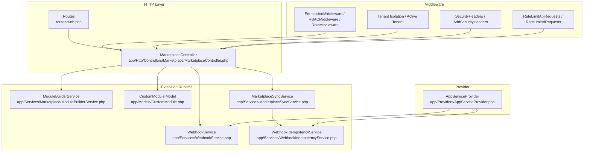
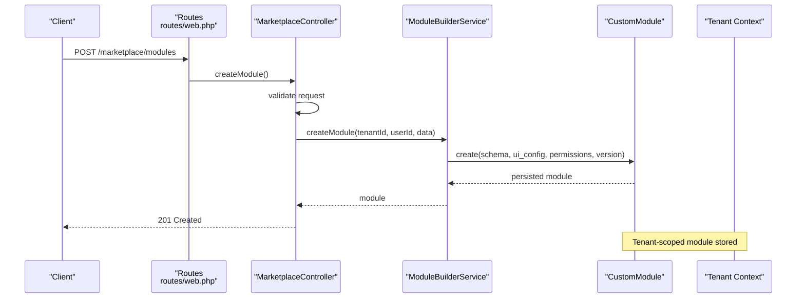
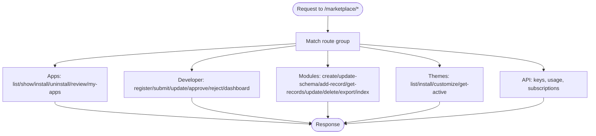
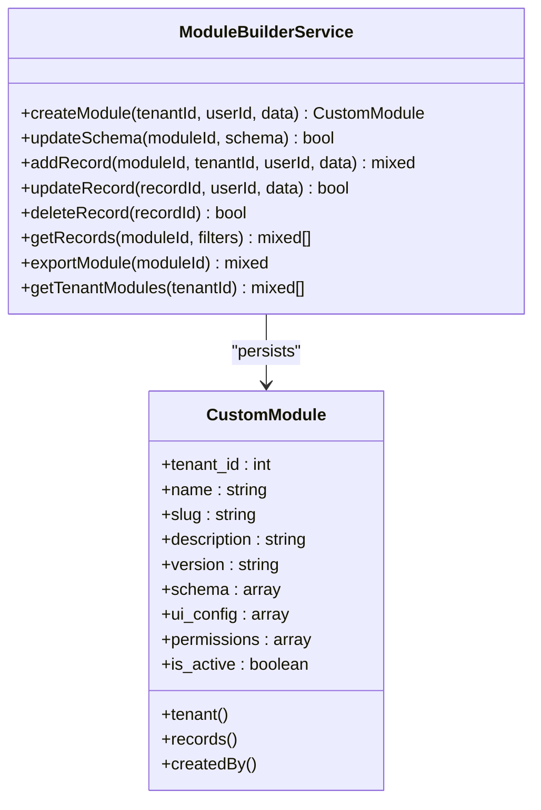
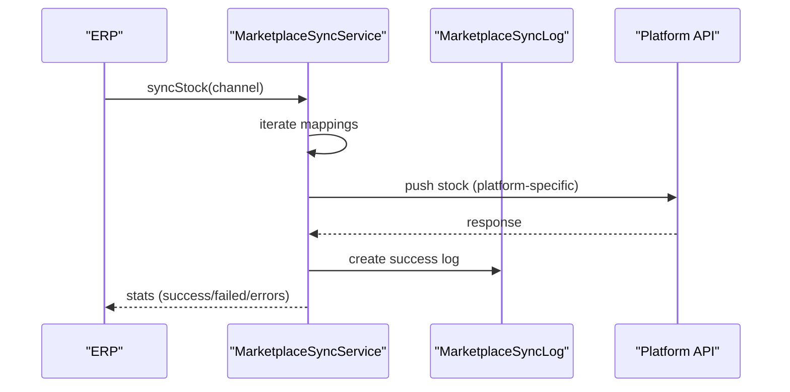
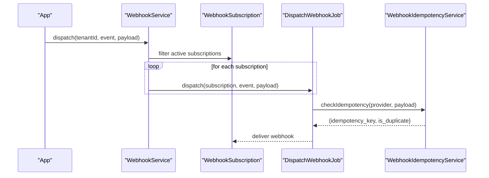
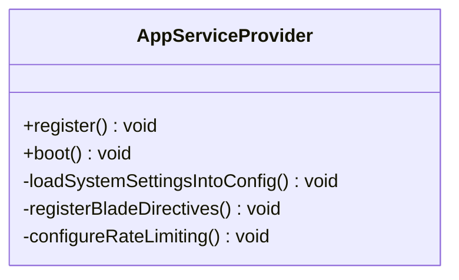
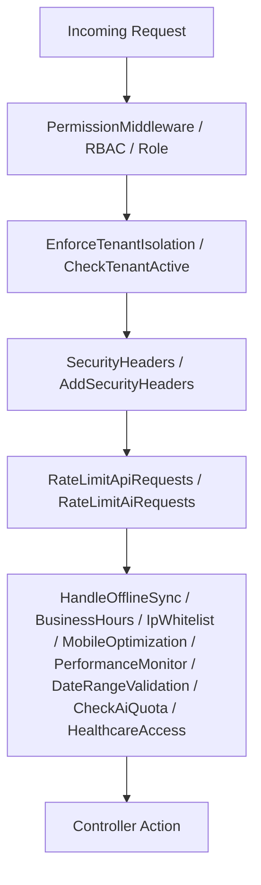
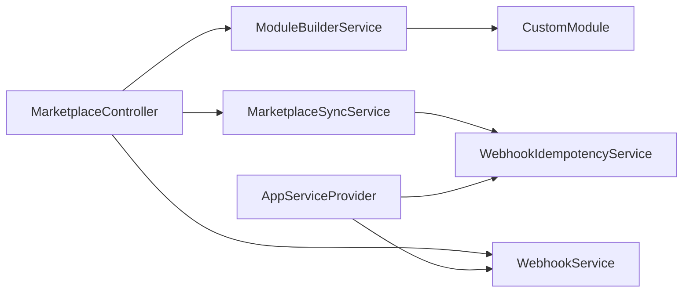

# Extensions & Plugins

<cite>
**Referenced Files in This Document**
- [routes/web.php](file://routes/web.php)
- [app/Http/Controllers/Marketplace/MarketplaceController.php](file://app/Http/Controllers/Marketplace/MarketplaceController.php)
- [app/Services/Marketplace/ModuleBuilderService.php](file://app/Services/Marketplace/ModuleBuilderService.php)
- [app/Models/CustomModule.php](file://app/Models/CustomModule.php)
- [app/Jobs/ProcessMarketplaceWebhook.php](file://app/Jobs/ProcessMarketplaceWebhook.php)
- [app/Services/MarketplaceSyncService.php](file://app/Services/MarketplaceSyncService.php)
- [app/Services/WebhookService.php](file://app/Services/WebhookService.php)
- [app/Services/WebhookIdempotencyService.php](file://app/Services/WebhookIdempotencyService.php)
- [app/Providers/AppServiceProvider.php](file://app/Providers/AppServiceProvider.php)
- [app/Http/Middleware/CheckPermissionMiddleware.php](file://app/Http/Middleware/CheckPermissionMiddleware.php)
- [app/Http/Middleware/PermissionMiddleware.php](file://app/Http/Middleware/PermissionMiddleware.php)
- [app/Http/Middleware/RBACMiddleware.php](file://app/Http/Middleware/RBACMiddleware.php)
- [app/Http/Middleware/RoleMiddleware.php](file://app/Http/Middleware/RoleMiddleware.php)
- [app/Http/Middleware/EnforceTenantIsolation.php](file://app/Http/Middleware/EnforceTenantIsolation.php)
- [app/Http/Middleware/CheckTenantActive.php](file://app/Http/Middleware/CheckTenantActive.php)
- [app/Http/Middleware/ApiTokenAuth.php](file://app/Http/Middleware/ApiTokenAuth.php)
- [app/Http/Middleware/RateLimitApiRequests.php](file://app/Http/Middleware/RateLimitApiRequests.php)
- [app/Http/Middleware/RateLimitAiRequests.php](file://app/Http/Middleware/RateLimitAiRequests.php)
- [app/Http/Middleware/SecurityHeaders.php](file://app/Http/Middleware/SecurityHeaders.php)
- [app/Http/Middleware/AddSecurityHeaders.php](file://app/Http/Middleware/AddSecurityHeaders.php)
- [app/Http/Middleware/AuditTrailMiddleware.php](file://app/Http/Middleware/AuditTrailMiddleware.php)
- [app/Http/Middleware/HandleOfflineSync.php](file://app/Http/Middleware/HandleOfflineSync.php)
- [app/Http/Middleware/BusinessHoursMiddleware.php](file://app/Http/Middleware/BusinessHoursMiddleware.php)
- [app/Http/Middleware/IpWhitelistMiddleware.php](file://app/Http/Middleware/IpWhitelistMiddleware.php)
- [app/Http/Middleware/MobileOptimization.php](file://app/Http/Middleware/MobileOptimization.php)
- [app/Http/Middleware/PerformanceMonitor.php](file://app/Http/Middleware/PerformanceMonitor.php)
- [app/Http/Middleware/DateRangeValidation.php](file://app/Http/Middleware/DateRangeValidation.php)
- [app/Http/Middleware/CheckAiQuota.php](file://app/Http/Middleware/CheckAiQuota.php)
- [app/Http/Middleware/HealthcareAccessMiddleware.php](file://app/Http/Middleware/HealthcareAccessMiddleware.php)
- [tests/Feature/MarketplaceSyncTest.php](file://tests/Feature/MarketplaceSyncTest.php)
</cite>

## Table of Contents
1. [Introduction](#introduction)
2. [Project Structure](#project-structure)
3. [Core Components](#core-components)
4. [Architecture Overview](#architecture-overview)
5. [Detailed Component Analysis](#detailed-component-analysis)
6. [Dependency Analysis](#dependency-analysis)
7. [Performance Considerations](#performance-considerations)
8. [Troubleshooting Guide](#troubleshooting-guide)
9. [Conclusion](#conclusion)
10. [Appendices](#appendices)

## Introduction
This document explains how to extend Qalcuity ERP through plugins, modules, and marketplace extensions. It covers the extension architecture, service provider registration, custom module development lifecycle, and marketplace integration patterns. You will learn how to use the module builder toolkit, register custom services, integrate middleware, and leverage the event/webhook system. Step-by-step guides are included for creating custom modules, developing marketplace apps, implementing custom controllers and services, and publishing extensions to the marketplace. The guide also addresses installation, activation, dependency management, and version compatibility.

## Project Structure
Qalcuity organizes extension capabilities around:
- Marketplace routes and controller actions for apps, modules, themes, and API monetization
- A module builder service and model for dynamic custom modules
- Outbound marketplace sync services and inbound webhook processing
- A robust webhook system with idempotency and delivery orchestration
- A wide set of middleware for permissions, isolation, security, and performance
- A service provider for registering singletons and blade directives

**Diagram sources**
- [routes/web.php:2886-2956](file://routes/web.php#L2886-L2956)
- [app/Http/Controllers/Marketplace/MarketplaceController.php:13-673](file://app/Http/Controllers/Marketplace/MarketplaceController.php#L13-L673)
- [app/Services/Marketplace/ModuleBuilderService.php:9-46](file://app/Services/Marketplace/ModuleBuilderService.php#L9-L46)
- [app/Models/CustomModule.php:10-47](file://app/Models/CustomModule.php#L10-L47)
- [app/Services/MarketplaceSyncService.php:22-439](file://app/Services/MarketplaceSyncService.php#L22-L439)
- [app/Services/WebhookService.php:48-131](file://app/Services/WebhookService.php#L48-L131)
- [app/Services/WebhookIdempotencyService.php:20-41](file://app/Services/WebhookIdempotencyService.php#L20-L41)
- [app/Providers/AppServiceProvider.php:24-117](file://app/Providers/AppServiceProvider.php#L24-L117)

**Section sources**
- [routes/web.php:2886-2956](file://routes/web.php#L2886-L2956)
- [app/Http/Controllers/Marketplace/MarketplaceController.php:13-673](file://app/Http/Controllers/Marketplace/MarketplaceController.php#L13-L673)

## Core Components
- Marketplace routes and controller actions expose endpoints for browsing, installing, configuring, rating, and managing apps, modules, themes, and API keys.
- ModuleBuilderService creates and updates custom modules with schema, UI config, permissions, and versioning.
- CustomModule model persists module metadata and relationships to tenant and records.
- MarketplaceSyncService pushes stock and price updates to marketplace channels (Shopee, Tokopedia, Lazada).
- WebhookService dispatches tenant-scoped events to subscribers asynchronously; WebhookIdempotencyService prevents replay/duplicate processing.
- Middleware stack enforces permissions, tenant isolation, security headers, rate limits, and offline sync handling.
- AppServiceProvider registers singletons and blade directives for extension-friendly runtime behavior.

**Section sources**
- [app/Services/Marketplace/ModuleBuilderService.php:9-46](file://app/Services/Marketplace/ModuleBuilderService.php#L9-L46)
- [app/Models/CustomModule.php:10-47](file://app/Models/CustomModule.php#L10-L47)
- [app/Services/MarketplaceSyncService.php:22-161](file://app/Services/MarketplaceSyncService.php#L22-L161)
- [app/Services/WebhookService.php:48-131](file://app/Services/WebhookService.php#L48-L131)
- [app/Services/WebhookIdempotencyService.php:20-41](file://app/Services/WebhookIdempotencyService.php#L20-L41)
- [app/Providers/AppServiceProvider.php:24-117](file://app/Providers/AppServiceProvider.php#L24-L117)

## Architecture Overview
The extension architecture combines:
- REST APIs for marketplace operations (apps, modules, themes, API keys)
- Event-driven webhook system for outbound and inbound integrations
- Tenant-scoped isolation and permission enforcement
- Service provider registration for singletons and blade directives
- Middleware pipeline for security, rate limiting, and offline handling

**Diagram sources**
- [routes/web.php:2927-2936](file://routes/web.php#L2927-L2936)
- [app/Http/Controllers/Marketplace/MarketplaceController.php:339-360](file://app/Http/Controllers/Marketplace/MarketplaceController.php#L339-L360)
- [app/Services/Marketplace/ModuleBuilderService.php:14-30](file://app/Services/Marketplace/ModuleBuilderService.php#L14-L30)
- [app/Models/CustomModule.php:14-32](file://app/Models/CustomModule.php#L14-L32)

## Detailed Component Analysis

### Extension Routes and Controller Actions
- Marketplace routes define endpoints for apps, developer portal, modules, themes, and API management under a shared auth middleware.
- MarketplaceController delegates to specialized services for marketplace apps, module builder, themes, and API monetization.

**Diagram sources**
- [routes/web.php:2886-2956](file://routes/web.php#L2886-L2956)
- [app/Http/Controllers/Marketplace/MarketplaceController.php:13-673](file://app/Http/Controllers/Marketplace/MarketplaceController.php#L13-L673)

**Section sources**
- [routes/web.php:2886-2956](file://routes/web.php#L2886-L2956)
- [app/Http/Controllers/Marketplace/MarketplaceController.php:13-673](file://app/Http/Controllers/Marketplace/MarketplaceController.php#L13-L673)

### Module Builder Toolkit
- Create a custom module with name, description, version, schema, UI config, and permissions.
- Update module schema with automatic version increment.
- Manage records (CRUD) and export module definitions.

**Diagram sources**
- [app/Services/Marketplace/ModuleBuilderService.php:9-46](file://app/Services/Marketplace/ModuleBuilderService.php#L9-L46)
- [app/Models/CustomModule.php:10-47](file://app/Models/CustomModule.php#L10-L47)

**Section sources**
- [app/Services/Marketplace/ModuleBuilderService.php:14-46](file://app/Services/Marketplace/ModuleBuilderService.php#L14-L46)
- [app/Models/CustomModule.php:14-47](file://app/Models/CustomModule.php#L14-L47)

### Marketplace Integration Patterns
- Outbound sync: MarketplaceSyncService pushes stock and price updates to supported platforms (Shopee, Tokopedia, Lazada) using platform-specific APIs and signatures/tokens.
- Inbound sync: ProcessMarketplaceWebhook job routes incoming events to appropriate handlers and logs outcomes.

**Diagram sources**
- [app/Services/MarketplaceSyncService.php:35-93](file://app/Services/MarketplaceSyncService.php#L35-L93)
- [app/Services/MarketplaceSyncService.php:165-231](file://app/Services/MarketplaceSyncService.php#L165-L231)

**Section sources**
- [app/Services/MarketplaceSyncService.php:22-161](file://app/Services/MarketplaceSyncService.php#L22-L161)
- [app/Jobs/ProcessMarketplaceWebhook.php:22-50](file://app/Jobs/ProcessMarketplaceWebhook.php#L22-L50)

### Event System Hooks and Webhook Delivery
- WebhookService defines event categories and dispatches tenant-scoped events to subscribers asynchronously.
- WebhookIdempotencyService ensures idempotent processing against replay attacks and duplicates.
- Tests demonstrate price sync and marketplace webhook handling.

**Diagram sources**
- [app/Services/WebhookService.php:102-131](file://app/Services/WebhookService.php#L102-L131)
- [app/Services/WebhookIdempotencyService.php:40-41](file://app/Services/WebhookIdempotencyService.php#L40-L41)

**Section sources**
- [app/Services/WebhookService.php:48-131](file://app/Services/WebhookService.php#L48-L131)
- [app/Services/WebhookIdempotencyService.php:20-41](file://app/Services/WebhookIdempotencyService.php#L20-L41)
- [tests/Feature/MarketplaceSyncTest.php:134-155](file://tests/Feature/MarketplaceSyncTest.php#L134-L155)

### Service Provider Registration and Blade Directives
- AppServiceProvider registers singletons for services and binds others per-request as needed.
- Registers permission-based Blade directives for module/action checks.

**Diagram sources**
- [app/Providers/AppServiceProvider.php:24-117](file://app/Providers/AppServiceProvider.php#L24-L117)

**Section sources**
- [app/Providers/AppServiceProvider.php:24-117](file://app/Providers/AppServiceProvider.php#L24-L117)

### Middleware Integration
- PermissionMiddleware, RBACMiddleware, RoleMiddleware enforce authorization.
- EnforceTenantIsolation and CheckTenantActive ensure tenant scoping.
- SecurityHeaders and AddSecurityHeaders harden HTTP responses.
- RateLimitApiRequests and RateLimitAiRequests throttle traffic.
- Additional middleware handle offline sync, business hours, IP whitelist, mobile optimization, performance monitoring, date range validation, AI quota, and healthcare access.

**Diagram sources**
- [app/Http/Middleware/CheckPermissionMiddleware.php](file://app/Http/Middleware/CheckPermissionMiddleware.php)
- [app/Http/Middleware/PermissionMiddleware.php](file://app/Http/Middleware/PermissionMiddleware.php)
- [app/Http/Middleware/RBACMiddleware.php](file://app/Http/Middleware/RBACMiddleware.php)
- [app/Http/Middleware/RoleMiddleware.php](file://app/Http/Middleware/RoleMiddleware.php)
- [app/Http/Middleware/EnforceTenantIsolation.php](file://app/Http/Middleware/EnforceTenantIsolation.php)
- [app/Http/Middleware/CheckTenantActive.php](file://app/Http/Middleware/CheckTenantActive.php)
- [app/Http/Middleware/SecurityHeaders.php](file://app/Http/Middleware/SecurityHeaders.php)
- [app/Http/Middleware/AddSecurityHeaders.php](file://app/Http/Middleware/AddSecurityHeaders.php)
- [app/Http/Middleware/RateLimitApiRequests.php](file://app/Http/Middleware/RateLimitApiRequests.php)
- [app/Http/Middleware/RateLimitAiRequests.php](file://app/Http/Middleware/RateLimitAiRequests.php)
- [app/Http/Middleware/HandleOfflineSync.php](file://app/Http/Middleware/HandleOfflineSync.php)
- [app/Http/Middleware/BusinessHoursMiddleware.php](file://app/Http/Middleware/BusinessHoursMiddleware.php)
- [app/Http/Middleware/IpWhitelistMiddleware.php](file://app/Http/Middleware/IpWhitelistMiddleware.php)
- [app/Http/Middleware/MobileOptimization.php](file://app/Http/Middleware/MobileOptimization.php)
- [app/Http/Middleware/PerformanceMonitor.php](file://app/Http/Middleware/PerformanceMonitor.php)
- [app/Http/Middleware/DateRangeValidation.php](file://app/Http/Middleware/DateRangeValidation.php)
- [app/Http/Middleware/CheckAiQuota.php](file://app/Http/Middleware/CheckAiQuota.php)
- [app/Http/Middleware/HealthcareAccessMiddleware.php](file://app/Http/Middleware/HealthcareAccessMiddleware.php)

## Dependency Analysis
- Controllers depend on services for marketplace, modules, themes, and API management.
- ModuleBuilderService depends on CustomModule model for persistence.
- MarketplaceSyncService depends on channel and mapping models and writes sync logs.
- WebhookService orchestrates asynchronous deliveries; WebhookIdempotencyService guards idempotency.
- Middleware layers are applied globally via route groups and individual middleware classes.

**Diagram sources**
- [app/Http/Controllers/Marketplace/MarketplaceController.php:13-673](file://app/Http/Controllers/Marketplace/MarketplaceController.php#L13-L673)
- [app/Services/Marketplace/ModuleBuilderService.php:9-46](file://app/Services/Marketplace/ModuleBuilderService.php#L9-L46)
- [app/Models/CustomModule.php:10-47](file://app/Models/CustomModule.php#L10-L47)
- [app/Services/MarketplaceSyncService.php:22-439](file://app/Services/MarketplaceSyncService.php#L22-L439)
- [app/Services/WebhookService.php:48-131](file://app/Services/WebhookService.php#L48-L131)
- [app/Services/WebhookIdempotencyService.php:20-41](file://app/Services/WebhookIdempotencyService.php#L20-L41)
- [app/Providers/AppServiceProvider.php:24-117](file://app/Providers/AppServiceProvider.php#L24-L117)

**Section sources**
- [app/Http/Controllers/Marketplace/MarketplaceController.php:13-673](file://app/Http/Controllers/Marketplace/MarketplaceController.php#L13-L673)
- [app/Services/Marketplace/ModuleBuilderService.php:9-46](file://app/Services/Marketplace/ModuleBuilderService.php#L9-L46)
- [app/Models/CustomModule.php:10-47](file://app/Models/CustomModule.php#L10-L47)
- [app/Services/MarketplaceSyncService.php:22-439](file://app/Services/MarketplaceSyncService.php#L22-L439)
- [app/Services/WebhookService.php:48-131](file://app/Services/WebhookService.php#L48-L131)
- [app/Services/WebhookIdempotencyService.php:20-41](file://app/Services/WebhookIdempotencyService.php#L20-L41)
- [app/Providers/AppServiceProvider.php:24-117](file://app/Providers/AppServiceProvider.php#L24-L117)

## Performance Considerations
- Use tenant-scoped rate limiters to scale per-plan usage.
- Queue jobs for heavy operations (webhook processing, marketplace sync).
- Prefer idempotent webhook processing to avoid retries and duplicate work.
- Keep module schemas minimal and validated to reduce rendering overhead.

[No sources needed since this section provides general guidance]

## Troubleshooting Guide
- Webhook idempotency failures: Verify idempotency keys and TTL; inspect logs for duplicate detection.
- Webhook delivery failures: Review subscription status, retry counts, and auto-disable thresholds.
- Marketplace sync errors: Inspect platform credentials, signatures, tokens, and HTTP responses; check sync logs.
- Permission denied: Confirm middleware chain and role/permission assignments.
- Tenant isolation: Ensure tenant context propagation and middleware ordering.

**Section sources**
- [app/Services/WebhookIdempotencyService.php:20-41](file://app/Services/WebhookIdempotencyService.php#L20-L41)
- [app/Jobs/DispatchWebhookJob.php:109-130](file://app/Jobs/DispatchWebhookJob.php#L109-L130)
- [app/Services/MarketplaceSyncService.php:310-342](file://app/Services/MarketplaceSyncService.php#L310-L342)
- [app/Http/Middleware/CheckPermissionMiddleware.php](file://app/Http/Middleware/CheckPermissionMiddleware.php)
- [app/Http/Middleware/EnforceTenantIsolation.php](file://app/Http/Middleware/EnforceTenantIsolation.php)

## Conclusion
Qalcuity ERP provides a comprehensive extension ecosystem centered on marketplace routes, a module builder, outbound/inbound marketplace integrations, and a robust webhook system. The middleware stack ensures secure, tenant-aware operation, while the service provider enables flexible service registration. By following the step-by-step guides below, you can develop, publish, and manage extensions efficiently.

[No sources needed since this section summarizes without analyzing specific files]

## Appendices

### Step-by-Step: Creating a Custom Module
1. Define module metadata and schema in the request payload.
2. Call the module creation endpoint to persist the module.
3. Optionally update the schema; version increments automatically.
4. Manage records via CRUD endpoints and export module definitions.

**Section sources**
- [routes/web.php:2927-2936](file://routes/web.php#L2927-L2936)
- [app/Http/Controllers/Marketplace/MarketplaceController.php:339-457](file://app/Http/Controllers/Marketplace/MarketplaceController.php#L339-L457)
- [app/Services/Marketplace/ModuleBuilderService.php:14-46](file://app/Services/Marketplace/ModuleBuilderService.php#L14-L46)

### Step-by-Step: Developing a Marketplace App
1. Register as a developer and submit app details.
2. Configure pricing, screenshots, repository, and support links.
3. Submit for review and await admin approval.
4. Install and configure the app per tenant.

**Section sources**
- [routes/web.php:2903-2924](file://routes/web.php#L2903-L2924)
- [app/Http/Controllers/Marketplace/MarketplaceController.php:150-330](file://app/Http/Controllers/Marketplace/MarketplaceController.php#L150-L330)

### Step-by-Step: Implementing Custom Controllers and Services
1. Create a controller action under the marketplace routes.
2. Inject and use services for domain logic.
3. Apply middleware for permissions, tenant isolation, and security.
4. Return structured JSON responses with success flags.

**Section sources**
- [routes/web.php:2886-2956](file://routes/web.php#L2886-L2956)
- [app/Http/Controllers/Marketplace/MarketplaceController.php:13-673](file://app/Http/Controllers/Marketplace/MarketplaceController.php#L13-L673)
- [app/Providers/AppServiceProvider.php:24-117](file://app/Providers/AppServiceProvider.php#L24-L117)

### Step-by-Step: Publishing Extensions to the Marketplace
1. Submit app metadata and assets.
2. Provide repository and documentation URLs.
3. Await review and approval.
4. Publish and manage versions.

**Section sources**
- [routes/web.php:2903-2924](file://routes/web.php#L2903-L2924)
- [app/Http/Controllers/Marketplace/MarketplaceController.php:171-251](file://app/Http/Controllers/Marketplace/MarketplaceController.php#L171-L251)

### Extension Lifecycle: Installation, Activation, Dependencies, Version Compatibility
- Installation: Use install endpoints to attach apps/themes/modules to a tenant.
- Activation: Ensure permissions and configurations are set; verify middleware alignment.
- Dependencies: Validate marketplace credentials and tokens; confirm mapping integrity.
- Version compatibility: Increment module versions on schema changes; keep app versions aligned with platform requirements.

**Section sources**
- [routes/web.php:2888-2901](file://routes/web.php#L2888-L2901)
- [app/Services/Marketplace/ModuleBuilderService.php:35-46](file://app/Services/Marketplace/ModuleBuilderService.php#L35-L46)

### Middleware Integration Checklist
- Permissions: RBAC/Role/Permission middleware
- Tenant: Isolation and active tenant checks
- Security: Security headers and additional header injection
- Rate limits: API and AI request throttling
- Offline/mobile/performance: Offline sync, business hours, IP whitelist, mobile optimization, performance monitor
- Validation: Date range validation and AI quota checks
- Access: Healthcare-specific access control

**Section sources**
- [app/Http/Middleware/CheckPermissionMiddleware.php](file://app/Http/Middleware/CheckPermissionMiddleware.php)
- [app/Http/Middleware/RBACMiddleware.php](file://app/Http/Middleware/RBACMiddleware.php)
- [app/Http/Middleware/RoleMiddleware.php](file://app/Http/Middleware/RoleMiddleware.php)
- [app/Http/Middleware/EnforceTenantIsolation.php](file://app/Http/Middleware/EnforceTenantIsolation.php)
- [app/Http/Middleware/CheckTenantActive.php](file://app/Http/Middleware/CheckTenantActive.php)
- [app/Http/Middleware/SecurityHeaders.php](file://app/Http/Middleware/SecurityHeaders.php)
- [app/Http/Middleware/AddSecurityHeaders.php](file://app/Http/Middleware/AddSecurityHeaders.php)
- [app/Http/Middleware/RateLimitApiRequests.php](file://app/Http/Middleware/RateLimitApiRequests.php)
- [app/Http/Middleware/RateLimitAiRequests.php](file://app/Http/Middleware/RateLimitAiRequests.php)
- [app/Http/Middleware/HandleOfflineSync.php](file://app/Http/Middleware/HandleOfflineSync.php)
- [app/Http/Middleware/BusinessHoursMiddleware.php](file://app/Http/Middleware/BusinessHoursMiddleware.php)
- [app/Http/Middleware/IpWhitelistMiddleware.php](file://app/Http/Middleware/IpWhitelistMiddleware.php)
- [app/Http/Middleware/MobileOptimization.php](file://app/Http/Middleware/MobileOptimization.php)
- [app/Http/Middleware/PerformanceMonitor.php](file://app/Http/Middleware/PerformanceMonitor.php)
- [app/Http/Middleware/DateRangeValidation.php](file://app/Http/Middleware/DateRangeValidation.php)
- [app/Http/Middleware/CheckAiQuota.php](file://app/Http/Middleware/CheckAiQuota.php)
- [app/Http/Middleware/HealthcareAccessMiddleware.php](file://app/Http/Middleware/HealthcareAccessMiddleware.php)