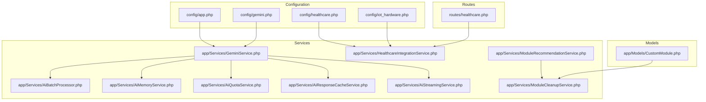
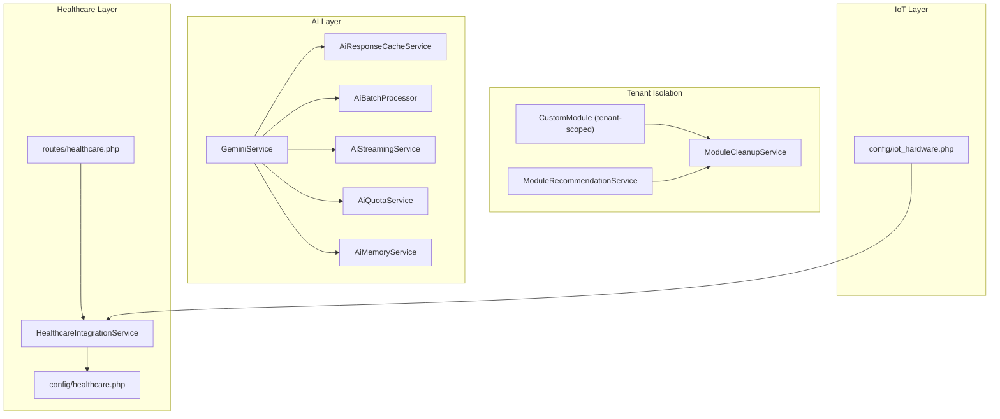
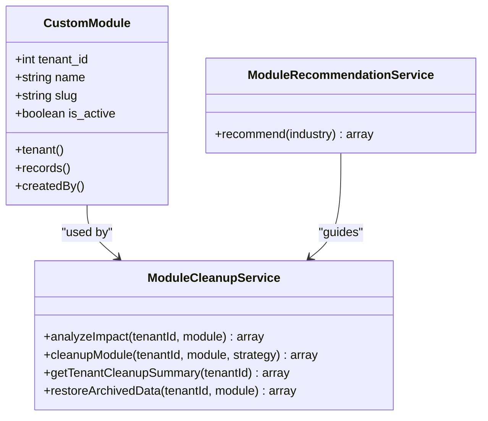
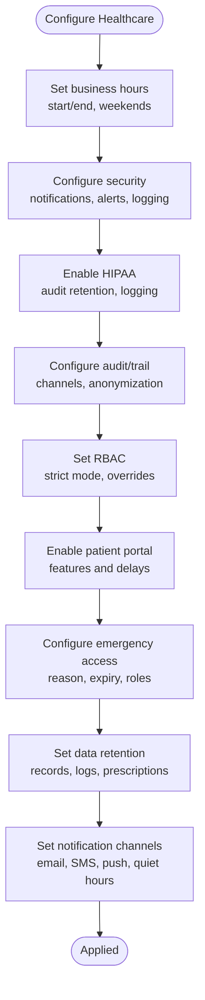
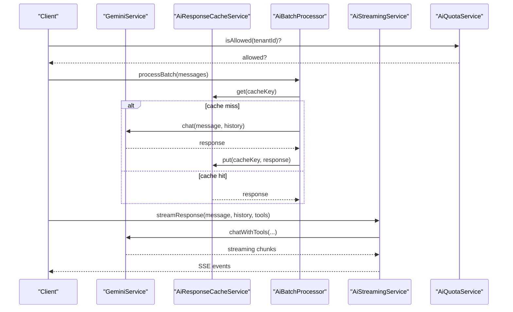
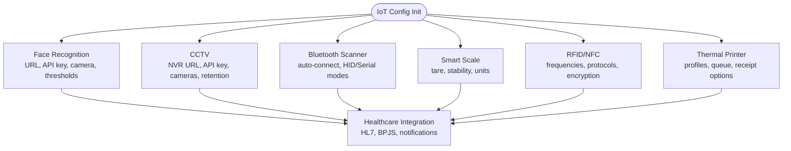
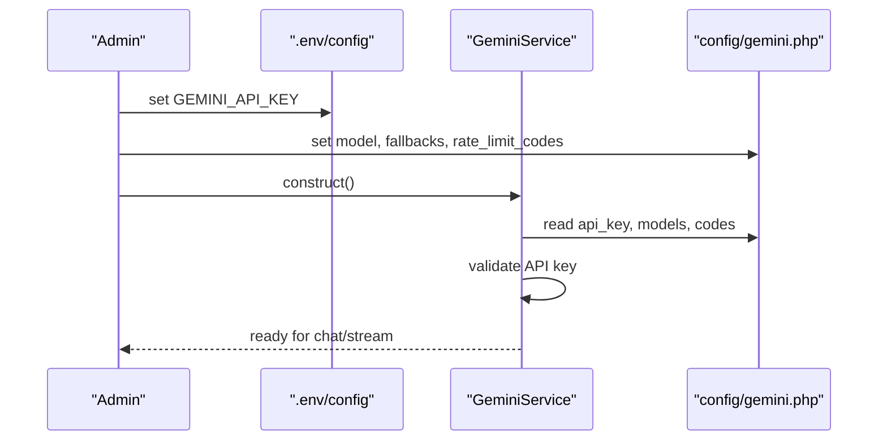
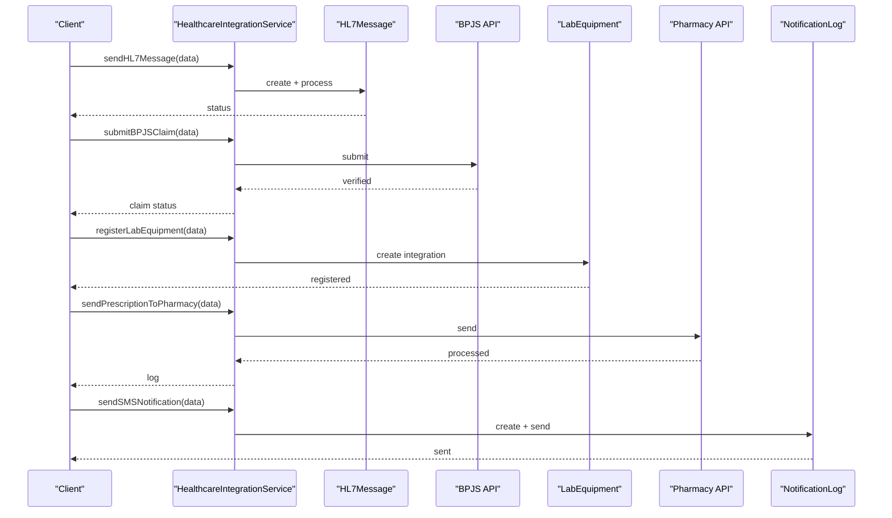
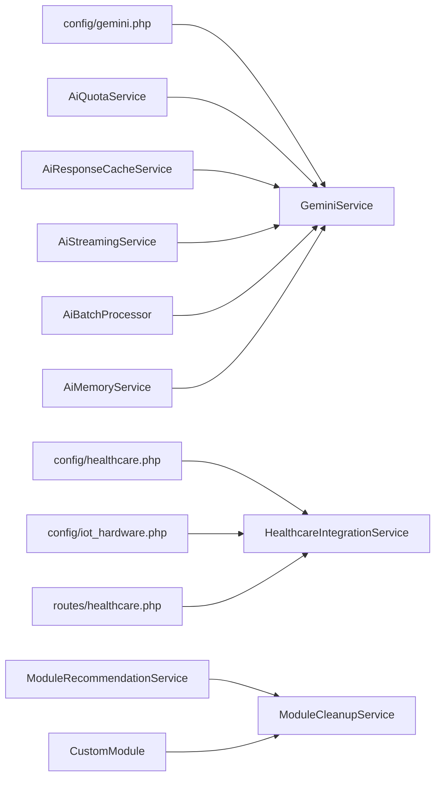

# Module Configuration

<cite>
**Referenced Files in This Document**
- [config/app.php](file://config/app.php)
- [config/gemini.php](file://config/gemini.php)
- [config/healthcare.php](file://config/healthcare.php)
- [config/iot_hardware.php](file://config/iot_hardware.php)
- [routes/healthcare.php](file://routes/healthcare.php)
- [app/Services/GeminiService.php](file://app/Services/GeminiService.php)
- [app/Services/HealthcareIntegrationService.php](file://app/Services/HealthcareIntegrationService.php)
- [app/Services/AiBatchProcessor.php](file://app/Services/AiBatchProcessor.php)
- [app/Services/AiMemoryService.php](file://app/Services/AiMemoryService.php)
- [app/Services/AiQuotaService.php](file://app/Services/AiQuotaService.php)
- [app/Services/AiResponseCacheService.php](file://app/Services/AiResponseCacheService.php)
- [app/Services/AiStreamingService.php](file://app/Services/AiStreamingService.php)
- [app/Services/ModuleRecommendationService.php](file://app/Services/ModuleRecommendationService.php)
- [app/Services/ModuleCleanupService.php](file://app/Services/ModuleCleanupService.php)
- [app/Models/CustomModule.php](file://app/Models/CustomModule.php)
</cite>

## Table of Contents
1. [Introduction](#introduction)
2. [Project Structure](#project-structure)
3. [Core Components](#core-components)
4. [Architecture Overview](#architecture-overview)
5. [Detailed Component Analysis](#detailed-component-analysis)
6. [Dependency Analysis](#dependency-analysis)
7. [Performance Considerations](#performance-considerations)
8. [Troubleshooting Guide](#troubleshooting-guide)
9. [Conclusion](#conclusion)
10. [Appendices](#appendices)

## Introduction
This document explains how to configure Qalcuity ERP’s industry-specific modules and feature toggles. It covers:
- Enabling/disabling modules per tenant and managing module dependencies
- Healthcare module settings, AI integration, IoT hardware integrations, and Gemini AI service setup
- Tenant-specific module enablement, per-module configuration parameters, and operational workflows
- Guidance for setting up external integrations and managing module updates and migrations

## Project Structure
Qalcuity ERP organizes module configuration in Laravel-style config files and exposes routes for industry modules (e.g., healthcare). Services encapsulate AI, integrations, and module lifecycle operations. The healthcare module routes define comprehensive administrative and patient-facing endpoints.

**Diagram sources**
- [config/app.php:1-127](file://config/app.php#L1-L127)
- [config/gemini.php:1-51](file://config/gemini.php#L1-L51)
- [config/healthcare.php:1-251](file://config/healthcare.php#L1-L251)
- [config/iot_hardware.php:1-217](file://config/iot_hardware.php#L1-L217)
- [routes/healthcare.php:1-538](file://routes/healthcare.php#L1-L538)
- [app/Services/GeminiService.php:1-800](file://app/Services/GeminiService.php#L1-L800)
- [app/Services/HealthcareIntegrationService.php:1-591](file://app/Services/HealthcareIntegrationService.php#L1-L591)
- [app/Services/AiBatchProcessor.php:1-191](file://app/Services/AiBatchProcessor.php#L1-L191)
- [app/Services/AiMemoryService.php:1-427](file://app/Services/AiMemoryService.php#L1-L427)
- [app/Services/AiQuotaService.php:1-241](file://app/Services/AiQuotaService.php#L1-L241)
- [app/Services/AiResponseCacheService.php:1-250](file://app/Services/AiResponseCacheService.php#L1-L250)
- [app/Services/AiStreamingService.php:1-332](file://app/Services/AiStreamingService.php#L1-L332)
- [app/Services/ModuleRecommendationService.php:1-137](file://app/Services/ModuleRecommendationService.php#L1-L137)
- [app/Services/ModuleCleanupService.php:1-447](file://app/Services/ModuleCleanupService.php#L1-L447)
- [app/Models/CustomModule.php:1-47](file://app/Models/CustomModule.php#L1-L47)

**Section sources**
- [config/app.php:1-127](file://config/app.php#L1-L127)
- [config/gemini.php:1-51](file://config/gemini.php#L1-L51)
- [config/healthcare.php:1-251](file://config/healthcare.php#L1-L251)
- [config/iot_hardware.php:1-217](file://config/iot_hardware.php#L1-L217)
- [routes/healthcare.php:1-538](file://routes/healthcare.php#L1-L538)
- [app/Services/GeminiService.php:1-800](file://app/Services/GeminiService.php#L1-L800)
- [app/Services/HealthcareIntegrationService.php:1-591](file://app/Services/HealthcareIntegrationService.php#L1-L591)
- [app/Services/AiBatchProcessor.php:1-191](file://app/Services/AiBatchProcessor.php#L1-L191)
- [app/Services/AiMemoryService.php:1-427](file://app/Services/AiMemoryService.php#L1-L427)
- [app/Services/AiQuotaService.php:1-241](file://app/Services/AiQuotaService.php#L1-L241)
- [app/Services/AiResponseCacheService.php:1-250](file://app/Services/AiResponseCacheService.php#L1-L250)
- [app/Services/AiStreamingService.php:1-332](file://app/Services/AiStreamingService.php#L1-L332)
- [app/Services/ModuleRecommendationService.php:1-137](file://app/Services/ModuleRecommendationService.php#L1-L137)
- [app/Services/ModuleCleanupService.php:1-447](file://app/Services/ModuleCleanupService.php#L1-L447)
- [app/Models/CustomModule.php:1-47](file://app/Models/CustomModule.php#L1-L47)

## Core Components
- Configuration files define environment-driven settings for Gemini AI, healthcare, and IoT hardware.
- Services implement AI orchestration, healthcare integrations, and module lifecycle management.
- Routes expose healthcare administrative and patient portals.

Key configuration highlights:
- Gemini AI: API key, model selection, fallback models, rate-limit codes, timeouts, and optimization settings (caching, batching, streaming).
- Healthcare: business hours, security, HIPAA compliance, audit/trail, RBAC, patient portal, emergency access, data retention, notifications.
- IoT Hardware: face recognition, CCTV, Bluetooth scanner, smart scale, RFID/NFC, thermal printer profiles and queues.

**Section sources**
- [config/gemini.php:1-51](file://config/gemini.php#L1-L51)
- [config/healthcare.php:1-251](file://config/healthcare.php#L1-L251)
- [config/iot_hardware.php:1-217](file://config/iot_hardware.php#L1-L217)

## Architecture Overview
The module configuration architecture centers around:
- Tenant isolation and module enablement via services and models
- AI orchestration with Gemini, including caching, streaming, quotas, and memory/context
- Healthcare integration with HL7/FHIR, BPJS claims, lab equipment, and notifications
- IoT hardware integration points for face recognition, CCTV, scanners, scales, RFID/NFC, and printers

**Diagram sources**
- [app/Models/CustomModule.php:1-47](file://app/Models/CustomModule.php#L1-L47)
- [app/Services/ModuleRecommendationService.php:1-137](file://app/Services/ModuleRecommendationService.php#L1-L137)
- [app/Services/ModuleCleanupService.php:1-447](file://app/Services/ModuleCleanupService.php#L1-L447)
- [app/Services/GeminiService.php:1-800](file://app/Services/GeminiService.php#L1-L800)
- [app/Services/AiResponseCacheService.php:1-250](file://app/Services/AiResponseCacheService.php#L1-L250)
- [app/Services/AiBatchProcessor.php:1-191](file://app/Services/AiBatchProcessor.php#L1-L191)
- [app/Services/AiStreamingService.php:1-332](file://app/Services/AiStreamingService.php#L1-L332)
- [app/Services/AiQuotaService.php:1-241](file://app/Services/AiQuotaService.php#L1-L241)
- [app/Services/AiMemoryService.php:1-427](file://app/Services/AiMemoryService.php#L1-L427)
- [routes/healthcare.php:1-538](file://routes/healthcare.php#L1-L538)
- [app/Services/HealthcareIntegrationService.php:1-591](file://app/Services/HealthcareIntegrationService.php#L1-L591)
- [config/healthcare.php:1-251](file://config/healthcare.php#L1-L251)
- [config/iot_hardware.php:1-217](file://config/iot_hardware.php#L1-L217)

## Detailed Component Analysis

### Module Activation/Deactivation System
- Modules are represented by tenant-scoped records and cleaned up safely when disabled.
- Recommendations suggest optimal module sets per industry.
- Cleanup service analyzes and executes safe removal strategies (archive, soft-delete, keep).

**Diagram sources**
- [app/Models/CustomModule.php:1-47](file://app/Models/CustomModule.php#L1-L47)
- [app/Services/ModuleRecommendationService.php:1-137](file://app/Services/ModuleRecommendationService.php#L1-L137)
- [app/Services/ModuleCleanupService.php:1-447](file://app/Services/ModuleCleanupService.php#L1-L447)

**Section sources**
- [app/Models/CustomModule.php:1-47](file://app/Models/CustomModule.php#L1-L47)
- [app/Services/ModuleRecommendationService.php:1-137](file://app/Services/ModuleRecommendationService.php#L1-L137)
- [app/Services/ModuleCleanupService.php:1-447](file://app/Services/ModuleCleanupService.php#L1-L447)

### Healthcare Module Settings
- Business hours, security, HIPAA compliance, audit/trail, RBAC, patient portal, emergency access, data retention, and notifications are configurable.
- Healthcare routes define administrative and patient portals with extensive CRUD and analytics endpoints.

**Diagram sources**
- [config/healthcare.php:1-251](file://config/healthcare.php#L1-L251)
- [routes/healthcare.php:1-538](file://routes/healthcare.php#L1-L538)

**Section sources**
- [config/healthcare.php:1-251](file://config/healthcare.php#L1-L251)
- [routes/healthcare.php:1-538](file://routes/healthcare.php#L1-L538)

### AI Integration Configurations
- Gemini AI service initialization validates API key and model fallbacks, and injects tenant/business context and language preferences.
- AiBatchProcessor orchestrates batched requests with caching and async dispatching.
- AiResponseCacheService manages cache keys, TTLs, and cache-aware retrieval.
- AiStreamingService provides Server-Sent Events streaming with robust error handling and partial recovery.
- AiQuotaService enforces tenant quotas with cache-backed usage tracking and DB fallbacks.
- AiMemoryService persists user preferences and learned patterns to build contextual AI prompts.

**Diagram sources**
- [app/Services/GeminiService.php:1-800](file://app/Services/GeminiService.php#L1-L800)
- [app/Services/AiBatchProcessor.php:1-191](file://app/Services/AiBatchProcessor.php#L1-L191)
- [app/Services/AiResponseCacheService.php:1-250](file://app/Services/AiResponseCacheService.php#L1-L250)
- [app/Services/AiStreamingService.php:1-332](file://app/Services/AiStreamingService.php#L1-L332)
- [app/Services/AiQuotaService.php:1-241](file://app/Services/AiQuotaService.php#L1-L241)
- [app/Services/AiMemoryService.php:1-427](file://app/Services/AiMemoryService.php#L1-L427)

**Section sources**
- [config/gemini.php:1-51](file://config/gemini.php#L1-L51)
- [app/Services/GeminiService.php:1-800](file://app/Services/GeminiService.php#L1-L800)
- [app/Services/AiBatchProcessor.php:1-191](file://app/Services/AiBatchProcessor.php#L1-L191)
- [app/Services/AiResponseCacheService.php:1-250](file://app/Services/AiResponseCacheService.php#L1-L250)
- [app/Services/AiStreamingService.php:1-332](file://app/Services/AiStreamingService.php#L1-L332)
- [app/Services/AiQuotaService.php:1-241](file://app/Services/AiQuotaService.php#L1-L241)
- [app/Services/AiMemoryService.php:1-427](file://app/Services/AiMemoryService.php#L1-L427)

### IoT Hardware Integrations
- Face recognition, CCTV, Bluetooth scanners, smart scales, RFID/NFC, and thermal printers are configured with environment variables and profiles.
- Healthcare integration service demonstrates external device integration patterns (HL7, BPJS, lab equipment).

**Diagram sources**
- [config/iot_hardware.php:1-217](file://config/iot_hardware.php#L1-L217)
- [app/Services/HealthcareIntegrationService.php:1-591](file://app/Services/HealthcareIntegrationService.php#L1-L591)

**Section sources**
- [config/iot_hardware.php:1-217](file://config/iot_hardware.php#L1-L217)
- [app/Services/HealthcareIntegrationService.php:1-591](file://app/Services/HealthcareIntegrationService.php#L1-L591)

### Gemini AI Service Setup
- API key validation and factory creation
- Fallback model chain and rate-limit handling
- Tenant context injection and multilingual instruction building
- Function calling and tool integration

**Diagram sources**
- [config/gemini.php:1-51](file://config/gemini.php#L1-L51)
- [app/Services/GeminiService.php:1-800](file://app/Services/GeminiService.php#L1-L800)

**Section sources**
- [config/gemini.php:1-51](file://config/gemini.php#L1-L51)
- [app/Services/GeminiService.php:1-800](file://app/Services/GeminiService.php#L1-L800)

### Healthcare Integration Workflows
- HL7/FHIR outbound/inbound messaging with acknowledgment
- BPJS eligibility checks and claim submissions
- Lab equipment registration and result imports
- Pharmacy e-prescription integration
- Notification delivery via SMS/WhatsApp/Email gateways

**Diagram sources**
- [app/Services/HealthcareIntegrationService.php:1-591](file://app/Services/HealthcareIntegrationService.php#L1-L591)

**Section sources**
- [app/Services/HealthcareIntegrationService.php:1-591](file://app/Services/HealthcareIntegrationService.php#L1-L591)

## Dependency Analysis
- GeminiService depends on config/gemini.php for credentials and model settings.
- AiQuotaService depends on Tenant subscription plans and AiUsageLog for quota enforcement.
- ModuleCleanupService depends on ModuleRecommendationService and tenant data to determine safe cleanup strategies.
- Healthcare routes depend on HealthcareIntegrationService for integration endpoints.

**Diagram sources**
- [config/gemini.php:1-51](file://config/gemini.php#L1-L51)
- [app/Services/GeminiService.php:1-800](file://app/Services/GeminiService.php#L1-L800)
- [config/healthcare.php:1-251](file://config/healthcare.php#L1-L251)
- [config/iot_hardware.php:1-217](file://config/iot_hardware.php#L1-L217)
- [routes/healthcare.php:1-538](file://routes/healthcare.php#L1-L538)
- [app/Services/HealthcareIntegrationService.php:1-591](file://app/Services/HealthcareIntegrationService.php#L1-L591)
- [app/Services/ModuleRecommendationService.php:1-137](file://app/Services/ModuleRecommendationService.php#L1-L137)
- [app/Services/ModuleCleanupService.php:1-447](file://app/Services/ModuleCleanupService.php#L1-L447)
- [app/Models/CustomModule.php:1-47](file://app/Models/CustomModule.php#L1-L47)
- [app/Services/AiQuotaService.php:1-241](file://app/Services/AiQuotaService.php#L1-L241)
- [app/Services/AiResponseCacheService.php:1-250](file://app/Services/AiResponseCacheService.php#L1-L250)
- [app/Services/AiStreamingService.php:1-332](file://app/Services/AiStreamingService.php#L1-L332)
- [app/Services/AiBatchProcessor.php:1-191](file://app/Services/AiBatchProcessor.php#L1-L191)
- [app/Services/AiMemoryService.php:1-427](file://app/Services/AiMemoryService.php#L1-L427)

**Section sources**
- [config/gemini.php:1-51](file://config/gemini.php#L1-L51)
- [app/Services/GeminiService.php:1-800](file://app/Services/GeminiService.php#L1-L800)
- [config/healthcare.php:1-251](file://config/healthcare.php#L1-L251)
- [config/iot_hardware.php:1-217](file://config/iot_hardware.php#L1-L217)
- [routes/healthcare.php:1-538](file://routes/healthcare.php#L1-L538)
- [app/Services/HealthcareIntegrationService.php:1-591](file://app/Services/HealthcareIntegrationService.php#L1-L591)
- [app/Services/ModuleRecommendationService.php:1-137](file://app/Services/ModuleRecommendationService.php#L1-L137)
- [app/Services/ModuleCleanupService.php:1-447](file://app/Services/ModuleCleanupService.php#L1-L447)
- [app/Models/CustomModule.php:1-47](file://app/Models/CustomModule.php#L1-L47)
- [app/Services/AiQuotaService.php:1-241](file://app/Services/AiQuotaService.php#L1-L241)
- [app/Services/AiResponseCacheService.php:1-250](file://app/Services/AiResponseCacheService.php#L1-L250)
- [app/Services/AiStreamingService.php:1-332](file://app/Services/AiStreamingService.php#L1-L332)
- [app/Services/AiBatchProcessor.php:1-191](file://app/Services/AiBatchProcessor.php#L1-L191)
- [app/Services/AiMemoryService.php:1-427](file://app/Services/AiMemoryService.php#L1-L427)

## Performance Considerations
- Gemini AI optimization settings (caching, batching, streaming) reduce latency and API costs.
- AiQuotaService caches usage counts to minimize DB load.
- AiBatchProcessor splits large batches into chunks to avoid timeouts.
- AiResponseCacheService applies TTLs based on content type (real-time vs periodic reports).
- AiStreamingService uses small delays and chunked transmission for responsive UX.

[No sources needed since this section provides general guidance]

## Troubleshooting Guide
Common issues and resolutions:
- Gemini API key missing or invalid: service throws runtime exceptions with clear messages; ensure GEMINI_API_KEY is set.
- Cache failures: AiQuotaService and AiResponseCacheService include fallbacks to DB queries and graceful degradation.
- Streaming interruptions: AiStreamingService detects client disconnects and sends partial completion events.
- Module cleanup errors: ModuleCleanupService wraps operations in transactions and logs detailed errors; choose archive or soft-delete strategies.

**Section sources**
- [app/Services/GeminiService.php:1-800](file://app/Services/GeminiService.php#L1-L800)
- [app/Services/AiQuotaService.php:1-241](file://app/Services/AiQuotaService.php#L1-L241)
- [app/Services/AiResponseCacheService.php:1-250](file://app/Services/AiResponseCacheService.php#L1-L250)
- [app/Services/AiStreamingService.php:1-332](file://app/Services/AiStreamingService.php#L1-L332)
- [app/Services/ModuleCleanupService.php:1-447](file://app/Services/ModuleCleanupService.php#L1-L447)

## Conclusion
Qalcuity ERP’s module configuration system provides robust, tenant-aware controls for industry-specific modules. Gemini AI integration is comprehensive with caching, streaming, batching, quotas, and memory/context. Healthcare and IoT integrations are configurable via dedicated settings and services. Module enablement/deactivation is safe and data-aware, with clear recommendations and cleanup strategies.

[No sources needed since this section summarizes without analyzing specific files]

## Appendices

### Enabling/Disabling Modules
- Use module recommendation service to propose industry-appropriate modules.
- For tenant-specific enablement, rely on CustomModule records and ModuleCleanupService to safely remove data when disabling.

**Section sources**
- [app/Services/ModuleRecommendationService.php:1-137](file://app/Services/ModuleRecommendationService.php#L1-L137)
- [app/Services/ModuleCleanupService.php:1-447](file://app/Services/ModuleCleanupService.php#L1-L447)
- [app/Models/CustomModule.php:1-47](file://app/Models/CustomModule.php#L1-L47)

### Configuring Module-Specific Workflows
- Healthcare administrative workflows are exposed via routes; configure endpoints for admissions, laboratory, radiology, billing, and analytics.
- IoT hardware settings integrate with healthcare operations (e.g., notifications, equipment).

**Section sources**
- [routes/healthcare.php:1-538](file://routes/healthcare.php#L1-L538)
- [config/healthcare.php:1-251](file://config/healthcare.php#L1-L251)
- [config/iot_hardware.php:1-217](file://config/iot_hardware.php#L1-L217)

### Setting Up External Integrations
- HL7/FHIR messaging, BPJS claims, lab equipment, and pharmacy integrations are implemented in HealthcareIntegrationService.
- Configure endpoints and credentials in healthcare routes and services.

**Section sources**
- [app/Services/HealthcareIntegrationService.php:1-591](file://app/Services/HealthcareIntegrationService.php#L1-L591)
- [routes/healthcare.php:1-538](file://routes/healthcare.php#L1-L538)

### Managing Module Updates and Migrations
- Use ModuleCleanupService to analyze and safely remove module data before disabling.
- Maintain recommended module sets per industry to minimize conflicts.

**Section sources**
- [app/Services/ModuleCleanupService.php:1-447](file://app/Services/ModuleCleanupService.php#L1-L447)
- [app/Services/ModuleRecommendationService.php:1-137](file://app/Services/ModuleRecommendationService.php#L1-L137)