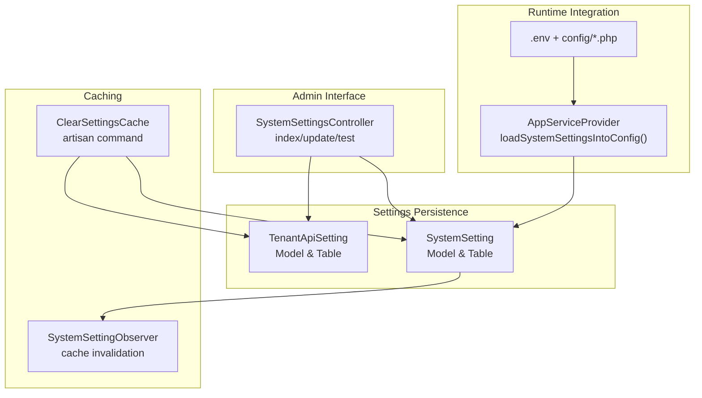
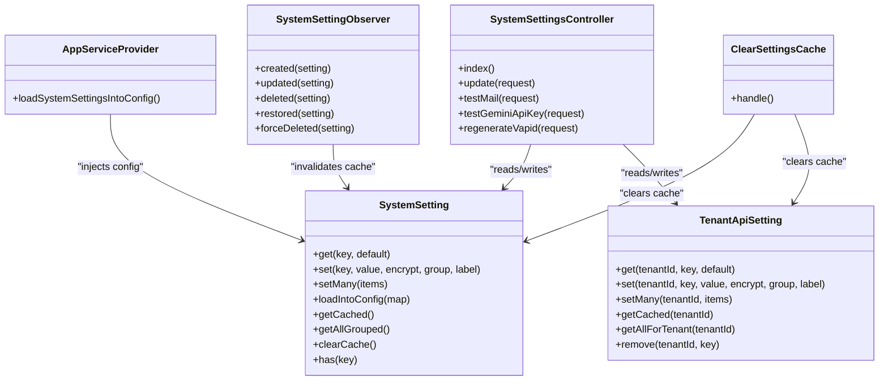
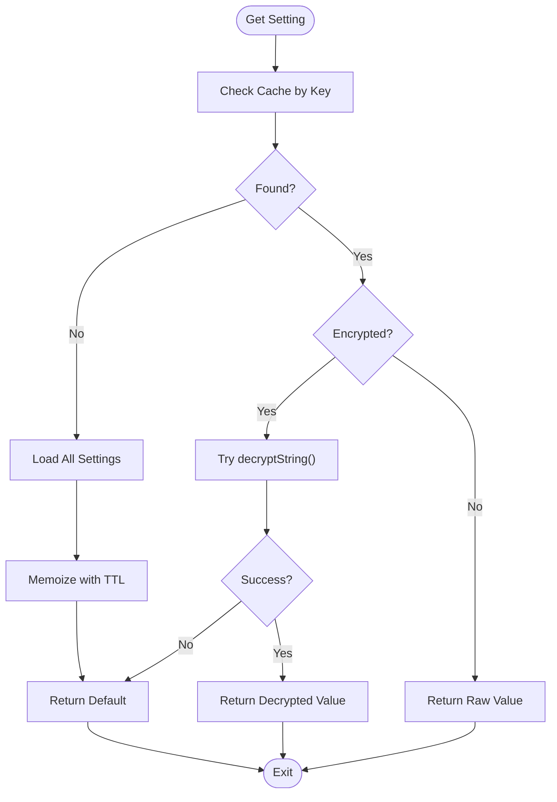
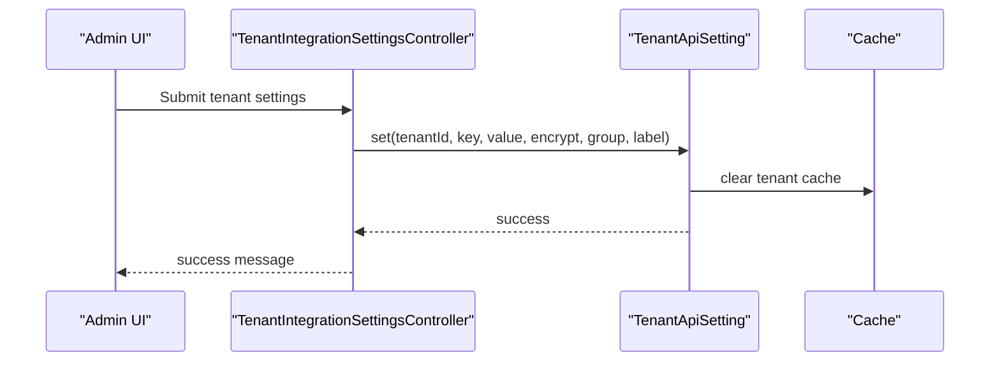
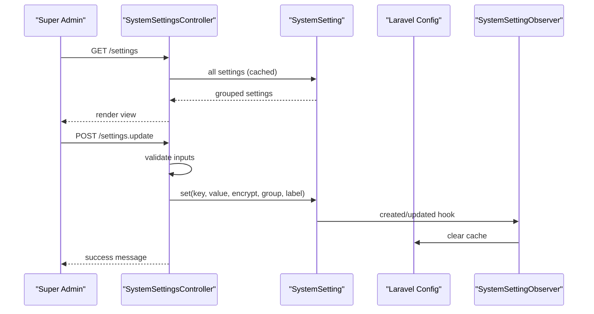
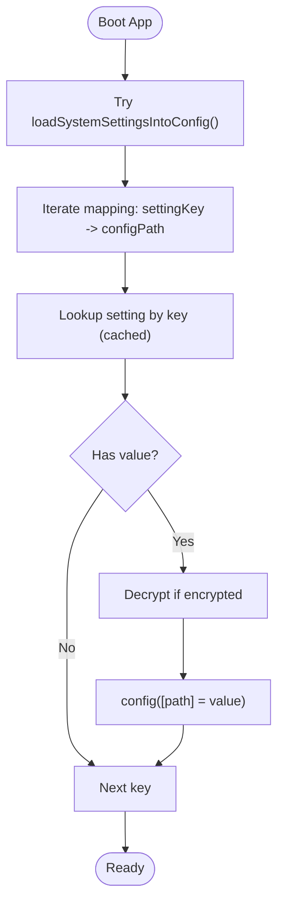
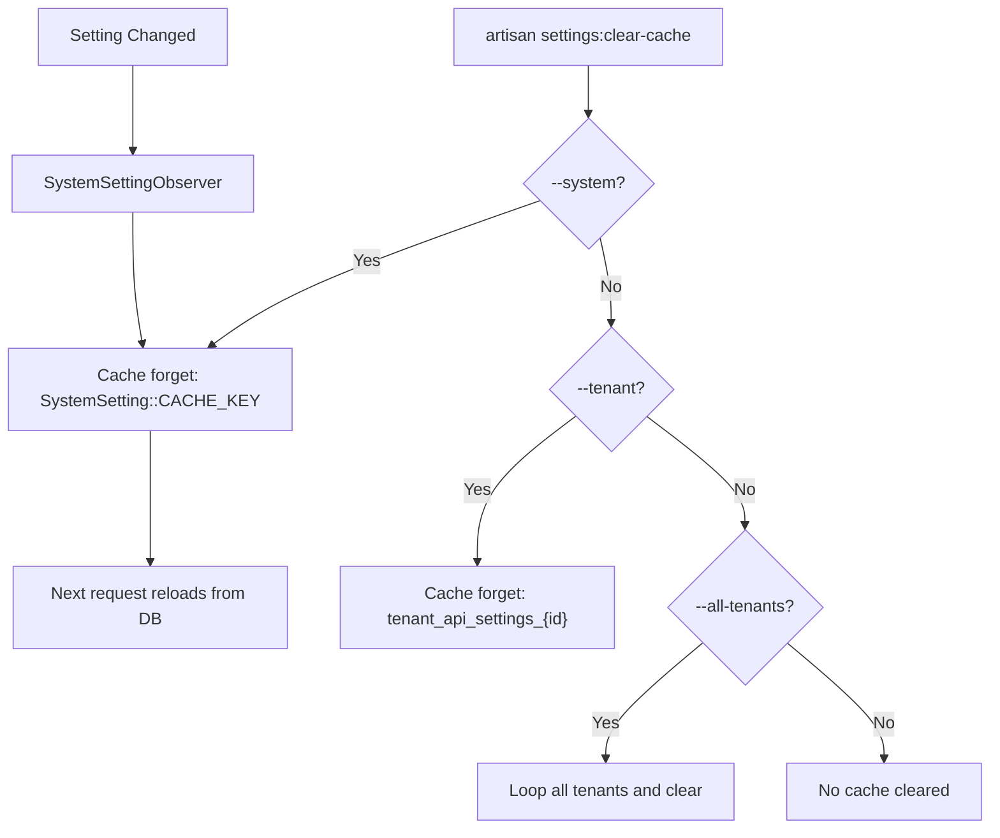
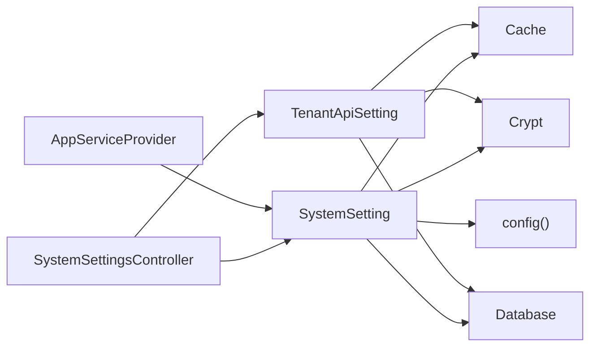

# System Settings

<cite>
**Referenced Files in This Document**
- [SystemSetting.php](file://app/Models/SystemSetting.php)
- [SystemSettingsController.php](file://app/Http/Controllers/SuperAdmin/SystemSettingsController.php)
- [AppServiceProvider.php](file://app/Providers/AppServiceProvider.php)
- [SystemSettingObserver.php](file://app/Observers/SystemSettingObserver.php)
- [2026_04_05_000001_create_system_settings_table.php](file://database/migrations/2026_04_05_000001_create_system_settings_table.php)
- [app.php](file://config/app.php)
- [database.php](file://config/database.php)
- [auth.php](file://config/auth.php)
- [session.php](file://config/session.php)
- [cache.php](file://config/cache.php)
- [queue.php](file://config/queue.php)
- [TenantApiSetting.php](file://app/Models/TenantApiSetting.php)
- [2026_04_05_000002_create_tenant_api_settings_table.php](file://database/migrations/2026_04_05_000002_create_tenant_api_settings_table.php)
- [AutomatedBackupService.php](file://app/Services/AutomatedBackupService.php)
- [ClearSettingsCache.php](file://app/Console/Commands/ClearSettingsCache.php)
</cite>

## Table of Contents
1. [Introduction](#introduction)
2. [Project Structure](#project-structure)
3. [Core Components](#core-components)
4. [Architecture Overview](#architecture-overview)
5. [Detailed Component Analysis](#detailed-component-analysis)
6. [Dependency Analysis](#dependency-analysis)
7. [Performance Considerations](#performance-considerations)
8. [Troubleshooting Guide](#troubleshooting-guide)
9. [Conclusion](#conclusion)
10. [Appendices](#appendices)

## Introduction
This document explains Qalcuity ERP’s centralized system settings configuration. It covers how application-wide settings are persisted, cached, and injected into Laravel’s configuration; how tenant-specific API keys and secrets are isolated; how authentication, database, session, cache, and queue subsystems are configured; and how to safely modify, validate, back up, and troubleshoot settings. It also documents configuration inheritance patterns and the mechanisms that ensure cache invalidation across changes.

## Project Structure
The settings framework centers around:
- A system-wide settings table and model for application-wide configuration
- A tenant-scoped settings table and model for per-tenant API credentials
- A Super Admin controller to render, validate, and save settings
- A service provider that loads system settings into Laravel config
- Observers and console commands to maintain cache consistency
- Configuration files for database, auth, session, cache, and queue

**Diagram sources**
- [SystemSetting.php:10-182](file://app/Models/SystemSetting.php#L10-L182)
- [TenantApiSetting.php:11-159](file://app/Models/TenantApiSetting.php#L11-L159)
- [AppServiceProvider.php:82-130](file://app/Providers/AppServiceProvider.php#L82-L130)
- [SystemSettingsController.php:12-296](file://app/Http/Controllers/SuperAdmin/SystemSettingsController.php#L12-L296)
- [SystemSettingObserver.php:13-72](file://app/Observers/SystemSettingObserver.php#L13-L72)
- [ClearSettingsCache.php:8-67](file://app/Console/Commands/ClearSettingsCache.php#L8-L67)

**Section sources**
- [SystemSetting.php:10-182](file://app/Models/SystemSetting.php#L10-L182)
- [TenantApiSetting.php:11-159](file://app/Models/TenantApiSetting.php#L11-L159)
- [AppServiceProvider.php:82-130](file://app/Providers/AppServiceProvider.php#L82-L130)
- [SystemSettingsController.php:12-296](file://app/Http/Controllers/SuperAdmin/SystemSettingsController.php#L12-L296)
- [SystemSettingObserver.php:13-72](file://app/Observers/SystemSettingObserver.php#L13-L72)
- [ClearSettingsCache.php:8-67](file://app/Console/Commands/ClearSettingsCache.php#L8-L67)

## Core Components
- SystemSetting model and table: central registry for application-wide settings, with caching, encryption, and config injection.
- TenantApiSetting model and table: per-tenant API credentials and secrets, with caching and encryption.
- SystemSettingsController: admin UI to view, validate, and save settings; includes tests for mail and AI integrations.
- AppServiceProvider: loads system settings into Laravel config at runtime, overriding .env defaults.
- SystemSettingObserver: clears caches on any change to system settings.
- ClearSettingsCache command: targeted cache clearing for system and tenant settings.

**Section sources**
- [SystemSetting.php:10-182](file://app/Models/SystemSetting.php#L10-L182)
- [TenantApiSetting.php:11-159](file://app/Models/TenantApiSetting.php#L11-L159)
- [SystemSettingsController.php:12-296](file://app/Http/Controllers/SuperAdmin/SystemSettingsController.php#L12-L296)
- [AppServiceProvider.php:82-130](file://app/Providers/AppServiceProvider.php#L82-L130)
- [SystemSettingObserver.php:13-72](file://app/Observers/SystemSettingObserver.php#L13-L72)
- [ClearSettingsCache.php:8-67](file://app/Console/Commands/ClearSettingsCache.php#L8-L67)

## Architecture Overview
The settings architecture follows a layered pattern:
- Data layer: Eloquent models backed by migrations
- Cache layer: Laravel Cache facade with TTL-based memoization
- Config layer: Laravel config resolved at runtime via service provider
- Admin layer: Controller validates and persists settings
- Observer and CLI: enforce cache invalidation on writes

**Diagram sources**
- [SystemSetting.php:10-182](file://app/Models/SystemSetting.php#L10-L182)
- [TenantApiSetting.php:11-159](file://app/Models/TenantApiSetting.php#L11-L159)
- [AppServiceProvider.php:82-130](file://app/Providers/AppServiceProvider.php#L82-L130)
- [SystemSettingsController.php:12-296](file://app/Http/Controllers/SuperAdmin/SystemSettingsController.php#L12-L296)
- [SystemSettingObserver.php:13-72](file://app/Observers/SystemSettingObserver.php#L13-L72)
- [ClearSettingsCache.php:8-67](file://app/Console/Commands/ClearSettingsCache.php#L8-L67)

## Detailed Component Analysis

### SystemSetting: Centralized Application Settings
- Persistence: unique key/value pairs with optional encryption and grouping.
- Caching: memoized retrieval with a fixed TTL and cache key.
- Encryption: automatic encrypt/decrypt for sensitive values.
- Config injection: maps specific keys to Laravel config paths and injects values at runtime.
- Validation and masking: controller masks encrypted values for display.

**Diagram sources**
- [SystemSetting.php:26-49](file://app/Models/SystemSetting.php#L26-L49)
- [SystemSetting.php:135-147](file://app/Models/SystemSetting.php#L135-L147)

**Section sources**
- [SystemSetting.php:10-182](file://app/Models/SystemSetting.php#L10-L182)
- [2026_04_05_000001_create_system_settings_table.php:7-26](file://database/migrations/2026_04_05_000001_create_system_settings_table.php#L7-L26)

### TenantApiSetting: Tenant-Specific Secrets
- Isolation: per-tenant records with unique composite key (tenant_id, key).
- Caching: per-tenant cache with shorter TTL than system settings.
- Encryption: sensitive keys are encrypted at rest.
- Retrieval: merges tenant setting with environment/service defaults.

**Diagram sources**
- [TenantApiSetting.php:58-77](file://app/Models/TenantApiSetting.php#L58-L77)
- [TenantApiSetting.php:109-124](file://app/Models/TenantApiSetting.php#L109-L124)

**Section sources**
- [TenantApiSetting.php:11-159](file://app/Models/TenantApiSetting.php#L11-L159)
- [2026_04_05_000002_create_tenant_api_settings_table.php:7-30](file://database/migrations/2026_04_05_000002_create_tenant_api_settings_table.php#L7-L30)

### SystemSettingsController: Admin UI and Validation
- Groups settings by category (AI, mail, OAuth, push, alert, app).
- Validates inputs and conditionally saves encrypted values.
- Provides tests for mail and Gemini API connectivity.
- Applies settings to runtime config for immediate effect.

**Diagram sources**
- [SystemSettingsController.php:56-86](file://app/Http/Controllers/SuperAdmin/SystemSettingsController.php#L56-L86)
- [SystemSettingsController.php:88-129](file://app/Http/Controllers/SuperAdmin/SystemSettingsController.php#L88-L129)
- [SystemSettingObserver.php:18-48](file://app/Observers/SystemSettingObserver.php#L18-L48)

**Section sources**
- [SystemSettingsController.php:12-296](file://app/Http/Controllers/SuperAdmin/SystemSettingsController.php#L12-L296)
- [SystemSettingObserver.php:13-72](file://app/Observers/SystemSettingObserver.php#L13-L72)

### AppServiceProvider: Runtime Configuration Injection
- Loads system settings into Laravel config using a predefined mapping.
- Gracefully handles missing database on first deploy.
- Ensures DB-managed settings override .env defaults.

**Diagram sources**
- [AppServiceProvider.php:82-130](file://app/Providers/AppServiceProvider.php#L82-L130)
- [SystemSetting.php:98-130](file://app/Models/SystemSetting.php#L98-L130)

**Section sources**
- [AppServiceProvider.php:82-130](file://app/Providers/AppServiceProvider.php#L82-L130)
- [SystemSetting.php:98-130](file://app/Models/SystemSetting.php#L98-L130)

### Cache Invalidation and CLI Management
- Observer clears cache on create/update/delete/restore of system settings.
- Artisan command supports clearing system cache, specific tenant cache, or all tenant caches.

**Diagram sources**
- [SystemSettingObserver.php:61-71](file://app/Observers/SystemSettingObserver.php#L61-L71)
- [ClearSettingsCache.php:30-65](file://app/Console/Commands/ClearSettingsCache.php#L30-L65)

**Section sources**
- [SystemSettingObserver.php:13-72](file://app/Observers/SystemSettingObserver.php#L13-L72)
- [ClearSettingsCache.php:8-67](file://app/Console/Commands/ClearSettingsCache.php#L8-L67)

## Dependency Analysis
- SystemSetting depends on:
  - Cache facade for memoization
  - Crypt facade for encryption
  - Database for persistence
  - Laravel config for runtime overrides
- TenantApiSetting mirrors SystemSetting with tenant scoping.
- SystemSettingsController depends on both models and external services for testing (SMTP, Gemini).
- AppServiceProvider depends on SystemSetting to populate config.

**Diagram sources**
- [SystemSetting.php:6-8](file://app/Models/SystemSetting.php#L6-L8)
- [TenantApiSetting.php:7-9](file://app/Models/TenantApiSetting.php#L7-L9)
- [AppServiceProvider.php:82-130](file://app/Providers/AppServiceProvider.php#L82-L130)
- [SystemSettingsController.php:12-296](file://app/Http/Controllers/SuperAdmin/SystemSettingsController.php#L12-L296)

**Section sources**
- [SystemSetting.php:6-8](file://app/Models/SystemSetting.php#L6-L8)
- [TenantApiSetting.php:7-9](file://app/Models/TenantApiSetting.php#L7-L9)
- [AppServiceProvider.php:82-130](file://app/Providers/AppServiceProvider.php#L82-L130)
- [SystemSettingsController.php:12-296](file://app/Http/Controllers/SuperAdmin/SystemSettingsController.php#L12-L296)

## Performance Considerations
- Caching: SystemSetting uses a 60-minute TTL; TenantApiSetting uses a 30-minute TTL. Tune TTLs based on change frequency and environment.
- Encryption overhead: Encrypting/decrypting sensitive values adds CPU cost; minimize writes and reuse decrypted values in the same request lifecycle.
- Cache invalidation: Observer triggers cache invalidation on any change; use the CLI command to batch-clear caches after bulk updates.
- Config injection: loadIntoConfig runs once per request; ensure minimal churn to reduce repeated decryption and config writes.

[No sources needed since this section provides general guidance]

## Troubleshooting Guide
Common issues and resolutions:
- Settings not taking effect
  - Cause: Cache still holds old values.
  - Fix: Clear caches via observer (change triggers) or CLI command.
  - References: [SystemSettingObserver.php:61-71](file://app/Observers/SystemSettingObserver.php#L61-L71), [ClearSettingsCache.php:30-65](file://app/Console/Commands/ClearSettingsCache.php#L30-L65)
- Encrypted field appears blank in UI
  - Cause: Encrypted values are masked in admin UI.
  - Fix: Only set a new value to reveal changes; leave empty to preserve existing.
  - References: [SystemSettingsController.php:60-74](file://app/Http/Controllers/SuperAdmin/SystemSettingsController.php#L60-L74)
- SMTP test fails
  - Cause: Incorrect host/port/encryption/credentials.
  - Fix: Use built-in test endpoint; ensure DB-stored values are applied before sending.
  - References: [SystemSettingsController.php:131-150](file://app/Http/Controllers/SuperAdmin/SystemSettingsController.php#L131-L150), [SystemSettingsController.php:263-281](file://app/Http/Controllers/SuperAdmin/SystemSettingsController.php#L263-L281)
- Gemini API key validation errors
  - Cause: Unauthorized, forbidden, rate-limited, or invalid key.
  - Fix: Use test endpoint; check status-specific messages and logs.
  - References: [SystemSettingsController.php:155-231](file://app/Http/Controllers/SuperAdmin/SystemSettingsController.php#L155-L231)
- VAPID keys generation
  - Cause: Missing keys or parsing failures.
  - Fix: Use regenerate endpoint; it persists keys into settings.
  - References: [SystemSettingsController.php:233-261](file://app/Http/Controllers/SuperAdmin/SystemSettingsController.php#L233-L261)

**Section sources**
- [SystemSettingObserver.php:61-71](file://app/Observers/SystemSettingObserver.php#L61-L71)
- [ClearSettingsCache.php:30-65](file://app/Console/Commands/ClearSettingsCache.php#L30-L65)
- [SystemSettingsController.php:60-74](file://app/Http/Controllers/SuperAdmin/SystemSettingsController.php#L60-L74)
- [SystemSettingsController.php:131-150](file://app/Http/Controllers/SuperAdmin/SystemSettingsController.php#L131-L150)
- [SystemSettingsController.php:155-231](file://app/Http/Controllers/SuperAdmin/SystemSettingsController.php#L155-L231)
- [SystemSettingsController.php:233-261](file://app/Http/Controllers/SuperAdmin/SystemSettingsController.php#L233-L261)

## Conclusion
Qalcuity ERP’s settings framework provides a robust, secure, and flexible way to manage application-wide and tenant-specific configurations. It leverages caching, encryption, and runtime config injection to balance performance and safety. The admin interface and CLI tools streamline validation and maintenance, while observers and commands ensure cache consistency across changes.

[No sources needed since this section summarizes without analyzing specific files]

## Appendices

### Configuration Inheritance Patterns
- System settings override .env defaults at runtime.
- Tenant settings override service defaults for that tenant.
- Environment variables remain the baseline; DB settings are additive and overriding.

**Section sources**
- [AppServiceProvider.php:82-130](file://app/Providers/AppServiceProvider.php#L82-L130)
- [TenantApiSetting.php:30-53](file://app/Models/TenantApiSetting.php#L30-L53)

### Practical Examples
- Modify core settings
  - Use the Super Admin settings UI to update keys mapped under groups (AI, mail, OAuth, push, alert, app).
  - References: [SystemSettingsController.php:17-54](file://app/Http/Controllers/SuperAdmin/SystemSettingsController.php#L17-L54), [SystemSettingsController.php:88-129](file://app/Http/Controllers/SuperAdmin/SystemSettingsController.php#L88-L129)
- Environment-specific configurations
  - Set .env values for base configuration; DB settings override at runtime.
  - References: [app.php:16-100](file://config/app.php#L16-L100), [AppServiceProvider.php:82-130](file://app/Providers/AppServiceProvider.php#L82-L130)
- Security-related settings
  - Encrypt sensitive values; mask them in UI; validate via built-in tests.
  - References: [SystemSetting.php:54-73](file://app/Models/SystemSetting.php#L54-L73), [SystemSettingsController.php:131-150](file://app/Http/Controllers/SuperAdmin/SystemSettingsController.php#L131-L150)
- Database connections
  - Configure via config/database.php; use environment variables for host, port, credentials.
  - References: [database.php:33-117](file://config/database.php#L33-L117)
- Authentication settings
  - Guard/provider/password policies via config/auth.php; can be overridden by DB settings if mapped.
  - References: [auth.php:18-116](file://config/auth.php#L18-L116)
- Session management
  - Driver, lifetime, cookie policy via config/session.php.
  - References: [session.php:21-202](file://config/session.php#L21-L202)
- Caching strategies
  - Default store and options via config/cache.php; tune per environment.
  - References: [cache.php:18-116](file://config/cache.php#L18-L116)
- Queue processing
  - Connections and retry policies via config/queue.php.
  - References: [queue.php:16-127](file://config/queue.php#L16-L127)

### Backup and Restore Procedures for System Configurations
- Automated tenant backups
  - Create backups of tenant data and settings; restore replaces tenant data.
  - References: [AutomatedBackupService.php:15-92](file://app/Services/AutomatedBackupService.php#L15-L92), [AutomatedBackupService.php:97-157](file://app/Services/AutomatedBackupService.php#L97-L157)
- Settings cache management
  - Clear caches after bulk changes to ensure immediate visibility.
  - References: [SystemSettingObserver.php:61-71](file://app/Observers/SystemSettingObserver.php#L61-L71), [ClearSettingsCache.php:30-65](file://app/Console/Commands/ClearSettingsCache.php#L30-L65)

**Section sources**
- [AutomatedBackupService.php:15-92](file://app/Services/AutomatedBackupService.php#L15-L92)
- [AutomatedBackupService.php:97-157](file://app/Services/AutomatedBackupService.php#L97-L157)
- [SystemSettingObserver.php:61-71](file://app/Observers/SystemSettingObserver.php#L61-L71)
- [ClearSettingsCache.php:30-65](file://app/Console/Commands/ClearSettingsCache.php#L30-L65)