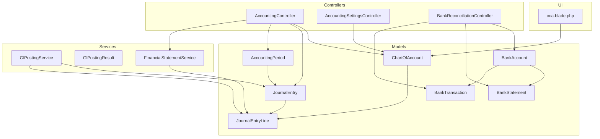
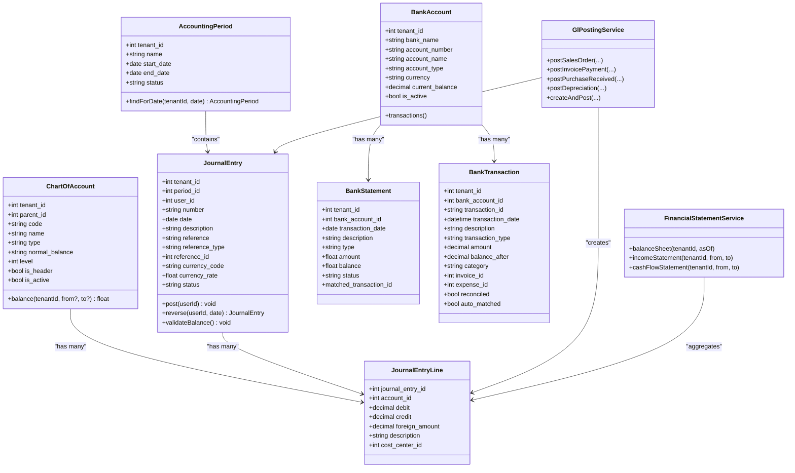
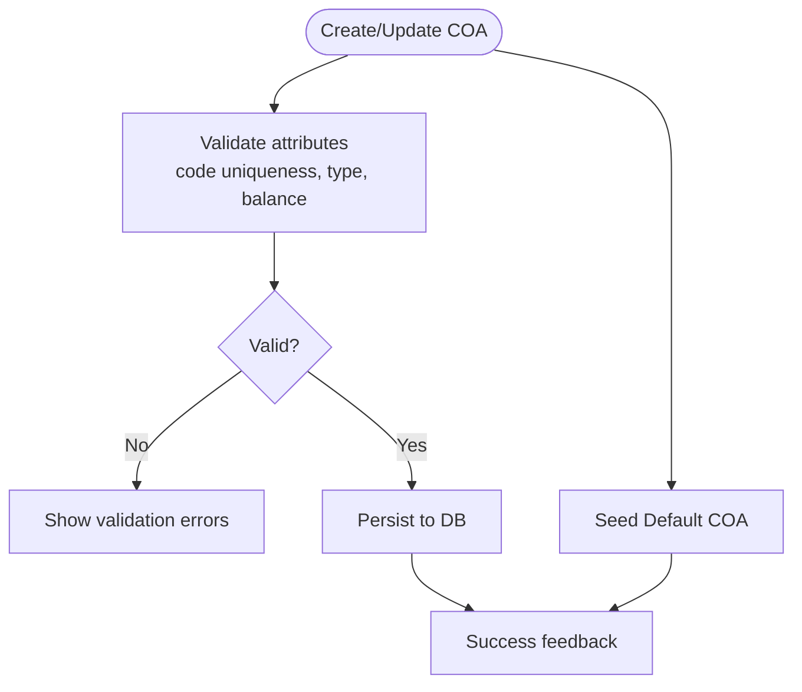
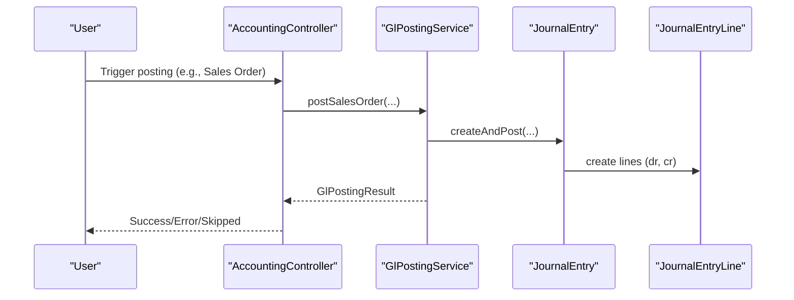
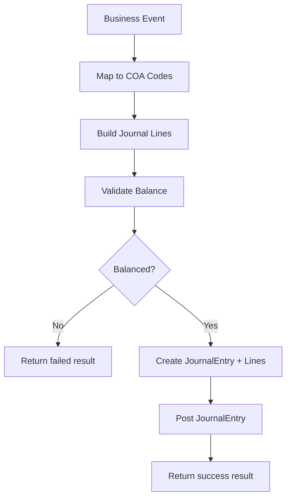
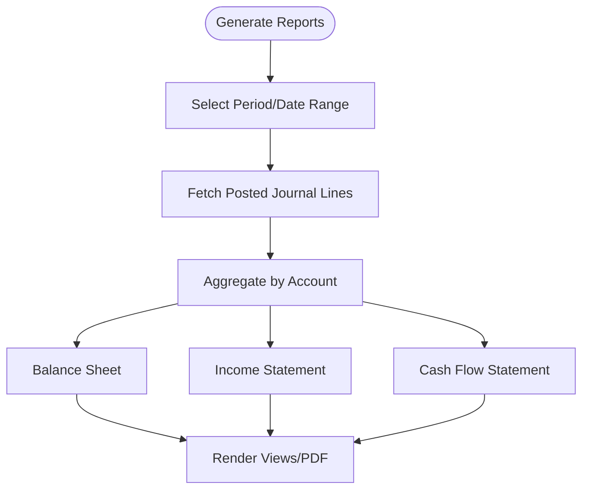
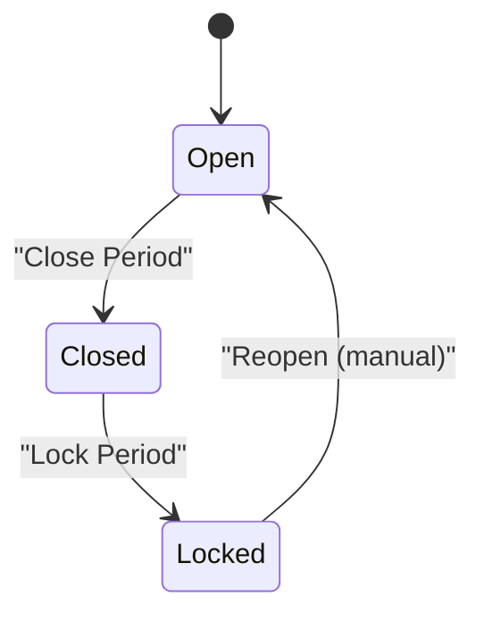
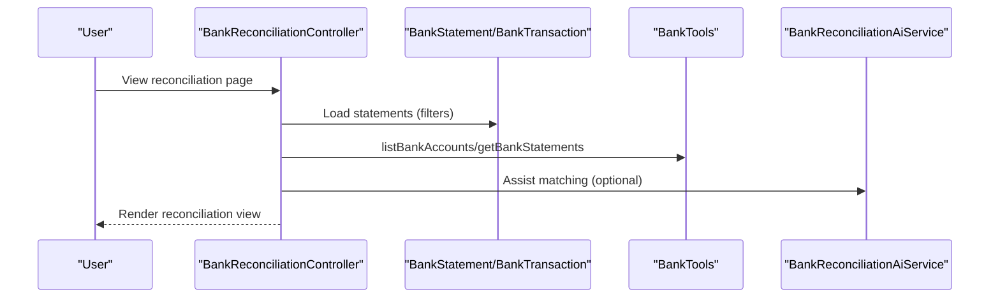
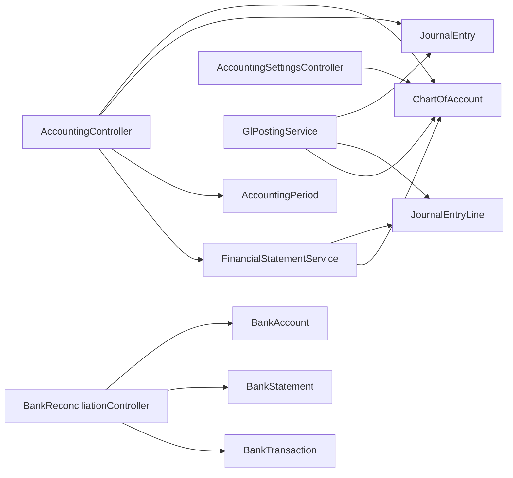

# Accounting Module

<cite>
**Referenced Files in This Document**
- [ChartOfAccount.php](file://app/Models/ChartOfAccount.php)
- [JournalEntry.php](file://app/Models/JournalEntry.php)
- [JournalEntryLine.php](file://app/Models/JournalEntryLine.php)
- [AccountingPeriod.php](file://app/Models/AccountingPeriod.php)
- [BankAccount.php](file://app/Models/BankAccount.php)
- [BankStatement.php](file://app/Models/BankStatement.php)
- [BankTransaction.php](file://app/Models/BankTransaction.php)
- [GlPostingService.php](file://app/Services/GlPostingService.php)
- [GlPostingResult.php](file://app/Services/GlPostingResult.php)
- [FinancialStatementService.php](file://app/Services/FinancialStatementService.php)
- [AccountingController.php](file://app/Http/Controllers/AccountingController.php)
- [AccountingSettingsController.php](file://app/Http/Controllers/AccountingSettingsController.php)
- [BankReconciliationController.php](file://app/Http/Controllers/BankReconciliationController.php)
- [2026_03_23_000027_create_chart_of_accounts_table.php](file://database/migrations/2026_03_23_000027_create_chart_of_accounts_table.php)
- [GlPostingTest.php](file://tests/Feature/GlPostingTest.php)
- [coa.blade.php](file://resources/views/accounting/coa.blade.php)
- [BankTools.php](file://app/Services/ERP/BankTools.php)
</cite>

## Table of Contents
1. [Introduction](#introduction)
2. [Project Structure](#project-structure)
3. [Core Components](#core-components)
4. [Architecture Overview](#architecture-overview)
5. [Detailed Component Analysis](#detailed-component-analysis)
6. [Dependency Analysis](#dependency-analysis)
7. [Performance Considerations](#performance-considerations)
8. [Troubleshooting Guide](#troubleshooting-guide)
9. [Conclusion](#conclusion)

## Introduction
This document provides comprehensive documentation for the Accounting module, covering chart of accounts management, journal entries, bank reconciliation, financial reporting, and accounting periods. It explains the double-entry accounting system, the GL posting engine, automated journal creation, financial statement generation, transaction processing workflows, account classification schemes, integration with other modules, accounting period management, closing procedures, and audit trail capabilities.

## Project Structure
The Accounting module is organized around core models representing ledger entities, services implementing the GL posting engine and financial statements, controllers exposing administrative and reporting views, and supporting migrations and tests.

**Diagram sources**
- [ChartOfAccount.php:14-84](file://app/Models/ChartOfAccount.php#L14-L84)
- [JournalEntry.php:13-163](file://app/Models/JournalEntry.php#L13-L163)
- [JournalEntryLine.php:8-90](file://app/Models/JournalEntryLine.php#L8-L90)
- [AccountingPeriod.php:11-41](file://app/Models/AccountingPeriod.php#L11-L41)
- [BankAccount.php:10-45](file://app/Models/BankAccount.php#L10-L45)
- [BankStatement.php:9-21](file://app/Models/BankStatement.php#L9-L21)
- [BankTransaction.php:10-56](file://app/Models/BankTransaction.php#L10-L56)
- [GlPostingService.php:26-996](file://app/Services/GlPostingService.php#L26-L996)
- [GlPostingResult.php:16-40](file://app/Services/GlPostingResult.php#L16-L40)
- [FinancialStatementService.php:22-435](file://app/Services/FinancialStatementService.php#L22-L435)
- [AccountingController.php:13-254](file://app/Http/Controllers/AccountingController.php#L13-L254)
- [AccountingSettingsController.php:11-42](file://app/Http/Controllers/AccountingSettingsController.php#L11-L42)
- [BankReconciliationController.php:11-43](file://app/Http/Controllers/BankReconciliationController.php#L11-L43)
- [coa.blade.php:1-23](file://resources/views/accounting/coa.blade.php#L1-L23)

**Section sources**
- [ChartOfAccount.php:14-84](file://app/Models/ChartOfAccount.php#L14-L84)
- [JournalEntry.php:13-163](file://app/Models/JournalEntry.php#L13-L163)
- [JournalEntryLine.php:8-90](file://app/Models/JournalEntryLine.php#L8-L90)
- [AccountingPeriod.php:11-41](file://app/Models/AccountingPeriod.php#L11-L41)
- [BankAccount.php:10-45](file://app/Models/BankAccount.php#L10-L45)
- [BankStatement.php:9-21](file://app/Models/BankStatement.php#L9-L21)
- [BankTransaction.php:10-56](file://app/Models/BankTransaction.php#L10-L56)
- [GlPostingService.php:26-996](file://app/Services/GlPostingService.php#L26-L996)
- [GlPostingResult.php:16-40](file://app/Services/GlPostingResult.php#L16-L40)
- [FinancialStatementService.php:22-435](file://app/Services/FinancialStatementService.php#L22-L435)
- [AccountingController.php:13-254](file://app/Http/Controllers/AccountingController.php#L13-L254)
- [AccountingSettingsController.php:11-42](file://app/Http/Controllers/AccountingSettingsController.php#L11-L42)
- [BankReconciliationController.php:11-43](file://app/Http/Controllers/BankReconciliationController.php#L11-L43)
- [coa.blade.php:1-23](file://resources/views/accounting/coa.blade.php#L1-L23)

## Core Components
- Chart of Accounts: Hierarchical account structure with classification, normal balance direction, and activity controls.
- Journal Entries: Double-entry records with validation, posting, reversal, and numbering.
- Journal Entry Lines: Debit/credit line items with automatic balance validation safeguards.
- Accounting Periods: Monthly periods with open/locked/closed lifecycle and date-scoped journal association.
- Bank Integration: Bank accounts, statements, and transactions with reconciliation support.
- GL Posting Engine: Automated journal creation from business events with structured results.
- Financial Statements: Balance Sheet, Income Statement, and Cash Flow Statement generation from GL data.
- Controllers: Administrative screens for COA, periods, trial balance, and financial reports; bank reconciliation interface.

**Section sources**
- [ChartOfAccount.php:14-84](file://app/Models/ChartOfAccount.php#L14-L84)
- [JournalEntry.php:13-163](file://app/Models/JournalEntry.php#L13-L163)
- [JournalEntryLine.php:8-90](file://app/Models/JournalEntryLine.php#L8-L90)
- [AccountingPeriod.php:11-41](file://app/Models/AccountingPeriod.php#L11-L41)
- [BankAccount.php:10-45](file://app/Models/BankAccount.php#L10-L45)
- [BankStatement.php:9-21](file://app/Models/BankStatement.php#L9-L21)
- [BankTransaction.php:10-56](file://app/Models/BankTransaction.php#L10-L56)
- [GlPostingService.php:26-996](file://app/Services/GlPostingService.php#L26-L996)
- [GlPostingResult.php:16-40](file://app/Services/GlPostingResult.php#L16-L40)
- [FinancialStatementService.php:22-435](file://app/Services/FinancialStatementService.php#L22-L435)
- [AccountingController.php:13-254](file://app/Http/Controllers/AccountingController.php#L13-L254)
- [BankReconciliationController.php:11-43](file://app/Http/Controllers/BankReconciliationController.php#L11-L43)

## Architecture Overview
The module follows a layered architecture:
- Data Layer: Eloquent models define domain entities and relationships.
- Service Layer: Business logic encapsulated in services (posting, financial statements, bank tools).
- Presentation Layer: Controllers expose CRUD and reporting views; Blade templates render UI.
- Integration: Bank reconciliation connects external bank data to internal transactions.

**Diagram sources**
- [ChartOfAccount.php:14-84](file://app/Models/ChartOfAccount.php#L14-L84)
- [JournalEntry.php:13-163](file://app/Models/JournalEntry.php#L13-L163)
- [JournalEntryLine.php:8-90](file://app/Models/JournalEntryLine.php#L8-L90)
- [AccountingPeriod.php:11-41](file://app/Models/AccountingPeriod.php#L11-L41)
- [BankAccount.php:10-45](file://app/Models/BankAccount.php#L10-L45)
- [BankStatement.php:9-21](file://app/Models/BankStatement.php#L9-L21)
- [BankTransaction.php:10-56](file://app/Models/BankTransaction.php#L10-L56)
- [GlPostingService.php:26-996](file://app/Services/GlPostingService.php#L26-L996)
- [FinancialStatementService.php:22-435](file://app/Services/FinancialStatementService.php#L22-L435)

## Detailed Component Analysis

### Chart of Accounts Management
- Structure: Hierarchical tree with parent-child relationships, header/detail levels, and classification (asset/liability/equity/revenue/expense).
- Classification: Normal balance direction determines whether debit or credit increases the account’s value.
- Operations: Creation, updates, activation/deactivation, deletion with constraints (no journal usage, no child accounts).
- UI: Listing with filtering by type/search/status; seeded defaults for Indonesian standards.

**Diagram sources**
- [ChartOfAccount.php:18-35](file://app/Models/ChartOfAccount.php#L18-L35)
- [AccountingController.php:44-102](file://app/Http/Controllers/AccountingController.php#L44-L102)
- [coa.blade.php:1-23](file://resources/views/accounting/coa.blade.php#L1-L23)
- [2026_03_23_000027_create_chart_of_accounts_table.php:11-28](file://database/migrations/2026_03_23_000027_create_chart_of_accounts_table.php#L11-L28)

**Section sources**
- [ChartOfAccount.php:14-84](file://app/Models/ChartOfAccount.php#L14-L84)
- [AccountingController.php:22-102](file://app/Http/Controllers/AccountingController.php#L22-L102)
- [coa.blade.php:1-23](file://resources/views/accounting/coa.blade.php#L1-L23)
- [2026_03_23_000027_create_chart_of_accounts_table.php:11-28](file://database/migrations/2026_03_23_000027_create_chart_of_accounts_table.php#L11-L28)

### Journal Entries and Double-Entry System
- Double-entry: Every journal entry must have equal total debits and credits and at least one debit and one credit line.
- Validation: Pre-posting validation ensures balance; model events warn on imbalances during draft edits.
- Posting: Status transitions to posted with user and timestamp; immutable after posting.
- Reversal: Creates a reversing journal with swapped debit/credit per line and links to original.
- Numbering: Automatic numbering via document number service with prefixes.

**Diagram sources**
- [GlPostingService.php:84-124](file://app/Services/GlPostingService.php#L84-L124)
- [JournalEntry.php:107-118](file://app/Models/JournalEntry.php#L107-L118)
- [JournalEntryLine.php:29-80](file://app/Models/JournalEntryLine.php#L29-L80)
- [GlPostingResult.php:16-40](file://app/Services/GlPostingResult.php#L16-L40)

**Section sources**
- [JournalEntry.php:65-118](file://app/Models/JournalEntry.php#L65-L118)
- [JournalEntryLine.php:26-80](file://app/Models/JournalEntryLine.php#L26-L80)
- [GlPostingService.php:84-124](file://app/Services/GlPostingService.php#L84-L124)
- [GlPostingResult.php:16-40](file://app/Services/GlPostingResult.php#L16-L40)
- [GlPostingTest.php:183-207](file://tests/Feature/GlPostingTest.php#L183-L207)

### GL Posting Engine and Automated Journals
- Supported events: Sales orders, payments, invoices, purchase orders, purchase payments, returns, down payments, bulk payments, expenses, reimbursements, sales commissions, consignment sales/settlement, landed costs, contract billing, fleet fuel/maintenance, depreciation.
- Each event maps to predefined COA codes and creates balanced journal lines.
- Result type: GlPostingResult distinguishes success, skipped, and failed outcomes with reasons and missing COA codes.

**Diagram sources**
- [GlPostingService.php:12-25](file://app/Services/GlPostingService.php#L12-L25)
- [GlPostingService.php:43-80](file://app/Services/GlPostingService.php#L43-L80)
- [GlPostingService.php:84-124](file://app/Services/GlPostingService.php#L84-L124)
- [GlPostingResult.php:16-40](file://app/Services/GlPostingResult.php#L16-L40)

**Section sources**
- [GlPostingService.php:26-996](file://app/Services/GlPostingService.php#L26-L996)
- [GlPostingResult.php:16-40](file://app/Services/GlPostingResult.php#L16-L40)
- [GlPostingTest.php:183-234](file://tests/Feature/GlPostingTest.php#L183-L234)

### Financial Reporting and Statement Generation
- Balance Sheet: Assets (current/non-current), Liabilities (current/long-term), Equity, Net Income, totals and integrity checks.
- Income Statement: Revenue, COGS, Gross Profit, Operating Expenses, Operating Income, Other Income/Expenses, Net Income.
- Cash Flow (Indirect Method): Operating (Net Income + adjustments), Investing, Financing, Opening/Closing Cash, Reconciliation check.
- Data source: JournalEntryLine aggregates; integrity checks compare total debits vs credits.

**Diagram sources**
- [FinancialStatementService.php:26-75](file://app/Services/FinancialStatementService.php#L26-L75)
- [FinancialStatementService.php:79-109](file://app/Services/FinancialStatementService.php#L79-L109)
- [FinancialStatementService.php:113-148](file://app/Services/FinancialStatementService.php#L113-L148)

**Section sources**
- [FinancialStatementService.php:22-435](file://app/Services/FinancialStatementService.php#L22-L435)
- [AccountingController.php:190-252](file://app/Http/Controllers/AccountingController.php#L190-L252)

### Accounting Periods and Closing Procedures
- Period lifecycle: Open → Closed → Locked.
- Date scoping: Journal entries associated with the period containing the entry date.
- Closing: Mark as closed with user and timestamp; locking prevents further postings.

**Diagram sources**
- [AccountingPeriod.php:29-40](file://app/Models/AccountingPeriod.php#L29-L40)
- [AccountingController.php:131-153](file://app/Http/Controllers/AccountingController.php#L131-L153)

**Section sources**
- [AccountingPeriod.php:11-41](file://app/Models/AccountingPeriod.php#L11-L41)
- [AccountingController.php:106-153](file://app/Http/Controllers/AccountingController.php#L106-L153)

### Bank Reconciliation
- Entities: BankAccount, BankStatement, BankTransaction.
- Features: List statements, filter by account/status/date, reconciliation summary, AI-assisted matching.
- Integration: BankTools exposes capabilities to list accounts and statements programmatically.

**Diagram sources**
- [BankReconciliationController.php:15-43](file://app/Http/Controllers/BankReconciliationController.php#L15-L43)
- [BankAccount.php:37-44](file://app/Models/BankAccount.php#L37-L44)
- [BankStatement.php:19-20](file://app/Models/BankStatement.php#L19-L20)
- [BankTransaction.php:40-55](file://app/Models/BankTransaction.php#L40-L55)
- [BankTools.php:12-68](file://app/Services/ERP/BankTools.php#L12-L68)

**Section sources**
- [BankReconciliationController.php:11-43](file://app/Http/Controllers/BankReconciliationController.php#L11-L43)
- [BankAccount.php:10-45](file://app/Models/BankAccount.php#L10-L45)
- [BankStatement.php:9-21](file://app/Models/BankStatement.php#L9-L21)
- [BankTransaction.php:10-56](file://app/Models/BankTransaction.php#L10-L56)
- [BankTools.php:8-68](file://app/Services/ERP/BankTools.php#L8-L68)

### Audit Trail and Controls
- Auditing: Models use traits to track changes.
- Journal integrity: Pre/post validations and model events prevent imbalances.
- Period controls: Status enforcement prevents invalid operations.
- Reversals: Full audit trail of reversals and original entries.

**Section sources**
- [ChartOfAccount.php:16-16](file://app/Models/ChartOfAccount.php#L16-L16)
- [JournalEntry.php:83-118](file://app/Models/JournalEntry.php#L83-L118)
- [JournalEntryLine.php:29-80](file://app/Models/JournalEntryLine.php#L29-L80)
- [AccountingController.php:131-153](file://app/Http/Controllers/AccountingController.php#L131-L153)

## Dependency Analysis
- Models depend on tenant scoping and relationships (belongsTo/hasMany).
- Services depend on models and coordinate posting and reporting.
- Controllers orchestrate UI and delegate to services/models.
- Tests validate posting correctness and report integrity.

**Diagram sources**
- [AccountingController.php:13-254](file://app/Http/Controllers/AccountingController.php#L13-L254)
- [AccountingSettingsController.php:11-42](file://app/Http/Controllers/AccountingSettingsController.php#L11-L42)
- [GlPostingService.php:26-996](file://app/Services/GlPostingService.php#L26-L996)
- [FinancialStatementService.php:22-435](file://app/Services/FinancialStatementService.php#L22-L435)
- [BankReconciliationController.php:11-43](file://app/Http/Controllers/BankReconciliationController.php#L11-L43)

**Section sources**
- [AccountingController.php:13-254](file://app/Http/Controllers/AccountingController.php#L13-L254)
- [GlPostingService.php:26-996](file://app/Services/GlPostingService.php#L26-L996)
- [FinancialStatementService.php:22-435](file://app/Services/FinancialStatementService.php#L22-L435)
- [BankReconciliationController.php:11-43](file://app/Http/Controllers/BankReconciliationController.php#L11-L43)

## Performance Considerations
- Aggregation efficiency: FinancialStatementService performs single-pass aggregations by account and date ranges to avoid N+1 queries.
- Batch operations: Depreciation and similar batch events compute totals and post single journals.
- Indexing: COA unique constraint on tenant+code and indexed tenant+type improve lookup performance.
- Validation safeguards: Pre/post journal validations and model events prevent costly corrections later.

[No sources needed since this section provides general guidance]

## Troubleshooting Guide
- Imbalanced journals: JournalEntry.validateBalance throws detailed messages; JournalEntryLine model events log warnings for drafts.
- Posting failures: GlPostingResult indicates skipped (e.g., zero amounts) or failed states with reasons and missing COA codes.
- Report integrity: FinancialStatementService.checkGlIntegrity compares total debits/credits and identifies unbalanced journals.

**Section sources**
- [JournalEntry.php:83-105](file://app/Models/JournalEntry.php#L83-L105)
- [JournalEntryLine.php:51-80](file://app/Models/JournalEntryLine.php#L51-L80)
- [GlPostingResult.php:16-40](file://app/Services/GlPostingResult.php#L16-L40)
- [GlPostingTest.php:283-303](file://tests/Feature/GlPostingTest.php#L283-L303)
- [FinancialStatementService.php:398-433](file://app/Services/FinancialStatementService.php#L398-L433)

## Conclusion
The Accounting module implements a robust double-entry system with automated GL posting from business events, comprehensive financial reporting, strict period controls, and integrated bank reconciliation. Its design emphasizes integrity checks, tenant isolation, and maintainable services, enabling accurate financial insights and compliance-ready audit trails.